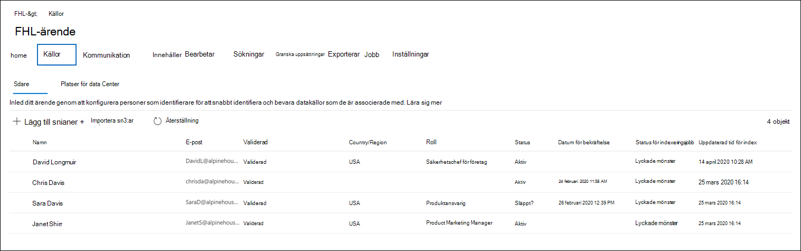
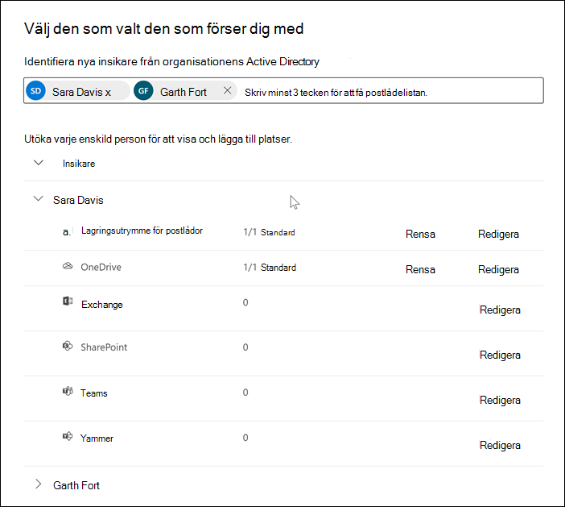
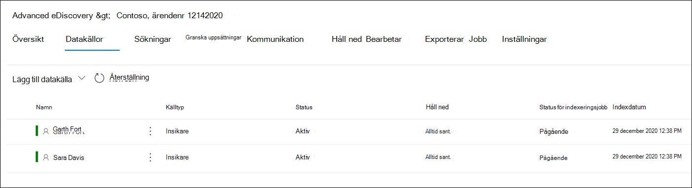

# Lägga till vårdnadshavare till ett Advanced eDiscovery ärendeAdd custodians to an Advanced eDiscovery case

Använd det inbyggda dokumenthanteringsverktyget i Advanced eDiscovery för att samordna arbetsflödena med att hantera dokumentare och identifiera relevanta, dokumentbaserade datakällor som är associerade med ett ärende.Use the built-in custodian management tool in Advanced eDiscovery to coordinate your workflows around managing custodians and identifying relevant, custodial data sources associated with a case. När du lägger till en vårdnadshavare kan systemet automatiskt identifiera och placera ett förvaringsställe på Exchange postlåda och OneDrive för företag konto.When you add a custodian, the system can automatically identify and place a hold on their Exchange mailbox and OneDrive for Business account. Under identifieringen av din undersökning kan du även identifiera andra datakällor (till exempel postlådor, webbplatser eller Teams) som en vårdnadshavare har åtkomst till eller bidragit till.During the discovery process of your investigation, you might also identify other data sources (such as mailboxes, sites, or Teams) that a custodian accessed or contributed to. I det här fallet kan du använda verktyget för systemhantering för att associera dessa datakällor med en specifik vårdnadshavare.In this situation, you can use the custodian management tool to associate those data sources will a specific custodian. När du har lagt till biblioteksassistenter till ett ärende och associerar andra datakällor med dem, kan du snabbt bevara data och söka i de ursprungliga data.After you add custodians to a case and associate other data source with them, you can quickly preserve data and search the custodial data.

Du kan lägga till och hantera projektionerna i Advanced eDiscovery fall i fyra steg:You can add and manage custodians in Advanced eDiscovery cases in four steps:

1. Identifiera de inserna.Identify the custodians.

2. Välj geografiska dataplatser.Choose custodian data locations.

3. Konfigurera inställningar för att hålla på/Configure hold settings.

4. Granska de spåarna och slutför processen.Review the custodians and complete the process.

   

## Kontrollera att du har de behörigheter som krävsMake sure you have the necessary permissions

Du måste vara medlem i rollgruppen för eDiscovery Manager för att kunna lägga till biblioteksansvariga i ett ärende.To add custodians to a case, you must be a member of the eDiscovery Manager role group. Då har du rätt behörighet att lägga till läsare i ett ärende och skapa plats för de aktuella datakällorna.This provides you with the necessary permissions to add custodians to a case and place a hold on the custodial data sources. Mer information finns i [Tilldela eDiscovery-behörigheter](get-started-with-advanced-ediscovery.md#step-2-assign-ediscovery-permissions).For more information, see [Assign eDiscovery permissions](get-started-with-advanced-ediscovery.md#step-2-assign-ediscovery-permissions).

## Steg 1: Identifiera identifierareStep 1: Identify custodians

1. Gå till [https://compliance.microsoft.com](https://compliance.microsoft.com) och logga in med ett användarkonto som har tilldelats lämpliga eDiscovery-behörigheter.Go to [https://compliance.microsoft.com](https://compliance.microsoft.com) and sign in with a user account that has been assigned the appropriate eDiscovery permissions.

2. I det vänstra navigeringsfönstret i Microsoft 365 kompatibilitetscenter klickar du på **Visa alla** och sedan på **eDiscovery > Advanced**.In the left navigation pane of the Microsoft 365 compliance center, click **Show all**, and then click **eDiscovery > Advanced**.

3. På **Advanced eDiscovery** klickar du på **fliken Ärenden** och väljer sedan det ärende du vill lägga till objekt för.On the **Advanced eDiscovery** page, click the **Cases** tab, and then select the case that you want to add custodians to.

4. Klicka på **fliken Datakällor** och sedan på Lägg **till datakälla Lägg till** nya  >  **biblioteksarier**.Click the **Data sources** tab and then click **Add data source** > **Add new custodians**.

5. Lägg till en eller flera användare i organisationen som vårdnadshavare för ärendet genom att skriva den första delen av en persons namn eller alias.Add one or more users in your organization as custodians to the case by typing the first part of a person's name or alias. När du har hittat rätt person väljer du personens namn för att lägga till personen i listan.After you find the correct person, select their name to add them to the list.

## Steg 2: Välj plats för data i rättorStep 2: Choose custodian data locations

När du har valt dokumentadministratörer försöker systemet automatiskt identifiera och verifiera dessa användare och deras datakällor.After you select custodians, the system automatically attempts to identify and verify these users and their data sources. När de har lagt till brevlådor i listan innehåller verktyget automatiskt den primära postlådan och OneDrive för varje vårdnadshavare.After adding custodians to the list, the tool automatically includes the primary mailbox and OneDrive account for each custodian. Du kan välja att inte inkludera dessa datakällor när du lägger till bibliotek i ärendet.You can choose not to include these data sources when adding custodians to the case.

Förutom en vårdnadshavares postlåda och OneDrive-konto kan du också koppla andra dataplatser till en vårdnadshavare, till exempel SharePoint-webbplats eller en Microsoft-grupp där den som är vårdnadshavare är medlem.In addition to a custodian's mailbox and OneDrive account, you can also associate other data locations to a custodian, such as SharePoint site or a Microsoft Team the custodian is a member of. På så sätt kan du bevara, samla in, analysera och granska innehåll i andra datakällor som är kopplade till de aktuella datauppgifterna.This allows you to preserve, collect, analyze, and review content in other data sources associated with the custodians of the case.

Så här avmarkerar du den primära postlådan OneDrive konto för en vårdnadshavare:To deselect the primary mailbox and OneDrive account for a custodian:

1. Utöka den som försöker ta sin plats med sina data och visa de primära dataplatser som automatiskt har kopplats till varje enskild person.Expand the custodian to view the primary data locations that have been automatically associated to each custodian.

2. Välj **Rensa** bredvid **Postlåda eller** **OneDrive** om du vill ta bort en vårdnadshavares postlåda eller OneDrive-konto från att associeras som en dataplats för den här den här objekten.Select **Clear** next to **Mailbox** or **OneDrive** to remove a custodian's mailbox or OneDrive account from being associated as a data location for this custodian.

   

Så här kopplar du andra postlådor, Teams, eller Yammer grupper till en viss användare:To associate other mailboxes, sites, Teams, or Yammer groups to a specific custodian:

1. Utöka en vårdnadshavare för att visa följande tjänster för att associera dataplatser med den som ska göra det.Expand a custodian to display the following services to associate data locations with the custodian. Klicka **på** Redigera bredvid en tjänst för att lägga till en dataplats.Click **Edit** next to a service to add a data location.

   - **Exchange**: Används för att koppla andra postlådor till den som inte är ensam.**Exchange**: Use to associate other mailboxes to the custodian. Skriv in namnet eller aliaset (minst tre tecken) i sökrutan för användarpostlådor eller distributionsgrupper.Type into the search box the name or alias (a minimum of three characters) of user mailboxes or distribution groups. Välj de postlådor som du vill tilldela till den som är användare och klicka sedan på **Lägg till**.Select the mailboxes to assign to the custodian and then click **Add**.

   - **SharePoint:** Används för att koppla SharePoint-webbplatser till den som är vårdnadshavare.**SharePoint**: Use to associate SharePoint sites to the custodian. Välj en webbplats i listan eller sök efter en webbplats genom att skriva en URL i sökrutan.Select a site in the list or search for a site by typing a URL in the search box. Välj de webbplatser som du vill tilldela till den som är användare och klicka sedan på **Lägg till**.Select the sites to assign to the custodian and then click **Add**.

   - **Teams**: Används för att tilldela den Microsoft Teams den som den som för närvarande är medlem i.**Teams**: Use to assign the Microsoft Teams the custodian is currently a member of. Välj de team som du vill tilldela till användare och klicka sedan på Lägg **till**.Select the teams to assign to the custodian and then click **Add**. När du har lagt till ett team identifierar och identifierar systemet automatiskt SharePoint webbplats- och grupppostlådan som är kopplad till den gruppen och tilldelar dem till den insmfördelaren.After you add a team, the system automatically identifies and locates the SharePoint site and group mailbox associated to that team and assigns them to the custodian.

   - **Yammer**: Används för att tilldela de Yammer grupper som den som för närvarande är medlem i.**Yammer**:  Use to assign the Yammer groups the custodian is currently a member of. Markera de grupper som du vill tilldela till den som är användare och klicka sedan på **Lägg till**.Select the groups to assign to the custodian and then click **Add**. När du har lagt till ett team identifierar och letar systemet automatiskt upp den SharePoint-webbplats och grupppostlåda som är kopplad till den gruppen och tilldelar dem till den insmfördelaren.After you add a team, the system automatically identifies and locates the SharePoint site and group mailbox associated to that group and assigns them to the custodian.

   > [!NOTE]
   > Du kan använda **platsväljarna Exchange** och **SharePoint** för att associera andra grupper eller Yammer-grupper (att en vårdnadshavare inte är medlem) till en vårdnadshavare.You can use the **Exchange** and **SharePoint** location pickers to associate other teams or Yammer groups (that a custodian is not a member of) to a custodian. Du måste lägga till både postlådan och webbplatsen som är kopplad till varje grupp eller Yammer grupp.To do this, you have to add both the mailbox and site associated with each team or Yammer group.

2. Du kan visa det totala antalet postlådor, webbplatser, Teams och Yammer-grupper tilldelade till varje vårdnadshavare genom att utöka alla användare i tabellen.You can view the total number of mailboxes, sites, Teams, and Yammer groups assigned to each custodian by expanding each custodian in the table. När du har färdigställt de tilldelade dataplatserna för varje enskild användare kommer de här associationerna att underhållas och användas under samlingen, bearbetningen och granskningsstegen i Advanced eDiscovery arbetsflödet.When you've finalized the assigned data locations for each custodian, these associations will be maintained and used during the collection, processing, and review stages in the Advanced eDiscovery workflow.

3. När du har lagt till konfigurering av deras dataplatser klickar **du** på Nästa för att **gå till sidan Inställningar för förvaring.**After adding custodians and configuring their data locations, click **Next** to go to the **Hold settings** page.  

## Steg 3: Konfigurera inställningar för att hålla nedStep 3: Configure hold settings

 När du har färdigställt de biblioteken och deras dataplatser kan du välja att placera vissa eller alla de inserare i förvaring.After you've finalized the custodians and their data locations, you can place some or all of the custodians on hold. När du placerar en vårdnadshavare i förvaring behålls allt innehåll på alla innehållsplatser som är kopplade till den vårdnadshavare som äger platsen tills du tar bort det bort från platsen eller tills du tar bort den som äger platsen.When you place a custodian on hold, all content in all content locations that are associated with the custodian is preserved until you remove the hold or release the custodian from the hold. I vissa fall kan det vara bra att lägga till dagianer till ett ärende utan att sätta dem i förvaring.In some cases, you may want to add custodians to a case without placing them on hold.

Så här placerar du de sövade biblioteken och datakällorna i förvaring:To place the custodians and data sources on hold:

1. På sidan **Inställningar för** förvaring kan du markera kryssrutan under Kolumnen Håll om du vill att enskilda användare ska kunna ta **del av** det.On the **Hold settings** page, you can apply a hold to individual custodians by selecting the checkbox under the **Hold** column.

   Du kan också markera att alla brevlådor  är förincheckade genom att markera kryssrutan Håll ned högst upp i kolumnen.Alternatively, you can place all custodians on hold by selecting the **Hold** checkbox at the top of the column.

2. Kontrollera att den som har behörighet att hålla i markeringar och klicka sedan på **Nästa.**Verify the custodian hold selections and then click **Next**.

   > [!NOTE]
   > Om du inte lägger ett förvaringsvärde på en källknöjare, läggs den som är den som är associerad med de associerade datakällorna till i ärendet, men innehållet i datakällorna bevaras inte av det håll som är kopplat till ärendet.If you don't place a hold on a custodian, the custodian and their associated data sources will be added to the case but the content in those data sources won't preserved by the hold that associated with the case.

## Steg 4: Granska de andrerna och slutför processenStep 4: Review the custodians and complete the process

Innan du lägger till licenserna i ärendet kan du granska listan över biblioteksarier, de dataplatser som tilldelats dem och inställningarna för att hålla kvar.Before you actually add the custodians to the case, you can review the list of custodians, the data locations assigned to them, and the hold settings.

1. Verifiera och granska alla datakällor och inställningen för förvaring som gäller för varje enskild person i tabellen.Verify and review all the data sources count and the hold setting associated with each custodian in the table. Om det behövs går du tillbaka till **sidorna Identifiera identifierare** eller **inställningar för håll** för att göra ändringar.If necessary, go back to the **Identify custodian** or **Hold settings** pages to make any changes.

2. Klicka **på Skicka** om du vill lägga till vårdnadshavare och deras dataplatser i ärendet, och tillämpa alla inställningar för för infalloläge.Click **Submit** to add custodians and their data locations to the case and apply all custodial hold settings.

   De nya bibliotekserna läggs till i ärendet och visas på **fliken Datakällor.**The new custodians are added to the case and displayed on the **Data sources** tab.

   
