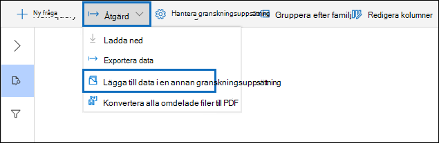
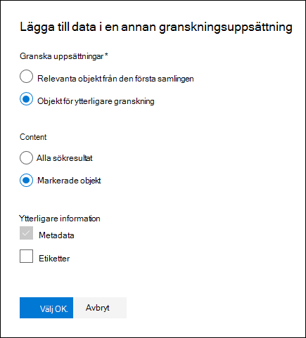

# Lägga till data i en granskningsuppsättning från en annan granskningsuppsättning

I vissa fall kan det vara nödvändigt att välja dokument från en granskningsuppsättning och arbeta med dem enskilt i en annan granskningsuppsättning. Det här är särskilt användbart om du har tagit bort innehåll i en granskningsuppsättning och vill köra analyser på delmängden data.

Följ arbetsflödet i den här artikeln om du vill lägga till innehåll från en granskningsuppsättning till en annan.

## Skapa en granskningsuppsättning

Innan du börjar måste du skapa en granskningsuppsättning där du kan lägga till data.  En ny granskningsuppsättning kan läggas till på **fliken Granska för** ärendet. Mer information finns i [Skapa en granskningsuppsättning](managing-review-sets.md#create-a-review-set).

## Steg 1: Identifiera innehåll som du vill lägga till i en annan granskningsuppsättning

Du kan lägga till innehåll från en granskningsuppsättning till en annan genom att välja specifika dokument i källgranskningsuppsättningen eller genom att markera alla objekt som returneras av en granskningsuppsättningsfråga. Om du vill lägga till markerade objekt markerar du objekten, väljer **Åtgärd** och väljer sedan Lägg till **i en annan granskningsuppsättning**.

## Steg 2: Ange alternativ för att lägga till i en annan granskningsuppsättning

Välj den **granskningsuppsättning som du vill lägga** till objekt i på den utfällade sidan Lägg till i ytterligare granskningsalternativ. Välj om du vill **lägga till Alla sökresultat** eller Markerade **objekt**.  **Med ytterligare information** får du alternativ för att ta med alla  metadata från objekten och om du vill ta med taggarna (genom att markera kryssrutan Etiketter) från källgranskningsuppsättningen när dokumenten läggs till i den nya granskningsuppsättningen.  

När du klickar **på Ok** skapas ett nytt jobb (med namnet Lägga till **data** i en annan granskningsuppsättning) för att lägga till innehållet i en annan granskningsuppsättning. Du kan gå till fliken **Jobb** och övervaka förloppet för det här jobbet. Mer information finns i [Hantera jobb.](managing-jobs-ediscovery20.md)
