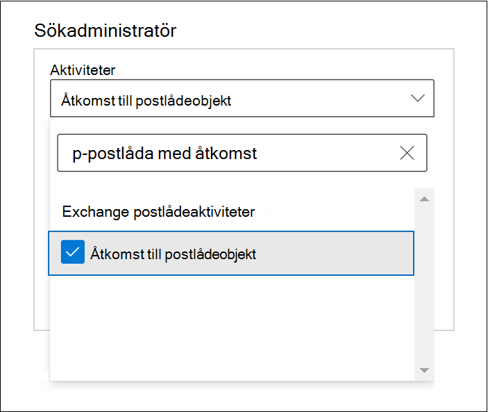
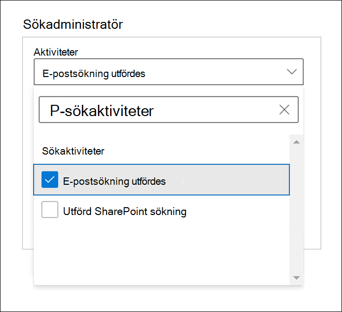
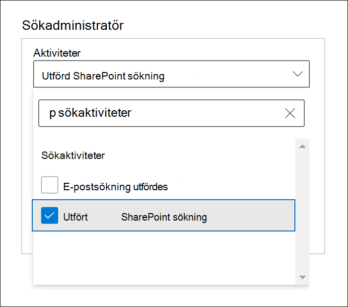

# Avancerad granskning i Microsoft 365

Med [den enhetliga granskningsfunktionen](search-the-audit-log-in-security-and-compliance.md) i Microsoft 365 får organisationer insyn i många typer av granskade aktiviteter i många olika tjänster i Microsoft 365. Med Avancerad granskning får organisationer möjlighet att utföra tekniska undersökningar och efterlevnadsundersökningar med längre kvarhållning för de granskningsloggar som behövs för att utföra en undersökning, åtkomst till viktiga händelser som hjälper till att fastställa intrångets omfattning och snabbare åtkomst till Office 365 Management Activity-API:et.

> [!NOTE]
> Avancerad granskning är tillgängligt för organisationer med en prenumeration på Office 365 E5/A5/G5 eller Microsoft 365 Enterprise E5/A5/G5. Dessutom kan en tilläggslicens för Microsoft 365 E5/A5/G5 Compliance eller E5/A5/G5 eDiscovery och granskning tilldelas till användare när licenser per användare krävs för funktioner i Avancerad granskning. Det gäller till exempel för långsiktig kvarhållning av granskningsloggar och för åtkomst till viktiga händelser för undersökningar. Mer information om licensering finns i: - [Licenskrav för avancerad granskning](auditing-solutions-overview.md#licensing-requirements) - [Vägledning för säkerhet och efterlevnad med licensiering i Microsoft 365.](/office365/servicedescriptions/microsoft-365-service-descriptions/microsoft-365-tenantlevel-services-licensing-guidance/microsoft-365-security-compliance-licensing-guidance#advanced-audit)

Den här artikeln innehåller en översikt över funktioner i Avancerad granskning och visar hur du konfigurerar användare för Avancerad granskning.

## Långsiktig kvarhållning av granskningsloggar

Avancerad granskning bevarar alla granskningsposter för Exchange, SharePoint och Azure Active Directory i ett år. Detta görs med en standardkvarhållningsprincip för granskningsloggar som bevarar alla granskningsposter som innehåller värdet **Exchange**, **SharePoint** eller **AzureActiveDirectory** för egenskapen **Arbetsbelastning** (vilket anger i vilken tjänst aktiviteten inträffade) i ett år. Att bevara granskningsposter under en längre period kan vara till hjälp vid pågående tekniska undersökningar och efterlevnadsundersökningar. Mer information finns i avsnittet Standardkvarhållningsprincip för granskningsloggar i [Hantera kvarhållningsprinciper för granskningsloggar](audit-log-retention-policies.md#default-audit-log-retention-policy).

Vi släpper också möjligheten att bevara granskningsloggar i tio år. Den tioåriga kvarhållningen av granskningsloggar bidrar till att stödja långa undersökningar och hantera regelmässiga, juridiska och interna skyldigheter.

> [!NOTE]
> För att bevara granskningsloggar i tio år krävs en tilläggslicens. Mer information finns i avsnittet [Vanliga frågor och svar om Avancerad granskning](#faqs-for-advanced-audit) i den här artikeln.

### Kvarhållningsprinciper för granskningsloggar

Alla granskningsposter som genereras i andra tjänster och som inte omfattas av standardkvarhållningsprincipen för granskningsloggar (som beskrivs i föregående avsnitt) bevaras i 90 dagar. Men du kan skapa anpassade kvarhållningsprinciper för granskningsloggar om du vill bevara andra granskningsposter under en längre period (upp till tio år). Du kan skapa en princip för att bevara granskningsposter baserat på ett eller flera av följande villkor:

- Microsoft 365-tjänsten där de granskade aktiviteterna inträffar.

- Specifika granskade aktiviteter.

- Användaren som utför en granskad aktivitet.

Du kan också ange hur lång tid de granskningsposter som matchar principen ska bevaras och ange en prioritetsnivå så att vissa principer prioriteras framför andra. Observera också att eventuella anpassade kvarhållningsprinciper för granskningsloggar prioriteras framför standardkvarhållningsprincipen för granskning om du behöver bevara Exchange-, SharePoint- eller Azure Active Directory-granskningsposter i mindre än ett år (eller i tio år) för vissa eller alla användare i organisationen. Mer information finns i [Hantera kvarhållningsprinciper för granskningsloggar](audit-log-retention-policies.md).

## Tillgång till viktiga händelser för undersökningar

Avancerad granskning hjälper organisationer att utföra tekniska undersökningar och efterlevnadsundersökningar genom att ge åtkomst till viktiga händelser som när e-postobjekt har använts, besvarats och vidarebefordrats samt när och vad en användare har sökt efter i Exchange Online och SharePoint Online. De här viktiga händelserna kan hjälpa dig att undersöka möjliga intrång och avgöra intrångets omfattning.  Avancerad granskning innehåller följande viktiga händelser:

- [MailItemsAccessed](#mailitemsaccessed)

- [Send](#send)

- [SearchQueryInitiatedExchange](#searchqueryinitiatedexchange)*

- [SearchQueryInitiatedSharePoint](#searchqueryinitiatedsharepoint)*

> [!NOTE]
> * För närvarande är den här händelsen inte tillgänglig i Office 365- och Microsoft 365-myndighetsmiljöer. Detta omfattar GCC-, GCC High- och DoD-miljöer.

### MailItemsAccessed

Händelsen MailItemsAccessed är en granskningsåtgärd för postlådor som utlöses när e-postdata används av e-postprotokoll och e-postklienter. Åtgärden MailItemsAccessed kan hjälpa utredare att identifiera dataintrång och fastställa hur många meddelanden som kan ha komprometterats. Om en angripare får åtkomst till e-postmeddelanden utlöses åtgärden MailItemsAccessed även om det inte finns någon uttrycklig signal om att meddelandena faktiskt har lästs (d.v.s. att typen av åtkomst, till exempel en bindning eller en synkronisering har registrerats i granskningsposten).

Postlådeåtgärden MailItemsAccessed ersätter MessageBind i granskningsloggningen för postlådor i Exchange Online och ger följande förbättringar:

- MessageBind kunde bara konfigureras för användarinloggningstypen AuditAdmin. Den tillämpades inte för ombuds- eller ägaråtgärder. MailItemsAccessed tillämpas för alla inloggningstyper.

- MessageBind omfattade endast åtkomst av en e-postklient. Den gällde inte för synkroniseringsaktiviteter. MailItemsAccessed-händelser utlöses av både åtkomsttypen bindning och synkronisering.

- MessageBind-åtgärderna gjorde att flera granskningsposter skapades vid användning av samma e-postmeddelande, vilket resulterade i mycket ”brus”. MailItemsAccessed-händelser däremot aggregeras till färre granskningsposter.

Information om granskningsposter för MailItemsAccessed-aktiviteter finns i [Undersöka komprometterade konton med hjälp av Avancerad granskning](mailitemsaccessed-forensics-investigations.md).

Om du vill söka efter MailItemsAccessed-granskningsposter kan du söka efter aktiviteten **Öppnade objekt i postlådan** i listrutan **Aktiviteter för Exchange-postlåda** i [sökverktyget för granskningsloggar](search-the-audit-log-in-security-and-compliance.md) i Microsoft 365 Efterlevnadscenter.

Du kan också köra kommandot [Search-UnifiedAuditLog -Operations MailItemsAccessed](/powershell/module/exchange/search-unifiedauditlog) eller [Search-MailboxAuditLog -Operations MailItemsAccessed](/powershell/module/exchange/search-mailboxauditlog) i Exchange Online PowerShell.

### Send

Händelsen Send är också en granskningsåtgärd för postlådor. Den utlöses när en användare utför någon av följande åtgärder:

- Skickar ett e-postmeddelande

- Svarar på ett e-postmeddelande

- Vidarebefordrar ett e-postmeddelande

Utredare kan använda händelsen Send till att identifiera e-post som skickas från ett komprometterat konto. Granskningsposten för en Send-händelse innehåller information om meddelandet, till exempel när meddelandet skickades, ID för Internetmeddelande, ämnesraden och om meddelandet innehöll bifogade filer. Granskningsinformationen hjälper utredare att identifiera information om e-postmeddelanden som skickats från ett komprometterat konto eller som skickats av en angripare. Dessutom kan utredarna använda ett Microsoft 365 eDiscovery-verktyg för att söka efter meddelandet (med hjälp av ämnesraden eller meddelande-ID) och identifiera det skickade meddelandets mottagare och faktiska innehåll.

Om du vill söka efter Send-granskningsposter kan du söka efter aktiviteten **Meddelande skickat** i listrutan **Aktiviteter för Exchange-postlåda** i [sökverktyget för granskningsloggar](search-the-audit-log-in-security-and-compliance.md) i Microsoft 365 Efterlevnadscenter.

Du kan också köra kommandot [Search-UnifiedAuditLog -Operations Send](/powershell/module/exchange/search-unifiedauditlog) eller [Search-MailboxAuditLog -Operations Send](/powershell/module/exchange/search-mailboxauditlog) i Exchange Online PowerShell.

### SearchQueryInitiatedExchange

Händelsen SearchQueryInitiatedExchange utlöses när en person använder Outlook för att söka efter objekt i en postlåda. Händelser utlöses när sökningar utförs i följande Outlook-miljöer:

- Outlook (skrivbordsklient)

- Outlook på webben (OWA)

- Outlook för iOS

- Outlook för Android

- E-postprogram för Windows 10

Utredare kan använda händelsen SearchQueryInitiatedExchange för att ta reda om en angripare som kan ha komprometterat ett konto sökte efter eller försökte komma åt känslig information i postlådan. Granskningsposten för en SearchQueryInitiatedExchange-händelse innehåller information som den faktiska texten i sökfrågan. Granskningsposten anger också i vilken Outlook-miljö sökningen utfördes. Genom att titta på angriparens sökfrågor kan utredaren se vilken information angriparen var ute efter och få en bättre förståelse för syftet.

Om du vill söka efter SearchQueryInitiatedExchange-granskningsposter kan du söka efter aktiviteten **Performed email search** (Utförd e-postsökning) i listrutan **Search activities** (Sökaktiviteter) i [sökverktyget för granskningsloggar](search-the-audit-log-in-security-and-compliance.md) i efterlevnadscentret.

Du kan också köra [Search-UnifiedAuditLog -Operations SearchQueryInitiatedExchange](/powershell/module/exchange/search-unifiedauditlog) i Exchange Online PowerShell.

> [!NOTE]
> Du måste aktivera loggen för SearchQueryInitiatedExchange så att du kan söka efter den här händelsen i granskningsloggen. Anvisningar finns i [Konfigurera avancerad granskning](set-up-advanced-audit.md#step-2-enable-crucial-events).

### SearchQueryInitiatedSharePoint

Precis som vid sökningar efter postlådeobjekt utlöses händelsen SearchQueryInitiatedSharePoint när en person söker efter objekt i SharePoint. Händelser utlöses när sökningar utförs i följande typer av SharePoint-webbplatser:

- Startwebbplatser

- Kommunikationswebbplatser

- Navplatser

- Webbplatser som är associerade med Microsoft Teams

Med händelsen SearchQueryInitiatedSharePoint kan utredare ta reda på om angriparen försökte hitta (och kanske lyckades komma åt) känslig information i SharePoint. Granskningsposten för en SearchQueryInitiatedSharePoint-händelse innehåller också den faktiska texten i sökfrågan. I granskningsposten anges också vilken typ av SharePoint-webbplats som genomsökts. Genom att titta på angriparens sökfrågor kan utredaren se vilken information angriparen var ute efter och få en bättre förståelse för omfattningen och syftet.

Om du vill söka efter SearchQueryInitiatedSharePoint-granskningsposter kan du söka efter aktiviteten **Performed SharePoint search** (Utförd SharePoinst-sökning) i listrutan **Search activities** (Sökaktiviteter) i [sökverktyget för granskningsloggar](search-the-audit-log-in-security-and-compliance.md) i efterlevnadscentret.

Du kan också köra [Search-UnifiedAuditLog -Operations SearchQueryInitiatedSharePoint](/powershell/module/exchange/search-unifiedauditlog) i Exchange Online PowerShell.

> [!NOTE]
> Du måste aktivera loggen för SearchQueryInitiatedSharePoint så att du kan söka efter den här händelsen i granskningsloggen. Anvisningar finns i [Konfigurera avancerad granskning](set-up-advanced-audit.md#step-2-enable-crucial-events).

## Åtkomst med hög bandbredd till Office 365 Management Activity-API

Organisationer som kommer åt granskningsloggar via Office 365 Management Activity-API:t har begränsats genom gränser på utgivarnivån. Det innebär att för utgivare som hämtar data åt flera kunders delades gränsen av alla dessa kunder.

I och med lanseringen av Avancerad granskning börjar vi använda en gräns på innehavarnivå i stället för på utgivarnivå. Det innebär att varje organisation får en egen tilldelad bandbreddskvot för åtkomst till sina granskningsdata. Bandbredden är inte en statisk, fördefinierad gräns men modelleras på en kombination av faktorer, bland annat antalet platser i organisationen och att E5/A5/G5-organisationer får mer bandbredd än icke-E5/A5/G5-organisationer.

Alla organisationer tilldelas inledningsvis en baslinje med 2 000 begäranden per minut. Den här gränsen ökar dynamiskt beroende på hur många licenser organisationen har och på licensprenumerationen. E5/A5/G5-organisationer får ungefär två gånger så mycket bandbredd som icke-E5/A5/G5-organisationer. Det kommer också att finnas en övre bandbreddsgräns för att skydda tjänsten.

Mer information finns i avsnittet om API-begränsning i [referensen för Office 365 Management Activity-API](/office/office-365-management-api/office-365-management-activity-api-reference#api-throttling).

## Vanliga frågor och svar om Avancerad granskning

**Behöver varje användare en E5/A5/G5-licens för att kunna dra nytta av Avancerad granskning?**

För att kunna dra nytta av funktionerna i Avancerad granskning på användarnivå måste användaren ha tilldelats en E5/A5/G5-licens. En del funktioner kontrollerar om användaren har rätt licens innan funktionen visas för användaren. Om du till exempel försöker hämta granskningsposter för en användare som inte har tilldelats rätt licens i mer än 90 dagar returnerar systemet ett felmeddelande.

**Min organisation har en E5/A5/G5-prenumeration. Behöver jag göra något för att få åtkomst till granskningsposter för viktiga händelser?**

För kvalificerade kunder och användare som har tilldelats rätt licens krävs ingen åtgärd för att få åtkomst till viktiga granskningshändelser.

**Vad händer med min organisations granskningsloggdata om jag har skapat en tioårig kvarhållningsprincip för granskningsloggar när funktionen var allmänt tillgänglig men innan den nödvändiga tilläggslicensen blev tillgänglig?**

Alla granskningsloggdata som omfattas av den tioåriga kvarhållningsprincipen för granskningsloggar som du har skapat efter att funktionen blev allmänt tillgänglig i sista kvartalet 2020 bevaras i tio år. Detta inkluderar de tioåriga kvarhållningsprinciper för granskningsloggar som skapades innan den nödvändiga tilläggslicensen blev tillgänglig för köp. Men eftersom den tioåriga tilläggslicensen för kvarhållning av granskningsloggar nu är tillgänglig måste du köpa och tilldela dessa tilläggslicenser för alla användare vars granskningsdata omfattas av en tioårig kvarhållningsprincip för granskning.

**Är de nya händelserna i Avancerad granskning tillgängliga i Office 365 Management Activity-API:et?**

Ja. Så länge granskningsposterna skapas för användare med rätt licens kan du komma åt dessa poster via Office 365 Management Activity-API:et.

**Innebär högre bandbredd bättre svarstid eller högre SLA?**

För närvarande ger hög bandbredd en bättre pipeline, särskilt för organisationer med stora mängder granskningssignaler och betydande förbrukningsmönster. Mer bandbredd kan leda till bättre svarstid. Men det finns inget SLA som är associerat med hög bandbredd. Standardsvarstider har dokumenterats och dessa svarstider ändras inte i och med lanseringen av Avancerad granskning.
