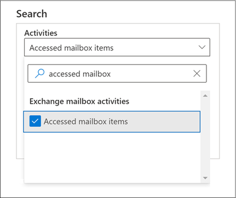

# Avancerad granskning i Microsoft 365Advanced Audit in Microsoft 365

Med [den enhetliga granskningsfunktionen](search-the-audit-log-in-security-and-compliance.md) i Microsoft 365 får organisationer insyn i många typer av granskade aktiviteter i många olika tjänster i Microsoft 365.The [unified auditing functionality](search-the-audit-log-in-security-and-compliance.md) in Microsoft 365 provides organizations with visibility into many types of audited activities across many different services in Microsoft 365. Med Avancerad granskning får organisationer möjlighet att utföra tekniska undersökningar och efterlevnadsundersökningar med längre kvarhållning för de granskningsloggar som behövs för att utföra en undersökning, åtkomst till viktiga händelser som hjälper till att fastställa intrångets omfattning och snabbare åtkomst till Office 365 Management Activity-API:et.Advanced Audit helps organizations to conduct forensic and compliance investigations by increasing audit log retention required to conduct an investigation, providing access to crucial events that help determine scope of compromise, and faster access to Office 365 Management Activity API.

> [!NOTE]
> Avancerad granskning är tillgängligt för organisationer med en prenumeration på Office 365 E5/G5 eller Microsoft 365 Enterprise E5/G5.Advanced Audit is available for organizations with an Office 365 E5/G5 or Microsoft 365 Enterprise E5/G5 subscription. Dessutom kan en tilläggslicens för Microsoft 365 E5 Compliance eller E5 eDiscovery och granskning tilldelas till användare när licenser per användare krävs för funktioner i Avancerad granskning. Det gäller till exempel för långsiktig kvarhållning av granskningsloggar och för åtkomst till viktiga händelser för undersökningar.Additionally, a Microsoft 365 E5 Compliance or E5 eDiscovery and Audit add-on license can be assigned to users when per-user licensing is required for Advanced Audit features as is the case for long-term retention of audit logs and access to crucial events for investigations. Mer information om licensiering finns i [Vägledning för säkerhet och efterlevnad med licensiering i Microsoft 365](/office365/servicedescriptions/microsoft-365-service-descriptions/microsoft-365-tenantlevel-services-licensing-guidance/microsoft-365-security-compliance-licensing-guidance#advanced-audit).For more information about licensing, see [Microsoft 365 licensing guidance for security & compliance](/office365/servicedescriptions/microsoft-365-service-descriptions/microsoft-365-tenantlevel-services-licensing-guidance/microsoft-365-security-compliance-licensing-guidance#advanced-audit).

Den här artikeln innehåller en översikt över funktioner i Avancerad granskning och visar hur du konfigurerar användare för Avancerad granskning.This article provides an overview of Advanced Audit capabilities and shows you how to set up users for Advanced Audit.

## Långsiktig kvarhållning av granskningsloggarLong-term retention of audit logs

Avancerad granskning bevarar alla granskningsposter för Exchange, SharePoint och Azure Active Directory i ett år.Advanced Audit retains all Exchange, SharePoint, and Azure Active Directory audit records for one year. Detta görs med en standardkvarhållningsprincip för granskningsloggar som bevarar alla granskningsposter som innehåller värdet **Exchange**, **SharePoint** eller **AzureActiveDirectory** för egenskapen **Arbetsbelastning** (vilket anger i vilken tjänst aktiviteten inträffade) i ett år.This is accomplished by a default audit log retention policy that retains any audit record that contains the value of **Exchange**, **SharePoint**, or **AzureActiveDirectory** for the **Workload** property (which indicates the service in which the activity occurred) for one year. Att bevara granskningsposter under en längre period kan vara till hjälp vid pågående tekniska undersökningar och efterlevnadsundersökningar.Retaining audit records for longer periods can help with on-going forensic or compliance investigations. Mer information finns i avsnittet Standardkvarhållningsprincip för granskningsloggar i [Hantera kvarhållningsprinciper för granskningsloggar](audit-log-retention-policies.md#default-audit-log-retention-policy).For more information, see the "Default audit log retention policy" section in [Manage audit log retention policies](audit-log-retention-policies.md#default-audit-log-retention-policy).

Vi släpper också möjligheten att bevara granskningsloggar i tio år.We're also releasing the capability to retain audit logs for 10 years. Den tioåriga kvarhållningen av granskningsloggar bidrar till att stödja långa undersökningar och hantera regelmässiga, juridiska och interna skyldigheter.The 10-year retention of audit logs helps support long running investigations and respond to regulatory, legal, and internal obligations.

> [!NOTE]
> För att bevara granskningsloggar i tio år krävs en tilläggslicens.Retaining audit logs for 10 years will require an additional add-on license. Mer information finns i avsnittet [Vanliga frågor och svar om Avancerad granskning](#faqs-for-advanced-audit) i den här artikeln.For more information, see the [FAQs for Advanced Audit](#faqs-for-advanced-audit) section in this article.

### Kvarhållningsprinciper för granskningsloggarAudit log retention policies

Alla granskningsposter som genereras i andra tjänster och som inte omfattas av standardkvarhållningsprincipen för granskningsloggar (som beskrivs i föregående avsnitt) bevaras i 90 dagar.All audit records generated in other services that aren't covered by the default audit log retention policy (described in the previous section) are retained for 90 days. Men du kan skapa anpassade kvarhållningsprinciper för granskningsloggar om du vill bevara andra granskningsposter under en längre period (upp till tio år).But you can create customized audit log retention policies to retain other audit records for longer periods of time up to 10 years. Du kan skapa en princip för att bevara granskningsposter baserat på ett eller flera av följande villkor:You can create a policy to retain audit records based on one or more of the following criteria:

- Microsoft 365-tjänsten där de granskade aktiviteterna inträffar.The Microsoft 365 service where the audited activities occur.

- Specifika granskade aktiviteter.Specific audited activities.

- Användaren som utför en granskad aktivitet.The user who performs an audited activity.

Du kan också ange hur lång tid de granskningsposter som matchar principen ska bevaras och ange en prioritetsnivå så att vissa principer prioriteras framför andra.You can also specify how long to retain audit records that match the policy and a priority level so that specific policies will take priority over other policies. Observera också att eventuella anpassade kvarhållningsprinciper för granskningsloggar prioriteras framför standardkvarhållningsprincipen för granskning om du behöver bevara Exchange-, SharePoint- eller Azure Active Directory-granskningsposter i mindre än ett år (eller i tio år) för vissa eller alla användare i organisationen.Also note that any custom audit log retention policy will take precedence over the default audit retention policy in case you need retain Exchange, SharePoint, or Azure Active Directory audit records for less than a year (or for 10 years) for some or all users in your organization. Mer information finns i [Hantera kvarhållningsprinciper för granskningsloggar](audit-log-retention-policies.md).For more information, see [Manage audit log retention policies](audit-log-retention-policies.md).

## Tillgång till viktiga händelser för undersökningarAccess to crucial events for investigations

Avancerad granskning hjälper organisationer att utföra tekniska undersökningar och efterlevnadsundersökningar genom att ge åtkomst till viktiga händelser som när e-postobjekt har använts, besvarats och vidarebefordrats samt när och vad en användare har sökt efter i Exchange Online och SharePoint Online.Advanced Audit helps organizations to conduct forensic and compliance investigations by providing access to crucial events such as when mail items were accessed, or when mail items were replied to and forwarded, and when and what a user searched for in Exchange Online and SharePoint Online. De här viktiga händelserna kan hjälpa dig att undersöka möjliga intrång och avgöra intrångets omfattning.These crucial events can help you investigate possible breaches and determine the scope of compromise.  Avancerad granskning innehåller följande viktiga händelser:Advanced Auditing provides the following crucial events:

- [MailItemsAccessedMailItemsAccessed](#mailitemsaccessed)

- [SendSend](#send)

- [SearchQueryInitiatedExchange](#searchqueryinitiatedexchange)\*[SearchQueryInitiatedExchange](#searchqueryinitiatedexchange)\*

- [SearchQueryInitiatedSharePoint](#searchqueryinitiatedsharepoint)\*[SearchQueryInitiatedSharePoint](#searchqueryinitiatedsharepoint)\*

> [!NOTE]
> \* För närvarande är den här händelsen inte tillgänglig i Office 365- och Microsoft 365-myndighetsmiljöer.\* At this time, this event isn't available in Office 365 and Microsoft 365 Government environments. Detta omfattar GCC-, GCC High- och DoD-miljöer.This includes GCC, GCC High, and DoD environments.

### MailItemsAccessedMailItemsAccessed

Händelsen MailItemsAccessed är en granskningsåtgärd för postlådor som utlöses när e-postdata används av e-postprotokoll och e-postklienter.The MailItemsAccessed event is a mailbox auditing action and is triggered when mail data is accessed by mail protocols and mail clients. Åtgärden MailItemsAccessed kan hjälpa utredare att identifiera dataintrång och fastställa hur många meddelanden som kan ha komprometterats.The MailItemsAccessed action can help investigators identify data breaches and determine the scope of messages that may have been compromised. Om en angripare får åtkomst till e-postmeddelanden utlöses åtgärden MailItemsAccessed även om det inte finns någon uttrycklig signal om att meddelandena faktiskt har lästs (d.v.s. att typen av åtkomst, till exempel en bindning eller en synkronisering har registrerats i granskningsposten).If an attacker gained access to email messages, the MailItemsAccessed action will be triggered even if there is no explicit signal that messages were actually read (in other words, the type of access such as a bind or sync is recorded in the audit record).

Postlådeåtgärden MailItemsAccessed ersätter MessageBind i granskningsloggningen för postlådor i Exchange Online och ger följande förbättringar:The MailItemsAccessed mailbox action replaces MessageBind in mailbox auditing logging in Exchange Online and provides these improvements:

- MessageBind kunde bara konfigureras för användarinloggningstypen AuditAdmin. Den tillämpades inte för ombuds- eller ägaråtgärder.MessageBind was only configurable for AuditAdmin user logon type; it did not apply to delegate or owner actions. MailItemsAccessed tillämpas för alla inloggningstyper.MailItemsAccessed applies to all logon types.

- MessageBind omfattade endast åtkomst av en e-postklient.MessageBind only covered access by a mail client. Den gällde inte för synkroniseringsaktiviteter.It didn't apply to sync activities. MailItemsAccessed-händelser utlöses av både åtkomsttypen bindning och synkronisering.MailItemsAccessed events are triggered by both bind and sync access types.

- MessageBind-åtgärderna gjorde att flera granskningsposter skapades vid användning av samma e-postmeddelande, vilket resulterade i mycket ”brus”.MessageBind actions would trigger the creation of multiple audit records when the same email message was accessed, which resulted in auditing "noise". MailItemsAccessed-händelser däremot aggregeras till färre granskningsposter.In contrast, MailItemsAccessed events are aggregated into fewer audit records.

Information om granskningsposter för MailItemsAccessed-aktiviteter finns i [Undersöka komprometterade konton med hjälp av Avancerad granskning](mailitemsaccessed-forensics-investigations.md).For information about audit records for MailItemsAccessed activities, see [Use Advanced Audit to investigate compromised accounts](mailitemsaccessed-forensics-investigations.md).

Om du vill söka efter MailItemsAccessed-granskningsposter kan du söka efter aktiviteten **Öppnade objekt i postlådan** i listrutan **Aktiviteter för Exchange-postlåda** i [sökverktyget för granskningsloggar](search-the-audit-log-in-security-and-compliance.md) i Microsoft 365 Efterlevnadscenter.To search for MailItemsAccessed audit records, you can search for the **Accessed mailbox items** activity in the **Exchange mailbox activities** drop-down list in the [audit log search tool](search-the-audit-log-in-security-and-compliance.md) in the Microsoft 365 compliance center.

Du kan också köra kommandot [Search-UnifiedAuditLog -Operations MailItemsAccessed](/powershell/module/exchange/search-unifiedauditlog) eller [Search-MailboxAuditLog -Operations MailItemsAccessed](/powershell/module/exchange/search-mailboxauditlog) i Exchange Online PowerShell.You can also run the [Search-UnifiedAuditLog -Operations MailItemsAccessed](/powershell/module/exchange/search-unifiedauditlog) or [Search-MailboxAuditLog -Operations MailItemsAccessed](/powershell/module/exchange/search-mailboxauditlog) commands in Exchange Online PowerShell.

### SendSend

Händelsen Send är också en granskningsåtgärd för postlådor. Den utlöses när en användare utför någon av följande åtgärder:The Send event is also a mailbox auditing action and is triggered when a user performs one of the following actions:

- Skickar ett e-postmeddelandeSends an email message

- Svarar på ett e-postmeddelandeReplies to an email message

- Vidarebefordrar ett e-postmeddelandeForwards an email message

Utredare kan använda händelsen Send till att identifiera e-post som skickas från ett komprometterat konto.Investigators can use the Send event to identify email sent from a compromised account. Granskningsposten för en Send-händelse innehåller information om meddelandet, till exempel när meddelandet skickades, ID för Internetmeddelande, ämnesraden och om meddelandet innehöll bifogade filer.The audit record for a Send event contains information about the message, such as when the message was sent, the InternetMessage ID, the subject line, and if the message contained attachments. Granskningsinformationen hjälper utredare att identifiera information om e-postmeddelanden som skickats från ett komprometterat konto eller som skickats av en angripare.This auditing information can help investigators identify information about email messages sent from a compromised account or sent by an attacker. Dessutom kan utredarna använda ett Microsoft 365 eDiscovery-verktyg för att söka efter meddelandet (med hjälp av ämnesraden eller meddelande-ID) och identifiera det skickade meddelandets mottagare och faktiska innehåll.Additionally, investigators can use a Microsoft 365 eDiscovery tool to search for the message (by using the subject line or message ID) to identify the recipients the message was sent to and the actual contents of the sent message.

Om du vill söka efter Send-granskningsposter kan du söka efter aktiviteten **Meddelande skickat** i listrutan **Aktiviteter för Exchange-postlåda** i [sökverktyget för granskningsloggar](search-the-audit-log-in-security-and-compliance.md) i Microsoft 365 Efterlevnadscenter.To search for Send audit records, you can search for the **Sent message** activity in the **Exchange mailbox activities** drop-down list in the [audit log search tool](search-the-audit-log-in-security-and-compliance.md) in the Microsoft 365 compliance center.

Du kan också köra kommandot [Search-UnifiedAuditLog -Operations Send](/powershell/module/exchange/search-unifiedauditlog) eller [Search-MailboxAuditLog -Operations Send](/powershell/module/exchange/search-mailboxauditlog) i Exchange Online PowerShell.You can also run the [Search-UnifiedAuditLog -Operations Send](/powershell/module/exchange/search-unifiedauditlog) or [Search-MailboxAuditLog -Operations Send](/powershell/module/exchange/search-mailboxauditlog) commands in Exchange Online PowerShell.

### SearchQueryInitiatedExchangeSearchQueryInitiatedExchange

Händelsen SearchQueryInitiatedExchange utlöses när en person använder Outlook för att söka efter objekt i en postlåda.The SearchQueryInitiatedExchange event is triggered when a person uses Outlook to search for items in a mailbox. Händelser utlöses när sökningar utförs i följande Outlook-miljöer:Events are triggered when searches are performed in the following Outlook environments:

- Outlook (skrivbordsklient)Outlook (desktop client)

- Outlook på webben (OWA)Outlook on the web (OWA)

- Outlook för iOSOutlook for iOS

- Outlook för AndroidOutlook for Android

- E-postprogram för Windows 10Mail app for Windows 10

Utredare kan använda händelsen SearchQueryInitiatedExchange för att ta reda om en angripare som kan ha komprometterat ett konto sökte efter eller försökte komma åt känslig information i postlådan.Investigators can use the SearchQueryInitiatedExchange event to determine if an attacker who may have compromised an account looked for or tried to access sensitive information in the mailbox. Granskningsposten för en SearchQueryInitiatedExchange-händelse innehåller information som den faktiska texten i sökfrågan.The audit record for a SearchQueryInitiatedExchange event contains information such as the actual text of the search query. Granskningsposten anger också i vilken Outlook-miljö sökningen utfördes.The audit record also indicates the Outlook environment the search was performed in. Genom att titta på angriparens sökfrågor kan utredaren se vilken information angriparen var ute efter och få en bättre förståelse för syftet.By looking at the search queries that an attacker may have performed, an investigator can better understand the intent of the email data that was searched for.

Om du vill söka efter SearchQueryInitiatedExchange-granskningsposter kan du söka efter aktiviteten **Performed email search** (Utförd e-postsökning) i listrutan **Search activities** (Sökaktiviteter) i [sökverktyget för granskningsloggar](search-the-audit-log-in-security-and-compliance.md) i efterlevnadscentret.To search for SearchQueryInitiatedExchange audit records, you can search for the **Performed email search** activity in the **Search activities** drop-down list in the [audit log search tool](search-the-audit-log-in-security-and-compliance.md) in the compliance center.

Du kan också köra [Search-UnifiedAuditLog -Operations SearchQueryInitiatedExchange](/powershell/module/exchange/search-unifiedauditlog) i Exchange Online PowerShell.You can also run the [Search-UnifiedAuditLog -Operations SearchQueryInitiatedExchange](/powershell/module/exchange/search-unifiedauditlog) in Exchange Online PowerShell.

> [!NOTE]
> Du måste köra följande kommando i Exchange Online PowerShell så att SearchQueryInitiatedExchange-händelser (som utförs av en viss E5-användare) tas med i resultatet av granskningsloggsökningen: `Set-Mailbox <user identity> -AuditOwner @{Add="SearchQueryInitiated"}`.You must run the following command in Exchange Online PowerShell so that SearchQueryInitiatedExchange events (performed by the specified E5 user) are included in audit log search results: `Set-Mailbox <user identity> -AuditOwner @{Add="SearchQueryInitiated"}`.   
I en Multi-Geo-miljö måste du köra kommandot **Set-Mailbox** i skogen där användarens postlåda finns.In a multi-geo environment, you must run the **Set-Mailbox** command in the forest where the user's mailbox is located. Du identifierar platsen för användarens postlåda genom att köra följande kommando: `Get-Mailbox <user identity> | FL MailboxLocations`.To identify the user's mailbox location, run the following command: `Get-Mailbox <user identity> | FL MailboxLocations`.
Om kommandot `Set-Mailbox -AuditOwner @{Add="SearchQueryInitiated"}` tidigare har körts i en annan skog än den som användarens postlåda finns i måste du först ta bort SearchQueryInitiated-värdet från användarens postlåda (genom att köra `Set-Mailbox -AuditOwner @{Remove="SearchQueryInitiated"}`) och sedan lägga till det i användarens postlåda i den skog där användarens postlåda finns.If the `Set-Mailbox -AuditOwner @{Add="SearchQueryInitiated"}` command was previously run in the forest that's different than the one the user's mailbox is located in, then you must remove the SearchQueryInitiated value from the user's mailbox (by running `Set-Mailbox -AuditOwner @{Remove="SearchQueryInitiated"}`) and then add it to the user's mailbox in the forest where the user's mailbox is located.

### SearchQueryInitiatedSharePointSearchQueryInitiatedSharePoint

Precis som vid sökningar efter postlådeobjekt utlöses händelsen SearchQueryInitiatedSharePoint när en person söker efter objekt i SharePoint.Similar to searching for mailbox items, the SearchQueryInitiatedSharePoint event is triggered when a person searches for items in SharePoint. Händelser utlöses när sökningar utförs i följande typer av SharePoint-webbplatser:Events are triggered when searches are performed in the following types of SharePoint sites:

- StartwebbplatserHome sites

- KommunikationswebbplatserCommunication sites

- NavplatserHub sites

- Webbplatser som är associerade med Microsoft TeamsSites associated with Microsoft Teams

Med händelsen SearchQueryInitiatedSharePoint kan utredare ta reda på om angriparen försökte hitta (och kanske lyckades komma åt) känslig information i SharePoint.Investigators can use the SearchQueryInitiatedSharePoint event to determine if an attacker tried to find (and possibly accessed) sensitive information in SharePoint. Granskningsposten för en SearchQueryInitiatedSharePoint-händelse innehåller också den faktiska texten i sökfrågan.The audit record for a SearchQueryInitiatedSharePoint event contains also contains the actual text of the search query. I granskningsposten anges också vilken typ av SharePoint-webbplats som genomsökts.The audit record also indicates the type of SharePoint site that was searched. Genom att titta på angriparens sökfrågor kan utredaren se vilken information angriparen var ute efter och få en bättre förståelse för omfattningen och syftet.By looking at the search queries that an attacker may have performed, an investigator can better understand the intent and scope of the file data being searched for.

Om du vill söka efter SearchQueryInitiatedSharePoint-granskningsposter kan du söka efter aktiviteten **Performed SharePoint search** (Utförd SharePoinst-sökning) i listrutan **Search activities** (Sökaktiviteter) i [sökverktyget för granskningsloggar](search-the-audit-log-in-security-and-compliance.md) i efterlevnadscentret.To search for SearchQueryInitiatedSharePoint audit records, you can search for the **Performed SharePoint search** activity in the **Search activities** drop-down list in the [audit log search tool](search-the-audit-log-in-security-and-compliance.md) in the compliance center.

Du kan också köra [Search-UnifiedAuditLog -Operations SearchQueryInitiatedSharePoint](/powershell/module/exchange/search-unifiedauditlog) i Exchange Online PowerShell.You can also run the [Search-UnifiedAuditLog -Operations SearchQueryInitiatedSharePoint](/powershell/module/exchange/search-unifiedauditlog) in Exchange Online PowerShell.

> [!NOTE]
> Du måste köra följande kommando i Exchange Online PowerShell så att SearchQueryInitiatedSharePoint-händelser (som utförs av en viss E5-användare) tas med i resultatet av granskningsloggsökningen: `Set-Mailbox <user identity> -AuditOwner @{Add="SearchQueryInitiated"}`.You must run the following command in Exchange Online PowerShell so that SearchQueryInitiatedSharePoint events (performed by the specified E5 user) are included in audit log search results: `Set-Mailbox <user identity> -AuditOwner @{Add="SearchQueryInitiated"}`.   
I en Multi-Geo-miljö måste du köra kommandot **Set-Mailbox** i skogen där användarens postlåda finns.In a multi-geo environment, you must run the **Set-Mailbox** command in the forest where the user's mailbox is located. Du identifierar platsen för användarens postlåda genom att köra följande kommando: `Get-Mailbox <user identity> | FL MailboxLocations`.To identify the user's mailbox location, run the following command: `Get-Mailbox <user identity> | FL MailboxLocations`.
Om kommandot `Set-Mailbox -AuditOwner @{Add="SearchQueryInitiated"}` tidigare har körts i en annan skog än den som användarens postlåda finns i måste du först ta bort SearchQueryInitiated-värdet från användarens postlåda (genom att köra `Set-Mailbox -AuditOwner @{Remove="SearchQueryInitiated"}`) och sedan lägga till det i användarens postlåda i den skog där användarens postlåda finns.If the `Set-Mailbox -AuditOwner @{Add="SearchQueryInitiated"}` command was previously run in the forest that's different than the one the user's mailbox is located in, then you must remove the SearchQueryInitiated value from the user's mailbox (by running `Set-Mailbox -AuditOwner @{Remove="SearchQueryInitiated"}`) and then add it to the user's mailbox in the forest where the user's mailbox is located.

## Åtkomst med hög bandbredd till Office 365 Management Activity-APIHigh-bandwidth access to the Office 365 Management Activity API

Organisationer som kommer åt granskningsloggar via Office 365 Management Activity-API:t har begränsats genom gränser på utgivarnivån.Organizations that access auditing logs through the Office 365 Management Activity API were restricted by throttling limits at the publisher level. Det innebär att för utgivare som hämtar data åt flera kunders delades gränsen av alla dessa kunder.This means that for a publisher pulling data on behalf of multiple customers, the limit was shared by all those customers.

I och med lanseringen av Avancerad granskning börjar vi använda en gräns på innehavarnivå i stället för på utgivarnivå.With the release of Advanced Audit, we're moving from a publisher-level limit to a tenant-level limit. Det innebär att varje organisation får en egen tilldelad bandbreddskvot för åtkomst till sina granskningsdata.The result is that each organization will get their own fully allocated bandwidth quota to access their auditing data. Bandbredden är inte en statisk, fördefinierad gräns utan beror på en kombination av faktorer, bland annat antalet platser i organisationen och att E5-organisationer får mer bandbredd än icke-E5-organisationer.The bandwidth is not a static, predefined limit but is modeled on a combination of factors including the number of seats in the organization and that E5 organizations will get more bandwidth than non-E5 organizations.

Alla organisationer tilldelas inledningsvis en baslinje med 2 000 begäranden per minut.All organizations are initially allocated a baseline of 2,000 requests per minute. Den här gränsen ökar dynamiskt beroende på hur många licenser organisationen har och på licensprenumerationen.This limit will dynamically increase depending on an organization's seat count and their licensing subscription. E5-organisationer får ungefär två gånger så mycket bandbredd som icke-E5-organisationer.E5 organizations will get about twice as much bandwidth as non-E5 organizations. Det kommer också att finnas en övre bandbreddsgräns för att skydda tjänsten.There will also be cap on the maximum bandwidth to protect the health of the service.

Mer information finns i avsnittet om API-begränsning i [referensen för Office 365 Management Activity-API](/office/office-365-management-api/office-365-management-activity-api-reference#api-throttling).For more information, see the "API throttling" section in [Office 365 Management Activity API reference](/office/office-365-management-api/office-365-management-activity-api-reference#api-throttling).

## Konfigurera Avancerad granskning för användareSet up Advanced Audit for users

För Avancerad granskning-funktioner som möjligheten att logga viktiga händelser, till exempel MailItemsAccessed och Send, måste användarna ha tilldelats rätt E5-licens.Advanced Audit features such as the ability to log crucial events such as MailItemsAccessed and Send require an appropriate E5 license assigned to users. Dessutom måste appen/tjänstplanen Advanced Auditing vara aktiverad för dessa användare.Additionally, the Advanced Auditing app/service plan must be enabled for those users. Du kan kontrollera att appen Advanced Auditing har tilldelats användarna genom att utföra följande steg för varje användare:To verify that the Advanced Auditing app is assigned to users, perform the following steps for each user:

1. I [Administrationscenter för Microsoft 365](https://admin.microsoft.com/Adminportal) går du till **Användare** > **Aktiva användare** och väljer en användare.In the [Microsoft 365 admin center](https://admin.microsoft.com/Adminportal), go to **Users** > **Active users**, and select a user.

2. Klicka på **Licenser och appar** på den utfällbara sidan med användaregenskaper.On the user properties flyout page, click **Licenses and apps**.

3. I avsnittet **Licenser** kontrollerar du att användaren har tilldelats en E5-licens.In the **Licenses** section, verify that the user is assigned an E5 license.

4. Visa avsnittet **Appar** och kontrollera att kryssrutan **Microsoft 365 Advanced Auditing** är markerad.Expand the **Apps** section, and verify that the **Microsoft 365 Advanced Auditing** checkbox is selected.

5. Om kryssrutan inte är markerad markerar du den och klickar sedan på **Spara ändringarna**.If the checkbox isn’t selected, select it, and then click **Save changes.**

   Loggning av granskningsposter för MailItemsAccessed, Send och andra viktiga händelser för användaren påbörjas inom 24 timmar.The logging of audit records for MailItemsAccessed, Send, and other crucial events for the user will begin within 24 hours.

Om organisationen tilldelar licenser till grupper av användare med hjälp av gruppbaserad licensiering måste du inaktivera licenstilldelningen för Microsoft 365 Advanced Auditing för gruppen.For organizations that assign licenses to groups of users by using group-based licensing, you have to turn off the licensing assignment for Microsoft 365 Advanced Auditing for the group. När du har sparat ändringarna kontrollerar du att Microsoft 365 Advanced Auditing är inaktiverat för gruppen.After you save your changes, verify that Microsoft 365 Advanced Auditing is turned off for the group. Aktivera sedan licenstilldelningen för gruppen igen.Then turn the licensing assignment for the group back on. Instruktioner för hur du använder gruppbaserad licensiering finns i [Tilldela licenser till användare efter gruppmedlemskap i Azure Active Directory](/azure/active-directory/users-groups-roles/licensing-groups-assign).For instructions about group-based licensing, see [Assign licenses to users by group membership in Azure Active Directory](/azure/active-directory/users-groups-roles/licensing-groups-assign).

Om du har anpassat postlådeåtgärderna som loggas för användarpostlådor eller delade postlådor granskas inte de nya standardåtgärderna som MailItemsAccessed automatiskt för dessa postlådor.Also, if you have customized the mailbox actions that are logged on user mailboxes or shared mailboxes, new default mailbox actions such as MailItemsAccessed will not be automatically audited on those mailboxes. Information om hur du ändrar postlådeåtgärderna som granskas för varje inloggningstyp finns i avsnittet ”Ändra eller återställa postlådeåtgärder som loggas som standard” i [Hantera postlådegranskning](enable-mailbox-auditing.md#change-or-restore-mailbox-actions-logged-by-default).For information about changing the mailbox actions that are audited for each logon type, see the "Change or restore mailbox actions logged by default" section in [Manage mailbox auditing](enable-mailbox-auditing.md#change-or-restore-mailbox-actions-logged-by-default).

## Vanliga frågor och svar om Avancerad granskningFAQs for Advanced Audit

**Behöver varje användare en E5-licens för att kunna dra nytta av Avancerad granskning?****Does every user need an E5 license to benefit from Advanced Audit?**

För att kunna dra nytta av funktionerna i Avancerad granskning på användarnivå måste användaren ha tilldelats en E5-licens.To benefit from user-level Advanced Audit capabilities, a user needs to be assigned an E5 license. En del funktioner kontrollerar om användaren har rätt licens innan funktionen visas för användaren.There are some capabilities that will check for the appropriate license to expose the feature for the user. Om du till exempel försöker hämta granskningsposter för en användare som inte har tilldelats en E5-licens i mer än 90 dagar returnerar systemet ett felmeddelande.For example, if you're trying to retain the audit records for a user who isn't assigned an E5 license for longer than 90 days, the system will return an error message.

**Min organisation har en E5-prenumeration. Behöver jag göra något för att få åtkomst till granskningsposter för viktiga händelser?****My organization has an E5 subscription, do I need to do anything to get access to audit records for crucial events?**

För kvalificerade kunder och användare som har tilldelats rätt licens krävs ingen åtgärd för att få åtkomst till viktiga granskningshändelser.For eligible customers and users that are assigned the appropriate license, there is no action to get access to crucial auditing events.

**Vad händer med min organisations granskningsloggdata om jag har skapat en tioårig kvarhållningsprincip för granskningsloggar när funktionen var allmänt tillgänglig men innan den nödvändiga tilläggslicensen blev tillgänglig?****What happens to my organization's audit log data if I created a 10-year audit log retention policy when the feature was released to general availability but before the required add-on license was made available?**

Alla granskningsloggdata som omfattas av den tioåriga kvarhållningsprincipen för granskningsloggar som du har skapat efter att funktionen blev allmänt tillgänglig i sista kvartalet 2020 bevaras i tio år.Any audit log data covered by a 10-year audit log retention policy that you created after the feature was released to general availability in the last quarter of 2020 will be retained for 10 years. Detta inkluderar de tioåriga kvarhållningsprinciper för granskningsloggar som skapades innan den nödvändiga tilläggslicensen blev tillgänglig för köp.This includes 10-yr audit log retention policies that were created before the required add-on license was released for purchase. Men eftersom den tioåriga tilläggslicensen för kvarhållning av granskningsloggar nu är tillgänglig måste du köpa och tilldela dessa tilläggslicenser för alla användare vars granskningsdata omfattas av en tioårig kvarhållningsprincip för granskning.However, since the 10-Year Audit Log Retention Add On license is now available, you'll need to purchase and assign those add-on licenses for any users whose audit data is covered by a 10-year audit retention policy.

**Är de nya händelserna i Avancerad granskning tillgängliga i Office 365 Management Activity-API:et?****Are the new events in Advanced Audit available in the Office 365 Management Activity API?**

Ja.Yes. Så länge granskningsposterna skapas för användare med rätt licens kan du komma åt dessa poster via Office 365 Management Activity-API:et.As long as audit records are generated for users with the appropriate license, you'll be able to access these records via the Office 365 Management Activity API.

**Innebär högre bandbredd bättre svarstid eller högre SLA?****Does higher bandwidth mean better latency or higher SLA?**

För närvarande ger hög bandbredd en bättre pipeline, särskilt för organisationer med stora mängder granskningssignaler och betydande förbrukningsmönster.At this time, high bandwidth provides a better pipeline, especially for organizations with a high volume of auditing signals and significant consumption patterns. Mer bandbredd kan leda till bättre svarstid.More bandwidth can lead to better latency. Men det finns inget SLA som är associerat med hög bandbredd.But there isn't an SLA associated with high bandwidth. Standardsvarstider har dokumenterats och dessa svarstider ändras inte i och med lanseringen av Avancerad granskning.Standard latencies are documented, and these latencies don't change with the release of Advanced Audit.
