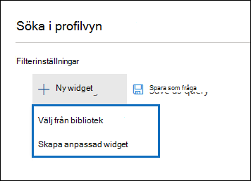

# Advanced eDiscovery för granskningsuppsättningarAdvanced eDiscovery dashboard for review sets

I vissa Advanced eDiscovery fall kan det finnas en stor mängd dokument och e-postmeddelanden som behöver granskas.For some cases in Advanced eDiscovery, you may have a large volume of documents and email messages that need to be reviewed. Innan du börjar granskningsprocessen kanske du snabbt vill analysera din corpus för att identifiera trender eller viktig statistik som hjälper dig att utveckla din granskningsstrategi.Before you start the review process, you may want to quickly analyze your corpus to identify trends or key statistics that will help you develop your review strategy. För att göra detta kan du använda instrumentpanelen Advanced eDiscovery att snabbt analysera din corpus.To do this, you can use the Advanced eDiscovery dashboard for review sets to quickly analyze your corpus.

## Steg 1: Skapa en widget på instrumentpanelen för granskningsuppsättningStep 1: Create a widget on the review set dashboard

1. I säkerhets- & efterlevnadscenter går du till **eDiscovery> Advanced eDiscovery** för att visa en lista över ärenden i organisationen.In the Security & Compliance Center, go to **eDiscovery > Advanced eDiscovery** to display the list of cases in your organization.
  
2. Markera ett befintligt ärende.Select an existing case.
  
3. Klicka på **fliken Granska** uppsättning och välj sedan en granskningsuppsättning.Click the **Review Set** tab, and then select a review set.
  
4. Klicka på **Sök i** profilvy i **listrutan Enskilda resultat.**In the **Individual results** dropdown list, click **Search profile view**. 

   

   Sidan **Sök profilvy** visas. första gången du visar den här sidan visas tre standardwidgetar.The **Search profile view** page is displayed; the first time you display this page, three default widgets are displayed.

   
  
5. Klicka på **widgeten** Ny och välj sedan något av följande:Click the **New  widget** and then select one of the following items:

   

   - **Välj från bibliotek:** Visar ett standardbibliotek med widgetar.**Choose from library:** Displays a default library of widgets. Du klickar på en widget och sedan på **Lägg** till för att lägga till den till widgetarna på **sidan Sök i profilvyn.**You click a widget and then click **Add** to add it to the widgets on the **Search profile view** page.
  
   - **Skapa anpassad widget:** Visar en utfäll sida som du kan använda för att konfigurera en anpassad widget.**Create custom widget:** Displays a flyout page that you can use to set up a custom widget. 

6. Om du vill skapa en anpassad widget gör du följande på den **utfällsida som finns på** sidan Lägg till widget:To create a custom widget, do the following on the **Add widget** flyout page:

   

    a.a. Skriv ett namn för widgeten som visas i widgetens namnlist.Type a name for the widget, which is displayed in the widget title bar. Du måste namnge en widget, men det är bra att identifiera widgetdata.Naming a widget is required, but it's helpful to identify the widget data.

    b.b. Välj en egenskap som **ska användas** för widgetdata i listrutan Välj pivot.Select a property in the **Choose pivot** dropdown list that will be used for the widget data. Objekten i den här listan är sökbara egenskaper för objekten i granskningsuppsättningen.The items in this list are the searchable properties for the items in the review set. En beskrivning av de här egenskaperna finns i [Dokumentmetadatafält i Advanced eDiscovery](document-metadata-fields-in-Advanced-eDiscovery.md).For a description of these properties, see [Document metadata fields in Advanced eDiscovery](document-metadata-fields-in-Advanced-eDiscovery.md). Pivotalternativen för widgeten visas i kolumnen sökbara **fältnamn i** det här avsnittet.The pivot options for the widget are listed in the **Searchable field name** column in this topic.

    c.c. Välj en diagramtyp för att visa data från den valda pivotegenskapen.Select a chart type to display the data from the selected pivot property.

  6. Klicka **på Lägg** till för att skapa den anpassade widgeten och visa den på sidan Sök **profilvy.**Click **Add** to create the custom widget and display it on the **Search profile view** page.

## Steg 2: Skapa en sökfråga för en granskningsuppsättningStep 2: Create a review set search query

1. Klicka **på ...** i widgetens namnlist och klicka sedan på Använd **villkor.**Click **...** in the widget title bar, and then click **Apply condition**.

   

2. På den utfällande sidan klickar du på ett element i widgetnyckeln eller widgetdiagrammet för att skapa ett filter.On the flyout page, click an element on the widget key or widget chart to create a filter.

   

3. Upprepa steg 1–2 för andra widgetar för flera widgetar.Repeat steps 1-2 for other widgets multiple widgets. 

4. När du är klar klickar du på **Spara som fråga för** att spara villkoren som en ny sökfråga för granskningsuppsättningen.When you're done, click **Save as query** to save your conditions as a new search query for the review set.

   

5. Stäng vyn **Sök profil för** att återgå till vyn med sökresultat.Close the **Search profile view** to return to the search results view.

   Om du har skapat visuella filter tillämpas den resulterande frågan på sökresultaten som visas och sökfrågan som du sparade i steg 4 visas under **Sparade frågor.**If you have created any visual filters, the resulting query is applied to the search results that are displayed, and the search query that you saved in step 4 is displayed under **Saved queries**. Mer information om frågeförfrågningar finns i Skapa [en fråga för data i en granskningsuppsättning](review-set-search.md).For more information about review set queries, see [Query the data in a review set](review-set-search.md).
