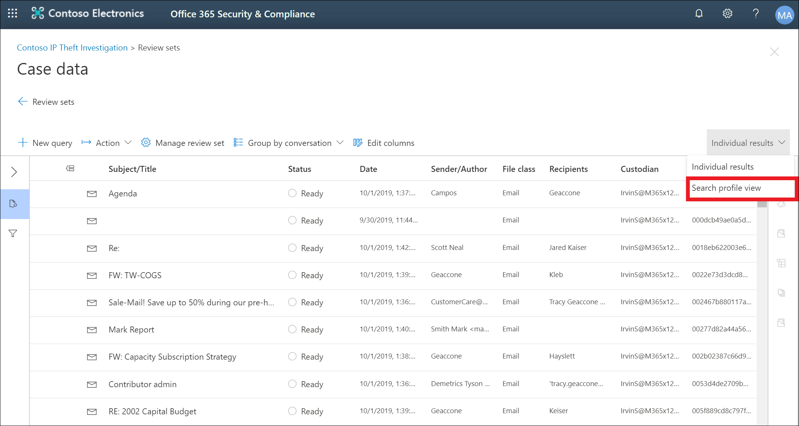

# Advanced eDiscovery för granskningsuppsättningar

I vissa Advanced eDiscovery fall kan det finnas en stor mängd dokument och e-postmeddelanden som behöver granskas. Innan du börjar granskningsprocessen kanske du snabbt vill analysera din corpus för att identifiera trender eller viktig statistik som hjälper dig att utveckla din granskningsstrategi. För att göra detta kan du använda instrumentpanelen Advanced eDiscovery att snabbt analysera din corpus.

## Steg 1: Skapa en widget på instrumentpanelen för granskningsuppsättning

1. I säkerhets- & efterlevnadscenter går du till **eDiscovery> Advanced eDiscovery** för att visa en lista över ärenden i organisationen.
  
2. Markera ett befintligt ärende.
  
3. Klicka på **fliken Granska** uppsättning och välj sedan en granskningsuppsättning.
  
4. Klicka på **Sök i** profilvy i **listrutan Enskilda resultat.** 

   

   Sidan **Sök profilvy** visas. första gången du visar den här sidan visas tre standardwidgetar.

   
  
5. Klicka på **widgeten** Ny och välj sedan något av följande:

   

   - **Välj från bibliotek:** Visar ett standardbibliotek med widgetar. Du klickar på en widget och sedan på **Lägg** till för att lägga till den till widgetarna på **sidan Sök i profilvyn.**
  
   - **Skapa anpassad widget:** Visar en utfäll sida som du kan använda för att konfigurera en anpassad widget. 

6. Om du vill skapa en anpassad widget gör du följande på den **utfällsida som finns på** sidan Lägg till widget:

   

    a. Skriv ett namn för widgeten som visas i widgetens namnlist. Du måste namnge en widget, men det är bra att identifiera widgetdata.

    b. Välj en egenskap som **ska användas** för widgetdata i listrutan Välj pivot. Objekten i den här listan är sökbara egenskaper för objekten i granskningsuppsättningen. En beskrivning av de här egenskaperna finns i [Dokumentmetadatafält i Advanced eDiscovery](document-metadata-fields-in-Advanced-eDiscovery.md). Pivotalternativen för widgeten visas i kolumnen sökbara **fältnamn i** det här avsnittet.

    c. Välj en diagramtyp för att visa data från den valda pivotegenskapen.

  6. Klicka **på Lägg** till för att skapa den anpassade widgeten och visa den på sidan Sök **profilvy.**

## Steg 2: Skapa en sökfråga för en granskningsuppsättning

1. Klicka **på ...** i widgetens namnlist och klicka sedan på Använd **villkor.**

   

2. På den utfällande sidan klickar du på ett element i widgetnyckeln eller widgetdiagrammet för att skapa ett filter.

   

3. Upprepa steg 1–2 för andra widgetar för flera widgetar. 

4. När du är klar klickar du på **Spara som fråga för** att spara villkoren som en ny sökfråga för granskningsuppsättningen.

   

5. Stäng vyn **Sök profil för** att återgå till vyn med sökresultat.

   Om du har skapat visuella filter tillämpas den resulterande frågan på sökresultaten som visas och sökfrågan som du sparade i steg 4 visas under **Sparade frågor.** Mer information om frågeförfrågningar finns i Skapa [en fråga för data i en granskningsuppsättning](review-set-search.md).
