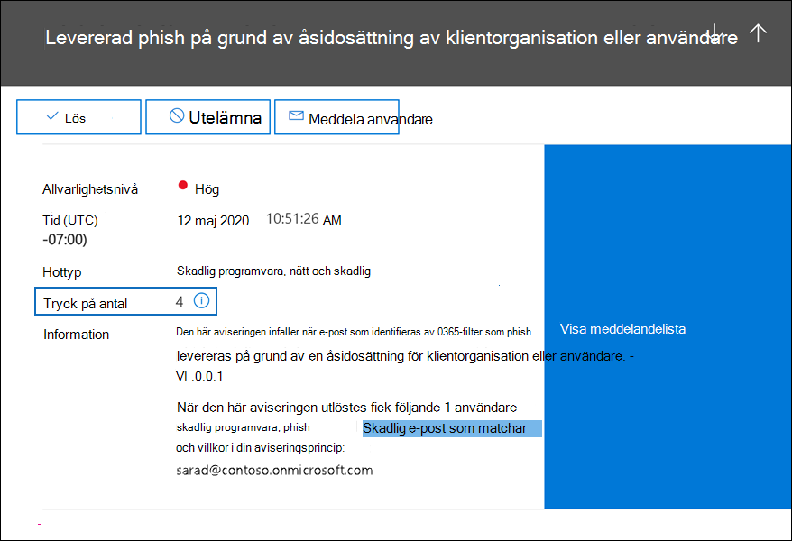

# <a name="alert-policies-in-the-security-and-compliance-center"></a>Aviseringsregler i säkerhets- och efterlevnadscentret

Du kan skapa aviseringsprinciper och instrumentpanelsverktyg för aviseringar i säkerhets- och efterlevnadscenter för Microsoft 365 för att skapa aviseringsprinciper och sedan visa de aviseringar som genereras när användare utför aktiviteter som matchar villkoren i en aviseringsprincip. Det finns flera standardprinciper för aviseringar som hjälper dig att övervaka aktiviteter, till exempel tilldela administratörsbehörigheter i Exchange Online, attacker mot skadlig programvara, nätfiskekampanjer och ovanliga nivåer av filborttagning och extern delning.

Med aviseringsprinciper kan du kategorisera aviseringar som utlöses av en princip, tillämpa principen på alla användare i organisationen, ange en tröskelvärdesnivå för när en avisering ska utlösas och bestämma om du vill få e-postaviseringar när aviseringar utlöses. Det finns även  sidan Visa aviseringar i säkerhets- och efterlevnadscentret där du kan visa och filtrera aviseringar, ange en aviseringsstatus som hjälper dig att hantera aviseringar och sedan stänga aviseringar när du har hanterat eller löst den underliggande incidenten.

> [!NOTE]
> Aviseringsprinciper är tillgängliga för organisationer som har en prenumeration på Microsoft 365 Enterprise, Office 365 Enterprise eller Office 365 för myndigheter i USA, abonnemanget E1/F1/G1, E3/F3/G3 eller E5/G5. Avancerade funktioner är endast tillgängliga för organisationer med en E5/G5-prenumeration eller för organisationer som har en E1/F1/G1- eller E3/F3/G3-prenumeration och en Microsoft Defender för Office 365 P2 eller en Microsoft 365 E5 Compliance- eller E5-prenumeration för eDiscovery och granskning. Funktionen som kräver en E5/G5 eller en tilläggsprenumeration är markerad i det här avsnittet. Observera även att aviseringsprinciper är tillgängliga i Office 365 GCC, GCC hög och doD amerikanska myndigheters miljöer.

## <a name="how-alert-policies-work"></a>Hur aviseringsprinciper fungerar

Här är en snabb överblick över hur aviseringsprinciper fungerar och aviseringar som utlöses när användar- eller administratörsaktivitet matchar villkoren i en aviseringsprincip.


1. En administratör i organisationen skapar, konfigurerar och aktiverar en  aviseringsprincip genom att använda sidan Aviseringsprinciper i säkerhets- och efterlevnadscentret. Du kan också skapa aviseringsprinciper med hjälp av cmdleten [New-ProtectionAlert](/powershell/module/exchange/new-protectionalert) i Security & Compliance Center PowerShell.

   För att skapa aviseringsprinciper måste du ha tilldelats rollen Hantera aviseringar eller rollen Organisationskonfiguration i säkerhets- och efterlevnadscentret.

   > [!NOTE]
   > Det tar upp till 24 timmar efter att en aviseringsprincip har skapats eller uppdaterats innan aviseringar kan utlösas av principen. Det beror på att principen måste synkroniseras till aviseringsmotorn.

2. En användare utför en aktivitet som matchar villkoren i en aviseringsprincip. Vid attacker mot skadlig programvara utlöser smittade e-postmeddelanden som skickas till användare i organisationen en avisering.

3. Microsoft 365 genererar en avisering som visas på sidan **Visa** aviseringar i säkerhets- & efterlevnadscenter. Och om e-postaviseringar är aktiverade för aviseringsprincipen skickar Microsoft en avisering till en lista över mottagare. Aviseringarna som en administratör eller andra användare kan se på sidan Visa aviseringar bestäms av de roller som tilldelats till användaren. Mer information finns i [RBAC-behörigheter som krävs för att visa aviseringar.](#rbac-permissions-required-to-view-alerts)

4. En administratör hanterar aviseringar i säkerhets- och efterlevnadscentret. Hantering av aviseringar består av att tilldela en aviseringsstatus för att spåra och hantera en undersökning.

## <a name="alert-policy-settings"></a>Aviseringsprincipinställningar

En aviseringsprincip består av en uppsättning regler och villkor som definierar den användar- eller administratörsaktivitet som genererar en avisering, en lista över användare som utlöser aviseringen om de utför aktiviteten samt ett tröskelvärde som anger hur många gånger aktiviteten måste utföras innan en avisering utlöses. Du kategoriserar även principen och tilldelar den en allvarlighetsnivå. De här två inställningarna hjälper dig att hantera aviseringsprinciper (och aviseringar som utlöses när principvillkoren matchas) eftersom du kan filtrera på de här inställningarna när du hanterar principer och visar aviseringar i säkerhets- och efterlevnadscentret. Du kan till exempel visa aviseringar som matchar villkoren från samma kategori eller visa aviseringar med samma allvarlighetsnivå.

Om du vill visa och skapa aviseringsprinciper går du [https://protection.office.com](https://protection.office.com) till och väljer principer för  \> **aviseringar.**


En aviseringsprincip består av följande inställningar och villkor.

- **Aktiviteten** som aviseringen spårar – Du skapar en princip för att spåra en aktivitet eller i vissa fall några relaterade aktiviteter, till exempel att dela en fil med en extern användare genom att dela den, tilldela åtkomstbehörigheter eller skapa en anonym länk. När en användare utför aktiviteten som definieras av principen utlöses en avisering baserat på inställningarna för aviseringströskel.

    > [!NOTE]
    > Vilka aktiviteter du kan spåra beror på organisationens plan för Office 365 Enterprise eller Office 365 amerikanska myndigheter. I allmänhet kräver aktiviteter som rör skadlig programvara och nätfiskeattacker en E5/G5-prenumeration eller en E1/F1/G1- eller E3/F3/G3-prenumeration med en [Defender för Office 365](../security/office-365-security/defender-for-office-365.md) Abonnemang 2-tilläggsprenumeration.

- **Aktivitetsvillkor** – För de flesta aktiviteter kan du definiera ytterligare villkor som måste uppfyllas för att utlösa en avisering. Vanliga villkor omfattar IP-adresser (så att en avisering utlöses när användaren utför aktiviteten på en dator med en viss IP-adress eller inom ett IP-adressintervall), om en avisering utlöses om en viss användare eller användare utför aktiviteten och om aktiviteten utförs på ett visst filnamn eller en viss URL. Du kan också konfigurera ett villkor som utlöser en avisering när aktiviteten utförs av en användare i organisationen. De tillgängliga villkoren är beroende av den valda aktiviteten.

- **När aviseringen utlöses** – Du kan konfigurera en inställning som definierar hur ofta en aktivitet kan inträffa innan en avisering utlöses. Det här gör att du kan konfigurera en princip för att generera en avisering varje gång en aktivitet matchar principvillkoren, när ett visst tröskelvärde överskrids eller när förekomsten av aktiviteten som aviseringen spårar blir ovanlig för organisationen.

    

    Om du väljer inställningen baserat på ovanlig aktivitet upprättar Microsoft ett baslinjevärde som definierar normalfrekvensen för den valda aktiviteten. Det tar upp till sju dagar att upprätta den här baslinjen, då aviseringar inte genereras. När baslinjen har upprättats utlöses en avisering när frekvensen för aktiviteten som spåras av aviseringsprincipen avsevärt överskrider baslinjevärdet. För granskningsrelaterade aktiviteter (till exempel fil- och mappaktiviteter) kan du skapa en baslinje baserat på en enskild användare eller baserat på alla användare i organisationen. för aktiviteter som rör skadlig programvara kan du upprätta en baslinje baserat på en enskild programfamilj, en enskild mottagare eller alla meddelanden i organisationen.

    > [!NOTE]
    > Möjligheten att konfigurera aviseringsprinciper baserat på ett tröskelvärde eller baserat på ovanlig aktivitet kräver en prenumeration på E5/G5 eller en prenumeration på E1/F1/F1 eller E3/F3/G3 med en prenumeration på Microsoft Defender för Office 365 P2, Microsoft 365 E5 Compliance eller Microsoft 365 för tillägget eDiscovery och granskning. Organisationer som har en E1/F1/G1- och E3/F3/G3-prenumeration kan bara skapa aviseringsprinciper där en avisering utlöses varje gång en aktivitet inträffar.

- **Aviseringskategori** – Om du vill ha hjälp med att spåra och hantera aviseringar som skapas av en princip kan du tilldela en av följande kategorier till en princip.

  - Dataförlustskydd

  - Informationsstyrning

  - E-postflöde

  - Behörigheter

  - Hothantering

  - Andra

  När en aktivitet inträffar som matchar villkoren i aviseringsprincipen taggas den avisering som skapas med den kategori som definierats i den här inställningen. På så sätt kan du spåra och hantera  aviseringar som har samma kategoriinställning på sidan Visa aviseringar i säkerhets- och efterlevnadscentret eftersom du kan sortera och filtrera aviseringar baserat på kategori.

- **Aviserings allvarlighetsgrad** – Liknar aviseringskategorin och tilldelar ett attribut för allvarlighetsgrad **(låg,**  **medel,** hög eller **information)** till aviseringsprinciper. På samma sätt som aviseringskategorin taggas den avisering som skapas med samma allvarlighetsnivå som angetts för aviseringsprincipen när en aktivitet inträffar som matchar villkoren i aviseringsprincipen. På så sätt kan du spåra och hantera aviseringar som har samma inställning för allvarlighetsgrad på **sidan Visa** aviseringar. Du kan till exempel filtrera listan med aviseringar så att endast aviseringar med **hög** allvarlighetsgrad visas.

    > [!TIP]
    > När du ställer in en aviseringsprincip kan du överväga att tilldela aktiviteter med större allvarlighetsgrad som kan leda till allvarliga negativa konsekvenser, t.ex. identifiering av skadlig programvara efter leverans till användare, visning av känsliga eller klassificerade data, delning av data med externa användare eller andra aktiviteter som kan leda till dataförlust eller säkerhetshot. Det kan hjälpa dig att prioritera aviseringar och de åtgärder du vidta för att undersöka och lösa de underliggande orsakerna.

- **E-postaviseringar** – Du kan konfigurera principen så att e-postaviseringar skickas (eller inte skickas) till en lista över användare när en avisering utlöses. Du kan också ange en daglig aviseringsgräns så att inga fler aviseringar skickas för aviseringen under den dagen när det maximala antalet aviseringar har uppnåtts. Förutom e-postaviseringar kan du och andra administratörer visa aviseringar som utlöses av en princip på **sidan Visa** aviseringar. Överväg att aktivera e-postaviseringar för aviseringsprinciper för en viss kategori eller som har en högre inställning för allvarlighetsgrad.

## <a name="default-alert-policies"></a>Standardaviseringsprinciper

Microsoft tillhandahåller inbyggda aviseringsprinciper som hjälper till Exchange identifiera missbruk av administratörsbehörighet, skadlig programvara, potentiella externa och interna hot samt informationsstyrningsrisker. På sidan **Aviseringsprinciper** är namnen på dessa inbyggda principer i fetstil och principtypen definieras som **System**. De här principerna är aktiverat som standard. Du kan inaktivera de här principerna (eller aktivera dem igen), konfigurera en lista över mottagare att skicka e-postaviseringar till och ange en daglig aviseringsgräns. Andra inställningar för dessa principer kan inte redigeras.

I följande tabell visas och beskrivs de tillgängliga standardaviseringsprinciperna och den kategori som varje princip tilldelas till. Kategorin används för att avgöra vilka aviseringar en användare kan visa på sidan Visa aviseringar. Mer information finns i [RBAC-behörigheter som krävs för att visa aviseringar.](#rbac-permissions-required-to-view-alerts)

Tabellen anger också vilket Office 365 Enterprise och Office 365 för var och en av dem. Vissa standardaviseringsprinciper är tillgängliga om din organisation har rätt tilläggsprenumeration utöver en E1/F1/G1- eller E3/F3/G3-prenumeration.

| Standardaviseringsprincip | Beskrivning | Kategori | Enterprise-prenumeration |
|:-----|:-----|:-----|:-----|
|**Ett potentiellt skadligt URL-klick upptäcktes**|Genererar en avisering när en användare som skyddas [Valv länkar](../security/office-365-security/safe-links.md) i din organisation klickar på en skadlig länk. Händelsen utlöses när ändringar av URL-bedömning identifieras av Microsoft Defender för Office 365 eller när användare åsidosätter Valv-länksidorna (baserat på organisationens Microsoft 365 för företag Valv Links-policy). Den här aviseringsprincipen har **inställningen Hög** allvarlighetsgrad. För Defender för Office 365 P2-, E5- och G5-kunder utlöser den här aviseringen automatiskt automatisk undersökning och [svar i Office 365.](../security/office-365-security/office-365-air.md) Mer information om händelser som utlöser den här aviseringen finns [i Konfigurera Valv principer för länkar.](../security/office-365-security/set-up-safe-links-policies.md)|Hothantering|E5/G5 eller Defender Office 365 en P2-tilläggsprenumeration|
|**Resultat av administratörsinskick slutfört**|Genererar en avisering när en [administratörs inskickad](../security/office-365-security/admin-submission.md) inskickad entitet har slutförts. En avisering utlöses varje gång ett återskanna resultat återges från en inskickad administratör. Dessa aviseringar är avsedda [](https://protection.office.com/reportsubmission)att påminna dig att granska resultaten av tidigare inskickade , skicka användarrapporterade meddelanden för att få den senaste principkontrollen och visa på nytt för att avgöra om filtreringsprinciperna i organisationen har den avsedda påverkan. Den här principen har inställningen **Informations** allvarlighetsgrad.|Hothantering|E1/F1, E3/F3 eller E5|
|**Admin utlöst manuell undersökning av e-post**|Genererar en varning när en administratör utlöser manuell undersökning av ett e-postmeddelande från Hotutforskaren. Mer information finns i [Exempel: En säkerhetsadministratör utlöser en undersökning från Threat Explorer](../security/office-365-security/automated-investigation-response-office.md#example-a-security-administrator-triggers-an-investigation-from-threat-explorer). Det här meddelandet meddelar organisationen att undersökningen har påbörjats. Aviseringen ger information om vem som utlöste den och innehåller en länk till undersökningen. Den här principen har inställningen **Allvarlighetsgrad** i information.|Hothantering| E5/G5 eller Microsoft Defender Office 365 en P2-tilläggsprenumeration| 
|**Skapa regel för vidarebefordran / omdirigering**|Genererar en avisering när någon i organisationen skapar en inkorgsregel för sin postlåda som vidarebefordrar eller omdirigerar meddelanden till ett annat e-postkonto. Med den här principen spårar du bara inkorgsregler som skapats med Outlook på webben (tidigare kallat Outlook Web App) eller Exchange Online PowerShell. Den här principen har inställningen **Informations** allvarlighetsgrad. Mer information om hur du använder inkorgsregler för att vidarebefordra och omdirigera e-Outlook i Outlook på webben finns i Använda regler i Outlook på webben för att automatiskt vidarebefordra meddelanden till [ett annat konto.](https://support.office.com/article/1433e3a0-7fb0-4999-b536-50e05cb67fed)|Hothantering|E1/F1/G1, E3/F3/G3 eller E5/G5|
|**eDiscovery-sökning startade eller exporterades**|Genererar en avisering när någon använder verktyget Innehållssökning i Säkerhets- och efterlevnadscenter. En avisering utlöses när följande aktiviteter för innehållssökning utförs: <br/><br/>* En innehållssökning startas<br/>* Resultatet av en innehållssökning exporteras<br/>* En rapport för innehållssökning exporteras<br/><br/>Aviseringar utlöses också när tidigare aktiviteter för innehållssökning utförs tillsammans med ett eDiscovery-ärende. Den här principen har inställningen **Informations** allvarlighetsgrad. Mer information om aktiviteter för innehållssökning finns i [Söka efter eDiscovery-aktiviteter i granskningsloggen.](search-for-ediscovery-activities-in-the-audit-log.md#ediscovery-activities)|Hothantering|E1/F1/G1, E3/F3/G3 eller E5/G5|
|**Höjd på Exchange administratörsbehörighet**|Genererar en avisering när någon tilldelas administrativ behörighet i Exchange Online organisation. Till exempel när en användare läggs till i rollgruppen Organisationshantering i Exchange Online. Den här principen har **inställningen Låg** allvarlighetsgrad.|Behörigheter|E1/F1/G1, E3/F3/G3 eller E5/G5|
|**E-postmeddelanden som innehåller skadlig kod har tagits bort efter leverans**|Genererar en avisering när meddelanden som innehåller skadlig programvara levereras till postlådor i organisationen. Om den här händelsen inträffar tar Microsoft bort de smittade meddelandena Exchange Online postlådor med automatisk [rensning på nolltimmar.](../security/office-365-security/zero-hour-auto-purge.md) Den här principen har en **inställning för** allvarlighetsgrad i information och utlöser automatiskt automatisk undersökning och svar [i Office 365](../security/office-365-security/office-365-air.md).|Hothantering|E5/G5 eller Microsoft Defender Office 365 en P2-tilläggsprenumeration|
|**E-postmeddelanden med nätfiske togs bort efter leverans**|Genererar en avisering när några meddelanden som innehåller phish levereras till postlådor i din organisation. Om den här händelsen inträffar tar Microsoft bort de smittade meddelandena Exchange Online postlådor med automatisk [rensning på nolltimmar.](../security/office-365-security/zero-hour-auto-purge.md) Den här principen har en **inställning för** allvarlighetsgrad i information och utlöser automatiskt automatisk undersökning och svar [i Office 365](../security/office-365-security/office-365-air.md).|Hothantering|E5/G5 eller Defender Office 365 en P2-tilläggsprenumeration|
|**E-postmeddelande rapporterat av användare som skadlig programvara eller nätfiske**|Genererar en avisering när användare i organisationen rapporterar meddelanden som nätfiskemeddelanden med tillägget Rapportmeddelande. Den här principen har **inställningen Låg** allvarlighetsgrad. Mer information om det här tillägget finns i [Använda tillägget Rapportmeddelande.](https://support.office.com/article/b5caa9f1-cdf3-4443-af8c-ff724ea719d2) För Defender för Office 365 P2-, E5- och G5-kunder utlöser den här aviseringen automatiskt automatisk undersökning och [svar i Office 365.](../security/office-365-security/office-365-air.md)|Hothantering|E1/F1/G1, E3/F3/G3 eller E5/G5|
|**Gränsen för att skicka e-post har överskridits**|Genererar en avisering när någon i organisationen har skickat mer e-post än vad som tillåts av policyn för utgående skräppost. Det är oftast en indikation på att användaren skickar för mycket e-post eller att kontot kan ha komprometterats. Den här principen har inställningen **Medel** allvarlighetsgrad. Om du får en avisering som genereras av den här aviseringsprincipen är det en bra idé att [kontrollera om användarkontot har komprometterats.](../security/office-365-security/responding-to-a-compromised-email-account.md)|Hothantering|E1/F1/G1, E3/F3/G3 eller E5/G5|
|**Formulär som blockerats på grund av potentiellt nätfiskeförsök**|Genererar en avisering när någon i organisationen har begränsats från att dela formulär och samla in svar med Microsoft Forms på grund av upptäckt upprepat beteende för nätfiskeförsök. Den här principen har **inställningen Hög allvarlighetsgrad.**|Hothantering|E1, E3/F3 eller E5|
|**Flaggat formulär och bekräftat som nätfiske**|Genererar en avisering när ett formulär som skapats i Microsoft Forms från din organisation har identifierats som potentiellt nätfiske via rapportera missbruk och bekräftats som nätfiske av Microsoft. Den här principen har **inställningen Hög** allvarlighetsgrad.|Hothantering|E1, E3/F3 eller E5|
|**Meddelanden har fördröjts**|Genererar en avisering när Microsoft inte kan leverera e-postmeddelanden till din lokala organisation eller en partnerserver med hjälp av en anslutare. När detta händer är meddelandet i kö i Office 365. Den här aviseringen utlöses när det finns 2 000 meddelanden eller fler som har köats i mer än en timme. Den här principen har **inställningen Hög** allvarlighetsgrad.|E-postflöde|E1/F1/G1, E3/F3/G3 eller E5/G5|
|**Skadlig programvara som upptäckts efter leverans**|Genererar en avisering när ett ovanligt stort antal meddelanden som innehåller skadlig programvara levereras till postlådor i organisationen. Om detta inträffar tar Microsoft bort de smittade meddelandena från Exchange Online postlådor. Den här principen har **inställningen Hög** allvarlighetsgrad.|Hothantering|E5/G5 eller Microsoft Defender Office 365 en P2-tilläggsprenumeration|
|**Skadlig programvara har upptäckts och blockerats**|Genererar en avisering när någon har försökt skicka ett ovanligt stort antal e-postmeddelanden som innehåller en viss typ av skadlig programvara till användare i organisationen. Om detta inträffar blockeras de smittade meddelandena av Microsoft och levereras inte till postlådor. Den här principen har **inställningen Låg** allvarlighetsgrad.|Hothantering|E5/G5 eller Defender Office 365 en P2-tilläggsprenumeration|
|**Skadlig programvara upptäcktes i SharePoint och OneDrive**|Genererar en avisering när en ovanligt stor volym av skadlig programvara eller virus upptäcks i filer som finns på SharePoint webbplatser eller OneDrive-konton i organisationen. Den här principen har **inställningen Hög** allvarlighetsgrad.|Hothantering|E5/G5 eller Defender Office 365 en P2-tilläggsprenumeration|
|**Skadlig programvara har inte zapped eftersom ZAP har inaktiverats**| Genererar en avisering när Microsoft upptäcker leverans av ett skadlig meddelande till en postlåda eftersom funktionen Zero-Hour autorensning för phish-meddelanden har inaktiverats. Den här principen har inställningen **Allvarlighetsgrad** i information. |Hothantering|E5/G5 eller Defender Office 365 en P2-tilläggsprenumeration|
|**Levererad phish eftersom en användares skräppostmapp är inaktiverad**|Genererar en avisering när Microsoft identifierar att en användares skräppostmapp är inaktiverad, vilket tillåter leverans av ett nätfiskemeddelande med hög säkerhet till en postlåda. Den här principen har inställningen **Allvarlighetsgrad** i information.|Hothantering|E5/G5 eller Defender Office 365 en P1- eller P2-tilläggsprenumeration|
|**Phish levererat på grund av en ETR-åsidosättning**|Genererar en avisering när Microsoft identifierar Exchange Transport Rule (ETR) som tillåtit leverans av ett nätfiskemeddelande med hög säkerhet till en postlåda. Den här principen har inställningen **Allvarlighetsgrad** i information. Mer information om hur Exchange -transportregler (e-postflödesregler) finns i [E-postflödesregler (transportregler) i Exchange Online.](/exchange/security-and-compliance/mail-flow-rules/mail-flow-rules)|Hothantering|E5/G5 eller Defender Office 365 en P1- eller P2-tilläggsprenumeration|
|**Phish levererat på grund av en IP-policy som tillåter**|Genererar en avisering när Microsoft identifierar en princip för IP-tillstånd som tillåter leverans av ett nätfiskemeddelande med hög säkerhet till en postlåda. Den här principen har inställningen **Allvarlighetsgrad** i information. Mer information om principen för tillåtna IP (anslutningsfiltrering) finns i [Konfigurera standardprincipen för anslutningsfilter – Office 365.](../security/office-365-security/configure-the-connection-filter-policy.md)|Hothantering|E5/G5 eller Defender Office 365 en P1- eller P2-tilläggsprenumeration|
|**Nätta inte zapped eftersom ZAP är inaktiverat**| Genererar en avisering när Microsoft identifierar leverans av ett nätfiskemeddelande med hög konfidens till en postlåda eftersom automatisk Zero-Hour för phish-meddelanden har inaktiverats. Den här principen har inställningen **Allvarlighetsgrad** i information.|Hothantering|E5/G5 eller Defender Office 365 en P2-tilläggsprenumeration|
|**Levererad phish på grund av åsidosättning av klient eller användare**<sup>1</sup>|Genererar en avisering när Microsoft identifierar en administratör eller användare som åsidosätter tillåts leverans av nätfiskemeddelande till en postlåda. Exempel på åsidosättningar är en inkorgs- eller e-postflödesregel som tillåter meddelanden från en viss avsändare eller domän, eller en princip för skydd mot skräppost som tillåter meddelanden från vissa avsändare eller domäner. Den här principen har **inställningen Hög** allvarlighetsgrad.|Hothantering|E5/G5 eller Defender Office 365 en P2-tilläggsprenumeration|
|**Misstänkt vidarebefordran av e-post**|Genererar en avisering när någon i organisationen har automatiskt genererat e-post till ett misstänkt externt konto. Det här är en tidig varning om något beteende som kan indikera att kontot har komprometterats, men inte tillräckligt allvarligt för att begränsa användaren. Den här principen har **inställningen Hög** allvarlighetsgrad. Även om det är ovanligt kan en varning som genereras av den här principen vara en avvikande avvikelse. Det är en bra idé att [kontrollera om användarkontot har komprometterats.](../security/office-365-security/responding-to-a-compromised-email-account.md)|Hothantering|E1/F1/G1, E3/F3/G3 eller E5/G5|
|**Mönster för att skicka misstänkta e-postmeddelanden upptäcktes**|Genererar en avisering när någon i organisationen har skickat misstänkta e-postmeddelanden och riskerar att bli begränsade från att skicka e-post. Det här är en tidig varning om något beteende som kan indikera att kontot har komprometterats, men inte tillräckligt allvarligt för att begränsa användaren. Den här principen har inställningen **Medel** allvarlighetsgrad. Även om det är ovanligt kan en varning som genereras av den här principen vara en avvikande avvikelse. Du bör dock kontrollera om [användarkontot har komprometterats.](../security/office-365-security/responding-to-a-compromised-email-account.md)|Hothantering|E1/F1/G1, E3/F3/G3 eller E5/G5  |
|**Klientorganisationen begränsad från att skicka e-post**|Genererar en avisering när de flesta av e-posttrafiken från organisationen har identifierats som misstänkt och Microsoft har begränsat organisationen från att skicka e-post. Undersök alla potentiellt komprometterade användar- och administratörskonton, nya anslutningar eller öppna reläer och kontakta sedan Microsoft Support för att häva blockeringen av din organisation. Den här principen har **inställningen Hög** allvarlighetsgrad. Mer information om varför organisationer blockeras finns i Korrigera problem med e-postleverans för [felkod 5.7.7xx i Exchange Online.](/Exchange/mail-flow-best-practices/non-delivery-reports-in-exchange-online/fix-error-code-5-7-700-through-5-7-750)|Hothantering|E1/F1/G1, E3/F3/G3 eller E5/G5|
|**Ovanliga filaktiviteter för externa användare**|Genererar en avisering när ett ovanligt stort antal aktiviteter utförs på filer i SharePoint eller OneDrive av användare utanför organisationen. Det omfattar aktiviteter som att komma åt filer, ladda ned filer och ta bort filer. Den här principen har **inställningen Hög** allvarlighetsgrad.|Informationsstyrning|E5/G5, Microsoft Defender för Office 365 P2 eller Microsoft 365 E5 en tilläggsprenumeration|
|**Ovanliga volymen för extern fildelning**|Genererar en avisering när ett ovanligt stort antal filer i SharePoint eller OneDrive delas med användare utanför organisationen. Den här principen har inställningen **Medel** allvarlighetsgrad.|Informationsstyrning|E5/G5, Defender för Office 365 P2 Microsoft 365 E5 prenumeration på tillägget|
|**Ovanlig volym av filborttagning**|Genererar en avisering när ett ovanligt stort antal filer tas bort i SharePoint eller OneDrive inom en kort tidsperiod. Den här principen har inställningen **Medel** allvarlighetsgrad.|Informationsstyrning|E5/G5, Defender för Office 365 P2 Microsoft 365 E5 prenumeration på tillägget|
|**Ovanlig ökning av e-postmeddelanden rapporterade som nätfiske**|Genererar en avisering när antalet personer i organisationen ökar avsevärt med tillägget Rapportmeddelande i Outlook för att rapportera meddelanden som nätfiskemeddelanden. Den här principen har inställningen **Medel** allvarlighetsgrad. Mer information om det här tillägget finns i [Använda tillägget Rapportmeddelande.](https://support.office.com/article/b5caa9f1-cdf3-4443-af8c-ff724ea719d2)|Hothantering|E5/G5 eller Defender Office 365 en P2-tilläggsprenumeration|
|**Personifiering av användare levererad till inkorgen/mapp**<sup>1,</sup><sup>2</sup>|Genererar en avisering när Microsoft upptäcker att en administratör eller användare som åsidosätter en användare har tillåtit leverans av en användare som utger sig för att vara nätfiskemeddelande till inkorgen (eller någon annan användartillgänglig mapp) i en postlåda. Exempel på åsidosättningar är en inkorgs- eller e-postflödesregel som tillåter meddelanden från en viss avsändare eller domän, eller en princip för skydd mot skräppost som tillåter meddelanden från vissa avsändare eller domäner. Den här principen har inställningen **Medel** allvarlighetsgrad.|Hothantering|E5/G5 eller Defender Office 365 en P2-tilläggsprenumeration|
|**Användaren begränsad från att skicka e-post**|Genererar en avisering när någon i din organisation är begränsad från att skicka utgående e-post. Det här resulterar vanligtvis när ett konto har komprometterats och användaren visas på sidan Begränsade användare i & Säkerhets- och efterlevnadscenter.  (Du kommer åt den här sidan genom att gå **till > Review > Restricted Users**). Den här principen har **inställningen Hög** allvarlighetsgrad. Mer information om begränsade användare finns i Ta bort en användare, domän eller IP-adress från en [blockeringslista efter att ha skickat skräppost.](/office365/securitycompliance/removing-user-from-restricted-users-portal-after-spam)|Hothantering|E1/F1/G1, E3/F3/G3 eller E5/G5|
|**Användare begränsad till delning av formulär och insamling av svar**|Genererar en avisering när någon i organisationen har begränsats från att dela formulär och samla in svar med Microsoft Forms på grund av upptäckt upprepat beteende för nätfiskeförsök. Den här principen har **inställningen Hög** allvarlighetsgrad.|Hothantering|E1, E3/F3 eller E5|
|||||

> [!NOTE]
> <sup>1</sup> Vi har tillfälligt tagit bort denna standardaviseringsprincip baserat på feedback från kunder. Vi arbetar för att förbättra den och kommer att ersätta den med en ny version inom kort. Tills dess kan du skapa en anpassad aviseringsprincip som ersätter den här funktionen med hjälp av följande inställningar:<br/>&nbsp; * Aktivitet är phish e-post som upptäckts vid leverans<br/>&nbsp; * E-post är inte ZAP'd<br/>&nbsp; * E-postriktningen är inkommande<br/>&nbsp; * Leveransstatus för e-post är Levererad<br/>&nbsp; * Identifieringsteknik är bevarande av skadlig URL, URL-detonation, avancerat phish-filter, allmänt phish-filter, domänpersonifiering, personifiering av användare och varumärkespersonifiering<br/><br/>&nbsp;&nbsp;&nbsp;Mer information om skydd mot nätfiske i Office 365 finns i Konfigurera principer för skydd mot nätfiske och [nätfiske.](../security/office-365-security/set-up-anti-phishing-policies.md)<br/><br/><sup>2 Återskapa</sup> den här aviseringsprincipen genom att följa instruktionerna i föregående fotnot, men välj Användarpersonifiering som den enda identifieringstekniken.

Den ovanliga aktivitet som övervakas av vissa av de inbyggda principerna baseras på samma process som den aviseringströskelinställning som beskrevs tidigare. Microsoft upprättar ett baslinjevärde som definierar normalfrekvensen för "vanlig" aktivitet. Aviseringar utlöses då när frekvensen för aktiviteter som spåras av den inbyggda aviseringsprincipen överstiger baslinjevärdet avsevärt.

## <a name="viewing-alerts"></a>Visa aviseringar

Om en aktivitet som utförs av användare i organisationen matchar inställningarna för en  aviseringsprincip genereras en avisering och visas på sidan Visa aviseringar i säkerhets- och efterlevnadscentret. Beroende på inställningarna för en aviseringsprincip skickas även ett e-postmeddelande till en lista med angivna användare när en avisering utlöses. För varje avisering visar  instrumentpanelen på sidan Visa aviseringar namnet på motsvarande aviseringsprincip, allvarlighetsgrad och kategori för aviseringen (definierad i aviseringsprincipen) och antalet gånger en aktivitet har inträffat som resulterade i att aviseringen skapades. Det här värdet baseras på tröskelvärdet för aviseringsprincipen. Instrumentpanelen visar också status för varje avisering. Mer information om hur du använder statusegenskapen för att hantera aviseringar finns [i Hantera aviseringar.](#managing-alerts)

Om du vill visa aviseringar går du [https://protection.office.com](https://protection.office.com) till och väljer aviseringar **–** \> **visa aviseringar.**


Du kan använda följande filter för att visa en delmängd av alla aviseringar på **sidan Visa** aviseringar.

- **Status.** Använd det här filtret för att visa aviseringar som har tilldelats en viss status. Standardstatusen är **Aktiv.** Du eller andra administratörer kan ändra statusvärdet.

- **Policy.** Använd det här filtret för att visa aviseringar som matchar inställningen för en eller flera aviseringsprinciper. Du kan också visa alla aviseringar för alla aviseringsprinciper.

- **Tidsperiod.** Använd det här filtret för att visa aviseringar som genererats inom ett visst datum- och tidsperiod.

- **Allvarlighetsgrad.** Använd det här filtret för att visa aviseringar som har tilldelats en viss allvarlighetsgrad.

- **Kategori.** Använd det här filtret för att visa aviseringar från en eller flera aviseringskategorier.

- **Taggar.** Använd det här filtret för att visa aviseringar från en eller flera användartaggar. Taggar återspeglas utifrån taggade postlådor eller användare som visas i aviseringarna. Mer [information finns i Användartaggar Office 356 ATP.](../security/office-365-security/user-tags.md)

- **Källa.** Använd det här filtret för att visa aviseringar som utlöses av aviseringsprinciper i säkerhets- och efterlevnadscentret eller varningar som Office 365 Cloud App Security principer, eller både och. Mer information om hur du Office 365 Cloud App Security aviseringar finns i [Visa Cloud App Security aviseringar](#viewing-cloud-app-security-alerts).

> [!IMPORTANT]
> Filtrering och sortering efter användartaggar är för närvarande en offentlig förhandsgranskning.
> Den kan komma att ändras väsentligt innan den släpps till kommersiellt bruk. Microsoft ger inga garantier, uttryckliga eller underförstådda, med avseende på den information som ges om den.

## <a name="alert-aggregation"></a>Aviseringsaggregering

Om flera händelser som matchar villkoren i en aviseringsprincip inträffar med en kort tidsperiod läggs de till i en befintlig avisering genom en process som kallas *aviseringsaggregering.* När en händelse utlöser en avisering genereras aviseringen och visas på **sidan Visa** aviseringar och ett meddelande skickas. Om samma händelse inträffar inom aggregeringsintervallet lägger Microsoft 365 information om den nya händelsen till den befintliga aviseringen i stället för att utlösa en ny avisering. Syftet med aggregering för aviseringar är att minska aviseringsutmattningen och att du kan fokusera på och vidta åtgärder på färre aviseringar för samma händelse.

Längden på aggregeringsintervallet beror på din Office 365 eller Microsoft 365 prenumeration.

|Prenumeration|Aggregeringsintervall|
|:---------|:---------:|
|Office 365 eller Microsoft 365 E5/G5|1 minut|
|Microsoft Defender för Office 365 abonnemang 2 |1 minut|
|Tillägg för E5-efterlevnad eller E5-tillägg för identifiering och granskning|1 minut|
|Office 365 eller Microsoft 365 E1/F1/G1 eller E3/F3/G3|15 minuter|
|Defender för Office 365 abonnemang 1 eller Exchange Online Protection|15 minuter|
|||

När händelser som matchar samma aviseringsprincip inträffar inom aggregeringsintervallet läggs information om den efterföljande händelsen till i den ursprungliga aviseringen. För alla händelser visas information om aggregerade händelser i informationsfältet och antalet gånger en händelse inträffat med aggregeringsintervallet visas i fältet för antal aktiviteter/träffar. Du kan visa mer information om alla sammantagna händelseinstanser genom att visa aktivitetslistan.

På följande skärmbild visas en avisering med fyra sammantagna händelser. Aktivitetslistan innehåller information om de fyra e-postmeddelanden som är relevanta för aviseringen.



Tänk på följande om aviseringsaggregering:

- Varningar som utlöstes av **ett potentiellt skadligt URL-klick upptäcktes** [att standardaviseringsprincipen](#default-alert-policies) inte aggregerades. Det beror på att aviseringar som utlöses av den här principen är unika för varje användare och e-postmeddelande.

- För stunden anger **inte egenskapen Antal** aviseringar antalet aggregerade händelser för alla aviseringsprinciper. För aviseringar som utlöses av dessa aviseringsprinciper kan du visa de sammantagna händelserna genom att klicka på **Visa meddelandelista** **eller Visa aktivitet** för aviseringen. Vi arbetar för att göra antalet aggregerade händelser som listas i egenskapen **Hit count alert** tillgänglig för alla aviseringsprinciper.

## <a name="rbac-permissions-required-to-view-alerts"></a>RBAC-behörigheter krävs för att visa aviseringar

RBAC-behörigheterna (Rollbaserad åtkomstkontroll) som tilldelats användare i organisationen avgör vilka aviseringar en användare kan se på **sidan Visa aviseringar.** Hur ska det göras? De hanteringsroller som tilldelats användare & (baserat på deras medlemskap i rollgrupper i säkerhets- och efterlevnadscentret) avgör vilka aviseringskategorier en användare kan se på sidan **Visa** aviseringar. Här är några exempel:

- Medlemmar i rollgruppen Hantering av arkivhandlingar kan bara visa aviseringar som genereras av aviseringsprinciper som tilldelats kategorin **Informationsstyrning.**

- Medlemmar i rollgruppen Efterlevnadsadministratör kan inte visa aviseringar som genereras av aviseringsprinciper som tilldelats kategorin **Hothantering.**

- Medlemmar i rollgruppen för eDiscovery Manager kan inte visa aviseringar eftersom ingen av de tilldelade rollerna ger behörighet att visa aviseringar från någon aviseringskategori.

Med den här designen (baserat på behörigheterna för RBAC) kan du avgöra vilka aviseringar som kan visas (och hanteras) av användare i specifika roller i organisationen.

I följande tabell visas de roller som krävs för att visa aviseringar från de sex olika aviseringskategorierna. Den första kolumnen i tabellerna innehåller alla roller i säkerhets- & kompatibilitetscentret.  En bockmarkering anger att en användare som har tilldelats rollen kan visa aviseringar från motsvarande aviseringskategori i den översta raden.

Du kan se vilken kategori en standardaviseringsprincip har tilldelats i tabellen i [Standardaviseringsprinciper.](#default-alert-policies)

|Roll|Informationsstyrning|Dataförlustskydd|E-postflöde|Behörigheter|Hothantering|Andra|
|:---------|:---------:|:---------:|:---------:|:---------:|:---------:|:---------:|
|Granskningsloggar|||||||
|Ärendehantering|||||||
|Efterlevnadsadministratör|||||||
|Efterlevnadssökning|||||||
|Enhetshantering|||||||
|Dispositionshantering|||||||
|DLP-efterlevnadshantering|||||||
|Exportera|||||||
|Håll ned|||||||
|Hantera aviseringar|||||||
|Organisationskonfiguration|||||||
|Förhandsgranska|||||||
|Posthantering|||||||
|Bevarandehantering|||||||
|Granska|||||||
|RMS-dekryptera|||||||
|Rollhantering|||||||
|Sök och rensa|||||||
|Säkerhetsadministratör|||||||
|Säkerhetsläsare||||||
|Vyn Tjänstgranskning|||||||
|Övervakande granskningsadministratör|||||||
|View-Only granskningsloggar|||||||
|View-Only enhetshantering|||||||
|View-Only DLP-efterlevnadshantering|||||||
|View-Only Hantera aviseringar|||||||
|View-Only mottagare|||||||
|View-Only posthantering|||||||
|View-Only med bevarandehantering|||||||
|||||||

> [!TIP]
> Om du vill visa de roller som är tilldelade till var och en av standardrollgrupperna kör du följande kommandon i Security & Compliance Center PowerShell:
> 
> ```powershell
> $RoleGroups = Get-RoleGroup
> ```
> 
> ```powershell
> $RoleGroups | foreach {Write-Output -InputObject `r`n,$_.Name,"-----------------------"; Get-RoleGroup $_.Identity | Select-Object -ExpandProperty Roles}
> ```
> 
> Du kan också visa de roller som tilldelats en rollgrupp i Säkerhets- & Efterlevnadscenter. Gå till **sidan Behörigheter** och välj en rollgrupp. De tilldelade rollerna visas på den utfällna sidan.

## <a name="managing-alerts"></a>Hantera aviseringar

När aviseringar har skapats och  visats på sidan Visa aviseringar i säkerhets- och efterlevnadscentret kan du kontrollera, undersöka och lösa dem. Här är några uppgifter som du kan utföra för att hantera aviseringar.

- **Tilldela en status till aviseringar.** Du kan tilldela en av följande statusar till aviseringar: **Aktiv** (standardvärdet), **Undersöker,** **Löst** **eller Ignorerad.** Sedan kan du filtrera på den här inställningen för att visa aviseringar med samma statusinställning. Den här statusinställningen kan underlätta hanteringen av aviseringar.

- **Visa aviseringsinformation.** Du kan välja en avisering om du vill visa en utfällsida med information om aviseringen. Den detaljerade informationen beror på motsvarande aviseringsprincip, men vanligtvis omfattar det följande: namnet på den faktiska åtgärd som utlöste aviseringen (till exempel en cmdlet), en beskrivning av aktiviteten som utlöste aviseringen, användaren (eller listan över användare) som utlöste aviseringen och namnet (och länken till) för motsvarande aviseringsprincip.

  - Namnet på den faktiska åtgärden som utlöste aviseringen, till exempel en cmdlet eller en granskningsloggåtgärd.

  - En beskrivning av aktiviteten som utlöste aviseringen.

  - Användaren som utlöste aviseringen. Det här inkluderas endast för aviseringsprinciper som har ställts in för att spåra en enskild användare eller en enskild aktivitet.

  - Antalet gånger som aktiviteten som spårades med aviseringen utfördes. Det här antalet kanske inte överensstämmer med det faktiska antalet relaterade aviseringar som visas på sidan Visa aviseringar eftersom fler aviseringar kan ha utlösts.

  - En länk till en aktivitetslista som innehåller ett objekt för varje aktivitet som utfördes och som utlöste aviseringen. Varje post i den här listan identifierar när aktiviteten inträffade, namnet på den faktiska åtgärden (till exempel "FileDeleted") och användaren som utförde aktiviteten, objektet (till exempel en fil, ett eDiscovery-ärende eller en postlåda) som aktiviteten utfördes på och IP-adressen till användarens dator. Vid aviseringar om skadlig programvara länkas dessa till en meddelandelista.

  - Namnet (och länken till) på motsvarande aviseringsprincip.

- **Hindra e-postaviseringar.** Du kan inaktivera (eller utelämna) e-postaviseringar från den utfällna sidan för att få en avisering. När du ignorerar e-postaviseringar kommer Microsoft inte att skicka meddelanden när aktiviteter eller händelser som matchar villkoren i aviseringsprincipen. Aviseringar utlöses dock när aktiviteter som utförs av användare matchar villkoren i aviseringsprincipen. Du kan också inaktivera e-postaviseringar genom att redigera aviseringsprincipen.

- **Lös aviseringar.** Du kan markera en avisering som löst på sidan med utfällning för en avisering (som anger statusen för aviseringen till **Löst**). Om du inte ändrar filtret visas inte lösta aviseringar på **sidan Visa** aviseringar.

## <a name="viewing-cloud-app-security-alerts"></a>Visa Cloud App Security aviseringar

Aviseringar som utlöses av Office 365 Cloud App Security principer visas nu på **sidan Visa aviseringar** i säkerhets- och efterlevnadscentret. Detta inkluderar aviseringar som utlöses av aktivitetsprinciper och aviseringar som utlöses av avvikande identifieringsprinciper i Office 365 Cloud App Security. Det innebär att du kan visa alla aviseringar i säkerhets- och efterlevnadscentret. Office 365 Cloud App Security är endast tillgängligt för organisationer som har en Office 365 Enterprise E5 eller Office 365 för myndigheter i USA G5. Mer information finns i [Översikt över Cloud App Security](/cloud-app-security/what-is-cloud-app-security).

Organisationer som har Microsoft Cloud App Security som en del av en Enterprise Mobility + Security E5-prenumeration eller som en fristående tjänst kan också visa Cloud App Security-aviseringar som är relaterade till Office 365-program och -tjänster i Säkerhets- och & efterlevnadscenter.

Om du bara Cloud App Security säkerhets- och efterlevnadsvarningar i **säkerhets- och efterlevnadscentret använder** du källfiltret och väljer **Cloud App Security**.


På ungefär samma sätt som en avisering som utlöses av en aviseringsprincip i säkerhets- och efterlevnadscentret kan du välja en Cloud App Security-avisering för att visa en utfällsida med information om aviseringen. Aviseringen innehåller en länk för att visa information och hantera aviseringen i Cloud App Security-portalen samt en länk till Cloud App Security princip som utlöste aviseringen. Se [Övervaka aviseringar i Cloud App Security](/cloud-app-security/monitor-alerts).


> [!IMPORTANT]
> Om du ändrar statusen Cloud App Security säkerhets- och efterlevnadscentret uppdateras inte upplösningsstatusen för samma avisering i Cloud App Security-portalen. Om du till exempel markerar statusen  för aviseringen som Löst i säkerhets- och efterlevnadscentret ändras inte statusen för Cloud App Security-portalen. Du kan lösa eller stänga Cloud App Security aviseringen genom att hantera den i Cloud App Security portalen.
