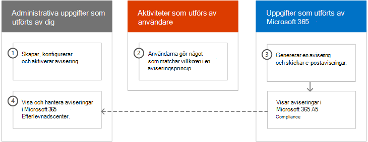
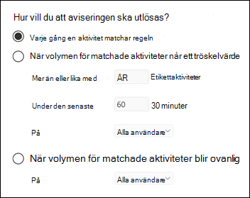

# <a name="alert-policies-in-the-microsoft-365-compliance-center"></a><span data-ttu-id="d19b4-103">Aviseringsprinciper i Microsoft 365 Efterlevnadscenter</span><span class="sxs-lookup"><span data-stu-id="d19b4-103">Alert policies in the Microsoft 365 compliance center</span></span>

<span data-ttu-id="d19b4-104">Du kan använda verktygen för aviseringsprincip och aviseringsinstrumentpanel i Microsoft 365 Efterlevnadscenter för att skapa aviseringsprinciper och sedan visa de aviseringar som genereras när användare utför aktiviteter som matchar villkoren i en aviseringsprincip.</span><span class="sxs-lookup"><span data-stu-id="d19b4-104">You can use the alert policy and alert dashboard tools in the Microsoft 365 compliance center to create alert policies and then view the alerts generated when users perform activities that match the conditions of an alert policy.</span></span> <span data-ttu-id="d19b4-105">Det finns flera standardprinciper för aviseringar som hjälper dig att övervaka aktiviteter, till exempel tilldela administratörsbehörigheter i Exchange Online, attacker mot skadlig programvara, nätfiskekampanjer och ovanliga nivåer av filborttagning och extern delning.</span><span class="sxs-lookup"><span data-stu-id="d19b4-105">There are several default alert policies that help you monitor activities such as assigning admin privileges in Exchange Online, malware attacks, phishing campaigns, and unusual levels of file deletions and external sharing.</span></span>

<span data-ttu-id="d19b4-106">Med aviseringsprinciper kan du kategorisera aviseringar som utlöses av en princip, tillämpa principen på alla användare i organisationen, ange en tröskelvärdesnivå för när en avisering ska utlösas och bestämma om du vill få e-postaviseringar när aviseringar utlöses.</span><span class="sxs-lookup"><span data-stu-id="d19b4-106">Alert policies let you categorize the alerts that are triggered by a policy, apply the policy to all users in your organization, set a threshold level for when an alert is triggered, and decide whether to receive email notifications when alerts are triggered.</span></span> <span data-ttu-id="d19b4-107">Det finns också  en sida aviseringar i efterlevnadscentret där du kan visa och filtrera aviseringar, ange en aviseringsstatus som hjälper dig att hantera aviseringar och sedan stänga aviseringar när du har hanterat eller löst den underliggande incidenten.</span><span class="sxs-lookup"><span data-stu-id="d19b4-107">There's also a **Alerts** page in the compliance center where you can view and filter alerts, set an alert status to help you manage alerts, and then dismiss alerts after you've addressed or resolved the underlying incident.</span></span>

> [!NOTE]
> <span data-ttu-id="d19b4-108">Aviseringsprinciper är tillgängliga för organisationer som har en prenumeration på Microsoft 365 Enterprise, Office 365 Enterprise eller Office 365 för myndigheter i USA, abonnemanget E1/F1/G1, E3/F3/G3 eller E5/G5.</span><span class="sxs-lookup"><span data-stu-id="d19b4-108">Alert policies are available for organizations with a Microsoft 365 Enterprise, Office 365 Enterprise, or Office 365 US Government E1/F1/G1, E3/F3/G3, or E5/G5 subscription.</span></span> <span data-ttu-id="d19b4-109">Avancerade funktioner är endast tillgängliga för organisationer med en E5/G5-prenumeration eller för organisationer som har en E1/F1/G1- eller E3/F3/G3-prenumeration och en Microsoft Defender för Office 365 P2 eller en Microsoft 365 E5 Compliance- eller E5-prenumeration för eDiscovery och granskning.</span><span class="sxs-lookup"><span data-stu-id="d19b4-109">Advanced functionality is only available for organizations with an E5/G5 subscription, or for organizations that have an E1/F1/G1 or E3/F3/G3 subscription and a Microsoft Defender for Office 365 P2 or a Microsoft 365 E5 Compliance or an E5 eDiscovery and Audit add-on subscription.</span></span> <span data-ttu-id="d19b4-110">Funktionen som kräver en E5/G5 eller en tilläggsprenumeration är markerad i det här avsnittet.</span><span class="sxs-lookup"><span data-stu-id="d19b4-110">The functionality that requires an E5/G5 or add-on subscription is highlighted in this topic.</span></span> <span data-ttu-id="d19b4-111">Observera även att aviseringsprinciper är tillgängliga i Office 365 GCC, GCC hög och doD amerikanska myndigheters miljöer.</span><span class="sxs-lookup"><span data-stu-id="d19b4-111">Also note that alert policies are available in Office 365 GCC, GCC High, and DoD US government environments.</span></span>

## <a name="how-alert-policies-work"></a><span data-ttu-id="d19b4-112">Hur aviseringsprinciper fungerar</span><span class="sxs-lookup"><span data-stu-id="d19b4-112">How alert policies work</span></span>

<span data-ttu-id="d19b4-113">Här är en snabb överblick över hur aviseringsprinciper fungerar och aviseringar som utlöses när användar- eller administratörsaktivitet matchar villkoren i en aviseringsprincip.</span><span class="sxs-lookup"><span data-stu-id="d19b4-113">Here's a quick overview of how alert policies work and the alerts that are triggers when user or admin activity matches the conditions of an alert policy.</span></span>



1. <span data-ttu-id="d19b4-115">En administratör i organisationen skapar, konfigurerar och aktiverar en aviseringsprincip genom att använda **sidan Aviseringsprinciper** i efterlevnadscentret.</span><span class="sxs-lookup"><span data-stu-id="d19b4-115">An admin in your organization creates, configures, and turns on an alert policy by using the **Alert policies** page in the compliance center.</span></span> <span data-ttu-id="d19b4-116">Du kan också skapa aviseringsprinciper med hjälp av cmdleten [New-ProtectionAlert](/powershell/module/exchange/new-protectionalert) i Security & Compliance Center PowerShell.</span><span class="sxs-lookup"><span data-stu-id="d19b4-116">You can also create alert policies by using the [New-ProtectionAlert](/powershell/module/exchange/new-protectionalert) cmdlet in Security & Compliance Center PowerShell.</span></span>

   <span data-ttu-id="d19b4-117">För att skapa aviseringsprinciper måste du ha tilldelats rollen Hantera aviseringar eller rollen Organisationskonfiguration i efterlevnadscentret.</span><span class="sxs-lookup"><span data-stu-id="d19b4-117">To create alert policies, you have to be assigned the Manage Alerts role or the Organization Configuration role in the compliance center.</span></span>

   > [!NOTE]
   > <span data-ttu-id="d19b4-118">Det tar upp till 24 timmar efter att en aviseringsprincip har skapats eller uppdaterats innan aviseringar kan utlösas av principen.</span><span class="sxs-lookup"><span data-stu-id="d19b4-118">It takes up to 24 hours after creating or updating an alert policy before alerts can be triggered by the policy.</span></span> <span data-ttu-id="d19b4-119">Det beror på att principen måste synkroniseras till aviseringsmotorn.</span><span class="sxs-lookup"><span data-stu-id="d19b4-119">This is because the policy has to be synced to the alert detection engine.</span></span>

2. <span data-ttu-id="d19b4-120">En användare utför en aktivitet som matchar villkoren i en aviseringsprincip.</span><span class="sxs-lookup"><span data-stu-id="d19b4-120">A user performs an activity that matches the conditions of an alert policy.</span></span> <span data-ttu-id="d19b4-121">Vid attacker mot skadlig programvara utlöser smittade e-postmeddelanden som skickas till användare i organisationen en avisering.</span><span class="sxs-lookup"><span data-stu-id="d19b4-121">In the case of malware attacks, infected email messages sent to users in your organization trigger an alert.</span></span>

3. <span data-ttu-id="d19b4-122">Microsoft 365 en avisering som visas på sidan Aviseringar **i** Microsoft 365 Efterlevnadscenter.</span><span class="sxs-lookup"><span data-stu-id="d19b4-122">Microsoft 365 generates an alert that's displayed on the **Alerts** page in Microsoft 365 compliance center.</span></span> <span data-ttu-id="d19b4-123">Och om e-postaviseringar är aktiverade för aviseringsprincipen skickar Microsoft en avisering till en lista över mottagare.</span><span class="sxs-lookup"><span data-stu-id="d19b4-123">Also, if email notifications are enabled for the alert policy, Microsoft sends a notification to a list of recipients.</span></span> <span data-ttu-id="d19b4-124">Vilka aviseringar som en administratör eller andra användare kan se på sidan Aviseringar bestäms av användarens roller.</span><span class="sxs-lookup"><span data-stu-id="d19b4-124">The alerts that an admin or other users can see that on the Alerts page is determined by the roles assigned to the user.</span></span> <span data-ttu-id="d19b4-125">Mer information finns i [RBAC-behörigheter som krävs för att visa aviseringar.](#rbac-permissions-required-to-view-alerts)</span><span class="sxs-lookup"><span data-stu-id="d19b4-125">For more information, see [RBAC permissions required to view alerts](#rbac-permissions-required-to-view-alerts).</span></span>

4. <span data-ttu-id="d19b4-126">En administratör hanterar aviseringar i efterlevnadscentret.</span><span class="sxs-lookup"><span data-stu-id="d19b4-126">An admin manages alerts in the compliance center.</span></span> <span data-ttu-id="d19b4-127">Hantering av aviseringar består av att tilldela en aviseringsstatus för att spåra och hantera en undersökning.</span><span class="sxs-lookup"><span data-stu-id="d19b4-127">Managing alerts consists of assigning an alert status to help track and manage any investigation.</span></span>

## <a name="alert-policy-settings"></a><span data-ttu-id="d19b4-128">Aviseringsprincipinställningar</span><span class="sxs-lookup"><span data-stu-id="d19b4-128">Alert policy settings</span></span>

<span data-ttu-id="d19b4-129">En aviseringsprincip består av en uppsättning regler och villkor som definierar den användar- eller administratörsaktivitet som genererar en avisering, en lista över användare som utlöser aviseringen om de utför aktiviteten samt ett tröskelvärde som anger hur många gånger aktiviteten måste utföras innan en avisering utlöses.</span><span class="sxs-lookup"><span data-stu-id="d19b4-129">An alert policy consists of a set of rules and conditions that define the user or admin activity that generates an alert, a list of users who trigger the alert if they perform the activity, and a threshold that defines how many times the activity has to occur before an alert is triggered.</span></span> <span data-ttu-id="d19b4-130">Du kategoriserar även principen och tilldelar den en allvarlighetsnivå.</span><span class="sxs-lookup"><span data-stu-id="d19b4-130">You also categorize the policy and assign it a severity level.</span></span> <span data-ttu-id="d19b4-131">De här två inställningarna hjälper dig att hantera aviseringsprinciper (och aviseringar som utlöses när principvillkoren matchas) eftersom du kan filtrera på de här inställningarna när du hanterar principer och visar aviseringar i efterlevnadscentret.</span><span class="sxs-lookup"><span data-stu-id="d19b4-131">These two settings help you manage alert policies (and the alerts that are triggered when the policy conditions are matched) because you can filter on these settings when managing policies and viewing alerts in the compliance center.</span></span> <span data-ttu-id="d19b4-132">Du kan till exempel visa aviseringar som matchar villkoren från samma kategori eller visa aviseringar med samma allvarlighetsnivå.</span><span class="sxs-lookup"><span data-stu-id="d19b4-132">For example, you can view alerts that match the conditions from the same category or view alerts with the same severity level.</span></span>

<span data-ttu-id="d19b4-133">**Så här visar och skapar du aviseringsprinciper:**</span><span class="sxs-lookup"><span data-stu-id="d19b4-133">**To view and create alert policies:**</span></span>

<span data-ttu-id="d19b4-134">Gå till <https://compliance.microsoft.com> och välj sedan Principer **aviseringsprinciper** för  >    >  **avisering.**</span><span class="sxs-lookup"><span data-stu-id="d19b4-134">Go to <https://compliance.microsoft.com> and then select **Policies** > **Alert** > **Alert policies**.</span></span> <span data-ttu-id="d19b4-135">Alternativt kan du gå direkt till <https://compliance.microsoft.com/alertpolicies> .</span><span class="sxs-lookup"><span data-stu-id="d19b4-135">Alternatively, you can go directly to <https://compliance.microsoft.com/alertpolicies>.</span></span>


<span data-ttu-id="d19b4-137">En aviseringsprincip består av följande inställningar och villkor.</span><span class="sxs-lookup"><span data-stu-id="d19b4-137">An alert policy consists of the following settings and conditions.</span></span>

- <span data-ttu-id="d19b4-138">**Aktiviteten som aviseringen spårar**.</span><span class="sxs-lookup"><span data-stu-id="d19b4-138">**Activity the alert is tracking**.</span></span> <span data-ttu-id="d19b4-139">Du skapar en princip för att spåra en aktivitet eller i vissa fall några relaterade aktiviteter, t.ex. att dela en fil med en extern användare genom att dela den, tilldela åtkomstbehörigheter eller skapa en anonym länk.</span><span class="sxs-lookup"><span data-stu-id="d19b4-139">You create a policy to track an activity or in some cases a few related activities, such a sharing a file with an external user by sharing it, assigning access permissions, or creating an anonymous link.</span></span> <span data-ttu-id="d19b4-140">När en användare utför aktiviteten som definieras av principen utlöses en avisering baserat på inställningarna för aviseringströskel.</span><span class="sxs-lookup"><span data-stu-id="d19b4-140">When a user performs the activity defined by the policy, an alert is triggered based on the alert threshold settings.</span></span>

    > [!NOTE]
    > <span data-ttu-id="d19b4-141">Vilka aktiviteter du kan spåra beror på organisationens plan för Office 365 Enterprise eller Office 365 amerikanska myndigheter.</span><span class="sxs-lookup"><span data-stu-id="d19b4-141">The activities that you can track depend on your organization's Office 365 Enterprise or Office 365 US Government plan.</span></span> <span data-ttu-id="d19b4-142">I allmänhet kräver aktiviteter som rör skadlig programvara och nätfiskeattacker en E5/G5-prenumeration eller en E1/F1/G1- eller E3/F3/G3-prenumeration med en [Defender för Office 365](../security/office-365-security/defender-for-office-365.md) Abonnemang 2-tilläggsprenumeration.</span><span class="sxs-lookup"><span data-stu-id="d19b4-142">In general, activities related to malware campaigns and phishing attacks require an E5/G5 subscription or an E1/F1/G1 or E3/F3/G3 subscription with an [Defender for Office 365](../security/office-365-security/defender-for-office-365.md) Plan 2 add-on subscription.</span></span>

- <span data-ttu-id="d19b4-143">**Aktivitetsvillkor**.</span><span class="sxs-lookup"><span data-stu-id="d19b4-143">**Activity conditions**.</span></span> <span data-ttu-id="d19b4-144">För de flesta aktiviteter kan du definiera ytterligare villkor som måste uppfyllas för att utlösa en avisering.</span><span class="sxs-lookup"><span data-stu-id="d19b4-144">For most activities, you can define additional conditions that must be met to trigger an alert.</span></span> <span data-ttu-id="d19b4-145">Vanliga villkor omfattar IP-adresser (så att en avisering utlöses när användaren utför aktiviteten på en dator med en viss IP-adress eller inom ett IP-adressintervall), om en avisering utlöses om en viss användare eller användare utför aktiviteten och om aktiviteten utförs på ett visst filnamn eller en viss URL.</span><span class="sxs-lookup"><span data-stu-id="d19b4-145">Common conditions include IP addresses (so that an alert is triggered when the user performs the activity on a computer with a specific IP address or within an IP address range), whether an alert is triggered if a specific user or users perform that activity, and whether the activity is performed on a specific file name or URL.</span></span> <span data-ttu-id="d19b4-146">Du kan också konfigurera ett villkor som utlöser en avisering när aktiviteten utförs av en användare i organisationen.</span><span class="sxs-lookup"><span data-stu-id="d19b4-146">You can also configure a condition that triggers an alert when the activity is performed by any user in your organization.</span></span> <span data-ttu-id="d19b4-147">De tillgängliga villkoren är beroende av den valda aktiviteten.</span><span class="sxs-lookup"><span data-stu-id="d19b4-147">The available conditions are dependent on the selected activity.</span></span>

- <span data-ttu-id="d19b4-148">**När aviseringen utlöses**.</span><span class="sxs-lookup"><span data-stu-id="d19b4-148">**When the alert is triggered**.</span></span> <span data-ttu-id="d19b4-149">Du kan konfigurera en inställning som definierar hur ofta en aktivitet kan inträffa innan en avisering utlöses.</span><span class="sxs-lookup"><span data-stu-id="d19b4-149">You can configure a setting that defines how often an activity can occur before an alert is triggered.</span></span> <span data-ttu-id="d19b4-150">Det här gör att du kan konfigurera en princip för att generera en avisering varje gång en aktivitet matchar principvillkoren, när ett visst tröskelvärde överskrids eller när förekomsten av aktiviteten som aviseringen spårar blir ovanlig för organisationen.</span><span class="sxs-lookup"><span data-stu-id="d19b4-150">This allows you to set up a policy to generate an alert every time an activity matches the policy conditions, when a certain threshold is exceeded, or when the occurrence of the activity the alert is tracking becomes unusual for your organization.</span></span>

    

    <span data-ttu-id="d19b4-152">Om du väljer inställningen baserat på ovanlig aktivitet upprättar Microsoft ett baslinjevärde som definierar normalfrekvensen för den valda aktiviteten.</span><span class="sxs-lookup"><span data-stu-id="d19b4-152">If you select the setting based on unusual activity, Microsoft establishes a baseline value that defines the normal frequency for the selected activity.</span></span> <span data-ttu-id="d19b4-153">Det tar upp till sju dagar att upprätta den här baslinjen, då aviseringar inte genereras.</span><span class="sxs-lookup"><span data-stu-id="d19b4-153">It takes up to seven days to establish this baseline, during which alerts won't be generated.</span></span> <span data-ttu-id="d19b4-154">När baslinjen har upprättats utlöses en avisering när frekvensen för aktiviteten som spåras av aviseringsprincipen avsevärt överskrider baslinjevärdet.</span><span class="sxs-lookup"><span data-stu-id="d19b4-154">After the baseline is established, an alert is triggered when the frequency of the activity tracked by the alert policy greatly exceeds the baseline value.</span></span> <span data-ttu-id="d19b4-155">För granskningsrelaterade aktiviteter (till exempel fil- och mappaktiviteter) kan du skapa en baslinje baserat på en enskild användare eller baserat på alla användare i organisationen. för aktiviteter som rör skadlig programvara kan du upprätta en baslinje baserat på en enskild programfamilj, en enskild mottagare eller alla meddelanden i organisationen.</span><span class="sxs-lookup"><span data-stu-id="d19b4-155">For auditing-related activities (such as file and folder activities), you can establish a baseline based on a single user or based on all users in your organization; for malware-related activities, you can establish a baseline based on a single malware family, a single recipient, or all messages in your organization.</span></span>

    > [!NOTE]
    > <span data-ttu-id="d19b4-156">Möjligheten att konfigurera aviseringsprinciper baserat på ett tröskelvärde eller baserat på ovanlig aktivitet kräver en prenumeration på E5/G5 eller en prenumeration på E1/F1/F1 eller E3/F3/G3 med en prenumeration på Microsoft Defender för Office 365 P2, Microsoft 365 E5 Compliance eller Microsoft 365 för tillägget eDiscovery och granskning.</span><span class="sxs-lookup"><span data-stu-id="d19b4-156">The ability to configure alert policies based on a threshold or based on unusual activity requires an E5/G5 subscription, or an E1/F1/G1 or E3/F3/G3 subscription with a Microsoft Defender for Office 365 P2, Microsoft 365 E5 Compliance, or Microsoft 365 eDiscovery and Audit add-on subscription.</span></span> <span data-ttu-id="d19b4-157">Organisationer som har en E1/F1/G1- och E3/F3/G3-prenumeration kan bara skapa aviseringsprinciper där en avisering utlöses varje gång en aktivitet inträffar.</span><span class="sxs-lookup"><span data-stu-id="d19b4-157">Organizations with an E1/F1/G1 and E3/F3/G3 subscription can only create alert policies where an alert is triggered every time that an activity occurs.</span></span>

- <span data-ttu-id="d19b4-158">**Aviseringskategori**.</span><span class="sxs-lookup"><span data-stu-id="d19b4-158">**Alert category**.</span></span> <span data-ttu-id="d19b4-159">För att underlätta uppföljning och hantering av aviseringar som genereras av en princip kan du tilldela en av följande kategorier till en princip.</span><span class="sxs-lookup"><span data-stu-id="d19b4-159">To help with tracking and managing the alerts generated by a policy, you can assign one of the following categories to a policy.</span></span>

  - <span data-ttu-id="d19b4-160">Skydd mot dataförlust</span><span class="sxs-lookup"><span data-stu-id="d19b4-160">Data loss prevention</span></span>

  - <span data-ttu-id="d19b4-161">Informationsstyrning</span><span class="sxs-lookup"><span data-stu-id="d19b4-161">Information governance</span></span>

  - <span data-ttu-id="d19b4-162">E-postflöde</span><span class="sxs-lookup"><span data-stu-id="d19b4-162">Mail flow</span></span>

  - <span data-ttu-id="d19b4-163">Behörigheter</span><span class="sxs-lookup"><span data-stu-id="d19b4-163">Permissions</span></span>

  - <span data-ttu-id="d19b4-164">Hothantering</span><span class="sxs-lookup"><span data-stu-id="d19b4-164">Threat management</span></span>

  - <span data-ttu-id="d19b4-165">Andra</span><span class="sxs-lookup"><span data-stu-id="d19b4-165">Others</span></span>

  <span data-ttu-id="d19b4-166">När en aktivitet inträffar som matchar villkoren i aviseringsprincipen taggas den avisering som skapas med den kategori som definierats i den här inställningen.</span><span class="sxs-lookup"><span data-stu-id="d19b4-166">When an activity occurs that matches the conditions of the alert policy, the alert that's generated is tagged with the category defined in this setting.</span></span> <span data-ttu-id="d19b4-167">På så sätt kan du spåra och hantera  aviseringar som har samma kategoriinställning på sidan Aviseringar i efterlevnadscentret eftersom du kan sortera och filtrera aviseringar baserat på kategori.</span><span class="sxs-lookup"><span data-stu-id="d19b4-167">This allows you to track and manage alerts that have the same category setting on the **Alerts** page in the compliance center because you can sort and filter alerts based on category.</span></span>

- <span data-ttu-id="d19b4-168">**Aviserings allvarlighetsgrad**.</span><span class="sxs-lookup"><span data-stu-id="d19b4-168">**Alert severity**.</span></span> <span data-ttu-id="d19b4-169">På ungefär samma sätt som aviseringskategorin tilldelar du ett attribut för allvarlighetsgrad **(låg,**  **medel,** hög eller **information)** till aviseringsprinciper.</span><span class="sxs-lookup"><span data-stu-id="d19b4-169">Similar to the alert category, you assign a severity attribute (**Low**, **Medium**, **High**, or **Informational**) to alert policies.</span></span> <span data-ttu-id="d19b4-170">På samma sätt som aviseringskategorin taggas den avisering som skapas med samma allvarlighetsnivå som angetts för aviseringsprincipen när en aktivitet inträffar som matchar villkoren i aviseringsprincipen.</span><span class="sxs-lookup"><span data-stu-id="d19b4-170">Like the alert category, when an activity occurs that matches the conditions of the alert policy, the alert that's generated is tagged with the same severity level that's set for the alert policy.</span></span> <span data-ttu-id="d19b4-171">På så sätt kan du spåra och hantera aviseringar som har samma inställning för allvarlighetsgrad på **sidan** Aviseringar.</span><span class="sxs-lookup"><span data-stu-id="d19b4-171">Again, this allows you to track and manage alerts that have the same severity setting on the **Alerts** page.</span></span> <span data-ttu-id="d19b4-172">Du kan till exempel filtrera listan med aviseringar så att endast aviseringar med **hög** allvarlighetsgrad visas.</span><span class="sxs-lookup"><span data-stu-id="d19b4-172">For example, you can filter the list of alerts so that only alerts with a **High** severity are displayed.</span></span>

    > [!TIP]
    > <span data-ttu-id="d19b4-173">När du ställer in en aviseringsprincip kan du överväga att tilldela aktiviteter med större allvarlighetsgrad som kan leda till allvarliga negativa konsekvenser, t.ex. identifiering av skadlig programvara efter leverans till användare, visning av känsliga eller klassificerade data, delning av data med externa användare eller andra aktiviteter som kan leda till dataförlust eller säkerhetshot.</span><span class="sxs-lookup"><span data-stu-id="d19b4-173">When setting up an alert policy, consider assigning a higher severity to activities that can result in severely negative consequences, such as detection of malware after delivery to users, viewing of sensitive or classified data, sharing data with external users, or other activities that can result in data loss or security threats.</span></span> <span data-ttu-id="d19b4-174">Det kan hjälpa dig att prioritera aviseringar och de åtgärder du vidta för att undersöka och lösa de underliggande orsakerna.</span><span class="sxs-lookup"><span data-stu-id="d19b4-174">This can help you prioritize alerts and the actions you take to investigate and resolve the underlying causes.</span></span>

- <span data-ttu-id="d19b4-175">**E-postaviseringar.**</span><span class="sxs-lookup"><span data-stu-id="d19b4-175">**Email notifications**.</span></span> <span data-ttu-id="d19b4-176">Du kan konfigurera principen så att e-postaviseringar skickas (eller inte skickas) till en lista med användare när en avisering utlöses.</span><span class="sxs-lookup"><span data-stu-id="d19b4-176">You can set up the policy so that email notifications are sent (or not sent) to a list of users when an alert is triggered.</span></span> <span data-ttu-id="d19b4-177">Du kan också ange en daglig aviseringsgräns så att inga fler aviseringar skickas för aviseringen under den dagen när det maximala antalet aviseringar har uppnåtts.</span><span class="sxs-lookup"><span data-stu-id="d19b4-177">You can also set a daily notification limit so that once the maximum number of notifications has been reached, no more notifications are sent for the alert during that day.</span></span> <span data-ttu-id="d19b4-178">Förutom e-postaviseringar kan du och andra administratörer visa aviseringar som utlöses av en princip på **sidan** Aviseringar.</span><span class="sxs-lookup"><span data-stu-id="d19b4-178">In addition to email notifications, you or other administrators can view the alerts that are triggered by a policy on the **Alerts** page.</span></span> <span data-ttu-id="d19b4-179">Överväg att aktivera e-postaviseringar för aviseringsprinciper för en viss kategori eller som har en högre inställning för allvarlighetsgrad.</span><span class="sxs-lookup"><span data-stu-id="d19b4-179">Consider enabling email notifications for alert policies of a specific category or that have a higher severity setting.</span></span>

## <a name="default-alert-policies"></a><span data-ttu-id="d19b4-180">Standardaviseringsprinciper</span><span class="sxs-lookup"><span data-stu-id="d19b4-180">Default alert policies</span></span>

<span data-ttu-id="d19b4-181">Microsoft tillhandahåller inbyggda aviseringsprinciper som hjälper till Exchange identifiera missbruk av administratörsbehörighet, skadlig programvara, potentiella externa och interna hot samt informationsstyrningsrisker.</span><span class="sxs-lookup"><span data-stu-id="d19b4-181">Microsoft provides built-in alert policies that help identify Exchange admin permissions abuse, malware activity, potential external and internal threats, and information governance risks.</span></span> <span data-ttu-id="d19b4-182">På sidan **Aviseringsprinciper** är namnen på dessa inbyggda principer i fetstil och principtypen definieras som **System**.</span><span class="sxs-lookup"><span data-stu-id="d19b4-182">On the **Alert policies** page, the names of these built-in policies are in bold and the policy type is defined as **System**.</span></span> <span data-ttu-id="d19b4-183">De här principerna är aktiverat som standard.</span><span class="sxs-lookup"><span data-stu-id="d19b4-183">These policies are turned on by default.</span></span> <span data-ttu-id="d19b4-184">Du kan inaktivera de här principerna (eller aktivera dem igen), konfigurera en lista över mottagare att skicka e-postaviseringar till och ange en daglig aviseringsgräns.</span><span class="sxs-lookup"><span data-stu-id="d19b4-184">You can turn off these policies (or back on again), set up a list of recipients to send email notifications to, and set a daily notification limit.</span></span> <span data-ttu-id="d19b4-185">Andra inställningar för dessa principer kan inte redigeras.</span><span class="sxs-lookup"><span data-stu-id="d19b4-185">The other settings for these policies can't be edited.</span></span>

<span data-ttu-id="d19b4-186">I följande tabell visas och beskrivs de tillgängliga standardaviseringsprinciperna och den kategori som varje princip tilldelas till.</span><span class="sxs-lookup"><span data-stu-id="d19b4-186">The following table lists and describes the available default alert policies and the category each policy is assigned to.</span></span> <span data-ttu-id="d19b4-187">Kategorin används för att avgöra vilka aviseringar en användare kan visa på sidan Aviseringar.</span><span class="sxs-lookup"><span data-stu-id="d19b4-187">The category is used to determine which alerts a user can view on the Alerts page.</span></span> <span data-ttu-id="d19b4-188">Mer information finns i [RBAC-behörigheter som krävs för att visa aviseringar.](#rbac-permissions-required-to-view-alerts)</span><span class="sxs-lookup"><span data-stu-id="d19b4-188">For more information, see [RBAC permissions required to view alerts](#rbac-permissions-required-to-view-alerts).</span></span>

<span data-ttu-id="d19b4-189">Tabellen anger också vilket Office 365 Enterprise och Office 365 för var och en av dem.</span><span class="sxs-lookup"><span data-stu-id="d19b4-189">The table also indicates the Office 365 Enterprise and Office 365 US Government plan required for each one.</span></span> <span data-ttu-id="d19b4-190">Vissa standardaviseringsprinciper är tillgängliga om din organisation har rätt tilläggsprenumeration utöver en E1/F1/G1- eller E3/F3/G3-prenumeration.</span><span class="sxs-lookup"><span data-stu-id="d19b4-190">Some default alert policies are available if your organization has the appropriate add-on subscription in addition to an E1/F1/G1 or E3/F3/G3 subscription.</span></span>

| <span data-ttu-id="d19b4-191">Standardaviseringsprincip</span><span class="sxs-lookup"><span data-stu-id="d19b4-191">Default alert policy</span></span> | <span data-ttu-id="d19b4-192">Beskrivning</span><span class="sxs-lookup"><span data-stu-id="d19b4-192">Description</span></span> | <span data-ttu-id="d19b4-193">Kategori</span><span class="sxs-lookup"><span data-stu-id="d19b4-193">Category</span></span> | <span data-ttu-id="d19b4-194">Enterprise-prenumeration</span><span class="sxs-lookup"><span data-stu-id="d19b4-194">Enterprise subscription</span></span> |
|:-----|:-----|:-----|:-----|
|<span data-ttu-id="d19b4-195">**Ett potentiellt skadligt URL-klick upptäcktes**</span><span class="sxs-lookup"><span data-stu-id="d19b4-195">**A potentially malicious URL click was detected**</span></span>|<span data-ttu-id="d19b4-196">Genererar en avisering när en användare som skyddas [Valv länkar](../security/office-365-security/safe-links.md) i din organisation klickar på en skadlig länk.</span><span class="sxs-lookup"><span data-stu-id="d19b4-196">Generates an alert when a user protected by [Safe Links](../security/office-365-security/safe-links.md) in your organization clicks a malicious link.</span></span> <span data-ttu-id="d19b4-197">Händelsen utlöses när ändringar av URL-bedömning identifieras av Microsoft Defender för Office 365 eller när användare åsidosätter Valv-länksidorna (baserat på organisationens Microsoft 365 för företag Valv Links-policy).</span><span class="sxs-lookup"><span data-stu-id="d19b4-197">This event is triggered when URL verdict changes are identified by Microsoft Defender for Office 365 or when users override the Safe Links pages (based on your organization's Microsoft 365 for business Safe Links policy).</span></span> <span data-ttu-id="d19b4-198">Den här aviseringsprincipen har **inställningen Hög** allvarlighetsgrad.</span><span class="sxs-lookup"><span data-stu-id="d19b4-198">This alert policy has a **High** severity setting.</span></span> <span data-ttu-id="d19b4-199">För Defender för Office 365 P2-, E5- och G5-kunder utlöser den här aviseringen automatiskt automatisk undersökning och [svar i Office 365.](../security/office-365-security/office-365-air.md)</span><span class="sxs-lookup"><span data-stu-id="d19b4-199">For Defender for Office 365 P2, E5, G5 customers, this alert automatically triggers [automated investigation and response in Office 365](../security/office-365-security/office-365-air.md).</span></span> <span data-ttu-id="d19b4-200">Mer information om händelser som utlöser den här aviseringen finns [i Konfigurera Valv principer för länkar.](../security/office-365-security/set-up-safe-links-policies.md)</span><span class="sxs-lookup"><span data-stu-id="d19b4-200">For more information on events that trigger this alert, see [Set up Safe Links policies](../security/office-365-security/set-up-safe-links-policies.md).</span></span>|<span data-ttu-id="d19b4-201">Hothantering</span><span class="sxs-lookup"><span data-stu-id="d19b4-201">Threat management</span></span>|<span data-ttu-id="d19b4-202">E5/G5 eller Defender Office 365 en P2-tilläggsprenumeration</span><span class="sxs-lookup"><span data-stu-id="d19b4-202">E5/G5 or Defender for Office 365 P2 add-on subscription</span></span>|
|<span data-ttu-id="d19b4-203">**Resultat av administratörsinskick slutfört**</span><span class="sxs-lookup"><span data-stu-id="d19b4-203">**Admin Submission result completed**</span></span>|<span data-ttu-id="d19b4-204">Genererar en avisering när en [administratörs inskickad](../security/office-365-security/admin-submission.md) inskickad entitet har slutförts.</span><span class="sxs-lookup"><span data-stu-id="d19b4-204">Generates an alert when an [Admin Submission](../security/office-365-security/admin-submission.md) completes the rescan of the submitted entity.</span></span> <span data-ttu-id="d19b4-205">En avisering utlöses varje gång ett återskanna resultat återges från en inskickad administratör.</span><span class="sxs-lookup"><span data-stu-id="d19b4-205">An alert will be triggered every time a rescan result is rendered from an Admin Submission.</span></span> <span data-ttu-id="d19b4-206">Dessa aviseringar är avsedda [](https://protection.office.com/reportsubmission)att påminna dig att granska resultaten av tidigare inskickade , skicka användarrapporterade meddelanden för att få den senaste principkontrollen och visa på nytt för att avgöra om filtreringsprinciperna i organisationen har den avsedda påverkan.</span><span class="sxs-lookup"><span data-stu-id="d19b4-206">These alerts are meant to remind you to [review the results of previous submissions](https://protection.office.com/reportsubmission), submit user reported messages to get the latest policy check and rescan verdicts, and help you determine if the filtering policies in your organization are having the intended impact.</span></span> <span data-ttu-id="d19b4-207">Den här principen har inställningen **Informations** allvarlighetsgrad.</span><span class="sxs-lookup"><span data-stu-id="d19b4-207">This policy has a **Informational** severity setting.</span></span>|<span data-ttu-id="d19b4-208">Hothantering</span><span class="sxs-lookup"><span data-stu-id="d19b4-208">Threat management</span></span>|<span data-ttu-id="d19b4-209">E1/F1, E3/F3 eller E5</span><span class="sxs-lookup"><span data-stu-id="d19b4-209">E1/F1, E3/F3, or E5</span></span>|
|<span data-ttu-id="d19b4-210">**Admin utlöst manuell undersökning av e-post**</span><span class="sxs-lookup"><span data-stu-id="d19b4-210">**Admin triggered manual investigation of email**</span></span>|<span data-ttu-id="d19b4-211">Genererar en varning när en administratör utlöser manuell undersökning av ett e-postmeddelande från Hotutforskaren.</span><span class="sxs-lookup"><span data-stu-id="d19b4-211">Generates an alert when an admin triggers the manual investigation of an email from Threat Explorer.</span></span> <span data-ttu-id="d19b4-212">Mer information finns i [Exempel: En säkerhetsadministratör utlöser en undersökning från Threat Explorer](../security/office-365-security/automated-investigation-response-office.md#example-a-security-administrator-triggers-an-investigation-from-threat-explorer).</span><span class="sxs-lookup"><span data-stu-id="d19b4-212">For more information, see [Example: A security administrator triggers an investigation from Threat Explorer](../security/office-365-security/automated-investigation-response-office.md#example-a-security-administrator-triggers-an-investigation-from-threat-explorer).</span></span> <span data-ttu-id="d19b4-213">Det här meddelandet meddelar organisationen att undersökningen har påbörjats.</span><span class="sxs-lookup"><span data-stu-id="d19b4-213">This alert notifies your organization that the investigation was started.</span></span> <span data-ttu-id="d19b4-214">Aviseringen ger information om vem som utlöste den och innehåller en länk till undersökningen.</span><span class="sxs-lookup"><span data-stu-id="d19b4-214">The alert provides information about who triggered it and includes a link to the investigation.</span></span> <span data-ttu-id="d19b4-215">Den här principen har inställningen **Allvarlighetsgrad** i information.</span><span class="sxs-lookup"><span data-stu-id="d19b4-215">This policy has an **Informational** severity setting.</span></span>|<span data-ttu-id="d19b4-216">Hothantering</span><span class="sxs-lookup"><span data-stu-id="d19b4-216">Threat management</span></span>| <span data-ttu-id="d19b4-217">E5/G5 eller Microsoft Defender Office 365 en P2-tilläggsprenumeration</span><span class="sxs-lookup"><span data-stu-id="d19b4-217">E5/G5 or Microsoft Defender for Office 365 P2 add-on subscription</span></span>| 
|<span data-ttu-id="d19b4-218">**Skapa regel för vidarebefordran / omdirigering**</span><span class="sxs-lookup"><span data-stu-id="d19b4-218">**Creation of forwarding/redirect rule**</span></span>|<span data-ttu-id="d19b4-219">Genererar en avisering när någon i organisationen skapar en inkorgsregel för sin postlåda som vidarebefordrar eller omdirigerar meddelanden till ett annat e-postkonto.</span><span class="sxs-lookup"><span data-stu-id="d19b4-219">Generates an alert when someone in your organization creates an inbox rule for their mailbox that forwards or redirects messages to another email account.</span></span> <span data-ttu-id="d19b4-220">Med den här principen spårar du bara inkorgsregler som skapats med Outlook på webben (tidigare kallat Outlook Web App) eller Exchange Online PowerShell.</span><span class="sxs-lookup"><span data-stu-id="d19b4-220">This policy only tracks inbox rules that are created using Outlook on the web (formerly known as Outlook Web App) or Exchange Online PowerShell.</span></span> <span data-ttu-id="d19b4-221">Den här principen har inställningen **Informations** allvarlighetsgrad.</span><span class="sxs-lookup"><span data-stu-id="d19b4-221">This policy has a **Informational** severity setting.</span></span> <span data-ttu-id="d19b4-222">Mer information om hur du använder inkorgsregler för att vidarebefordra och omdirigera e-Outlook på webben finns i Använda regler i Outlook på webben för att automatiskt vidarebefordra [meddelanden till ett annat konto.](https://support.office.com/article/1433e3a0-7fb0-4999-b536-50e05cb67fed)</span><span class="sxs-lookup"><span data-stu-id="d19b4-222">For more information about using inbox rules to forward and redirect email in Outlook on the web, see [Use rules in Outlook on the web to automatically forward messages to another account](https://support.office.com/article/1433e3a0-7fb0-4999-b536-50e05cb67fed).</span></span>|<span data-ttu-id="d19b4-223">Hothantering</span><span class="sxs-lookup"><span data-stu-id="d19b4-223">Threat management</span></span>|<span data-ttu-id="d19b4-224">E1/F1/G1, E3/F3/G3 eller E5/G5</span><span class="sxs-lookup"><span data-stu-id="d19b4-224">E1/F1/G1, E3/F3/G3, or E5/G5</span></span>|
|<span data-ttu-id="d19b4-225">**eDiscovery-sökning startade eller exporterades**</span><span class="sxs-lookup"><span data-stu-id="d19b4-225">**eDiscovery search started or exported**</span></span>|<span data-ttu-id="d19b4-226">Genererar en avisering när någon använder verktyget Innehållssökning i Säkerhets- och efterlevnadscenter.</span><span class="sxs-lookup"><span data-stu-id="d19b4-226">Generates an alert when someone uses the Content search tool in the Security and compliance center.</span></span> <span data-ttu-id="d19b4-227">En avisering utlöses när följande aktiviteter för innehållssökning utförs:</span><span class="sxs-lookup"><span data-stu-id="d19b4-227">An alert is triggered when the following content search activities are performed:</span></span> <br/><br/><span data-ttu-id="d19b4-228">\* En innehållssökning startas</span><span class="sxs-lookup"><span data-stu-id="d19b4-228">\* A content search is started</span></span><br/><span data-ttu-id="d19b4-229">\* Resultatet av en innehållssökning exporteras</span><span class="sxs-lookup"><span data-stu-id="d19b4-229">\* The results of a content search are exported</span></span><br/><span data-ttu-id="d19b4-230">\* En rapport för innehållssökning exporteras</span><span class="sxs-lookup"><span data-stu-id="d19b4-230">\* A content search report is exported</span></span><br/><br/><span data-ttu-id="d19b4-231">Aviseringar utlöses också när tidigare aktiviteter för innehållssökning utförs tillsammans med ett eDiscovery-ärende.</span><span class="sxs-lookup"><span data-stu-id="d19b4-231">Alerts are also triggered when the previous content search activities are performed in association with an eDiscovery case.</span></span> <span data-ttu-id="d19b4-232">Den här principen har inställningen **Informations** allvarlighetsgrad.</span><span class="sxs-lookup"><span data-stu-id="d19b4-232">This policy has a **Informational** severity setting.</span></span> <span data-ttu-id="d19b4-233">Mer information om aktiviteter för innehållssökning finns i [Söka efter eDiscovery-aktiviteter i granskningsloggen.](search-for-ediscovery-activities-in-the-audit-log.md#ediscovery-activities)</span><span class="sxs-lookup"><span data-stu-id="d19b4-233">For more information about content search activities, see [Search for eDiscovery activities in the audit log](search-for-ediscovery-activities-in-the-audit-log.md#ediscovery-activities).</span></span>|<span data-ttu-id="d19b4-234">Hothantering</span><span class="sxs-lookup"><span data-stu-id="d19b4-234">Threat management</span></span>|<span data-ttu-id="d19b4-235">E1/F1/G1, E3/F3/G3 eller E5/G5</span><span class="sxs-lookup"><span data-stu-id="d19b4-235">E1/F1/G1, E3/F3/G3, or E5/G5</span></span>|
|<span data-ttu-id="d19b4-236">**Höjd på Exchange administratörsbehörighet**</span><span class="sxs-lookup"><span data-stu-id="d19b4-236">**Elevation of Exchange admin privilege**</span></span>|<span data-ttu-id="d19b4-237">Genererar en avisering när någon tilldelas administrativ behörighet i Exchange Online organisation.</span><span class="sxs-lookup"><span data-stu-id="d19b4-237">Generates an alert when someone is assigned administrative permissions in your Exchange Online organization.</span></span> <span data-ttu-id="d19b4-238">Till exempel när en användare läggs till i rollgruppen Organisationshantering i Exchange Online.</span><span class="sxs-lookup"><span data-stu-id="d19b4-238">For example, when a user is added to the Organization Management role group in Exchange Online.</span></span> <span data-ttu-id="d19b4-239">Den här principen har **inställningen Låg** allvarlighetsgrad.</span><span class="sxs-lookup"><span data-stu-id="d19b4-239">This policy has a **Low** severity setting.</span></span>|<span data-ttu-id="d19b4-240">Behörigheter</span><span class="sxs-lookup"><span data-stu-id="d19b4-240">Permissions</span></span>|<span data-ttu-id="d19b4-241">E1/F1/G1, E3/F3/G3 eller E5/G5</span><span class="sxs-lookup"><span data-stu-id="d19b4-241">E1/F1/G1, E3/F3/G3, or E5/G5</span></span>|
|<span data-ttu-id="d19b4-242">**E-postmeddelanden som innehåller skadlig kod har tagits bort efter leverans**</span><span class="sxs-lookup"><span data-stu-id="d19b4-242">**Email messages containing malware removed after delivery**</span></span>|<span data-ttu-id="d19b4-243">Genererar en avisering när meddelanden som innehåller skadlig programvara levereras till postlådor i organisationen.</span><span class="sxs-lookup"><span data-stu-id="d19b4-243">Generates an alert when any messages containing malware are delivered to mailboxes in your organization.</span></span> <span data-ttu-id="d19b4-244">Om den här händelsen inträffar tar Microsoft bort de smittade meddelandena Exchange Online postlådor med automatisk [rensning på nolltimmar.](../security/office-365-security/zero-hour-auto-purge.md)</span><span class="sxs-lookup"><span data-stu-id="d19b4-244">If this event occurs, Microsoft removes the infected messages from Exchange Online mailboxes using [Zero-hour auto purge](../security/office-365-security/zero-hour-auto-purge.md).</span></span> <span data-ttu-id="d19b4-245">Den här principen har en **inställning för** allvarlighetsgrad i information och utlöser automatiskt automatisk undersökning och svar [i Office 365](../security/office-365-security/office-365-air.md).</span><span class="sxs-lookup"><span data-stu-id="d19b4-245">This policy has an **Informational** severity setting and automatically triggers [automated investigation and response in Office 365](../security/office-365-security/office-365-air.md).</span></span>|<span data-ttu-id="d19b4-246">Hothantering</span><span class="sxs-lookup"><span data-stu-id="d19b4-246">Threat management</span></span>|<span data-ttu-id="d19b4-247">E5/G5 eller Microsoft Defender Office 365 en P2-tilläggsprenumeration</span><span class="sxs-lookup"><span data-stu-id="d19b4-247">E5/G5 or Microsoft Defender for Office 365 P2 add-on subscription</span></span>|
|<span data-ttu-id="d19b4-248">**E-postmeddelanden med nätfiske togs bort efter leverans**</span><span class="sxs-lookup"><span data-stu-id="d19b4-248">**Email messages containing phish URLs removed after delivery**</span></span>|<span data-ttu-id="d19b4-249">Genererar en avisering när några meddelanden som innehåller phish levereras till postlådor i din organisation.</span><span class="sxs-lookup"><span data-stu-id="d19b4-249">Generates an alert when any messages containing phish are delivered to mailboxes in your organization.</span></span> <span data-ttu-id="d19b4-250">Om den här händelsen inträffar tar Microsoft bort de smittade meddelandena Exchange Online postlådor med automatisk [rensning på nolltimmar.](../security/office-365-security/zero-hour-auto-purge.md)</span><span class="sxs-lookup"><span data-stu-id="d19b4-250">If this event occurs, Microsoft removes the infected messages from Exchange Online mailboxes using [Zero-hour auto purge](../security/office-365-security/zero-hour-auto-purge.md).</span></span> <span data-ttu-id="d19b4-251">Den här principen har en **inställning för** allvarlighetsgrad i information och utlöser automatiskt automatisk undersökning och svar [i Office 365](../security/office-365-security/office-365-air.md).</span><span class="sxs-lookup"><span data-stu-id="d19b4-251">This policy has an **Informational** severity setting and automatically triggers [automated investigation and response in Office 365](../security/office-365-security/office-365-air.md).</span></span>|<span data-ttu-id="d19b4-252">Hothantering</span><span class="sxs-lookup"><span data-stu-id="d19b4-252">Threat management</span></span>|<span data-ttu-id="d19b4-253">E5/G5 eller Defender Office 365 en P2-tilläggsprenumeration</span><span class="sxs-lookup"><span data-stu-id="d19b4-253">E5/G5 or Defender for Office 365 P2 add-on subscription</span></span>|
|<span data-ttu-id="d19b4-254">**E-postmeddelande rapporterat av användare som skadlig programvara eller nätfiske**</span><span class="sxs-lookup"><span data-stu-id="d19b4-254">**Email reported by user as malware or phish**</span></span>|<span data-ttu-id="d19b4-255">Genererar en avisering när användare i organisationen rapporterar meddelanden som nätfiskemeddelanden med tillägget Rapportmeddelande.</span><span class="sxs-lookup"><span data-stu-id="d19b4-255">Generates an alert when users in your organization  report messages as phishing email using the Report Message add-in.</span></span> <span data-ttu-id="d19b4-256">Den här principen har **inställningen Låg** allvarlighetsgrad.</span><span class="sxs-lookup"><span data-stu-id="d19b4-256">This policy has an **Low** severity setting.</span></span> <span data-ttu-id="d19b4-257">Mer information om det här tillägget finns i [Använda tillägget Rapportmeddelande.](https://support.office.com/article/b5caa9f1-cdf3-4443-af8c-ff724ea719d2)</span><span class="sxs-lookup"><span data-stu-id="d19b4-257">For more information about this add-in, see [Use the Report Message add-in](https://support.office.com/article/b5caa9f1-cdf3-4443-af8c-ff724ea719d2).</span></span> <span data-ttu-id="d19b4-258">För Defender för Office 365 P2-, E5- och G5-kunder utlöser den här aviseringen automatiskt automatisk undersökning och [svar i Office 365.](../security/office-365-security/office-365-air.md)</span><span class="sxs-lookup"><span data-stu-id="d19b4-258">For Defender for Office 365 P2, E5, G5 customers, this alert automatically triggers [automated investigation and response in Office 365](../security/office-365-security/office-365-air.md).</span></span>|<span data-ttu-id="d19b4-259">Hothantering</span><span class="sxs-lookup"><span data-stu-id="d19b4-259">Threat management</span></span>|<span data-ttu-id="d19b4-260">E1/F1/G1, E3/F3/G3 eller E5/G5</span><span class="sxs-lookup"><span data-stu-id="d19b4-260">E1/F1/G1, E3/F3/G3, or E5/G5</span></span>|
|<span data-ttu-id="d19b4-261">**Gränsen för att skicka e-post har överskridits**</span><span class="sxs-lookup"><span data-stu-id="d19b4-261">**Email sending limit exceeded**</span></span>|<span data-ttu-id="d19b4-262">Genererar en avisering när någon i organisationen har skickat mer e-post än vad som tillåts av policyn för utgående skräppost.</span><span class="sxs-lookup"><span data-stu-id="d19b4-262">Generates an alert when someone in your organization has sent more mail than is allowed by the outbound spam policy.</span></span> <span data-ttu-id="d19b4-263">Det är oftast en indikation på att användaren skickar för mycket e-post eller att kontot kan ha komprometterats.</span><span class="sxs-lookup"><span data-stu-id="d19b4-263">This is usually an indication the user is sending too much email or that the account may be compromised.</span></span> <span data-ttu-id="d19b4-264">Den här principen har inställningen **Medel** allvarlighetsgrad.</span><span class="sxs-lookup"><span data-stu-id="d19b4-264">This policy has a **Medium** severity setting.</span></span> <span data-ttu-id="d19b4-265">Om du får en avisering som genereras av den här aviseringsprincipen är det en bra idé att [kontrollera om användarkontot har komprometterats.](../security/office-365-security/responding-to-a-compromised-email-account.md)</span><span class="sxs-lookup"><span data-stu-id="d19b4-265">If you get an alert generated by this alert policy, it's a good idea to [check whether the user account is compromised](../security/office-365-security/responding-to-a-compromised-email-account.md).</span></span>|<span data-ttu-id="d19b4-266">Hothantering</span><span class="sxs-lookup"><span data-stu-id="d19b4-266">Threat management</span></span>|<span data-ttu-id="d19b4-267">E1/F1/G1, E3/F3/G3 eller E5/G5</span><span class="sxs-lookup"><span data-stu-id="d19b4-267">E1/F1/G1, E3/F3/G3, or E5/G5</span></span>|
|<span data-ttu-id="d19b4-268">**Formulär som blockerats på grund av potentiellt nätfiskeförsök**</span><span class="sxs-lookup"><span data-stu-id="d19b4-268">**Form blocked due to potential phishing attempt**</span></span>|<span data-ttu-id="d19b4-269">Genererar en avisering när någon i organisationen har begränsats från att dela formulär och samla in svar med Microsoft Forms på grund av upptäckt upprepat beteende för nätfiskeförsök.</span><span class="sxs-lookup"><span data-stu-id="d19b4-269">Generates an alert when someone in your organization has been restricted from sharing forms and collecting responses using Microsoft Forms due to detected repeated phishing attempt behavior.</span></span> <span data-ttu-id="d19b4-270">Den här principen har **inställningen Hög allvarlighetsgrad.**</span><span class="sxs-lookup"><span data-stu-id="d19b4-270">This policy has a **High severity** setting.</span></span>|<span data-ttu-id="d19b4-271">Hothantering</span><span class="sxs-lookup"><span data-stu-id="d19b4-271">Threat management</span></span>|<span data-ttu-id="d19b4-272">E1, E3/F3 eller E5</span><span class="sxs-lookup"><span data-stu-id="d19b4-272">E1, E3/F3, or E5</span></span>|
|<span data-ttu-id="d19b4-273">**Flaggat formulär och bekräftat som nätfiske**</span><span class="sxs-lookup"><span data-stu-id="d19b4-273">**Form flagged and confirmed as phishing**</span></span>|<span data-ttu-id="d19b4-274">Genererar en avisering när ett formulär som skapats i Microsoft Forms från din organisation har identifierats som potentiellt nätfiske via rapportera missbruk och bekräftats som nätfiske av Microsoft.</span><span class="sxs-lookup"><span data-stu-id="d19b4-274">Generates an alert when a form created in Microsoft Forms from within your organization has been identified as potential phishing through Report Abuse and confirmed as phishing by Microsoft.</span></span> <span data-ttu-id="d19b4-275">Den här principen har **inställningen Hög** allvarlighetsgrad.</span><span class="sxs-lookup"><span data-stu-id="d19b4-275">This policy has a **High** severity setting.</span></span>|<span data-ttu-id="d19b4-276">Hothantering</span><span class="sxs-lookup"><span data-stu-id="d19b4-276">Threat management</span></span>|<span data-ttu-id="d19b4-277">E1, E3/F3 eller E5</span><span class="sxs-lookup"><span data-stu-id="d19b4-277">E1, E3/F3, or E5</span></span>|
|<span data-ttu-id="d19b4-278">**Meddelanden har fördröjts**</span><span class="sxs-lookup"><span data-stu-id="d19b4-278">**Messages have been delayed**</span></span>|<span data-ttu-id="d19b4-279">Genererar en avisering när Microsoft inte kan leverera e-postmeddelanden till din lokala organisation eller en partnerserver med hjälp av en anslutare.</span><span class="sxs-lookup"><span data-stu-id="d19b4-279">Generates an alert when Microsoft can't deliver email messages to your on-premises organization or a partner server by using a connector.</span></span> <span data-ttu-id="d19b4-280">När detta händer är meddelandet i kö i Office 365.</span><span class="sxs-lookup"><span data-stu-id="d19b4-280">When this happens, the message is queued in Office 365.</span></span> <span data-ttu-id="d19b4-281">Den här aviseringen utlöses när det finns 2 000 meddelanden eller fler som har köats i mer än en timme.</span><span class="sxs-lookup"><span data-stu-id="d19b4-281">This alert is triggered when there are 2,000 messages or more that have been queued for more than an hour.</span></span> <span data-ttu-id="d19b4-282">Den här principen har **inställningen Hög** allvarlighetsgrad.</span><span class="sxs-lookup"><span data-stu-id="d19b4-282">This policy has a **High** severity setting.</span></span>|<span data-ttu-id="d19b4-283">E-postflöde</span><span class="sxs-lookup"><span data-stu-id="d19b4-283">Mail flow</span></span>|<span data-ttu-id="d19b4-284">E1/F1/G1, E3/F3/G3 eller E5/G5</span><span class="sxs-lookup"><span data-stu-id="d19b4-284">E1/F1/G1, E3/F3/G3, or E5/G5</span></span>|
|<span data-ttu-id="d19b4-285">**Skadlig programvara som upptäckts efter leverans**</span><span class="sxs-lookup"><span data-stu-id="d19b4-285">**Malware campaign detected after delivery**</span></span>|<span data-ttu-id="d19b4-286">Genererar en avisering när ett ovanligt stort antal meddelanden som innehåller skadlig programvara levereras till postlådor i organisationen.</span><span class="sxs-lookup"><span data-stu-id="d19b4-286">Generates an alert when an unusually large number of messages containing malware are delivered to mailboxes in your organization.</span></span> <span data-ttu-id="d19b4-287">Om detta inträffar tar Microsoft bort de smittade meddelandena från Exchange Online postlådor.</span><span class="sxs-lookup"><span data-stu-id="d19b4-287">If this event occurs, Microsoft removes the infected messages from Exchange Online mailboxes.</span></span> <span data-ttu-id="d19b4-288">Den här principen har **inställningen Hög** allvarlighetsgrad.</span><span class="sxs-lookup"><span data-stu-id="d19b4-288">This policy has a **High** severity setting.</span></span>|<span data-ttu-id="d19b4-289">Hothantering</span><span class="sxs-lookup"><span data-stu-id="d19b4-289">Threat management</span></span>|<span data-ttu-id="d19b4-290">E5/G5 eller Microsoft Defender Office 365 en P2-tilläggsprenumeration</span><span class="sxs-lookup"><span data-stu-id="d19b4-290">E5/G5 or Microsoft Defender for Office 365 P2 add-on subscription</span></span>|
|<span data-ttu-id="d19b4-291">**Skadlig programvara har upptäckts och blockerats**</span><span class="sxs-lookup"><span data-stu-id="d19b4-291">**Malware campaign detected and blocked**</span></span>|<span data-ttu-id="d19b4-292">Genererar en avisering när någon har försökt skicka ett ovanligt stort antal e-postmeddelanden som innehåller en viss typ av skadlig programvara till användare i organisationen.</span><span class="sxs-lookup"><span data-stu-id="d19b4-292">Generates an alert when someone has attempted to send an unusually large number of email messages containing a certain type of malware to users in your organization.</span></span> <span data-ttu-id="d19b4-293">Om detta inträffar blockeras de smittade meddelandena av Microsoft och levereras inte till postlådor.</span><span class="sxs-lookup"><span data-stu-id="d19b4-293">If this event occurs, the infected messages are blocked by Microsoft and not delivered to mailboxes.</span></span> <span data-ttu-id="d19b4-294">Den här principen har **inställningen Låg** allvarlighetsgrad.</span><span class="sxs-lookup"><span data-stu-id="d19b4-294">This policy has a **Low** severity setting.</span></span>|<span data-ttu-id="d19b4-295">Hothantering</span><span class="sxs-lookup"><span data-stu-id="d19b4-295">Threat management</span></span>|<span data-ttu-id="d19b4-296">E5/G5 eller Defender Office 365 en P2-tilläggsprenumeration</span><span class="sxs-lookup"><span data-stu-id="d19b4-296">E5/G5 or Defender for Office 365 P2 add-on subscription</span></span>|
|<span data-ttu-id="d19b4-297">**Skadlig programvara upptäcktes i SharePoint och OneDrive**</span><span class="sxs-lookup"><span data-stu-id="d19b4-297">**Malware campaign detected in SharePoint and OneDrive**</span></span>|<span data-ttu-id="d19b4-298">Genererar en avisering när en ovanligt stor volym av skadlig programvara eller virus upptäcks i filer som finns på SharePoint webbplatser eller OneDrive-konton i organisationen.</span><span class="sxs-lookup"><span data-stu-id="d19b4-298">Generates an alert when an unusually high volume of malware or viruses is detected in files located in SharePoint sites or OneDrive accounts in your organization.</span></span> <span data-ttu-id="d19b4-299">Den här principen har **inställningen Hög** allvarlighetsgrad.</span><span class="sxs-lookup"><span data-stu-id="d19b4-299">This policy has a **High** severity setting.</span></span>|<span data-ttu-id="d19b4-300">Hothantering</span><span class="sxs-lookup"><span data-stu-id="d19b4-300">Threat management</span></span>|<span data-ttu-id="d19b4-301">E5/G5 eller Defender Office 365 en P2-tilläggsprenumeration</span><span class="sxs-lookup"><span data-stu-id="d19b4-301">E5/G5 or Defender for Office 365 P2 add-on subscription</span></span>|
|<span data-ttu-id="d19b4-302">**Skadlig programvara har inte zapped eftersom ZAP har inaktiverats**</span><span class="sxs-lookup"><span data-stu-id="d19b4-302">**Malware not zapped because ZAP is disabled**</span></span>| <span data-ttu-id="d19b4-303">Genererar en avisering när Microsoft upptäcker leverans av ett skadlig meddelande till en postlåda eftersom funktionen Zero-Hour autorensning för phish-meddelanden har inaktiverats.</span><span class="sxs-lookup"><span data-stu-id="d19b4-303">Generates an alert when Microsoft detects delivery of a malware message to a mailbox because Zero-Hour Auto Purge for Phish messages is disabled.</span></span> <span data-ttu-id="d19b4-304">Den här principen har inställningen **Allvarlighetsgrad** i information.</span><span class="sxs-lookup"><span data-stu-id="d19b4-304">This policy has an **Informational** severity setting.</span></span> |<span data-ttu-id="d19b4-305">Hothantering</span><span class="sxs-lookup"><span data-stu-id="d19b4-305">Threat management</span></span>|<span data-ttu-id="d19b4-306">E5/G5 eller Defender Office 365 en P2-tilläggsprenumeration</span><span class="sxs-lookup"><span data-stu-id="d19b4-306">E5/G5 or Defender for Office 365 P2 add-on subscription</span></span>|
|<span data-ttu-id="d19b4-307">**Levererad phish eftersom en användares skräppostmapp är inaktiverad**</span><span class="sxs-lookup"><span data-stu-id="d19b4-307">**Phish delivered because a user's Junk Mail folder is disabled**</span></span>|<span data-ttu-id="d19b4-308">Genererar en avisering när Microsoft identifierar att en användares skräppostmapp är inaktiverad, vilket tillåter leverans av ett nätfiskemeddelande med hög säkerhet till en postlåda.</span><span class="sxs-lookup"><span data-stu-id="d19b4-308">Generates an alert when Microsoft detects a user’s Junk Mail folder is disabled, allowing delivery of a high confidence phishing message to a mailbox.</span></span> <span data-ttu-id="d19b4-309">Den här principen har inställningen **Allvarlighetsgrad** i information.</span><span class="sxs-lookup"><span data-stu-id="d19b4-309">This policy has an **Informational** severity setting.</span></span>|<span data-ttu-id="d19b4-310">Hothantering</span><span class="sxs-lookup"><span data-stu-id="d19b4-310">Threat management</span></span>|<span data-ttu-id="d19b4-311">E5/G5 eller Defender Office 365 en P1- eller P2-tilläggsprenumeration</span><span class="sxs-lookup"><span data-stu-id="d19b4-311">E5/G5 or Defender for Office 365 P1 or P2 add-on subscription</span></span>|
|<span data-ttu-id="d19b4-312">**Phish levererat på grund av en ETR-åsidosättning**</span><span class="sxs-lookup"><span data-stu-id="d19b4-312">**Phish delivered due to an ETR override**</span></span>|<span data-ttu-id="d19b4-313">Genererar en avisering när Microsoft identifierar Exchange Transport Rule (ETR) som tillåtit leverans av ett nätfiskemeddelande med hög säkerhet till en postlåda.</span><span class="sxs-lookup"><span data-stu-id="d19b4-313">Generates an alert when Microsoft detects an Exchange Transport Rule (ETR) that allowed delivery of a high confidence phishing message to a mailbox.</span></span> <span data-ttu-id="d19b4-314">Den här principen har inställningen **Allvarlighetsgrad** i information.</span><span class="sxs-lookup"><span data-stu-id="d19b4-314">This policy has an **Informational** severity setting.</span></span> <span data-ttu-id="d19b4-315">Mer information om hur Exchange -transportregler (e-postflödesregler) finns i [E-postflödesregler (transportregler) i Exchange Online.](/exchange/security-and-compliance/mail-flow-rules/mail-flow-rules)</span><span class="sxs-lookup"><span data-stu-id="d19b4-315">For more information about Exchange Transport Rules (Mail flow rules), see [Mail flow rules (transport rules) in Exchange Online](/exchange/security-and-compliance/mail-flow-rules/mail-flow-rules).</span></span>|<span data-ttu-id="d19b4-316">Hothantering</span><span class="sxs-lookup"><span data-stu-id="d19b4-316">Threat management</span></span>|<span data-ttu-id="d19b4-317">E5/G5 eller Defender Office 365 en P1- eller P2-tilläggsprenumeration</span><span class="sxs-lookup"><span data-stu-id="d19b4-317">E5/G5 or Defender for Office 365 P1 or P2 add-on subscription</span></span>|
|<span data-ttu-id="d19b4-318">**Phish levererat på grund av en IP-policy som tillåter**</span><span class="sxs-lookup"><span data-stu-id="d19b4-318">**Phish delivered due to an IP allow policy**</span></span>|<span data-ttu-id="d19b4-319">Genererar en avisering när Microsoft identifierar en princip för IP-tillstånd som tillåter leverans av ett nätfiskemeddelande med hög säkerhet till en postlåda.</span><span class="sxs-lookup"><span data-stu-id="d19b4-319">Generates an alert when Microsoft detects an IP allow policy that allowed delivery of a high confidence phishing message to a mailbox.</span></span> <span data-ttu-id="d19b4-320">Den här principen har inställningen **Allvarlighetsgrad** i information.</span><span class="sxs-lookup"><span data-stu-id="d19b4-320">This policy has an **Informational** severity setting.</span></span> <span data-ttu-id="d19b4-321">Mer information om principen för tillåtna IP (anslutningsfiltrering) finns i [Konfigurera standardprincipen för anslutningsfilter – Office 365.](../security/office-365-security/configure-the-connection-filter-policy.md)</span><span class="sxs-lookup"><span data-stu-id="d19b4-321">For more information about the IP allow policy (connection filtering), see [Configure the default connection filter policy - Office 365](../security/office-365-security/configure-the-connection-filter-policy.md).</span></span>|<span data-ttu-id="d19b4-322">Hothantering</span><span class="sxs-lookup"><span data-stu-id="d19b4-322">Threat management</span></span>|<span data-ttu-id="d19b4-323">E5/G5 eller Defender Office 365 en P1- eller P2-tilläggsprenumeration</span><span class="sxs-lookup"><span data-stu-id="d19b4-323">E5/G5 or Defender for Office 365 P1 or P2 add-on subscription</span></span>|
|<span data-ttu-id="d19b4-324">**Nätta inte zapped eftersom ZAP är inaktiverat**</span><span class="sxs-lookup"><span data-stu-id="d19b4-324">**Phish not zapped because ZAP is disabled**</span></span>| <span data-ttu-id="d19b4-325">Genererar en avisering när Microsoft identifierar leverans av ett nätfiskemeddelande med hög konfidens till en postlåda eftersom automatisk Zero-Hour för phish-meddelanden har inaktiverats.</span><span class="sxs-lookup"><span data-stu-id="d19b4-325">Generates an alert when Microsoft detects delivery of a high confidence phishing message to a mailbox because Zero-Hour Auto Purge for Phish messages is disabled.</span></span> <span data-ttu-id="d19b4-326">Den här principen har inställningen **Allvarlighetsgrad** i information.</span><span class="sxs-lookup"><span data-stu-id="d19b4-326">This policy has an **Informational** severity setting.</span></span>|<span data-ttu-id="d19b4-327">Hothantering</span><span class="sxs-lookup"><span data-stu-id="d19b4-327">Threat management</span></span>|<span data-ttu-id="d19b4-328">E5/G5 eller Defender Office 365 en P2-tilläggsprenumeration</span><span class="sxs-lookup"><span data-stu-id="d19b4-328">E5/G5 or Defender for Office 365 P2 add-on subscription</span></span>|
|<span data-ttu-id="d19b4-329">**Levererad phish på grund av åsidosättning av klient eller användare**<sup>1</sup></span><span class="sxs-lookup"><span data-stu-id="d19b4-329">**Phish delivered due to tenant or user override**<sup>1</sup></span></span>|<span data-ttu-id="d19b4-330">Genererar en avisering när Microsoft identifierar en administratör eller användare som åsidosätter tillåts leverans av nätfiskemeddelande till en postlåda.</span><span class="sxs-lookup"><span data-stu-id="d19b4-330">Generates an alert when Microsoft  detects an admin or user override allowed the delivery of a phishing message to a mailbox.</span></span> <span data-ttu-id="d19b4-331">Exempel på åsidosättningar är en inkorgs- eller e-postflödesregel som tillåter meddelanden från en viss avsändare eller domän, eller en princip för skydd mot skräppost som tillåter meddelanden från vissa avsändare eller domäner.</span><span class="sxs-lookup"><span data-stu-id="d19b4-331">Examples of overrides include an inbox or mail flow rule that allows messages from a specific sender or domain, or an anti-spam policy that allows messages from specific senders or domains.</span></span> <span data-ttu-id="d19b4-332">Den här principen har **inställningen Hög** allvarlighetsgrad.</span><span class="sxs-lookup"><span data-stu-id="d19b4-332">This policy has a **High** severity setting.</span></span>|<span data-ttu-id="d19b4-333">Hothantering</span><span class="sxs-lookup"><span data-stu-id="d19b4-333">Threat management</span></span>|<span data-ttu-id="d19b4-334">E5/G5 eller Defender Office 365 en P2-tilläggsprenumeration</span><span class="sxs-lookup"><span data-stu-id="d19b4-334">E5/G5 or Defender for Office 365 P2 add-on subscription</span></span>|
|<span data-ttu-id="d19b4-335">**Misstänkt vidarebefordran av e-post**</span><span class="sxs-lookup"><span data-stu-id="d19b4-335">**Suspicious email forwarding activity**</span></span>|<span data-ttu-id="d19b4-336">Genererar en avisering när någon i organisationen har automatiskt genererat e-post till ett misstänkt externt konto.</span><span class="sxs-lookup"><span data-stu-id="d19b4-336">Generates an alert when someone in your organization has autoforwarded email to a suspicious external account.</span></span> <span data-ttu-id="d19b4-337">Det här är en tidig varning om något beteende som kan indikera att kontot har komprometterats, men inte tillräckligt allvarligt för att begränsa användaren.</span><span class="sxs-lookup"><span data-stu-id="d19b4-337">This is an early warning for behavior that may indicate the account is compromised, but not severe enough to restrict the user.</span></span> <span data-ttu-id="d19b4-338">Den här principen har **inställningen Hög** allvarlighetsgrad.</span><span class="sxs-lookup"><span data-stu-id="d19b4-338">This policy has a **High** severity setting.</span></span> <span data-ttu-id="d19b4-339">Även om det är ovanligt kan en varning som genereras av den här principen vara en avvikande avvikelse.</span><span class="sxs-lookup"><span data-stu-id="d19b4-339">Although it's rare, an alert generated by this policy may be an anomaly.</span></span> <span data-ttu-id="d19b4-340">Det är en bra idé att [kontrollera om användarkontot har komprometterats.](../security/office-365-security/responding-to-a-compromised-email-account.md)</span><span class="sxs-lookup"><span data-stu-id="d19b4-340">It's a good idea to [check whether the user account is compromised](../security/office-365-security/responding-to-a-compromised-email-account.md).</span></span>|<span data-ttu-id="d19b4-341">Hothantering</span><span class="sxs-lookup"><span data-stu-id="d19b4-341">Threat management</span></span>|<span data-ttu-id="d19b4-342">E1/F1/G1, E3/F3/G3 eller E5/G5</span><span class="sxs-lookup"><span data-stu-id="d19b4-342">E1/F1/G1, E3/F3/G3, or E5/G5</span></span>|
|<span data-ttu-id="d19b4-343">**Mönster för att skicka misstänkta e-postmeddelanden upptäcktes**</span><span class="sxs-lookup"><span data-stu-id="d19b4-343">**Suspicious email sending patterns detected**</span></span>|<span data-ttu-id="d19b4-344">Genererar en avisering när någon i organisationen har skickat misstänkta e-postmeddelanden och riskerar att bli begränsade från att skicka e-post.</span><span class="sxs-lookup"><span data-stu-id="d19b4-344">Generates an alert when someone in your organization has sent suspicious email and is at risk of being restricted from sending email.</span></span> <span data-ttu-id="d19b4-345">Det här är en tidig varning om något beteende som kan indikera att kontot har komprometterats, men inte tillräckligt allvarligt för att begränsa användaren.</span><span class="sxs-lookup"><span data-stu-id="d19b4-345">This is an early warning for behavior that may indicate that the account is compromised, but not severe enough to restrict the user.</span></span> <span data-ttu-id="d19b4-346">Den här principen har inställningen **Medel** allvarlighetsgrad.</span><span class="sxs-lookup"><span data-stu-id="d19b4-346">This policy has a **Medium** severity setting.</span></span> <span data-ttu-id="d19b4-347">Även om det är ovanligt kan en varning som genereras av den här principen vara en avvikande avvikelse.</span><span class="sxs-lookup"><span data-stu-id="d19b4-347">Although it's rare, an alert generated by this policy may be an anomaly.</span></span> <span data-ttu-id="d19b4-348">Du bör dock kontrollera om [användarkontot har komprometterats.](../security/office-365-security/responding-to-a-compromised-email-account.md)</span><span class="sxs-lookup"><span data-stu-id="d19b4-348">However, it's a good idea to [check whether the user account is compromised](../security/office-365-security/responding-to-a-compromised-email-account.md).</span></span>|<span data-ttu-id="d19b4-349">Hothantering</span><span class="sxs-lookup"><span data-stu-id="d19b4-349">Threat management</span></span>|<span data-ttu-id="d19b4-350">E1/F1/G1, E3/F3/G3 eller E5/G5</span><span class="sxs-lookup"><span data-stu-id="d19b4-350">E1/F1/G1, E3/F3/G3, or E5/G5</span></span>  |
|<span data-ttu-id="d19b4-351">**Klientorganisationen begränsad från att skicka e-post**</span><span class="sxs-lookup"><span data-stu-id="d19b4-351">**Tenant restricted from sending email**</span></span>|<span data-ttu-id="d19b4-352">Genererar en avisering när de flesta av e-posttrafiken från organisationen har identifierats som misstänkt och Microsoft har begränsat organisationen från att skicka e-post.</span><span class="sxs-lookup"><span data-stu-id="d19b4-352">Generates an alert when most of the email traffic from your organization has been detected as suspicious and Microsoft has restricted your organization from sending email.</span></span> <span data-ttu-id="d19b4-353">Undersök alla potentiellt komprometterade användar- och administratörskonton, nya anslutningar eller öppna reläer och kontakta sedan Microsoft Support för att häva blockeringen av din organisation.</span><span class="sxs-lookup"><span data-stu-id="d19b4-353">Investigate any potentially compromised user and admin accounts, new connectors, or open relays, and then contact Microsoft Support to unblock your organization.</span></span> <span data-ttu-id="d19b4-354">Den här principen har **inställningen Hög** allvarlighetsgrad.</span><span class="sxs-lookup"><span data-stu-id="d19b4-354">This policy has a **High** severity setting.</span></span> <span data-ttu-id="d19b4-355">Mer information om varför organisationer blockeras finns i Korrigera problem med e-postleverans för [felkod 5.7.7xx i Exchange Online.](/Exchange/mail-flow-best-practices/non-delivery-reports-in-exchange-online/fix-error-code-5-7-700-through-5-7-750)</span><span class="sxs-lookup"><span data-stu-id="d19b4-355">For more information about why organizations are blocked, see [Fix email delivery issues for error code 5.7.7xx in Exchange Online](/Exchange/mail-flow-best-practices/non-delivery-reports-in-exchange-online/fix-error-code-5-7-700-through-5-7-750).</span></span>|<span data-ttu-id="d19b4-356">Hothantering</span><span class="sxs-lookup"><span data-stu-id="d19b4-356">Threat management</span></span>|<span data-ttu-id="d19b4-357">E1/F1/G1, E3/F3/G3 eller E5/G5</span><span class="sxs-lookup"><span data-stu-id="d19b4-357">E1/F1/G1, E3/F3/G3, or E5/G5</span></span>|
|<span data-ttu-id="d19b4-358">**Ovanliga filaktiviteter för externa användare**</span><span class="sxs-lookup"><span data-stu-id="d19b4-358">**Unusual external user file activity**</span></span>|<span data-ttu-id="d19b4-359">Genererar en avisering när ett ovanligt stort antal aktiviteter utförs på filer i SharePoint eller OneDrive av användare utanför organisationen.</span><span class="sxs-lookup"><span data-stu-id="d19b4-359">Generates an alert when an unusually large number of activities are performed on files in SharePoint or OneDrive by users outside of your organization.</span></span> <span data-ttu-id="d19b4-360">Det omfattar aktiviteter som att komma åt filer, ladda ned filer och ta bort filer.</span><span class="sxs-lookup"><span data-stu-id="d19b4-360">This includes activities such as accessing files, downloading files, and deleting files.</span></span> <span data-ttu-id="d19b4-361">Den här principen har **inställningen Hög** allvarlighetsgrad.</span><span class="sxs-lookup"><span data-stu-id="d19b4-361">This policy has a **High** severity setting.</span></span>|<span data-ttu-id="d19b4-362">Informationsstyrning</span><span class="sxs-lookup"><span data-stu-id="d19b4-362">Information governance</span></span>|<span data-ttu-id="d19b4-363">E5/G5, Microsoft Defender för Office 365 P2 eller Microsoft 365 E5 en tilläggsprenumeration</span><span class="sxs-lookup"><span data-stu-id="d19b4-363">E5/G5, Microsoft Defender for Office 365 P2, or Microsoft 365 E5 add-on subscription</span></span>|
|<span data-ttu-id="d19b4-364">**Ovanliga volymen för extern fildelning**</span><span class="sxs-lookup"><span data-stu-id="d19b4-364">**Unusual volume of external file sharing**</span></span>|<span data-ttu-id="d19b4-365">Genererar en avisering när ett ovanligt stort antal filer i SharePoint eller OneDrive delas med användare utanför organisationen.</span><span class="sxs-lookup"><span data-stu-id="d19b4-365">Generates an alert when an unusually large number of files in SharePoint or OneDrive are shared with users outside of your organization.</span></span> <span data-ttu-id="d19b4-366">Den här principen har inställningen **Medel** allvarlighetsgrad.</span><span class="sxs-lookup"><span data-stu-id="d19b4-366">This policy has a **Medium** severity setting.</span></span>|<span data-ttu-id="d19b4-367">Informationsstyrning</span><span class="sxs-lookup"><span data-stu-id="d19b4-367">Information governance</span></span>|<span data-ttu-id="d19b4-368">E5/G5, Defender för Office 365 P2 Microsoft 365 E5 prenumeration på tillägget</span><span class="sxs-lookup"><span data-stu-id="d19b4-368">E5/G5, Defender for Office 365 P2, or Microsoft 365 E5 add-on subscription</span></span>|
|<span data-ttu-id="d19b4-369">**Ovanlig volym av filborttagning**</span><span class="sxs-lookup"><span data-stu-id="d19b4-369">**Unusual volume of file deletion**</span></span>|<span data-ttu-id="d19b4-370">Genererar en avisering när ett ovanligt stort antal filer tas bort i SharePoint eller OneDrive inom en kort tidsperiod.</span><span class="sxs-lookup"><span data-stu-id="d19b4-370">Generates an alert when an unusually large number of files are deleted in SharePoint or OneDrive within a short time frame.</span></span> <span data-ttu-id="d19b4-371">Den här principen har inställningen **Medel** allvarlighetsgrad.</span><span class="sxs-lookup"><span data-stu-id="d19b4-371">This policy has a **Medium** severity setting.</span></span>|<span data-ttu-id="d19b4-372">Informationsstyrning</span><span class="sxs-lookup"><span data-stu-id="d19b4-372">Information governance</span></span>|<span data-ttu-id="d19b4-373">E5/G5, Defender för Office 365 P2 Microsoft 365 E5 prenumeration på tillägget</span><span class="sxs-lookup"><span data-stu-id="d19b4-373">E5/G5, Defender for Office 365 P2, or Microsoft 365 E5 add-on subscription</span></span>|
|<span data-ttu-id="d19b4-374">**Ovanlig ökning av e-postmeddelanden rapporterade som nätfiske**</span><span class="sxs-lookup"><span data-stu-id="d19b4-374">**Unusual increase in email reported as phish**</span></span>|<span data-ttu-id="d19b4-375">Genererar en avisering när antalet personer i organisationen ökar avsevärt med tillägget Rapportmeddelande i Outlook för att rapportera meddelanden som nätfiskemeddelanden.</span><span class="sxs-lookup"><span data-stu-id="d19b4-375">Generates an alert when there's a significant increase in the number of people in your organization using the Report Message add-in in Outlook to report messages as phishing mail.</span></span> <span data-ttu-id="d19b4-376">Den här principen har inställningen **Medel** allvarlighetsgrad.</span><span class="sxs-lookup"><span data-stu-id="d19b4-376">This policy has a **Medium** severity setting.</span></span> <span data-ttu-id="d19b4-377">Mer information om det här tillägget finns i [Använda tillägget Rapportmeddelande.](https://support.office.com/article/b5caa9f1-cdf3-4443-af8c-ff724ea719d2)</span><span class="sxs-lookup"><span data-stu-id="d19b4-377">For more information about this add-in, see [Use the Report Message add-in](https://support.office.com/article/b5caa9f1-cdf3-4443-af8c-ff724ea719d2).</span></span>|<span data-ttu-id="d19b4-378">Hothantering</span><span class="sxs-lookup"><span data-stu-id="d19b4-378">Threat management</span></span>|<span data-ttu-id="d19b4-379">E5/G5 eller Defender Office 365 en P2-tilläggsprenumeration</span><span class="sxs-lookup"><span data-stu-id="d19b4-379">E5/G5 or Defender for Office 365 P2 add-on subscription</span></span>|
|<span data-ttu-id="d19b4-380">**Personifiering av användare levererad till inkorgen/mapp**<sup>1,</sup><sup>2</sup></span><span class="sxs-lookup"><span data-stu-id="d19b4-380">**User impersonation phish delivered to inbox/folder**<sup>1,</sup><sup>2</sup></span></span>|<span data-ttu-id="d19b4-381">Genererar en avisering när Microsoft upptäcker att en administratör eller användare som åsidosätter en användare har tillåtit leverans av en användare som utger sig för att vara nätfiskemeddelande till inkorgen (eller någon annan användartillgänglig mapp) i en postlåda.</span><span class="sxs-lookup"><span data-stu-id="d19b4-381">Generates an alert when Microsoft detects that an admin or user override has allowed the delivery of a user impersonation phishing message to the inbox (or other user-accessible folder) of a mailbox.</span></span> <span data-ttu-id="d19b4-382">Exempel på åsidosättningar är en inkorgs- eller e-postflödesregel som tillåter meddelanden från en viss avsändare eller domän, eller en princip för skydd mot skräppost som tillåter meddelanden från vissa avsändare eller domäner.</span><span class="sxs-lookup"><span data-stu-id="d19b4-382">Examples of overrides include an inbox or mail flow rule that allows messages from a specific sender or domain, or an anti-spam policy that allows messages from specific senders or domains.</span></span> <span data-ttu-id="d19b4-383">Den här principen har inställningen **Medel** allvarlighetsgrad.</span><span class="sxs-lookup"><span data-stu-id="d19b4-383">This policy has a **Medium** severity setting.</span></span>|<span data-ttu-id="d19b4-384">Hothantering</span><span class="sxs-lookup"><span data-stu-id="d19b4-384">Threat management</span></span>|<span data-ttu-id="d19b4-385">E5/G5 eller Defender Office 365 en P2-tilläggsprenumeration</span><span class="sxs-lookup"><span data-stu-id="d19b4-385">E5/G5 or Defender for Office 365 P2 add-on subscription</span></span>|
|<span data-ttu-id="d19b4-386">**Användaren begränsad från att skicka e-post**</span><span class="sxs-lookup"><span data-stu-id="d19b4-386">**User restricted from sending email**</span></span>|<span data-ttu-id="d19b4-387">Genererar en avisering när någon i din organisation är begränsad från att skicka utgående e-post.</span><span class="sxs-lookup"><span data-stu-id="d19b4-387">Generates an alert when someone in your organization is restricted from sending outbound mail.</span></span> <span data-ttu-id="d19b4-388">Det här resulterar vanligtvis när ett konto har komprometterats och användaren visas på sidan **Begränsade** användare i Microsoft 365 Efterlevnadscenter.</span><span class="sxs-lookup"><span data-stu-id="d19b4-388">This typically results when an account is compromised, and the user is listed on the **Restricted Users** page in the Microsoft 365 compliance center.</span></span> <span data-ttu-id="d19b4-389">(Du kommer åt den här sidan genom att gå **till > Review > Restricted Users**).</span><span class="sxs-lookup"><span data-stu-id="d19b4-389">(To access this page, go to **Threat management > Review > Restricted Users**).</span></span> <span data-ttu-id="d19b4-390">Den här principen har **inställningen Hög** allvarlighetsgrad.</span><span class="sxs-lookup"><span data-stu-id="d19b4-390">This policy has a **High** severity setting.</span></span> <span data-ttu-id="d19b4-391">Mer information om begränsade användare finns i Ta bort en användare, domän eller IP-adress från en [blockeringslista efter att ha skickat skräppost.](/office365/securitycompliance/removing-user-from-restricted-users-portal-after-spam)</span><span class="sxs-lookup"><span data-stu-id="d19b4-391">For more information about restricted users, see [Removing a user, domain, or IP address from a block list after sending spam email](/office365/securitycompliance/removing-user-from-restricted-users-portal-after-spam).</span></span>|<span data-ttu-id="d19b4-392">Hothantering</span><span class="sxs-lookup"><span data-stu-id="d19b4-392">Threat management</span></span>|<span data-ttu-id="d19b4-393">E1/F1/G1, E3/F3/G3 eller E5/G5</span><span class="sxs-lookup"><span data-stu-id="d19b4-393">E1/F1/G1, E3/F3/G3, or E5/G5</span></span>|
|<span data-ttu-id="d19b4-394">**Användare begränsad till delning av formulär och insamling av svar**</span><span class="sxs-lookup"><span data-stu-id="d19b4-394">**User restricted from sharing forms and collecting responses**</span></span>|<span data-ttu-id="d19b4-395">Genererar en avisering när någon i organisationen har begränsats från att dela formulär och samla in svar med Microsoft Forms på grund av upptäckt upprepat beteende för nätfiskeförsök.</span><span class="sxs-lookup"><span data-stu-id="d19b4-395">Generates an alert when someone in your organization has been restricted from sharing forms and collecting responses using Microsoft Forms due to detected repeated phishing attempt behavior.</span></span> <span data-ttu-id="d19b4-396">Den här principen har **inställningen Hög** allvarlighetsgrad.</span><span class="sxs-lookup"><span data-stu-id="d19b4-396">This policy has a **High** severity setting.</span></span>|<span data-ttu-id="d19b4-397">Hothantering</span><span class="sxs-lookup"><span data-stu-id="d19b4-397">Threat management</span></span>|<span data-ttu-id="d19b4-398">E1, E3/F3 eller E5</span><span class="sxs-lookup"><span data-stu-id="d19b4-398">E1, E3/F3, or E5</span></span>|
|||||

> [!NOTE]
> <span data-ttu-id="d19b4-399"><sup>1</sup> Vi har tillfälligt tagit bort denna standardaviseringsprincip baserat på feedback från kunder.</span><span class="sxs-lookup"><span data-stu-id="d19b4-399"><sup>1</sup> We've temporarily removed this default alert policy based on customer feedback.</span></span> <span data-ttu-id="d19b4-400">Vi arbetar för att förbättra den och kommer att ersätta den med en ny version inom kort.</span><span class="sxs-lookup"><span data-stu-id="d19b4-400">We're working to improve it, and will replace it with a new version in the near future.</span></span> <span data-ttu-id="d19b4-401">Tills dess kan du skapa en anpassad aviseringsprincip som ersätter den här funktionen med hjälp av följande inställningar:</span><span class="sxs-lookup"><span data-stu-id="d19b4-401">Until then, you can create a custom alert policy to replace this functionality by using the following settings:</span></span><br/><span data-ttu-id="d19b4-402">&nbsp; \* Aktivitet är phish e-post som upptäckts vid leverans</span><span class="sxs-lookup"><span data-stu-id="d19b4-402">&nbsp; \* Activity is Phish email detected at time of delivery</span></span><br/><span data-ttu-id="d19b4-403">&nbsp; \* E-post är inte ZAP'd</span><span class="sxs-lookup"><span data-stu-id="d19b4-403">&nbsp; \* Mail is not ZAP'd</span></span><br/><span data-ttu-id="d19b4-404">&nbsp; \* E-postriktningen är inkommande</span><span class="sxs-lookup"><span data-stu-id="d19b4-404">&nbsp; \* Mail direction is Inbound</span></span><br/><span data-ttu-id="d19b4-405">&nbsp; \* Leveransstatus för e-post är Levererad</span><span class="sxs-lookup"><span data-stu-id="d19b4-405">&nbsp; \* Mail delivery status is Delivered</span></span><br/><span data-ttu-id="d19b4-406">&nbsp; \* Identifieringsteknik är bevarande av skadlig URL, URL-detonation, avancerat phish-filter, allmänt phish-filter, domänpersonifiering, personifiering av användare och varumärkespersonifiering</span><span class="sxs-lookup"><span data-stu-id="d19b4-406">&nbsp; \* Detection technology is Malicious URL retention, URL detonation, Advanced phish filter, General phish filter, Domain impersonation, User impersonation, and Brand impersonation</span></span><br/><br/><span data-ttu-id="d19b4-407">&nbsp;&nbsp;&nbsp;Mer information om skydd mot nätfiske i Office 365 finns i Konfigurera principer för skydd mot nätfiske och [nätfiske.](../security/office-365-security/set-up-anti-phishing-policies.md)</span><span class="sxs-lookup"><span data-stu-id="d19b4-407">&nbsp;&nbsp;&nbsp;For more information about anti-phishing in Office 365, see [Set up anti-phishing and anti-phishing policies](../security/office-365-security/set-up-anti-phishing-policies.md).</span></span><br/><br/><span data-ttu-id="d19b4-408"><sup>2 Återskapa</sup> den här aviseringsprincipen genom att följa instruktionerna i föregående fotnot, men välj Användarpersonifiering som den enda identifieringstekniken.</span><span class="sxs-lookup"><span data-stu-id="d19b4-408"><sup>2</sup> To recreate this alert policy, follow the guidance in the previous footnote, but choose User impersonation as the only Detection technology.</span></span>

<span data-ttu-id="d19b4-409">Den ovanliga aktivitet som övervakas av vissa av de inbyggda principerna baseras på samma process som den aviseringströskelinställning som beskrevs tidigare.</span><span class="sxs-lookup"><span data-stu-id="d19b4-409">The unusual activity monitored by some of the built-in policies is based on the same process as the alert threshold setting that was previously described.</span></span> <span data-ttu-id="d19b4-410">Microsoft upprättar ett baslinjevärde som definierar normalfrekvensen för "vanlig" aktivitet.</span><span class="sxs-lookup"><span data-stu-id="d19b4-410">Microsoft establishes a baseline value that defines the normal frequency for "usual" activity.</span></span> <span data-ttu-id="d19b4-411">Aviseringar utlöses då när frekvensen för aktiviteter som spåras av den inbyggda aviseringsprincipen överstiger baslinjevärdet avsevärt.</span><span class="sxs-lookup"><span data-stu-id="d19b4-411">Alerts are then triggered when the frequency of activities tracked by the built-in alert policy greatly exceeds the baseline value.</span></span>

## <a name="viewing-alerts"></a><span data-ttu-id="d19b4-412">Visa aviseringar</span><span class="sxs-lookup"><span data-stu-id="d19b4-412">Viewing alerts</span></span>

<span data-ttu-id="d19b4-413">Om en aktivitet som utförs av användare i organisationen matchar inställningarna för en  aviseringsprincip genereras en avisering och visas på sidan Aviseringar i efterlevnadscentret.</span><span class="sxs-lookup"><span data-stu-id="d19b4-413">When an activity performed by users in your organization matches the settings of an alert policy, an alert is generated and displayed on the **Alerts** page in the compliance center.</span></span> <span data-ttu-id="d19b4-414">Beroende på inställningarna för en aviseringsprincip skickas även ett e-postmeddelande till en lista med angivna användare när en avisering utlöses.</span><span class="sxs-lookup"><span data-stu-id="d19b4-414">Depending on the settings of an alert policy, an email notification is also sent to a list of specified users when an alert is triggered.</span></span> <span data-ttu-id="d19b4-415">För varje avisering visar  instrumentpanelen på sidan Aviseringar namnet på motsvarande aviseringsprincip, aviseringens allvarlighetsgrad och kategori (definierad i aviseringsprincipen) och antalet gånger en aktivitet har inträffat som resulterade i att aviseringen skapades.</span><span class="sxs-lookup"><span data-stu-id="d19b4-415">For each alert, the dashboard on the **Alerts** page displays the name of the corresponding alert policy, the severity and category for the alert (defined in the alert policy), and the number of times an activity has occurred that resulted in the alert being generated.</span></span> <span data-ttu-id="d19b4-416">Det här värdet baseras på tröskelvärdet för aviseringsprincipen.</span><span class="sxs-lookup"><span data-stu-id="d19b4-416">This value is based on the threshold setting of the alert policy.</span></span> <span data-ttu-id="d19b4-417">Instrumentpanelen visar också status för varje avisering.</span><span class="sxs-lookup"><span data-stu-id="d19b4-417">The dashboard also shows the status for each alert.</span></span> <span data-ttu-id="d19b4-418">Mer information om hur du använder statusegenskapen för att hantera aviseringar finns [i Hantera aviseringar.](#managing-alerts)</span><span class="sxs-lookup"><span data-stu-id="d19b4-418">For more information about using the status property to manage alerts, see [Managing alerts](#managing-alerts).</span></span>

<span data-ttu-id="d19b4-419">Om du vill visa aviseringar går <https://compliance.microsoft.com> du till och väljer **Aviseringar**.</span><span class="sxs-lookup"><span data-stu-id="d19b4-419">To view alerts, go to <https://compliance.microsoft.com> and then select **Alerts**.</span></span> <span data-ttu-id="d19b4-420">Alternativt kan du gå direkt till <https://compliance.microsoft.com/compliancealerts> .</span><span class="sxs-lookup"><span data-stu-id="d19b4-420">Alternatively, you can go directly to <https://compliance.microsoft.com/compliancealerts>.</span></span>


<span data-ttu-id="d19b4-422">Du kan använda följande filter för att visa en delmängd av alla aviseringar på **sidan** Aviseringar.</span><span class="sxs-lookup"><span data-stu-id="d19b4-422">You can use the following filters to view a subset of all the alerts on the **Alerts** page.</span></span>

- <span data-ttu-id="d19b4-423">**Status.**</span><span class="sxs-lookup"><span data-stu-id="d19b4-423">**Status.**</span></span> <span data-ttu-id="d19b4-424">Använd det här filtret för att visa aviseringar som har tilldelats en viss status.</span><span class="sxs-lookup"><span data-stu-id="d19b4-424">Use this filter to show alerts that are assigned a particular status.</span></span> <span data-ttu-id="d19b4-425">Standardstatusen är **Aktiv.**</span><span class="sxs-lookup"><span data-stu-id="d19b4-425">The default status is **Active**.</span></span> <span data-ttu-id="d19b4-426">Du eller andra administratörer kan ändra statusvärdet.</span><span class="sxs-lookup"><span data-stu-id="d19b4-426">You or other administrators can change the status value.</span></span>

- <span data-ttu-id="d19b4-427">**Policy.**</span><span class="sxs-lookup"><span data-stu-id="d19b4-427">**Policy.**</span></span> <span data-ttu-id="d19b4-428">Använd det här filtret för att visa aviseringar som matchar inställningen för en eller flera aviseringsprinciper.</span><span class="sxs-lookup"><span data-stu-id="d19b4-428">Use this filter to show alerts that match the setting of one or more alert policies.</span></span> <span data-ttu-id="d19b4-429">Du kan också visa alla aviseringar för alla aviseringsprinciper.</span><span class="sxs-lookup"><span data-stu-id="d19b4-429">Or you can display all alerts for all alert policies.</span></span>

- <span data-ttu-id="d19b4-430">**Tidsperiod.**</span><span class="sxs-lookup"><span data-stu-id="d19b4-430">**Time range.**</span></span> <span data-ttu-id="d19b4-431">Använd det här filtret för att visa aviseringar som genererats inom ett visst datum- och tidsperiod.</span><span class="sxs-lookup"><span data-stu-id="d19b4-431">Use this filter to show alerts that were generated within a specific date and time range.</span></span>

- <span data-ttu-id="d19b4-432">**Allvarlighetsgrad.**</span><span class="sxs-lookup"><span data-stu-id="d19b4-432">**Severity.**</span></span> <span data-ttu-id="d19b4-433">Använd det här filtret för att visa aviseringar som har tilldelats en viss allvarlighetsgrad.</span><span class="sxs-lookup"><span data-stu-id="d19b4-433">Use this filter to show alerts that are assigned a specific severity.</span></span>

- <span data-ttu-id="d19b4-434">**Kategori.**</span><span class="sxs-lookup"><span data-stu-id="d19b4-434">**Category.**</span></span> <span data-ttu-id="d19b4-435">Använd det här filtret för att visa aviseringar från en eller flera aviseringskategorier.</span><span class="sxs-lookup"><span data-stu-id="d19b4-435">Use this filter to show alerts from one or more alert categories.</span></span>

- <span data-ttu-id="d19b4-436">**Taggar.**</span><span class="sxs-lookup"><span data-stu-id="d19b4-436">**Tags.**</span></span> <span data-ttu-id="d19b4-437">Använd det här filtret för att visa aviseringar från en eller flera användartaggar.</span><span class="sxs-lookup"><span data-stu-id="d19b4-437">Use this filter to show alerts from one or more user tags.</span></span> <span data-ttu-id="d19b4-438">Taggar återspeglas utifrån taggade postlådor eller användare som visas i aviseringarna.</span><span class="sxs-lookup"><span data-stu-id="d19b4-438">Tags are reflected based on tagged mailboxes or users that appear in the alerts.</span></span> <span data-ttu-id="d19b4-439">Mer [information finns i Användartaggar Office 356 ATP.](../security/office-365-security/user-tags.md)</span><span class="sxs-lookup"><span data-stu-id="d19b4-439">See [User tags in Office 356 ATP](../security/office-365-security/user-tags.md) to learn more.</span></span>

- <span data-ttu-id="d19b4-440">**Källa.**</span><span class="sxs-lookup"><span data-stu-id="d19b4-440">**Source.**</span></span> <span data-ttu-id="d19b4-441">Använd det här filtret för att visa aviseringar som utlöses av aviseringsprinciper i efterlevnadscentret eller varningar som Office 365 Cloud App Security principer, eller både och.</span><span class="sxs-lookup"><span data-stu-id="d19b4-441">Use this filter to show alerts triggered by alert policies in the compliance center or alerts triggered by Office 365 Cloud App Security policies, or both.</span></span> <span data-ttu-id="d19b4-442">Mer information om hur du Office 365 Cloud App Security aviseringar finns i [Visa Cloud App Security aviseringar](#viewing-cloud-app-security-alerts).</span><span class="sxs-lookup"><span data-stu-id="d19b4-442">For more information about Office 365 Cloud App Security alerts, see [Viewing Cloud App Security alerts](#viewing-cloud-app-security-alerts).</span></span>

> [!IMPORTANT]
> <span data-ttu-id="d19b4-443">Filtrering och sortering efter användartaggar är för närvarande en offentlig förhandsgranskning.</span><span class="sxs-lookup"><span data-stu-id="d19b4-443">Filtering and sorting by user tags is currently in public preview.</span></span>
> <span data-ttu-id="d19b4-444">Den kan komma att ändras väsentligt innan den släpps till kommersiellt bruk.</span><span class="sxs-lookup"><span data-stu-id="d19b4-444">It may be substantially modified before it's commercially released.</span></span> <span data-ttu-id="d19b4-445">Microsoft ger inga garantier, uttryckliga eller underförstådda, med avseende på den information som ges om den.</span><span class="sxs-lookup"><span data-stu-id="d19b4-445">Microsoft makes no warranties, express or implied, with respect to the information provided about it.</span></span>

## <a name="alert-aggregation"></a><span data-ttu-id="d19b4-446">Aviseringsaggregering</span><span class="sxs-lookup"><span data-stu-id="d19b4-446">Alert aggregation</span></span>

<span data-ttu-id="d19b4-447">Om flera händelser som matchar villkoren i en aviseringsprincip inträffar med en kort tidsperiod läggs de till i en befintlig avisering genom en process som kallas *aviseringsaggregering.*</span><span class="sxs-lookup"><span data-stu-id="d19b4-447">When multiple events that match the conditions of an alert policy occur with a short period of time, they are added to an existing alert by a process called *alert aggregation*.</span></span> <span data-ttu-id="d19b4-448">När en händelse utlöser en avisering genereras aviseringen och visas på **sidan Aviseringar** och ett meddelande skickas.</span><span class="sxs-lookup"><span data-stu-id="d19b4-448">When an event triggers an alert, the alert is generated and displayed on the **Alerts** page and a notification is sent.</span></span> <span data-ttu-id="d19b4-449">Om samma händelse inträffar inom aggregeringsintervallet lägger Microsoft 365 information om den nya händelsen till den befintliga aviseringen i stället för att utlösa en ny avisering.</span><span class="sxs-lookup"><span data-stu-id="d19b4-449">If the same event occurs within the aggregation interval, then Microsoft 365 adds details about the new event to the existing alert instead of triggering a new alert.</span></span> <span data-ttu-id="d19b4-450">Syftet med aggregering för aviseringar är att minska aviseringsutmattningen och att du kan fokusera på och vidta åtgärder på färre aviseringar för samma händelse.</span><span class="sxs-lookup"><span data-stu-id="d19b4-450">The goal of alert aggregation is to help reduce alert "fatigue" and let you focus and take action on fewer alerts for the same event.</span></span>

<span data-ttu-id="d19b4-451">Längden på aggregeringsintervallet beror på din Office 365 eller Microsoft 365 prenumeration.</span><span class="sxs-lookup"><span data-stu-id="d19b4-451">The length of the aggregation interval depends on your Office 365 or Microsoft 365 subscription.</span></span>

|<span data-ttu-id="d19b4-452">Prenumeration</span><span class="sxs-lookup"><span data-stu-id="d19b4-452">Subscription</span></span>|<span data-ttu-id="d19b4-453">Aggregeringsintervall</span><span class="sxs-lookup"><span data-stu-id="d19b4-453">Aggregation interval</span></span>|
|:---------|:---------:|
|<span data-ttu-id="d19b4-454">Office 365 eller Microsoft 365 E5/G5</span><span class="sxs-lookup"><span data-stu-id="d19b4-454">Office 365 or Microsoft 365 E5/G5</span></span>|<span data-ttu-id="d19b4-455">1 minut</span><span class="sxs-lookup"><span data-stu-id="d19b4-455">1 minute</span></span>|
|<span data-ttu-id="d19b4-456">Microsoft Defender för Office 365 abonnemang 2</span><span class="sxs-lookup"><span data-stu-id="d19b4-456">Defender for Office 365 Plan 2</span></span> |<span data-ttu-id="d19b4-457">1 minut</span><span class="sxs-lookup"><span data-stu-id="d19b4-457">1 minute</span></span>|
|<span data-ttu-id="d19b4-458">Tillägg för E5-efterlevnad eller E5-tillägg för identifiering och granskning</span><span class="sxs-lookup"><span data-stu-id="d19b4-458">E5 Compliance add-on or E5 Discovery and Audit add-on</span></span>|<span data-ttu-id="d19b4-459">1 minut</span><span class="sxs-lookup"><span data-stu-id="d19b4-459">1 minute</span></span>|
|<span data-ttu-id="d19b4-460">Office 365 eller Microsoft 365 E1/F1/G1 eller E3/F3/G3</span><span class="sxs-lookup"><span data-stu-id="d19b4-460">Office 365 or Microsoft 365 E1/F1/G1 or E3/F3/G3</span></span>|<span data-ttu-id="d19b4-461">15 minuter</span><span class="sxs-lookup"><span data-stu-id="d19b4-461">15 minutes</span></span>|
|<span data-ttu-id="d19b4-462">Defender för Office 365 abonnemang 1 eller Exchange Online Protection</span><span class="sxs-lookup"><span data-stu-id="d19b4-462">Defender for Office 365 Plan 1 or Exchange Online Protection</span></span>|<span data-ttu-id="d19b4-463">15 minuter</span><span class="sxs-lookup"><span data-stu-id="d19b4-463">15 minutes</span></span>|
|||

<span data-ttu-id="d19b4-464">När händelser som matchar samma aviseringsprincip inträffar inom aggregeringsintervallet läggs information om den efterföljande händelsen till i den ursprungliga aviseringen.</span><span class="sxs-lookup"><span data-stu-id="d19b4-464">When events that match the same alert policy occur within the aggregation interval, details about the subsequent event are added to the original alert.</span></span> <span data-ttu-id="d19b4-465">För alla händelser visas information om aggregerade händelser i informationsfältet och antalet gånger en händelse inträffat med aggregeringsintervallet visas i fältet för antal aktiviteter/träffar.</span><span class="sxs-lookup"><span data-stu-id="d19b4-465">For all events, information about aggregated events is displayed in the details field and the number of times an event occurred with the aggregation interval is displayed in the activity/hit count field.</span></span> <span data-ttu-id="d19b4-466">Du kan visa mer information om alla sammantagna händelseinstanser genom att visa aktivitetslistan.</span><span class="sxs-lookup"><span data-stu-id="d19b4-466">You can view more information about all aggregated events instances by viewing the activity list.</span></span>

<span data-ttu-id="d19b4-467">På följande skärmbild visas en avisering med fyra sammantagna händelser.</span><span class="sxs-lookup"><span data-stu-id="d19b4-467">The following screenshot shows an alert with four aggregated events.</span></span> <span data-ttu-id="d19b4-468">Aktivitetslistan innehåller information om de fyra e-postmeddelanden som är relevanta för aviseringen.</span><span class="sxs-lookup"><span data-stu-id="d19b4-468">The activity list contains information about the four email messages relevant to the alert.</span></span>


<span data-ttu-id="d19b4-470">Tänk på följande om aviseringsaggregering:</span><span class="sxs-lookup"><span data-stu-id="d19b4-470">Keep the following things in mind about alert aggregation:</span></span>

- <span data-ttu-id="d19b4-471">Varningar som utlöstes av **ett potentiellt skadligt URL-klick upptäcktes** [att standardaviseringsprincipen](#default-alert-policies) inte aggregerades.</span><span class="sxs-lookup"><span data-stu-id="d19b4-471">Alerts triggered by the **A potentially malicious URL click was detected** [default alert policy](#default-alert-policies) are not aggregated.</span></span> <span data-ttu-id="d19b4-472">Det beror på att aviseringar som utlöses av den här principen är unika för varje användare och e-postmeddelande.</span><span class="sxs-lookup"><span data-stu-id="d19b4-472">This is because alerts triggered by this policy are unique to each user and email message.</span></span>

- <span data-ttu-id="d19b4-473">För stunden anger **inte egenskapen Antal** aviseringar antalet aggregerade händelser för alla aviseringsprinciper.</span><span class="sxs-lookup"><span data-stu-id="d19b4-473">At this time, the **Hit count** alert property doesn't indicate the number of aggregated events for all alert policies.</span></span> <span data-ttu-id="d19b4-474">För aviseringar som utlöses av dessa aviseringsprinciper kan du visa de sammantagna händelserna genom att klicka på **Visa meddelandelista** **eller Visa aktivitet** för aviseringen.</span><span class="sxs-lookup"><span data-stu-id="d19b4-474">For alerts triggered by these alert policies, you can view the aggregated events by clicking **View message list** or **View activity** on the alert.</span></span> <span data-ttu-id="d19b4-475">Vi arbetar för att göra antalet aggregerade händelser som listas i egenskapen **Hit count alert** tillgänglig för alla aviseringsprinciper.</span><span class="sxs-lookup"><span data-stu-id="d19b4-475">We're working to make the number of aggregated events listed in the **Hit count** alert property available for all alert policies.</span></span>

## <a name="rbac-permissions-required-to-view-alerts"></a><span data-ttu-id="d19b4-476">RBAC-behörigheter krävs för att visa aviseringar</span><span class="sxs-lookup"><span data-stu-id="d19b4-476">RBAC permissions required to view alerts</span></span>

<span data-ttu-id="d19b4-477">RBAC-behörigheterna (Rollbaserad åtkomstkontroll) som tilldelats användare i organisationen avgör vilka aviseringar en användare kan se på **sidan** Aviseringar.</span><span class="sxs-lookup"><span data-stu-id="d19b4-477">The Role Based Access Control (RBAC) permissions assigned to users in your organization determine which alerts a user can see on the **Alerts** page.</span></span> <span data-ttu-id="d19b4-478">Hur ska det göras?</span><span class="sxs-lookup"><span data-stu-id="d19b4-478">How is this accomplished?</span></span> <span data-ttu-id="d19b4-479">De hanteringsroller som tilldelats användarna (beroende på deras medlemskap i rollgrupper i Microsoft 365 Efterlevnadscenter) avgör vilka aviseringskategorier en användare kan se på **sidan Aviseringar.**</span><span class="sxs-lookup"><span data-stu-id="d19b4-479">The management roles assigned to users (based on their membership in role groups in the Microsoft 365 compliance center) determine which alert categories a user can see on the **Alerts** page.</span></span> <span data-ttu-id="d19b4-480">Här är några exempel:</span><span class="sxs-lookup"><span data-stu-id="d19b4-480">Here are some examples:</span></span>

- <span data-ttu-id="d19b4-481">Medlemmar i rollgruppen Hantering av arkivhandlingar kan bara visa aviseringar som genereras av aviseringsprinciper som tilldelats kategorin **Informationsstyrning.**</span><span class="sxs-lookup"><span data-stu-id="d19b4-481">Members of the Records Management role group can view only the alerts that are generated by alert policies that are assigned the **Information governance** category.</span></span>

- <span data-ttu-id="d19b4-482">Medlemmar i rollgruppen Efterlevnadsadministratör kan inte visa aviseringar som genereras av aviseringsprinciper som tilldelats kategorin **Hothantering.**</span><span class="sxs-lookup"><span data-stu-id="d19b4-482">Members of the Compliance Administrator  role group can't view alerts that are generated by alert policies that are assigned the **Threat management** category.</span></span>

- <span data-ttu-id="d19b4-483">Medlemmar i rollgruppen för eDiscovery Manager kan inte visa aviseringar eftersom ingen av de tilldelade rollerna ger behörighet att visa aviseringar från någon aviseringskategori.</span><span class="sxs-lookup"><span data-stu-id="d19b4-483">Members of the eDiscovery Manager role group can't view any alerts because none of the assigned roles provide permission to view alerts from any alert category.</span></span>

<span data-ttu-id="d19b4-484">Med den här designen (baserat på behörigheterna för RBAC) kan du avgöra vilka aviseringar som kan visas (och hanteras) av användare i specifika roller i organisationen.</span><span class="sxs-lookup"><span data-stu-id="d19b4-484">This design (based on RBAC permissions) lets you determine which alerts can be  viewed (and managed) by users in specific job roles in your organization.</span></span>

<span data-ttu-id="d19b4-485">I följande tabell visas de roller som krävs för att visa aviseringar från de sex olika aviseringskategorierna.</span><span class="sxs-lookup"><span data-stu-id="d19b4-485">The following table lists the roles that are required to view alerts from the six different alert categories.</span></span> <span data-ttu-id="d19b4-486">Den första kolumnen i tabellerna innehåller alla roller i Microsoft 365 Efterlevnadscenter.</span><span class="sxs-lookup"><span data-stu-id="d19b4-486">The first column in the tables lists all roles in the Microsoft 365 compliance center.</span></span>  <span data-ttu-id="d19b4-487">En bockmarkering anger att en användare som har tilldelats rollen kan visa aviseringar från motsvarande aviseringskategori i den översta raden.</span><span class="sxs-lookup"><span data-stu-id="d19b4-487">A check mark indicates that a user who is assigned that role can view alerts from the corresponding alert category listed in the top row.</span></span>

<span data-ttu-id="d19b4-488">Du kan se vilken kategori en standardaviseringsprincip har tilldelats i tabellen i [Standardaviseringsprinciper.](#default-alert-policies)</span><span class="sxs-lookup"><span data-stu-id="d19b4-488">To see which category a default alert policy is assigned to, see the table in [Default alert policies](#default-alert-policies).</span></span>

|<span data-ttu-id="d19b4-489">Roll</span><span class="sxs-lookup"><span data-stu-id="d19b4-489">Role</span></span>|<span data-ttu-id="d19b4-490">Informationsstyrning</span><span class="sxs-lookup"><span data-stu-id="d19b4-490">Information governance</span></span>|<span data-ttu-id="d19b4-491">Skydd mot dataförlust</span><span class="sxs-lookup"><span data-stu-id="d19b4-491">Data loss prevention</span></span>|<span data-ttu-id="d19b4-492">E-postflöde</span><span class="sxs-lookup"><span data-stu-id="d19b4-492">Mail flow</span></span>|<span data-ttu-id="d19b4-493">Behörigheter</span><span class="sxs-lookup"><span data-stu-id="d19b4-493">Permissions</span></span>|<span data-ttu-id="d19b4-494">Hothantering</span><span class="sxs-lookup"><span data-stu-id="d19b4-494">Threat management</span></span>|<span data-ttu-id="d19b4-495">Andra</span><span class="sxs-lookup"><span data-stu-id="d19b4-495">Others</span></span>|
|:---------|:---------:|:---------:|:---------:|:---------:|:---------:|:---------:|
|<span data-ttu-id="d19b4-496">Granskningsloggar</span><span class="sxs-lookup"><span data-stu-id="d19b4-496">Audit Logs</span></span>|||||||
|<span data-ttu-id="d19b4-497">Ärendehantering</span><span class="sxs-lookup"><span data-stu-id="d19b4-497">Case Management</span></span>|||||||
|<span data-ttu-id="d19b4-498">Efterlevnadsadministratör</span><span class="sxs-lookup"><span data-stu-id="d19b4-498">Compliance Administrator</span></span>|||||||
|<span data-ttu-id="d19b4-503">Efterlevnadssökning</span><span class="sxs-lookup"><span data-stu-id="d19b4-503">Compliance Search</span></span>|||||||
|<span data-ttu-id="d19b4-504">Enhetshantering</span><span class="sxs-lookup"><span data-stu-id="d19b4-504">Device Management</span></span>|||||||
|<span data-ttu-id="d19b4-505">Dispositionshantering</span><span class="sxs-lookup"><span data-stu-id="d19b4-505">Disposition Management</span></span>|||||||
|<span data-ttu-id="d19b4-506">DLP-efterlevnadshantering</span><span class="sxs-lookup"><span data-stu-id="d19b4-506">DLP Compliance Management</span></span>|||||||
|<span data-ttu-id="d19b4-508">Exportera</span><span class="sxs-lookup"><span data-stu-id="d19b4-508">Export</span></span>|||||||
|<span data-ttu-id="d19b4-509">Håll ned</span><span class="sxs-lookup"><span data-stu-id="d19b4-509">Hold</span></span>|||||||
|<span data-ttu-id="d19b4-510">Hantera aviseringar</span><span class="sxs-lookup"><span data-stu-id="d19b4-510">Manage Alerts</span></span>|||||||
|<span data-ttu-id="d19b4-512">Organisationskonfiguration</span><span class="sxs-lookup"><span data-stu-id="d19b4-512">Organization Configuration</span></span>|||||||
|<span data-ttu-id="d19b4-514">Förhandsgranska</span><span class="sxs-lookup"><span data-stu-id="d19b4-514">Preview</span></span>|||||||
|<span data-ttu-id="d19b4-515">Posthantering</span><span class="sxs-lookup"><span data-stu-id="d19b4-515">Record Management</span></span>|||||||
|<span data-ttu-id="d19b4-517">Bevarandehantering</span><span class="sxs-lookup"><span data-stu-id="d19b4-517">Retention Management</span></span>|||||||
|<span data-ttu-id="d19b4-519">Granska</span><span class="sxs-lookup"><span data-stu-id="d19b4-519">Review</span></span>|||||||
|<span data-ttu-id="d19b4-520">RMS-dekryptera</span><span class="sxs-lookup"><span data-stu-id="d19b4-520">RMS Decrypt</span></span>|||||||
|<span data-ttu-id="d19b4-521">Rollhantering</span><span class="sxs-lookup"><span data-stu-id="d19b4-521">Role Management</span></span>|||||||
|<span data-ttu-id="d19b4-523">Sök och rensa</span><span class="sxs-lookup"><span data-stu-id="d19b4-523">Search And Purge</span></span>|||||||
|<span data-ttu-id="d19b4-524">Säkerhetsadministratör</span><span class="sxs-lookup"><span data-stu-id="d19b4-524">Security Administrator</span></span>|||||||
|<span data-ttu-id="d19b4-529">Säkerhetsläsare</span><span class="sxs-lookup"><span data-stu-id="d19b4-529">Security Reader</span></span>||||||
|<span data-ttu-id="d19b4-534">Vyn Tjänstgranskning</span><span class="sxs-lookup"><span data-stu-id="d19b4-534">Service Assurance View</span></span>|||||||
|<span data-ttu-id="d19b4-535">Övervakande granskningsadministratör</span><span class="sxs-lookup"><span data-stu-id="d19b4-535">Supervisory Review Administrator</span></span>|||||||
|<span data-ttu-id="d19b4-536">View-Only granskningsloggar</span><span class="sxs-lookup"><span data-stu-id="d19b4-536">View-Only Audit Logs</span></span>|||||||
|<span data-ttu-id="d19b4-537">View-Only enhetshantering</span><span class="sxs-lookup"><span data-stu-id="d19b4-537">View-Only Device Management</span></span>|||||||
|<span data-ttu-id="d19b4-538">View-Only DLP-efterlevnadshantering</span><span class="sxs-lookup"><span data-stu-id="d19b4-538">View-Only DLP Compliance Management</span></span>|||||||
|<span data-ttu-id="d19b4-540">View-Only Hantera aviseringar</span><span class="sxs-lookup"><span data-stu-id="d19b4-540">View-Only Manage Alerts</span></span>|||||||
|<span data-ttu-id="d19b4-542">View-Only mottagare</span><span class="sxs-lookup"><span data-stu-id="d19b4-542">View-Only Recipients</span></span>|||||||
|<span data-ttu-id="d19b4-544">View-Only posthantering</span><span class="sxs-lookup"><span data-stu-id="d19b4-544">View-Only Record Management</span></span>|||||||
|<span data-ttu-id="d19b4-546">View-Only med bevarandehantering</span><span class="sxs-lookup"><span data-stu-id="d19b4-546">View-Only Retention Management</span></span>|||||||
|||||||

> [!TIP]
> <span data-ttu-id="d19b4-548">Om du vill visa de roller som är tilldelade till var och en av standardrollgrupperna kör du följande kommandon i Security & Compliance Center PowerShell:</span><span class="sxs-lookup"><span data-stu-id="d19b4-548">To view the roles that are assigned to each of the default role groups, run the following commands in Security & Compliance Center PowerShell:</span></span>
> 
> ```powershell
> $RoleGroups = Get-RoleGroup
> ```
> 
> ```powershell
> $RoleGroups | foreach {Write-Output -InputObject `r`n,$_.Name,"-----------------------"; Get-RoleGroup $_.Identity | Select-Object -ExpandProperty Roles}
> ```
>
> <span data-ttu-id="d19b4-549">Du kan också visa rollerna som tilldelats en rollgrupp i Microsoft 365 Efterlevnadscenter.</span><span class="sxs-lookup"><span data-stu-id="d19b4-549">You can also view the roles assigned to a role group in the Microsoft 365 compliance center.</span></span> <span data-ttu-id="d19b4-550">Gå till **sidan Behörigheter** och välj en rollgrupp.</span><span class="sxs-lookup"><span data-stu-id="d19b4-550">Go to the **Permissions** page, and select a role group.</span></span> <span data-ttu-id="d19b4-551">De tilldelade rollerna visas på den utfällna sidan.</span><span class="sxs-lookup"><span data-stu-id="d19b4-551">The assigned roles are listed on the flyout page.</span></span>

## <a name="managing-alerts"></a><span data-ttu-id="d19b4-552">Hantera aviseringar</span><span class="sxs-lookup"><span data-stu-id="d19b4-552">Managing alerts</span></span>

<span data-ttu-id="d19b4-553">När aviseringar har skapats och visats **på** sidan Aviseringar i efterlevnadscentret kan du kontrollera, undersöka och lösa dem.</span><span class="sxs-lookup"><span data-stu-id="d19b4-553">After alerts have been generated and displayed on the **Alerts** page in the compliance center, you can triage, investigate, and resolve them.</span></span> <span data-ttu-id="d19b4-554">Här är några uppgifter som du kan utföra för att hantera aviseringar.</span><span class="sxs-lookup"><span data-stu-id="d19b4-554">Here are some tasks you can perform to manage alerts.</span></span>

- <span data-ttu-id="d19b4-555">**Tilldela en status till aviseringar.**</span><span class="sxs-lookup"><span data-stu-id="d19b4-555">**Assign a status to alerts.**</span></span> <span data-ttu-id="d19b4-556">Du kan tilldela en av följande statusar till aviseringar: **Aktiv** (standardvärdet), **Undersöker,** **Löst** **eller Ignorerad.**</span><span class="sxs-lookup"><span data-stu-id="d19b4-556">You can assign one of the following statuses to alerts: **Active** (the default value), **Investigating**, **Resolved**, or **Dismissed**.</span></span> <span data-ttu-id="d19b4-557">Sedan kan du filtrera på den här inställningen för att visa aviseringar med samma statusinställning.</span><span class="sxs-lookup"><span data-stu-id="d19b4-557">Then, you can filter on this setting to display alerts with the same status setting.</span></span> <span data-ttu-id="d19b4-558">Den här statusinställningen kan underlätta hanteringen av aviseringar.</span><span class="sxs-lookup"><span data-stu-id="d19b4-558">This status setting can help track the process of managing alerts.</span></span>

- <span data-ttu-id="d19b4-559">**Visa aviseringsinformation.**</span><span class="sxs-lookup"><span data-stu-id="d19b4-559">**View alert details.**</span></span> <span data-ttu-id="d19b4-560">Du kan välja en avisering om du vill visa en utfällsida med information om aviseringen.</span><span class="sxs-lookup"><span data-stu-id="d19b4-560">You can select an alert to display a flyout page with details about the alert.</span></span> <span data-ttu-id="d19b4-561">Den detaljerade informationen beror på motsvarande aviseringsprincip men omfattar vanligtvis följande:</span><span class="sxs-lookup"><span data-stu-id="d19b4-561">The detailed information depends on the corresponding alert policy, but it typically includes the following:</span></span>

  - <span data-ttu-id="d19b4-562">Namnet på den faktiska åtgärden som utlöste aviseringen, till exempel en cmdlet eller en granskningsloggåtgärd.</span><span class="sxs-lookup"><span data-stu-id="d19b4-562">The name of the actual operation that triggered the alert, such as a cmdlet or an audit log operation.</span></span>

  - <span data-ttu-id="d19b4-563">En beskrivning av aktiviteten som utlöste aviseringen.</span><span class="sxs-lookup"><span data-stu-id="d19b4-563">A description of the activity that triggered the alert.</span></span>

  - <span data-ttu-id="d19b4-564">Den användare (eller lista över användare) som utlöste aviseringen.</span><span class="sxs-lookup"><span data-stu-id="d19b4-564">The user (or list of users) who triggered the alert.</span></span> <span data-ttu-id="d19b4-565">Det här inkluderas endast för aviseringsprinciper som har ställts in för att spåra en enskild användare eller en enskild aktivitet.</span><span class="sxs-lookup"><span data-stu-id="d19b4-565">This is included only for alert policies that are set up to track a single user or a single activity.</span></span>

  - <span data-ttu-id="d19b4-566">Antalet gånger som aktiviteten som spårades med aviseringen utfördes.</span><span class="sxs-lookup"><span data-stu-id="d19b4-566">The number of times the activity tracked by the alert was performed.</span></span> <span data-ttu-id="d19b4-567">Det här antalet kanske inte överensstämmer med det faktiska antalet relaterade aviseringar som visas på sidan Aviseringar eftersom fler aviseringar kan ha utlösts.</span><span class="sxs-lookup"><span data-stu-id="d19b4-567">This number may not match that actual number of related alerts listed on the Alerts page because more alerts may have been triggered.</span></span>

  - <span data-ttu-id="d19b4-568">En länk till en aktivitetslista som innehåller ett objekt för varje aktivitet som utfördes och som utlöste aviseringen.</span><span class="sxs-lookup"><span data-stu-id="d19b4-568">A link to an activity list that includes an item for each activity that was performed that triggered the alert.</span></span> <span data-ttu-id="d19b4-569">Varje post i den här listan identifierar när aktiviteten inträffade, namnet på den faktiska åtgärden (till exempel "FileDeleted"), användaren som utförde aktiviteten, objektet (till exempel en fil, ett eDiscovery-ärende eller en postlåda) som aktiviteten utfördes på och IP-adressen till användarens dator.</span><span class="sxs-lookup"><span data-stu-id="d19b4-569">Each entry in this list identifies when the activity occurred, the name of the actual operation (such as "FileDeleted"), the user who performed the activity, the object (such as a file, an eDiscovery case, or a mailbox) that the activity was performed on, and the IP address of the user's computer.</span></span> <span data-ttu-id="d19b4-570">Vid aviseringar om skadlig programvara länkas dessa till en meddelandelista.</span><span class="sxs-lookup"><span data-stu-id="d19b4-570">For malware-related alerts, this links to a message list.</span></span>

  - <span data-ttu-id="d19b4-571">Namnet (och länken) på motsvarande aviseringsprincip.</span><span class="sxs-lookup"><span data-stu-id="d19b4-571">The name (and link) of the corresponding alert policy.</span></span>

- <span data-ttu-id="d19b4-572">**Hindra e-postaviseringar.**</span><span class="sxs-lookup"><span data-stu-id="d19b4-572">**Suppress email notifications.**</span></span> <span data-ttu-id="d19b4-573">Du kan inaktivera (eller utelämna) e-postaviseringar från den utfällna sidan för att få en avisering.</span><span class="sxs-lookup"><span data-stu-id="d19b4-573">You can turn off (or suppress) email notifications from the flyout page for an alert.</span></span> <span data-ttu-id="d19b4-574">När du förhindrar e-postaviseringar skickar Microsoft inga meddelanden när aktiviteter eller händelser som matchar villkoren i aviseringsprincipen inträffar.</span><span class="sxs-lookup"><span data-stu-id="d19b4-574">When you suppress email notifications, Microsoft won't send notifications when activities or events that match the conditions of the alert policy occur.</span></span> <span data-ttu-id="d19b4-575">Aviseringar utlöses dock när aktiviteter som utförs av användare matchar villkoren i aviseringsprincipen.</span><span class="sxs-lookup"><span data-stu-id="d19b4-575">But alerts will be triggered when activities performed by users match the conditions of the alert policy.</span></span> <span data-ttu-id="d19b4-576">Du kan också inaktivera e-postaviseringar genom att redigera aviseringsprincipen.</span><span class="sxs-lookup"><span data-stu-id="d19b4-576">You can also turn off email notifications by editing the alert policy.</span></span>

- <span data-ttu-id="d19b4-577">**Lös aviseringar.**</span><span class="sxs-lookup"><span data-stu-id="d19b4-577">**Resolve alerts.**</span></span> <span data-ttu-id="d19b4-578">Du kan markera en avisering som löst på sidan med utfällning för en avisering (som anger statusen för aviseringen till **Löst**).</span><span class="sxs-lookup"><span data-stu-id="d19b4-578">You can mark an alert as resolved on the flyout page for an alert (which sets the status of the alert to **Resolved**).</span></span> <span data-ttu-id="d19b4-579">Om du inte ändrar filtret visas inte lösta aviseringar på **sidan** Aviseringar.</span><span class="sxs-lookup"><span data-stu-id="d19b4-579">Unless you change the filter, resolved alerts aren't displayed on the **Alerts** page.</span></span>

## <a name="viewing-cloud-app-security-alerts"></a><span data-ttu-id="d19b4-580">Visa Cloud App Security aviseringar</span><span class="sxs-lookup"><span data-stu-id="d19b4-580">Viewing Cloud App Security alerts</span></span>

<span data-ttu-id="d19b4-581">Aviseringar som utlöses av Office 365 Cloud App Security principer visas nu på **sidan Aviseringar** i efterlevnadscentret.</span><span class="sxs-lookup"><span data-stu-id="d19b4-581">Alerts that are triggered by Office 365 Cloud App Security policies are now displayed on the **Alerts** page in the compliance center.</span></span> <span data-ttu-id="d19b4-582">Detta inkluderar aviseringar som utlöses av aktivitetsprinciper och aviseringar som utlöses av avvikande identifieringsprinciper i Office 365 Cloud App Security.</span><span class="sxs-lookup"><span data-stu-id="d19b4-582">This includes alerts that are triggered by activity policies and alerts that are triggered by anomaly detection policies in Office 365 Cloud App Security.</span></span> <span data-ttu-id="d19b4-583">Det innebär att du kan visa alla aviseringar i efterlevnadscentret.</span><span class="sxs-lookup"><span data-stu-id="d19b4-583">This means you can view all alerts in the compliance center.</span></span> <span data-ttu-id="d19b4-584">Office 365 Cloud App Security är endast tillgängligt för organisationer som har en Office 365 Enterprise E5 eller Office 365 för myndigheter i USA G5.</span><span class="sxs-lookup"><span data-stu-id="d19b4-584">Office 365 Cloud App Security is only available for organizations with an Office 365 Enterprise E5 or Office 365 US Government G5 subscription.</span></span> <span data-ttu-id="d19b4-585">Mer information finns i [Översikt över Cloud App Security](/cloud-app-security/what-is-cloud-app-security).</span><span class="sxs-lookup"><span data-stu-id="d19b4-585">For more information, see [Overview of Cloud App Security](/cloud-app-security/what-is-cloud-app-security).</span></span>

<span data-ttu-id="d19b4-586">Organisationer som har Microsoft Cloud App Security som en del av en Enterprise Mobility + Security E5-prenumeration eller som en fristående tjänst kan också visa Cloud App Security-aviseringar som är relaterade till Microsoft 365-program och -tjänster i Microsoft 365 Efterlevnadscenter.</span><span class="sxs-lookup"><span data-stu-id="d19b4-586">Organizations that have Microsoft Cloud App Security as part of an Enterprise Mobility + Security E5 subscription or as a standalone service can also view Cloud App Security alerts that are related to Microsoft 365 apps and services in the Microsoft 365 compliance center.</span></span>

<span data-ttu-id="d19b4-587">Om du bara Cloud App Security meddelanden i efterlevnadscentret använder du **filtret Källa** och väljer **Cloud App Security**.</span><span class="sxs-lookup"><span data-stu-id="d19b4-587">To display only Cloud App Security alerts in the compliance center, use the **Source** filter and select **Cloud App Security**.</span></span>


<span data-ttu-id="d19b4-589">På ungefär samma sätt som en avisering som utlöses av en aviseringsprincip i efterlevnadscentret kan du välja en Cloud App Security-avisering för att visa en utfällsida med information om aviseringen.</span><span class="sxs-lookup"><span data-stu-id="d19b4-589">Similar to an alert triggered by an alert policy in the compliance center, you can select a Cloud App Security alert to display a flyout page with details about the alert.</span></span> <span data-ttu-id="d19b4-590">Aviseringen innehåller en länk för att visa information och hantera aviseringen i Cloud App Security-portalen samt en länk till Cloud App Security princip som utlöste aviseringen.</span><span class="sxs-lookup"><span data-stu-id="d19b4-590">The alert includes a link to view the details and manage the alert in the Cloud App Security portal and a link to the corresponding Cloud App Security policy that triggered the alert.</span></span> <span data-ttu-id="d19b4-591">Se [Övervaka aviseringar i Cloud App Security](/cloud-app-security/monitor-alerts).</span><span class="sxs-lookup"><span data-stu-id="d19b4-591">See [Monitor alerts in Cloud App Security](/cloud-app-security/monitor-alerts).</span></span>


> [!IMPORTANT]
> <span data-ttu-id="d19b4-593">Om du ändrar status Cloud App Security meddelande i efterlevnadscentret uppdateras inte upplösningsstatusen för samma avisering i Cloud App Security portalen.</span><span class="sxs-lookup"><span data-stu-id="d19b4-593">Changing the status of a Cloud App Security alert in the compliance center won't update the resolution status for the same alert in the Cloud App Security portal.</span></span> <span data-ttu-id="d19b4-594">Om du till exempel markerar statusen för aviseringen som **Löst** i efterlevnadscentret ändras inte statusen för Cloud App Security-portalen.</span><span class="sxs-lookup"><span data-stu-id="d19b4-594">For example, if you mark the status of the alert as **Resolved** in the compliance center, the status of the alert in the Cloud App Security portal is unchanged.</span></span> <span data-ttu-id="d19b4-595">Du kan lösa eller stänga Cloud App Security aviseringen genom att hantera den i Cloud App Security portalen.</span><span class="sxs-lookup"><span data-stu-id="d19b4-595">To resolve or dismiss a Cloud App Security alert, manage the alert in the Cloud App Security portal.</span></span>
