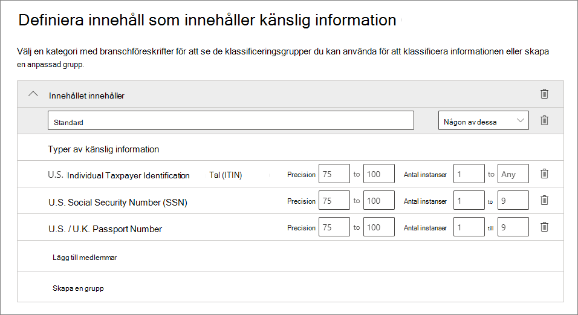

# <a name="automatically-apply-a-retention-label-to-retain-or-delete-content"></a><span data-ttu-id="b34fb-103">Använda en kvarhållningsetikett automatiskt för att bevara eller ta bort innehåll</span><span class="sxs-lookup"><span data-stu-id="b34fb-103">Automatically apply a retention label to retain or delete content</span></span>

><span data-ttu-id="b34fb-104">*[Licensieringsvägledning för Microsoft 365 för säkerhet och efterlevnad](/office365/servicedescriptions/microsoft-365-service-descriptions/microsoft-365-tenantlevel-services-licensing-guidance/microsoft-365-security-compliance-licensing-guidance).*</span><span class="sxs-lookup"><span data-stu-id="b34fb-104">*[Microsoft 365 licensing guidance for security & compliance](/office365/servicedescriptions/microsoft-365-service-descriptions/microsoft-365-tenantlevel-services-licensing-guidance/microsoft-365-security-compliance-licensing-guidance).*</span></span>

> [!NOTE]
> <span data-ttu-id="b34fb-105">Det här scenariot stöds inte för [regelposter](records-management.md#records).</span><span class="sxs-lookup"><span data-stu-id="b34fb-105">This scenario is not supported for [regulatory records](records-management.md#records).</span></span>

<span data-ttu-id="b34fb-106">En av de mest kraftfulla funktionerna för [kvarhållningsetiketter](retention.md) är möjligheten att använda dem automatiskt för innehåll som matchar angivna villkor.</span><span class="sxs-lookup"><span data-stu-id="b34fb-106">One of the most powerful features of [retention labels](retention.md) is the ability to apply them automatically to content that matches specified conditions.</span></span> <span data-ttu-id="b34fb-107">I det här fallet behöver personer i organisationen inte använda kvarhållningsetiketterna själva.</span><span class="sxs-lookup"><span data-stu-id="b34fb-107">In this case, people in your organization don't need to apply the retention labels.</span></span> <span data-ttu-id="b34fb-108">Microsoft 365 gör jobbet åt dem.</span><span class="sxs-lookup"><span data-stu-id="b34fb-108">Microsoft 365 does the work for them.</span></span>
  
<span data-ttu-id="b34fb-109">Automatisk användning av kvarhållningsetiketter är användbart av följande orsaker:</span><span class="sxs-lookup"><span data-stu-id="b34fb-109">Auto-applying retention labels are powerful because:</span></span>
  
- <span data-ttu-id="b34fb-110">Du behöver inte utbilda dina användare i alla klassificeringar.</span><span class="sxs-lookup"><span data-stu-id="b34fb-110">You don't need to train your users on all of your classifications.</span></span>
    
- <span data-ttu-id="b34fb-111">Du behöver inte förlita dig på att användare ska klassificera allt innehåll på rätt sätt.</span><span class="sxs-lookup"><span data-stu-id="b34fb-111">You don't need to rely on users to classify all content correctly.</span></span>
    
- <span data-ttu-id="b34fb-112">Användarna behöver inte längre känna till datastyrningsprinciper och kan istället fokusera på sitt arbete.</span><span class="sxs-lookup"><span data-stu-id="b34fb-112">Users no longer need to know about data governance policies - they can focus on their work.</span></span>
    
<span data-ttu-id="b34fb-113">Du kan använda kvarhållningsetiketter för innehåll automatiskt när innehållet innehåller känslig information, nyckelord eller sökbara egenskaper, eller en matchning för [klassificerare som kan tränas](classifier-get-started-with.md).</span><span class="sxs-lookup"><span data-stu-id="b34fb-113">You can apply retention labels to content automatically when that content contains sensitive information, keywords or searchable properties, or a match for [trainable classifiers](classifier-get-started-with.md).</span></span>

> [!TIP]
> <span data-ttu-id="b34fb-114">Använd de sökbara egenskaperna som nyligen släppts om du vill identifiera [Teams-mötesinspelningar](#microsoft-teams-meeting-recordings).</span><span class="sxs-lookup"><span data-stu-id="b34fb-114">Recently released, use searchable properties to identify [Teams meeting recordings](#microsoft-teams-meeting-recordings).</span></span>

<span data-ttu-id="b34fb-115">Processerna för att använda en kvarhållningsetikett automatiskt baseras på dessa villkor:</span><span class="sxs-lookup"><span data-stu-id="b34fb-115">The processes to automatically apply a retention label based on these conditions:</span></span>


<span data-ttu-id="b34fb-117">Följ anvisningarna för de två administratörsstegen.</span><span class="sxs-lookup"><span data-stu-id="b34fb-117">Use the following instructions for the two admin steps.</span></span>

> [!NOTE]
> <span data-ttu-id="b34fb-118">Automatiska principer använder etikettering på tjänstsidan med villkor för att använda kvarhållningsetiketter automatiskt.</span><span class="sxs-lookup"><span data-stu-id="b34fb-118">Auto-policies use service-side labeling with conditions to automatically apply retention labels.</span></span> <span data-ttu-id="b34fb-119">Du kan också automatiskt använda en kvarhållningsetikett med en etikettprincip när du gör följande:</span><span class="sxs-lookup"><span data-stu-id="b34fb-119">You can also automatically apply a retention label with a label policy when you do the following:</span></span> 
>
> - <span data-ttu-id="b34fb-120">Använder en kvarhållningsetikett för en dokumenttolkningsmodell i SharePoint Syntex</span><span class="sxs-lookup"><span data-stu-id="b34fb-120">Apply a retention label to a document understanding model in SharePoint Syntex</span></span>
> - <span data-ttu-id="b34fb-121">Använder en standardetikett för kvarhållning för SharePoint och Outlook</span><span class="sxs-lookup"><span data-stu-id="b34fb-121">Apply a default retention label for SharePoint and Outlook</span></span>
>- <span data-ttu-id="b34fb-122">Använder en kvarhållningsetikett för e-post med hjälp av Outlook-regler</span><span class="sxs-lookup"><span data-stu-id="b34fb-122">Apply a retention label to email by using Outlook rules</span></span>
>
> <span data-ttu-id="b34fb-123">Mer information om dessa scenarier finns i [Skapa och använda kvarhållningsetiketter i appar](create-apply-retention-labels.md).</span><span class="sxs-lookup"><span data-stu-id="b34fb-123">For these scenarios, see [Create and apply retention labels in apps](create-apply-retention-labels.md).</span></span>

## <a name="before-you-begin"></a><span data-ttu-id="b34fb-124">Innan du börjar</span><span class="sxs-lookup"><span data-stu-id="b34fb-124">Before you begin</span></span>

<span data-ttu-id="b34fb-125">Den globala administratören för organisationen har fullständig behörighet för att skapa och redigera kvarhållningsetiketter och deras principer.</span><span class="sxs-lookup"><span data-stu-id="b34fb-125">The global admin for your organization has full permissions to create and edit retention labels and their policies.</span></span> <span data-ttu-id="b34fb-126">Om du inte loggar in som global administratör kan du läsa mer i [Behörigheter som krävs för att skapa och hantera kvarhållningsprinciper och kvarhållningsetiketter](get-started-with-retention.md#permissions-required-to-create-and-manage-retention-policies-and-retention-labels).</span><span class="sxs-lookup"><span data-stu-id="b34fb-126">If you aren't signing in as a global admin, see [Permissions required to create and manage retention policies and retention labels](get-started-with-retention.md#permissions-required-to-create-and-manage-retention-policies-and-retention-labels).</span></span>

## <a name="how-to-auto-apply-a-retention-label"></a><span data-ttu-id="b34fb-127">Så här använder du en kvarhållningsetikett automatiskt</span><span class="sxs-lookup"><span data-stu-id="b34fb-127">How to auto-apply a retention label</span></span>

<span data-ttu-id="b34fb-128">Börja med att skapa kvarhållningsetiketten.</span><span class="sxs-lookup"><span data-stu-id="b34fb-128">First, create your retention label.</span></span> <span data-ttu-id="b34fb-129">Skapa sedan en automatisk princip för att använda den etiketten.</span><span class="sxs-lookup"><span data-stu-id="b34fb-129">Then create an auto-policy to apply that label.</span></span> <span data-ttu-id="b34fb-130">Om du redan har skapat en kvarhållningsetikett kan du gå till [skapa en automatisk princip](#step-2-create-an-auto-apply-policy).</span><span class="sxs-lookup"><span data-stu-id="b34fb-130">If you have already created your retention label, skip to [creating an auto-policy](#step-2-create-an-auto-apply-policy).</span></span>

<span data-ttu-id="b34fb-131">Navigeringsinstruktionerna skiljer sig åt beroende på om du använder [hantering av arkivhandlingar](records-management.md) eller inte.</span><span class="sxs-lookup"><span data-stu-id="b34fb-131">Navigation instructions depend on whether you're using [records management](records-management.md) or not.</span></span> <span data-ttu-id="b34fb-132">Instruktioner finns för båda scenarierna.</span><span class="sxs-lookup"><span data-stu-id="b34fb-132">Instructions are provided for both scenarios.</span></span>

### <a name="step-1-create-a-retention-label"></a><span data-ttu-id="b34fb-133">Steg 1: Skapa en kvarhållningsetikett</span><span class="sxs-lookup"><span data-stu-id="b34fb-133">Step 1: Create a retention label</span></span>

1. <span data-ttu-id="b34fb-134">Gå till någon av följande platser i [Microsoft 365 Efterlevnadscenter](https://compliance.microsoft.com/):</span><span class="sxs-lookup"><span data-stu-id="b34fb-134">In the [Microsoft 365 compliance center](https://compliance.microsoft.com/), navigate to one of the following locations:</span></span>
    
    - <span data-ttu-id="b34fb-135">Om du använder hantering av arkivhandlingar:</span><span class="sxs-lookup"><span data-stu-id="b34fb-135">If you are using records management:</span></span>
        - <span data-ttu-id="b34fb-136">**Lösningar** > **Hantering av arkivhandlingar** >  fliken **Filplan** > **+ Skapa en etikett** > **Kvarhållningsetikett**</span><span class="sxs-lookup"><span data-stu-id="b34fb-136">**Solutions** > **Records management** > **File plan** tab > **+ Create a label** > **Retention label**</span></span>
        
    - <span data-ttu-id="b34fb-137">Om du inte använder hantering av arkivhandlingar:</span><span class="sxs-lookup"><span data-stu-id="b34fb-137">If you are not using records management:</span></span>
       - <span data-ttu-id="b34fb-138">**Lösningar** > **Informationsstyrning** >  fliken **Etiketter** > + **Skapa en etikett**</span><span class="sxs-lookup"><span data-stu-id="b34fb-138">**Solutions** > **Information governance** > **Labels** tab > + **Create a label**</span></span>
    
    <span data-ttu-id="b34fb-139">Ser du inte alternativet direkt?</span><span class="sxs-lookup"><span data-stu-id="b34fb-139">Don't immediately see your option?</span></span> <span data-ttu-id="b34fb-140">Välj först **Visa alla**.</span><span class="sxs-lookup"><span data-stu-id="b34fb-140">First select **Show all**.</span></span> 

2. <span data-ttu-id="b34fb-141">Följ anvisningarna i guiden.</span><span class="sxs-lookup"><span data-stu-id="b34fb-141">Follow the prompts in the wizard.</span></span> <span data-ttu-id="b34fb-142">Om du använder hantering av arkivhandlingar:</span><span class="sxs-lookup"><span data-stu-id="b34fb-142">If you are using records management:</span></span>
    
    - <span data-ttu-id="b34fb-143">Information om filplansbeskrivningar finns i [Använda filplanen för att hantera kvarhållningsetiketter](file-plan-manager.md)</span><span class="sxs-lookup"><span data-stu-id="b34fb-143">For information about the file plan descriptors, see [Use file plan to manage retention labels](file-plan-manager.md)</span></span>
    
    - <span data-ttu-id="b34fb-144">Om du vill använda kvarhållningsetiketten för att deklarera arkivhandlingar markerar du **Markera objekt som en post** eller **Markera objekt som en regelpost**.</span><span class="sxs-lookup"><span data-stu-id="b34fb-144">To use the retention label to declare records, select **Mark items as records**, or **Mark items as regulatory records**.</span></span> <span data-ttu-id="b34fb-145">Mer information finns i [Konfigurera kvarhållningsetiketter för att deklarera poster](declare-records.md#configuring-retention-labels-to-declare-records).</span><span class="sxs-lookup"><span data-stu-id="b34fb-145">For more information, see [Configuring retention labels to declare records](declare-records.md#configuring-retention-labels-to-declare-records).</span></span>

3. <span data-ttu-id="b34fb-146">När du har skapat etiketten och du ser alternativ för att publicera etiketten, använda etiketten automatiskt eller spara etiketten: Välj **Använd den här etiketten automatiskt på en viss typ av innehåll** och välj sedan **Klar**, så startas guiden för att skapa automatisk etikettering som tar dig direkt till steg 2 i följande procedur.</span><span class="sxs-lookup"><span data-stu-id="b34fb-146">After you have created the label and you see the options to publish the label, auto-apply the label, or just save the label: Select **Auto-apply this label to a specific type of content**, and then select **Done** to start the Create auto-labeling wizard that takes you directly to step 2 in the following procedure.</span></span>

<span data-ttu-id="b34fb-147">Om du vill redigera en befintlig etikett markerar du den och väljer sedan alternativet **Redigera etikett** för att starta guiden för att redigera kvarhållning där du kan ändra etikettbeskrivningarna och eventuella [inställningar](#updating-retention-labels-and-their-policies) från steg 2.</span><span class="sxs-lookup"><span data-stu-id="b34fb-147">To edit an existing label, select it, and then select the **Edit label** option to start the Edit retention wizard that lets you change the label descriptions and any [eligible settings](#updating-retention-labels-and-their-policies) from step 2.</span></span>

### <a name="step-2-create-an-auto-apply-policy"></a><span data-ttu-id="b34fb-148">Steg 2: Skapa en princip för automatisk användning</span><span class="sxs-lookup"><span data-stu-id="b34fb-148">Step 2: Create an auto-apply policy</span></span>

<span data-ttu-id="b34fb-149">När du skapar en princip för automatisk användning väljer du en kvarhållningsetikett som ska användas för innehåll automatiskt, baserat på de villkor du anger.</span><span class="sxs-lookup"><span data-stu-id="b34fb-149">When you create an auto-apply policy, you select a retention label to automatically apply to content, based on the conditions that you specify.</span></span>

1. <span data-ttu-id="b34fb-150">Gå till någon av följande platser i [Microsoft 365 Efterlevnadscenter](https://compliance.microsoft.com/):</span><span class="sxs-lookup"><span data-stu-id="b34fb-150">In the [Microsoft 365 compliance center](https://compliance.microsoft.com/), navigate to one of the following locations:</span></span>
    
    - <span data-ttu-id="b34fb-151">Om du använder hantering av arkivhandlingar: **Informationsstyrning**:</span><span class="sxs-lookup"><span data-stu-id="b34fb-151">If you are using records management: **Information governance**:</span></span>
        - <span data-ttu-id="b34fb-152">**Lösningar** > **Hantering av arkivhandlingar** >  fliken **Etikettprinciper** > **Använd en etikett automatiskt**</span><span class="sxs-lookup"><span data-stu-id="b34fb-152">**Solutions** > **Records management** > **Label policies** tab > **Auto-apply a label**</span></span>
    
    - <span data-ttu-id="b34fb-153">Om du inte använder hantering av arkivhandlingar:</span><span class="sxs-lookup"><span data-stu-id="b34fb-153">If you are not using records management:</span></span>
        - <span data-ttu-id="b34fb-154">**Lösningar** > **Informationsstyrning** >  fliken **Etikettprinciper** > **Använd en etikett automatiskt**</span><span class="sxs-lookup"><span data-stu-id="b34fb-154">**Solutions** > **Information governance** > **Label policies** tab > **Auto-apply a label**</span></span>
    
    <span data-ttu-id="b34fb-155">Ser du inte alternativet direkt?</span><span class="sxs-lookup"><span data-stu-id="b34fb-155">Don't immediately see your option?</span></span> <span data-ttu-id="b34fb-156">Välj först **Visa alla**.</span><span class="sxs-lookup"><span data-stu-id="b34fb-156">First select **Show all**.</span></span> 

2. <span data-ttu-id="b34fb-157">Följ anvisningarna i guiden för att skapa automatisk etikettering.</span><span class="sxs-lookup"><span data-stu-id="b34fb-157">Follow the prompts in the Create auto-labeling wizard.</span></span>
    
    <span data-ttu-id="b34fb-158">Information om hur du konfigurerar de villkor som automatiskt tillämpar kvarhållningsetiketten finns i avsnittet [Konfigurera villkor för automatisk användning av kvarhållningsetiketter](#configuring-conditions-for-auto-apply-retention-labels) på den här sidan.</span><span class="sxs-lookup"><span data-stu-id="b34fb-158">For information about configuring the conditions that automatically apply the retention label, see the [Configuring conditions for auto-apply retention labels](#configuring-conditions-for-auto-apply-retention-labels) section on this page.</span></span>
    
    <span data-ttu-id="b34fb-159">Mer information om vilka platser som stöds av kvarhållningsetiketter finns i avsnittet [Kvarhållningsetiketter och platser](retention.md#retention-label-policies-and-locations).</span><span class="sxs-lookup"><span data-stu-id="b34fb-159">For information about the locations supported by retention labels, see the [Retention labels and locations](retention.md#retention-label-policies-and-locations) section.</span></span>

<span data-ttu-id="b34fb-160">Om du vill redigera en befintlig princip för automatisk användning startar du guiden Redigera kvarhållningsprincip. Där kan du ändra den valda kvarhållningsetiketten och eventuella [inställningar](#updating-retention-labels-and-their-policies) från steg 2.</span><span class="sxs-lookup"><span data-stu-id="b34fb-160">To edit an existing auto-apply policy, select it to start the Edit retention policy wizard that lets you change the selected retention label and any [eligible settings](#updating-retention-labels-and-their-policies) from step 2.</span></span>

<span data-ttu-id="b34fb-161">När innehållet har fått en etikett med en princip för automatisk användning av etiketter kan den använda etiketten inte tas bort automatiskt eller ändras genom att ändra innehållet eller principen, eller med en ny princip för automatisk användning av etiketter.</span><span class="sxs-lookup"><span data-stu-id="b34fb-161">After content is labeled by using an auto-apply label policy, the applied label can't be automatically removed or changed by changing the content or the policy, or by a new auto-apply label policy.</span></span> <span data-ttu-id="b34fb-162">Mer information finns i [Endast en kvarhållningsetikett i taget](retention.md#only-one-retention-label-at-a-time).</span><span class="sxs-lookup"><span data-stu-id="b34fb-162">For more information, see [Only one retention label at a time](retention.md#only-one-retention-label-at-a-time).</span></span>

### <a name="configuring-conditions-for-auto-apply-retention-labels"></a><span data-ttu-id="b34fb-163">Konfigurera villkor för kvarhållningsetiketter för automatisk användning</span><span class="sxs-lookup"><span data-stu-id="b34fb-163">Configuring conditions for auto-apply retention labels</span></span>

<span data-ttu-id="b34fb-164">Du kan använda kvarhållningsetiketter för innehåll automatiskt när innehållet innehåller:</span><span class="sxs-lookup"><span data-stu-id="b34fb-164">You can apply retention labels to content automatically when that content contains:</span></span>

- [<span data-ttu-id="b34fb-165">Specifika typer av känslig information</span><span class="sxs-lookup"><span data-stu-id="b34fb-165">Specific types of sensitive information</span></span>](#auto-apply-labels-to-content-with-specific-types-of-sensitive-information)

- [<span data-ttu-id="b34fb-166">Specifika nyckelord eller sökbara egenskaper som matchar en fråga som du skapar</span><span class="sxs-lookup"><span data-stu-id="b34fb-166">Specific keywords or searchable properties that match a query you create</span></span>](#auto-apply-labels-to-content-with-keywords-or-searchable-properties)

- [<span data-ttu-id="b34fb-167">En matchning för klassificerare som kan tränas</span><span class="sxs-lookup"><span data-stu-id="b34fb-167">A match for trainable classifiers</span></span>](#auto-apply-labels-to-content-by-using-trainable-classifiers)

#### <a name="auto-apply-labels-to-content-with-specific-types-of-sensitive-information"></a><span data-ttu-id="b34fb-168">Automatisk användning av etiketter på innehåll med specifika typer av känslig information</span><span class="sxs-lookup"><span data-stu-id="b34fb-168">Auto-apply labels to content with specific types of sensitive information</span></span>

> [!WARNING]
> <span data-ttu-id="b34fb-169">Den här konfigurationen har för närvarande en känd begränsning där den valda kvarhållningsetiketten alltid används för alla e-postmeddelanden utan etikett när det finns en matchning för valda typer av känslig information.</span><span class="sxs-lookup"><span data-stu-id="b34fb-169">This configuration currently has a known limitation where all unlabeled emails always have the selected retention label applied when there is a match for your chosen sensitive information types.</span></span> <span data-ttu-id="b34fb-170">Även om du till exempel anger specifika användare som omfång för principen för automatisk användning eller väljer andra platser än Exchange för principen, används etiketten alltid på e-postmeddelanden utan etikett när det finns en matchning.</span><span class="sxs-lookup"><span data-stu-id="b34fb-170">For example, even if you scope your auto-apply policy to specific users, or select locations other than Exchange for the policy, the label is always applied to unlabeled emails when there is a match.</span></span>

<span data-ttu-id="b34fb-171">När du skapar principer för automatisk användning av kvarhållningsetiketter för känslig information visas samma lista med principmallar som när du skapar en princip för dataförlustskydd (DLP).</span><span class="sxs-lookup"><span data-stu-id="b34fb-171">When you create auto-apply retention label policies for sensitive information, you see the same list of policy templates as when you create a data loss prevention (DLP) policy.</span></span> <span data-ttu-id="b34fb-172">Varje mall har förkonfigurerats för att söka efter specifika typer av känslig information.</span><span class="sxs-lookup"><span data-stu-id="b34fb-172">Each template is preconfigured to look for specific types of sensitive information.</span></span> <span data-ttu-id="b34fb-173">Mallen som visas här söker till exempel efter amerikanska ITIN-, SSN- och passnummer från kategorin **Sekretess** och mallen **Amerikanska PII-data (personligt identifierbar information)**:</span><span class="sxs-lookup"><span data-stu-id="b34fb-173">For example, the template shown here looks for U.S. ITIN, SSN, and passport numbers from the **Privacy** category, and **U.S Personally Identifiable Information (PII) Data** template:</span></span>


<span data-ttu-id="b34fb-175">Mer information om typer av känslig information finns i [Entitetsdefinitioner för typer av känslig information](sensitive-information-type-entity-definitions.md).</span><span class="sxs-lookup"><span data-stu-id="b34fb-175">To learn more about the sensitivity information types, see [Sensitive information type entity definitions](sensitive-information-type-entity-definitions.md).</span></span> <span data-ttu-id="b34fb-176">För närvarande stöds inte [exakta datamatchningar](create-custom-sensitive-information-types-with-exact-data-match-based-classification.md) och [dokumentfingeravtryck](document-fingerprinting.md) för det här scenariot.</span><span class="sxs-lookup"><span data-stu-id="b34fb-176">Currently, [exact data matches](create-custom-sensitive-information-types-with-exact-data-match-based-classification.md) and [document fingerprinting](document-fingerprinting.md) are not supported for this scenario.</span></span>

<span data-ttu-id="b34fb-177">När du har valt en principmall kan du lägga till eller ta bort alla typer av känslig information, och du kan ändra antalet instanser och matcha noggrannheten.</span><span class="sxs-lookup"><span data-stu-id="b34fb-177">After you select a policy template, you can add or remove any types of sensitive information, and you can change the instance count and match accuracy.</span></span> <span data-ttu-id="b34fb-178">I följande exempelskärmbild kommer en kvarhållningsetikett bara att användas automatiskt när:</span><span class="sxs-lookup"><span data-stu-id="b34fb-178">In the example screenshot shown next, a retention label will be auto-applied only when:</span></span>
  
- <span data-ttu-id="b34fb-179">Typen av känslig information som identifieras har en matchningsnoggrannhet (eller konfidensnivå) på minst 75.</span><span class="sxs-lookup"><span data-stu-id="b34fb-179">The type of sensitive information that's detected has a match accuracy (or confidence level) of at least 75.</span></span> <span data-ttu-id="b34fb-180">Många typer av känslig information definieras med flera mönster, där ett mönster med högre matchningsnoggrannhet kräver att mer bevis hittas (till exempel nyckelord, datum eller adresser), medan ett mönster med lägre matchningsnoggrannhet kräver mindre bevis.</span><span class="sxs-lookup"><span data-stu-id="b34fb-180">Many sensitive information types are defined with multiple patterns, where a pattern with a higher match accuracy requires more evidence to be found (such as keywords, dates, or addresses), while a pattern with a lower match accuracy requires less evidence.</span></span> <span data-ttu-id="b34fb-181">Ju lägre **minsta** matchningsnoggrannhet, desto enklare är det för innehållet att matcha villkoret.</span><span class="sxs-lookup"><span data-stu-id="b34fb-181">The lower the **min** match accuracy, the easier it is for content to match the condition.</span></span>

- <span data-ttu-id="b34fb-182">Innehållet innehåller mellan 1 och 9 instanser av någon av dessa tre typer av känslig information.</span><span class="sxs-lookup"><span data-stu-id="b34fb-182">The content contains between 1 and 9 instances of any of these three sensitive information types.</span></span> <span data-ttu-id="b34fb-183">Du kan ta bort värdet för **till** så att det ändras till **något**, eller alla värden.</span><span class="sxs-lookup"><span data-stu-id="b34fb-183">You can delete the **to** value so that it changes to **Any**.</span></span>

<span data-ttu-id="b34fb-184">Mer information om de här alternativen finns i följande vägledning i DLP-dokumentationen om att [justera regler för att göra dem enklare eller svårare att matcha](data-loss-prevention-policies.md#tuning-rules-to-make-them-easier-or-harder-to-match).</span><span class="sxs-lookup"><span data-stu-id="b34fb-184">For more information about these options, see the following guidance from the DLP documentation [Tuning rules to make them easier or harder to match](data-loss-prevention-policies.md#tuning-rules-to-make-them-easier-or-harder-to-match).</span></span>
    


<span data-ttu-id="b34fb-186">Saker att tänka på när du använder typer av känslig information för automatisk användning av kvarhållningsetiketter:</span><span class="sxs-lookup"><span data-stu-id="b34fb-186">To consider when using sensitive information types to auto-apply retention labels:</span></span>

- <span data-ttu-id="b34fb-187">Nya och ändrade objekt kan få etiketter automatiskt.</span><span class="sxs-lookup"><span data-stu-id="b34fb-187">New and modified items can be auto-labeled.</span></span>

#### <a name="auto-apply-labels-to-content-with-keywords-or-searchable-properties"></a><span data-ttu-id="b34fb-188">Automatisk användning av etiketter på innehåll med nyckelord eller sökbara egenskaper</span><span class="sxs-lookup"><span data-stu-id="b34fb-188">Auto-apply labels to content with keywords or searchable properties</span></span>

<span data-ttu-id="b34fb-189">Du kan automatiskt använda etiketter för innehåll med hjälp av en fråga som innehåller specifika ord, fraser eller värden med sökbara egenskaper.</span><span class="sxs-lookup"><span data-stu-id="b34fb-189">You can auto-apply labels to content by using a query that contains specific words, phrases, or values of searchable properties.</span></span> <span data-ttu-id="b34fb-190">Du kan förfina frågan med hjälp av sökoperatorer som AND, OR och NOT (OCH, ELLER och INTE).</span><span class="sxs-lookup"><span data-stu-id="b34fb-190">You can refine your query by using search operators such as AND, OR, and NOT.</span></span>


<span data-ttu-id="b34fb-192">Mer information om frågesyntax som använder KQL (Keyword Query Language) finns i [syntaxreferensen för KQL (Keyword Query Language)](/sharepoint/dev/general-development/keyword-query-language-kql-syntax-reference).</span><span class="sxs-lookup"><span data-stu-id="b34fb-192">For more information about the query syntax that uses Keyword Query Language (KQL), see [Keyword Query Language (KQL) syntax reference](/sharepoint/dev/general-development/keyword-query-language-kql-syntax-reference).</span></span>

<span data-ttu-id="b34fb-193">För frågebaserade principer för automatisk användning används samma sökindex som innehållssökning för eDiscovery för att identifiera innehåll.</span><span class="sxs-lookup"><span data-stu-id="b34fb-193">Query-based auto-apply policies use the same search index as eDiscovery content search to identify content.</span></span> <span data-ttu-id="b34fb-194">Mer information om de sökbara egenskaper du kan använda finns i [Nyckelordsfrågor och sökvillkor för innehållssökning](keyword-queries-and-search-conditions.md).</span><span class="sxs-lookup"><span data-stu-id="b34fb-194">For more information about the searchable properties that you can use, see [Keyword queries and search conditions for Content Search](keyword-queries-and-search-conditions.md).</span></span>

<span data-ttu-id="b34fb-195">Några saker att tänka på när du använder nyckelord eller sökbara egenskaper för automatisk användning av kvarhållningsetiketter:</span><span class="sxs-lookup"><span data-stu-id="b34fb-195">Some things to consider when using keywords or searchable properties to auto-apply retention labels:</span></span>

- <span data-ttu-id="b34fb-196">Nya, ändrade och befintliga objekt får automatiskt etiketter för SharePoint, OneDrive och Exchange.</span><span class="sxs-lookup"><span data-stu-id="b34fb-196">New, modified, and existing items will be auto-labeled for SharePoint, OneDrive, and Exchange.</span></span>

- <span data-ttu-id="b34fb-197">För SharePoint stöds inte crawlade egenskaper och anpassade egenskaper för dessa KQL-frågor och du kan bara använda fördefinierade hanterade egenskaper.</span><span class="sxs-lookup"><span data-stu-id="b34fb-197">For SharePoint, crawled properties and custom properties aren't supported for these KQL queries and you must use only predefined managed properties.</span></span> <span data-ttu-id="b34fb-198">Du kan ändå använda mappningar på klientorganisationsnivå med de fördefinierade hanterade egenskaperna som är aktiverade som förfiningar som standard (RefinableDate00-19, RefinableString00-99, RefinableInt00-49, RefinableDecimals00-09 och RefinableDouble00-09).</span><span class="sxs-lookup"><span data-stu-id="b34fb-198">However, you can use mappings at the tenant level with the predefined managed properties that are enabled as refiners by default (RefinableDate00-19, RefinableString00-99, RefinableInt00-49, RefinableDecimals00-09, and RefinableDouble00-09).</span></span> <span data-ttu-id="b34fb-199">Mer information finns i [Översikt över crawlade och hanterade egenskaper i SharePoint Server](/SharePoint/technical-reference/crawled-and-managed-properties-overview). Instruktioner finns i [Skapa en ny hanterad egenskap](/sharepoint/manage-search-schema#create-a-new-managed-property).</span><span class="sxs-lookup"><span data-stu-id="b34fb-199">For more information, see [Overview of crawled and managed properties in SharePoint Server](/SharePoint/technical-reference/crawled-and-managed-properties-overview), and for instructions, see [Create a new managed property](/sharepoint/manage-search-schema#create-a-new-managed-property).</span></span>

- <span data-ttu-id="b34fb-200">Om du mappar en anpassad egenskap till någon av förfiningsegenskaperna väntar du 24 timmar innan du använder den i KQL-frågan för en kvarhållningsetikett.</span><span class="sxs-lookup"><span data-stu-id="b34fb-200">If you map a custom property to one of the refiner properties, wait 24 hours before you use it in your KQL query for a retention label.</span></span>

- <span data-ttu-id="b34fb-201">Även om hanterade SharePoint-egenskaper kan byta namn med hjälp av alias ska du inte använda dessa för KQL-frågor i dina etiketter.</span><span class="sxs-lookup"><span data-stu-id="b34fb-201">Although SharePoint managed properties can be renamed by using aliases, don't use these for KQL queries in your labels.</span></span> <span data-ttu-id="b34fb-202">Ange alltid det faktiska namnet på den hanterade egenskapen, till exempel ”RefinableString01”.</span><span class="sxs-lookup"><span data-stu-id="b34fb-202">Always specify the actual name of the managed property, for example, "RefinableString01".</span></span>

- <span data-ttu-id="b34fb-203">Om du vill söka efter värden som innehåller blanksteg eller specialtecken använder du dubbla citattecken (`" "`) som innehåller frasen, till exempel `subject:"Financial Statements"`.</span><span class="sxs-lookup"><span data-stu-id="b34fb-203">To search for values that contain spaces or special characters, use double quotation marks (`" "`) to contain the phrase; for example, `subject:"Financial Statements"`.</span></span>

- <span data-ttu-id="b34fb-204">Använd egenskapen *DocumentLink* istället för *Path* om du vill matcha ett objekt baserat på dess URL.</span><span class="sxs-lookup"><span data-stu-id="b34fb-204">Use the *DocumentLink* property instead of *Path* to match an item based on its URL.</span></span> 

- <span data-ttu-id="b34fb-205">Suffixsökningar med jokertecken (till exempel `*cat`) eller delsträngssökningar med jokertecken (till exempel `*cat*`) stöds inte.</span><span class="sxs-lookup"><span data-stu-id="b34fb-205">Suffix wildcard searches ( such as `*cat`) or substring wildcard searches (such as `*cat*`) aren't supported.</span></span> <span data-ttu-id="b34fb-206">Prefixsökningar med jokertecken (till exempel `cat*`) stöds däremot.</span><span class="sxs-lookup"><span data-stu-id="b34fb-206">However, prefix wildcard searches (such as `cat*`) are supported.</span></span>

- <span data-ttu-id="b34fb-207">Tänk på att delvis indexerade objekt kan vara orsaken till att objekt som du förväntar dig inte får etiketter, eller till att objekt som du förväntar dig ska undantas från etikettering får etiketter när du använder operatorn NOT (INTE).</span><span class="sxs-lookup"><span data-stu-id="b34fb-207">Be aware that partially indexed items can be responsible for not labeling items that you're expecting, or labeling items that you're expecting to be excluded from labeling when you use the NOT operator.</span></span> <span data-ttu-id="b34fb-208">Mer information finns i artikeln [Delvis indexerade objekt i Innehållssökning](partially-indexed-items-in-content-search.md).</span><span class="sxs-lookup"><span data-stu-id="b34fb-208">For more information, see [Partially indexed items in Content Search](partially-indexed-items-in-content-search.md).</span></span>


<span data-ttu-id="b34fb-209">Exempelfrågor:</span><span class="sxs-lookup"><span data-stu-id="b34fb-209">Examples queries:</span></span>

| <span data-ttu-id="b34fb-210">Arbetsbelastning</span><span class="sxs-lookup"><span data-stu-id="b34fb-210">Workload</span></span> | <span data-ttu-id="b34fb-211">Exempel</span><span class="sxs-lookup"><span data-stu-id="b34fb-211">Example</span></span> |
|:-----|:-----|
|<span data-ttu-id="b34fb-212">Exchange</span><span class="sxs-lookup"><span data-stu-id="b34fb-212">Exchange</span></span>   | `subject:"Financial Statements"` |
|<span data-ttu-id="b34fb-213">Exchange</span><span class="sxs-lookup"><span data-stu-id="b34fb-213">Exchange</span></span>   | `recipients:garthf@contoso.com` |
|<span data-ttu-id="b34fb-214">SharePoint</span><span class="sxs-lookup"><span data-stu-id="b34fb-214">SharePoint</span></span> | `contenttype:document` |
|<span data-ttu-id="b34fb-215">SharePoint</span><span class="sxs-lookup"><span data-stu-id="b34fb-215">SharePoint</span></span> | `site:https://contoso.sharepoint.com/sites/teams/procurement AND contenttype:document`|
|<span data-ttu-id="b34fb-216">Exchange eller SharePoint</span><span class="sxs-lookup"><span data-stu-id="b34fb-216">Exchange or SharePoint</span></span> | `"customer information" OR "private"`|

<span data-ttu-id="b34fb-217">Mer komplicerade exempel:</span><span class="sxs-lookup"><span data-stu-id="b34fb-217">More complex examples:</span></span>

<span data-ttu-id="b34fb-218">Följande fråga för SharePoint identifierar Word-dokument eller Excel-kalkylblad när filerna innehåller nyckelorden **password** (lösenord), **passwords** (lösenord) eller **pw**(lös):</span><span class="sxs-lookup"><span data-stu-id="b34fb-218">The following query for SharePoint identifies Word documents or Excel spreadsheets when those files contain the keywords **password**, **passwords**, or **pw**:</span></span>

```
(password OR passwords OR pw) AND (filetype:doc* OR filetype:xls*)
```

<span data-ttu-id="b34fb-219">Följande fråga för Exchange identifierar alla Word-dokument eller PDF-filer som innehåller ordet **nda** (sekretessavtal) eller frasen **non disclosure agreeement** (sekretessavtal) när dokumenten bifogas i ett e-postmeddelande:</span><span class="sxs-lookup"><span data-stu-id="b34fb-219">The following query for Exchange identifies any Word document or PDF that contains the word **nda** or the phrase **non disclosure agreement** when those documents are attached to an email:</span></span>

```
(nda OR "non disclosure agreement") AND (attachmentnames:.doc* OR attachmentnames:.pdf)
```

<span data-ttu-id="b34fb-220">Följande fråga för SharePoint identifierar dokument som innehåller ett kreditkortsnummer:</span><span class="sxs-lookup"><span data-stu-id="b34fb-220">The following query for SharePoint identifies documents that contain a credit card number:</span></span> 

```
sensitivetype:"credit card number"
```

<span data-ttu-id="b34fb-221">Följande fråga innehåller några vanliga nyckelord för att identifiera dokument eller e-postmeddelanden som innehåller juridiskt innehåll:</span><span class="sxs-lookup"><span data-stu-id="b34fb-221">The following query contains some typical keywords to help identify documents or emails that contain legal content:</span></span>

```
ACP OR (Attorney Client Privilege*) OR (AC Privilege)
```

<span data-ttu-id="b34fb-222">Följande fråga innehåller vanliga nyckelord för att identifiera dokument eller e-postmeddelanden för personalavdelningen:</span><span class="sxs-lookup"><span data-stu-id="b34fb-222">The following query contains typical keywords to help identify documents or emails for human resources:</span></span> 

```
(resume AND staff AND employee AND salary AND recruitment AND candidate)
```

<span data-ttu-id="b34fb-223">Observera att praxis är att alltid lägga till operatorer mellan nyckelord som i det här sista exemplet.</span><span class="sxs-lookup"><span data-stu-id="b34fb-223">Note that this final example uses the best practice of always including  operators between keywords.</span></span> <span data-ttu-id="b34fb-224">Ett blanksteg mellan nyckelord (eller två egenskap:värde-uttryck) är samma sak som att använda AND (OCH).</span><span class="sxs-lookup"><span data-stu-id="b34fb-224">A space between keywords (or two property:value expressions) is the same as using AND.</span></span> <span data-ttu-id="b34fb-225">Genom att alltid lägga till operatorer är det enklare att se att den här exempelfrågan bara identifierar innehåll som innehåller alla dessa nyckelord, istället för innehåll som innehåller något av nyckelorden.</span><span class="sxs-lookup"><span data-stu-id="b34fb-225">By always adding operators, it's easier to see that this example query will identify only content that contains all these keywords, instead of content that contains any of the keywords.</span></span> <span data-ttu-id="b34fb-226">Om avsikten är att identifiera innehåll som innehåller något av nyckelorden anger du OR (ELLER) istället för AND (OCH).</span><span class="sxs-lookup"><span data-stu-id="b34fb-226">If your intention is to identify content that contains any of the keywords, specify OR instead of AND.</span></span> <span data-ttu-id="b34fb-227">Som det här exemplet visar är det lättare att tolka frågan rätt om du alltid anger operatorer.</span><span class="sxs-lookup"><span data-stu-id="b34fb-227">As this example shows, when you always specify the operators, it's easier to correctly interpret the query.</span></span> 

##### <a name="microsoft-teams-meeting-recordings"></a><span data-ttu-id="b34fb-228">Microsoft Teams-mötesinspelningar</span><span class="sxs-lookup"><span data-stu-id="b34fb-228">Microsoft Teams meeting recordings</span></span>

> [!NOTE]
> <span data-ttu-id="b34fb-229">Möjligheten att bevara och ta bort Teams-mötesinspelningar fungerar inte förrän inspelningarna sparas i OneDrive eller SharePoint.</span><span class="sxs-lookup"><span data-stu-id="b34fb-229">The ability to retain and delete Teams meeting recordings won't work before recordings are saved to OneDrive or SharePoint.</span></span> <span data-ttu-id="b34fb-230">Mer information finns i [Använda OneDrive för företag och SharePoint Online eller Stream för mötesinspelningar](/MicrosoftTeams/tmr-meeting-recording-change).</span><span class="sxs-lookup"><span data-stu-id="b34fb-230">For more information, see [Use OneDrive for Business and SharePoint Online or Stream for meeting recordings](/MicrosoftTeams/tmr-meeting-recording-change).</span></span>

<span data-ttu-id="b34fb-231">Om du vill identifiera Microsoft Teams-mötesinspelningar som lagras i användarnas OneDrive-konton eller i SharePoint anger du följande för **Frågeredigeraren för nyckelord**:</span><span class="sxs-lookup"><span data-stu-id="b34fb-231">To identify Microsoft Teams meeting recordings that are stored in users' OneDrive accounts or in SharePoint, specify the following for the **Keyword query editor**:</span></span>

``` 
ProgID:Media AND ProgID:Meeting
```

<span data-ttu-id="b34fb-232">Mötesinspelningar sparas för det mesta i OneDrive.</span><span class="sxs-lookup"><span data-stu-id="b34fb-232">Most of the time, meeting recordings are saved to OneDrive.</span></span> <span data-ttu-id="b34fb-233">Men kanalmöten sparas i SharePoint.</span><span class="sxs-lookup"><span data-stu-id="b34fb-233">But for channel meetings, they are saved in SharePoint.</span></span>


#### <a name="auto-apply-labels-to-content-by-using-trainable-classifiers"></a><span data-ttu-id="b34fb-234">Automatisk användning av etiketter på innehåll med hjälp av klassificerare som kan tränas</span><span class="sxs-lookup"><span data-stu-id="b34fb-234">Auto-apply labels to content by using trainable classifiers</span></span>

<span data-ttu-id="b34fb-235">När du väljer alternativet för en klassificerare som kan tränas kan du välja en av de inbyggda klassificerarna eller en anpassad klassificerare.</span><span class="sxs-lookup"><span data-stu-id="b34fb-235">When you choose the option for a trainable classifier, you can select one of the built-in classifiers, or a custom classifier.</span></span> <span data-ttu-id="b34fb-236">Det finns till exempel inbyggda klassificerare för **meritförteckningar**, **källkod**, **riktade trakasserier**, **svordomar** och **hot**:</span><span class="sxs-lookup"><span data-stu-id="b34fb-236">The built-in classifiers include **Resumes**, **SourceCode**, **Targeted Harassment**, **Profanity**, and **Threat**:</span></span>


> [!CAUTION]
> <span data-ttu-id="b34fb-238">Vi håller på att fasa ut den inbyggda klassificeraren för **stötande språk** eftersom den har gett ett stort antal falska positiva identifieringar.</span><span class="sxs-lookup"><span data-stu-id="b34fb-238">We are deprecating the **Offensive Language** built-in classifier because it has been producing a high number of false positives.</span></span> <span data-ttu-id="b34fb-239">Använd inte den här inbyggda klassificeraren, och om du använder den just nu bör du flytta bort affärsprocesserna från den.</span><span class="sxs-lookup"><span data-stu-id="b34fb-239">Don't use this built-in classifier and if you are currently using it, you should move your business processes off it.</span></span> <span data-ttu-id="b34fb-240">Vi rekommenderar att du använder de inbyggda klassificerarna för **riktade trakasserier**, **svordomar** och **hot** istället.</span><span class="sxs-lookup"><span data-stu-id="b34fb-240">We recommend using the **Targeted Harassment**, **Profanity**, and **Threat** built-in classifiers instead.</span></span>

<span data-ttu-id="b34fb-241">För att automatiskt kunna använda en etikett med det här alternativet måste SharePoint-webbplatser och postlådor ha minst 10 MB data.</span><span class="sxs-lookup"><span data-stu-id="b34fb-241">To automatically apply a label by using this option, SharePoint sites and mailboxes must have at least 10 MB of data.</span></span>

<span data-ttu-id="b34fb-242">Mer information om klassificerare som kan tränas finns i [Mer information om utbildningsbara klassificerare](classifier-learn-about.md).</span><span class="sxs-lookup"><span data-stu-id="b34fb-242">For more information about trainable classifiers, see [Learn about trainable classifiers](classifier-learn-about.md).</span></span>

> [!TIP]
> <span data-ttu-id="b34fb-243">Om du använder klassificerare som kan tränas för Exchange hittar du mer information i [Så här tränar du en klassificerare i innehållsutforskaren på nytt](classifier-how-to-retrain-content-explorer.md).</span><span class="sxs-lookup"><span data-stu-id="b34fb-243">If you use trainable classifiers for Exchange, see [How to retrain a classifier in content explorer](classifier-how-to-retrain-content-explorer.md).</span></span>

<span data-ttu-id="b34fb-244">Saker att tänka på när du använder klassificerare som kan tränas för automatisk användning av kvarhållningsetiketter:</span><span class="sxs-lookup"><span data-stu-id="b34fb-244">To consider when using trainable classifiers to auto-apply retention labels:</span></span>

- <span data-ttu-id="b34fb-245">Nya och ändrade objekt kan få etiketter automatiskt, och befintliga objekt från de sex senaste månaderna.</span><span class="sxs-lookup"><span data-stu-id="b34fb-245">New and modified items can be auto-labeled, and existing items from the last six months.</span></span>

## <a name="how-long-it-takes-for-retention-labels-to-take-effect"></a><span data-ttu-id="b34fb-246">Så här länge tar det för kvarhållningsetiketterna att börja gälla</span><span class="sxs-lookup"><span data-stu-id="b34fb-246">How long it takes for retention labels to take effect</span></span>

<span data-ttu-id="b34fb-247">När du använder kvarhållningsetiketter automatiskt kan det ta upp till sju dagar innan kvarhållningsetiketterna används på allt befintligt innehåll som matchar villkoren.</span><span class="sxs-lookup"><span data-stu-id="b34fb-247">When you auto-apply retention labels, it can take up to seven days for the retention labels to be applied to all existing content that matches the conditions.</span></span>
  


<span data-ttu-id="b34fb-249">Om de förväntade etiketterna inte visas efter sju dagar kontrollerar du **Status** för principen för automatisk användning genom att välja den på sidan **Etikettprinciper** i efterlevnadscentret.</span><span class="sxs-lookup"><span data-stu-id="b34fb-249">If the expected labels don't appear after seven days, check the **Status** of the auto-apply policy by selecting it from the **Label policies** page in the compliance center.</span></span> <span data-ttu-id="b34fb-250">Om statusen **Av (fel)** visas och platsinformationen har ett meddelande om att det tar längre tid än förväntat att distribuera principen (för SharePoint) eller att du ska försöka distribuera principen igen (för OneDrive), kan du prova att köra PowerShell-kommandot [Set-RetentionCompliancePolicy](/powershell/module/exchange/set-retentioncompliancepolicy) för att försöka distribuera principen igen:</span><span class="sxs-lookup"><span data-stu-id="b34fb-250">If you see the status of **Off (Error)** and in the details for the locations see a message that it's taking longer than expected to deploy the policy (for SharePoint) or to try redeploying the policy (for OneDrive), try running the [Set-RetentionCompliancePolicy](/powershell/module/exchange/set-retentioncompliancepolicy) PowerShell command to retry the policy distribution:</span></span>

1. <span data-ttu-id="b34fb-251">[Ansluta till Säkerhets- och efterlevnadscenter i PowerShell](/powershell/exchange/connect-to-scc-powershell).</span><span class="sxs-lookup"><span data-stu-id="b34fb-251">[Connect to Security & Compliance Center PowerShell](/powershell/exchange/connect-to-scc-powershell).</span></span>

2. <span data-ttu-id="b34fb-252">Kör följande kommando:</span><span class="sxs-lookup"><span data-stu-id="b34fb-252">Run the following command:</span></span>
    
    ``` PowerShell
    Set-RetentionCompliancePolicy -Identity <policy name> -RetryDistribution
   ```

## <a name="updating-retention-labels-and-their-policies"></a><span data-ttu-id="b34fb-253">Uppdatera kvarhållningsetiketter och deras principer</span><span class="sxs-lookup"><span data-stu-id="b34fb-253">Updating retention labels and their policies</span></span>

<span data-ttu-id="b34fb-254">När du redigerar en kvarhållningsetikett eller princip för automatisk användning, och kvarhållningsetiketten redan används på innehåll, används de uppdaterade inställningarna automatiskt på det här innehållet utöver nytt innehåll som identifieras.</span><span class="sxs-lookup"><span data-stu-id="b34fb-254">When you edit a retention label or auto-apply policy, and the retention label is already applied to content, your updated settings will automatically be applied to this content in addition to content that's newly identified.</span></span>

<span data-ttu-id="b34fb-255">Vissa inställningar kan inte ändras efter att etiketten eller principen har skapats och sparats, till exempel:</span><span class="sxs-lookup"><span data-stu-id="b34fb-255">Some settings can't be changed after the label or policy is created and saved, which include:</span></span>
- <span data-ttu-id="b34fb-256">Kvarhållningsetiketten och principnamnet, samt kvarhållningsinställningarna förutom kvarhållningsperioden.</span><span class="sxs-lookup"><span data-stu-id="b34fb-256">The retention label and policy name, and the retention settings except the retention period.</span></span> <span data-ttu-id="b34fb-257">Du kan ändå inte ändra kvarhållningsperioden när kvarhållningsperioden baseras på när objekten har fått etikett.</span><span class="sxs-lookup"><span data-stu-id="b34fb-257">However, you can't change the retention period when the retention period is based on when items were labeled.</span></span>
- <span data-ttu-id="b34fb-258">Alternativet för att markera objekt som en arkivhandling.</span><span class="sxs-lookup"><span data-stu-id="b34fb-258">The option to mark items as a record.</span></span>

### <a name="deleting-retention-labels"></a><span data-ttu-id="b34fb-259">Ta bort kvarhållningsetiketter</span><span class="sxs-lookup"><span data-stu-id="b34fb-259">Deleting retention labels</span></span>

<span data-ttu-id="b34fb-260">Du kan ta bort kvarhållningsetiketter som för närvarande inte ingår i någon princip för kvarhållningsetiketter, som inte är konfigurerade för händelsebaserad kvarhållning eller markerar objekt som regelposter.</span><span class="sxs-lookup"><span data-stu-id="b34fb-260">You can delete retention labels that aren't currently included in any retention label policies, that aren't configured for event-based retention, or mark items as regulatory records.</span></span>

<span data-ttu-id="b34fb-261">För kvarhållningsetiketter som du kan ta bort misslyckas borttagningen om de har använts på objekt. En länk till innehållsutforskaren för att identifiera objekten med etiketterna visas.</span><span class="sxs-lookup"><span data-stu-id="b34fb-261">For retention labels that you can delete, if they have been applied to items, the deletion fails and you see a link to content explorer to identify the labeled items.</span></span>

<span data-ttu-id="b34fb-262">Det kan ändå ta upp till två dagar innan objekten med etiketterna visas i innehållsutforskaren.</span><span class="sxs-lookup"><span data-stu-id="b34fb-262">However, it can take up to two days for content explorer to show the items that are labeled.</span></span> <span data-ttu-id="b34fb-263">I det här scenariot kan kvarhållningsetiketten tas bort utan att länken till innehållsutforskaren visas.</span><span class="sxs-lookup"><span data-stu-id="b34fb-263">In this scenario, the retention label might be deleted without showing you the link to content explorer.</span></span>

## <a name="locking-the-policy-to-prevent-changes"></a><span data-ttu-id="b34fb-264">Låsa principen för att förhindra ändringar</span><span class="sxs-lookup"><span data-stu-id="b34fb-264">Locking the policy to prevent changes</span></span>

<span data-ttu-id="b34fb-265">Om du behöver se till att ingen kan inaktivera principen, ta bort principen eller göra den mindre restriktiv kan du läsa mer i [Använda bevarandelås för att begränsa ändringar av kvarhållningsprinciper och principer för kvarhållningsetiketter](retention-preservation-lock.md).</span><span class="sxs-lookup"><span data-stu-id="b34fb-265">If you need to ensure that no one can turn off the policy, delete the policy, or make it less restrictive, see [Use Preservation Lock to restrict changes to retention policies and retention label policies](retention-preservation-lock.md).</span></span>

## <a name="next-steps"></a><span data-ttu-id="b34fb-266">Nästa steg</span><span class="sxs-lookup"><span data-stu-id="b34fb-266">Next steps</span></span>

<span data-ttu-id="b34fb-267">I [Hantera livscykeln för dokument som lagras i SharePoint med hjälp av kvarhållningsetiketter](auto-apply-retention-labels-scenario.md) finns ett exempelscenario med en princip för automatisk användning av kvarhållningsetiketter med hanterade egenskaper i SharePoint samt händelsebaserad kvarhållning för att starta kvarhållningsperioden.</span><span class="sxs-lookup"><span data-stu-id="b34fb-267">See [Use retention labels to manage the lifecycle of documents stored in SharePoint](auto-apply-retention-labels-scenario.md) for an example scenario that uses an auto-apply retention label policy with managed properties in SharePoint, and event-based retention to start the retention period.</span></span>