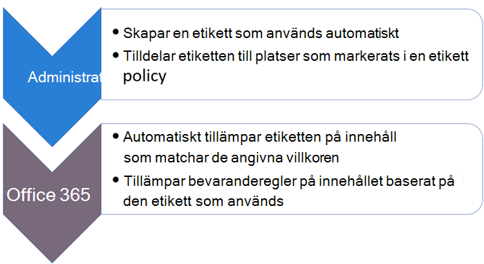
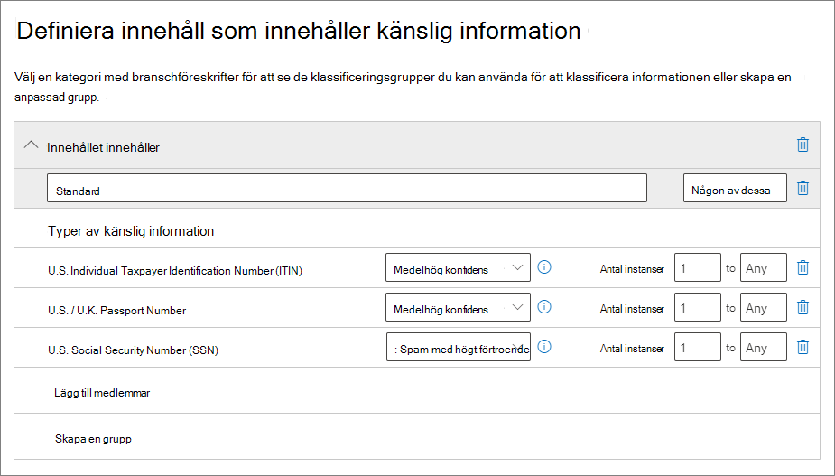
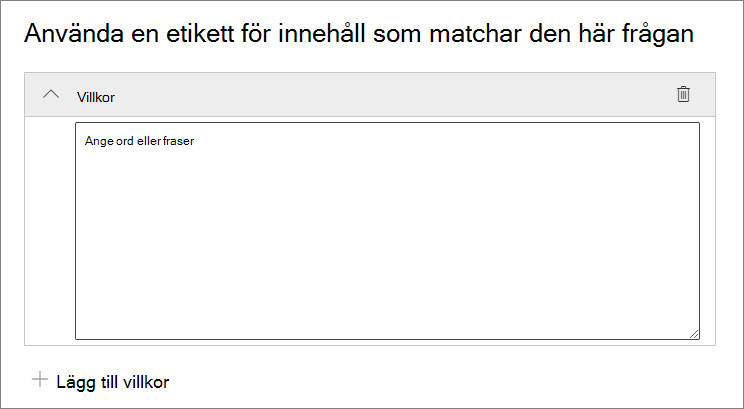
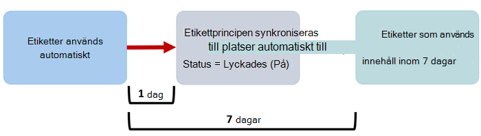

# <a name="automatically-apply-a-retention-label-to-retain-or-delete-content"></a>Använda en kvarhållningsetikett automatiskt för att bevara eller ta bort innehåll

>*[Licensieringsvägledning för Microsoft 365 för säkerhet och efterlevnad](/office365/servicedescriptions/microsoft-365-service-descriptions/microsoft-365-tenantlevel-services-licensing-guidance/microsoft-365-security-compliance-licensing-guidance).*

> [!NOTE]
> Det här scenariot stöds inte för [regelposter](records-management.md#records).

En av de mest kraftfulla funktionerna för [kvarhållningsetiketter](retention.md) är möjligheten att använda dem automatiskt för innehåll som matchar angivna villkor. I det här fallet behöver personer i organisationen inte använda kvarhållningsetiketterna själva. Microsoft 365 gör jobbet åt dem.
  
Automatisk användning av kvarhållningsetiketter är användbart av följande orsaker:
  
- Du behöver inte utbilda dina användare i alla klassificeringar.
    
- Du behöver inte förlita dig på att användare ska klassificera allt innehåll på rätt sätt.
    
- Användarna behöver inte längre känna till datastyrningsprinciper och kan istället fokusera på sitt arbete.
    
Du kan använda kvarhållningsetiketter för innehåll automatiskt när innehållet innehåller känslig information, nyckelord eller sökbara egenskaper, eller en matchning för [klassificerare som kan tränas](classifier-get-started-with.md).

> [!TIP]
> Använd de sökbara egenskaperna som nyligen släppts om du vill identifiera [Teams-mötesinspelningar](#microsoft-teams-meeting-recordings).

Processerna för att använda en kvarhållningsetikett automatiskt baseras på dessa villkor:



Följ anvisningarna för de två administratörsstegen.

> [!NOTE]
> Automatiska principer använder etikettering på tjänstsidan med villkor för att använda kvarhållningsetiketter automatiskt. Du kan också automatiskt använda en kvarhållningsetikett med en etikettprincip när du gör följande: 
>
> - Använder en kvarhållningsetikett för en dokumenttolkningsmodell i SharePoint Syntex
> - Använder en standardetikett för kvarhållning för SharePoint och Outlook
>- Använder en kvarhållningsetikett för e-post med hjälp av Outlook-regler
>
> Mer information om dessa scenarier finns i [Skapa och använda kvarhållningsetiketter i appar](create-apply-retention-labels.md).

## <a name="before-you-begin"></a>Innan du börjar

Den globala administratören för organisationen har fullständig behörighet för att skapa och redigera kvarhållningsetiketter och deras principer. Om du inte loggar in som global administratör kan du läsa mer i [Behörigheter som krävs för att skapa och hantera kvarhållningsprinciper och kvarhållningsetiketter](get-started-with-retention.md#permissions-required-to-create-and-manage-retention-policies-and-retention-labels).

## <a name="how-to-auto-apply-a-retention-label"></a>Så här använder du en kvarhållningsetikett automatiskt

Börja med att skapa kvarhållningsetiketten. Skapa sedan en automatisk princip för att använda den etiketten. Om du redan har skapat en kvarhållningsetikett kan du gå till [skapa en automatisk princip](#step-2-create-an-auto-apply-policy).

Navigeringsinstruktionerna skiljer sig åt beroende på om du använder [hantering av arkivhandlingar](records-management.md) eller inte. Instruktioner finns för båda scenarierna.

### <a name="step-1-create-a-retention-label"></a>Steg 1: Skapa en kvarhållningsetikett

1. Gå till någon av följande platser i [Microsoft 365 Efterlevnadscenter](https://compliance.microsoft.com/):
    
    - Om du använder hantering av arkivhandlingar:
        - **Lösningar** > **Hantering av arkivhandlingar** >  fliken **Filplan** > **+ Skapa en etikett** > **Kvarhållningsetikett**
        
    - Om du inte använder hantering av arkivhandlingar:
       - **Lösningar** > **Informationsstyrning** >  fliken **Etiketter** > + **Skapa en etikett**
    
    Ser du inte alternativet direkt? Välj först **Visa alla**. 

2. Följ anvisningarna i guiden. Om du använder hantering av arkivhandlingar:
    
    - Information om filplansbeskrivningar finns i [Använda filplanen för att hantera kvarhållningsetiketter](file-plan-manager.md)
    
    - Om du vill använda kvarhållningsetiketten för att deklarera arkivhandlingar markerar du **Markera objekt som en post** eller **Markera objekt som en regelpost**. Mer information finns i [Konfigurera kvarhållningsetiketter för att deklarera poster](declare-records.md#configuring-retention-labels-to-declare-records).

3. När du har skapat etiketten och du ser alternativ för att publicera etiketten, använda etiketten automatiskt eller spara etiketten: Välj **Använd den här etiketten automatiskt på en viss typ av innehåll** och välj sedan **Klar**, så startas guiden för att skapa automatisk etikettering som tar dig direkt till steg 2 i följande procedur.

Om du vill redigera en befintlig etikett markerar du den och väljer sedan alternativet **Redigera etikett** för att starta guiden för att redigera kvarhållning där du kan ändra etikettbeskrivningarna och eventuella [inställningar](#updating-retention-labels-and-their-policies) från steg 2.

### <a name="step-2-create-an-auto-apply-policy"></a>Steg 2: Skapa en princip för automatisk användning

När du skapar en princip för automatisk användning väljer du en kvarhållningsetikett som ska användas för innehåll automatiskt, baserat på de villkor du anger.

1. Gå till någon av följande platser i [Microsoft 365 Efterlevnadscenter](https://compliance.microsoft.com/):
    
    - Om du använder hantering av arkivhandlingar: **Informationsstyrning**:
        - **Lösningar** > **Hantering av arkivhandlingar** >  fliken **Etikettprinciper** > **Använd en etikett automatiskt**
    
    - Om du inte använder hantering av arkivhandlingar:
        - **Lösningar** > **Informationsstyrning** >  fliken **Etikettprinciper** > **Använd en etikett automatiskt**
    
    Ser du inte alternativet direkt? Välj först **Visa alla**. 

2. Följ anvisningarna i guiden för att skapa automatisk etikettering.
    
    Information om hur du konfigurerar de villkor som automatiskt tillämpar kvarhållningsetiketten finns i avsnittet [Konfigurera villkor för automatisk användning av kvarhållningsetiketter](#configuring-conditions-for-auto-apply-retention-labels) på den här sidan.
    
    Mer information om vilka platser som stöds av kvarhållningsetiketter finns i avsnittet [Kvarhållningsetiketter och platser](retention.md#retention-label-policies-and-locations).

Om du vill redigera en befintlig princip för automatisk användning startar du guiden Redigera kvarhållningsprincip. Där kan du ändra den valda kvarhållningsetiketten och eventuella [inställningar](#updating-retention-labels-and-their-policies) från steg 2.

När innehållet har fått en etikett med en princip för automatisk användning av etiketter kan den använda etiketten inte tas bort automatiskt eller ändras genom att ändra innehållet eller principen, eller med en ny princip för automatisk användning av etiketter. Mer information finns i [Endast en kvarhållningsetikett i taget](retention.md#only-one-retention-label-at-a-time).

### <a name="configuring-conditions-for-auto-apply-retention-labels"></a>Konfigurera villkor för kvarhållningsetiketter för automatisk användning

Du kan använda kvarhållningsetiketter för innehåll automatiskt när innehållet innehåller:

- [Specifika typer av känslig information](#auto-apply-labels-to-content-with-specific-types-of-sensitive-information)

- [Specifika nyckelord eller sökbara egenskaper som matchar en fråga som du skapar](#auto-apply-labels-to-content-with-keywords-or-searchable-properties)

- [En matchning för klassificerare som kan tränas](#auto-apply-labels-to-content-by-using-trainable-classifiers)

#### <a name="auto-apply-labels-to-content-with-specific-types-of-sensitive-information"></a>Automatisk användning av etiketter på innehåll med specifika typer av känslig information

> [!WARNING]
> Den här konfigurationen har för närvarande en känd begränsning där den valda kvarhållningsetiketten alltid används för alla e-postmeddelanden utan etikett när det finns en matchning för valda typer av känslig information. Även om du till exempel anger specifika användare som omfång för principen för automatisk användning eller väljer andra platser än Exchange för principen, används etiketten alltid på e-postmeddelanden utan etikett när det finns en matchning.

När du skapar principer för automatisk användning av kvarhållningsetiketter för känslig information visas samma lista med principmallar som när du skapar en princip för dataförlustskydd (DLP). Varje mall har förkonfigurerats för att söka efter specifika typer av känslig information. I följande exempel är typerna för känslig information från kategorin **Sekretess** och **U. S personligt identifierbar information (PII)** datamall:



Mer information om typer av känslig information finns i [Entitetsdefinitioner för typer av känslig information](sensitive-information-type-entity-definitions.md). För närvarande stöds inte [exakta datamatchningar](create-custom-sensitive-information-types-with-exact-data-match-based-classification.md) och [dokumentfingeravtryck](document-fingerprinting.md) för det här scenariot.

När du har valt en principmall kan du lägga till eller ta bort alla typer av känslig information, och du kan ändra konfidensnivå och antalet instanser. I föregående skärmbild har de här alternativen ändrats så att en kvarhållningsetikett kommer att tillämpas automatiskt endast när:
  
- Typen av känslig information som identifieras har en exakt matchning (eller [konfidensnivå](sensitive-information-type-learn-about.md#more-on-confidence-levels)) på minst **Medelhögkonfidens** för två av de typer av känslig information och **Högkonfidens** för en. Många typer av känslig information definieras med flera mönster, där ett mönster med högre matchningsnoggrannhet kräver att mer bevis hittas (till exempel nyckelord, datum eller adresser), medan ett mönster med lägre matchningsnoggrannhet kräver mindre bevis. Ju lägre konfidensnivå, desto enklare blir det för innehållet att matcha villkoret men med möjlighet till fler falska positiva.

- Innehållet innehåller mellan 1 och 9 instanser av någon av dessa tre typer av känslig information. Standard för den **till** värdet är **Alla**.

Mer information om de här alternativen finns i följande vägledning i DLP-dokumentationen om att [justera regler för att göra dem enklare eller svårare att matcha](data-loss-prevention-policies.md#tuning-rules-to-make-them-easier-or-harder-to-match).

Saker att tänka på när du använder typer av känslig information för automatisk användning av kvarhållningsetiketter:

- Nya och ändrade objekt kan få etiketter automatiskt.

#### <a name="auto-apply-labels-to-content-with-keywords-or-searchable-properties"></a>Automatisk användning av etiketter på innehåll med nyckelord eller sökbara egenskaper

Du kan automatiskt använda etiketter för innehåll med hjälp av en fråga som innehåller specifika ord, fraser eller värden med sökbara egenskaper. Du kan förfina frågan med hjälp av sökoperatorer som AND, OR och NOT (OCH, ELLER och INTE).



Mer information om frågesyntax som använder KQL (Keyword Query Language) finns i [syntaxreferensen för KQL (Keyword Query Language)](/sharepoint/dev/general-development/keyword-query-language-kql-syntax-reference).

För frågebaserade principer för automatisk användning används samma sökindex som innehållssökning för eDiscovery för att identifiera innehåll. Mer information om de sökbara egenskaper du kan använda finns i [Nyckelordsfrågor och sökvillkor för innehållssökning](keyword-queries-and-search-conditions.md).

Några saker att tänka på när du använder nyckelord eller sökbara egenskaper för automatisk användning av kvarhållningsetiketter:

- Nya, ändrade och befintliga objekt får automatiskt etiketter för SharePoint, OneDrive och Exchange.

- För SharePoint stöds inte crawlade egenskaper och anpassade egenskaper för dessa KQL-frågor och du kan bara använda fördefinierade hanterade egenskaper. Du kan ändå använda mappningar på klientorganisationsnivå med de fördefinierade hanterade egenskaperna som är aktiverade som förfiningar som standard (RefinableDate00-19, RefinableString00-99, RefinableInt00-49, RefinableDecimals00-09 och RefinableDouble00-09). Mer information finns i [Översikt över crawlade och hanterade egenskaper i SharePoint Server](/SharePoint/technical-reference/crawled-and-managed-properties-overview). Instruktioner finns i [Skapa en ny hanterad egenskap](/sharepoint/manage-search-schema#create-a-new-managed-property).

- Om du mappar en anpassad egenskap till någon av förfiningsegenskaperna väntar du 24 timmar innan du använder den i KQL-frågan för en kvarhållningsetikett.

- Även om hanterade SharePoint-egenskaper kan byta namn med hjälp av alias ska du inte använda dessa för KQL-frågor i dina etiketter. Ange alltid det faktiska namnet på den hanterade egenskapen, till exempel ”RefinableString01”.

- Om du vill söka efter värden som innehåller blanksteg eller specialtecken använder du dubbla citattecken (`" "`) som innehåller frasen, till exempel `subject:"Financial Statements"`.

- Använd egenskapen *DocumentLink* istället för *Path* om du vill matcha ett objekt baserat på dess URL. 

- Suffixsökningar med jokertecken (till exempel `*cat`) eller delsträngssökningar med jokertecken (till exempel `*cat*`) stöds inte. Prefixsökningar med jokertecken (till exempel `cat*`) stöds däremot.

- Tänk på att delvis indexerade objekt kan vara orsaken till att objekt som du förväntar dig inte får etiketter, eller till att objekt som du förväntar dig ska undantas från etikettering får etiketter när du använder operatorn NOT (INTE). Mer information finns i artikeln [Delvis indexerade objekt i Innehållssökning](partially-indexed-items-in-content-search.md).


Exempelfrågor:

| Arbetsbelastning | Exempel |
|:-----|:-----|
|Exchange   | `subject:"Financial Statements"` |
|Exchange   | `recipients:garthf@contoso.com` |
|SharePoint | `contenttype:document` |
|SharePoint | `site:https://contoso.sharepoint.com/sites/teams/procurement AND contenttype:document`|
|Exchange eller SharePoint | `"customer information" OR "private"`|

Mer komplicerade exempel:

Följande fråga för SharePoint identifierar Word-dokument eller Excel-kalkylblad när filerna innehåller nyckelorden **password** (lösenord), **passwords** (lösenord) eller **pw**(lös):

```
(password OR passwords OR pw) AND (filetype:doc* OR filetype:xls*)
```

Följande fråga för Exchange identifierar alla Word-dokument eller PDF-filer som innehåller ordet **nda** (sekretessavtal) eller frasen **non disclosure agreeement** (sekretessavtal) när dokumenten bifogas i ett e-postmeddelande:

```
(nda OR "non disclosure agreement") AND (attachmentnames:.doc* OR attachmentnames:.pdf)
```

Följande fråga för SharePoint identifierar dokument som innehåller ett kreditkortsnummer: 

```
sensitivetype:"credit card number"
```

Följande fråga innehåller några vanliga nyckelord för att identifiera dokument eller e-postmeddelanden som innehåller juridiskt innehåll:

```
ACP OR (Attorney Client Privilege*) OR (AC Privilege)
```

Följande fråga innehåller vanliga nyckelord för att identifiera dokument eller e-postmeddelanden för personalavdelningen: 

```
(resume AND staff AND employee AND salary AND recruitment AND candidate)
```

Observera att praxis är att alltid lägga till operatorer mellan nyckelord som i det här sista exemplet. Ett blanksteg mellan nyckelord (eller två egenskap:värde-uttryck) är samma sak som att använda AND (OCH). Genom att alltid lägga till operatorer är det enklare att se att den här exempelfrågan bara identifierar innehåll som innehåller alla dessa nyckelord, istället för innehåll som innehåller något av nyckelorden. Om avsikten är att identifiera innehåll som innehåller något av nyckelorden anger du OR (ELLER) istället för AND (OCH). Som det här exemplet visar är det lättare att tolka frågan rätt om du alltid anger operatorer. 

##### <a name="microsoft-teams-meeting-recordings"></a>Microsoft Teams-mötesinspelningar

> [!NOTE]
> Möjligheten att bevara och ta bort Teams-mötesinspelningar fungerar inte förrän inspelningarna sparas i OneDrive eller SharePoint. Mer information finns i [Använda OneDrive för företag och SharePoint Online eller Stream för mötesinspelningar](/MicrosoftTeams/tmr-meeting-recording-change).

Om du vill identifiera Microsoft Teams-mötesinspelningar som lagras i användarnas OneDrive-konton eller i SharePoint anger du följande för **Frågeredigeraren för nyckelord**:

```
ProgID:Media AND ProgID:Meeting
```

Mötesinspelningar sparas för det mesta i OneDrive. Men kanalmöten sparas i SharePoint.


#### <a name="auto-apply-labels-to-content-by-using-trainable-classifiers"></a>Automatisk användning av etiketter på innehåll med hjälp av klassificerare som kan tränas

När du väljer alternativet för en klassificerare som kan tränas kan du välja en av de inbyggda klassificerarna eller en anpassad klassificerare. Det finns till exempel inbyggda klassificerare för **meritförteckningar**, **källkod**, **riktade trakasserier**, **svordomar** och **hot**:


> [!CAUTION]
> Vi håller på att fasa ut den inbyggda klassificeraren för **stötande språk** eftersom den har gett ett stort antal falska positiva identifieringar. Använd inte den här inbyggda klassificeraren, och om du använder den just nu bör du flytta bort affärsprocesserna från den. Vi rekommenderar att du använder de inbyggda klassificerarna för **riktade trakasserier**, **svordomar** och **hot** istället.

För att automatiskt kunna använda en etikett med det här alternativet måste SharePoint-webbplatser och postlådor ha minst 10 MB data.

Mer information om klassificerare som kan tränas finns i [Mer information om utbildningsbara klassificerare](classifier-learn-about.md).

> [!TIP]
> Om du använder klassificerare som kan tränas för Exchange hittar du mer information i [Så här tränar du en klassificerare i innehållsutforskaren på nytt](classifier-how-to-retrain-content-explorer.md).

Saker att tänka på när du använder klassificerare som kan tränas för automatisk användning av kvarhållningsetiketter:

- Nya och ändrade objekt kan få etiketter automatiskt, och befintliga objekt från de sex senaste månaderna.

## <a name="how-long-it-takes-for-retention-labels-to-take-effect"></a>Så här länge tar det för kvarhållningsetiketterna att börja gälla

När du använder kvarhållningsetiketter automatiskt kan det ta upp till sju dagar innan kvarhållningsetiketterna används på allt befintligt innehåll som matchar villkoren.
  


Om de förväntade etiketterna inte visas efter sju dagar kontrollerar du **Status** för principen för automatisk användning genom att välja den på sidan **Etikettprinciper** i efterlevnadscentret. Om statusen **Av (fel)** visas och platsinformationen har ett meddelande om att det tar längre tid än förväntat att distribuera principen (för SharePoint) eller att du ska försöka distribuera principen igen (för OneDrive), kan du prova att köra PowerShell-kommandot [Set-RetentionCompliancePolicy](/powershell/module/exchange/set-retentioncompliancepolicy) för att försöka distribuera principen igen:

1. [Ansluta till Säkerhets- och efterlevnadscenter i PowerShell](/powershell/exchange/connect-to-scc-powershell).

2. Kör följande kommando:
    
    ``` PowerShell
    Set-RetentionCompliancePolicy -Identity <policy name> -RetryDistribution
   ```

## <a name="updating-retention-labels-and-their-policies"></a>Uppdatera kvarhållningsetiketter och deras principer

När du redigerar en kvarhållningsetikett eller princip för automatisk användning, och kvarhållningsetiketten redan används på innehåll, används de uppdaterade inställningarna automatiskt på det här innehållet utöver nytt innehåll som identifieras.

Vissa inställningar kan inte ändras efter att etiketten eller principen har skapats och sparats, till exempel:
- Kvarhållningsetiketten och principnamnet, samt kvarhållningsinställningarna förutom kvarhållningsperioden. Du kan ändå inte ändra kvarhållningsperioden när kvarhållningsperioden baseras på när objekten har fått etikett.
- Alternativet för att markera objekt som en arkivhandling.

### <a name="deleting-retention-labels"></a>Ta bort kvarhållningsetiketter

Du kan ta bort kvarhållningsetiketter som för närvarande inte ingår i någon princip för kvarhållningsetiketter, som inte är konfigurerade för händelsebaserad kvarhållning eller markerar objekt som regelposter.

För kvarhållningsetiketter som du kan ta bort misslyckas borttagningen om de har använts på objekt. En länk till innehållsutforskaren för att identifiera objekten med etiketterna visas.

Det kan ändå ta upp till två dagar innan objekten med etiketterna visas i innehållsutforskaren. I det här scenariot kan kvarhållningsetiketten tas bort utan att länken till innehållsutforskaren visas.

## <a name="locking-the-policy-to-prevent-changes"></a>Låsa principen för att förhindra ändringar

Om du behöver se till att ingen kan inaktivera principen, ta bort principen eller göra den mindre restriktiv kan du läsa mer i [Använda bevarandelås för att begränsa ändringar av kvarhållningsprinciper och principer för kvarhållningsetiketter](retention-preservation-lock.md).

## <a name="next-steps"></a>Nästa steg

I [Hantera livscykeln för dokument som lagras i SharePoint med hjälp av kvarhållningsetiketter](auto-apply-retention-labels-scenario.md) finns ett exempelscenario med en princip för automatisk användning av kvarhållningsetiketter med hanterade egenskaper i SharePoint samt händelsebaserad kvarhållning för att starta kvarhållningsperioden.