# <a name="apply-a-sensitivity-label-to-content-automatically"></a><span data-ttu-id="a998a-103">Använda en känslighetsetikett för innehåll automatiskt</span><span class="sxs-lookup"><span data-stu-id="a998a-103">Apply a sensitivity label to content automatically</span></span>

><span data-ttu-id="a998a-104">*[Licensieringsvägledning för Microsoft 365 för säkerhet och efterlevnad](/office365/servicedescriptions/microsoft-365-service-descriptions/microsoft-365-tenantlevel-services-licensing-guidance/microsoft-365-security-compliance-licensing-guidance).*</span><span class="sxs-lookup"><span data-stu-id="a998a-104">*[Microsoft 365 licensing guidance for security & compliance](/office365/servicedescriptions/microsoft-365-service-descriptions/microsoft-365-tenantlevel-services-licensing-guidance/microsoft-365-security-compliance-licensing-guidance).*</span></span>

> [!NOTE]
> <span data-ttu-id="a998a-105">Information om omfattningen om hur du automatiskt använder en känslighetsetikett i Azure Purview (förhandsversion) finns i [Märka innehållet i Azure Purview automatiskt](/azure/purview/create-sensitivity-label).</span><span class="sxs-lookup"><span data-stu-id="a998a-105">For information about automatically applying a sensitivity label in Azure Purview (preview), see [Automatically label your content in Azure Purview](/azure/purview/create-sensitivity-label).</span></span>

<span data-ttu-id="a998a-106">När du skapar en känslighetsetikett kan du tilldela etiketten automatiskt till fler och e-post, när det matchar de villkor du anger.</span><span class="sxs-lookup"><span data-stu-id="a998a-106">When you create a sensitivity label, you can automatically assign that label to files and emails when it matches conditions that you specify.</span></span>

<span data-ttu-id="a998a-107">Det är viktigt att använda känsliga etiketter för innehåll automatiskt eftersom:</span><span class="sxs-lookup"><span data-stu-id="a998a-107">This ability to apply sensitivity labels to content automatically is important because:</span></span>

- <span data-ttu-id="a998a-108">Du behöver inte träna dina användare när de använder var och en av dina klassificeringar.</span><span class="sxs-lookup"><span data-stu-id="a998a-108">You don't need to train your users when to use each of your classifications.</span></span>

- <span data-ttu-id="a998a-109">Du behöver inte förlita dig på att användare ska klassificera allt innehåll på rätt sätt.</span><span class="sxs-lookup"><span data-stu-id="a998a-109">You don't need to rely on users to classify all content correctly.</span></span>

- <span data-ttu-id="a998a-110">Användarna behöver inte längre veta om dina principer – de kan istället fokusera på sitt arbete.</span><span class="sxs-lookup"><span data-stu-id="a998a-110">Users no longer need to know about your policies—they can instead focus on their work.</span></span>

<span data-ttu-id="a998a-111">När innehållet har etiketterats manuellt kommer den etiketten aldrig att ersättas med automatisk etikett.</span><span class="sxs-lookup"><span data-stu-id="a998a-111">When content has been manually labeled, that label will never be replaced by automatic labeling.</span></span> <span data-ttu-id="a998a-112">Automatisk etikettering kan ersätta en [etikett med lägre prioritet](sensitivity-labels.md#label-priority-order-matters) som tillämpats automatiskt.</span><span class="sxs-lookup"><span data-stu-id="a998a-112">However, automatic labeling can replace a [lower priority label](sensitivity-labels.md#label-priority-order-matters) that was automatically applied.</span></span>

<span data-ttu-id="a998a-113">Det finns två olika metoder för att automatiskt använda en känslighetsetikett för innehåll i Microsoft 365:</span><span class="sxs-lookup"><span data-stu-id="a998a-113">There are two different methods for automatically applying a sensitivity label to content in Microsoft 365:</span></span>

- <span data-ttu-id="a998a-114">**Etikett på klientsidan när användare redigerar dokument eller skriver (eller svarar på eller vidarebefordrar) e-postmeddelanden**: Använd en etikett som är konfigurerad för automatisk etikettering för filer och e-postmeddelanden (inkluderar Word, Excel, PowerPoint och Outlook).</span><span class="sxs-lookup"><span data-stu-id="a998a-114">**Client-side labeling when users edit documents or compose (also reply or forward) emails**: Use a label that's configured for auto-labeling for files and emails (includes Word, Excel, PowerPoint, and Outlook).</span></span> 
    
    <span data-ttu-id="a998a-115">Den här metoden kan användas för att rekommendera en etikett till användare, liksom att automatiskt använda en etikett.</span><span class="sxs-lookup"><span data-stu-id="a998a-115">This method supports recommending a label to users, as well as automatically applying a label.</span></span> <span data-ttu-id="a998a-116">I båda fallen bestämmer användaren om du vill acceptera eller avvisa etiketten för att säkerställa rätt etikettering av innehållet.</span><span class="sxs-lookup"><span data-stu-id="a998a-116">But in both cases, the user decides whether to accept or reject the label, to help ensure the correct labeling of content.</span></span> <span data-ttu-id="a998a-117">På den här sidan i klienten finns det minimalt med dokument. det innebär att du inte kan använda etiketter.</span><span class="sxs-lookup"><span data-stu-id="a998a-117">This client-side labeling has minimal delay for documents because the label can be applied even before the document is saved.</span></span> <span data-ttu-id="a998a-118">Det är dock inga klient program som har stöd för automatisk etikettering.</span><span class="sxs-lookup"><span data-stu-id="a998a-118">However, not all client apps support auto-labeling.</span></span> <span data-ttu-id="a998a-119">Den här funktionen stöds av den enhetliga klient versionen av Azure information Protection och [vissa versioner av Office](sensitivity-labels-office-apps.md#support-for-sensitivity-label-capabilities-in-apps).</span><span class="sxs-lookup"><span data-stu-id="a998a-119">This capability is supported by the Azure Information Protection unified labeling client, and [some versions of Office](sensitivity-labels-office-apps.md#support-for-sensitivity-label-capabilities-in-apps).</span></span> 
    
    <span data-ttu-id="a998a-120">Instruktioner för konfiguration finns i [hur du konfigurerar automatisk etikettering för Office-program](#how-to-configure-auto-labeling-for-office-apps) på den här sidan.</span><span class="sxs-lookup"><span data-stu-id="a998a-120">For configuration instructions, see [How to configure auto-labeling for Office apps](#how-to-configure-auto-labeling-for-office-apps) on this page.</span></span>

- <span data-ttu-id="a998a-121">**Etikettering på tjänstsidan när innehåll redan har sparats (i SharePoint eller OneDrive) eller mejlats (bearbetats av Exchange Online)**: Använd en princip för automatisk etikettering.</span><span class="sxs-lookup"><span data-stu-id="a998a-121">**Service-side labeling when content is already saved (in SharePoint or OneDrive) or emailed (processed by Exchange Online)**: Use an auto-labeling policy.</span></span> 
    
    <span data-ttu-id="a998a-p103">Du kanske också har hört att metoden kallas för automatisk etikettering av data i vila (dokument i SharePoint och OneDrive) och data som överförs (e-post som skickas eller tas emot av Exchange). För Exchange innehåller det inte e-postmeddelanden i vila (postlådor).</span><span class="sxs-lookup"><span data-stu-id="a998a-p103">You might also hear this method referred to as auto-labeling for data at rest (documents in SharePoint and OneDrive) and data in transit (email that is sent or received by Exchange). For Exchange, it doesn't include emails at rest (mailboxes).</span></span>
    
    <span data-ttu-id="a998a-124">Eftersom den här etiketteringen tillämpas av tjänster i stället för program behöver du inte oroa dig för vilket appanvändare har eller vilken version.</span><span class="sxs-lookup"><span data-stu-id="a998a-124">Because this labeling is applied by services rather than by applications, you don't need to worry about what apps users have and what version.</span></span> <span data-ttu-id="a998a-125">Därför är den här funktionen omedelbart tillgänglig i hela organisationen och lämpar sig för etikettering vid skalan.</span><span class="sxs-lookup"><span data-stu-id="a998a-125">As a result, this capability is immediately available throughout your organization and suitable for labeling at scale.</span></span> <span data-ttu-id="a998a-126">Automatiskt märkta principer har inte stöd för Rekommenderad etikett eftersom användaren inte interagerar med namngivnings processen.</span><span class="sxs-lookup"><span data-stu-id="a998a-126">Auto-labeling policies don't support recommended labeling because the user doesn't interact with the labeling process.</span></span> <span data-ttu-id="a998a-127">I stället körs principerna i simuleringsläge för att säkerställa rätt etikettering av innehållet innan etiketten tillämpas.</span><span class="sxs-lookup"><span data-stu-id="a998a-127">Instead, the administrator runs the policies in simulation mode to help ensure the correct labeling of content before actually applying the label.</span></span>
    
    <span data-ttu-id="a998a-128">Instruktioner för konfiguration finns i [hur du konfigurerar principer för automatisk etikettering för SharePoint, OneDrive och Exchange](#how-to-configure-auto-labeling-policies-for-sharepoint-onedrive-and-exchange) på den här sidan.</span><span class="sxs-lookup"><span data-stu-id="a998a-128">For configuration instructions, see [How to configure auto-labeling policies for SharePoint, OneDrive, and Exchange](#how-to-configure-auto-labeling-policies-for-sharepoint-onedrive-and-exchange) on this page.</span></span>
    
    <span data-ttu-id="a998a-129">Specifikt för autoetikettering för SharePoint och OneDrive:</span><span class="sxs-lookup"><span data-stu-id="a998a-129">Specific to auto-labeling for SharePoint and OneDrive:</span></span>
    - <span data-ttu-id="a998a-p105">Office-filer för Word, PowerPoint och Excel stöds. Öppna XML-format stöds (t.ex. .docx och .xlsx) men inte Microsoft Office 97-2003-format (t.ex. .doc och .xls).</span><span class="sxs-lookup"><span data-stu-id="a998a-p105">Office files for Word, PowerPoint, and Excel are supported. Open XML format is supported (such as .docx and .xlsx) but not Microsoft Office 97-2003 format (such as .doc and .xls).</span></span>
        - <span data-ttu-id="a998a-132">Filerna kan märkas automatiskt före eller efter att principerna för automatisk etikettering har skapats.</span><span class="sxs-lookup"><span data-stu-id="a998a-132">These files can be auto-labeled at rest before or after the auto-labeling policies are created.</span></span> <span data-ttu-id="a998a-133">Filer kan inte etiketteras automatiskt om de är en del av en öppen session (filen är öppen).</span><span class="sxs-lookup"><span data-stu-id="a998a-133">Files cannot be auto-labeled if they are part of an open session (the file is open).</span></span>
        - <span data-ttu-id="a998a-134">För närvarande stöds inte bilagor till listobjekt och de kommer inte att märkas automatiskt.</span><span class="sxs-lookup"><span data-stu-id="a998a-134">Currently, attachments to list items aren't supported and won't be auto-labeled.</span></span>
    - <span data-ttu-id="a998a-135">Högst 25 000 automatiskt etiketterade filer i klientorganisationen per dag.</span><span class="sxs-lookup"><span data-stu-id="a998a-135">Maximum of 25,000 automatically labeled files in your tenant per day.</span></span>
    - <span data-ttu-id="a998a-136">Högst tio principer för automatisk etikettering per klientorganisation, varav varje riktar sig till upp till tio webbplatser (SharePoint eller OneDrive).</span><span class="sxs-lookup"><span data-stu-id="a998a-136">Maximum of 10 auto-labeling policies per tenant, each targeting up to 10 sites (SharePoint or OneDrive).</span></span>
    - <span data-ttu-id="a998a-137">Befintliga värden för ändrad, ändrad av och datum ändras inte på grund av principer för automatisk etikettering – det gäller både simuleringsläge och när etiketter används.</span><span class="sxs-lookup"><span data-stu-id="a998a-137">Existing values for modified, modified by, and the date are not changed as a result of auto-labeling policies—for both simulation mode and when labels are applied.</span></span>
    - <span data-ttu-id="a998a-138">När etiketten tillämpar kryptering är det [utfärdaren av rättighetshantering och ägaren av rättighetshantering](/azure/information-protection/configure-usage-rights#rights-management-issuer-and-rights-management-owner) det konto som senast ändrade filen.</span><span class="sxs-lookup"><span data-stu-id="a998a-138">When the label applies encryption, the [Rights Management issuer and Rights Management owner](/azure/information-protection/configure-usage-rights#rights-management-issuer-and-rights-management-owner) is the account that last modified the file.</span></span>

    <span data-ttu-id="a998a-139">Specifikt för automatisk etikettering för Exchange:</span><span class="sxs-lookup"><span data-stu-id="a998a-139">Specific to auto-labeling for Exchange:</span></span>
    - <span data-ttu-id="a998a-p107">Till skillnad från manuell etikettering eller automatisk etikettering med Office-program skannas även PDF-bilagor och Office-bilagor (Word-, Excel- och PowerPoint-filer) efter de villkor som du anger i principen för automatisk etikett. När det finns en matchning etiketteras e-postmeddelandet, men inte den bifogade filen.</span><span class="sxs-lookup"><span data-stu-id="a998a-p107">Unlike manual labeling or auto-labeling with Office apps, PDF attachments as well as Office attachments (Word, Excel, and PowerPoint files) are also scanned for the conditions you specify in your auto-labeling policy. When there is a match, the email is labeled but not the attachment.</span></span>
        - <span data-ttu-id="a998a-142">Om etiketten tillämpar kryptering för PDF-filer krypteras filerna när klientorganisationen har [aktiverats för bifogade PDF-filer](ome-faq.yml#are-pdf-file-attachments-supported-).</span><span class="sxs-lookup"><span data-stu-id="a998a-142">For PDF files, if the label applies encryption, these files are encrypted when your tenant is [enabled for PDF attachments](ome-faq.yml#are-pdf-file-attachments-supported-).</span></span>
        - <span data-ttu-id="a998a-p108">För dessa Office-filer stöds Open XML-format (till exempel .docx och .xlsx) men inte Microsoft Office 97-2003-format (t.ex. .doc och .xls). Om etiketten tillämpar kryptering krypteras filerna.</span><span class="sxs-lookup"><span data-stu-id="a998a-p108">For these Office files, Open XML format is supported (such as .docx and .xlsx) but not Microsoft Office 97-2003 format (such as .doc and .xls). If the label applies encryption, these files are encrypted.</span></span>
    - <span data-ttu-id="a998a-145">Om du har regler för e-postflödet i Exchange eller DLP-principer (dataförlustskydd) som tillämpar IRM-kryptering: En etikett tillämpas när innehåll identifieras av dessa regler eller principer samt en princip för automatisk etikettering.</span><span class="sxs-lookup"><span data-stu-id="a998a-145">If you have Exchange mail flow rules or data loss prevention (DLP) policies that apply IRM encryption: When content is identified by these rules or policies and an auto-labeling policy, the label is applied.</span></span> <span data-ttu-id="a998a-146">Om den etiketten tillämpar kryptering ignoreras IRM-inställningarna från Exchange-e-postflödesregler eller DLP-principer.</span><span class="sxs-lookup"><span data-stu-id="a998a-146">If that label applies encryption, the IRM settings from the Exchange mail flow rules or DLP policies are ignored.</span></span> <span data-ttu-id="a998a-147">Om etiketten inte tillämpar kryptering tillämpas IRM-inställningarna från e-postflödesregler eller DLP-principer utöver etiketten.</span><span class="sxs-lookup"><span data-stu-id="a998a-147">However, if that label doesn't apply encryption, the IRM settings from the mail flow rules or DLP policies are applied in addition to the label.</span></span>
    - <span data-ttu-id="a998a-148">E-post som har IRM-kryptering utan etikett ersätts med en etikett med alla krypteringsinställningar när det finns en matchning genom att använda automatisk etikettering.</span><span class="sxs-lookup"><span data-stu-id="a998a-148">Email that has IRM encryption with no label will be replaced by a label with any encryption settings when there is a match by using auto-labeling.</span></span>
    - <span data-ttu-id="a998a-149">Inkommande e-post etiketteras när det finns ett samband med de villkor som gäller för automatisk etikettering:</span><span class="sxs-lookup"><span data-stu-id="a998a-149">Incoming email is labeled when there is a match with your auto-labeling conditions:</span></span>
        - <span data-ttu-id="a998a-150">Om etiketten har konfigurerats för [kryptering](encryption-sensitivity-labels.md), tillämpas inte den krypteringen.</span><span class="sxs-lookup"><span data-stu-id="a998a-150">If the label is configured for [encryption](encryption-sensitivity-labels.md), that encryption isn't applied.</span></span>
        - <span data-ttu-id="a998a-151">Om etiketten är konfigurerad för att tillämpa [dynamiska markeringar](sensitivity-labels-office-apps.md#dynamic-markings-with-variables) bör du vara medveten om att det kan resultera i namnen på personer utanför organisationen.</span><span class="sxs-lookup"><span data-stu-id="a998a-151">If the label is configured to apply [dynamic markings](sensitivity-labels-office-apps.md#dynamic-markings-with-variables), be aware that this can result in the names of people outside your organization.</span></span>
    - <span data-ttu-id="a998a-152">När etiketten tillämpar kryptering är [utfärdaren av rättighetshantering och ägaren av rättighetshantering](/azure/information-protection/configure-usage-rights#rights-management-issuer-and-rights-management-owner) den person som skickar e-postmeddelandet.</span><span class="sxs-lookup"><span data-stu-id="a998a-152">When the label applies encryption, the [Rights Management issuer and Rights Management owner](/azure/information-protection/configure-usage-rights#rights-management-issuer-and-rights-management-owner) is the person who sends the email.</span></span> <span data-ttu-id="a998a-153">För närvarande går det inte att ställa in ägare för rättighetshantering för alla inkommande e-postmeddelanden som krypteras automatiskt.</span><span class="sxs-lookup"><span data-stu-id="a998a-153">There currently isn't a way to set a Rights Manager owner for all incoming email messages that are automatically encrypted.</span></span>
    

## <a name="compare-auto-labeling-for-office-apps-with-auto-labeling-policies"></a><span data-ttu-id="a998a-154">Jämföra automatisk etikettering för Office-appar med principer för automatisk etikettering</span><span class="sxs-lookup"><span data-stu-id="a998a-154">Compare auto-labeling for Office apps with auto-labeling policies</span></span>

<span data-ttu-id="a998a-155">I följande tabell kan du identifiera skillnader i beteende för två kompletterande automatiska etiketteringsmetoder:</span><span class="sxs-lookup"><span data-stu-id="a998a-155">Use the following table to help you identify the differences in behavior for the two complementary automatic labeling methods:</span></span>

|<span data-ttu-id="a998a-156">Funktion eller beteende</span><span class="sxs-lookup"><span data-stu-id="a998a-156">Feature or behavior</span></span>|<span data-ttu-id="a998a-157">Etikettinställning: Automatisk etikettering av filer och e-postmeddelanden</span><span class="sxs-lookup"><span data-stu-id="a998a-157">Label setting: Auto-labeling for files and emails</span></span>  |<span data-ttu-id="a998a-158">Princip: Automatisk etikettering</span><span class="sxs-lookup"><span data-stu-id="a998a-158">Policy: Auto-labeling</span></span>|
|:-----|:-----|:-----|
|<span data-ttu-id="a998a-159">Appberoende</span><span class="sxs-lookup"><span data-stu-id="a998a-159">App dependency</span></span>|[<span data-ttu-id="a998a-160">Ja</span><span class="sxs-lookup"><span data-stu-id="a998a-160">Yes</span></span>](sensitivity-labels-office-apps.md#support-for-sensitivity-label-capabilities-in-apps) |<span data-ttu-id="a998a-161">Nej \*</span><span class="sxs-lookup"><span data-stu-id="a998a-161">No \*</span></span> |
|<span data-ttu-id="a998a-162">Begränsa efter plats</span><span class="sxs-lookup"><span data-stu-id="a998a-162">Restrict by location</span></span>|<span data-ttu-id="a998a-163">Nej</span><span class="sxs-lookup"><span data-stu-id="a998a-163">No</span></span> |<span data-ttu-id="a998a-164">Ja</span><span class="sxs-lookup"><span data-stu-id="a998a-164">Yes</span></span> |
|<span data-ttu-id="a998a-165">Villkor: träningsbara klassificerare</span><span class="sxs-lookup"><span data-stu-id="a998a-165">Conditions: Trainable classifiers</span></span>|<span data-ttu-id="a998a-166">Ja</span><span class="sxs-lookup"><span data-stu-id="a998a-166">Yes</span></span> |<span data-ttu-id="a998a-167">Nej</span><span class="sxs-lookup"><span data-stu-id="a998a-167">No</span></span> |
|<span data-ttu-id="a998a-168">Villkor: Delningsalternativ och ytterligare alternativ för e-post</span><span class="sxs-lookup"><span data-stu-id="a998a-168">Conditions: Sharing options and additional options for email</span></span>|<span data-ttu-id="a998a-169">Nej</span><span class="sxs-lookup"><span data-stu-id="a998a-169">No</span></span> |<span data-ttu-id="a998a-170">Ja</span><span class="sxs-lookup"><span data-stu-id="a998a-170">Yes</span></span> |
|<span data-ttu-id="a998a-171">Villkor: Undantag</span><span class="sxs-lookup"><span data-stu-id="a998a-171">Conditions: Exceptions</span></span>|<span data-ttu-id="a998a-172">Nej</span><span class="sxs-lookup"><span data-stu-id="a998a-172">No</span></span> |<span data-ttu-id="a998a-173">Ja (endast e-post)</span><span class="sxs-lookup"><span data-stu-id="a998a-173">Yes (email only)</span></span> |
|<span data-ttu-id="a998a-174">Rekommendationer, principbeskrivningar och användaråsidosättningar</span><span class="sxs-lookup"><span data-stu-id="a998a-174">Recommendations, policy tooltip, and user overrides</span></span>|<span data-ttu-id="a998a-175">Ja</span><span class="sxs-lookup"><span data-stu-id="a998a-175">Yes</span></span> |<span data-ttu-id="a998a-176">Nej</span><span class="sxs-lookup"><span data-stu-id="a998a-176">No</span></span> |
|<span data-ttu-id="a998a-177">Simuleringsläge</span><span class="sxs-lookup"><span data-stu-id="a998a-177">Simulation mode</span></span>|<span data-ttu-id="a998a-178">Nej</span><span class="sxs-lookup"><span data-stu-id="a998a-178">No</span></span> |<span data-ttu-id="a998a-179">Ja</span><span class="sxs-lookup"><span data-stu-id="a998a-179">Yes</span></span> |
|<span data-ttu-id="a998a-180">Exchange-bilagor som kontrollerats för villkor</span><span class="sxs-lookup"><span data-stu-id="a998a-180">Exchange attachments checked for conditions</span></span>|<span data-ttu-id="a998a-181">Nej</span><span class="sxs-lookup"><span data-stu-id="a998a-181">No</span></span> | <span data-ttu-id="a998a-182">Ja</span><span class="sxs-lookup"><span data-stu-id="a998a-182">Yes</span></span>|
|<span data-ttu-id="a998a-183">Använda synliga markeringar</span><span class="sxs-lookup"><span data-stu-id="a998a-183">Apply visual markings</span></span> |<span data-ttu-id="a998a-184">Ja</span><span class="sxs-lookup"><span data-stu-id="a998a-184">Yes</span></span> |<span data-ttu-id="a998a-185">Ja (endast e-post)</span><span class="sxs-lookup"><span data-stu-id="a998a-185">Yes (email only)</span></span> |
|<span data-ttu-id="a998a-186">Åsidosätta IRM-kryptering som används utan etikett</span><span class="sxs-lookup"><span data-stu-id="a998a-186">Override IRM encryption applied without a label</span></span>|<span data-ttu-id="a998a-187">Ja, om användaren har den lägsta användningsrättigheten för export</span><span class="sxs-lookup"><span data-stu-id="a998a-187">Yes if the user has the minimum usage right of Export</span></span> |<span data-ttu-id="a998a-188">Ja (endast e-post)</span><span class="sxs-lookup"><span data-stu-id="a998a-188">Yes (email only)</span></span> |
|<span data-ttu-id="a998a-189">Märka inkommande e-post</span><span class="sxs-lookup"><span data-stu-id="a998a-189">Label incoming email</span></span>|<span data-ttu-id="a998a-190">Nej</span><span class="sxs-lookup"><span data-stu-id="a998a-190">No</span></span> |<span data-ttu-id="a998a-191">Ja</span><span class="sxs-lookup"><span data-stu-id="a998a-191">Yes</span></span>|

<span data-ttu-id="a998a-192">\* Automatisk etikettering är för närvarande inte tillgängligt i alla regioner.</span><span class="sxs-lookup"><span data-stu-id="a998a-192">\* Auto-labeling isn't currently available in all regions.</span></span> <span data-ttu-id="a998a-193">Om din klientorganisation inte har stöd för den här funktionen visas inte fliken Automatisk etikettering i administrationscentret för etiketter.</span><span class="sxs-lookup"><span data-stu-id="a998a-193">If your tenant can't support this functionality, the Auto-labeling tab isn't visible in the admin labeling center.</span></span>

## <a name="how-multiple-conditions-are-evaluated-when-they-apply-to-more-than-one-label"></a><span data-ttu-id="a998a-194">Hur flera villkor utvärderas när de gäller för mer än en etikett</span><span class="sxs-lookup"><span data-stu-id="a998a-194">How multiple conditions are evaluated when they apply to more than one label</span></span>

<span data-ttu-id="a998a-195">Etiketterna är ordnade för utvärdering enligt den position du anger i principen: Etiketten som placeras först har den lägsta positionen (minst känslig) och etiketten som är placerad sist har den högsta positionen (mest känslig).</span><span class="sxs-lookup"><span data-stu-id="a998a-195">The labels are ordered for evaluation according to their position that you specify in the policy: The label positioned first has the lowest position (least sensitive) and the label positioned last has the highest position (most sensitive).</span></span> <span data-ttu-id="a998a-196">Mer information om prioritet finns i [Etikettprioritet (ordningen har betydelse)](sensitivity-labels.md#label-priority-order-matters).</span><span class="sxs-lookup"><span data-stu-id="a998a-196">For more information on priority, see [Label priority (order matters)](sensitivity-labels.md#label-priority-order-matters).</span></span>

## <a name="dont-configure-a-parent-label-to-be-applied-automatically-or-recommended"></a><span data-ttu-id="a998a-197">Konfigurera inte en överordnad etikett så att den tillämpas automatiskt eller rekommenderas</span><span class="sxs-lookup"><span data-stu-id="a998a-197">Don't configure a parent label to be applied automatically or recommended</span></span>

<span data-ttu-id="a998a-198">Tänk på att det inte går att använda en överordnad etikett (en etikett med underetiketter) på innehållet.</span><span class="sxs-lookup"><span data-stu-id="a998a-198">Remember, you can't apply a parent label (a label with sublabels) to content.</span></span> <span data-ttu-id="a998a-199">Kontrollera att du inte konfigurerar en överordnad etikett som ska tillämpas automatiskt eller rekommenderas i Office-program, och välj inte en överordnad etikett för en princip för automatisk etikettering.</span><span class="sxs-lookup"><span data-stu-id="a998a-199">Make sure that you don't configure a parent label to be auto-applied or recommended in Office apps, and don't select a parent label for an auto-labeling policy.</span></span> <span data-ttu-id="a998a-200">Om du gör det används inte den överordnade etiketten på innehållet.</span><span class="sxs-lookup"><span data-stu-id="a998a-200">If you do, the parent label won't be applied to content.</span></span>

<span data-ttu-id="a998a-201">Om du vill använda automatisk etikettering med underetiketter måste du publicera både den överordnade etiketten och underetiketten.</span><span class="sxs-lookup"><span data-stu-id="a998a-201">To use automatic labeling with sublabels, make sure you publish both the parent label and the sublabel.</span></span>

<span data-ttu-id="a998a-202">Mer information om överordnade etiketter och underetiketter finns i [Underetiketter (gruppering av etiketter)](sensitivity-labels.md#sublabels-grouping-labels).</span><span class="sxs-lookup"><span data-stu-id="a998a-202">For more information on parent labels and sublabels, see [Sublabels (grouping labels)](sensitivity-labels.md#sublabels-grouping-labels).</span></span>

## <a name="how-to-configure-auto-labeling-for-office-apps"></a><span data-ttu-id="a998a-203">Så här konfigurerar du automatisk etikettering för Office-appar</span><span class="sxs-lookup"><span data-stu-id="a998a-203">How to configure auto-labeling for Office apps</span></span>

<span data-ttu-id="a998a-204">Automatisk etikettering i Office-appar för Windows stöds av Azure Information Protection-klienten för enhetliga etiketter.</span><span class="sxs-lookup"><span data-stu-id="a998a-204">Automatic labeling in Office apps for Windows is supported by the Azure Information Protection unified labeling client.</span></span> <span data-ttu-id="a998a-205">För inbyggd etikettering i Office-appar finns den här funktionen i [olika faser av tillgänglighet för olika appar](sensitivity-labels-office-apps.md#support-for-sensitivity-label-capabilities-in-apps).</span><span class="sxs-lookup"><span data-stu-id="a998a-205">For built-in labeling in Office apps, this capability is in [different stages of availability for different apps](sensitivity-labels-office-apps.md#support-for-sensitivity-label-capabilities-in-apps).</span></span>

<span data-ttu-id="a998a-206">Inställningarna för automatisk etikettering för Office-appar är tillgängliga när du [skapar eller redigerar en känslighetsetikett](create-sensitivity-labels.md).</span><span class="sxs-lookup"><span data-stu-id="a998a-206">The auto-labeling settings for Office apps are available when you [create or edit a sensitivity label](create-sensitivity-labels.md).</span></span> <span data-ttu-id="a998a-207">Kontrollera att **Filer och e-postmeddelanden** är valt för etikettens omfattning:</span><span class="sxs-lookup"><span data-stu-id="a998a-207">Make sure **Files & emails** is selected for the label's scope:</span></span> 

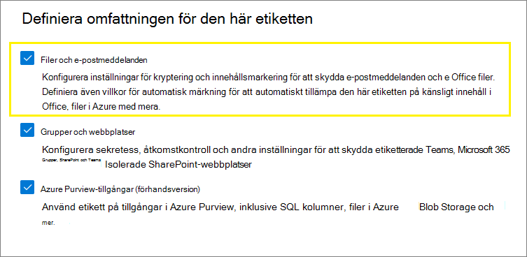

<span data-ttu-id="a998a-209">När du förflyttar dig genom guiden ser du sidan **Automatisk etikettering för filer och e-postmeddelanden** där du kan välja från en lista med typer av känslig information eller träningsbara klassificerare:</span><span class="sxs-lookup"><span data-stu-id="a998a-209">As you move through the wizard, you see the **Auto-labeling for files and emails** page where you can choose from a list of sensitive info types or trainable classifiers:</span></span>

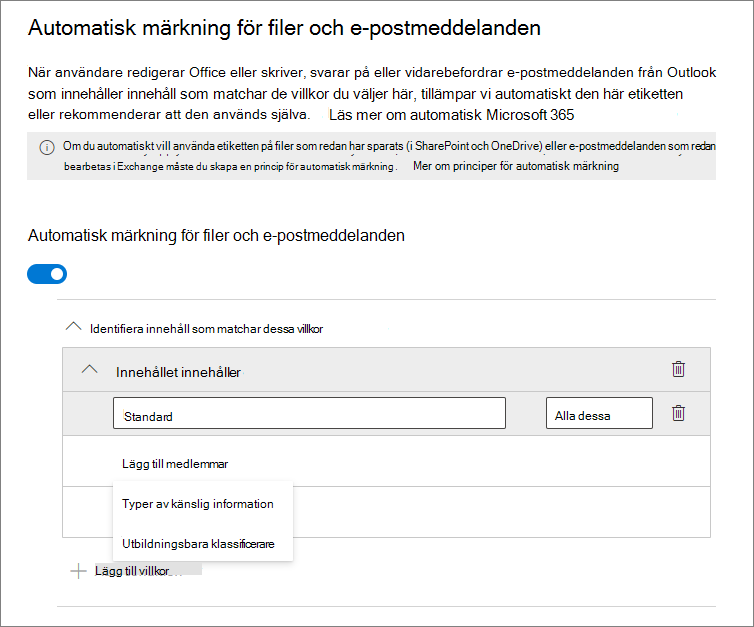

<span data-ttu-id="a998a-p116">När den här känslighetsetiketten tillämpats automatiskt ser användaren ett meddelande i Office-appen. Till exempel:</span><span class="sxs-lookup"><span data-stu-id="a998a-p116">When this sensitivity label is automatically applied, the user sees a notification in their Office app. For example:</span></span>

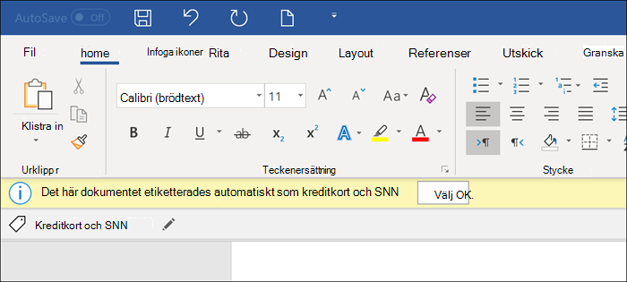

### <a name="configuring-sensitive-info-types-for-a-label"></a><span data-ttu-id="a998a-214">Konfigurera typer av känslig information för en etikett</span><span class="sxs-lookup"><span data-stu-id="a998a-214">Configuring sensitive info types for a label</span></span>

<span data-ttu-id="a998a-215">När du väljer alternativet **Typer av känslig information** visas samma lista över typer av känslig information som när du skapar en DLP-princip (dataförlustskydd).</span><span class="sxs-lookup"><span data-stu-id="a998a-215">When you select the **Sensitive info types** option, you see the same list of sensitive information types as when you create a data loss prevention (DLP) policy.</span></span> <span data-ttu-id="a998a-216">Du kan t.ex. automatiskt tillämpa en strikt konfidentiell etikett på allt innehåll som innehåller kundernas personliga uppgifter, som kreditkortsnummer, personnummer eller passnummer:</span><span class="sxs-lookup"><span data-stu-id="a998a-216">So you can, for example, automatically apply a Highly Confidential label to any content that contains customers' personal information, such as credit card numbers, social security numbers, or passport numbers:</span></span>

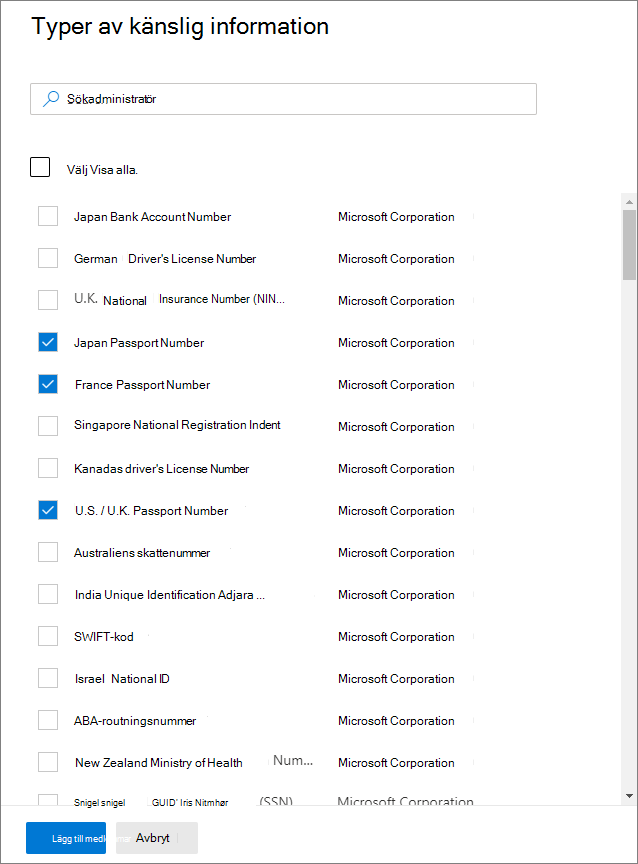

<span data-ttu-id="a998a-p118">På samma sätt som när du konfigurerar DLP-principer kan du sedan förfina villkoret genom att ändra antalet instanser och matcha noggrannheten. Till exempel:</span><span class="sxs-lookup"><span data-stu-id="a998a-p118">Similarly to when you configure DLP policies, you can then refine your condition by changing the instance count and match accuracy. For example:</span></span>

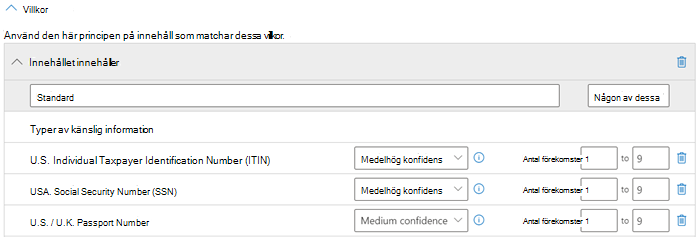

<span data-ttu-id="a998a-221">Mer information om de här konfigurationsalternativen från DLP-dokumentationen finns här: [Justera regler för att göra dem enklare eller svårare att matcha](data-loss-prevention-policies.md#tuning-rules-to-make-them-easier-or-harder-to-match).</span><span class="sxs-lookup"><span data-stu-id="a998a-221">You can learn more about these configuration options from the DLP documentation: [Tuning rules to make them easier or harder to match](data-loss-prevention-policies.md#tuning-rules-to-make-them-easier-or-harder-to-match).</span></span>

<span data-ttu-id="a998a-222">Precis som med DLP-principkonfigurationen kan du också välja om ett villkor ska identifiera alla typer av känslig information eller bara en av dem.</span><span class="sxs-lookup"><span data-stu-id="a998a-222">Also similarly to DLP policy configuration, you can choose whether a condition must detect all sensitive information types, or just one of them.</span></span> <span data-ttu-id="a998a-223">Om du vill göra villkoren mer flexibla eller komplexa kan du lägga till [grupper och använda logiska operatorer mellan grupperna](data-loss-prevention-policies.md#grouping-and-logical-operators).</span><span class="sxs-lookup"><span data-stu-id="a998a-223">And to make your conditions more flexible or complex, you can add [groups and use logical operators between the groups](data-loss-prevention-policies.md#grouping-and-logical-operators).</span></span>

> [!NOTE]
> <span data-ttu-id="a998a-224">Principer för automatisk etikettering baserat på anpassade typer av känslig information gäller endast för nyligen skapat eller ändrat innehåll i OneDrive och SharePoint.</span><span class="sxs-lookup"><span data-stu-id="a998a-224">Auto-labelling policies based on custom sensitive information types only apply to newly created or modified content in OneDrive and SharePoint.</span></span> 

### <a name="configuring-trainable-classifiers-for-a-label"></a><span data-ttu-id="a998a-225">Konfigurera träningsbara klassificerare för en etikett</span><span class="sxs-lookup"><span data-stu-id="a998a-225">Configuring trainable classifiers for a label</span></span>

<span data-ttu-id="a998a-226">Det här alternativet är en förhandsversion.</span><span class="sxs-lookup"><span data-stu-id="a998a-226">This option is currently in preview.</span></span> <span data-ttu-id="a998a-227">Om du använder det här alternativet ska du kontrollera att du har publicerat minst en annan känslighetsetikett som har konfigurerats för automatisk etikettering och alternativet [Typer av känslig information](#configuring-sensitive-info-types-for-a-label).</span><span class="sxs-lookup"><span data-stu-id="a998a-227">If you use this option, make sure you have published in your tenant at least one other sensitivity label that's configured for auto-labeling and the [sensitive info types option](#configuring-sensitive-info-types-for-a-label).</span></span>

<span data-ttu-id="a998a-228">När du väljer **träningsbara klassificerare** väljer du en eller flera av de inbyggda klassificerarna från Microsoft.</span><span class="sxs-lookup"><span data-stu-id="a998a-228">When you select the **Trainable classifiers** option, select one or more of the built-in trainable classifiers from Microsoft.</span></span> <span data-ttu-id="a998a-229">Om du har skapat egna anpassade träningsbara klassificerare går de också att välja:</span><span class="sxs-lookup"><span data-stu-id="a998a-229">If you've created your own custom trainable classifiers, these are also available to select:</span></span>

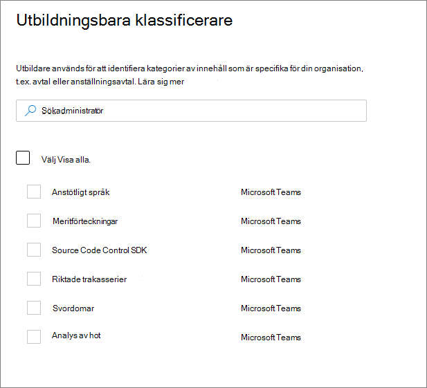

> [!CAUTION]
> <span data-ttu-id="a998a-231">Vi håller på att dra tillbaka den inbyggda klassificeraren för **stötande språk** eftersom den har gett ett stort antal falska positiva identifieringar.</span><span class="sxs-lookup"><span data-stu-id="a998a-231">We are deprecating the **Offensive Language** built-in classifier because it has been producing a high number of false positives.</span></span> <span data-ttu-id="a998a-232">Använd inte den här inbyggda klassificeraren, och om du använder den just nu bör du flytta bort affärsprocesserna från den.</span><span class="sxs-lookup"><span data-stu-id="a998a-232">Don't use this built-in classifier and if you are currently using it, you should move your business processes off it.</span></span> <span data-ttu-id="a998a-233">Vi rekommenderar att du använder de inbyggda klassificerarna för **riktade trakasserier**, **svordomar** och **hot** istället.</span><span class="sxs-lookup"><span data-stu-id="a998a-233">We recommend using the **Targeted Harassment**, **Profanity**, and **Threat** built-in classifiers instead.</span></span>

<span data-ttu-id="a998a-234">Mer information om dessa klassificerare finns i [Mer information om utbildningsbara klassificerare](classifier-learn-about.md).</span><span class="sxs-lookup"><span data-stu-id="a998a-234">For more information about these classifiers, see [Learn about trainable classifiers](classifier-learn-about.md).</span></span>

<span data-ttu-id="a998a-235">Under förhandsversionsperioden för det här alternativet har följande appar stöd för träningsbara klassificerare för känslighetsetiketter:</span><span class="sxs-lookup"><span data-stu-id="a998a-235">During the preview period for this option, the following apps support trainable classifiers for sensitivity labels:</span></span>

- <span data-ttu-id="a998a-236">Microsoft 365-appar för företag ([tidigare Office 365 ProPlus](/deployoffice/name-change)) för Windows lanseras nu för [Aktuell kanal](/deployoffice/overview-update-channels#current-channel-overview) i version 2006 och senare:</span><span class="sxs-lookup"><span data-stu-id="a998a-236">Microsoft 365 Apps for enterprise ([formerly Office 365 ProPlus](/deployoffice/name-change)) for Windows, now rolling out to the [Current Channel](/deployoffice/overview-update-channels#current-channel-overview) in version 2006 and later:</span></span>
    - <span data-ttu-id="a998a-237">Word</span><span class="sxs-lookup"><span data-stu-id="a998a-237">Word</span></span>
    - <span data-ttu-id="a998a-238">Excel</span><span class="sxs-lookup"><span data-stu-id="a998a-238">Excel</span></span>
    - <span data-ttu-id="a998a-239">PowerPoint</span><span class="sxs-lookup"><span data-stu-id="a998a-239">PowerPoint</span></span>

- <span data-ttu-id="a998a-240">Office på webben-appar, när du har [aktiverade känslighetsetiketter för Office-filer i SharePoint och OneDrive](sensitivity-labels-sharepoint-onedrive-files.md):</span><span class="sxs-lookup"><span data-stu-id="a998a-240">Office for the web apps, when you have [enabled sensitivity labels for Office files in SharePoint and OneDrive](sensitivity-labels-sharepoint-onedrive-files.md):</span></span>
    - <span data-ttu-id="a998a-241">Word</span><span class="sxs-lookup"><span data-stu-id="a998a-241">Word</span></span>
    - <span data-ttu-id="a998a-242">Excel</span><span class="sxs-lookup"><span data-stu-id="a998a-242">Excel</span></span>
    - <span data-ttu-id="a998a-243">PowerPoint</span><span class="sxs-lookup"><span data-stu-id="a998a-243">PowerPoint</span></span>
    - <span data-ttu-id="a998a-244">Outlook</span><span class="sxs-lookup"><span data-stu-id="a998a-244">Outlook</span></span>

### <a name="recommend-that-the-user-applies-a-sensitivity-label"></a><span data-ttu-id="a998a-245">Rekommendera att användaren tillämpar en känslighetsetikett</span><span class="sxs-lookup"><span data-stu-id="a998a-245">Recommend that the user applies a sensitivity label</span></span>

<span data-ttu-id="a998a-246">Om du föredrar det kan du rekommendera att användarna använder etiketten.</span><span class="sxs-lookup"><span data-stu-id="a998a-246">If you prefer, you can recommend to your users that they apply the label.</span></span> <span data-ttu-id="a998a-247">Med det här alternativet kan användarna godkänna klassificeringen och eventuellt associerat skydd, eller avvisa rekommendationen om etiketten inte är lämplig för innehållet.</span><span class="sxs-lookup"><span data-stu-id="a998a-247">With this option, your users can accept the classification and any associated protection, or dismiss the recommendation if the label isn't suitable for their content.</span></span>

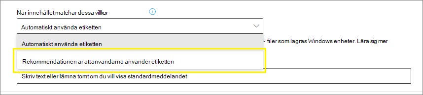

<span data-ttu-id="a998a-p124">Här är ett exempel på en uppmaning från Azure Information Protection-klienten för enhetliga etiketter när du konfigurerar ett villkor för att använda en etikett som en rekommenderad åtgärd, med ett anpassat principtips. Du kan välja den text som ska visas i principtipset.</span><span class="sxs-lookup"><span data-stu-id="a998a-p124">Here's an example of a prompt from the Azure Information Protection unified labeling client when you configure a condition to apply a label as a recommended action, with a custom policy tip. You can choose what text is displayed in the policy tip.</span></span>


### <a name="when-automatic-or-recommended-labels-are-applied"></a><span data-ttu-id="a998a-252">När automatiska och rekommenderade etiketter används</span><span class="sxs-lookup"><span data-stu-id="a998a-252">When automatic or recommended labels are applied</span></span>

<span data-ttu-id="a998a-p125">Implementeringen av automatisk och rekommenderad etikettering i Office-program beror på om du använder etiketter som är inbyggda i Office eller om Azure Information Protection har enhetlig etikettklient. Men i båda fallen:</span><span class="sxs-lookup"><span data-stu-id="a998a-p125">The implementation of automatic and recommended labeling in Office apps depend on whether you're using labeling that's built into Office, or the Azure Information Protection unified labeling client. In both cases, however:</span></span>

- <span data-ttu-id="a998a-255">Du kan inte använda automatisk etikettering för dokument och e-postmeddelanden som tidigare etiketterats manuellt eller tidigare etiketterats med en högre känslighet.</span><span class="sxs-lookup"><span data-stu-id="a998a-255">You can't use automatic labeling for documents and emails that were previously manually labeled, or previously automatically labeled with a higher sensitivity.</span></span> <span data-ttu-id="a998a-256">Kom ihåg att du bara kan använda en enstaka känslighetsetikett i ett dokument eller ett e-postmeddelande (förutom en enstaka kvarhållningsetikett).</span><span class="sxs-lookup"><span data-stu-id="a998a-256">Remember, you can only apply a single sensitivity label to a document or email (in addition to a single retention label).</span></span>

- <span data-ttu-id="a998a-257">Du kan inte använda rekommenderad etikettering för dokument eller e-postmeddelanden som tidigare var märkta med en högre känslighet.</span><span class="sxs-lookup"><span data-stu-id="a998a-257">You can't use recommended labeling for documents or emails that were previously labeled with a higher sensitivity.</span></span> <span data-ttu-id="a998a-258">När innehållet redan är märkt med en högre känslighet visas inte frågan med rekommendationen eller principtipset.</span><span class="sxs-lookup"><span data-stu-id="a998a-258">When the content's already labeled with a higher sensitivity, the user won't see the prompt with the recommendation and policy tip.</span></span>

<span data-ttu-id="a998a-259">Specifikt för inbyggd etikettering:</span><span class="sxs-lookup"><span data-stu-id="a998a-259">Specific to built-in labeling:</span></span>

- <span data-ttu-id="a998a-260">Alla Office-program har inte stöd för automatisk (och rekommenderad) etikettering.</span><span class="sxs-lookup"><span data-stu-id="a998a-260">Not all Office apps support automatic (and recommended) labeling.</span></span> <span data-ttu-id="a998a-261">Mer information finns i [Stöd för funktioner för känslighetsetiketter i program](sensitivity-labels-office-apps.md#support-for-sensitivity-label-capabilities-in-apps).</span><span class="sxs-lookup"><span data-stu-id="a998a-261">For more information, see [Support for sensitivity label capabilities in apps](sensitivity-labels-office-apps.md#support-for-sensitivity-label-capabilities-in-apps).</span></span>

- <span data-ttu-id="a998a-262">För rekommenderade etiketter i skrivbordsversionerna av Word flaggas det känsliga innehåll som utlöste rekommendationen så att användare kan granska och ta bort det känsliga innehållet i stället för att använda den rekommenderade känslighetsetiketten.</span><span class="sxs-lookup"><span data-stu-id="a998a-262">For recommended labels in the desktop versions of Word, the sensitive content that triggered the recommendation is flagged so that users can review and remove the sensitive content instead of applying the recommended sensitivity label.</span></span>

- <span data-ttu-id="a998a-263">Mer information om hur de här etiketterna används i Office-appar, exempel på skärmbilder och hur känslig information identifieras finns i [Tillämpa känslighetsetiketter automatiskt eller rekommendera känslighetsetiketter för filer och e-postmeddelanden i Office](https://support.office.com/sv-SE/article/automatically-apply-or-recommend-sensitivity-labels-to-your-files-and-emails-in-office-622e0d9c-f38c-470a-bcdb-9e90b24d71a1).</span><span class="sxs-lookup"><span data-stu-id="a998a-263">For details about how these labels are applied in Office apps, example screenshots, and how sensitive information is detected, see [Automatically apply or recommend sensitivity labels to your files and emails in Office](https://support.office.com/sv-SE/article/automatically-apply-or-recommend-sensitivity-labels-to-your-files-and-emails-in-office-622e0d9c-f38c-470a-bcdb-9e90b24d71a1).</span></span>

<span data-ttu-id="a998a-264">Specifikt för Azure Information Protection-klienten för enhetliga etiketter:</span><span class="sxs-lookup"><span data-stu-id="a998a-264">Specific to the Azure Information Protection unified labeling client:</span></span>

-  <span data-ttu-id="a998a-265">Automatisk och rekommenderad etikett gäller för Word, Excel och PowerPoint när du sparar ett dokument och i Outlook när du skickar ett e-postmeddelande.</span><span class="sxs-lookup"><span data-stu-id="a998a-265">Automatic and recommended labeling applies to Word, Excel, and PowerPoint when you save a document, and to Outlook when you send an email.</span></span>

- <span data-ttu-id="a998a-266">Om Outlook ska ha stöd för rekommenderad etikettering måste du först konfigurera [avancerade principinställningar](/azure/information-protection/rms-client/clientv2-admin-guide-customizations#enable-recommended-classification-in-outlook).</span><span class="sxs-lookup"><span data-stu-id="a998a-266">For Outlook to support recommended labeling, you must first configure an [advanced policy setting](/azure/information-protection/rms-client/clientv2-admin-guide-customizations#enable-recommended-classification-in-outlook).</span></span>

- <span data-ttu-id="a998a-267">Känslig information kan identifieras i brödtexten i dokument och e-postmeddelanden, sidhuvuden och sidfötter, men inte i ämnesraden eller i e-postbilagor.</span><span class="sxs-lookup"><span data-stu-id="a998a-267">Sensitive information can be detected in the body text in documents and emails, and to headers and footers—but not in the subject line or attachments of email.</span></span>

## <a name="how-to-configure-auto-labeling-policies-for-sharepoint-onedrive-and-exchange"></a><span data-ttu-id="a998a-268">Så här konfigurerar du principer för automatisk etikettering för SharePoint, OneDrive och Exchange</span><span class="sxs-lookup"><span data-stu-id="a998a-268">How to configure auto-labeling policies for SharePoint, OneDrive, and Exchange</span></span>

<span data-ttu-id="a998a-269">Kontrollera att du är medveten om kraven innan du konfigurerar principer för automatisk etikettering.</span><span class="sxs-lookup"><span data-stu-id="a998a-269">Make sure you're aware of the prerequisites before you configure auto-labeling policies.</span></span> 

### <a name="prerequisites-for-auto-labeling-policies"></a><span data-ttu-id="a998a-270">Krav för principer för automatisk etikettering</span><span class="sxs-lookup"><span data-stu-id="a998a-270">Prerequisites for auto-labeling policies</span></span>

- <span data-ttu-id="a998a-271">Simuleringsläge:</span><span class="sxs-lookup"><span data-stu-id="a998a-271">Simulation mode:</span></span>
    - <span data-ttu-id="a998a-272">Granskning för Microsoft 365 måste aktiveras.</span><span class="sxs-lookup"><span data-stu-id="a998a-272">Auditing for Microsoft 365 must be turned on.</span></span> <span data-ttu-id="a998a-273">Om du behöver aktivera granskning eller inte vet om granskning redan är på går du till [Aktivera eller inaktivera granskningsloggsökning](turn-audit-log-search-on-or-off.md).</span><span class="sxs-lookup"><span data-stu-id="a998a-273">If you need to turn on auditing or you're not sure whether auditing is already on, see [Turn audit log search on or off](turn-audit-log-search-on-or-off.md).</span></span>
    - <span data-ttu-id="a998a-274">Om du vill visa fil- eller e-postinnehåll i källvyn måste du ha rollen **innehållshanterare för innehållsutforskaren**.</span><span class="sxs-lookup"><span data-stu-id="a998a-274">To view file or email contents in the source view, you must have the **Content Explorer Content Viewer** role.</span></span> <span data-ttu-id="a998a-275">Globala administratörer har inte den här rollen som standard.</span><span class="sxs-lookup"><span data-stu-id="a998a-275">Global admins don't have this role by default.</span></span> <span data-ttu-id="a998a-276">Om du inte har den här behörigheten visas inte förhandsgranskningsfönstret när du väljer ett objekt på fliken **Matchade objekt**.</span><span class="sxs-lookup"><span data-stu-id="a998a-276">If you don't have this permission, you don't see the preview pane when you select an item from the **Matched Items** tab.</span></span>

- <span data-ttu-id="a998a-277">Så här etiketterar du filer automatiskt i SharePoint och OneDrive:</span><span class="sxs-lookup"><span data-stu-id="a998a-277">To auto-label files in SharePoint and OneDrive:</span></span>
    - <span data-ttu-id="a998a-278">Du har [aktiverade känslighetsetiketter för Office-filer i SharePoint och OneDrive](sensitivity-labels-sharepoint-onedrive-files.md).</span><span class="sxs-lookup"><span data-stu-id="a998a-278">You have [enabled sensitivity labels for Office files in SharePoint and OneDrive](sensitivity-labels-sharepoint-onedrive-files.md).</span></span>
    - <span data-ttu-id="a998a-279">När principen för automatisk etikettering körs får filen inte vara öppen av en annan process eller användare.</span><span class="sxs-lookup"><span data-stu-id="a998a-279">At the time the auto-labeling policy runs, the file mustn't be open by another process or user.</span></span> <span data-ttu-id="a998a-280">En fil som är utcheckad för redigering tillhör den här kategorin.</span><span class="sxs-lookup"><span data-stu-id="a998a-280">A file that's checked out for editing falls into this category.</span></span>

- <span data-ttu-id="a998a-281">Om du planerar att använda [anpassade typer av känslig information](sensitive-information-type-learn-about.md) i stället för de inbyggda känslighetstyperna:</span><span class="sxs-lookup"><span data-stu-id="a998a-281">If you plan to use [custom sensitive information types](sensitive-information-type-learn-about.md) rather than the built-in sensitivity types:</span></span> 
    - <span data-ttu-id="a998a-282">Anpassade typer av känslighetsinformation gäller endast för innehåll som läggs till eller ändras i SharePoint eller OneDrive när de anpassade typer av känslighetsinformation har tillämpats.</span><span class="sxs-lookup"><span data-stu-id="a998a-282">Custom sensitivity information types apply only to content that is added or modified in SharePoint or OneDrive after the custom sensitivity information types are enforced.</span></span> 
    - <span data-ttu-id="a998a-283">Om du vill testa nya anpassade typer av känslig information skapar du dem innan du skapar din automatiska etikettprincip och skapar sedan nya dokument med exempeldata för testning.</span><span class="sxs-lookup"><span data-stu-id="a998a-283">To test new custom sensitive information types, create them before you create your auto-labeling policy, and then create new documents with sample data for testing.</span></span>

- <span data-ttu-id="a998a-284">En eller flera känslighetsetiketter [skapas och publiceras](create-sensitivity-labels.md) (till minst en användare) som du kan välja för principer för automatisk etikettering.</span><span class="sxs-lookup"><span data-stu-id="a998a-284">One or more sensitivity labels [created and published](create-sensitivity-labels.md) (to at least one user) that you can select for your auto-labeling policies.</span></span> <span data-ttu-id="a998a-285">För dessa etiketter:</span><span class="sxs-lookup"><span data-stu-id="a998a-285">For these labels:</span></span>
    - <span data-ttu-id="a998a-286">Det spelar ingen roll om inställningen för automatisk etikettering i Office-appar är aktiverad eller inaktiverad, eftersom den inställningen ger tillägg till principer för automatisk etikettering, som det förklaras i introduktionen.</span><span class="sxs-lookup"><span data-stu-id="a998a-286">It doesn't matter if the auto-labeling in Office apps label setting is turned on or off, because that label setting supplements auto-labeling policies, as explained in the introduction.</span></span>
    - <span data-ttu-id="a998a-287">Observera att de etiketter som du vill använda för automatisk etikettering är konfigurerade att använda visuella markeringar (sidhuvuden, sidfötter och vattenstämplar) som inte tillämpas på dokument.</span><span class="sxs-lookup"><span data-stu-id="a998a-287">If the labels you want to use for auto-labeling are configured to use visual markings (headers, footers, watermarks), note that these are not applied to documents.</span></span>
    - <span data-ttu-id="a998a-288">Om etiketterna använder [kryptering](encryption-sensitivity-labels.md):</span><span class="sxs-lookup"><span data-stu-id="a998a-288">If the labels apply [encryption](encryption-sensitivity-labels.md):</span></span>
        - <span data-ttu-id="a998a-289">När principen för automatisk etikettering innehåller platser för SharePoint eller OneDrive måste etiketten vara konfigurerad för inställningen **Tilldela behörigheter nu**.</span><span class="sxs-lookup"><span data-stu-id="a998a-289">When the auto-labeling policy includes locations for SharePoint or OneDrive, the label must be configured for the **Assign permissions now** setting.</span></span>
        - <span data-ttu-id="a998a-290">När principen för automatisk etikettering endast är för Exchange kan etiketten konfigureras för antingen **Tilldela behörigheter nu** eller **Låt användare tilldela behörigheter** (för alternativen Vidarebefordra inte eller Endast kryptering).</span><span class="sxs-lookup"><span data-stu-id="a998a-290">When the auto-labeling policy is just for Exchange, the label can be configured for either **Assign permissions now** or **Let users assign permissions** (for the Do Not Forward or Encrypt-Only options).</span></span>

### <a name="learn-about-simulation-mode"></a><span data-ttu-id="a998a-291">Mer information om simuleringsläget</span><span class="sxs-lookup"><span data-stu-id="a998a-291">Learn about simulation mode</span></span>

<span data-ttu-id="a998a-292">Simuleringsläge är unikt för automatisk etikettering av principer och ingår i dess arbetsflöde.</span><span class="sxs-lookup"><span data-stu-id="a998a-292">Simulation mode is unique to auto-labeling policies and woven into the workflow.</span></span> <span data-ttu-id="a998a-293">Du kan inte automatiskt märka dokument och e-postmeddelanden förrän principen har kört minst en simulering.</span><span class="sxs-lookup"><span data-stu-id="a998a-293">You can't automatically label documents and emails until your policy has run at least one simulation.</span></span>

<span data-ttu-id="a998a-294">Arbetsflöde för en princip för automatisk etikettering:</span><span class="sxs-lookup"><span data-stu-id="a998a-294">Workflow for an auto-labeling policy:</span></span>

1. <span data-ttu-id="a998a-295">Skapa och konfigurera en princip för automatisk etikettering.</span><span class="sxs-lookup"><span data-stu-id="a998a-295">Create and configure an auto-labeling policy.</span></span>

2. <span data-ttu-id="a998a-296">Kör principen i simuleringsläge, vilket kan ta 48 timmar att slutföra.</span><span class="sxs-lookup"><span data-stu-id="a998a-296">Run the policy in simulation mode, which can take 48 hours to complete.</span></span>

3. <span data-ttu-id="a998a-297">Granska resultaten och förfina principen om det behövs.</span><span class="sxs-lookup"><span data-stu-id="a998a-297">Review the results, and if necessary, refine your policy.</span></span> <span data-ttu-id="a998a-298">Kör om simuleringsläget och vänta tills det är klart igen.</span><span class="sxs-lookup"><span data-stu-id="a998a-298">Rerun simulation mode and wait for it to complete again.</span></span>

4. <span data-ttu-id="a998a-299">Upprepa steg 3 efter behov.</span><span class="sxs-lookup"><span data-stu-id="a998a-299">Repeat step 3 as needed.</span></span>

5. <span data-ttu-id="a998a-300">Distribuera i produktion.</span><span class="sxs-lookup"><span data-stu-id="a998a-300">Deploy in production.</span></span>

<span data-ttu-id="a998a-301">Den simulerade distributionen körs som parametern WhatIf för PowerShell.</span><span class="sxs-lookup"><span data-stu-id="a998a-301">The simulated deployment runs like the WhatIf parameter for PowerShell.</span></span> <span data-ttu-id="a998a-302">Du ser de resultat som rapporterats som om principen för automatisk etikettering hade använt din valda etikett med hjälp av de regler som du definierat.</span><span class="sxs-lookup"><span data-stu-id="a998a-302">You see results reported as if the auto-labeling policy had applied your selected label, using the rules that you defined.</span></span> <span data-ttu-id="a998a-303">Du kan sedan förfina reglerna och köra simuleringen igen om det behövs.</span><span class="sxs-lookup"><span data-stu-id="a998a-303">You can then refine your rules for accuracy if needed, and rerun the simulation.</span></span> <span data-ttu-id="a998a-304">Men eftersom automatisk etikettering för Exchange gäller för e-postmeddelanden som skickas och tas emot, i stället för e-postmeddelanden som lagras i postlådor, förväntar du dig inte att resultatet för e-post i en simulering ska vara konsekvent, såvida du inte kan skicka och ta emot exakt samma e-postmeddelanden.</span><span class="sxs-lookup"><span data-stu-id="a998a-304">However, because auto-labeling for Exchange applies to emails that are sent and received, rather than emails stored in mailboxes, don't expect results for email in a simulation to be consistent unless you're able to send and receive the exact same email messages.</span></span>

<span data-ttu-id="a998a-305">Med simuleringsläget kan du gradvis utöka omfattningen för principen för automatisk etikettering före distributionen.</span><span class="sxs-lookup"><span data-stu-id="a998a-305">Simulation mode also lets you gradually increase the scope of your auto-labeling policy before deployment.</span></span> <span data-ttu-id="a998a-306">Du kan till exempel börja med en enda plats, till exempel en SharePoint-webbplats, med ett enda dokumentbibliotek.</span><span class="sxs-lookup"><span data-stu-id="a998a-306">For example, you might start with a single location, such as a SharePoint site, with a single document library.</span></span> <span data-ttu-id="a998a-307">Sedan kan du, med iterativa ändringar, öka omfattningen till flera webbplatser och sedan till en annan plats, till exempel OneDrive.</span><span class="sxs-lookup"><span data-stu-id="a998a-307">Then, with iterative changes, increase the scope to multiple sites, and then to another location, such as OneDrive.</span></span>

<span data-ttu-id="a998a-308">Slutligen kan du använda simuleringsläge för att få en ungefärlig bild av hur lång tid som behövs för att köra principen för automatisk etikettering, så att du kan planera och schemalägga när den ska köras utan simuleringsläge.</span><span class="sxs-lookup"><span data-stu-id="a998a-308">Finally, you can use simulation mode to provide an approximation of the time needed to run your auto-labeling policy, to help you plan and schedule when to run it without simulation mode.</span></span>

### <a name="creating-an-auto-labeling-policy"></a><span data-ttu-id="a998a-309">Skapa en princip för automatisk etikettering</span><span class="sxs-lookup"><span data-stu-id="a998a-309">Creating an auto-labeling policy</span></span>

1. <span data-ttu-id="a998a-310">I [Microsoft 365 Efterlevnadscenter](https://compliance.microsoft.com/) går du till känslighetsetiketter:</span><span class="sxs-lookup"><span data-stu-id="a998a-310">In the [Microsoft 365 compliance center](https://compliance.microsoft.com/), navigate to sensitivity labels:</span></span>
    
    - <span data-ttu-id="a998a-311">**Lösningar** > **Informationsskydd**</span><span class="sxs-lookup"><span data-stu-id="a998a-311">**Solutions** > **Information protection**</span></span>
    
    <span data-ttu-id="a998a-312">Om du inte ser det här alternativet direkt väljer du först **Visa alla**.</span><span class="sxs-lookup"><span data-stu-id="a998a-312">If you don't immediately see this option, first select **Show all**.</span></span>

2. <span data-ttu-id="a998a-313">Välj fliken **Automatisk etikettering**:</span><span class="sxs-lookup"><span data-stu-id="a998a-313">Select the **Auto-labeling** tab:</span></span>
    
    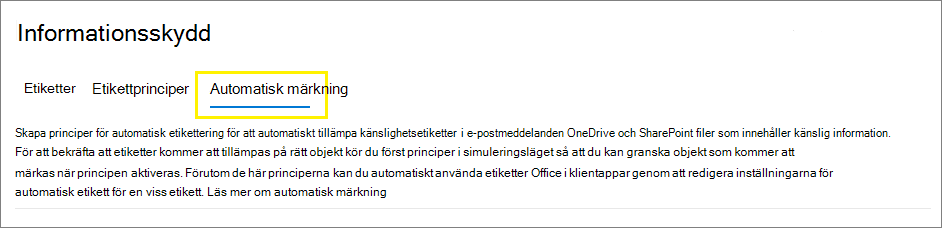
    
    > [!NOTE]
    > <span data-ttu-id="a998a-315">Om fliken **Automatisk etikettering** inte visas är den här funktionen inte tillgänglig i din region.</span><span class="sxs-lookup"><span data-stu-id="a998a-315">If you don't see the **Auto-labeling** tab, this functionality isn't currently available in your region.</span></span>

3. <span data-ttu-id="a998a-316">Välj **+Skapa princip för automatisk etikettering**.</span><span class="sxs-lookup"><span data-stu-id="a998a-316">Select **+ Create auto-labeling policy**.</span></span> <span data-ttu-id="a998a-317">Guiden för ny princip startas:</span><span class="sxs-lookup"><span data-stu-id="a998a-317">This starts the New policy wizard:</span></span>
    
    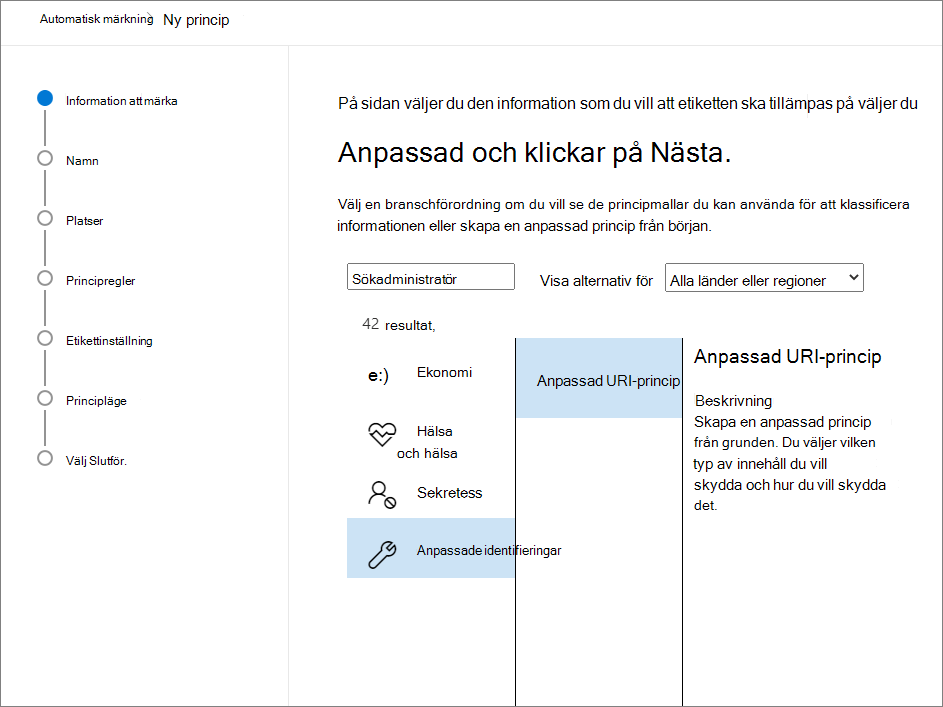

4. <span data-ttu-id="a998a-319">På sidan **Välj information som du vill att etiketten ska tillämpas på**: Välj en av mallarna, till exempel **Ekonomi** eller **Sekretess**.</span><span class="sxs-lookup"><span data-stu-id="a998a-319">For the page **Choose info you want this label applied to**: Select one of the templates, such as **Financial** or **Privacy**.</span></span> <span data-ttu-id="a998a-320">Du kan förfina sökningen med hjälp av listrutan **Visa alternativ för**.</span><span class="sxs-lookup"><span data-stu-id="a998a-320">You can refine your search by using the **Show options for** dropdown.</span></span> <span data-ttu-id="a998a-321">Eller välj **Anpassad princip** om mallarna inte uppfyller dina krav.</span><span class="sxs-lookup"><span data-stu-id="a998a-321">Or, select **Custom policy** if the templates don't meet your requirements.</span></span> <span data-ttu-id="a998a-322">Välj **Nästa**.</span><span class="sxs-lookup"><span data-stu-id="a998a-322">Select **Next**.</span></span>

5. <span data-ttu-id="a998a-323">På sidan **Namnge principen för automatiska etiketter**: Ange ett unikt namn och alternativt en beskrivning för att identifiera automatiskt tillämpade etiketter, platser och villkor som identifierar innehållet på etiketten.</span><span class="sxs-lookup"><span data-stu-id="a998a-323">For the page **Name your auto-labeling policy**: Provide a unique name, and optionally a description to help identify the automatically applied label, locations, and conditions that identify the content to label.</span></span>

6. <span data-ttu-id="a998a-324">På sidan **Välj platser där du vill tillämpa etiketten**: Välj och ange platser för Exchange, SharePoint-webbplatser och OneDrive.</span><span class="sxs-lookup"><span data-stu-id="a998a-324">For the page **Choose locations where you want to apply the label**: Select and specify locations for Exchange, SharePoint sites, and OneDrive.</span></span> <span data-ttu-id="a998a-325">Välj sedan **Nästa**.</span><span class="sxs-lookup"><span data-stu-id="a998a-325">Then select **Next**.</span></span>
    
    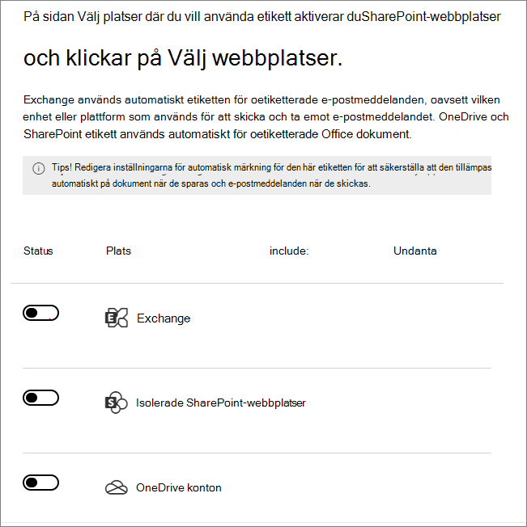
    
    <span data-ttu-id="a998a-327">Du måste ange enskilda SharePoint-webbplatser och OneDrive-konton.</span><span class="sxs-lookup"><span data-stu-id="a998a-327">You must specify individual SharePoint sites and OneDrive accounts.</span></span> <span data-ttu-id="a998a-328">För OneDrive har URL-adressen för en användares OneDrive-konto följande format: `https://<tenant name>-my.sharepoint.com/personal/<user_name>_<tenant name>_com`</span><span class="sxs-lookup"><span data-stu-id="a998a-328">For OneDrive, the URL for a user's OneDrive account is in the following format: `https://<tenant name>-my.sharepoint.com/personal/<user_name>_<tenant name>_com`</span></span>
    
    <span data-ttu-id="a998a-329">Exempelvis för en användare i Contoso-klientorganisationen som har användarnamnet ”rsimone”: `https://contoso-my.sharepoint.com/personal/rsimone_contoso_onmicrosoft_com`</span><span class="sxs-lookup"><span data-stu-id="a998a-329">For example, for a user in the contoso tenant that has a user name of "rsimone": `https://contoso-my.sharepoint.com/personal/rsimone_contoso_onmicrosoft_com`</span></span>
    
    <span data-ttu-id="a998a-330">Information om hur du verifierar klientorganisationens syntax och identifierar URL-adresser för användare finns i [Get a list of all user OneDrive URLs in your organization](/onedrive/list-onedrive-urls) (Få en lista över alla OneDrive-URL:er för användare i organisationen).</span><span class="sxs-lookup"><span data-stu-id="a998a-330">To verify the syntax for your tenant and identify URLs for users, see [Get a list of all user OneDrive URLs in your organization](/onedrive/list-onedrive-urls).</span></span>

7. <span data-ttu-id="a998a-331">På sidan **Konfigurera gemensamma eller avancerade regler**: Behåll standardinställningen **Gemensamma regler** för att definiera regler som identifierar innehåll som ska märkas på alla valda platser.</span><span class="sxs-lookup"><span data-stu-id="a998a-331">For the **Set up common or advanced rules** page: Keep the default of **Common rules** to define rules that identify content to label across all your selected locations.</span></span> <span data-ttu-id="a998a-332">Om du behöver olika regler per plats väljer du **Avancerade regler**.</span><span class="sxs-lookup"><span data-stu-id="a998a-332">If you need different rules per location, select **Advanced rules**.</span></span> <span data-ttu-id="a998a-333">Välj sedan **Nästa**.</span><span class="sxs-lookup"><span data-stu-id="a998a-333">Then select **Next**.</span></span>
    
    <span data-ttu-id="a998a-334">Reglerna använder villkor som innehåller typer av känslig information och delningsalternativ:</span><span class="sxs-lookup"><span data-stu-id="a998a-334">The rules use conditions that include sensitive information types and sharing options:</span></span>
    - <span data-ttu-id="a998a-335">För känslig information kan du välja både inbyggda och anpassade typer av känslig information.</span><span class="sxs-lookup"><span data-stu-id="a998a-335">For sensitive information types, you can select both built-in and custom sensitive information types.</span></span>
    - <span data-ttu-id="a998a-336">För de delade alternativen kan du välja **bara med personer inom organisationen** eller **med personer utanför organisationen**.</span><span class="sxs-lookup"><span data-stu-id="a998a-336">For the shared options, you can choose **only with people inside my organization** or **with people outside my organization**.</span></span>
    
    <span data-ttu-id="a998a-337">Om den enda platsen **är Exchange**, eller om du väljer **Avancerade regler**, finns det ytterligare villkor som du kan välja:</span><span class="sxs-lookup"><span data-stu-id="a998a-337">If your only location is **Exchange**, or if you select **Advanced rules**, there are additional conditions that you can select:</span></span>
    - <span data-ttu-id="a998a-338">Avsändarens IP-adress är</span><span class="sxs-lookup"><span data-stu-id="a998a-338">Sender IP address is</span></span>
    - <span data-ttu-id="a998a-339">Mottagardomän är</span><span class="sxs-lookup"><span data-stu-id="a998a-339">Recipient domain is</span></span>
    - <span data-ttu-id="a998a-340">Mottagaren är</span><span class="sxs-lookup"><span data-stu-id="a998a-340">Recipient is</span></span>
    - <span data-ttu-id="a998a-341">Den bifogade filens filtillägg är</span><span class="sxs-lookup"><span data-stu-id="a998a-341">Attachment's file extension is</span></span>
    - <span data-ttu-id="a998a-342">Bifogad fil är lösenordsskyddad</span><span class="sxs-lookup"><span data-stu-id="a998a-342">Attachment is password protected</span></span>
    - <span data-ttu-id="a998a-343">Det gick inte att skanna innehållet i en e-postbilaga</span><span class="sxs-lookup"><span data-stu-id="a998a-343">Any email attachment's content could not be scanned</span></span>
    - <span data-ttu-id="a998a-344">Genomsökningen slutfördes inte för innehåll i e-postbilaga</span><span class="sxs-lookup"><span data-stu-id="a998a-344">Any email attachment's content didn't complete scanning</span></span>
    - <span data-ttu-id="a998a-345">Rubriken matchar mönster</span><span class="sxs-lookup"><span data-stu-id="a998a-345">Header matches patterns</span></span>
    - <span data-ttu-id="a998a-346">Ämnet matchar mönster</span><span class="sxs-lookup"><span data-stu-id="a998a-346">Subject matches patterns</span></span>
    - <span data-ttu-id="a998a-347">Mottagarens adress innehåller ord</span><span class="sxs-lookup"><span data-stu-id="a998a-347">Recipient address contains words</span></span>
    - <span data-ttu-id="a998a-348">Mottagarens adress matchar mönster</span><span class="sxs-lookup"><span data-stu-id="a998a-348">Recipient address matches patterns</span></span>
    - <span data-ttu-id="a998a-349">Avsändarens adress matchar mönster</span><span class="sxs-lookup"><span data-stu-id="a998a-349">Sender address matches patterns</span></span>
    - <span data-ttu-id="a998a-350">Avsändardomänen är</span><span class="sxs-lookup"><span data-stu-id="a998a-350">Sender domain is</span></span>
    - <span data-ttu-id="a998a-351">Mottagaren är medlem i</span><span class="sxs-lookup"><span data-stu-id="a998a-351">Recipient is a member of</span></span>
    - <span data-ttu-id="a998a-352">Avsändaren är</span><span class="sxs-lookup"><span data-stu-id="a998a-352">Sender is</span></span>
    
    <span data-ttu-id="a998a-353">För vart och ett av dessa villkor kan du sedan ange undantag.</span><span class="sxs-lookup"><span data-stu-id="a998a-353">For each of these conditions, you can then specify exceptions.</span></span>
    
8. <span data-ttu-id="a998a-354">Beroende på dina tidigare val har du nu möjlighet att skapa nya regler med hjälp av villkor och undantag.</span><span class="sxs-lookup"><span data-stu-id="a998a-354">Depending on your previous choices, you'll now have an opportunity to create new rules by using conditions and exceptions.</span></span>
    
    <span data-ttu-id="a998a-355">Konfigurationsalternativen för typer av känslig information är desamma som de du väljer för automatisk etikettering för Office-appar.</span><span class="sxs-lookup"><span data-stu-id="a998a-355">The configuration options for sensitive information types are the same as those you select for auto-labeling for Office apps.</span></span> <span data-ttu-id="a998a-356">Om du behöver mer information går du till [Konfigurera typer av känslig information för en etikett](#configuring-sensitive-info-types-for-a-label).</span><span class="sxs-lookup"><span data-stu-id="a998a-356">If you need more information, see [Configuring sensitive info types for a label](#configuring-sensitive-info-types-for-a-label).</span></span>
    
    <span data-ttu-id="a998a-357">När du har definierat alla regler du behöver och bekräftat att deras status är på väljer du **Nästa** för att gå vidare och välja en etikett som ska tillämpas automatiskt.</span><span class="sxs-lookup"><span data-stu-id="a998a-357">When you have defined all the rules you need, and confirmed their status is on, select **Next** to move on to choosing a label to auto-apply.</span></span>

11. <span data-ttu-id="a998a-358">På sidan **Välj en etikett som ska tillämpas automatiskt**: Välj **+ Välj en etikett**, välj en etikett i fönstret **Välj en känslighetsetikett** och välj sedan **Nästa**.</span><span class="sxs-lookup"><span data-stu-id="a998a-358">For the **Choose a label to auto-apply** page: Select **+ Choose a label**, select a label from the **Choose a sensitivity label** pane, and then select **Next**.</span></span>

12. <span data-ttu-id="a998a-359">På sidan **Bestäm om du vill testa principen nu eller senare**: Välj **Kör principen i simuleringsläge** om du är redo att köra principen för automatisk etikettering i simuleringsläge nu.</span><span class="sxs-lookup"><span data-stu-id="a998a-359">For the **Decide if you want to test out the policy now or later** page: Select **Run policy in simulation mode** if you're ready to run the auto-labeling policy now, in simulation mode.</span></span> <span data-ttu-id="a998a-360">Annars väljer du **Låt principen förbli inaktiverad**.</span><span class="sxs-lookup"><span data-stu-id="a998a-360">Otherwise, select **Leave policy turned off**.</span></span> <span data-ttu-id="a998a-361">Välj **Nästa**:</span><span class="sxs-lookup"><span data-stu-id="a998a-361">Select **Next**:</span></span> 
    
    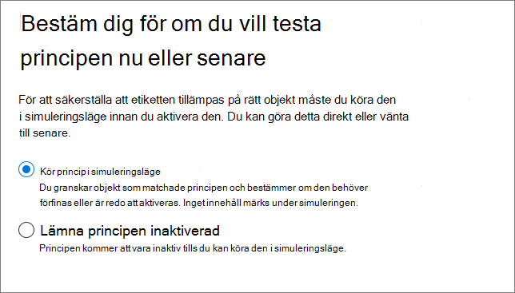

13. <span data-ttu-id="a998a-363">På sidan **Sammanfattning**: Kontrollera konfigurationen av principen för automatisk etikettering, gör de ändringar som behövs och slutför guiden.</span><span class="sxs-lookup"><span data-stu-id="a998a-363">For the **Summary** page: Review the configuration of your auto-labeling policy and make any changes that needed, and complete the wizard.</span></span>

<span data-ttu-id="a998a-364">På sidan **Informationsskydd** > **Automatisk etikettering** ser du din princip för automatisk etikettering i avsnittet **Simulering** eller **Av**, beroende på om du valde att köra den i simuleringsläge eller inte.</span><span class="sxs-lookup"><span data-stu-id="a998a-364">Now on the **Information protection** > **Auto-labeling** page, you see your auto-labeling policy in the **Simulation** or **Off** section, depending on whether you chose to run it in simulation mode or not.</span></span> <span data-ttu-id="a998a-365">Välj principen om du vill visa information om konfiguration och status (till exempel **Principsimulering körs fortfarande**).</span><span class="sxs-lookup"><span data-stu-id="a998a-365">Select your policy to see the details of the configuration and status (for example, **Policy simulation is still running**).</span></span> <span data-ttu-id="a998a-366">För principer i simuleringsläge väljer du fliken **Matchade objekt** för att se vilka e-postmeddelanden eller dokument som matchade reglerna du angav.</span><span class="sxs-lookup"><span data-stu-id="a998a-366">For policies in simulation mode, select the **Matched items** tab to see which emails or documents matched the rules that you specified.</span></span>

<span data-ttu-id="a998a-367">Du kan ändra din princip direkt i det här gränssnittet:</span><span class="sxs-lookup"><span data-stu-id="a998a-367">You can modify your policy directly from this interface:</span></span>

- <span data-ttu-id="a998a-368">För en princip i avsnittet **Av** väljer du knappen **Redigera princip**.</span><span class="sxs-lookup"><span data-stu-id="a998a-368">For a policy in the **Off** section, select the **Edit policy** button.</span></span>

- <span data-ttu-id="a998a-369">För princip i avsnittet **Simulering** väljer du alternativet **Redigera princip** högst upp på sidan på någon av flikarna:</span><span class="sxs-lookup"><span data-stu-id="a998a-369">For policy in the **Simulation** section, select the **Edit policy** option at the top of the page, from either tab:</span></span>
    
    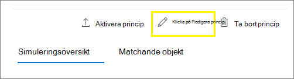
    
    <span data-ttu-id="a998a-371">När du är redo att köra principen utan simulering väljer du alternativet **Aktivera principen**.</span><span class="sxs-lookup"><span data-stu-id="a998a-371">When you're ready to run the policy without simulation, select the **Turn on policy** option.</span></span>

<span data-ttu-id="a998a-372">Dina automatiska principer körs kontinuerligt tills de tas bort.</span><span class="sxs-lookup"><span data-stu-id="a998a-372">Your auto-policies run continuously until they are deleted.</span></span> <span data-ttu-id="a998a-373">Nya och ändrade dokument inkluderas exempelvis i de aktuella principinställningarna.</span><span class="sxs-lookup"><span data-stu-id="a998a-373">For example, new and modified documents will be included with the current policy settings.</span></span>

<span data-ttu-id="a998a-374">Du kan också se resultatet av principen för automatisk etikettering genom att använda [Innehållsutforskaren](data-classification-content-explorer.md) när du har rätt [behörigheter](data-classification-content-explorer.md#permissions):</span><span class="sxs-lookup"><span data-stu-id="a998a-374">You can also see the results of your auto-labeling policy by using [content explorer](data-classification-content-explorer.md) when you have the appropriate [permissions](data-classification-content-explorer.md#permissions):</span></span>
- <span data-ttu-id="a998a-375">Med **Listvy för innehållsutforskare** kan du se en fils etikett men inte filens innehåll.</span><span class="sxs-lookup"><span data-stu-id="a998a-375">**Content Explorer List Viewer** lets you see a file's label but not the file's contents.</span></span>
- <span data-ttu-id="a998a-376">Med **Innehållshanterare för innehållsutforskaren** kan du se innehållet i filen.</span><span class="sxs-lookup"><span data-stu-id="a998a-376">**Content Explorer Content Viewer** lets you see the file's contents.</span></span>

> [!TIP]
> <span data-ttu-id="a998a-377">Du kan också använda Innehållsutforskaren för att identifiera platser som innehåller dokument med känslig information, men som inte är etiketterade.</span><span class="sxs-lookup"><span data-stu-id="a998a-377">You can also use content explorer to identify locations that have documents with sensitive information, but are unlabeled.</span></span> <span data-ttu-id="a998a-378">Med den här informationen kan du lägga till dessa platser i principen för automatisk etikettering och inkludera de identifierade typerna av känslig information som regler.</span><span class="sxs-lookup"><span data-stu-id="a998a-378">Using this information, consider adding these locations to your auto-labeling policy, and include the identified sensitive information types as rules.</span></span>

### <a name="use-powershell-for-auto-labeling-policies"></a><span data-ttu-id="a998a-379">Använda PowerShell för principer för automatisk etikettering</span><span class="sxs-lookup"><span data-stu-id="a998a-379">Use PowerShell for auto-labeling policies</span></span>

<span data-ttu-id="a998a-380">Du kan använda [Säkerhets- och efterlevnadscenter PowerShell](/powershell/exchange/scc-powershell) för att skapa och konfigurera principer för automatisk etikettering.</span><span class="sxs-lookup"><span data-stu-id="a998a-380">You can use [Security & Compliance Center PowerShell](/powershell/exchange/scc-powershell) to create and configure auto-labeling policies.</span></span> <span data-ttu-id="a998a-381">Det innebär att du kan skapa och underhålla principer för automatisk etikettering med skript, vilket också erbjuder en effektivare metod för att ange flera URL-adresser för OneDrive och SharePoint-webbplatser.</span><span class="sxs-lookup"><span data-stu-id="a998a-381">This means you can fully script the creation and maintenance of your auto-labeling policies, which also provides a more efficient method of specifying multiple URLs for OneDrive and SharePoint locations.</span></span>

<span data-ttu-id="a998a-382">Innan du kör kommandona i PowerShell måste du först [ansluta till Säkerhets- och efterlevnadscentret via PowerShell](/powershell/exchange/connect-to-scc-powershell).</span><span class="sxs-lookup"><span data-stu-id="a998a-382">Before you run the commands in PowerShell, you must first [connect to Security & Compliance Center PowerShell](/powershell/exchange/connect-to-scc-powershell).</span></span>

<span data-ttu-id="a998a-383">Skapa en ny princip för automatisk etikettering:</span><span class="sxs-lookup"><span data-stu-id="a998a-383">To create a new auto-labeling policy:</span></span> 

```powershell
New-AutoSensitivityLabelPolicy -Name <AutoLabelingPolicyName> -SharePointLocation "<SharePointSiteLocation>" -ApplySensitivityLabel <Label> -Mode TestWithoutNotifications
```
<span data-ttu-id="a998a-384">Med det här kommandot skapas en princip med automatisk etikettering för en SharePoint-webbplats som du anger.</span><span class="sxs-lookup"><span data-stu-id="a998a-384">This command creates an auto-labeling policy for a SharePoint site that you specify.</span></span> <span data-ttu-id="a998a-385">För en OneDrive-plats använder du istället parametern *OneDriveLocation*.</span><span class="sxs-lookup"><span data-stu-id="a998a-385">For a OneDrive location, use the *OneDriveLocation* parameter, instead.</span></span> 

<span data-ttu-id="a998a-386">Så här lägger du till fler webbplatser i en befintlig princip för automatisk etikettering:</span><span class="sxs-lookup"><span data-stu-id="a998a-386">To add additional sites to an existing auto-labeling policy:</span></span>

```powershell
$spoLocations = @("<SharePointSiteLocation1>","<SharePointSiteLocation2>")
Set-AutoSensitivityLabelPolicy -Identity <AutoLabelingPolicyName> -AddSharePointLocation $spoLocations -ApplySensitivityLabel <Label> -Mode TestWithoutNotifications
```

<span data-ttu-id="a998a-387">Det här kommandot anger de ytterligare SharePoint-URL:erna i en variabel som sedan läggs till i en befintlig princip för automatisk etikettering.</span><span class="sxs-lookup"><span data-stu-id="a998a-387">This command specifies the additional SharePoint URLs in a variable that is then added to an existing auto-labeling policy.</span></span> <span data-ttu-id="a998a-388">Om du vill lägga till OneDrive-platser i stället använder du parametern *AddOneDriveLocation* med en annan variabel, till exempel *$OneDriveLocations*.</span><span class="sxs-lookup"><span data-stu-id="a998a-388">To add OneDrive locations instead, use the *AddOneDriveLocation* parameter with a different variable, such as *$OneDriveLocations*.</span></span>

<span data-ttu-id="a998a-389">Skapa en ny regel för princip för automatisk etikettering:</span><span class="sxs-lookup"><span data-stu-id="a998a-389">To create a new auto-labeling policy rule:</span></span>

```powershell
New-AutoSensitivityLabelRule -Policy <AutoLabelingPolicyName> -Name <AutoLabelingRuleName> -ContentContainsSensitiveInformation @{"name"= "a44669fe-0d48-453d-a9b1-2cc83f2cba77"; "mincount" = "2"} -Workload SharePoint
```

<span data-ttu-id="a998a-390">För en befintlig princip för automatisk etikettering.skapar det här kommandot en ny principregel för att identifiera känslig informationstyp för **amerikanskt socialförsäkringsnummer (SSN)**, som har enhets-ID:t a44669fe-0d48-453d-a9b1-2cc83f2cba77.</span><span class="sxs-lookup"><span data-stu-id="a998a-390">For an existing auto-labeling policy, this command creates a new policy rule to detect the sensitive information type of **U.S. social security number (SSN)**, which has an entity ID of a44669fe-0d48-453d-a9b1-2cc83f2cba77.</span></span> <span data-ttu-id="a998a-391">Om du vill hitta entitets-ID för andra typer av känslig information finns mer information i [Entitetsdefinitioner av känsliga informationstyper](sensitive-information-type-entity-definitions.md).</span><span class="sxs-lookup"><span data-stu-id="a998a-391">To find the entity IDs for other sensitive information types, refer to [Sensitive information type entity definitions](sensitive-information-type-entity-definitions.md).</span></span>

<span data-ttu-id="a998a-392">Mer information om PowerShell-cmdletar som stöder automatiska etiketter, deras tillgängliga parametrar och några exempel finns i följande cmdlet-hjälp:</span><span class="sxs-lookup"><span data-stu-id="a998a-392">For more information about the PowerShell cmdlets that support auto-labeling policies, their available parameters and some examples, see the following cmdlet help:</span></span>

- [<span data-ttu-id="a998a-393">Get-AutoSensitivityLabelPolicy</span><span class="sxs-lookup"><span data-stu-id="a998a-393">Get-AutoSensitivityLabelPolicy</span></span>](/powershell/module/exchange/get-autosensitivitylabelpolicy)
- [<span data-ttu-id="a998a-394">New-AutoSensitivityLabelPolicy</span><span class="sxs-lookup"><span data-stu-id="a998a-394">New-AutoSensitivityLabelPolicy</span></span>](/powershell/module/exchange/new-autosensitivitylabelpolicy)
- [<span data-ttu-id="a998a-395">New-AutoSensitivityLabelRule</span><span class="sxs-lookup"><span data-stu-id="a998a-395">New-AutoSensitivityLabelRule</span></span>](/powershell/module/exchange/new-autosensitivitylabelrule)
- [<span data-ttu-id="a998a-396">Remove-AutoSensitivityLabelPolicy</span><span class="sxs-lookup"><span data-stu-id="a998a-396">Remove-AutoSensitivityLabelPolicy</span></span>](/powershell/module/exchange/remove-autosensitivitylabelpolicy)
- [<span data-ttu-id="a998a-397">Remove-AutoSensitivityLabelRule</span><span class="sxs-lookup"><span data-stu-id="a998a-397">Remove-AutoSensitivityLabelRule</span></span>](/powershell/module/exchange/remove-autosensitivitylabelrule)
- [<span data-ttu-id="a998a-398">Set-AutoSensitivityLabelPolicy</span><span class="sxs-lookup"><span data-stu-id="a998a-398">Set-AutoSensitivityLabelPolicy</span></span>](/powershell/module/exchange/set-autosensitivitylabelpolicy)
- [<span data-ttu-id="a998a-399">Set-AutoSensitivityLabelRule</span><span class="sxs-lookup"><span data-stu-id="a998a-399">Set-AutoSensitivityLabelRule</span></span>](/powershell/module/exchange/set-autosensitivitylabelrule)

## <a name="tips-to-increase-labeling-reach"></a><span data-ttu-id="a998a-400">Tips för att öka etiketteringsräckvidd</span><span class="sxs-lookup"><span data-stu-id="a998a-400">Tips to increase labeling reach</span></span>

<span data-ttu-id="a998a-401">Även om automatisk etikettering är ett av de mest effektiva sätten att klassificera, märka och skydda Office-filer som din organisation äger, kontrollera om du kan komplettera det med någon av de ytterligare metoderna för att öka din etiketteringsräckvidd:</span><span class="sxs-lookup"><span data-stu-id="a998a-401">Although auto-labeling is one of the most efficient ways to classify, label, and protect Office files that your organization owns, check whether you can supplement it with any of the additional methods to increase your labeling reach:</span></span>

- <span data-ttu-id="a998a-402">När du använder [Azure Information Protection enhetliga etiketteringsklienten](/azure/information-protection/rms-client/aip-clientv2):</span><span class="sxs-lookup"><span data-stu-id="a998a-402">When you use the [Azure Information Protection unified labeling client](/azure/information-protection/rms-client/aip-clientv2):</span></span>
    
    - <span data-ttu-id="a998a-403">För filer i lokala datalager som nätverksresurser och SharePoint Server-bibliotek: Använd [-skannern](/azure/information-protection/deploy-aip-scanner) för att identifiera känslig information i dessa filer och märka dem på rätt sätt.</span><span class="sxs-lookup"><span data-stu-id="a998a-403">For files in on-premises data stores such as network shares and SharePoint Server libraries: Use the [scanner](/azure/information-protection/deploy-aip-scanner) to discover sensitive information in these files and label them appropriately.</span></span> <span data-ttu-id="a998a-404">Om du planerar att migrera eller ladda upp dessa filer till SharePoint i Microsoft 365 använder du skannern för att märka filerna innan du flyttar dem till molnet.</span><span class="sxs-lookup"><span data-stu-id="a998a-404">If you are planning to migrate or upload these files to SharePoint in Microsoft 365, use the scanner to label the files before you move them to the cloud.</span></span>
    
    - <span data-ttu-id="a998a-405">Om du har använt en annan etikettlösning innan du använder känslighetsetiketter: Använd PowerShell och [en avancerad inställning för att återanvända etiketter](/azure/information-protection/rms-client/clientv2-admin-guide-customizations#migrate-labels-from-secure-islands-and-other-labeling-solutions) från dessa lösningar.</span><span class="sxs-lookup"><span data-stu-id="a998a-405">If you have used another labeling solution before using sensitivity labels: Use PowerShell and [an advanced setting to reuse labels](/azure/information-protection/rms-client/clientv2-admin-guide-customizations#migrate-labels-from-secure-islands-and-other-labeling-solutions) from these solutions.</span></span>

- <span data-ttu-id="a998a-406">Uppmuntra [manuell etikettering](https://support.microsoft.com/office/apply-sensitivity-labels-to-your-files-and-email-in-office-2f96e7cd-d5a4-403b-8bd7-4cc636bae0f9) när du har gett användarna utbildning om vilka känslighetsetiketter som ska tillämpas.</span><span class="sxs-lookup"><span data-stu-id="a998a-406">Encourage [manual labeling](https://support.microsoft.com/office/apply-sensitivity-labels-to-your-files-and-email-in-office-2f96e7cd-d5a4-403b-8bd7-4cc636bae0f9) after providing users with training which sensitivity labels to apply.</span></span> <span data-ttu-id="a998a-407">När du är säker på att användarna förstår vilken etikett som ska tillämpas bör du överväga att konfigurera en standardetikett och obligatorisk etikettering som [principinställningar](sensitivity-labels.md#what-label-policies-can-do).</span><span class="sxs-lookup"><span data-stu-id="a998a-407">When you're confident that users understand which label to apply, consider configuring a default label and mandatory labeling as [policy settings](sensitivity-labels.md#what-label-policies-can-do).</span></span> 

<span data-ttu-id="a998a-408">Överväg också [att markera nya filer som känsliga som standard](/sharepoint/sensitive-by-default) i SharePoint för att hindra gäster från att komma åt nyligen tillagda filer tills minst en DLP-princip söker igenom innehållet i filen.</span><span class="sxs-lookup"><span data-stu-id="a998a-408">Additionally, consider [marking new files as sensitive by default](/sharepoint/sensitive-by-default) in SharePoint to prevent guests from accessing newly added files until at least one DLP policy scans the content of the file.</span></span>
