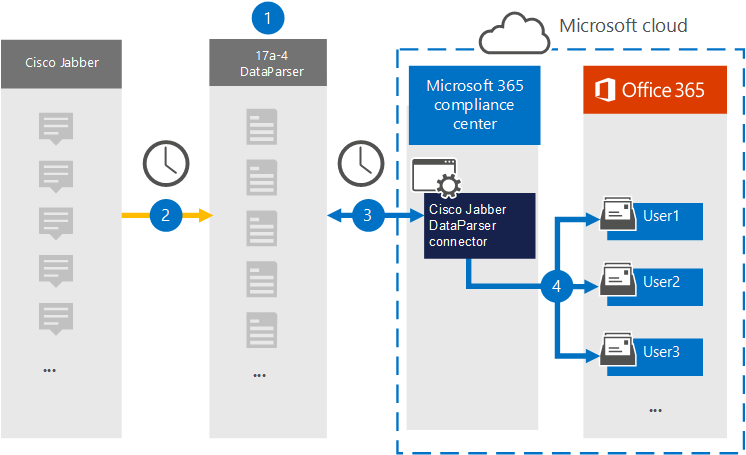

# Konfigurera en koppling för att arkivera Cisco Jabber-data (förhandsversion)

Använd [Cisco Jabber DataParser](https://www.17a-4.com/jabber-dataparser/) från 17a-4 LLC för att importera och arkivera data från Cisco Jabber till användarpostlådor i Microsoft 365 organisation. DataParser innehåller en Cisco Jabber-koppling som är konfigurerad för att hämta objekt från en datakälla från tredje part och importera objekten till Microsoft 365. Med Cisco Jabber DataParser-kopplingen konverteras Cisco Jabber-data till ett e-postmeddelandeformat och sedan importeras de objekten till användarpostlådor i Microsoft 365.

När Cisco Jabber-data lagras i användarpostlådor kan du använda efterlevnadsfunktioner för Microsoft 365, till exempel Bevarande av juridiska skäl, eDiscovery, bevarandeprinciper och bevarandeetiketter samt kommunikationsefterlevnad. Genom att använda en Cisco Jabber-koppling för att importera och arkivera data i Microsoft 365 kan din organisation följa myndighets- och regelpolicyer.

## Översikt över arkivering av Cisco Jabber-data

Följande översikt förklarar processen med att använda en datakoppling för att arkivera Cisco Jabber-data i Microsoft 365.

1. Din organisation arbetar med 17a-4 för att konfigurera och konfigurera Cisco Jabber DataParser.

2. Cisco Jabber-objekt samlas in regelbundet av DataParser. DataParser konverterar även innehållet i ett meddelande till ett e-postmeddelandeformat.

3. Den Cisco Jabber DataParser-koppling som du skapar i Microsoft 365 Efterlevnadscenter ansluter till DataParser och överför meddelanden till en säker Azure Storage plats i Microsoft-molnet.

4. En undermapp i mappen Inkorgen med namnet **Cisco Jabber DataParser** skapas i användarpostlådorna och Cisco Jabber-objekten importeras till den mappen. Kopplingen avgör vilken postlåda som objekt ska importeras till med hjälp av värdet för egenskapen *E-post.* Varje Cisco Jabber-objekt innehåller den här egenskapen, som fylls i med e-postadresserna för varje deltagare.

## Innan du skapa en koppling

- Skapa ett DataParser-konto för Microsoft-kopplingar. Det gör du genom att [kontakta 17a-4 LLC.](https://www.17a-4.com/contact/) Du måste logga in på det här kontot när du skapar kopplingen i steg 1.

- Användaren som skapar Cisco Jabber DataParser-kopplingen i steg 1 (och slutför den i steg 3) måste tilldelas rollen Importera och exportera postlåda i Exchange Online. Den här rollen krävs för att lägga till kopplingar **på sidan Datakopplingar** i Microsoft 365 Efterlevnadscenter. Som standard är den här rollen inte tilldelad en rollgrupp i Exchange Online. Du kan lägga till rollen Importera och exportera postlåda i rollgruppen Organisationshantering i Exchange Online. Du kan också skapa en rollgrupp, tilldela rollen Importera och exportera postlåda och sedan lägga till lämpliga användare som medlemmar. Mer information finns i avsnitten [Skapa rollgrupper](/Exchange/permissions-exo/role-groups#create-role-groups) och [Ändra rollgrupper](/Exchange/permissions-exo/role-groups#modify-role-groups) i artikeln "Hantera rollgrupper i Exchange Online".

## Steg 1: Konfigurera en Cisco Jabber DataParser-koppling

Det första steget är att få åtkomst till sidan Datakopplingar i Microsoft 365 Efterlevnadscenter och skapa en 17a-4-koppling för Cisco Jabber-data.

1. Gå till <https://compliance.microsoft.com> och klicka sedan på **Datakopplingar**  >  **Cisco Jabber DataParser**.

2. På sidan **Cisco Jabber DataParser produktbeskrivning** klickar du på Lägg **till koppling**.

3. Klicka på **Acceptera på** sidan **Användningsvillkor.**

4. Ange ett unikt namn som identifierar kopplingen och klicka sedan på **Nästa.**

5. Logga in på ditt 17a-4-konto och slutför stegen i guiden för Cisco Jabber DataParser-anslutning.

## Steg 2: Konfigurera Cisco Jabber DataParser-kopplingen

Arbeta med 17a-4-stöd för att konfigurera Cisco Jabber DataParser-koppling.

## Steg 3: Mappa användare

Cisco Jabber DataParser-kopplingen mappar automatiskt användare till sina Microsoft 365-postadresser innan de importerar data till Microsoft 365.

## Steg 4: Övervaka Cisco Jabber DataParser-kopplingen

När du har skapat en Cisco Jabber DataParser-koppling kan du visa anslutningsstatusen i Microsoft 365 Efterlevnadscenter.

1. Gå till <https://compliance.microsoft.com> och klicka på **Datakopplingar** i det vänstra navigeringsfältet.

2. Klicka på **fliken Kopplingar** och välj sedan den Cisco Jabber DataParser-koppling som du har skapat för att visa den utfällbar sida som innehåller egenskaper och information om kopplingen.

3. Under **Anslutningsstatus med källa** klickar du på länken Ladda ned **logg** för att öppna (eller spara) statusloggen för kopplingen. Den här loggen innehåller data som har importerats till Microsoft-molnet.

## Kända problem

För stunden går det inte att importera bifogade filer eller objekt som är större än 10 MB. Stöd för större objekt blir tillgängligt vid ett senare tillfälle.
