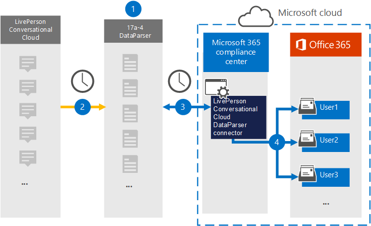

# Konfigurera en koppling för att arkivera molnbaserad data för Konversationsmoln i LivePerson (förhandsversion)

Använd [LivePerson Conversational Cloud DataParser](https://www.17a-4.com/liveperson-dataparser/) från 17a-4 LLC till att importera och arkivera data från LivePerson Conversational Cloud till användarnas postlådor i Microsoft 365 organisation. DataParser innehåller en LivePerson Conversational Cloud-koppling som är konfigurerad för att hämta objekt från en datakälla från tredje part och importera objekten till Microsoft 365. Med LivePerson Conversational Cloud DataParser-kopplingen konverteras data till ett e-postmeddelandeformat och objekten importeras sedan till användarnas postlådor i Microsoft 365.

När data har lagrats i användarnas postlådor kan du tillämpa efterlevnadsfunktioner Microsoft 365 till exempel Bevarande av juridiska skäl, eDiscovery, bevarandeprinciper och bevarandeetiketter samt kommunikationsefterlevnad. Med en LivePerson Conversational Cloud-anslutning anslutare för att importera och arkivera data i Microsoft 365 kan hjälpa din organisation att följa myndighets- och regelpolicyer.

## Översikt över arkivering av data i konversationsmoln för LivePerson

Följande översikt förklarar hur du använder en datakoppling för att arkivera data i LivePerson Conversational Cloud i Microsoft 365.

1. Din organisation arbetar med 17a-4 för att konfigurera och konfigurera Cloud DataParser-samtalsparser för LivePerson.

2. LivePerson Conversational Cloud-objekt samlas in regelbundet av DataParser. DataParser konverterar även innehållet i ett meddelande till ett e-postmeddelandeformat.

3. Den LivePerson Conversational Cloud DataParser-koppling som du skapar i Microsoft 365 Efterlevnadscenter ansluter till DataParser och överför meddelanden till en säker Azure Storage plats i Microsoft-molnet.

4. En undermapp i mappen Inkorgen med namnet **LivePersonal Cloud DataParser** skapas i användarnas postlådor och objekten importeras till den mappen. Kopplingen avgör vilken postlåda som objekt ska importeras till med hjälp av värdet för egenskapen *E-post.* Alla objekt innehåller den här egenskapen, som fylls i med e-postadresserna för alla deltagare.

## Innan du skapa en koppling

- Skapa ett DataParser-konto för Microsoft-kopplingar. Det gör du genom att [kontakta 17a-4 LLC.](https://www.17a-4.com/contact/) Du måste logga in på det här kontot när du skapar kopplingen i steg 1.

- Den användare som skapar LivePerson Conversational Cloud DataParser-kopplingen i steg 1 (och slutför den i steg 3) måste tilldelas rollen Importera och exportera postlåda i Exchange Online. Den här rollen krävs för att lägga till kopplingar **på sidan Datakopplingar** i Microsoft 365 Efterlevnadscenter. Som standard är den här rollen inte tilldelad en rollgrupp i Exchange Online. Du kan lägga till rollen Importera och exportera postlåda i rollgruppen Organisationshantering i Exchange Online. Du kan också skapa en rollgrupp, tilldela rollen Importera och exportera postlåda och sedan lägga till lämpliga användare som medlemmar. Mer information finns i avsnitten [Skapa rollgrupper](/Exchange/permissions-exo/role-groups#create-role-groups) och [Ändra rollgrupper](/Exchange/permissions-exo/role-groups#modify-role-groups) i artikeln "Hantera rollgrupper i Exchange Online".

## Steg 1: Konfigurera en LivePerson Conversational Cloud DataParser-koppling

Det första steget är att komma åt sidan Dataanslutningar i Microsoft 365 Efterlevnadscenter och skapa en 17a-4-koppling för LivePerson Conversational Cloud-data.

1. Gå till <https://compliance.microsoft.com> och klicka på **Datakopplingar**  >  **Cloud DataParser** för konversationer i LivePerson.

2. På sidan **LivePerson Conversational Cloud DataParser produktbeskrivning** klickar du på Lägg **till koppling**.

3. Klicka på **Acceptera på** sidan **Användningsvillkor.**

4. Ange ett unikt namn som identifierar kopplingen och klicka sedan på **Nästa.**

5. Logga in på ditt 17a-4-konto och slutför stegen i anslutningsguiden för LivePerson Conversational Cloud DataParser.

## Steg 2: Konfigurera LivePerson Conversational Cloud DataParser-kopplingen

Arbeta med 17a-4 Support för att konfigurera LivePerson Conversational Cloud DataParser-kopplingen.

## Steg 3: Mappa användare

Anslutningen för LivePerson Conversational Cloud DataParser mappar automatiskt användare till sina Microsoft 365-postadresser innan data importeras till Microsoft 365.

## Steg 4: Övervaka LivePerson Conversational Cloud DataParser-kopplingen

När du har skapat en LivePerson Conversational Cloud DataParser-koppling kan du visa anslutningsstatusen i Microsoft 365 Efterlevnadscenter.

1. Gå till <https://compliance.microsoft.com> och klicka på **Datakopplingar** i det vänstra navigeringsfältet.

2. Klicka på **fliken Kopplingar** och välj sedan molndataparserkopplingen LivePersonal konversation som du har skapat för att visa den utfällbar sida, som innehåller egenskaper och information om kopplingen.

3. Under **Anslutningsstatus med källa** klickar du på länken Ladda ned **logg** för att öppna (eller spara) statusloggen för kopplingen. Den här loggen innehåller data som har importerats till Microsoft-molnet.

## Kända problem

För stunden går det inte att importera bifogade filer eller objekt som är större än 10 MB. Stöd för större objekt blir tillgängligt vid ett senare tillfälle.
