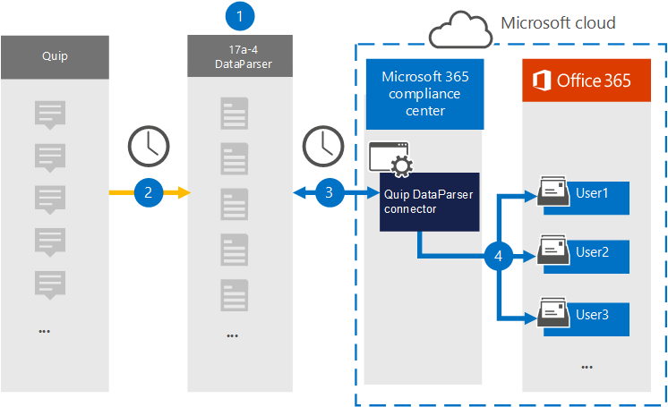

# Konfigurera en koppling för att arkivera data avknappning (förhandsversion)Set up a connector to archive Quip data (preview)

Använd [Quip DataParser](https://www.17a-4.com/quip-dataparser/) från 17a-4 LLC för att importera och arkivera data från Quip till användarpostlådor i Microsoft 365 organisation.Use the [Quip DataParser](https://www.17a-4.com/quip-dataparser/) from 17a-4 LLC to import and archive data from Quip to user mailboxes in your Microsoft 365 organization. DataParser har en Quip-koppling som är konfigurerad för att hämta objekt från en datakälla från tredje part och importera objekten till Microsoft 365.The DataParser includes a Quip connector that's configured to capture items from a third-party data source and import those items to Microsoft 365. Kopplingen Quip DataParser konverterar Quip-data till ett e-postmeddelandeformat och importerar sedan dessa objekt till användarpostlådor i Microsoft 365.The Quip DataParser connector converts Quip data to an email message format and then imports those items to user mailboxes in Microsoft 365.

När quip-data lagras i användarpostlådor kan du använda Microsoft 365-efterlevnadsfunktioner, till exempel bevarande av juridiska skäl, eDiscovery, bevarandeprinciper och bevarandeetiketter samt kommunikationsefterlevnad.After Quip data is stored in user mailboxes, you can apply Microsoft 365 compliance features such as Litigation Hold, eDiscovery, retention policies and retention labels, and communication compliance. Att använda en Quip-koppling för att importera och arkivera data i Microsoft 365 kan hjälpa din organisation att följa myndighets- och regleringsprinciper.Using a Quip connector to import and archive data in Microsoft 365 can help your organization stay compliant with government and regulatory policies.

## Översikt över arkivering av dataOverview of archiving Quip data

I följande översikt beskrivs hur du använder en datakoppling för att arkivera data av data i Microsoft 365.The following overview explains the process of using a data connector to archive Quip data in Microsoft 365.

1. Organisationen arbetar med 17a-4 för att konfigurera Quip DataParser.Your organization works with 17a-4 to set up and configure the Quip DataParser.

2. Den här regeln samlas in regelbundet av DataParser.On a regular basis, Quip items are collected by the DataParser. DataParser konverterar även innehållet i ett meddelande till ett e-postmeddelandeformat.The DataParser also converts the content of a message to an email message format.

3. Den Quip DataParser-koppling som du skapar i Microsoft 365 Efterlevnadscenter ansluter till DataParser och överför meddelanden till en säker Azure Storage plats i Microsoft-molnet.The Quip DataParser connector that you create in the Microsoft 365 compliance center connects to DataParser and transfers the messages to a secure Azure Storage location in the Microsoft cloud.

4. En undermapp i mappen Inkorgen med namnet **Quip DataParser** skapas i användarpostlådorna och objekten Quip importeras till den mappen.A subfolder in the Inbox folder named **Quip DataParser** is created in the user mailboxes, and the Quip items are imported to that folder. Kopplingen avgör vilken postlåda som objekt ska importeras till med hjälp av värdet för egenskapen *E-post.*The connector determines which mailbox to import items to by using the value of the *Email* property. Varje objekt avkavser innehåller den här egenskapen, som fylls i med e-postadresserna för alla deltagare.Every Quip item contains this property, which is populated with the email address of every participant.

## Innan du skapa en kopplingBefore you set up a connector

- Skapa ett DataParser-konto för Microsoft-kopplingar.Create a DataParser account for Microsoft connectors. Det gör du genom att [kontakta 17a-4 LLC.](https://www.17a-4.com/contact/)To do this, contact [17a-4 LLC](https://www.17a-4.com/contact/). Du måste logga in på det här kontot när du skapar kopplingen i steg 1.You need to sign into this account when you create the connector in Step 1.

- Den användare som skapar Quip DataParser-kopplingen i steg 1 (och slutför den i steg 3) måste tilldelas rollen Importera och exportera postlåda i Exchange Online.The user who creates the Quip DataParser connector in Step 1 (and completes it in Step 3) must be assigned to the Mailbox Import Export role in Exchange Online. Den här rollen krävs för att lägga till kopplingar **på sidan Datakopplingar** i Microsoft 365 Efterlevnadscenter.This role is required to add connectors on the **Data connectors** page in the Microsoft 365 compliance center. Som standard är den här rollen inte tilldelad en rollgrupp i Exchange Online.By default, this role is not assigned to a role group in Exchange Online. Du kan lägga till rollen Importera och exportera postlåda i rollgruppen Organisationshantering i Exchange Online.You can add the Mailbox Import Export role to the Organization Management role group in Exchange Online. Du kan också skapa en rollgrupp, tilldela rollen Importera och exportera postlåda och sedan lägga till lämpliga användare som medlemmar.Or you can create a role group, assign the Mailbox Import Export role, and then add the appropriate users as members. Mer information finns i avsnitten [Skapa rollgrupper](/Exchange/permissions-exo/role-groups#create-role-groups) och [Ändra rollgrupper](/Exchange/permissions-exo/role-groups#modify-role-groups) i artikeln "Hantera rollgrupper i Exchange Online".For more information, see the [Create role groups](/Exchange/permissions-exo/role-groups#create-role-groups) or [Modify role groups](/Exchange/permissions-exo/role-groups#modify-role-groups) sections in the article "Manage role groups in Exchange Online".

## Steg 1: Konfigurera en Quip DataParser-kopplingStep 1: Set up a Quip DataParser connector

Det första steget är att få åtkomst till sidan Datakopplingar i Microsoft 365 Efterlevnadscenter och skapa en 17a-4-koppling för Data avkn.The first step is to access to the Data connectors page in the Microsoft 365 compliance center and create a 17a-4 connector for Quip data.

1. Gå till <https://compliance.microsoft.com> och klicka sedan på **Datakopplingar**  >  **Quip DataParser**.Go to <https://compliance.microsoft.com> and then click **Data connectors** > **Quip DataParser**.

2. På sidan **Ta fram dataparser produktbeskrivning** klickar du på Lägg **till koppling**.On the **Quip DataParser** product description page, click **Add connector**.

3. Klicka på **Acceptera på** sidan **Användningsvillkor.**On the **Terms of service** page, click **Accept**.

4. Ange ett unikt namn som identifierar kopplingen och klicka sedan på **Nästa.**Enter a unique name that identifies the connector and then click **Next**.

5. Logga in på ditt 17a-4-konto och slutför stegen i anslutningsguiden Quip DataParser.Sign in to your 17a-4 account and complete the steps in the Quip DataParser connection wizard.

## Steg 2: Konfigurera kopplingen Quip DataParserStep 2: Configure the Quip DataParser connector

Konfigurera kopplingen Quip DataParser med 17a-4 Support.Work with 17a-4 Support to configure the Quip DataParser connector.

## Steg 3: Mappa användareStep 3: Map users

Kopplingen Quip DataParser mappar automatiskt användare till sina e Microsoft 365 adresser innan data importeras till Microsoft 365.The Quip DataParser connector will automatically map users to their Microsoft 365 email addresses before importing data to Microsoft 365.

## Steg 4: Övervaka kopplingen För att ta dataparserStep 4: Monitor the Quip DataParser connector

När du har skapat en Quip DataParser-koppling kan du visa kopplingsstatusen i Microsoft 365 Efterlevnadscenter.After you create a Quip DataParser connector, you can view the connector status in the Microsoft 365 compliance center.

1. Gå till <https://compliance.microsoft.com> och klicka på **Datakopplingar** i det vänstra navigeringsfältet.Go to <https://compliance.microsoft.com> and click **Data connectors** in the left nav.

2. Klicka på **fliken Kopplingar** och välj sedan kopplingen Skärmdataparser som du har skapat för att visa den utfällbar sidan, som innehåller egenskaper och information om kopplingen.Click the **Connectors** tab and then select the Quip DataParser connector that you created to display the flyout page, which contains the properties and information about the connector.

3. Under **Anslutningsstatus med källa** klickar du på länken Ladda ned **logg** för att öppna (eller spara) statusloggen för kopplingen.Under **Connector status with source**, click the **Download log** link to open (or save) the status log for the connector. Den här loggen innehåller data som har importerats till Microsoft-molnet.This log contains data that has been imported to the Microsoft cloud.

## Kända problemKnown issues

För stunden går det inte att importera bifogade filer eller objekt som är större än 10 MB.At this time, we don't support importing attachments or items that are larger than 10 MB. Stöd för större objekt blir tillgängligt vid ett senare tillfälle.Support for larger items will be available at a later date.
