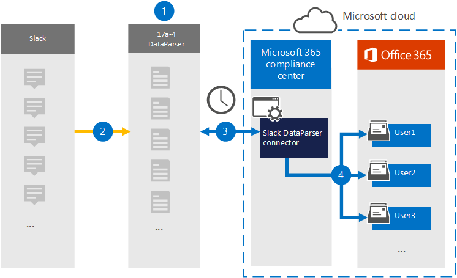

# Konfigurera en koppling för att arkivera slackdata (förhandsgranskning)

Använd [DataParser från 17a-4 LLC](https://www.17a-4.com/slack-dataparser/) till att importera och arkivera data från slackplattformen till användarpostlådor i Microsoft 365 organisation. DataParser innehåller en slackkoppling som är konfigurerad för att hämta objekt från en datakälla från tredje part och importera objekten till Microsoft 365. Kopplingen Slackdataparser konverterar slackdata till ett e-postmeddelandeformat och importerar sedan dessa objekt till användarpostlådor i Microsoft 365.

När slackdata har lagrats i användarpostlådor kan du använda efterlevnadsfunktioner Microsoft 365 till exempel Bevarande av juridiska skäl, eDiscovery, bevarandeprinciper och bevarandeetiketter samt kommunikationsefterlevnad. Genom att använda en slackkoppling för att importera och arkivera data i Microsoft 365 kan det hjälpa din organisation att följa myndighets- och regleringsprinciper.

## Översikt över arkivering av slackdata

I följande översikt beskrivs hur du använder en datakoppling för att arkivera slackdata i Microsoft 365.

1. Din organisation arbetar med 17a-4 för att konfigurera och konfigurera Slack-dataparser.

2. Slackobjekt samlas in regelbundet av DataParser. DataParser konverterar även innehållet i ett meddelande till ett e-postmeddelandeformat.

3. Kopplingen slackdataparser som du skapar i Microsoft 365 Efterlevnadscenter ansluter till DataParser och överför meddelanden till en säker Azure Storage i Microsoft-molnet.

4. En undermapp i mappen Inkorgen med namnet **Slack dataparser** skapas i användarnas postlådor och slackobjekten importeras till den mappen. Kopplingen avgör vilken postlåda som objekt ska importeras till med hjälp av värdet för egenskapen *E-post.* Varje slackobjekt innehåller den här egenskapen, som fylls i med e-postadresserna för alla deltagare.

## Innan du skapa en koppling

- Skapa ett DataParser-konto för Microsoft-kopplingar. Det gör du genom att [kontakta 17a-4 LLC.](https://www.17a-4.com/contact/) Du måste logga in på det här kontot när du skapar kopplingen i steg 1.

- Den användare som skapar slackdataparserkopplingen i steg 1 (och slutför den i steg 3) måste tilldelas rollen Importera och exportera postlåda i Exchange Online. Den här rollen krävs för att lägga till kopplingar **på sidan Datakopplingar** i Microsoft 365 Efterlevnadscenter. Som standard är den här rollen inte tilldelad en rollgrupp i Exchange Online. Du kan lägga till rollen Importera och exportera postlåda i rollgruppen Organisationshantering i Exchange Online. Du kan också skapa en rollgrupp, tilldela rollen Importera och exportera postlåda och sedan lägga till lämpliga användare som medlemmar. Mer information finns i avsnitten [Skapa rollgrupper](/Exchange/permissions-exo/role-groups#create-role-groups) och [Ändra rollgrupper](/Exchange/permissions-exo/role-groups#modify-role-groups) i artikeln "Hantera rollgrupper i Exchange Online".

## Steg 1: Konfigurera en slackdataparserkoppling

Det första steget är att komma åt sidan Datakopplingar i Microsoft 365 Efterlevnadscenter och skapa en 17a-4-koppling för slackdata.

1. Gå till <https://compliance.microsoft.com> och klicka sedan på **Datakopplingar**  >  **Slack Dataparser**.

2. På sidan **Slack DataParser produktbeskrivning** klickar du på Lägg **till koppling**.

3. Klicka på **Acceptera på** sidan **Användningsvillkor.**

4. Ange ett unikt namn som identifierar kopplingen och klicka sedan på **Nästa.**

5. Logga in på ditt 17a-4-konto och utför stegen i guiden Slack DataParser-anslutning.

## Steg 2: Konfigurera dataparserkopplingen för slack

Konfigurera dataparserkopplingen slack med stöd för 17a-4.

## Steg 3: Mappa användare

Kopplingen Slackdataparser mappar automatiskt användare till sina e Microsoft 365 adresser innan data importeras till Microsoft 365.

## Steg 4: Övervaka dataparserkopplingen med slack

När du har skapat en dataparserkoppling med slack kan du visa kopplingsstatusen i Microsoft 365 Efterlevnadscenter.

1. Gå till <https://compliance.microsoft.com> och klicka på **Datakopplingar** i det vänstra navigeringsfältet.

2. Klicka på **fliken Kopplingar** och välj sedan slackdataparserkopplingen som du har skapat för att visa den utfällbar sida som innehåller egenskaper och information om kopplingen.

3. Under **Anslutningsstatus med källa** klickar du på länken Ladda ned **logg** för att öppna (eller spara) statusloggen för kopplingen. Den här loggen innehåller data som har importerats till Microsoft-molnet.

## Kända problem

För stunden går det inte att importera bifogade filer eller objekt som är större än 10 MB. Stöd för större objekt blir tillgängligt vid ett senare tillfälle.
