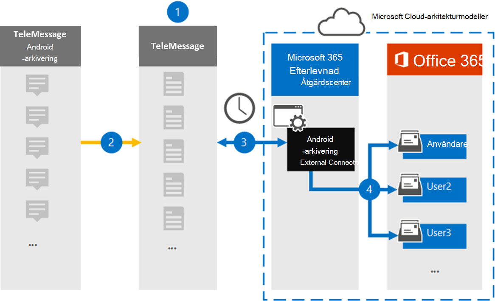

# Konfigurera en koppling för att arkivera mobildata för Android

Använd en TeleMessage-koppling i Microsoft 365 efterlevnadscenter för att importera och arkivera SMS, MMS, röstsamtal och samtalsloggar från Android-mobiltelefoner. När du har konfigurerat och konfigurerat en anslutning ansluts den till organisationens TeleMessage-konto en gång om dagen och importerar mobilkommunikationen för anställda med Hjälp av TeleMessage Android-arkivet till postlådor i Microsoft 365.

När data från Android-mobiltelefoner lagras i användarpostlådor kan du använda efterlevnadsfunktioner i Microsoft 365, till exempel Bevarande av juridiska skäl, Innehållssökning och Microsoft 365 bevarandeprinciper på Android-arkiveringsdata. Du kan till exempel söka i mobil kommunikation med Android-arkiveraren med hjälp av Innehållssökning eller associera postlådan som innehåller Android-arkiveringskopplingsdata med en medarbetare i ett Advanced eDiscovery fall. Om du använder en Android-arkiveringskoppling för att importera och arkivera data i Microsoft 365 kan detta hjälpa din organisation att följa myndighets- och regelpolicyn.

## Översikt över arkivering av mobildata för Android

I följande översikt beskrivs hur du använder en anslutare för att arkivera mobildata för Android i Microsoft 365.

1. Din organisation arbetar med TeleMessage för att konfigurera en Android-arkiveringskoppling. Mer information finns i [Android-arkiveraren](https://www.telemessage.com/office365-activation-for-android-archiver/).

2. I realtid SMS kopieras MMS, röstsamtal och samtalsloggar från organisationens Android-mobiltelefoner till TeleMessage-webbplatsen.

3. Android-arkiveringskopplingen som du skapar i efterlevnadscentret för Microsoft 365 ansluter till TeleMessage-webbplatsen varje dag och överför Android-data från de senaste 24 timmarna till en säker Azure Storage plats i Microsoft-molnet. Kopplingen konverterar även Android-data till ett e-postmeddelandeformat.

4. Kopplingen importerar mobila kommunikationsobjekt till en viss användares postlåda. En ny mapp med namnet Android-arkivering skapas i den specifika användarens postlåda och objekten importeras till den. Kopplingen mappar med hjälp av värdet för *användarens e-postadressegenskap.* Alla e-postmeddelanden innehåller den här egenskapen, som fylls i med e-postadresserna för alla deltagare i e-postmeddelandet. Förutom automatisk användarmappning med värdet  för användarens e-postadressegenskap kan du också definiera en anpassad mappning genom att ladda upp en CSV-mappningsfil. Den här mappningsfilen ska innehålla mobilnumret och Microsoft 365 postlådans adress för varje användare. Om du aktiverar automatisk användarmappning och tillhandahåller en anpassad mappning kommer kopplingen först att titta på anpassad mappningsfil för varje e-postobjekt. Om anslutaren inte hittar en giltig Microsoft 365-användare som motsvarar en användares mobilnummer använder kopplingen användarens e-postadressegenskap för e-postobjektet. Om kopplingen inte hittar en giltig Microsoft 365 användare i antingen den  anpassade mappningsfilen eller användarens e-postadressegenskap för e-postobjektet, importeras inte objektet.

## Innan du skapa en koppling

Vissa implementeringssteg som krävs för att arkivera kommunikationsdata från Android är externa för Microsoft 365 och måste slutföras innan du kan skapa anslutningen i efterlevnadscentret.

- Beställ [Android-arkiveringstjänsten från TeleMessage](https://www.telemessage.com/mobile-archiver/order-mobile-archiver-for-o365) och få ett giltigt administrationskonto för din organisation. Du måste logga in på det här kontot när du skapar kopplingen.

- Registrera alla användare som har Android-arkiveringstjänsten i TeleMessage-kontot. Se till att använda samma e-postadress som används för användarens konto när du registrerar Microsoft 365 användare.

- Installera och aktivera TeleMessage Android Archiver-appen på dina anställdas mobiltelefoner.

- Den användare som skapar en Android-arkiveringskoppling måste tilldelas rollen Importera och exportera postlåda i Exchange Online. Detta krävs för att lägga till kopplingar på **sidan Datakopplingar** i Microsoft 365 kompatibilitetscenter. Som standard är den här rollen inte tilldelad någon rollgrupp i Exchange Online. Du kan lägga till rollen Importera och exportera postlåda i rollgruppen Organisationshantering i Exchange Online. Du kan också skapa en rollgrupp, tilldela rollen Importera och exportera postlåda och sedan lägga till lämpliga användare som medlemmar. Mer information finns i avsnitten [Skapa rollgrupper](/Exchange/permissions-exo/role-groups#create-role-groups) och [Ändra rollgrupper](/Exchange/permissions-exo/role-groups#modify-role-groups) i artikeln "Hantera rollgrupper i Exchange Online".

- Den här datakopplingen är tillgänglig GCC miljöer i Microsoft 365 för myndigheter i USA. Program och tjänster från tredje part kan innebära att lagra, överföra och bearbeta din organisations kunddata i tredje parts system som ligger utanför Microsoft 365-infrastrukturen och därför inte omfattas av Microsoft 365-åtaganden gällande efterlevnad och dataskydd. Microsoft anger inte att användningen av den här produkten för att ansluta till program från tredje part innebär att sådana program från tredje part är FEDRAMP-kompatibla.

## Skapa en Android-arkiveringskoppling

Det sista steget är att skapa en Android-arkiveringskoppling i Microsoft 365 efterlevnadscenter. Kopplingen använder den information du uppger för att ansluta till TeleMessage-webbplatsen och överföra Android-kommunikationen till motsvarande postlåderutor i Microsoft 365.

1. Gå till [https://compliance.microsoft.com](https://compliance.microsoft.com) och klicka **på Datakopplingar**  >  **Android-arkiverare**.

2. På **produktbeskrivningssidan för** Android-arkiveraren klickar du på **Lägg till koppling.**

3. Klicka på **Acceptera på** sidan **Användningsvillkor.**

4. På sidan **Logga in på TeleMessage,** under Steg 3, anger du den information som krävs i följande rutor och klickar sedan på **Nästa.**

   - **Användarnamn:** Ditt TeleMessage-användarnamn.

   - **Lösenord:** Ditt TeleMessage-lösenord.

5. När kopplingen har skapats stänger du popup-fönstret och klickar på **Nästa**.

6. På sidan **Användarmappning** aktiverar du automatisk användarmappning och klickar på **Nästa.** Om du behöver anpassad mappning laddar du upp en CSV-fil och klickar på **Nästa**.

7. Granska inställningarna och klicka sedan på **Slutför för** att skapa kopplingen.

8. Gå till fliken Kopplingar på sidan **Datakopplingar** för att se importprocessen för den nya kopplingen.

## Kända problem

- För stunden går det inte att importera bifogade filer eller objekt som är större än 10 MB. Stöd för större objekt blir tillgängligt vid ett senare tillfälle.
