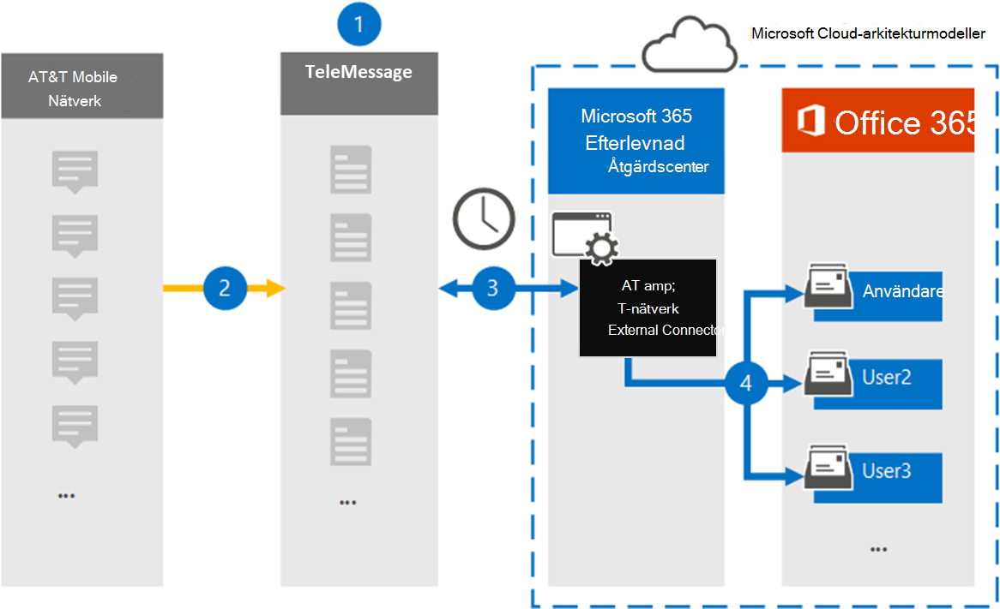

# Konfigurera en koppling för att arkivera AT&T SMS-/MMS-data

Använd en TeleMessage-koppling i kompatibilitetscentret för Microsoft 365 för att importera och arkivera SMS MMS-data från AT&T Mobile Network. När du har konfigurerat och konfigurerat en anslutning ansluts den till organisationens AT&T-nätverk en gång om dagen och importerar SMS- och MMS-data till postlådor i Microsoft 365.

När SMS och MMS har lagrats i användarnas postlådor kan du använda efterlevnadsfunktioner i Microsoft 365, till exempel Bevarande av juridiska skäl, Innehållssökning och Microsoft 365-bevarandeprinciper för AT&T-nätverksdata. Du kan till exempel söka efter data i AT&T-nätverket med hjälp av innehållssökning eller associera postlådan som innehåller at&T Network-kopplingsdata med en medarbetare i ett Advanced eDiscovery fall. Om du använder en AT&T Network-koppling för att importera och arkivera data i Microsoft 365 kan det hjälpa din organisation att följa myndighets- och regelpolicyer.

## Översikt över arkivering av AT&T-nätverksdata

Följande översikt förklarar processen med att använda en koppling för att arkivera AT&T Network-data i Microsoft 365.

1. Din organisation arbetar med TeleMessage för att konfigurera en AT&T Network-koppling. Mer information finns i [AT&T Network Archiver](https://www.telemessage.com/office365-activation-for-atnt-network-archiver/).

2. I realtid kopieras SMS MMS-meddelanden från organisationens AT&T-nätverk till TeleMessage-webbplatsen.

3. Den AT&T Network-koppling som du skapar i efterlevnadscentret för Microsoft 365 ansluter till TeleMessage-webbplatsen varje dag och överför SMS- och MMS-meddelandena från de föregående 24 timmarna till en säker Azure Storage plats i Microsoft-molnet. Kopplingen omvandlar också innehållet i SMS MMS-meddelanden till ett e-postmeddelandeformat.

4. Kopplingen importerar mobila kommunikationsobjekt till specifika användares postlådor. En ny mapp **med namnet AT&T SMS/MMS Network Archiver** skapas i användarens postlåda och objekten importeras till den. Kopplingen gör den här mappningen med hjälp av värdet för *användarens e-postadressegenskap.* Alla SMS och MMS-meddelanden innehåller den här egenskapen, som fylls i med e-postadresserna för varje meddelandedeltagare.
 
   Förutom automatisk användarmappning med värdet  för användarens e-postadressegenskap kan du också definiera en anpassad mappning genom att ladda upp en CSV-mappningsfil. Den här mappningsfilen innehåller mobiltelefonnumret och den Microsoft 365 e-postadressen för användare i organisationen. Om du aktiverar både automatisk användarmappning och anpassad mappning tittar kopplingen först på den anpassade mappningsfilen för varje e-postobjekt. Om en giltig Microsoft 365 som motsvarar ett mobiltelefonnummer inte kan hittas använder kopplingen värdena i e-postadressegenskapen för objektet som ska importeras. Om kopplingen inte hittar en giltig Microsoft 365 i antingen den anpassade mappningsfilen eller i e-postadressegenskapen för e-postobjektet, importeras inte objektet.

## Innan du börjar

Några av de implementeringssteg som krävs för att arkivera data i AT&T-nätverket är externa eller Microsoft 365 och måste slutföras innan du kan skapa anslutningen i efterlevnadscentret.

- Beställ den [mobila arkiveringstjänsten från TeleMessage](https://www.telemessage.com/mobile-archiver/order-mobile-archiver-for-o365/) och få ett giltigt administrationskonto för din organisation. Du måste logga in på det här kontot när du skapar anslutningen i efterlevnadscentret.

- Skaffa dina AT&T-konto- och faktureringsuppgifter så att du kan fylla i TeleMessage-introduktionsformulären och ordna arkiveringstjänsten för meddelanden från AT&T.

- Registrera alla användare som kräver at&eller SMS/MMS-nätverksarkivering i TeleMessage-kontot. Se till att använda samma e-postadress som används för användarens konto när du registrerar Microsoft 365 användare.

- De anställda måste ha mobiltelefoner som ägs av företaget och företagsansvarig på AT&T-mobilnät. Arkivering av meddelanden i Microsoft 365 inte tillgängligt för enheter som ägs av anställda eller "Bring Your Own Devices (BYOD).

- Den användare som skapar en AT&T-nätverk-koppling måste tilldelas rollen Importera och exportera postlåda i Exchange Online. Detta krävs för att lägga till kopplingar på **sidan Datakopplingar** i Microsoft 365 kompatibilitetscenter. Som standard är den här rollen inte tilldelad någon rollgrupp i Exchange Online. Du kan lägga till rollen Importera och exportera postlåda i rollgruppen Organisationshantering i Exchange Online. Du kan också skapa en rollgrupp, tilldela rollen Importera och exportera postlåda och sedan lägga till lämpliga användare som medlemmar. Mer information finns i avsnitten [Skapa rollgrupper](/Exchange/permissions-exo/role-groups#create-role-groups) och [Ändra rollgrupper](/Exchange/permissions-exo/role-groups#modify-role-groups) i artikeln "Hantera rollgrupper i Exchange Online".

## Skapa en AT&T-nätverkskoppling

När du har slutfört de krav som beskrivs i föregående avsnitt kan du skapa en AT&T Network-koppling i Microsoft 365 kompatibilitetscenter. Kopplingen använder den information du uppger för att ansluta till TeleMessage-webbplatsen och överföra SMS och MMS-meddelanden till motsvarande postlåderutor i Microsoft 365.

1. Gå till [https://compliance.microsoft.com](https://compliance.microsoft.com/) och klicka på **Datakopplingar**  \  **AT&T-nätverk**.

2. På **produktbeskrivningssidan AT&T Network** klickar du på Lägg till **koppling**

3. Klicka på **Acceptera på** sidan **Användningsvillkor.**

4. På sidan **Logga in på TeleMessage,** under Steg 3, anger du den information som krävs i följande rutor och klickar sedan på **Nästa.**

   - **Användarnamn:** Ditt TeleMessage-användarnamn.

   - **Lösenord:** Ditt TeleMessage-lösenord.

5. När kopplingen har skapats kan du stänga popup-fönstret och gå till nästa sida.

6. Aktivera automatisk **användarmappning** på sidan Användarmappning. Om du vill aktivera anpassad mappning laddar du upp en CSV-fil som innehåller användarmappningsinformationen och klickar sedan på **Nästa.**

7. Granska inställningarna och klicka sedan på **Slutför för** att skapa kopplingen.

8. Gå till **fliken Kopplingar på** sidan Datakopplingar i **efterlevnadscentret** för att se förloppet för importen för den nya anslutningen.

## Kända problem

- För stunden går det inte att importera bifogade filer eller objekt som är större än 10 MB. Stöd för större objekt blir tillgängligt vid ett senare tillfälle.
