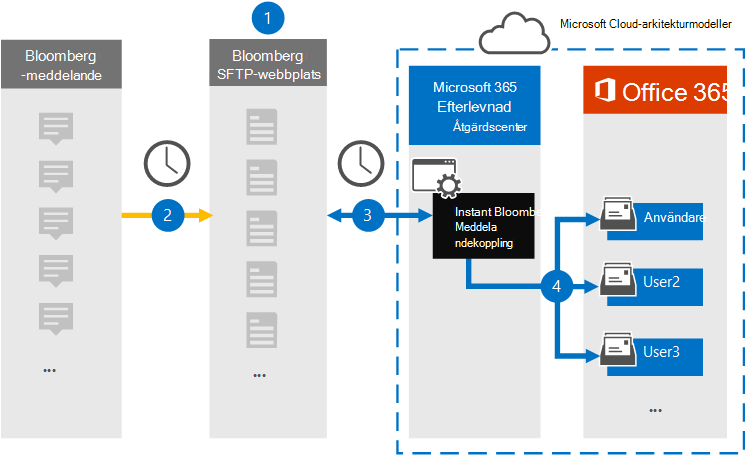
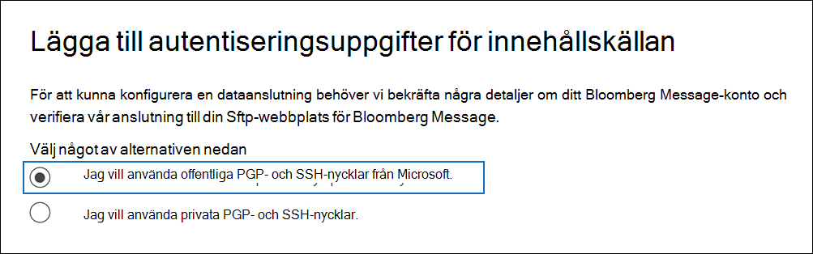
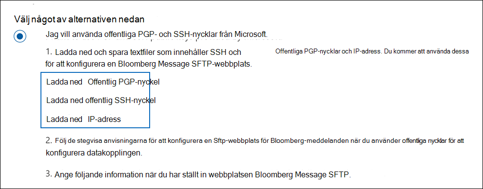
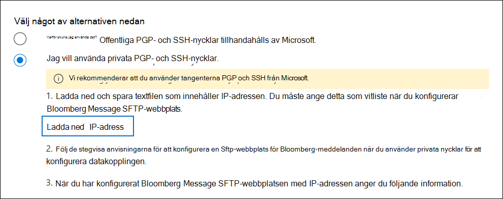
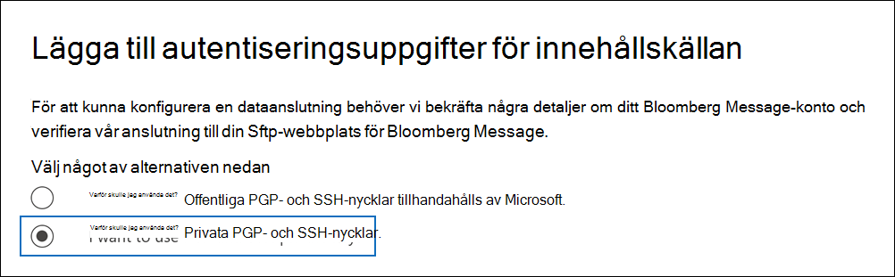

# Konfigurera en koppling för att arkivera information om Bloomberg-meddelandenSet up a connector to archive Bloomberg Message data

Använd en dataanslutning i kompatibilitetscentret för Microsoft 365 för att importera och arkivera e-postdata för finansiella tjänster från [samarbetsverktyget Bloomberg Message.](https://www.bloomberg.com/professional/product/collaboration/)Use a data connector in the Microsoft 365 compliance center to import and archive financial services email data from the [Bloomberg Message](https://www.bloomberg.com/professional/product/collaboration/) collaboration tool. När du har konfigurerat och konfigurerat en anslutning ansluts den till din organisations Ftp-säkra FTP-webbplats (SFTP) en gång om dagen och importerar e-postobjekt till postlådor i Microsoft 365.After you set up and configure a connector, it connects to your organization's Bloomberg secure FTP (SFTP) site once every day, and imports email items to mailboxes in Microsoft 365.

När Bloomberg Message-data lagras i användarpostlådor kan du använda efterlevnadsfunktioner i Microsoft 365, till exempel bevarande av juridiska skäl, innehållssökning, arkivering på plats, granskning, kommunikationsefterlevnad och Microsoft 365-bevarandeprinciper för Bloomberg Message-data.After Bloomberg Message data is stored in user mailboxes, you can apply Microsoft 365 compliance features such as Litigation hold, content search, In-place archiving, auditing, Communication compliance, and Microsoft 365 retention policies to Bloomberg Message data. Du kan till exempel söka i Bloomberg Message-e-postmeddelanden med hjälp av verktyget för innehållssökning eller associera postlådan som innehåller Information om Bloomberg-meddelandet med en medarbetare i ett Advanced eDiscovery fall.For example, you can search Bloomberg Message emails using the content search tool or associate the mailbox that contains the Bloomberg Message data with a custodian in an Advanced eDiscovery case. Genom att använda en Koppling för Bloomberg Message till att importera och arkivera data i Microsoft 365 kan hjälpa din organisation att följa myndighets- och regelpolicyer.Using a Bloomberg Message connector to import and archive data in Microsoft 365 can help your organization stay compliant with government and regulatory policies.

## Översikt över arkivering av information om Bloomberg-meddelandenOverview of archiving Bloomberg Message data

Följande översikt förklarar processen med att använda en koppling för att arkivera data i Bloomberg Message i Microsoft 365.The following overview explains the process of using a connector to archive Bloomberg Message data in Microsoft 365.

1. Din organisation arbetar med Bloomberg för att skapa en Bloomberg SFTP-webbplats.Your organization works with Bloomberg to set up a Bloomberg SFTP site. Du arbetar också med Bloomberg för att konfigurera Bloomberg Message så att det kopierar e-postmeddelanden till BloombergS SFTP-webbplats.You'll also work with Bloomberg to configure Bloomberg Message to copy email messages to the Bloomberg SFTP site.

2. En gång per dygn kopieras e-postmeddelanden från Bloomberg Message till BloombergS SFTP-webbplats.Once every 24 hours, email messages from Bloomberg Message are copied to the Bloomberg SFTP site.

3. Kopplingen Bloomberg Message som du skapar i efterlevnadscentret för Microsoft 365 ansluter till Bloombergs SFTP-webbplats varje dag och överför e-postmeddelanden från de föregående 24 timmarna till ett säkert Azure Storage område i Microsoft Cloud.The Bloomberg Message connector that you create in the Microsoft 365 compliance center connects to the Bloomberg SFTP site every day and transfers the email messages from the previous 24 hours to a secure Azure Storage area in the Microsoft Cloud.

4. Kopplingen importerar e-postobjekten till en viss användares postlåda.The connector imports the email message items to the mailbox of a specific user. En ny mapp med namnet BloombergMessage skapas i den specifika användarens postlåda och objekten importeras till den.A new folder named BloombergMessage is created in the specific user's mailbox and the items will be imported to it.

   Kopplingen gör detta med hjälp av värdet för egenskapen CorporateEmailAddress.The connector does this by using the value of the CorporateEmailAddress property. Alla e-postmeddelanden innehåller den här egenskapen, som fylls i med e-postadresserna för alla deltagare i e-postmeddelandet.Every email message contains this property, which is populated with the email address of every participant of the email message. Förutom automatisk användarmappning med värdet för egenskapen *CorporateEmailAddress* kan du också definiera en anpassad mappning genom att ladda upp en CSV-mappningsfil.In addition to automatic user mapping using the value of the *CorporateEmailAddress* property, you can also define a custom mapping by uploading a CSV mapping file. Den här mappningsfilen innehåller Bloomberg UUID och motsvarande e Microsoft 365 postlådeadress för varje användare i organisationen.This mapping file contains a Bloomberg UUID and the corresponding Microsoft 365 mailbox address for each user in your organization. Om du aktiverar automatisk användarmappning och tillhandahåller en anpassad mappning kommer kopplingen först att titta på den anpassade mappningsfilen för varje e-postobjekt.If you enable automatic user mapping and provide a custom mapping, for every email item the connector will first look at the custom-mapping file. Om kopplingen inte hittar en giltig Microsoft 365-användare som motsvarar en användares Bloomberg UUID använder kopplingen egenskapen *CorporateEmailAddress* för e-postobjektet.If it doesn't find a valid Microsoft 365 user that corresponds to a user's Bloomberg UUID, the connector uses the *CorporateEmailAddress* property of the email item. Om kopplingen inte hittar en giltig Microsoft 365-användare i antingen custom-mapping-filen eller *egenskapen CorporateEmailAddress* för e-postobjektet, importeras inte objektet.If the connector doesn't find a valid Microsoft 365 user in either the custom-mapping file or the *CorporateEmailAddress* property of the email item, the item won't be imported.

## Innan du skapa en kopplingBefore you set up a connector

Några av de implementeringssteg som krävs för att arkivera data i Bloomberg Message är Microsoft 365 och måste slutföras innan du kan skapa anslutningen i efterlevnadscentret.Some of the implementation steps required to archive Bloomberg Message data are external to Microsoft 365 and must be completed before you can create the connector in the compliance center.

- Om du vill konfigurera en Koppling för Bloomberg Message måste du använda tangenter och tangentpassphraser för PGP (Pretty Good Privacy) och Secure Shell (SSH).To set up a Bloomberg Message connector, you have to use keys and key passphrases for Pretty Good Privacy (PGP) and Secure Shell (SSH). Dessa nycklar används för att konfigurera Bloomberg SFTP-webbplatsen och används av kopplingen för att ansluta till BloombergS SFTP-webbplatsen för att importera data till Microsoft 365.These keys are used to configure the Bloomberg SFTP site and used by the connector to connect to the Bloomberg SFTP site to import data to Microsoft 365. PGP-nyckeln används för att konfigurera krypteringen av data som överförs från BloombergS SFTP-webbplatsen till Microsoft 365.The PGP key is used to configure the encryption of data that's transferred from the Bloomberg SFTP site to Microsoft 365. SSH-nyckeln används för att konfigurera säkert gränssnitt för att aktivera en säker fjärrinloggning när kopplingen ansluter till BloombergS SFTP-webbplatsen.The SSH key is used to configure secure shell to enable a secure remote login when the connector connects to the Bloomberg SFTP site.

  När du inställningar för en koppling kan du välja att använda offentliga tangenter och lösenordsfraser som tillhandahålls av Microsoft, eller så kan du använda dina egna privata nycklar och lösenord.When setting up a connector, you have the option to use public keys and key passphrases provided by Microsoft or you can use your own private keys and passphrases. Vi rekommenderar att du använder de offentliga nycklar som tillhandahålls av Microsoft.We recommend that you use the public keys provided by Microsoft. Men om din organisation redan har konfigurerat en Bloomberg SFTP-webbplats med privata nycklar kan du skapa en koppling med samma privata nycklar.However, if your organization has already configured a Bloomberg SFTP site using private keys, then you can create a connector using these same private keys.

- Prenumerera på [Bloomberg Anywhere](https://www.bloomberg.com/professional/product/remote-access/?bbgsum-page=DG-WS-PROF-PROD-BBA).Subscribe to [Bloomberg Anywhere](https://www.bloomberg.com/professional/product/remote-access/?bbgsum-page=DG-WS-PROF-PROD-BBA). Detta krävs för att du ska kunna logga in på Bloomberg Anywhere för att komma åt BloombergS SFTP-webbplatsen som du måste konfigurera.This is required so that you can log in to Bloomberg Anywhere to access the Bloomberg SFTP site that you have to set up and configure.

- Konfigurera en Bloomberg SFTP-webbplats (Secure File Transfer Protocol).Set up a Bloomberg SFTP (Secure file transfer protocol) site. När du har arbetat med Bloomberg med att konfigurera SFTP-webbplatsen laddas data från Bloomberg Message upp till SFTP-webbplatsen varje dag.After working with Bloomberg to set up the SFTP site, data from Bloomberg Message is uploaded to the SFTP site every day. Kopplingen som du skapar i steg 2 ansluter till den här SFTP-webbplatsen och överför e-postdata till Microsoft 365 postlådor.The connector you create in Step 2 connects to this SFTP site and transfers the email data to Microsoft 365 mailboxes. SFTP krypterar även information om Bloomberg-meddelandet som skickas till postlådor under överföringsprocessen.SFTP also encrypts the Bloomberg Message data that is sent to mailboxes during the transfer process.

  Mer information om Bloomberg SFTP (kallas *även BB-SFTP*):For information about Bloomberg SFTP (also called *BB-SFTP*):

  - Se dokumentet "SFTP Connectivity Standards" på [Bloomberg Support.](https://www.bloomberg.com/professional/support/documentation/)See the "SFTP Connectivity Standards" document at [Bloomberg Support](https://www.bloomberg.com/professional/support/documentation/).

  - Kontakta [Bloombergs kundsupport](https://service.bloomberg.com/portal/sessions/new?utm_source=bloomberg-menu&utm_medium=csc).Contact [Bloomberg customer support](https://service.bloomberg.com/portal/sessions/new?utm_source=bloomberg-menu&utm_medium=csc).

- När du har samarbetat med Bloomberg med att konfigurera en SFTP-webbplats kommer Bloomberg att ge dig viss information när du svarar på e-postmeddelandet från Bloomberg-implementeringen.After you work with Bloomberg to set up an SFTP site, Bloomberg will provide some information to you after you respond to the Bloomberg implementation email message. Spara en kopia av följande information.Save a copy of the following information. Du använder den för att konfigurera en koppling i steg 3.You use it to set up a connector in Step 3.

  - Fast kod, som är ett ID för din organisation och används för att logga in på Bloomberg SFTP-webbplatsen.Firm code, which is an ID for your organization and is used to log in to the Bloomberg SFTP site.

  - Lösenord för din Bloomberg SFTP-webbplatsPassword for your Bloomberg SFTP site

  - URL för Bloomberg SFTP-webbplats (till exempel sftp.bloomberg.com).URL for Bloomberg SFTP site (for example, sftp.bloomberg.com). Dessutom kan Bloomberg tillhandahålla en motsvarande IP-adress till Bloomberg SFTP-webbplatsen, som också kan användas för att konfigurera kopplingen.In addition, Bloomberg may also provide a corresponding IP address for the Bloomberg SFTP site, which also can be used to set up the connector.

  - Portnummer för Bloomberg SFTP-webbplatsPort number for Bloomberg SFTP site

- Kopplingen Bloomberg Message kan importera totalt 200 000 objekt på en enda dag.The Bloomberg Message connector can import a total of 200,000 items in a single day. Om det finns fler än 200 000 objekt på SFTP-webbplatsen importeras inga av dessa objekt till Microsoft 365.If there are more than 200,000 items on the SFTP site, none of those items will be imported to Microsoft 365.

- Den användare som skapar en Koppling för Bloomberg Message i steg 3 (och som laddar ned de offentliga nycklarna och IP-adressen i steg 1) måste tilldelas rollen Importera och exportera postlåda i Exchange Online.The user who creates a Bloomberg Message connector in Step 3 (and who downloads the public keys and IP address in Step 1) must be assigned the Mailbox Import Export role in Exchange Online. Detta krävs för att lägga till kopplingar på **sidan Datakopplingar** i Microsoft 365 kompatibilitetscenter.This is required to add connectors in the **Data connectors** page in the Microsoft 365 compliance center. Som standard är den här rollen inte tilldelad någon rollgrupp i Exchange Online.By default, this role isn't assigned to any role group in Exchange Online. Du kan lägga till rollen Importera och exportera postlåda i rollgruppen Organisationshantering i Exchange Online.You can add the Mailbox Import Export role to the Organization Management role group in Exchange Online. Du kan också skapa en rollgrupp, tilldela rollen Importera och exportera postlåda och sedan lägga till lämpliga användare som medlemmar.Or you can create a role group, assign the Mailbox Import Export role, and then add the appropriate users as members. Mer information finns i avsnitten [Skapa rollgrupper](/Exchange/permissions-exo/role-groups#create-role-groups) och [Ändra rollgrupper](/Exchange/permissions-exo/role-groups#modify-role-groups) i artikeln "Hantera rollgrupper i Exchange Online".For more information, see the [Create role groups](/Exchange/permissions-exo/role-groups#create-role-groups) or [Modify role groups](/Exchange/permissions-exo/role-groups#modify-role-groups) sections in the article "Manage role groups in Exchange Online".

## Konfigurera en koppling med hjälp av offentliga tangenterSet up a connector using public keys

Anvisningarna i det här avsnittet visar hur du ställer in en koppling för Bloomberg Message med hjälp av de offentliga tangenterna för PGP (Pretty Good Privacy) och Secure Shell (SSH).The steps in this section show you how to set up a Bloomberg Message connector using the public keys for Pretty Good Privacy (PGP) and Secure Shell (SSH).

### Steg 1: Hämta offentliga nycklar för PGP och SSHStep 1: Obtain PGP and SSH public keys

Det första steget är att skaffa en kopia av de offentliga nycklarna PGP och SSH.The first step is to obtain a copy of the PGP and SSH public keys. Du använder de här nycklarna i steg 2 för att konfigurera Bloombergs SFTP-webbplats så att kopplingen (som du skapar i steg 3) ansluter till SFTP-webbplatsen och överför e-postdata för Bloomberg-meddelandet till Microsoft 365 postlådor.You use these keys in Step 2 to configure the Bloomberg SFTP site to allow the connector (that you create in Step 3) to connect to the SFTP site and transfer the Bloomberg Message email data to Microsoft 365 mailboxes. Du får också en IP-adress i det här steget, som du använder när du konfigurerar BloombergS SFTP-webbplatsen.You also obtain an IP address in this step, which you use when configuring the Bloomberg SFTP site.

1. Gå till <https://compliance.microsoft.com> och klicka på **Datakopplingar** i det vänstra navigeringsfältet.Go to <https://compliance.microsoft.com> and click **Data connectors** in the left nav.

2. På sidan **Datakopplingar** under **Bloomberg-meddelande klickar** du på **Visa**.On the **Data connectors** page under **Bloomberg Message**, click **View**.

3. På sidan **Produktbeskrivning för Bloomberg Message** klickar du på **Lägg till koppling**On the **Bloomberg Message** product description page, click **Add connector**

4. Klicka på **Acceptera på** sidan **Användningsvillkor.**On the **Terms of service** page, click **Accept**.

5. På sidan **Lägg till autentiseringsuppgifter för innehållskälla** klickar du på **Jag vill använda offentliga PGP- och SSH-nycklar från Microsoft.**On the **Add credentials for content source** page, click **I want to use PGP and SSH public keys provided by Microsoft**.

   

6. Under steg 1 klickar du på Länkarna Ladda ned **SSH**, Ladda ned **PGP-tangenten** och Ladda ned **IP-adresslänkar** för att spara en kopia av varje fil på din lokala dator.Under step 1, click the **Download SSH key**, **Download PGP key**, and **Download IP address** links to save a copy of each file to your local computer.

   

   Dessa filer innehåller följande objekt som används för att konfigurera Bloomberg SFTP-webbplatsen i steg 2:These files contain the following items that are used to configure the Bloomberg SFTP site in Step 2:

   - Offentlig PGP-nyckel: Den här nyckeln används för att konfigurera kryptering av data som överförs från BloombergS SFTP-webbplatsen till Microsoft 365.PGP public key: This key is used to configure the encryption of data that's transferred from the Bloomberg SFTP site to Microsoft 365.

   - Offentlig SSH-nyckel: Den här nyckeln används för att konfigurera säkert gränssnitt för att aktivera en säker fjärrinloggning när kopplingen ansluter till Bloomberg SFTP-webbplatsen.SSH public key: This key is used to configure secure shell to enable a secure remote login when the connector connects to the Bloomberg SFTP site.

   - IP-adress: BloombergS SFTP-webbplatsen är konfigurerad att acceptera anslutningsförfrågningar från den här IP-adressen.IP address: The Bloomberg SFTP site is configured to accept connection requests from this IP address. Samma IP-adress används av Bloomberg Message-kopplingen för att ansluta till SFTP-webbplatsen och överföra Bloomberg Message-data till Microsoft 365.The same IP address is used by the Bloomberg Message connector to connect to the SFTP site and transfer Bloomberg Message data to Microsoft 365.

7. Stäng **guiden genom** att klicka på Avbryt.Click **Cancel** to close the wizard. Du kommer tillbaka till den här guiden i Steg 3 för att skapa kopplingen.You come back to this wizard in Step 3 to create the connector.

### Steg 2: Konfigurera Bloomberg SFTP-webbplatsenStep 2: Configure the Bloomberg SFTP site

> [!NOTE]
> Om din organisation tidigare har ställt in en Bloomberg SFTP-webbplats för att arkivera Instant Bloomberg-data med hjälp av offentliga PGP- och SSH-nycklar behöver du inte konfigurera ytterligare en.If your organization has previously set up a Bloomberg SFTP site to archive Instant Bloomberg data using public PGP and SSH keys, you don't have to set up another one. Du kan ange samma SFTP-webbplats när du skapar kopplingen i steg 3.You can specify the same SFTP site when you create the connector in Step 3.

Nästa steg är att använda de offentliga tangenterna PGP och SSH och IP-adressen som du fick i steg 1 för att konfigurera PGP-kryptering och SSH-autentisering för Bloomberg SFTP-webbplatsen.The next step is to use the PGP and SSH public keys and the IP address that you obtained in Step 1 to configure PGP encryption and SSH authentication for the Bloomberg SFTP site. Då kan kopplingen Bloomberg Message som du skapar i steg 3 ansluta till Bloomberg SFTP-webbplatsen och överföra Bloomberg Message-data till Microsoft 365.This lets the Bloomberg Message connector that you create in Step 3 connect to the Bloomberg SFTP site and transfer Bloomberg Message data to Microsoft 365. Du måste arbeta med Bloombergs kundsupport för att konfigurera din Sftp-webbplats för Bloomberg.You need to work with Bloomberg customer support to set up your Bloomberg SFTP site. Kontakta [Bloombergs kundsupport om](https://service.bloomberg.com/portal/sessions/new?utm_source=bloomberg-menu&utm_medium=csc) du behöver hjälp.Contact [Bloomberg customer support](https://service.bloomberg.com/portal/sessions/new?utm_source=bloomberg-menu&utm_medium=csc) for assistance.

> [!IMPORTANT]
> Bloomberg rekommenderar att du bifogar de tre filer som du hämtade i steg 1 i ett e-postmeddelande och skickar det till kundsupportteamet när de arbetar med dem för att konfigurera din Sftp-webbplats för Bloomberg.Bloomberg recommends that you attach the three files that you downloaded in Step 1 to an email message and send it to their customer support team when working with them to set up your Bloomberg SFTP site.

### Steg 3: Skapa en koppling för Bloomberg-meddelandeStep 3: Create a Bloomberg Message connector

Det sista steget är att skapa en Bloomberg Message-koppling i Microsoft 365 för efterlevnadscenter.The last step is to create a Bloomberg Message connector in the Microsoft 365 compliance center. Kopplingen använder den information du anger för att ansluta till Bloombergs SFTP-webbplats och överföra e-postmeddelanden till motsvarande rutor för användarpostlådor i Microsoft 365.The connector uses the information you provide to connect to the Bloomberg SFTP site and transfer email messages to the corresponding user mailbox boxes in Microsoft 365.

1. Gå till <https://compliance.microsoft.com> och klicka på **Datakopplingar** i det vänstra navigeringsfältet.Go to <https://compliance.microsoft.com> and click **Data connectors** in the left nav.

2. På sidan **Datakopplingar** under **Bloomberg-meddelande klickar** du på **Visa**.On the **Data connectors** page under **Bloomberg Message**, click **View**.

3. På sidan **Produktbeskrivning för Bloomberg Message** klickar du på **Lägg till koppling**On the **Bloomberg Message** product description page, click **Add connector**

4. Klicka på **Acceptera på** sidan **Användningsvillkor.**On the **Terms of service** page, click **Accept**.

5. På sidan **Lägg till autentiseringsuppgifter för innehållskälla** klickar du på **Jag vill använda offentliga PGP- och SSH-nycklar från Microsoft.**On the **Add credentials for content source** page, click **I want to use PGP and SSH public keys provided by Microsoft**.

6. Under Steg 3 anger du den information som krävs i följande rutor och klickar sedan på **Verifiera anslutning.**Under Step 3, enter the required information in the following boxes and then click **Validate connection**.

      - **Namn:** Namnet på kopplingen.**Name:** The name for the connector. Den måste vara unik i din organisation.It must be unique in your organization.

      - **Företagskod:** ID för din organisation som används som användarnamn på Bloomberg SFTP-webbplatsen.**Firm code:** The ID for your organization that is used as the username for the Bloomberg SFTP site.

      - **Lösenord:** Lösenordet för din organisations Bloomberg SFTP-webbplats.**Password:** The password for your organization's Bloomberg SFTP site.

      - **SFTP-URL:** URL-adressen för Bloomberg SFTP-webbplatsen (till exempel `sftp.bloomberg.com` ).**SFTP URL:** The URL for the Bloomberg SFTP site (for example, `sftp.bloomberg.com`). Du kan också använda en IP-adress för det här värdet.You can also use an IP address for this value.

      - **SFTP-port:** Portnumret för Bloomberg SFTP-webbplatsen.**SFTP port:** The port number for the Bloomberg SFTP site. Kopplingen använder den här porten för att ansluta till SFTP-webbplatsen.The connector uses this port to connect to the SFTP site.

7. När anslutningen har verifierats klickar du på **Nästa.**After the connection is successfully validated, click **Next**.

8. På sidan **Karta Bloomberg Message till användare Microsoft 365 aktivera** automatisk användarmappning och ange anpassad användarmappning efter behov.On the **Map Bloomberg Message users to Microsoft 365 users** page, enable automatic user mapping and provide custom user mapping as required.

   > [!NOTE]
   > Kopplingen importerar meddelandeobjekt till en viss användares postlåda.The connector imports message items to the mailbox of a specific user. En ny mapp **med namnet BloombergMessage** skapas i den specifika användarens postlåda och objekten importeras till den.A new folder named **BloombergMessage** is created in the specific user's mailbox and the items will be imported to it. Kopplingen gör det med värdet för egenskapen *CorporateEmailAddress.*The connector does by using the value of the *CorporateEmailAddress* property. Varje chattmeddelande innehåller den här egenskapen och egenskapen fylls i med e-postadressen för alla deltagare i chattmeddelandet.Every chat message contains this property, and the property is populated with the email address of every participant of the chat message. Förutom automatisk användarmappning med värdet för egenskapen *CorporateEmailAddress* kan du också definiera anpassad mappning genom att ladda upp en CSV-mappningsfil.In addition to automatic user mapping using the value of the *CorporateEmailAddress* property, you can also define custom mapping by uploading a CSV mapping file. Mappningsfilen ska innehålla Bloomberg UUID och motsvarande Microsoft 365 postlådeadress för varje användare.The mapping file should contain the Bloomberg UUID and corresponding Microsoft 365 mailbox address for each user. Om du aktiverar automatisk användarmappning och tillhandahåller en anpassad mappning kommer kopplingen först att titta på anpassad mappningsfil för varje meddelandeobjekt.If you enable automatic user mapping and provide a custom mapping, for every message item the connector will first look at custom mapping file. Om kopplingen inte hittar en giltig Microsoft 365-användare som motsvarar en användares Bloomberg UUID använder kopplingen egenskapen *CorporateEmailAddress* för chattobjektet.If it doesn't find a valid Microsoft 365 user that corresponds to a user's Bloomberg UUID, the connector will use the *CorporateEmailAddress* property of the chat item. Om kopplingen inte hittar en giltig Microsoft 365 användare i den anpassade mappningsfilen eller *egenskapen CorporateEmailAddress* för meddelandeobjektet, importeras inte objektet.If the connector doesn't find a valid Microsoft 365 user in either the custom mapping file or the *CorporateEmailAddress* property of the message item, the item won't be imported.

9. Klicka **på** Nästa, granska dina inställningar och klicka sedan **på Slutför** för att skapa kopplingen.Click **Next**, review your settings, and then click **Finish** to create the connector.

10. Gå till **sidan Datakopplingar** för att se förloppet för importen för den nya anslutningen.Go to the **Data connectors** page to see the progress of the import process for the new connector. Klicka på kopplingen för att visa den utfällade sidan som innehåller information om kopplingen.Click the connector to display the flyout page, which contains information about the connector.

## Konfigurera en koppling med privata nycklarSet up a connector using private keys

Stegen i det här avsnittet visar hur du ställer in en kontakt för Bloomberg Message med privata PGP- och SSH-nycklar.The steps in this section show you how to set up a Bloomberg Message connector using PGP and SSH private keys. Det här alternativet för kopplingskonfiguration är avsett för organisationer som redan har konfigurerat en Bloomberg SFTP-webbplats med privata nycklar.This connector setup option is intended for organizations that have already configured a Bloomberg SFTP site using private keys.

### Steg 1: Hämta en IP-adress för att konfigurera Bloomberg SFTP-webbplatsenStep 1: Obtain an IP address to configure the Bloomberg SFTP site

> [!NOTE]
> Om din organisation tidigare har konfigurerat en Bloomberg SFTP-webbplats för att arkivera Instant Bloomberg-data med privata PGP- och SSH-nycklar behöver du inte konfigurera en annan.If your organization has previously configured a Bloomberg SFTP site to archive Instant Bloomberg data using PGP and SSH private keys, you don't have to configure another one. Du kan ange samma SFTP-webbplats när du skapar kopplingen i steg 2.You can specify the same SFTP site when you create the connector in Step 2.

Om din organisation har använt privata PGP- och SSH-nycklar för att konfigurera en Bloomberg SFTP-webbplats måste du ha en IP-adress och ge den till Bloombergs kundsupport.If your organization has used PGP and SSH private keys to set up a Bloomberg SFTP site, then you have to obtain an IP address and provide it to Bloomberg customer support. Bloombergs SFTP-webbplats måste vara konfigurerad för att acceptera anslutningsförfrågningar från denna IP-adress.The Bloomberg SFTP site must be configured to accept  connection requests from this IP address. Samma IP-adress används av Bloomberg Message-kopplingen för att ansluta till SFTP-webbplatsen och överföra Bloomberg Message-data till Microsoft 365.The same IP address is used by the Bloomberg Message connector to connect to the SFTP site and transfer Bloomberg Message data to Microsoft 365.

Så här hämtar du IP-adressen:To obtain the IP address:

1. Gå till <https://compliance.microsoft.com> och klicka på **Datakopplingar** i det vänstra navigeringsfältet.Go to <https://compliance.microsoft.com> and click **Data connectors** in the left nav.

2. På sidan **Datakopplingar** under **Bloomberg-meddelande klickar** du på **Visa**.On the **Data connectors** page under **Bloomberg Message**, click **View**.

3. På sidan **Produktbeskrivning för Bloomberg Message** klickar du på **Lägg till koppling**On the **Bloomberg Message** product description page, click **Add connector**

4. Klicka på **Acceptera på** sidan **Användningsvillkor.**On the **Terms of service** page, click **Accept**.

5. På sidan **Lägg till autentiseringsuppgifter för innehållskälla** klickar du **på Jag vill använda privata PGP- och SSH-nycklar.**On the **Add credentials for content source** page, click **I want to use PGP and SSH private keys**.

6. Under steg 1 klickar du på **Ladda ned IP-adress** för att spara en kopia av IP-adressfilen på den lokala datorn.Under step 1, click **Download IP address** to save a copy of the IP address file to your local computer.

   

7. Stäng **guiden genom** att klicka på Avbryt.Click **Cancel** to close the wizard. Du kommer tillbaka till den här guiden i steg 2 för att skapa kopplingen.You come back to this wizard in Step 2 to create the connector.

Du måste arbeta med Bloombergs kundsupport för att konfigurera din SFTP-webbplats för Bloomberg att acceptera anslutningsförfrågningar från den här IP-adressen.You need to work with Bloomberg customer support to configure your Bloomberg SFTP site to accept connection requests from this IP address. Kontakta [Bloombergs kundsupport om](https://service.bloomberg.com/portal/sessions/new?utm_source=bloomberg-menu&utm_medium=csc) du behöver hjälp.Contact [Bloomberg customer support](https://service.bloomberg.com/portal/sessions/new?utm_source=bloomberg-menu&utm_medium=csc) for assistance.

### Steg 2: Skapa en koppling för Bloomberg-meddelandeStep 2: Create a Bloomberg Message connector

När du har konfigurerat BloombergS SFTP-webbplats är nästa steg att skapa en Koppling för Bloomberg Message i Microsoft 365 för efterlevnadscenter.After your Bloomberg SFTP site is configured, the next step is to create a Bloomberg Message connector in the Microsoft 365 compliance center. Kopplingen använder den information du anger för att ansluta till Bloombergs SFTP-webbplats och överföra e-postmeddelanden till motsvarande rutor för användarpostlådor i Microsoft 365.The connector uses the information you provide to connect to the Bloomberg SFTP site and transfer email messages to the corresponding user mailbox boxes in Microsoft 365. För att slutföra det här steget ska du se till att ha kopior av samma privata nycklar och lösenordslösenord som du använde för att konfigurera din Bloomberg SFTP-webbplats.To complete this step, be sure to have copies of the same private keys and key passphrases that you used to set up your Bloomberg SFTP site.

1. Gå till <https://compliance.microsoft.com> och klicka på **Datakopplingar** i det vänstra navigeringsfältet.Go to <https://compliance.microsoft.com> and click **Data connectors** in the left nav.

2. På sidan **Datakopplingar** under **Bloomberg-meddelande klickar** du på **Visa**.On the **Data connectors** page under **Bloomberg Message**, click **View**.

3. På sidan **Produktbeskrivning för Bloomberg Message** klickar du på **Lägg till koppling**On the **Bloomberg Message** product description page, click **Add connector**

4. Klicka på **Acceptera på** sidan **Användningsvillkor.**On the **Terms of service** page, click **Accept**.

5. På sidan **Lägg till autentiseringsuppgifter för innehållskälla** klickar du **på Jag vill använda privata PGP- och SSH-nycklar.**On the **Add credentials for content source** page, click **I want to use PGP and SSH private keys**.

   

6. Under Steg 3 anger du den information som krävs i följande rutor och klickar sedan på **Verifiera anslutning.**Under Step 3, enter the required information in the following boxes and then click **Validate connection**.

      - **Namn:** Namnet på kopplingen.**Name:** The name for the connector. Den måste vara unik i din organisation.It must be unique in your organization.

      - **Företagskod:** ID för din organisation som används som användarnamn på Bloomberg SFTP-webbplatsen.**Firm code:** The ID for your organization that is used as the username for the Bloomberg SFTP site.

      - **Lösenord:** Lösenordet för din organisations Bloomberg SFTP-webbplats.**Password:** The password for your organization's Bloomberg SFTP site.

      - **SFTP-URL:** URL-adressen för Bloomberg SFTP-webbplatsen (till exempel `sftp.bloomberg.com` ).**SFTP URL:** The URL for the Bloomberg SFTP site (for example, `sftp.bloomberg.com`). Du kan också använda en IP-adress för det här värdet.You can also use an IP address for this value.

      - **SFTP-port:** Portnumret för Bloomberg SFTP-webbplatsen.**SFTP port:** The port number for the Bloomberg SFTP site. Kopplingen använder den här porten för att ansluta till SFTP-webbplatsen.The connector uses this port to connect to the SFTP site.

      - **Privat PGP-nyckel:** Den privata PGP-nyckeln för Bloomberg SFTP-webbplatsen.**PGP private key:** The PGP private key for the Bloomberg SFTP site. Se till att ta med hela det privata nyckelvärdet, inklusive de första och sista raderna i nyckelblocket.Be sure to include the entire private key value, including the beginning and ending lines of the key block.

      - **PGP-nyckelfras:** Lösenordsfrasen för den privata PGP-nyckeln.**PGP key passphrase:** The passphrase for the PGP private key.

      - **Privat SSH-nyckel:** Den privata SSH-nyckeln för Bloomberg SFTP-webbplatsen.**SSH private key:** The SSH private key for the Bloomberg SFTP site. Se till att ta med hela det privata nyckelvärdet, inklusive de första och sista raderna i nyckelblocket.Be sure to include the entire private key value, including the beginning and ending lines of the key block.

      - **Lösenord för SSH-tangenten:** Lösenordsfrasen för den privata SSH-nyckeln.**SSH key passphrase:** The passphrase for the SSH private key.

7. När anslutningen har verifierats klickar du på **Nästa.**After the connection is successfully validated, click **Next**.

8. På sidan **Karta Bloomberg Message till användare Microsoft 365 aktivera** automatisk användarmappning och ange anpassad användarmappning efter behov.On the **Map Bloomberg Message users to Microsoft 365 users** page, enable automatic user mapping and provide custom user mapping as required.

   > [!NOTE]
   > Kopplingen importerar meddelandeobjekt till en viss användares postlåda.The connector imports message items to the mailbox of a specific user. En ny mapp **med namnet BloombergMessage** skapas i den specifika användarens postlåda och objekten importeras till den.A new folder named **BloombergMessage** is created in the specific user's mailbox and the items will be imported to it. Kopplingen gör det med värdet för egenskapen *CorporateEmailAddress.*The connector does by using the value of the *CorporateEmailAddress* property. Varje chattmeddelande innehåller den här egenskapen och egenskapen fylls i med e-postadressen för alla deltagare i chattmeddelandet.Every chat message contains this property, and the property is populated with the email address of every participant of the chat message. Förutom automatisk användarmappning med värdet för egenskapen *CorporateEmailAddress* kan du också definiera anpassad mappning genom att ladda upp en CSV-mappningsfil.In addition to automatic user mapping using the value of the *CorporateEmailAddress* property, you can also define custom mapping by uploading a CSV mapping file. Mappningsfilen ska innehålla Bloomberg UUID och motsvarande Microsoft 365 postlådeadress för varje användare.The mapping file should contain the Bloomberg UUID and corresponding Microsoft 365 mailbox address for each user. Om du aktiverar automatisk användarmappning och tillhandahåller en anpassad mappning kommer kopplingen först att titta på anpassad mappningsfil för varje meddelandeobjekt.If you enable automatic user mapping and provide a custom mapping, for every message item the connector will first look at custom mapping file. Om kopplingen inte hittar en giltig Microsoft 365-användare som motsvarar en användares Bloomberg UUID använder kopplingen egenskapen *CorporateEmailAddress* för chattobjektet.If it doesn't find a valid Microsoft 365 user that corresponds to a user's Bloomberg UUID, the connector will use the *CorporateEmailAddress* property of the chat item. Om kopplingen inte hittar en giltig Microsoft 365 användare i den anpassade mappningsfilen eller *egenskapen CorporateEmailAddress* för meddelandeobjektet, importeras inte objektet.If the connector doesn't find a valid Microsoft 365 user in either the custom mapping file or the *CorporateEmailAddress* property of the message item, the item won't be imported.

9. Klicka **på** Nästa, granska dina inställningar och klicka sedan **på Slutför** för att skapa kopplingen.Click **Next**, review your settings, and then click **Finish** to create the connector.

10. Gå till **sidan Datakopplingar** för att se förloppet för importen för den nya anslutningen.Go to the **Data connectors** page to see the progress of the import process for the new connector. Klicka på kopplingen för att visa den utfällade sidan som innehåller information om kopplingen.Click the connector to display the flyout page, which contains information about the connector.

## Kända problemKnown issues

- Trådning av e-postmeddelande i Bloomberg som importerats Microsoft 365 meddelanden stöds inte.Threading of Bloomberg Message email imported to Microsoft 365 isn't supported. Enskilda meddelanden som skickas till en person importeras, men de visas inte i en trådad konversation.Individual messages sent to a person are imported, but they aren't presented in a threaded conversation. Microsoft arbetar för att det ska gå att tråda i senare versioner av datakopplingen Bloomberg Message.Microsoft is working to support threading in later versions of the Bloomberg Message data connector.
