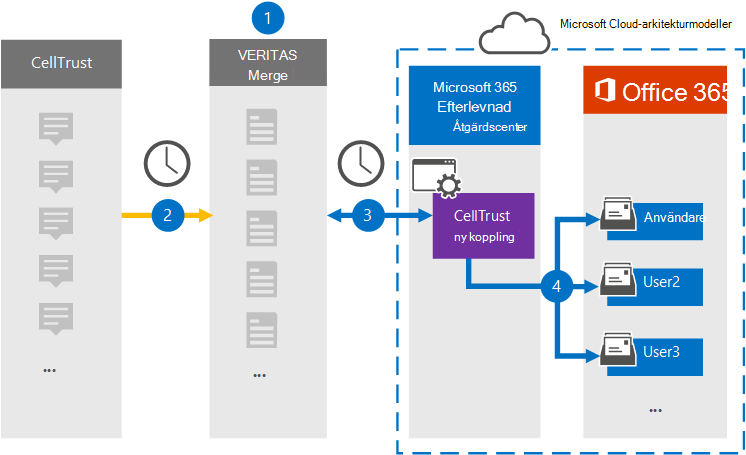

# Konfigurera en koppling för att arkivera CellTrust-data

Använd en Veritas-koppling i Microsoft 365 efterlevnadscenter om du vill importera och arkivera data från CellTrust-plattformen till användarpostlådor i Microsoft 365 organisation. Veritas tillhandahåller en [CellTrust-koppling](https://globanet.com/celltrust/) som samlar objekt från datakällan från tredje part och importerar dessa objekt till Microsoft 365. Kopplingen konverterar innehållet i SMS från CellTrust-konton till ett e-postmeddelandeformat och importerar sedan dessa objekt till användarens postlåda i Microsoft 365.

När CellTrust-data har lagrats i användarnas postlådor kan du använda efterlevnadsfunktioner i Microsoft 365, till exempel Bevarande av juridiska skäl, eDiscovery, bevarandeprinciper och bevarandeetiketter samt kommunikationsefterlevnad. Med en CellTrust-koppling för att importera och arkivera data i Microsoft 365 kan hjälpa din organisation att följa myndighets- och regleringsprinciper.

## Översikt över arkivering av CellTrust-data

Följande översikt förklarar processen med att använda en koppling för att arkivera CellTrust-data i Microsoft 365.

1. Din organisation arbetar med CellTrust för att konfigurera och konfigurera en CellTrust-webbplats.

2. En gång per dygn kopieras CellTrust-objekt till Veritas Merge1-webbplatsen. Kopplingen konverterar också innehållet i ett meddelande till ett e-postmeddelandeformat.

3. Den CellTrust-koppling som du skapar i efterlevnadscentret för Microsoft 365 ansluter till Veritas Merge1-webbplatsen varje dag och överför meddelandena till en säker Azure Storage plats i Microsoft-molnet.

4. Med den automatiska användarmappningen som koppling importeras objekt till  specifika användares postlådor med värdet för egenskapen E-post enligt beskrivningen [i steg 3.](#step-3-map-users-and-complete-the-connector-setup) En undermapp i mappen Inkorgen med namnet **CellTrust** skapas i användarnas postlådor och meddelandeobjekten importeras till den mappen. Kopplingen avgör vilken postlåda som objekt ska importeras till med hjälp av värdet för egenskapen *E-post.* Alla CellTrust-objekt innehåller den här egenskapen, som fylls i med alla deltagares e-postadresser.

## Innan du börjar

- Skapa ett Merge1-konto för Microsoft-kopplingar. Om du vill skapa ett konto kontaktar [du Veritas kundsupport.](https://www.veritas.com/content/support/) Du måste logga in på det här kontot när du skapar kopplingen i steg 1.

- Den användare som skapar CellTrust-kopplingen i steg 1 (och slutför den i steg 3) måste tilldelas rollen Importera och exportera postlåda i Exchange Online. Den här rollen krävs för att lägga till kopplingar **på sidan Datakopplingar** i Microsoft 365 kompatibilitetscenter. Som standard är den här rollen inte tilldelad någon rollgrupp i Exchange Online. Du kan lägga till rollen Importera och exportera postlåda i rollgruppen Organisationshantering i Exchange Online. Du kan också skapa en rollgrupp, tilldela rollen Importera och exportera postlåda och sedan lägga till lämpliga användare som medlemmar. Mer information finns i avsnitten [Skapa rollgrupper](/Exchange/permissions-exo/role-groups#create-role-groups) och [Ändra rollgrupper](/Exchange/permissions-exo/role-groups#modify-role-groups) i artikeln "Hantera rollgrupper i Exchange Online".

## Steg 1: Konfigurera CellTrust-kopplingen

Det första steget är att få åtkomst till **Datakopplingar** i Microsoft 365 och skapa en koppling för CellTrust-data.

1. Gå till [https://compliance.microsoft.com](https://compliance.microsoft.com/) och klicka sedan på **Datakopplingar** \> **CellTrust.**

2. På sidan **med CellTrust-produktbeskrivning** klickar du på **Lägg till koppling.**

3. Klicka på **Acceptera på** sidan **Användningsvillkor.**

4. Ange ett unikt namn som identifierar kopplingen och klicka sedan på **Nästa.**

5. Logga in på ditt Merge1-konto för att konfigurera kopplingen.

## Steg 2: Konfigurera CellTrust-kopplingen på webbplatsen Veritas Merge1

Det andra steget är att konfigurera CellTrust-kopplingen på Veritas Merge1-webbplatsen. Mer information om hur du konfigurerar CellTrust-koppling finns i [Användarhandbok för slå samman1 kopplingar från tredje part.](https://docs.ms.merge1.globanetportal.com/Merge1%20Third-Party%20Connectors%20CellTrust%20User%20Guide%20.pdf)

När du har **klickat &**  på Spara eller & visas sidan Användarmappning i kopplingsguiden i Microsoft 365 kompatibilitetscenter.

## Steg 3: Mappa användare och slutför kopplingskonfigurationen

Om du vill mappa användare och slutföra anslutningen i Microsoft 365 efterlevnadscenter gör du så här:

1. Aktivera automatisk **användarmappning på sidan Mappa CellTrust Microsoft 365 till** användare på sidan Koppla CellTrust-användare till användare. CellTrust-objekten innehåller en egenskap *som kallas E-post,* som innehåller e-postadresser för användare i organisationen. Om kopplingen kan associera den här adressen Microsoft 365 en användare importeras objekten till den användarens postlåda.

2. Klicka **på** Nästa , granska dina inställningar och gå till sidan **Datakopplingar** för att se förloppet för importen för den nya anslutningen.

## Steg 4: Övervaka CellTrust-kopplingen

När du har skapat CellTrust-kopplingen kan du visa anslutningsstatusen Microsoft 365 efterlevnadscenter.

1. Gå till [https://compliance.microsoft.com](https://compliance.microsoft.com/) och klicka på **Datakopplingar** i det vänstra navigeringsfältet.

2. Klicka på **fliken Kopplingar** och välj sedan **CellTrust-koppling** för att visa den utfällliga sidan, som innehåller egenskaper och information om kopplingen.

3. Under **Anslutningsstatus med källa** klickar du på länken Ladda ned **logg** för att öppna (eller spara) statusloggen för kopplingen. Den här loggen innehåller data som har importerats till Microsoft-molnet.

## Kända problem

- För stunden går det inte att importera bifogade filer eller objekt som är större än 10 MB. Stöd för större objekt blir tillgängligt vid ett senare tillfälle.