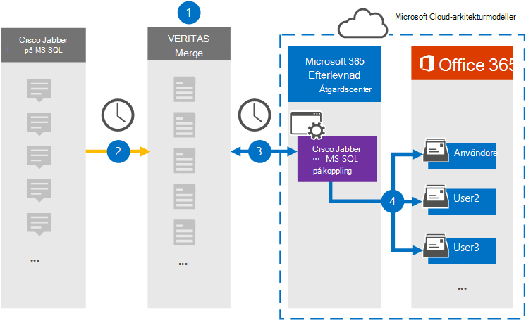

# Konfigurera en koppling för att arkivera Cisco Jabber på MS SQL data

Använd en Veritas-koppling i efterlevnadscentret för Microsoft 365 för att importera och arkivera data från Cisco Jabber-plattformen till användarpostlådor i Microsoft 365 organisation. Veritas ger dig en [Cisco Jabber-koppling](https://globanet.com/jabber/) som är konfigurerad för att spara objekt från Jabber-programmets MS SQL Database, till exempel 1:1-chattmeddelanden och gruppchattar, och sedan importera de objekten till Microsoft 365. Kopplingen hämtar data från Cisco Jabber-användarens MS SQL Database, bearbetar den och innehållet konverteras från en användares Cisco Jabber-konto till ett e-postmeddelandeformat och importerar sedan de objekten till användarens postlåda i Microsoft 365.

När Cisco Jabber-data lagras i användarpostlådor kan du använda efterlevnadsfunktioner för Microsoft 365, till exempel Bevarande av juridiska skäl, eDiscovery, bevarandeprinciper och bevarandeetiketter samt kommunikationsefterlevnad. Genom att använda en Cisco Jabber-koppling för att importera och arkivera data i Microsoft 365 kan din organisation följa myndighets- och regelpolicyer.

## Översikt över arkivering av Cisco Jabber-data

Följande översikt förklarar processen med att använda en koppling för att arkivera Cisco Jabber på MS SQL data i Microsoft 365.

1. Din organisation arbetar med Cisco för att konfigurera och konfigurera en Cisco Jabber på MS SQL Database.

2. En gång per dygn kopieras Cisco Jabber-objekt från MS SQL Database till Veritas Merge1-webbplatsen. Kopplingen omvandlar även innehållet i chattmeddelanden till ett e-postmeddelandeformat.

3. Den Cisco Jabber-koppling som du skapar i kompatibilitetscentret för Microsoft 365 ansluter till Veritas Merge1-webbplatsen varje dag och överför objekten till en säker Azure Storage plats i Microsoft-molnet.

4. Med den automatiska användarmappningen som koppling importeras objekt till  specifika användares postlådor med värdet för egenskapen E-post enligt beskrivningen [i steg 3.](#step-3-map-users-and-complete-the-connector-setup) En undermapp i mappen Inkorgen med namnet **Cisco Jabber** på MS SQL skapas i användarpostlådorna och meddelandeobjekten importeras till den mappen. Kopplingen avgör vilken postlåda som objekt ska importeras till med hjälp av värdet för egenskapen *E-post.* Varje Cisco Jabber-objekt innehåller den här egenskapen, som fylls i med e-postadresserna för varje deltagare.

## Innan du börjar

- Skapa ett Veritas Merge1-konto för Microsoft-kopplingar. Om du vill skapa det här kontot [kontaktar du Veritas kundsupport.](https://www.veritas.com/content/support/) Du loggar in på det här kontot när du skapar kopplingen i steg 1.

- Konfigurera en MS SQL Database att hämta Jabber-objekt från innan du skapar kopplingen i steg 1. Du anger anslutningsinställningarna för MS SQL Database när du konfigurerar Cisco Jabber-kopplingen i steg 2. Mer information finns i [Användarhandbok för koppling](https://docs.ms.merge1.globanetportal.com/Merge1%20Third-Party%20Connectors%20Cisco%20Jabber%20on%20MS%20SQL%20User%20Guide%20.pdf)av kopplingar från tredje part .

- Användaren som skapar Cisco Jabber-kopplingen i steg 1 (och slutför den i steg 3) måste tilldelas rollen Importera och exportera postlåda i Exchange Online. Den här rollen krävs för att lägga till kopplingar **på sidan Datakopplingar** i Microsoft 365 kompatibilitetscenter. Som standard är den här rollen inte tilldelad en rollgrupp i Exchange Online. Du kan lägga till rollen Importera och exportera postlåda i rollgruppen Organisationshantering i Exchange Online. Du kan också skapa en rollgrupp, tilldela rollen Importera och exportera postlåda och sedan lägga till lämpliga användare som medlemmar. Mer information finns i avsnitten [Skapa rollgrupper](/Exchange/permissions-exo/role-groups#create-role-groups) och [Ändra rollgrupper](/Exchange/permissions-exo/role-groups#modify-role-groups) i artikeln "Hantera rollgrupper i Exchange Online".

## Steg 1: Konfigurera Cisco Jabber på MS SQL koppling

Det första steget är att få åtkomst till Datakopplingar i **kompatibilitetscentret** för Microsoft 365 och skapa en koppling för Cisco Jabber på MS SQL data.

1. Gå till [https://compliance.microsoft.com](https://compliance.microsoft.com/) och klicka sedan på **Datakopplingar**  >  **Cisco Jabber på MS SQL**.

2. På sidan **Cisco Jabber på MS SQL** produktbeskrivning klickar du på Lägg till **koppling**.

3. Klicka på **Acceptera på** sidan **Användningsvillkor.**

4. Ange ett unikt namn som identifierar kopplingen och klicka sedan på **Nästa.**

5. Logga in på ditt Merge1-konto för att konfigurera kopplingen.

## Steg 2: Konfigurera Cisco Jabber på MS SQL på Veritas Merge1-webbplatsen

Det andra steget är att konfigurera Cisco Jabber på MS SQL på Veritas Merge1-webbplatsen. Mer information om hur du konfigurerar Cisco Jabber på MS SQL finns i Användarhandbok för Slå [samman1 tredjepartskopplingar.](https://docs.ms.merge1.globanetportal.com/Merge1%20Third-Party%20Connectors%20Cisco%20Jabber%20on%20MS%20SQL%20User%20Guide%20.pdf)

När du har **klickat &**  på Spara eller & visas sidan Användarmappning i kopplingsguiden i Microsoft 365 kompatibilitetscenter.

## Steg 3: Mappa användare och slutför kopplingskonfigurationen

Om du vill mappa användare och slutföra anslutningen i Microsoft 365 efterlevnadscenter gör du så här:

1. Aktivera automatisk **användarmappning på sidan Cisco Jabber** på MS SQL för att Microsoft 365 till användare. Cisco Jabber på MS SQL innehåller egenskapen *Email,* som innehåller e-postadresser för användare i organisationen. Om kopplingen kan associera den här adressen Microsoft 365 en användare importeras objekten till den användarens postlåda.

2. Klicka **på** Nästa , granska dina inställningar och gå till sidan **Datakopplingar** för att se förloppet för importen för den nya anslutningen.

## Steg 4: Övervaka Cisco Jabber-kopplingen

När du har skapat Cisco Jabber på MS SQL-anslutning kan du visa anslutningsstatusen i Microsoft 365 kompatibilitetscenter.

1. Gå till [https://compliance.microsoft.com](https://compliance.microsoft.com) och klicka på **Datakopplingar** i det vänstra navigeringsfältet.

2. Klicka på **fliken Kopplingar** och välj sedan **Cisco Jabber** på MS SQL för att visa den utfällande sidan. Den här sidan innehåller egenskaper och information om kopplingen.

3. Under **Anslutningsstatus med källa** klickar du på länken Ladda ned **logg** för att öppna (eller spara) statusloggen för kopplingen. Den här loggen innehåller data som har importerats till Microsoft-molnet.

## Kända problem

- För stunden går det inte att importera bifogade filer eller objekt som är större än 10 MB. Stöd för större objekt blir tillgängligt vid ett senare tillfälle.
