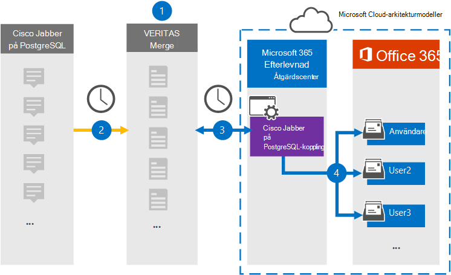

# Konfigurera en koppling för att arkivera Cisco Jabber på PostgreSQL-data (förhandsversion)

Använd en Veritas-koppling i Efterlevnadscenter för Microsoft 365 för att importera och arkivera data från Cisco Jabber-plattformen till användarpostlådor i din Microsoft 365-organisation. Veritas tillhandahåller en [Cisco Jabber på PostgreSQL-koppling](https://www.veritas.com/insights/merge1/jabber) som är konfigurerad för att hämta objekt från tredjepartsdatakällan (regelbundet) och importera dessa objekt till Microsoft 365. Kopplingen omvandlar innehåll som meddelanden, chattar och delat innehåll från Cisco Jabber på PostgreSQL till ett e-postmeddelandeformat och importerar sedan de objekten till användarens postlåda i Microsoft 365.

När Cisco Jabber på PostgreSQL-data lagras i användarpostlådor kan du använda Microsoft 365-efterlevnadsfunktioner, till exempel Bevarande av juridiska skäl, eDiscovery, bevarandeprinciper och bevarandeetiketter. Genom att använda en Cisco Jabber på PostgreSQL-anslutning för att importera och arkivera data i Microsoft 365 kan din organisation följa myndighets- och regelpolicyer.

## Översikt över arkivering av Cisco Jabber på PostgreSQL-data

Följande översikt förklarar processen med att använda en koppling för att arkivera Cisco Jabber på PostgreSQL-data i Microsoft 365.

1. Din organisation arbetar med Cisco Jabber på PostgreSQL för att konfigurera en Cisco Jabber på PostgreSQL-webbplats.

2. En gång per dygn kopieras Cisco Jabber på PostgreSQL-objekt till Webbplatsen Veritas Merge1. Kopplingen konverterar även Cisco Jabber på PostgreSQL-objekt till ett e-postmeddelandeformat.

3. Cisco Jabber på PostgreSQL-anslutning som du skapar i Microsoft 365-efterlevnadscentret, ansluter till Veritas Merge1-webbplatsen varje dag och överför Jabber-innehållet till en säker Azure-lagringsplats i Microsoft-molnet.

4. Kopplingen importerar de konverterade objekten till postlådorna  för specifika användare med värdet för egenskapen E-post för den automatiska användarmappningen enligt beskrivningen [i steg 3.](#step-3-map-users-and-complete-the-connector-setup) En undermapp i mappen Inkorgen med namnet **Cisco Jabber på PostgreSQL** skapas i användarpostlådorna och objekt importeras till den mappen. Kopplingen gör detta med hjälp av värdet för egenskapen *E-post.* Alla Jabber-objekt innehåller den här egenskapen, som fylls i med e-postadresserna för alla deltagare i objektet.

## Innan du börjar

- Skapa ett Merge1-konto för Microsoft-kopplingar. Om du vill göra detta kontaktar [du Veritas kundsupport.](https://www.veritas.com/content/support/en_US) Du måste logga in på det här kontot när du skapar kopplingen i steg 1.

- Användaren som skapar Cisco Jabber på PostgreSQL-kopplingen i steg 1 (och slutför den i steg 3) måste tilldelas rollen Importera och exportera postlåda i Exchange Online. Den här rollen krävs för att lägga till kopplingar på sidan Datakopplingar i **efterlevnadscentret** för Microsoft 365. Som standard är den här rollen inte tilldelad någon rollgrupp i Exchange Online. Du kan lägga till rollen Importera och exportera postlåda i rollgruppen Organisationshantering i Exchange Online. Du kan också skapa en rollgrupp, tilldela rollen Importera och exportera postlåda och sedan lägga till lämpliga användare som medlemmar. Mer information finns i avsnitten [Skapa rollgrupper](https://docs.microsoft.com/Exchange/permissions-exo/role-groups#create-role-groups) [och Ändra rollgrupper](https://docs.microsoft.com/Exchange/permissions-exo/role-groups#modify-role-groups) i artikeln "Hantera rollgrupper i Exchange Online".

## Steg 1: Konfigurera Cisco Jabber på PostgreSQL-koppling

Det första steget är att få åtkomst till sidan Datakopplingar i **Efterlevnadscenter** för Microsoft 365 och skapa en koppling för Jabber-data.

1. Gå till <https://compliance.microsoft.com> och klicka sedan på **Datakopplingar** &gt; **Cisco Jabber på PostgreSQL**.

2. Klicka på **Lägg till koppling på sidan för Cisco Jabber på PostgreSQL-produktbeskrivning.** 

3. Klicka på **Acceptera på** sidan **Användningsvillkor.**

4. Ange ett unikt namn som identifierar kopplingen och klicka sedan på **Nästa.**

5. Logga in på ditt Merge1-konto för att konfigurera kopplingen.

## Steg 2: Konfigurera Cisco Jabber på PostgreSQL på Veritas Merge1-webbplatsen

Det andra steget är att konfigurera Cisco Jabber på PostgreSQL-kopplingen på Veritas Merge1-webbplatsen. Mer information om hur du konfigurerar Cisco Jabber på PostgreSQL-koppling finns i Användarhandbok för Slå [samman1 tredjepartskopplingar](https://docs.ms.merge1.globanetportal.com/Merge1%20Third-Party%20Connectors%20Cisco%20Jabber%20on%20PostgreSQL%20User%20Guide.pdf).

När du klickar **& på** Slutför  visas sidan Användarmappning i kopplingsguiden i efterlevnadscentret för Microsoft 365.

## Steg 3: Mappa användare och slutför kopplingskonfigurationen

Om du vill mappa användare och slutföra anslutningskonfigurationen i efterlevnadscentret för Microsoft 365 gör du så här:

1. På sidan **Map Cisco Jabber på PostgreSQL-användare till Microsoft 365-användare** aktiverar du automatisk användarmappning. Cisco Jabber på PostgreSQL-objekt inkluderar en egenskap som kallas *Email*, som innehåller e-postadresser för användare i organisationen. Om kopplingen kan associera den här adressen med en Microsoft 365-användare importeras objekten till den användarens postlåda.

2. Klicka **på** Nästa, granska dina inställningar och gå sedan till sidan **Datakopplingar** för att se förloppet för importen för den nya anslutningen.

## Steg 4: Övervaka Cisco Jabber på PostgreSQL-koppling

När du har skapat Cisco Jabber på PostgreSQL-anslutning kan du visa anslutningsstatus i Efterlevnadscenter för Microsoft 365.

1. Gå till <https://compliance.microsoft.com/> och klicka på **Datakopplingar** i det vänstra navigeringsfältet.

2. Klicka på **fliken Kopplingar** och välj sedan Cisco Jabber på **PostgreSQL-kopplingen** för att visa den utfällbara sidan, som innehåller egenskaper och information om kopplingen.

3. Under **Anslutningsstatus med källa** klickar du på länken Ladda ned **logg** för att öppna (eller spara) statusloggen för kopplingen. Den här loggen innehåller data som har importerats till Microsoft-molnet.

## Kända problem

- För närvarande stöder vi inte import av bifogade filer eller objekt som är större än 10 MB men stöd för större objekt kommer att vara tillgängligt vid ett senare tillfälle.
