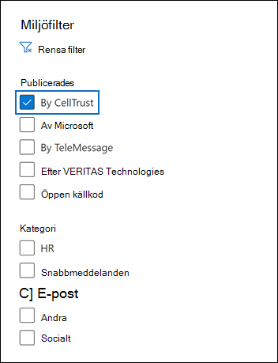

# Arkivera data från CellTrust SL2 till Microsoft 365 (förhandsversion)Archive data from CellTrust SL2 to Microsoft 365 (preview)

CellTrust SL2 samlar in mobilkommunikationsdata och integrerar med den inledande arkiveringsteknikern för att uppfylla kraven för elektronisk upptäckt för bestämmelser som FINRA, HIPAA, FOIA och TCPA.CellTrust SL2 captures mobile communications data and integrates with the leading archiving technologies to meet the electronic discovery requirements for regulations such as FINRA, HIPAA, FOIA, and TCPA. SL2 Data Connector importerar mobila kommunikationsobjekt till Microsoft 365.The SL2 Data Connector imports mobile communication items to Microsoft 365. I den här artikeln beskrivs processen för integrering av SL2 med Microsoft 365 med hjälp av CellTrust SL2 Data Connector för arkivering.This article describes the process for integrating SL2 with Microsoft 365 by using the CellTrust SL2 Data Connector for archiving. Om du slutför den här processen förutsätts det att du prenumererar på CellTrust SL2-tjänsten och känner till SL2-arkitekturen.Completing this process assumes that you have subscribed to CellTrust SL2 service and are familiar with the SL2 architecture. Mer information om SL2 finns i <www.celltrust.com>.For information about SL2, see <www.celltrust.com>.

När data har importerats till användarnas postlådor i Microsoft 365 kan du använda efterlevnadsfunktioner i Microsoft 365, till exempel Bevarande av juridiska skäl, eDiscovery, Microsoft 365 bevarandeprinciper och kommunikationsefterlevnad.After data is imported to user mailboxes in Microsoft 365, you can apply Microsoft 365 compliance features such as Litigation Hold, eDiscovery, Microsoft 365 retention policies, and communication compliance. Med hjälp av CellTrust SL2 Data Connector för att importera och arkivera data i Microsoft 365 kan hjälpa din organisation att följa myndighets- och regelpolicyer.Using the CellTrust SL2 Data Connector to import and archive data in Microsoft 365 can help your organization stay compliant with government and regulatory policies.

## Översikt över arkivering med CellTrust SL2 Data ConnectorOverview of archiving with the CellTrust SL2 Data Connector

På CellTrusts SL2-plattform samlas kommunikationsdata från flera källor in.CellTrust's SL2 platform captures communication data from multiple sources. SL2-datakällor är antingen Person till person (P2P) eller Program-till-person (A2P).SL2 data sources are either Person-to-Person (P2P) or Application-to-Person (A2P). Processen som beskrivs i den här artikeln gäller endast P2P-datakällor.The process described in this article pertains only to P2P data sources. För alla P2P-datakällor är minst en part i samarbetet en SL2-användare som prenumererar på SL2-tjänsten.For all P2P data sources, at least one party in the collaboration is an SL2 user who is subscribed to the SL2 service. Följande översikt förklarar processen med att använda CellTrust SL2 Data Connector i Microsoft 365.The following overview explains the process of using the CellTrust SL2 Data Connector in Microsoft 365.

1. SL2-användare skickar och tar emot data till och från SL2-tjänster i Microsoft Azure molnet.SL2 users send and receive data to and from SL2 services in the Microsoft Azure cloud.

2. Organisationen har en SL2-domän i CellTrusts SL2-molntjänstmiljö.Your organization has an SL2 domain in CellTrust's SL2 Cloud Service environment. Din domän kan ha en eller flera organisationsenheter (OUs).Your domain may have one or more organizational units (OUs). SL2-molntjänsten överför dina data till ett mycket säkert område på Microsoft Azure-plattformen, så att dina data aldrig lämnar Microsoft Azure miljön.The SL2 Cloud Service transfers your data to a highly secure area in the Microsoft Azure platform, so that your data never leaves the Microsoft Azure environment. Beroende på DITT SL2-abonnemang (Enterprise, SMB eller Government) är din domän antingen värd för Microsoft Azure Global eller Microsoft Azure Government.Depending on your SL2 plan (Enterprise, SMB, or Government), your domain is either hosted on Microsoft Azure Global or Microsoft Azure Government.

3. När du har skapat CellTrust SL2 Data Connector, din domän och OUs (oavsett SL2-plan), kan du börja skicka data till Microsoft 365.After you create the CellTrust SL2 Data Connector, your domain and OUs (regardless of your SL2 plan), begin sending data to Microsoft 365. Datafeeden struktureras för att stödja rapportering baserat på datakällor, OUs eller själva domänen.The data feed is structured to support reporting based on data sources, OUs, or the domain by itself. Din organisation behöver därför bara en koppling för att mata alla datakällor för att Microsoft 365.As a result, your organization needs only one connector to feed all your data sources to Microsoft 365.

4. Kopplingen skapar en mapp under varje mappad användare med en Office 365 licens med namnet **CellTrust SL2.**The connector creates a folder under each mapped user with an appropriate Office 365 license titled **CellTrust SL2**. Den här mappningen ansluter en CellTrust SL2-användare till en Office 365 postlåda med hjälp av en e-postadress.This mapping connects a CellTrust SL2 user to an Office 365 mailbox by using an email address. Om ett användar-ID i CellTrust SL2 inte överensstämmer Office 365, arkiveras inte användarens data.If a user ID in CellTrust SL2 has no match in Office 365, the user's data will not be archived.

## Innan du skapa en kopplingBefore you set up a connector

- Kontrollera att du har en domän i cellTrust SL2-molntjänstmiljön.Verify that you have a domain in the CellTrust SL2 cloud service environment. Kontakta CellTrust om du vill ha mer information om hur du skaffar en produktions- eller utvärderingsversion av [EN SL2-domän.](https://www.celltrust.com/contact-us/#form)For additional information on obtaining a production or trial SL2 domain, [Contact CellTrust](https://www.celltrust.com/contact-us/#form).

- Skaffa autentiseringsuppgifterna för att få åtkomst till administratörskontot för SL2-domänen.Obtain the credentials to access the administrator account for your SL2 domain.

- Den användare som skapar datakopplingen CellTrust SL2 i steg 1 (och slutför den i steg 3) måste tilldelas rollen Importera och exportera postlåda i Exchange Online.The user who creates the CellTrust SL2 data connector in Step 1 (and completes it in Step 3) must be assigned to the Mailbox Import Export role in Exchange Online. Den här rollen krävs för att lägga till kopplingar **på sidan Datakopplingar** i Microsoft 365 Efterlevnadscenter.This role is required to add connectors on the **Data connectors** page in the Microsoft 365 compliance center. Som standard är den här rollen inte tilldelad en rollgrupp i Exchange Online.By default, this role is not assigned to a role group in Exchange Online. Du kan lägga till rollen Importera och exportera postlåda i rollgruppen Organisationshantering i Exchange Online.You can add the Mailbox Import Export role to the Organization Management role group in Exchange Online. Du kan också skapa en rollgrupp, tilldela rollen Importera och exportera postlåda och sedan lägga till lämpliga användare som medlemmar.Or you can create a role group, assign the Mailbox Import Export role, and then add the appropriate users as members. Mer information finns i avsnitten [Skapa rollgrupper](/Exchange/permissions-exo/role-groups#create-role-groups) och [Ändra rollgrupper](/Exchange/permissions-exo/role-groups#modify-role-groups) i artikeln "Hantera rollgrupper i Exchange Online".For more information, see the [Create role groups](/Exchange/permissions-exo/role-groups#create-role-groups) or [Modify role groups](/Exchange/permissions-exo/role-groups#modify-role-groups) sections in the article "Manage role groups in Exchange Online".

## Steg 1: Skapa en CellTrust SL2-kopplingStep 1: Create a CellTrust SL2 connector

Det första steget är att skapa en datakoppling i Microsoft 365 Efterlevnadscenter.The first step is to create a data connector in the Microsoft 365 compliance center.

1. Gå till <https://compliance.microsoft.com> och klicka **på Datakopplingar** i det vänstra navigeringsfönstret.Go to <https://compliance.microsoft.com> and click **Data connectors** on the left navigation pane.

2. Klicka på **Filter** på fliken **Översikt,** välj **Efter CellTrust** och använd sedan filtret.On the **Overview** tab, click **Filter** and select **By CellTrust**, and then apply the filter.

   

3. Klicka **på CellTrust SL2 (förhandsversion**).Click **CellTrust SL2 (preview**).

4. På sidan **CellTrust SL2 (förhandsversion**) produktbeskrivning klickar du på **Lägg till koppling**.On the **CellTrust SL2 (preview**) product description page, click **Add connector**.

5. Klicka på **Acceptera på** sidan **Användningsvillkor.**On the **Terms of service** page, click **Accept**.

6. Ange ett unikt namn som identifierar kopplingen och klicka sedan på **Nästa.**Enter a unique name that identifies the connector and then click **Next**. Det namn du anger identifierar kopplingen på sidan **Datakopplingar** när du har skapat den.The name you enter will identify the connector on the **Data connectors** page after you create it.

7. På sidan **Logga in på ditt CellTrust-konto** klickar du på Logga in på **CellTrust.**On the **Sign in to your CellTrust account** page, click **Sign into CellTrust**. Du omdirigeras till **CellTrust-portalen för Microsoft 365** i ett nytt webbläsarfönster.You'll be redirected to the **CellTrust Portal for Microsoft 365** in a new browser window.

## Steg 2: Välj de domäner eller OUs som ska arkiverasStep 2: Select the domains or OUs to archive

Nästa steg är att logga in på ett administratörskonto för din CellTrust SL2-domän och välja de domäner och OUs som ska arkiveras i Microsoft 365.The next step is to sign into an administrator account for your CellTrust SL2 domain and select the domains and OUs to archive in Microsoft 365.

1. På sidan CellTrust **Microsoft 365 Connector** väljer du din miljö i SL2-molntjänsten för att visa en inloggningssida.On the CellTrust **Microsoft 365 Connector** page, select your environment in the SL2 cloud service to display a sign-in page.

   Vanligtvis bör du se ett alternativ som representerar din miljö.Typically, you should see one option representing your environment. Men om du har domäner i fler än en miljö visas alternativ för varje miljö.However, if you have domains in more than one environment, you will see options for each environment. När du har gör ett val omdirigeras du till inloggningssidan för SL2.After you make a selection, you'll be redirected to the SL2 login page.

2. Logga in med autentiseringsuppgifterna för domänen eller OU-administratörskontot.Sign in with your Domain or OU Administrator account credentials.

   Om du loggar in som SL2-domänadministratör ser du namnet på din domän och OUs i den domänen.If you sign in as an SL2 domain administrator, you will see the name of your domain and the OUs in that domain. Om du inte har OUs visas bara namnet på din domän.If you do not have OUs, you only see the name of your domain. Om du loggar in som OU-administratör visas bara namnet på OU-enheten.If you log in as OU Administrator, you only see the name of your OU.

3. Aktivera de affärsenheter som du vill arkivera.Enable the business units you wish to archive. Om du väljer domänen markeras inte de OUs automatiskt.Selecting the domain will not automatically select the OUs. Du måste aktivera varje OU separat för att arkivera den.You must enable each OU separately to archive it.

   

4. När du är klar med dina val stänger du webbläsarfönstret och återgår till guidesidan i Microsoft 365 Efterlevnadscenter.When you're finished with your selections, close the browser window and return to the wizard page in Microsoft 365 compliance center. Efter några sekunder går guiden automatiskt vidare till nästa steg i mappningen av användare.After a few seconds, the wizard automatically advances to the next step of mapping users.

## Steg 3: Mappa användare och slutför kopplingskonfigurationenStep 3: Map users and complete the connector setup

Det sista steget är att mappa användare och slutföra kopplingskonfigurationen i Microsoft 365 Efterlevnadscenter.The last step is to map users and complete the connector setup in the Microsoft 365 compliance center.

1. På sidan **Användarmappning** markerar du Aktivera automatisk **användarmappning** om e-postadressen för användare är densamma i både SL2 och Microsoft 365.On the **User mapping** page, select **Enable automatic user mapping** if the email address for users is the same in both SL2 and  Microsoft 365. Annars bör du manuellt använda e-postadresser genom att ladda upp en CSV-fil som mappar användarnas SL2-adress till Microsoft 365 adress.Otherwise, you should manually user email addresses by uploading a CSV file that maps users' SL2 address to their Microsoft 365 address.

2. Klicka **på** Nästa, granska dina inställningar och klicka sedan **på Slutför** för att skapa kopplingen.Click **Next**, review your settings, and then click **Finish** to create the connector.

   Den nya kopplingen läggs till i listan på **sidan Datakopplingar.**The new connector is added to the list on the **Data connectors** page.

## Få hjälp från CellTrustGet help from CellTrust

Mer information om hur du kontaktar CellTrust finns på sidan [CellTrust](https://www.celltrust.com/contact-us/#support) Kundsupport om du vill ha hjälp med att konfigurera en CellTrust SL2-datakoppling.See the [CellTrust Customer Support page](https://www.celltrust.com/contact-us/#support) for details about contacting CellTrust for help with setting up a CellTrust SL2 data connector.

## Mer informationMore information

- En domänadministratör kan konfigurera en koppling för domänen eller andra OUs i den domänen.A domain administrator can set up a connector for the domain or any OUs in that domain. Om du använder OU-administratörskontot kan du bara konfigurera en koppling för den specifika OU:n.If you use the OU Administrator account, you can only set up a connector for that specific OU.

- För att genomföra stegen ovan måste du vara tilldelad en licens Microsoft 365 E5 och ha rätt Microsoft Office administratörsrättigheter.To successfully complete the steps above, you must be assigned a Microsoft 365 E5 license and have the proper Microsoft Office admin rights.

- Testa den nya anslutningen genom att skicka ett sms med hjälp av SL2-mobilappen eller från SL2-portalen.To test the new connector, send a text message using your SL2 mobile app or from your SL2 portal. Gå till Microsoft 365 postlådan och öppna **mappen CellTrust SL2** i inkorgen.Go to your Microsoft 365 mailbox and open the **CellTrust SL2** folder in your Inbox. Det kan ta några minuter innan sms:et visas i postlådan.It may take a few minutes for the text messages to show up in your mailbox.

- Många lagar och bestämmelser kräver att elektronisk kommunikation bevaras på ett sådant sätt att den, när den begärs, kan produceras som bevis.Many laws and regulations require electronic communication to be preserved in such a way that, when requested, it can be produced as evidence. E-dataidentifiering används för att producera elektronisk kommunikation.Electronic Discovery (eDiscovery) is used to comply with the production of electronic communication. EIA-lösningar (Enterprise Information Archiving) är utformade för att utföra eDiscovery och tillhandahåller funktioner som bevarandeprinciphantering, dataklassificering och innehålls överseende.Enterprise Information Archiving (EIA) solutions are designed to perform eDiscovery, and provide features such as retention policy management, data classification, and content supervision. Microsoft 365 en långsiktig bevarandelösning för att följa bestämmelser och standarder som påverkar organisationen.Microsoft 365 offers a long-term retention solution for compliance with the regulations and standards that affect your organization.

- Termen *arkivering som* används i det här dokumentet refererar till arkivering i samband med användning i en EIA-lösning (Enterprise Information Archiving).The term *archiving* as used in this document refers to archiving in the context of use within an Enterprise Information Archiving (EIA) solution. EIA-lösningar har eDiscovery-funktioner som skapar dokument för rättstvist, rättstvist, granskningar och undersökningar.EIA solutions have eDiscovery features that produce documents for legal proceedings, litigation, audits, and investigations. Arkivering i samband med säkerhetskopiering och återställning som används för katastrofåterställning och affärskontinuering är inte den avsedda användningen av termen i det här dokumentet.Archiving in the context of backup and restore used for disaster recovery and business continuity isn't the intended use of the term within this document.
