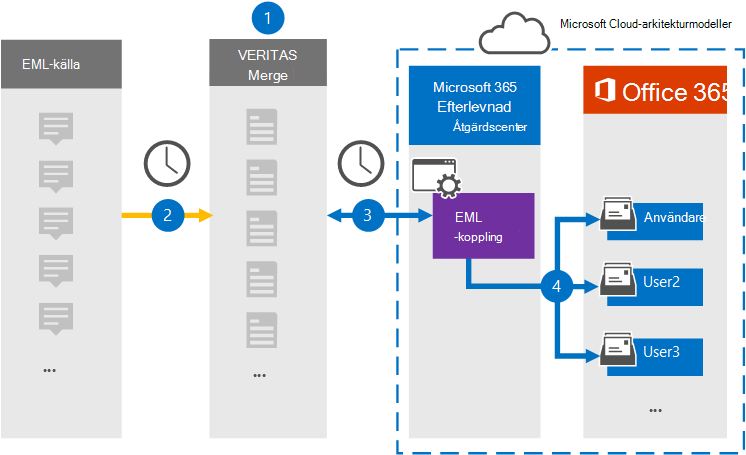

# Konfigurera en koppling för att arkivera EML-data

Använd en Veritas-koppling i Microsoft 365 efterlevnadscenter om du vill importera och arkivera EML-data till användarpostlådor i Microsoft 365 organisation. EML är filtillägget för ett e-postmeddelande som sparats i en fil. Kopplingen konverterar innehållet i ett objekt från källformatet till ett e-postmeddelandeformat och importerar sedan objektet till en användarpostlåda.

När EML-meddelanden lagras i användarnas postlådor kan du tillämpa efterlevnadsfunktioner i Microsoft 365, till exempel Bevarande av juridiska skäl, eDiscovery, och bevarandeprinciper och bevarandeetiketter. Om du använder en EML-anslutning för att importera och arkivera data i Microsoft 365 kan hjälpa din organisation att följa myndighets- och regelpolicyer.

## Översikt över arkivering av EML-data

Följande översikt förklarar processen med att använda en koppling för att arkivera EML-data i Microsoft 365.

1. Din organisation arbetar med EML-källan för att konfigurera och konfigurera en EML-webbplats.

2. En gång per dygn kopieras innehållsobjekt från EML-källan till webbplatsen Veritas Merge1. Under den här processen konverteras innehållet i en EML-fil till ett e-postmeddelandeformat.

3. Den EML-koppling som du skapar i kompatibilitetscentret för Microsoft 365, ansluter till Veritas Merge1-webbplatsen varje dag och överför meddelandena till en säker Azure Storage plats i Microsoft-molnet.

4. Kopplingen importerar de konverterade meddelandeobjekten till postlådorna  för specifika användare med värdet för e-postegenskapen för den automatiska användarmappningsprocessen som beskrivs i [steg 3.](#step-3-map-users-and-complete-the-connector-setup) Under processen skapas en undermapp i inkorgen som heter **EML** i användarnas postlådor och EML-objekten importeras till den mappen. Kopplingen avgör vilken postlåda som objekt ska importeras till med hjälp av värdet för egenskapen *E-post.* Alla meddelanden innehåller den här egenskapen, som fylls i med e-postadressen till alla deltagare i innehållsobjektet.

## Innan du börjar

- Skapa ett Veritas Merge1-konto för Microsoft-kopplingar. Om du vill skapa ett konto kontaktar [du Veritas kundsupport.](https://globanet.com/ms-connectors-contact) Du loggar in på det här kontot när du skapar kopplingen i steg 1.

- Den användare som skapar EML-kopplingen i steg 1 (och slutför den i steg 3) måste tilldelas rollen Importera och exportera postlåda i Exchange Online. Den här rollen krävs för att lägga till kopplingar **på sidan Datakopplingar** i Microsoft 365 kompatibilitetscenter. Som standard är den här rollen inte tilldelad en rollgrupp i Exchange Online. Du kan lägga till rollen Importera och exportera postlåda i rollgruppen Organisationshantering i Exchange Online. Du kan också skapa en rollgrupp, tilldela rollen Importera och exportera postlåda och sedan lägga till lämpliga användare som medlemmar. Mer information finns i avsnitten [Skapa rollgrupper](/Exchange/permissions-exo/role-groups#create-role-groups) och [Ändra rollgrupper](/Exchange/permissions-exo/role-groups#modify-role-groups) i artikeln "Hantera rollgrupper i Exchange Online".

## Steg 1: Konfigurera en EML-koppling

Det första steget är att få åtkomst till sidan **Datakopplingar** i Microsoft 365 och skapa en koppling för EML-data.

1. Gå till [https://compliance.microsoft.com](https://compliance.microsoft.com/) och klicka sedan på **Datakopplingar**  >  **EML.**

2. Klicka på Lägg till koppling på sidan för **EML-produktbeskrivning.** 

3. Klicka på **Acceptera på** sidan **Användningsvillkor.**

4. Ange ett unikt namn som identifierar kopplingen och klicka sedan på **Nästa.**

5. Logga in på ditt Merge1-konto för att konfigurera kopplingen.

## Steg 2: Konfigurera EML-kopplingen på Veritas Merge1-webbplatsen

Det andra steget är att konfigurera EML-kopplingen på Veritas Merge1-webbplatsen. Mer information om hur du konfigurerar EML-kopplingen finns i [Användarhandbok för slå samman1 kopplingar från tredje part.](https://docs.ms.merge1.globanetportal.com/Merge1%20Third-Party%20Connectors%20EML%20User%20Guide%20.pdf)

När du har **klickat &**  på Spara eller & visas sidan Användarmappning i kopplingsguiden i Microsoft 365 kompatibilitetscenter.

## Steg 3: Mappa användare och slutför kopplingskonfigurationen

Om du vill mappa användare och slutföra anslutningskonfigurationen i Microsoft 365 efterlevnadscenter gör du så här:

1. På sidan **Mappa externa användare till Microsoft 365 aktiverar** du automatisk användarmappning. Källobjekten i EML innehåller egenskapen *E-post,* som innehåller e-postadresser för användare i organisationen. Om kopplingen kan associera den här adressen Microsoft 365 en användare importeras EML-objekten till den användarens postlåda.

2. Klicka **på** Nästa, granska dina inställningar och gå sedan till sidan **Datakopplingar** för att se förloppet för importen för den nya anslutningen.

## Steg 4: Övervaka EML-kopplingen

När du har skapat EML-kopplingen kan du visa anslutningsstatusen i Microsoft 365 kompatibilitetscenter.

1. Gå till [https://compliance.microsoft.com](https://compliance.microsoft.com) och klicka på **Datakopplingar** i det vänstra navigeringsfältet.

2. Klicka på **fliken Kopplingar och** välj sedan **EML-kopplingen för** att visa den utfällbara sidan. Den här sidan innehåller egenskaper och information om kopplingen.

3. Under **Anslutningsstatus med källa** klickar du på länken Ladda ned **logg** för att öppna (eller spara) statusloggen för kopplingen. Den här loggen innehåller information om de data som har importerats till Microsoft-molnet.

## Kända problem

- För stunden går det inte att importera bifogade filer eller objekt som är större än 10 MB. Stöd för större objekt blir tillgängligt vid ett senare tillfälle.