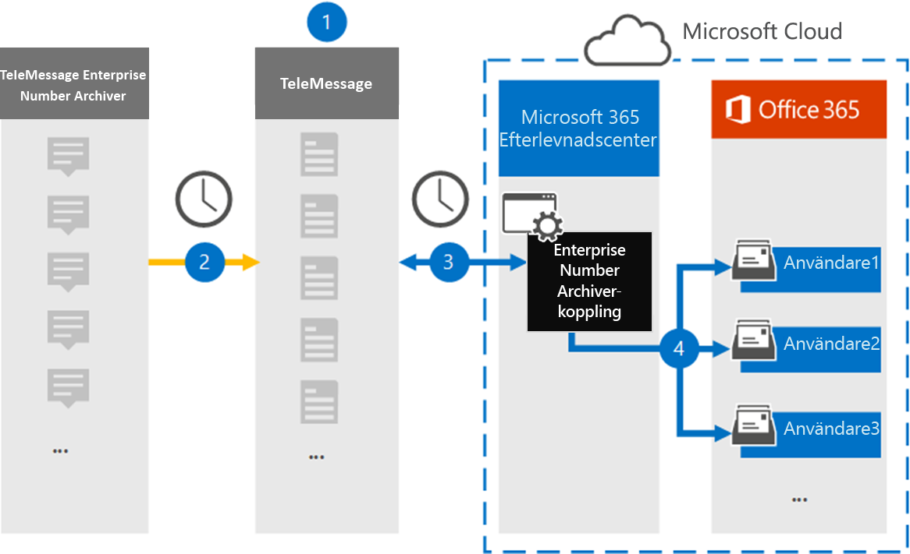

# Konfigurera en koppling för att arkivera data för företagsnummer

Använd en TeleMessage-koppling i efterlevnadscentret för Microsoft 365 för att importera och arkivera kortmeddelandetjänst (SMS) och MMS-meddelanden (Multimedia Messaging Service), chattmeddelanden, röstsamtalsinspelningar och röstsamtalsloggar från Enterprise Number Archiver. När du har konfigurerat och konfigurerat en anslutning ansluts den till organisationens TeleMessage-konto en gång om dagen och importerar mobilkommunikationsdata för anställda med hjälp av TeleMessage Enterprise Number Archiver till postlådor i Microsoft 365.

När TeleMessage Enterprise Number Archiver-kopplingens data har lagrats i användarnas postlådor kan du använda efterlevnadsfunktioner i Microsoft 365, till exempel Bevarande av juridiska skäl, Innehållssökning, In-Place Arkivering, Granskning, Kommunikationsefterlevnad och Microsoft 365-bevarandeprinciper för data i företagsnummerarkivering. Du kan till exempel söka i TeleMessage Enterprise Number Archiver SMS, MMS och röstsamtal med innehållssökning eller associera postlådan som innehåller data för Enterprise Number Archiver-kopplingen med en användare i ett Advanced eDiscovery fall. Om du använder en enterprise number archiver-koppling för att importera och arkivera data i Microsoft 365 kan hjälpa din organisation att följa myndighets- och regelpolicyer.

## Översikt över arkivering av företagsnummerdata

I följande översikt beskrivs hur du använder en koppling för att arkivera data i Enterprise Network Microsoft 365.

1. Din organisation arbetar med TeleMessage för att konfigurera en anslutning för Enterprise Number Archiver. Mer information finns [här](https://www.telemessage.com/office365-activation-for-enterprise-number-archiver/).

2. Kopplingen för Enterprise Number Archiver som du skapar i efterlevnadscentret för Microsoft 365 ansluter till TeleMessage-webbplatsen varje dag och överför e-postmeddelanden från de föregående 24 timmarna till ett säkert Azure Storage område i Microsoft Cloud.

3. Kopplingen importerar mobila kommunikationsobjekt till en viss användares postlåda. En ny mapp med namnet Enterprise Number Archiver skapas i den specifika användarens postlåda och objekten importeras till den. Kopplingen mappar med hjälp av värdet för *användarens e-postadressegenskap.* Alla e-postmeddelanden innehåller den här egenskapen, som fylls i med e-postadresserna för alla deltagare i e-postmeddelandet. Förutom automatisk användarmappning med värdet  för användarens e-postadressegenskap kan du också definiera en anpassad mappning genom att ladda upp en CSV-mappningsfil. Den här mappningsfilen ska innehålla användarens mobilnummer och motsvarande e Microsoft 365 postlådeadress för varje användare. Om du aktiverar automatisk användarmappning och tillhandahåller en anpassad mappning kommer kopplingen först att titta på anpassad mappningsfil för varje e-postobjekt. Om anslutaren inte hittar en giltig Microsoft 365-användare som motsvarar en användares mobilnummer använder kopplingen användarens e-postadressegenskap för e-postobjektet. Om kopplingen inte hittar en giltig Microsoft 365-användare i antingen  den anpassade mappningsfilen eller användarens e-postadressegenskap för e-postobjektet, importeras inte objektet.

## Innan du skapa en koppling

Några av de implementeringssteg som krävs för att arkivera data i enterprisenummerarkivering är externa till Microsoft 365 och måste slutföras innan du kan skapa anslutningen i efterlevnadscentret.

- Beställ [arkiveringstjänsten för enterprisenummer från TeleMessage](https://www.telemessage.com/mobile-archiver/order-mobile-archiver-for-o365) och få ett giltigt administrationskonto för din organisation. Du måste logga in på det här kontot när du skapar anslutningen i efterlevnadscentret.

- Registrera alla användare som kräver arkivering av Enterprise Number SMS/MMS Network i TeleMessage-kontot. Se till att använda samma e-postadress som används för användarens konto när du registrerar Microsoft 365 användare.

- Installera och aktivera appen TeleMessage Enterprise Number Archiver på dina anställdas mobiltelefoner.

- Den användare som skapar en Enterprise Number Archiver-koppling måste tilldelas rollen Importera och exportera postlåda i Exchange Online. Detta krävs för att lägga till kopplingar på **sidan Datakopplingar** i Microsoft 365 kompatibilitetscenter. Som standard är den här rollen inte tilldelad någon rollgrupp i Exchange Online. Du kan lägga till rollen Importera och exportera postlåda i rollgruppen Organisationshantering i Exchange Online. Du kan också skapa en rollgrupp, tilldela rollen Importera och exportera postlåda och sedan lägga till lämpliga användare som medlemmar. Mer information finns i avsnitten [Skapa rollgrupper](/Exchange/permissions-exo/role-groups#create-role-groups) och [Ändra rollgrupper](/Exchange/permissions-exo/role-groups#modify-role-groups) i artikeln "Hantera rollgrupper i Exchange Online".

- Den här datakopplingen är tillgänglig GCC miljöer i Microsoft 365 för myndigheter i USA. Program och tjänster från tredje part kan innebära att lagra, överföra och bearbeta din organisations kunddata i tredje parts system som ligger utanför Microsoft 365-infrastrukturen och därför inte omfattas av Microsoft 365-åtaganden gällande efterlevnad och dataskydd. Microsoft anger inte att användningen av den här produkten för att ansluta till program från tredje part innebär att sådana program från tredje part är FEDRAMP-kompatibla.

## Skapa en Enterprise Number Archiver-koppling

När du har slutfört kraven som beskrivs i föregående avsnitt kan du skapa en Enterprise Number Archiver-koppling i Microsoft 365 efterlevnadscenter. Kopplingen använder den information du uppger för att ansluta till TeleMessage-webbplatsen och överföra SMS, MMS och röstsamtal till motsvarande postlåderutor för användare i Microsoft 365.

1. Gå till [https://compliance.microsoft.com](https://compliance.microsoft.com/) och klicka sedan på **Datakopplingar** \> **Enterprise Number Archiver**.

2. Klicka på **Lägg till koppling på** produktbeskrivningssidan för **företagsnummerarkivering**

3. Klicka på **Acceptera på** sidan **Användningsvillkor.**

4. På sidan **Logga in på TeleMessage,** under Steg 3, anger du den information som krävs i följande rutor och klickar sedan på **Nästa.**

   - **Användarnamn:** Ditt TeleMessage-användarnamn.

   - **Lösenord:** Ditt TeleMessage-lösenord.

5. När kopplingen har skapats kan du stänga popup-fönstret och gå till nästa sida.

6. Aktivera automatisk **användarmappning** på sidan Användarmappning. Om du vill aktivera anpassad mappning laddar du upp en CSV-fil som innehåller användarmappningsinformationen och klickar sedan på **Nästa.**

7. Granska inställningarna och klicka sedan på **Slutför för** att skapa kopplingen.

8. Gå till fliken Kopplingar på sidan **Datakopplingar** för att se importprocessen för den nya kopplingen.

## Kända problem

- För stunden går det inte att importera bifogade filer eller objekt som är större än 10 MB. Stöd för större objekt blir tillgängligt vid ett senare tillfälle.