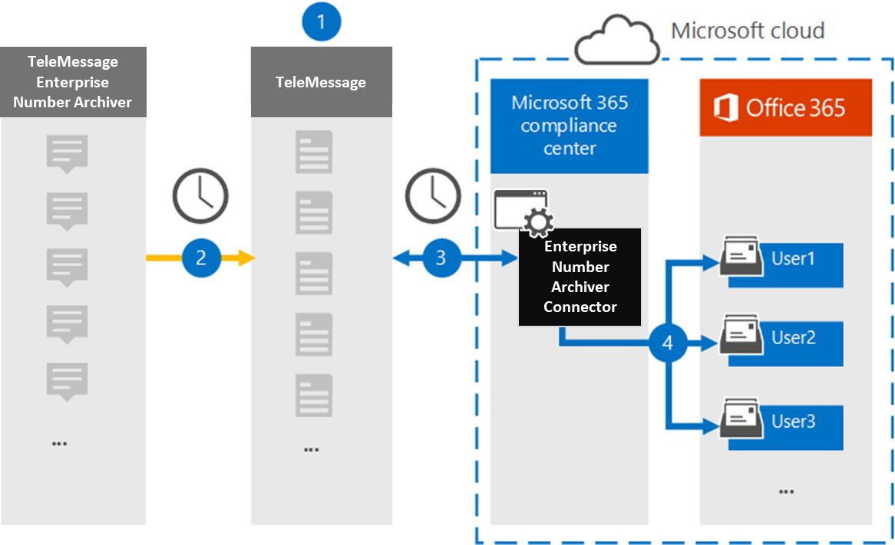

# Konfigurera en koppling för att arkivera data för företagsnummerSet up a connector to archive Enterprise Number data

Använd en TeleMessage-koppling i efterlevnadscentret för Microsoft 365 för att importera och arkivera kortmeddelandetjänst (SMS) och MMS-meddelanden (Multimedia Messaging Service), chattmeddelanden, röstsamtalsinspelningar och röstsamtalsloggar från Enterprise Number Archiver.Use a TeleMessage connector in the Microsoft 365 compliance center to import and archive Short Messaging Service (SMS) and Multimedia Messaging Service (MMS) messages, chat messages, voice call recordings, and voice call logs from the Enterprise Number Archiver. När du har konfigurerat och konfigurerat en anslutning ansluts den till organisationens TeleMessage-konto en gång om dagen och importerar mobilkommunikationsdata för anställda med hjälp av TeleMessage Enterprise Number Archiver till postlådor i Microsoft 365.After you set up and configure a connector, it connects to your organization's TeleMessage account once every day and imports the mobile communication data of employees using the TeleMessage Enterprise Number Archiver to mailboxes in Microsoft 365.

När TeleMessage Enterprise Number Archiver-kopplingens data har lagrats i användarnas postlådor kan du använda efterlevnadsfunktioner i Microsoft 365, till exempel Bevarande av juridiska skäl, Innehållssökning, In-Place Arkivering, Granskning, Kommunikationsefterlevnad och Microsoft 365-bevarandeprinciper för data i företagsnummerarkivering.After the TeleMessage Enterprise Number Archiver connector data is stored in user mailboxes, you can apply Microsoft 365 compliance features such as Litigation Hold, Content Search, In-Place Archiving, Auditing, Communication compliance, and Microsoft 365 retention policies to Enterprise Number Archiver data. Du kan till exempel söka i TeleMessage Enterprise Number Archiver SMS, MMS och röstsamtal med innehållssökning eller associera postlådan som innehåller data för Enterprise Number Archiver-kopplingen med en användare i ett Advanced eDiscovery fall.For example, you can search the TeleMessage Enterprise Number Archiver SMS, MMS, and Voice Call using Content Search or associate the mailbox that contains the Enterprise Number Archiver connector data with a custodian in an Advanced eDiscovery case. Om du använder en enterprise number archiver-koppling för att importera och arkivera data i Microsoft 365 kan hjälpa din organisation att följa myndighets- och regelpolicyer.Using an Enterprise Number Archiver connector to import and archive data in Microsoft 365 can help your organization stay compliant with government and regulatory policies.

## Översikt över arkivering av företagsnummerdataOverview of archiving Enterprise Number data

I följande översikt beskrivs hur du använder en koppling för att arkivera data i Enterprise Network Microsoft 365.The following overview explains the process of using a connector to archive Enterprise Network data in Microsoft 365.

1. Din organisation arbetar med TeleMessage för att konfigurera en anslutning för Enterprise Number Archiver.Your organization works with TeleMessage to set up an Enterprise Number Archiver connector. Mer information finns [här](https://www.telemessage.com/office365-activation-for-enterprise-number-archiver/).For more details refer to [here](https://www.telemessage.com/office365-activation-for-enterprise-number-archiver/).

2. Kopplingen för Enterprise Number Archiver som du skapar i efterlevnadscentret för Microsoft 365 ansluter till TeleMessage-webbplatsen varje dag och överför e-postmeddelanden från de föregående 24 timmarna till ett säkert Azure Storage område i Microsoft Cloud.The Enterprise Number Archiver connector that you create in the Microsoft 365 compliance center connects to the TeleMessage site every day and transfers the email messages from the previous 24 hours to a secure Azure Storage area in the Microsoft Cloud.

3. Kopplingen importerar mobila kommunikationsobjekt till en viss användares postlåda.The connector imports the mobile communication items to the mailbox of a specific user. En ny mapp med namnet Enterprise Number Archiver skapas i den specifika användarens postlåda och objekten importeras till den.A new folder named Enterprise Number Archiver is created in the specific user's mailbox and the items are imported to it. Kopplingen mappar med hjälp av värdet för *användarens e-postadressegenskap.*The connector does mapping by using the value of the *User’s Email address* property. Alla e-postmeddelanden innehåller den här egenskapen, som fylls i med e-postadresserna för alla deltagare i e-postmeddelandet.Every email message contains this property, which is populated with the email address of every participant of the email message. Förutom automatisk användarmappning med värdet  för användarens e-postadressegenskap kan du också definiera en anpassad mappning genom att ladda upp en CSV-mappningsfil.In addition to automatic user mapping using the value of the *User’s Email address* property, you can also define a custom mapping by uploading a CSV mapping file. Den här mappningsfilen ska innehålla användarens mobilnummer och motsvarande e Microsoft 365 postlådeadress för varje användare.This mapping file should contain User’s mobile Number and the corresponding Microsoft 365 mailbox address for each user. Om du aktiverar automatisk användarmappning och tillhandahåller en anpassad mappning kommer kopplingen först att titta på anpassad mappningsfil för varje e-postobjekt.If you enable automatic user mapping and provide a custom mapping, for every email item the connector will first look at custom mapping file. Om anslutaren inte hittar en giltig Microsoft 365-användare som motsvarar en användares mobilnummer använder kopplingen användarens e-postadressegenskap för e-postobjektet.If it doesn't find a valid Microsoft 365 user that corresponds to a user's mobile number, the connector will use the User ‘s email address property of the email item. Om kopplingen inte hittar en giltig Microsoft 365-användare i antingen  den anpassade mappningsfilen eller användarens e-postadressegenskap för e-postobjektet, importeras inte objektet.If the connector doesn't find a valid Microsoft 365 user in either the custom mapping file or the *user’s email address* property of the email item, the item won't be imported.

## Innan du skapa en kopplingBefore you set up a connector

Några av de implementeringssteg som krävs för att arkivera data i enterprisenummerarkivering är externa till Microsoft 365 och måste slutföras innan du kan skapa anslutningen i efterlevnadscentret.Some of the implementation steps required to archive Enterprise Number Archiver data are external to Microsoft 365 and must be completed before you can create the connector in the compliance center.

- Beställ [arkiveringstjänsten för enterprisenummer från TeleMessage](https://www.telemessage.com/mobile-archiver/order-mobile-archiver-for-o365) och få ett giltigt administrationskonto för din organisation.Order the [Enterprise Number Archiver service from TeleMessage](https://www.telemessage.com/mobile-archiver/order-mobile-archiver-for-o365) and get a valid administration account for your organization. Du måste logga in på det här kontot när du skapar anslutningen i efterlevnadscentret.You'll need to sign into this account when you create the connector in the compliance center.

- Registrera alla användare som kräver arkivering av Enterprise Number SMS/MMS Network i TeleMessage-kontot.Register all users that require Enterprise Number SMS/MMS Network archiving in the TeleMessage account. Se till att använda samma e-postadress som används för användarens konto när du registrerar Microsoft 365 användare.When registering users, be sure to use the same email address that's used for their Microsoft 365 account.

- Installera och aktivera appen TeleMessage Enterprise Number Archiver på dina anställdas mobiltelefoner.Install and activate the TeleMessage Enterprise Number Archiver app on the mobile phones of your employees.

- Den användare som skapar en Enterprise Number Archiver-koppling måste tilldelas rollen Importera och exportera postlåda i Exchange Online.The user who creates a Enterprise Number Archiver connector must be assigned the Mailbox Import Export role in Exchange Online. Detta krävs för att lägga till kopplingar på **sidan Datakopplingar** i Microsoft 365 kompatibilitetscenter.This is required to add connectors in the **Data connectors** page in the Microsoft 365 compliance center. Som standard är den här rollen inte tilldelad någon rollgrupp i Exchange Online.By default, this role isn't assigned to any role group in Exchange Online. Du kan lägga till rollen Importera och exportera postlåda i rollgruppen Organisationshantering i Exchange Online.You can add the Mailbox Import Export role to the Organization Management role group in Exchange Online. Du kan också skapa en rollgrupp, tilldela rollen Importera och exportera postlåda och sedan lägga till lämpliga användare som medlemmar.Or you can create a role group, assign the Mailbox Import Export role, and then add the appropriate users as members. Mer information finns i avsnitten [Skapa rollgrupper](/Exchange/permissions-exo/role-groups#create-role-groups) och [Ändra rollgrupper](/Exchange/permissions-exo/role-groups#modify-role-groups) i artikeln "Hantera rollgrupper i Exchange Online".For more information, see the [Create role groups](/Exchange/permissions-exo/role-groups#create-role-groups) or [Modify role groups](/Exchange/permissions-exo/role-groups#modify-role-groups) sections in the article "Manage role groups in Exchange Online".

- Den här datakopplingen är tillgänglig GCC miljöer i Microsoft 365 för myndigheter i USA.This data connector is available in GCC environments in the Microsoft 365 US Government cloud. Program och tjänster från tredje part kan innebära att lagra, överföra och bearbeta din organisations kunddata i tredje parts system som ligger utanför Microsoft 365-infrastrukturen och därför inte omfattas av Microsoft 365-åtaganden gällande efterlevnad och dataskydd.Third-party applications and services might involve storing, transmitting, and processing your organization's customer data on third-party systems that are outside of the Microsoft 365 infrastructure and therefore are not covered by the Microsoft 365 compliance and data protection commitments. Microsoft anger inte att användningen av den här produkten för att ansluta till program från tredje part innebär att sådana program från tredje part är FEDRAMP-kompatibla.Microsoft makes no representation that use of this product to connect to third-party applications implies that those third-party applications are FEDRAMP compliant.

## Skapa en Enterprise Number Archiver-kopplingCreate an Enterprise Number Archiver connector

När du har slutfört kraven som beskrivs i föregående avsnitt kan du skapa en Enterprise Number Archiver-koppling i Microsoft 365 efterlevnadscenter.After you've completed the prerequisites described in the previous section, you can create an Enterprise Number Archiver connector in the Microsoft 365 compliance center. Kopplingen använder den information du uppger för att ansluta till TeleMessage-webbplatsen och överföra SMS, MMS och röstsamtal till motsvarande postlåderutor för användare i Microsoft 365.The connector uses the information you provide to connect to the TeleMessage site and transfer SMS, MMS, and voice call messages to the corresponding user mailbox boxes in Microsoft 365.

1. Gå till [https://compliance.microsoft.com](https://compliance.microsoft.com/) och klicka sedan på **Datakopplingar** \> **Enterprise Number Archiver**.Go to [https://compliance.microsoft.com](https://compliance.microsoft.com/) and then click **Data connectors** \> **Enterprise Number Archiver**.

2. Klicka på **Lägg till koppling på** produktbeskrivningssidan för **företagsnummerarkivering**On the **Enterprise Number Archiver** product description page, click **Add connector**

3. Klicka på **Acceptera på** sidan **Användningsvillkor.**On the **Terms of service** page, click **Accept**.

4. På sidan **Logga in på TeleMessage,** under Steg 3, anger du den information som krävs i följande rutor och klickar sedan på **Nästa.**On the **Login to TeleMessage** page, under Step 3, enter the required information in the following boxes and then click **Next**.

   - **Användarnamn:** Ditt TeleMessage-användarnamn.**Username:** Your TeleMessage username.

   - **Lösenord:** Ditt TeleMessage-lösenord.**Password:** Your TeleMessage password.

5. När kopplingen har skapats kan du stänga popup-fönstret och gå till nästa sida.After the connector is created, you can close the pop-up window and go to the next page.

6. Aktivera automatisk **användarmappning** på sidan Användarmappning.On the **User mapping** page, enable automatic user mapping. Om du vill aktivera anpassad mappning laddar du upp en CSV-fil som innehåller användarmappningsinformationen och klickar sedan på **Nästa.**To enable custom mapping, upload a CSV file that contains the user mapping information, and then click **Next**.

7. Granska inställningarna och klicka sedan på **Slutför för** att skapa kopplingen.Review your settings, and then click **Finish** to create the connector.

8. Gå till fliken Kopplingar på sidan **Datakopplingar** för att se importprocessen för den nya kopplingen.Go to the Connectors tab in **Data connectors** page to see the progress of the import process for the new connector.

## Kända problemKnown issues

- För stunden går det inte att importera bifogade filer eller objekt som är större än 10 MB.At this time, we don't support importing attachments or items that are larger than 10 MB. Stöd för större objekt blir tillgängligt vid ett senare tillfälle.Support for larger items will be available at a later date.