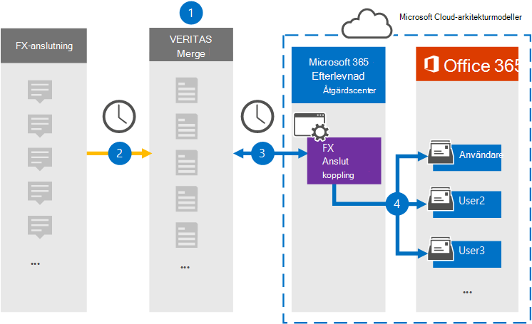

# Konfigurera en koppling för att arkivera FX Anslut dataSet up a connector to archive FX Connect data

Använd en Veritas-koppling i efterlevnadscentret för Microsoft 365 för att importera och arkivera data från FX Anslut-samarbetsplattformen till användarpostlådor i Microsoft 365 organisation.Use a Veritas connector in the Microsoft 365 compliance center to import and archive data from the FX Connect collaboration platform to user mailboxes in your Microsoft 365 organization. Veritas tillhandahåller en [FX Anslut-koppling](https://globanet.com/fx-connect/) som är konfigurerad för att spara FX Anslut objekt och importera dessa objekt till Microsoft 365.Veritas provides an [FX Connect](https://globanet.com/fx-connect/) connector that is configured to capture FX Connect items and import those items to Microsoft 365. Kopplingen omvandlar innehållet från FX Anslut, till exempel affärer, meddelanden och annan information från din organisations FX Anslut-konto, till ett e-postmeddelandeformat och importerar sedan dessa objekt till användarens postlåda i Microsoft 365.The connector converts the content from FX Connect, such as  trades, messages, and other details from your organization's FX Connect account, to an email message format and then imports those items to the user's mailbox in Microsoft 365.

När FX Anslut-data lagras i användarpostlådor kan du tillämpa efterlevnadsfunktioner i Microsoft 365, till exempel bevarande av juridiska skäl, eDiscovery, bevarandeprinciper och bevarandeetiketter samt kommunikationsefterlevnad.After FX Connect data is stored in user mailboxes, you can apply Microsoft 365 compliance features such as Litigation Hold, eDiscovery, retention policies and retention labels, and communication compliance. Om du använder en FX Anslut-anslutning för att importera och arkivera data i Microsoft 365 kan det hjälpa din organisation att följa myndighets- och regelpolicyer.Using an FX Connect connector to import and archive data in Microsoft 365 can help your organization stay compliant with government and regulatory policies.

## Översikt över arkivering av FX Anslut dataOverview of archiving FX Connect data

I följande översikt beskrivs hur du använder en koppling för att arkivera FX-Anslut information i Microsoft 365.The following overview explains the process of using a connector to archive the FX Connect information in Microsoft 365.

1. Din organisation arbetar med FX Anslut att konfigurera och konfigurera en FX-Anslut webbplats.Your organization works with FX Connect to set up and configure an FX Connect site.

2. En gång per dygn kopieras objekt från FX Anslut-konton till webbplatsen Veritas Merge1.Once every 24 hours, items from FX Connect accounts are copied to the Veritas Merge1 site. Kopplingen omvandlar även FX-Anslut till ett e-postmeddelandeformat.The connector also converts the FX Connect items to an email message format.

3. FX Anslut-kopplingen som du skapar i efterlevnadscentret för Microsoft 365, ansluter till Veritas Merge1-webbplatsen varje dag och överför FX Anslut-objekten till en säker Azure Storage-plats i Microsoft-molnet.The FX Connect connector that you create in the Microsoft 365 compliance center, connects to the Veritas Merge1 site every day and transfers the FX Connect items to a secure Azure Storage location in the Microsoft cloud.

4. Kopplingen importerar objekt till specifika användares postlådor med  värdet för egenskapen E-post för den automatiska användarmappningen enligt beskrivningen [i steg 3.](#step-3-map-users-and-complete-the-connector-setup)The connector imports items to the mailboxes of specific users by using the value of the *Email* property of the automatic user mapping as described in [Step 3](#step-3-map-users-and-complete-the-connector-setup). En undermapp i mappen Inkorgen med namnet **FX Anslut** skapas i användarpostlådorna och objekten importeras till den mappen.A subfolder in the Inbox folder named **FX Connect** is created in the user mailboxes, and the items are imported to that folder. Kopplingen gör detta med hjälp av värdet för egenskapen *E-post.*The connector does this by using the value of the *Email* property. Varje FX Anslut-objekt innehåller den här egenskapen, som fylls i med e-postadressen till alla deltagare i objektet.Every FX Connect item contains this property, which is populated with the email address of every participant of the item.

## Innan du börjarBefore you begin

- Skapa ett Veritas Merge1-konto för Microsoft-kopplingar.Create a Veritas Merge1 account for Microsoft connectors.  Om du vill skapa ett konto kontaktar [du Veritas kundsupport.](https://globanet.com/ms-connectors-contact)To create an account, contact [Veritas Customer Support](https://globanet.com/ms-connectors-contact). Du loggar in på det här kontot när du skapar kopplingen i steg 1.You will sign into this account when you create the connector in Step 1.

- Den användare som skapar FX Anslut-kopplingen i steg 1 (och slutför den i steg 3) måste tilldelas rollen Importera och exportera postlåda i Exchange Online.The user who creates the FX Connect connector in Step 1 (and completes it in Step 3) must be assigned to the Mailbox Import Export role in Exchange Online. Den här rollen krävs för att lägga till kopplingar **på sidan Datakopplingar** i Microsoft 365 kompatibilitetscenter.This role is required to add connectors on the **Data connectors** page in the Microsoft 365 compliance center. Som standard är den här rollen inte tilldelad en rollgrupp i Exchange Online.By default, this role is not assigned to a role group in Exchange Online. Du kan lägga till rollen Importera och exportera postlåda i rollgruppen Organisationshantering i Exchange Online.You can add the Mailbox Import Export role to the Organization Management role group in Exchange Online. Du kan också skapa en rollgrupp, tilldela rollen Importera och exportera postlåda och sedan lägga till lämpliga användare som medlemmar.Or you can create a role group, assign the Mailbox Import Export role, and then add the appropriate users as members. Mer information finns i avsnitten [Skapa rollgrupper](/Exchange/permissions-exo/role-groups#create-role-groups) och [Ändra rollgrupper](/Exchange/permissions-exo/role-groups#modify-role-groups) i artikeln "Hantera rollgrupper i Exchange Online".For more information, see the [Create role groups](/Exchange/permissions-exo/role-groups#create-role-groups) or [Modify role groups](/Exchange/permissions-exo/role-groups#modify-role-groups) sections in the article "Manage role groups in Exchange Online".

## Steg 1: Konfigurera FX-Anslut kopplingenStep 1: Set up the FX Connect connector

Det första steget är att komma åt sidan Datakopplingar i Microsoft 365 **efterlevnadscenter** och skapa en koppling för FX Anslut data.The first step is to access to the **Data Connectors** page in the Microsoft 365 compliance center and create a connector for FX Connect data.

1. Gå till [https://compliance.microsoft.com](https://compliance.microsoft.com/) och klicka sedan på **Datakopplingar**  >  **FX Anslut**.Go to [https://compliance.microsoft.com](https://compliance.microsoft.com/) and then click **Data connectors** > **FX Connect**.

2. På sidan **FX Anslut** produktbeskrivning klickar du på Lägg **till koppling**.On the **FX Connect** product description page, click **Add connector**.

3. Klicka på **Acceptera på** sidan **Användningsvillkor.**On the **Terms of service** page, click **Accept**.

4. Ange ett unikt namn som identifierar kopplingen och klicka sedan på **Nästa.**Enter a unique name that identifies the connector, and then click **Next**.

5. Logga in på ditt Merge1-konto för att konfigurera kopplingen.Sign in to your Merge1 account to configure the connector.

## Steg 2: Konfigurera FX Anslut-kopplingen på Veritas Merge1-webbplatsenStep 2: Configure the FX Connect connector on the Veritas Merge1 site

Det andra steget är att konfigurera FX Anslut-kopplingen på Merge1-webbplatsen.The second step is to configure the FX Connect connector on the Merge1 site. Mer information om hur du konfigurerar FX Anslut-koppling finns i [Användarhandbok för](https://docs.ms.merge1.globanetportal.com/Merge1%20Third-Party%20Connectors%20FX%20Connect%20User%20Guide%20.pdf)kopplingar från tredje part.For information about how to configure the FX Connect connector, see [Merge1 Third-Party Connectors User Guide](https://docs.ms.merge1.globanetportal.com/Merge1%20Third-Party%20Connectors%20FX%20Connect%20User%20Guide%20.pdf).

När du har **klickat &**  på Spara eller & visas sidan Användarmappning i kopplingsguiden i Microsoft 365 kompatibilitetscenter.After you click **Save & Finish**, the **User mapping** page in the connector wizard in the Microsoft 365 compliance center is displayed.

## Steg 3: Mappa användare och slutför kopplingskonfigurationenStep 3: Map users and complete the connector setup

Om du vill mappa användare och slutföra anslutningskonfigurationen i Microsoft 365 efterlevnadscenter gör du så här:To map users and complete the connector setup in the Microsoft 365 compliance center, follow these steps:

1. På sidan **Mappa FX Anslut att Microsoft 365 användarna** aktiverar du automatisk användarmappning.On the **Map FX Connect users to Microsoft 365 users** page, enable automatic user mapping. FX Anslut postobjekten omfattar egenskapen *Email,* som innehåller e-postadresser för användare i organisationen.The FX Connect items include a property called *Email*, which contains email addresses for users in your organization. Om kopplingen kan associera den här adressen Microsoft 365 en användare importeras objekten till den användarens postlåda.If the connector can associate this address with a Microsoft 365 user, the items are imported to that user’s mailbox.

2. Klicka **på** Nästa, granska dina inställningar och gå sedan till sidan **Datakopplingar** för att se förloppet för importen för den nya anslutningen.Click **Next**, review your settings, and then go to the **Data connectors** page to see the progress of the import process for the new connector.

## Steg 4: Övervaka FX-Anslut kopplingenStep 4: Monitor the FX Connect connector

När du har skapat FX Anslut-kopplingen kan du visa anslutningsstatusen i Microsoft 365 kompatibilitetscenter.After you create the FX Connect connector, you can view the connector status in the Microsoft 365 compliance center.

1. Gå till <https://compliance.microsoft.com/> och klicka på **Datakopplingar** i det vänstra navigeringsfältet.Go to <https://compliance.microsoft.com/> and click **Data connectors** in the left nav.

2. Klicka på **fliken Kopplingar** och välj sedan **fx-Anslut** för att visa den utfällade sidan.Click the **Connectors** tab and then select the **FX Connect** connector to display the flyout page. Den här sidan innehåller egenskaper och information om kopplingen.This page contains the properties and information about the connector.

3. Under **Anslutningsstatus med källa** klickar du på länken Ladda ned **logg** för att öppna (eller spara) statusloggen för kopplingen.Under **Connector status with source**, click the **Download log** link to open (or save) the status log for the connector. Den här loggen innehåller data som har importerats till Microsoft-molnet.This log contains data that has been imported to the Microsoft cloud.

## Kända problemKnown issues

- För stunden går det inte att importera bifogade filer eller objekt som är större än 10 MB.At this time, we don't support importing attachments or items that are larger than 10 MB. Stöd för större objekt blir tillgängligt vid ett senare tillfälle.Support for larger items will be available at a later date.