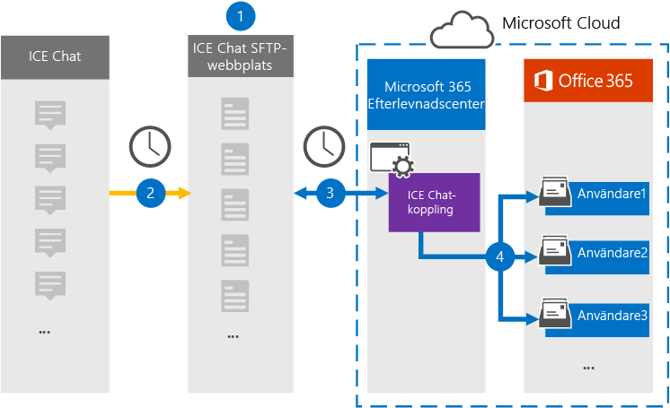
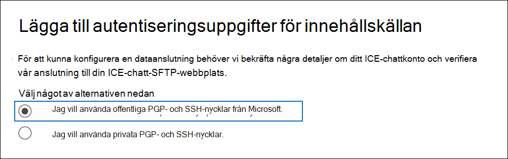
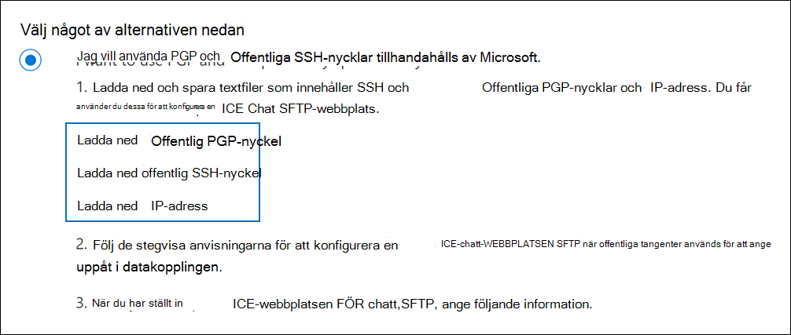
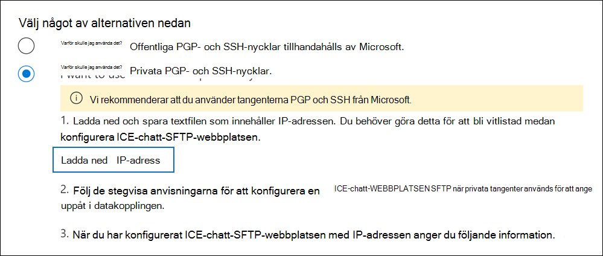

# Konfigurera en koppling för att arkivera ICE-chattdataSet up a connector to archive ICE Chat data

Använd en inbyggd koppling i kompatibilitetscentret för Microsoft 365 för att importera och arkivera chattdata för finansiella tjänster från ice chat-samarbetsverktyget.Use a native connector in the Microsoft 365 compliance center to import and archive financial services chat data from the ICE Chat collaboration tool. När du har konfigurerat och konfigurerat en anslutning ansluts den till organisationens ICE Chat secure FTP-webbplats (SFTP) en gång om dagen, konverterar innehållet i chattmeddelanden till ett e-postmeddelandeformat och importerar sedan objekten till postlådor i Microsoft 365.After you set up and configure a connector, it connects to your organization's ICE Chat secure FTP (SFTP) site once every day, converts the content of chat messages to an email message format, and then import those items to mailboxes in Microsoft 365.

När ICE-chattdata lagras i användarnas postlådor kan du tillämpa efterlevnadsfunktioner i Microsoft 365, till exempel bevarande av juridiska skäl, eDiscovery, arkivering, granskning, kommunikationsefterlevnad och Microsoft 365-bevarandeprinciper för ICE-chattdata.After ICE chat data is stored in user mailboxes, you can apply Microsoft 365 compliance features such as litigation hold, eDiscovery, archiving, auditing, communication compliance, and Microsoft 365 retention policies to ICE Chat data. Du kan till exempel söka i ICE-chattmeddelanden med hjälp av innehållssökning eller associera postlådan som innehåller ICE-chattdata med en vårdnadshavare i ett Advanced eDiscovery ärende.For example, you can search ICE Chat messages using content search or associate the mailbox that contains the ICE Chat data with a custodian in an Advanced eDiscovery case. Om du använder en ICE-chattanslutning för att importera och arkivera data i Microsoft 365 kan det underlätta för organisationen att uppfylla regelverken och myndighetsprinciperna.Using an ICE Chat connector to import and archive data in Microsoft 365 can help your organization stay compliant with government and regulatory policies.

## Översikt över arkivering av ICE-chattdataOverview of archiving ICE Chat data

I följande översikt beskrivs hur du använder en anslutare för att arkivera ICE-chattdata i Microsoft 365.The following overview explains the process of using a connector to archive ICE chat data in Microsoft 365.

1. Din organisation arbetar med ICE Chat för att konfigurera en ICE-chatt-SFTP-webbplats.Your organization works with ICE Chat to set up an ICE Chat SFTP site. Du arbetar också med ICE-chatt för att konfigurera ICE-chatten så att chattmeddelanden kopieras till WEBBPLATSEN ICE Chat SFTP.You'll also work with ICE Chat to configure ICE Chat to copy chat messages to your ICE Chat SFTP site.

2. En gång per dygn kopieras chattmeddelanden från ICE-chatten till webbplatsen ICE Chat SFTP.Once every 24 hours, chat messages from ICE Chat are copied to your ICE Chat SFTP site.

3. ICE-chattanslutningen som du skapar i efterlevnadscentret för Microsoft 365 ansluter till ICE-chatt-SFTP-webbplatsen varje dag och överför chattmeddelandena från de föregående 24 timmarna till en säker Azure Storage plats i Microsoft-molnet.The ICE Chat connector that you create in the Microsoft 365 compliance center connects to the ICE Chat SFTP site every day and transfers the chat messages from the previous 24 hours to a secure Azure Storage location in the Microsoft cloud. Kopplingen omvandlar också innehållet i en chatt till ett e-postmeddelandeformat.The connector also converts the content of a chat massage to an email message format.

4. Kopplingen importerar chattmeddelandeobjekt till specifika användares postlådor.The connector imports chat message items to the mailboxes of specific users. En ny mapp med **namnet ICE Chat** skapas i användarnas postlådor och chattmeddelandeobjekten importeras till den mappen.A new folder named **ICE Chat** is created in the user mailboxes and the chat message items are imported to that folder. Kopplingen gör det med värdet för egenskaperna *SenderEmail och* *RecipientEmail.*The connector does by using the value of the *SenderEmail* and *RecipientEmail* properties. Alla chattmeddelanden innehåller de här egenskaperna, som fylls i med e-postadressen till avsändaren och alla mottagare/deltagare i chattmeddelandet.Every chat message contains these properties, which are populated with email address of the sender and every recipient/participant of the chat message.

   Förutom automatisk användarmappning som använder värdena för egenskapen *SenderEmail* och *RecipientEmail* (vilket innebär att kopplingen importerar ett chattmeddelande till avsändarens postlåda och postlådorna för varje mottagare), kan du även definiera anpassad användarmappning genom att ladda upp en CSV-mappningsfil.In addition to automatic user mapping that uses the values of the *SenderEmail* and *RecipientEmail* property (which means that the connector imports a chat message to the sender's mailbox and the mailboxes of every recipient), you can also define custom user mapping by uploading a CSV mapping file. Den här mappningsfilen innehåller ICE *Chat ImId* och motsvarande e Microsoft 365 postlådeadress för alla användare i organisationen.This mapping file contains the ICE Chat *ImId* and the corresponding Microsoft 365 mailbox address for every user in your organization. Om du aktiverar automatisk användarmappning och tillhandahåller en mappningsfil, kommer kopplingen först att titta på den anpassade mappningsfilen för varje chattobjekt.If you enable automatic user mapping and provide a custom-mapping file, for every chat item the connector will first look at the custom-mapping file. Om anslutaren inte hittar ett giltigt Microsoft 365-användarkonto som motsvarar en användares ICE-chatt-ImId använder anslutningen egenskaperna *SenderEmail* och *RecipientEmail* för chattobjektet till att importera objektet till chattdeltagarnas postlådor.If it doesn't find a valid Microsoft 365 user account that corresponds to a user's ICE Chat ImId, the connector will use the *SenderEmail* and *RecipientEmail* properties of the chat item to import the item to the mailboxes of the chat participants. Om kopplingen inte hittar en giltig Microsoft 365 i antingen mappningsfilen eller egenskaperna *SenderEmail* och *RecipientEmail* importeras inte objektet.If the connector doesn't find a valid Microsoft 365 user in either the custom-mapping file or the *SenderEmail* and *RecipientEmail* properties, the item won't be imported.

## Innan du skapa en kopplingBefore you set up a connector

Några av de implementeringssteg som krävs för att arkivera ICE-chattdata är Microsoft 365 och måste slutföras innan du kan skapa anslutningen i efterlevnadscentret.Some of the implementation steps required to archive ICE Chat data are external to Microsoft 365 and must be completed before you can create the connector in the compliance center.

- ICE-chatt debiterar kunderna en avgift för extern efterlevnad.ICE Chat charges their customers a fee for external compliance. Din organisation bör kontakta ICE-chattförsäljningsgruppen för att diskutera och skriva under avtalet för ICE-chatttjänster, som du hittar på [https://www.theice.com/publicdocs/agreements/ICE\_Data\_Services\_Agreement.pdf](https://www.theice.com/publicdocs/agreements/ICE\_Data\_Services\_Agreement.pdf) .Your organization should contact the ICE Chat sales group to discuss, and to sign the ICE Chat data services agreement, which you can obtain at [https://www.theice.com/publicdocs/agreements/ICE\_Data\_Services\_Agreement.pdf](https://www.theice.com/publicdocs/agreements/ICE\_Data\_Services\_Agreement.pdf). Detta avtal är mellan ICE-chatten och din organisation och innebär inte Microsoft.This agreement is between ICE Chat and your organization and does not involve Microsoft. När du har konfigurerat en ICE Chat SFTP-webbplats i steg 2 tillhandahåller ICE Chat FTP-autentiseringsuppgifterna direkt till organisationen.After you set up an ICE Chat SFTP site in Step 2, ICE Chat provides the FTP credentials directly to your organization. Sedan anger du vilka autentiseringsuppgifter som ska visas för Microsoft när anslutningen konfigureras i steg 3.Then you who would provide those credentials to Microsoft when setting up the connector in Step 3.

- Du måste konfigurera en ICE-chatt-SFTP-webbplats innan du skapar kopplingen i steg 3.You must set up an ICE Chat SFTP site before creating the connector in Step 3. När du har arbetat med ICE Chat för att konfigurera SFTP-webbplatsen laddas data från ICE-chatten upp till SFTP-webbplatsen varje dag.After working with ICE Chat to set up the SFTP site, data from ICE Chat is uploaded to the SFTP site every day. Kopplingen som du skapar i steg 3 ansluter till den här SFTP-webbplatsen och överför chattdata till Microsoft 365 postlådor.The connector you create in Step 3 connects to this SFTP site and transfers the chat data to Microsoft 365 mailboxes. SFTP krypterar även ICE-chattdata som skickas till postlådor under överföringsprocessen.SFTP also encrypts the ICE Chat data that's sent to mailboxes during the transfer process.

- Om du vill konfigurera en ICE-chattkoppling måste du använda tangenter och tangentpassphraser för PGP (Pretty Good Privacy) och Secure Shell (SSH).To set up an ICE Chat connector, you have to use keys and key passphrases for Pretty Good Privacy (PGP) and Secure Shell (SSH). Dessa nycklar används för att konfigurera ICE-chatt-SFTP-webbplatsen och används av kopplingen för att ansluta till ICE-chatten SFTP-webbplatsen för att importera data till Microsoft 365.These keys are used to configure the ICE Chat SFTP site and used by the connector to connect to the ICE Chat SFTP site to import data to Microsoft 365. PGP-nyckeln används för att konfigurera krypteringen av data som överförs från ICE Chat SFTP-webbplatsen till Microsoft 365.The PGP key is used to configure the encryption of data that's transferred from the ICE Chat SFTP site to Microsoft 365. SSH-nyckeln används för att konfigurera säkert gränssnitt för att aktivera säker fjärrinloggning när kopplingen ansluts till ICE-chatt-SFTP-webbplatsen.The SSH key is used to configure secure shell to enable a secure remote login when the connector connects to the ICE Chat SFTP site.

  När du inställningar för en koppling kan du välja att använda offentliga tangenter och lösenordsfraser som tillhandahålls av Microsoft, eller så kan du använda dina egna privata nycklar och lösenord.When setting up a connector, you have the option to use public keys and key passphrases provided by Microsoft or you can use your own private keys and passphrases. Vi rekommenderar att du använder de offentliga nycklar som tillhandahålls av Microsoft.We recommend that you use the public keys provided by Microsoft. Men om organisationen redan har konfigurerat en ICE-chatt-SFTP-webbplats med privata nycklar kan du skapa en anslutning med samma privata nycklar.However, if your organization has already configured an ICE Chat SFTP site using private keys, then you can create a connector using these same private keys.

- Med ICE-chattkopplingen kan totalt 200 000 objekt importeras på en och samma dag.The ICE Chat connector can import a total of 200,000 items in a single day. Om det finns fler än 200 000 objekt på SFTP-webbplatsen importeras inga av dessa objekt till Microsoft 365.If there are more than 200,000 items on the SFTP site, none of those items will be imported to Microsoft 365.

- Den administratör som skapar ICE-chattanslutningen i steg 3 (och som laddar ned de offentliga nycklarna och IP-adressen i steg 1) måste tilldelas rollen Importera och exportera postlåda i Exchange Online.The admin who creates the ICE Chat connector in Step 3 (and who downloads the public keys and IP address in Step 1) must be assigned the Mailbox Import Export role in Exchange Online. Den här rollen krävs för att lägga till kopplingar **på sidan Datakopplingar** i Microsoft 365 kompatibilitetscenter.This role is required to add connectors on the **Data connectors** page in the Microsoft 365 compliance center. Som standard är den här rollen inte tilldelad någon rollgrupp i Exchange Online.By default, this role isn't assigned to any role group in Exchange Online. Du kan lägga till rollen Importera och exportera postlåda i rollgruppen Organisationshantering i Exchange Online.You can add the Mailbox Import Export role to the Organization Management role group in Exchange Online. Du kan också skapa en rollgrupp, tilldela rollen Importera och exportera postlåda och sedan lägga till lämpliga användare som medlemmar.Or you can create a role group, assign the Mailbox Import Export role, and then add the appropriate users as members. Mer information finns i avsnitten [Skapa rollgrupper](/Exchange/permissions-exo/role-groups#create-role-groups) och [Ändra rollgrupper](/Exchange/permissions-exo/role-groups#modify-role-groups) i artikeln "Hantera rollgrupper i Exchange Online".For more information, see the [Create role groups](/Exchange/permissions-exo/role-groups#create-role-groups) or [Modify role groups](/Exchange/permissions-exo/role-groups#modify-role-groups) sections in the article "Manage role groups in Exchange Online".

## Konfigurera en koppling med hjälp av offentliga tangenterSet up a connector using public keys

Stegen i det här avsnittet visar hur du inställningar för en ICE-chattkoppling med hjälp av offentliga nycklar för PGP (Pretty Good Privacy) och Secure Shell (SSH).The steps in this section show you how to set up an ICE Chat connector using the public keys for Pretty Good Privacy (PGP) and Secure Shell (SSH).

### Steg 1: Hämta offentliga nycklar för PGP och SSHStep 1: Obtain PGP and SSH public keys

Det första steget är att skaffa en kopia av de offentliga nycklarna för PGP (Pretty Good Privacy) och Secure Shell (SSH).The first step is to obtain a copy of the public keys for Pretty Good Privacy (PGP) and Secure Shell (SSH). Du använder de här nycklarna i steg 2 för att konfigurera ICE-chattplatsen SFTP så att kopplingen (som du skapade i steg 3) kan ansluta till SFTP-webbplatsen och överföra ICE-chattdata till Microsoft 365 postlådor.You use these keys in Step 2 to configure the ICE Chat SFTP site to allow the connector (that you create in Step 3) to connect to the SFTP site and transfer the ICE Chat data to Microsoft 365 mailboxes. Du får också en IP-adress i det här steget, som du använder när du konfigurerar ICE-chatten SFTP-webbplatsen.You will also obtain an IP address in this step, which you use when configuring the ICE Chat SFTP site.

1. Gå till [https://compliance.microsoft.com](https://compliance.microsoft.com) och klicka på **Datakopplingar** i det vänstra navigeringsfältet.Go to [https://compliance.microsoft.com](https://compliance.microsoft.com) and click **Data connectors** in the left nav.

2. På sidan **Datakopplingar** under **ICE-chatt klickar** du på **Visa**.On the **Data connectors** page under **ICE Chat**, click **View**.

3. Klicka på **Lägg till koppling** på sidan **ICE-chatt.**On the **ICE Chat** page, click **Add connector**.

4. Klicka på **Acceptera på** sidan **Användningsvillkor.**On the **Terms of service** page, click **Accept**.

5. På sidan **Lägg till autentiseringsuppgifter för innehållskälla** klickar du på **Jag vill använda offentliga PGP- och SSH-nycklar från Microsoft.**On the **Add credentials for content source** page, click **I want to use PGP and SSH public keys provided by Microsoft**.

   

6. Under steg 1 klickar du på Länkarna Ladda ned **SSH**, Ladda ned **PGP-tangenten** och Ladda ned **IP-adresslänkar** för att spara en kopia av varje fil på din lokala dator.Under step 1, click the **Download SSH key**, **Download PGP key**, and **Download IP address** links to save a copy of each file to your local computer.

   

   Dessa filer innehåller följande objekt som används för att konfigurera ICE-chatt-SFTP-webbplatsen i steg 2:These files contain the following items that are used to configure the ICE Chat SFTP site in Step 2:

   - Offentlig PGP-nyckel: Den här nyckeln används för att konfigurera kryptering av data som överförs från ICE-webbplatsen för chatt-SFTP till Microsoft 365.PGP public key: This key is used to configure the encryption of data that's transferred from the ICE Chat SFTP site to Microsoft 365.

   - Offentlig SSH-nyckel: Den här nyckeln används för att konfigurera Säker SSH för att aktivera en säker fjärrinloggning när kopplingen ansluter till ICE-chatten SFTP-webbplatsen.SSH public key: This key is used to configure Secure SSH to enable a secure remote login when the connector connects to the ICE Chat SFTP site.

   - IP-adress: ICE-chatten SFTP-webbplatsen har konfigurerats att endast acceptera en anslutningsbegäran från den här IP-adressen, som används av ICE-chattanslutningen som du skapade i steg 3.IP address: The ICE Chat SFTP site is configured to accept a connection request only from this IP address, which is used by the ICE Chat connector that you create in Step 3.

7. Stäng **guiden genom** att klicka på Avbryt.Click **Cancel** to close the wizard. Du kommer tillbaka till den här guiden i Steg 3 för att skapa kopplingen.You come back to this wizard in Step 3 to create the connector.

### Steg 2: Konfigurera ICE Chat SFTP-webbplatsenStep 2: Configure the ICE Chat SFTP site

Nästa steg är att använda de offentliga PGP- och SSH-nycklarna och IP-adressen som du fick i steg 1 för att konfigurera PGP-kryptering och SSH-autentisering för ICE-webbplatsen Chat SFTP.The next step is to use the PGP and SSH public keys and the IP address that you obtained in Step 1 to configure PGP encryption and SSH authentication for the ICE Chat SFTP site. Med den här funktionen kan ICE-chattanslutningen som du skapar i steg 3 ansluta till ICE-chatten SFTP-webbplatsen och överföra ICE-chattdata till Microsoft 365.This lets the ICE Chat connector that you create in Step 3 connect to the ICE Chat SFTP site and transfer ICE Chat data to Microsoft 365. Du måste arbeta med ICE Chat-kundsupporten för att konfigurera din ICE-chatt-SFTP-webbplats.You need to work with ICE Chat customer support to set up your ICE Chat SFTP site.

### Steg 3: Skapa en ICE-chattkopplingStep 3: Create an ICE Chat connector

Det sista steget är att skapa en ICE-chattanslutning i Microsoft 365 efterlevnadscenter.The last step is to create an ICE Chat connector in the Microsoft 365 compliance center. Kopplingen använder den information du anger för att ansluta till ICE-webbplatsen för chatt-SFTP och överföra chattmeddelanden till motsvarande postlåderutor för användare i Microsoft 365.The connector uses the information you provide to connect to the ICE Chat SFTP site and transfer chat messages to the corresponding user mailbox boxes in Microsoft 365.

1. Gå till [https://compliance.microsoft.com](https://compliance.microsoft.com) och klicka på **Datakopplingar** i det vänstra navigeringsfältet.Go to [https://compliance.microsoft.com](https://compliance.microsoft.com) and click **Data connectors** in the left nav.

2. På sidan **Datakopplingar** under **ICE-chatt klickar** du på **Visa**.On the **Data connectors** page under **ICE Chat**, click **View**.

3. Klicka på **Lägg till koppling** på sidan **ICE-chatt.**On the **ICE Chat** page, click **Add connector**.

4. Klicka på **Acceptera på** sidan **Användningsvillkor.**On the **Terms of service** page, click **Accept**.

5. På sidan **Lägg till autentiseringsuppgifter för innehållskälla** klickar du **på Jag vill använda offentliga PGP- och SSH-nycklar.**On the **Add credentials for content source** page, click **I want to use PGP and SSH public keys**.

6. Under Steg 3 anger du den information som krävs i följande rutor och klickar sedan på **Verifiera anslutning.**Under Step 3, enter the required information in the following boxes and then click **Validate connection**.

   - **Företagskod:** ID för din organisation, som används som användarnamn för ICE Chat SFTP-webbplatsen.**Firm code:** The ID for your organization, which is used as the username for the ICE Chat SFTP site.

   - **Lösenord:** Lösenordet för DIN ICE-chatt-SFTP-webbplats.**Password:** The password for your ICE Chat SFTP site.

   - **SFTP-URL:** URL-adressen för ICE Chat SFTP-webbplatsen (till exempel `sftp.theice.com` ).**SFTP URL:** The URL for the ICE Chat SFTP site (for example, `sftp.theice.com`). Du kan också använda en IP-adress för det här värdet.You can also use an IP address for this value.

   - **SFTP-port:** Portnumret för ICE Chat SFTP-webbplatsen.**SFTP port:** The port number for the ICE Chat SFTP site. Kopplingen använder den här porten för att ansluta till SFTP-webbplatsen.The connector uses this port to connect to the SFTP site.

7. När anslutningen har verifierats klickar du på **Nästa.**After the connection is successfully validated, click **Next**.

8. På sidan **Mappa externa användare till Microsoft 365 aktiverar** du automatisk användarmappning och anger anpassad användarmappning efter behov.On the **Map external users to Microsoft 365 users** page, enable automatic user mapping and provide custom user mapping as required. Du kan ladda ned en kopia av CSV-filen med användarmappning på den här sidan.You can download a copy of the user-mapping CSV file on this page. Du kan lägga till användarmappningar i filen och sedan ladda upp den.You can add the user mappings to the file and then upload it.

   > [!NOTE]
   > Som tidigare förklarats innehåller den anpassade mappningsfilen CSV-filen ICE-chatten imid och Microsoft 365 postlådans adress för varje användare.As previously explained, custom mapping file CSV file contains the ICE Chat imid and corresponding Microsoft 365 mailbox address for each user. Om du aktiverar automatisk användarmappning och tillhandahåller en anpassad mappning kommer kopplingen först att titta på anpassad mappningsfil för varje chattobjekt.If you enable automatic user mapping and provide a custom mapping, for every chat item, the connector will first look at custom mapping file. Om inte en giltig Microsoft 365-användare som motsvarar en användares ICE-chatt imid, importeras objektet till postlådorna för de användare som angetts i egenskaperna *SenderEmail* och *RecipientEmail* för chattobjektet.If it doesn't find a valid Microsoft 365 user that corresponds to a user's ICE Chat imid, the connector will import the item to the mailboxes for the users specified in the *SenderEmail* and *RecipientEmail* properties of the chat item. Om kopplingen inte hittar en giltig Microsoft 365 genom automatisk eller anpassad användarmappning importeras inte objektet.If the connector doesn't find a valid Microsoft 365 user by either automatic or custom user mapping, the item won't be imported.

9. Klicka **på** Nästa, granska dina inställningar och klicka sedan **på Slutför** för att skapa kopplingen.Click **Next**, review your settings, and then click **Finish** to create the connector.

10. Gå till **sidan Datakopplingar** för att se förloppet för importen för den nya anslutningen.Go to the **Data connectors** page to see the progress of the import process for the new connector.

## Konfigurera en koppling med privata nycklarSet up a connector using private keys

Stegen i det här avsnittet visar hur du ställer in en ICE-chattkoppling med privata PGP- och SSH-nycklar.The steps in this section show you how to set up an ICE Chat connector using PGP and SSH private keys. Det här alternativet för anslutningskonfiguration är avsett för organisationer som redan har konfigurerat en ICE-chatt-SFTP-webbplats med privata nycklar.This connector setup option is intended for organizations that have already configured an ICE Chat SFTP site using private keys.

### Steg 1: Hämta en IP-adress för att konfigurera ICE-chattwebbplatsen SFTPStep 1: Obtain an IP address to configure the ICE Chat SFTP site

Om din organisation har använt privata PGP- och SSH-nycklar för att konfigurera en ICE-chatt-SFTP-webbplats måste du ha en IP-adress och ge den till ICE Chat-kundsupporten.If your organization has used PGP and SSH private keys to set up an ICE Chat SFTP site, then you have to obtain an IP address and provide it to ICE Chat customer support. ICE-chatten SFTP-webbplatsen måste vara konfigurerad för att ta emot anslutningsförfrågningar från den här IP-adressen.The ICE Chat SFTP site must be configured to accept  connection requests from this IP address. Samma IP-adress används av ICE-chattanslutningen för att ansluta till SFTP-webbplatsen och överföra ICE-chattdata till Microsoft 365.The same IP address is used by the ICE Chat connector to connect to the SFTP site and transfer ICE Chat data to Microsoft 365.

Så här hämtar du IP-adressen:To obtain the IP address:

1. Gå till <https://compliance.microsoft.com> och klicka på **Datakopplingar** i det vänstra navigeringsfältet.Go to <https://compliance.microsoft.com> and click **Data connectors** in the left nav.

2. På sidan **Datakopplingar** under **ICE-chatt klickar** du på **Visa**.On the **Data connectors** page under **ICE Chat**, click **View**.

3. På **produktbeskrivningssidan för ICE-chatt** klickar du på **Lägg till koppling**On the **ICE Chat** product description page, click **Add connector**

4. Klicka på **Acceptera på** sidan **Användningsvillkor.**On the **Terms of service** page, click **Accept**.

5. På sidan **Lägg till autentiseringsuppgifter för innehållskälla** klickar du **på Jag vill använda privata PGP- och SSH-nycklar.**On the **Add credentials for content source** page, click **I want to use PGP and SSH private keys**.

   

6. Under steg 1 klickar du på **Ladda ned IP-adress** för att spara en kopia av IP-adressfilen på den lokala datorn.Under step 1, click **Download IP address** to save a copy of the IP address file to your local computer.

   

7. Stäng **guiden genom** att klicka på Avbryt.Click **Cancel** to close the wizard. Du kommer tillbaka till den här guiden i steg 2 för att skapa kopplingen.You come back to this wizard in Step 2 to create the connector.

Du måste arbeta med ICE Chat-kundsupporten för att konfigurera din ICE-chatt-SFTP-webbplats för att acceptera anslutningsförfrågningar från den här IP-adressen.You need to work with ICE Chat customer support to configure your ICE Chat SFTP site to accept connection requests from this IP address.

### Steg 2: Skapa en ICE-chattkopplingStep 2: Create an ICE Chat connector

När du har konfigurerat ICE-chatten med SFTP-webbplatsen är nästa steg att skapa en ICE-chattkoppling i Microsoft 365 efterlevnadscenter.After your ICE Chat SFTP site is configured, the next step is to create an ICE Chat connector in the Microsoft 365 compliance center. Kopplingen använder den information du anger för att ansluta till ICE-webbplatsen för chatt-SFTP och överföra e-postmeddelanden till motsvarande postlåderutor för användare i Microsoft 365.The connector uses the information you provide to connect to the ICE Chat SFTP site and transfer email messages to the corresponding user mailbox boxes in Microsoft 365. För att slutföra det här steget måste du se till att kopior av samma privata nycklar och nyckellösenord som du använde för att konfigurera din ICE Chat SFTP-webbplats.To complete this step, be sure to have copies of the same private keys and key passphrases that you used to set up your ICE Chat SFTP site.

1. Gå till <https://compliance.microsoft.com> och klicka på **Datakopplingar** i det vänstra navigeringsfältet.Go to <https://compliance.microsoft.com> and click **Data connectors** in the left nav.

2. På sidan **Datakopplingar** under **ICE-chatt klickar** du på **Visa**.On the **Data connectors** page under **ICE Chat**, click **View**.

3. På **produktbeskrivningssidan för ICE-chatt** klickar du på **Lägg till koppling**On the **ICE Chat** product description page, click **Add connector**

4. Klicka på **Acceptera på** sidan **Användningsvillkor.**On the **Terms of service** page, click **Accept**.

5. På sidan **Lägg till autentiseringsuppgifter för innehållskälla** klickar du **på Jag vill använda privata PGP- och SSH-nycklar.**On the **Add credentials for content source** page, click **I want to use PGP and SSH private keys**.

6. Under Steg 3 anger du den information som krävs i följande rutor och klickar sedan på **Verifiera anslutning.**Under Step 3, enter the required information in the following boxes and then click **Validate connection**.

      - **Namn:** Namnet på kopplingen.**Name:** The name for the connector. Den måste vara unik i din organisation.It must be unique in your organization.

      - **Företagskod:** ID för din organisation som används som användarnamn för ICE Chat SFTP-webbplatsen.**Firm code:** The ID for your organization that is used as the username for the ICE Chat SFTP site.

      - **Lösenord:** Lösenordet för organisationens ICE Chat SFTP-webbplats.**Password:** The password for your organization's ICE Chat SFTP site.

      - **SFTP-URL:** URL-adressen för ICE Chat SFTP-webbplatsen (till exempel `sftp.theice.com` ).**SFTP URL:** The URL for the ICE Chat SFTP site (for example, `sftp.theice.com`). Du kan också använda en IP-adress för det här värdet.You can also use an IP address for this value.

      - **SFTP-port:** Portnumret för ICE Chat SFTP-webbplatsen.**SFTP port:** The port number for the ICE Chat SFTP site. Kopplingen använder den här porten för att ansluta till SFTP-webbplatsen.The connector uses this port to connect to the SFTP site.

      - **Privat PGP-nyckel:** Den privata PGP-nyckeln för ICE-chatt-SFTP-webbplatsen.**PGP private key:** The PGP private key for the ICE Chat SFTP site. Se till att ta med hela det privata nyckelvärdet, inklusive de första och sista raderna i nyckelblocket.Be sure to include the entire private key value, including the beginning and ending lines of the key block.

      - **PGP-nyckelfras:** Lösenordsfrasen för den privata PGP-nyckeln.**PGP key passphrase:** The passphrase for the PGP private key.

      - **Privat SSH-nyckel:** Den privata SSH-nyckeln för WEBBPLATSEN ICE Chat SFTP.**SSH private key:** The SSH private key for the ICE Chat SFTP site. Se till att ta med hela det privata nyckelvärdet, inklusive de första och sista raderna i nyckelblocket.Be sure to include the entire private key value, including the beginning and ending lines of the key block.

      - **Lösenord för SSH-tangenten:** Lösenordsfrasen för den privata SSH-nyckeln.**SSH key passphrase:** The passphrase for the SSH private key.

7. När anslutningen har verifierats klickar du på **Nästa.**After the connection is successfully validated, click **Next**.

8. På sidan **Mappa ICE-chattanvändare Microsoft 365 användarna** aktiverar du automatisk användarmappning och tillhandahåller anpassad användarmappning efter behov.On the **Map ICE Chat users to Microsoft 365 users** page, enable automatic user mapping and provide custom user mapping as required.

   > [!NOTE]
   > Som tidigare förklarats innehåller den anpassade mappningsfilen CSV-filen ICE-chatten imid och Microsoft 365 postlådans adress för varje användare.As previously explained, custom mapping file CSV file contains the ICE Chat imid and corresponding Microsoft 365 mailbox address for each user. Om du aktiverar automatisk användarmappning och tillhandahåller en anpassad mappning kommer kopplingen först att titta på anpassad mappningsfil för varje chattobjekt.If you enable automatic user mapping and provide a custom mapping, for every chat item, the connector will first look at custom mapping file. Om inte en giltig Microsoft 365-användare som motsvarar en användares ICE-chatt imid, importeras objektet till postlådorna för de användare som angetts i egenskaperna *SenderEmail* och *RecipientEmail* för chattobjektet.If it doesn't find a valid Microsoft 365 user that corresponds to a user's ICE Chat imid, the connector will import the item to the mailboxes for the users specified in the *SenderEmail* and *RecipientEmail* properties of the chat item. Om kopplingen inte hittar en giltig Microsoft 365 genom automatisk eller anpassad användarmappning importeras inte objektet.If the connector doesn't find a valid Microsoft 365 user by either automatic or custom user mapping, the item won't be imported.

9. Klicka **på** Nästa, granska dina inställningar och klicka sedan **på Slutför** för att skapa kopplingen.Click **Next**, review your settings, and then click **Finish** to create the connector.

10. Gå till **sidan Datakopplingar** för att se förloppet för importen för den nya anslutningen.Go to the **Data connectors** page to see the progress of the import process for the new connector. Klicka på kopplingen för att visa den utfällade sidan som innehåller information om kopplingen.Click the connector to display the flyout page, which contains information about the connector.
