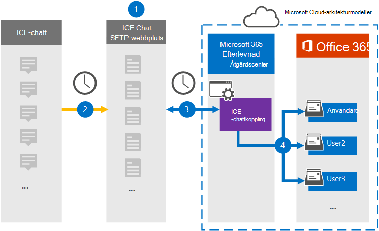

# Konfigurera en koppling för att arkivera ICE-chattdata

Använd en inbyggd koppling i kompatibilitetscentret för Microsoft 365 för att importera och arkivera chattdata för finansiella tjänster från ice chat-samarbetsverktyget. När du har konfigurerat och konfigurerat en anslutning ansluts den till organisationens ICE Chat secure FTP-webbplats (SFTP) en gång om dagen, konverterar innehållet i chattmeddelanden till ett e-postmeddelandeformat och importerar sedan objekten till postlådor i Microsoft 365.

När ICE-chattdata lagras i användarnas postlådor kan du tillämpa efterlevnadsfunktioner i Microsoft 365, till exempel bevarande av juridiska skäl, eDiscovery, arkivering, granskning, kommunikationsefterlevnad och Microsoft 365-bevarandeprinciper för ICE-chattdata. Du kan till exempel söka i ICE-chattmeddelanden med hjälp av innehållssökning eller associera postlådan som innehåller ICE-chattdata med en vårdnadshavare i ett Advanced eDiscovery ärende. Om du använder en ICE-chattanslutning för att importera och arkivera data i Microsoft 365 kan det underlätta för organisationen att uppfylla regelverken och myndighetsprinciperna.

## Översikt över arkivering av ICE-chattdata

I följande översikt beskrivs hur du använder en anslutare för att arkivera ICE-chattdata i Microsoft 365.

1. Din organisation arbetar med ICE Chat för att konfigurera en ICE-chatt-SFTP-webbplats. Du arbetar också med ICE-chatt för att konfigurera ICE-chatten så att chattmeddelanden kopieras till WEBBPLATSEN ICE Chat SFTP.

2. En gång per dygn kopieras chattmeddelanden från ICE-chatten till webbplatsen ICE Chat SFTP.

3. ICE-chattanslutningen som du skapar i efterlevnadscentret för Microsoft 365 ansluter till ICE-chatt-SFTP-webbplatsen varje dag och överför chattmeddelandena från de föregående 24 timmarna till en säker Azure Storage plats i Microsoft-molnet. Kopplingen omvandlar också innehållet i en chatt till ett e-postmeddelandeformat.

4. Kopplingen importerar chattmeddelandeobjekt till specifika användares postlådor. En ny mapp med **namnet ICE Chat** skapas i användarnas postlådor och chattmeddelandeobjekten importeras till den mappen. Kopplingen gör det med värdet för egenskaperna *SenderEmail och* *RecipientEmail.* Alla chattmeddelanden innehåller de här egenskaperna, som fylls i med e-postadressen till avsändaren och alla mottagare/deltagare i chattmeddelandet.

   Förutom automatisk användarmappning som använder värdena för egenskapen *SenderEmail* och *RecipientEmail* (vilket innebär att kopplingen importerar ett chattmeddelande till avsändarens postlåda och postlådorna för varje mottagare), kan du även definiera anpassad användarmappning genom att ladda upp en CSV-mappningsfil. Den här mappningsfilen innehåller ICE *Chat ImId* och motsvarande e Microsoft 365 postlådeadress för alla användare i organisationen. Om du aktiverar automatisk användarmappning och tillhandahåller en mappningsfil, kommer kopplingen först att titta på den anpassade mappningsfilen för varje chattobjekt. Om anslutaren inte hittar ett giltigt Microsoft 365-användarkonto som motsvarar en användares ICE-chatt-ImId använder anslutningen egenskaperna *SenderEmail* och *RecipientEmail* för chattobjektet till att importera objektet till chattdeltagarnas postlådor. Om kopplingen inte hittar en giltig Microsoft 365 i antingen mappningsfilen eller egenskaperna *SenderEmail* och *RecipientEmail* importeras inte objektet.

## Innan du skapa en koppling

Några av de implementeringssteg som krävs för att arkivera ICE-chattdata är Microsoft 365 och måste slutföras innan du kan skapa anslutningen i efterlevnadscentret.

- ICE-chatt debiterar kunderna en avgift för extern efterlevnad. Din organisation bör kontakta ICE-chattförsäljningsgruppen för att diskutera och skriva under avtalet för ICE-chatttjänster, som du hittar på [https://www.theice.com/publicdocs/agreements/ICE\_Data\_Services\_Agreement.pdf](https://www.theice.com/publicdocs/agreements/ICE\_Data\_Services\_Agreement.pdf) . Detta avtal är mellan ICE-chatten och din organisation och innebär inte Microsoft. När du har konfigurerat en ICE Chat SFTP-webbplats i steg 2 tillhandahåller ICE Chat FTP-autentiseringsuppgifterna direkt till organisationen. Sedan anger du vilka autentiseringsuppgifter som ska visas för Microsoft när anslutningen konfigureras i steg 3.

- Du måste konfigurera en ICE-chatt-SFTP-webbplats innan du skapar kopplingen i steg 3. När du har arbetat med ICE Chat för att konfigurera SFTP-webbplatsen laddas data från ICE-chatten upp till SFTP-webbplatsen varje dag. Kopplingen som du skapar i steg 3 ansluter till den här SFTP-webbplatsen och överför chattdata till Microsoft 365 postlådor. SFTP krypterar även ICE-chattdata som skickas till postlådor under överföringsprocessen.

- Om du vill konfigurera en ICE-chattkoppling måste du använda tangenter och tangentpassphraser för PGP (Pretty Good Privacy) och Secure Shell (SSH). Dessa nycklar används för att konfigurera ICE-chatt-SFTP-webbplatsen och används av kopplingen för att ansluta till ICE-chatten SFTP-webbplatsen för att importera data till Microsoft 365. PGP-nyckeln används för att konfigurera krypteringen av data som överförs från ICE Chat SFTP-webbplatsen till Microsoft 365. SSH-nyckeln används för att konfigurera säkert gränssnitt för att aktivera säker fjärrinloggning när kopplingen ansluts till ICE-chatt-SFTP-webbplatsen.

  När du inställningar för en koppling kan du välja att använda offentliga tangenter och lösenordsfraser som tillhandahålls av Microsoft, eller så kan du använda dina egna privata nycklar och lösenord. Vi rekommenderar att du använder de offentliga nycklar som tillhandahålls av Microsoft. Men om organisationen redan har konfigurerat en ICE-chatt-SFTP-webbplats med privata nycklar kan du skapa en anslutning med samma privata nycklar.

- Med ICE-chattkopplingen kan totalt 200 000 objekt importeras på en och samma dag. Om det finns fler än 200 000 objekt på SFTP-webbplatsen importeras inga av dessa objekt till Microsoft 365.

- Den administratör som skapar ICE-chattanslutningen i steg 3 (och som laddar ned de offentliga nycklarna och IP-adressen i steg 1) måste tilldelas rollen Importera och exportera postlåda i Exchange Online. Den här rollen krävs för att lägga till kopplingar **på sidan Datakopplingar** i Microsoft 365 kompatibilitetscenter. Som standard är den här rollen inte tilldelad någon rollgrupp i Exchange Online. Du kan lägga till rollen Importera och exportera postlåda i rollgruppen Organisationshantering i Exchange Online. Du kan också skapa en rollgrupp, tilldela rollen Importera och exportera postlåda och sedan lägga till lämpliga användare som medlemmar. Mer information finns i avsnitten [Skapa rollgrupper](/Exchange/permissions-exo/role-groups#create-role-groups) och [Ändra rollgrupper](/Exchange/permissions-exo/role-groups#modify-role-groups) i artikeln "Hantera rollgrupper i Exchange Online".

## Konfigurera en koppling med hjälp av offentliga tangenter

Stegen i det här avsnittet visar hur du inställningar för en ICE-chattkoppling med hjälp av offentliga nycklar för PGP (Pretty Good Privacy) och Secure Shell (SSH).

### Steg 1: Hämta offentliga nycklar för PGP och SSH

Det första steget är att skaffa en kopia av de offentliga nycklarna för PGP (Pretty Good Privacy) och Secure Shell (SSH). Du använder de här nycklarna i steg 2 för att konfigurera ICE-chattplatsen SFTP så att kopplingen (som du skapade i steg 3) kan ansluta till SFTP-webbplatsen och överföra ICE-chattdata till Microsoft 365 postlådor. Du får också en IP-adress i det här steget, som du använder när du konfigurerar ICE-chatten SFTP-webbplatsen.

1. Gå till [https://compliance.microsoft.com](https://compliance.microsoft.com) och klicka på **Datakopplingar** i det vänstra navigeringsfältet.

2. På sidan **Datakopplingar** under **ICE-chatt klickar** du på **Visa**.

3. Klicka på **Lägg till koppling** på sidan **ICE-chatt.**

4. Klicka på **Acceptera på** sidan **Användningsvillkor.**

5. På sidan **Lägg till autentiseringsuppgifter för innehållskälla** klickar du på **Jag vill använda offentliga PGP- och SSH-nycklar från Microsoft.**

   

6. Under steg 1 klickar du på Länkarna Ladda ned **SSH**, Ladda ned **PGP-tangenten** och Ladda ned **IP-adresslänkar** för att spara en kopia av varje fil på din lokala dator.

   

   Dessa filer innehåller följande objekt som används för att konfigurera ICE-chatt-SFTP-webbplatsen i steg 2:

   - Offentlig PGP-nyckel: Den här nyckeln används för att konfigurera kryptering av data som överförs från ICE-webbplatsen för chatt-SFTP till Microsoft 365.

   - Offentlig SSH-nyckel: Den här nyckeln används för att konfigurera Säker SSH för att aktivera en säker fjärrinloggning när kopplingen ansluter till ICE-chatten SFTP-webbplatsen.

   - IP-adress: ICE-chatten SFTP-webbplatsen har konfigurerats att endast acceptera en anslutningsbegäran från den här IP-adressen, som används av ICE-chattanslutningen som du skapade i steg 3.

7. Stäng **guiden genom** att klicka på Avbryt. Du kommer tillbaka till den här guiden i Steg 3 för att skapa kopplingen.

### Steg 2: Konfigurera ICE Chat SFTP-webbplatsen

Nästa steg är att använda de offentliga PGP- och SSH-nycklarna och IP-adressen som du fick i steg 1 för att konfigurera PGP-kryptering och SSH-autentisering för ICE-webbplatsen Chat SFTP. Med den här funktionen kan ICE-chattanslutningen som du skapar i steg 3 ansluta till ICE-chatten SFTP-webbplatsen och överföra ICE-chattdata till Microsoft 365. Du måste arbeta med ICE Chat-kundsupporten för att konfigurera din ICE-chatt-SFTP-webbplats.

### Steg 3: Skapa en ICE-chattkoppling

Det sista steget är att skapa en ICE-chattanslutning i Microsoft 365 efterlevnadscenter. Kopplingen använder den information du anger för att ansluta till ICE-webbplatsen för chatt-SFTP och överföra chattmeddelanden till motsvarande postlåderutor för användare i Microsoft 365.

1. Gå till [https://compliance.microsoft.com](https://compliance.microsoft.com) och klicka på **Datakopplingar** i det vänstra navigeringsfältet.

2. På sidan **Datakopplingar** under **ICE-chatt klickar** du på **Visa**.

3. Klicka på **Lägg till koppling** på sidan **ICE-chatt.**

4. Klicka på **Acceptera på** sidan **Användningsvillkor.**

5. På sidan **Lägg till autentiseringsuppgifter för innehållskälla** klickar du **på Jag vill använda offentliga PGP- och SSH-nycklar.**

6. Under Steg 3 anger du den information som krävs i följande rutor och klickar sedan på **Verifiera anslutning.**

   - **Företagskod:** ID för din organisation, som används som användarnamn för ICE Chat SFTP-webbplatsen.

   - **Lösenord:** Lösenordet för DIN ICE-chatt-SFTP-webbplats.

   - **SFTP-URL:** URL-adressen för ICE Chat SFTP-webbplatsen (till exempel `sftp.theice.com` ). Du kan också använda en IP-adress för det här värdet.

   - **SFTP-port:** Portnumret för ICE Chat SFTP-webbplatsen. Kopplingen använder den här porten för att ansluta till SFTP-webbplatsen.

7. När anslutningen har verifierats klickar du på **Nästa.**

8. På sidan **Mappa externa användare till Microsoft 365 aktiverar** du automatisk användarmappning och anger anpassad användarmappning efter behov. Du kan ladda ned en kopia av CSV-filen med användarmappning på den här sidan. Du kan lägga till användarmappningar i filen och sedan ladda upp den.

   > [!NOTE]
   > Som tidigare förklarats innehåller den anpassade mappningsfilen CSV-filen ICE-chatten imid och Microsoft 365 postlådans adress för varje användare. Om du aktiverar automatisk användarmappning och tillhandahåller en anpassad mappning kommer kopplingen först att titta på anpassad mappningsfil för varje chattobjekt. Om inte en giltig Microsoft 365-användare som motsvarar en användares ICE-chatt imid, importeras objektet till postlådorna för de användare som angetts i egenskaperna *SenderEmail* och *RecipientEmail* för chattobjektet. Om kopplingen inte hittar en giltig Microsoft 365 genom automatisk eller anpassad användarmappning importeras inte objektet.

9. Klicka **på** Nästa, granska dina inställningar och klicka sedan **på Slutför** för att skapa kopplingen.

10. Gå till **sidan Datakopplingar** för att se förloppet för importen för den nya anslutningen.

## Konfigurera en koppling med privata nycklar

Stegen i det här avsnittet visar hur du ställer in en ICE-chattkoppling med privata PGP- och SSH-nycklar. Det här alternativet för anslutningskonfiguration är avsett för organisationer som redan har konfigurerat en ICE-chatt-SFTP-webbplats med privata nycklar.

### Steg 1: Hämta en IP-adress för att konfigurera ICE-chattwebbplatsen SFTP

Om din organisation har använt privata PGP- och SSH-nycklar för att konfigurera en ICE-chatt-SFTP-webbplats måste du ha en IP-adress och ge den till ICE Chat-kundsupporten. ICE-chatten SFTP-webbplatsen måste vara konfigurerad för att ta emot anslutningsförfrågningar från den här IP-adressen. Samma IP-adress används av ICE-chattanslutningen för att ansluta till SFTP-webbplatsen och överföra ICE-chattdata till Microsoft 365.

Så här hämtar du IP-adressen:

1. Gå till <https://compliance.microsoft.com> och klicka på **Datakopplingar** i det vänstra navigeringsfältet.

2. På sidan **Datakopplingar** under **ICE-chatt klickar** du på **Visa**.

3. På **produktbeskrivningssidan för ICE-chatt** klickar du på **Lägg till koppling**

4. Klicka på **Acceptera på** sidan **Användningsvillkor.**

5. På sidan **Lägg till autentiseringsuppgifter för innehållskälla** klickar du **på Jag vill använda privata PGP- och SSH-nycklar.**

   

6. Under steg 1 klickar du på **Ladda ned IP-adress** för att spara en kopia av IP-adressfilen på den lokala datorn.

   

7. Stäng **guiden genom** att klicka på Avbryt. Du kommer tillbaka till den här guiden i steg 2 för att skapa kopplingen.

Du måste arbeta med ICE Chat-kundsupporten för att konfigurera din ICE-chatt-SFTP-webbplats för att acceptera anslutningsförfrågningar från den här IP-adressen.

### Steg 2: Skapa en ICE-chattkoppling

När du har konfigurerat ICE-chatten med SFTP-webbplatsen är nästa steg att skapa en ICE-chattkoppling i Microsoft 365 efterlevnadscenter. Kopplingen använder den information du anger för att ansluta till ICE-webbplatsen för chatt-SFTP och överföra e-postmeddelanden till motsvarande postlåderutor för användare i Microsoft 365. För att slutföra det här steget måste du se till att kopior av samma privata nycklar och nyckellösenord som du använde för att konfigurera din ICE Chat SFTP-webbplats.

1. Gå till <https://compliance.microsoft.com> och klicka på **Datakopplingar** i det vänstra navigeringsfältet.

2. På sidan **Datakopplingar** under **ICE-chatt klickar** du på **Visa**.

3. På **produktbeskrivningssidan för ICE-chatt** klickar du på **Lägg till koppling**

4. Klicka på **Acceptera på** sidan **Användningsvillkor.**

5. På sidan **Lägg till autentiseringsuppgifter för innehållskälla** klickar du **på Jag vill använda privata PGP- och SSH-nycklar.**

6. Under Steg 3 anger du den information som krävs i följande rutor och klickar sedan på **Verifiera anslutning.**

      - **Namn:** Namnet på kopplingen. Den måste vara unik i din organisation.

      - **Företagskod:** ID för din organisation som används som användarnamn för ICE Chat SFTP-webbplatsen.

      - **Lösenord:** Lösenordet för organisationens ICE Chat SFTP-webbplats.

      - **SFTP-URL:** URL-adressen för ICE Chat SFTP-webbplatsen (till exempel `sftp.theice.com` ). Du kan också använda en IP-adress för det här värdet.

      - **SFTP-port:** Portnumret för ICE Chat SFTP-webbplatsen. Kopplingen använder den här porten för att ansluta till SFTP-webbplatsen.

      - **Privat PGP-nyckel:** Den privata PGP-nyckeln för ICE-chatt-SFTP-webbplatsen. Se till att ta med hela det privata nyckelvärdet, inklusive de första och sista raderna i nyckelblocket.

      - **PGP-nyckelfras:** Lösenordsfrasen för den privata PGP-nyckeln.

      - **Privat SSH-nyckel:** Den privata SSH-nyckeln för WEBBPLATSEN ICE Chat SFTP. Se till att ta med hela det privata nyckelvärdet, inklusive de första och sista raderna i nyckelblocket.

      - **Lösenord för SSH-tangenten:** Lösenordsfrasen för den privata SSH-nyckeln.

7. När anslutningen har verifierats klickar du på **Nästa.**

8. På sidan **Mappa ICE-chattanvändare Microsoft 365 användarna** aktiverar du automatisk användarmappning och tillhandahåller anpassad användarmappning efter behov.

   > [!NOTE]
   > Som tidigare förklarats innehåller den anpassade mappningsfilen CSV-filen ICE-chatten imid och Microsoft 365 postlådans adress för varje användare. Om du aktiverar automatisk användarmappning och tillhandahåller en anpassad mappning kommer kopplingen först att titta på anpassad mappningsfil för varje chattobjekt. Om inte en giltig Microsoft 365-användare som motsvarar en användares ICE-chatt imid, importeras objektet till postlådorna för de användare som angetts i egenskaperna *SenderEmail* och *RecipientEmail* för chattobjektet. Om kopplingen inte hittar en giltig Microsoft 365 genom automatisk eller anpassad användarmappning importeras inte objektet.

9. Klicka **på** Nästa, granska dina inställningar och klicka sedan **på Slutför** för att skapa kopplingen.

10. Gå till **sidan Datakopplingar** för att se förloppet för importen för den nya anslutningen. Klicka på kopplingen för att visa den utfällade sidan som innehåller information om kopplingen.
