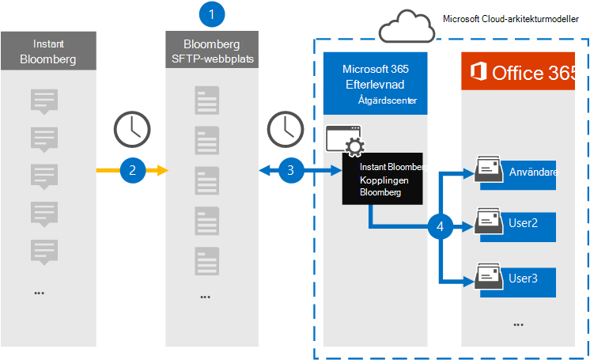

# Konfigurera en koppling för att arkivera Instant Bloomberg-data

Använd en inbyggd koppling i Microsoft 365 efterlevnadscenter för att importera och arkivera chattdata för finansiella tjänster från [samarbetsverktyget Instant Bloomberg.](https://www.bloomberg.com/professional/product/collaboration/) När du har konfigurerat och konfigurerat en anslutning ansluts den till organisationens Bloomberg säkra FTP-webbplats (SFTP) en gång om dagen, konverterar innehållet i chattmeddelanden till ett e-postmeddelandeformat och importerar sedan objekten till postlådor i Microsoft 365.

När Instant Bloomberg-data lagras i användarpostlådor kan du använda efterlevnadsfunktioner i Microsoft 365, till exempel Bevarande av juridiska skäl, Innehållssökning, In-Place Arkivering, Granskning, Kommunikationsefterlevnad och Microsoft 365-bevarandeprinciper för Instant Bloomberg-data. Du kan till exempel söka i chattmeddelanden i Instant Bloomberg med hjälp av Innehållssökning eller associera postlådan som innehåller Instant Bloomberg-data med en medarbetare i ett Advanced eDiscovery ärende. Med en Instant Bloomberg-koppling kan du importera och arkivera data i Microsoft 365 kan hjälpa din organisation att följa myndighets- och regelpolicyer.

## Översikt över arkivering av Instant Bloomberg-data

Följande översikt förklarar processen med att använda en anslutare för att arkivera chattdata från Instant Bloomberg i Microsoft 365. 

1. Din organisation arbetar med Bloomberg för att skapa en Bloomberg SFTP-webbplats. Du kan också samarbeta med Bloomberg för att konfigurera Instant Bloomberg att kopiera chattmeddelanden till din Bloomberg SFTP-webbplats.

2. En gång per dygn kopieras chattmeddelanden från Instant Bloomberg till BloombergS SFTP-webbplats.

3. Den Instant Bloomberg-koppling som du skapar i efterlevnadscentret för Microsoft 365 ansluter till Bloombergs SFTP-webbplats varje dag och överför chattmeddelandena från de föregående 24 timmarna till ett säkert Azure Storage område i Microsoft Cloud. Kopplingen omvandlar också innehållet i en chatt till ett e-postmeddelandeformat.

4. Kopplingen importerar chattmeddelandeobjekten till en viss användares postlåda. En ny mapp med namnet InstantBloomberg skapas i den specifika användarens postlåda och objekten importeras till den. Kopplingen gör detta med hjälp av värdet för egenskapen *CorporateEmailAddress.* Alla chattmeddelanden innehåller den här egenskapen, som fylls i med e-postadressen för alla deltagare i chattmeddelandet. Förutom automatisk användarmappning med värdet för egenskapen *CorporateEmailAddress* kan du också definiera en anpassad mappning genom att ladda upp en CSV-mappningsfil. Den här mappningsfilen ska innehålla Bloomberg UUID och motsvarande e Microsoft 365 postlådeadress för varje användare. Om du aktiverar automatisk användarmappning och tillhandahåller en anpassad mappning kommer kopplingen först att titta på anpassad mappning av filen för varje chattobjekt. Om kopplingen inte hittar en giltig Microsoft 365-användare som motsvarar en användares Bloomberg UUID använder kopplingen egenskapen *CorporateEmailAddress* för chattobjektet. Om kopplingen inte hittar en giltig Microsoft 365-användare i antingen custom-mapping-filen eller *egenskapen CorporateEmailAddress* för chattobjektet, importeras inte objektet.

## Innan du skapa en koppling

Några av de implementeringssteg som krävs för att arkivera Instant Bloomberg-data är Microsoft 365 och måste slutföras innan du kan skapa anslutningen i efterlevnadscentret.

- Om du vill konfigurera en Instant Bloomberg-koppling måste du använda tangenter och tangentpassphraser för PGP (Pretty Good Privacy) och Secure Shell (SSH). Dessa nycklar används för att konfigurera Bloomberg SFTP-webbplatsen och används av kopplingen för att ansluta till BloombergS SFTP-webbplatsen för att importera data till Microsoft 365. PGP-nyckeln används för att konfigurera krypteringen av data som överförs från BloombergS SFTP-webbplatsen till Microsoft 365. SSH-nyckeln används för att konfigurera säkert gränssnitt för att aktivera en säker fjärrinloggning när kopplingen ansluter till BloombergS SFTP-webbplatsen.

  När du inställningar för en koppling kan du välja att använda offentliga tangenter och lösenordsfraser som tillhandahålls av Microsoft, eller så kan du använda dina egna privata nycklar och lösenord. Vi rekommenderar att du använder de offentliga nycklar som tillhandahålls av Microsoft. Men om din organisation redan har konfigurerat en Bloomberg SFTP-webbplats med privata nycklar kan du skapa en koppling med samma privata nycklar.

- Prenumerera på [Bloomberg Anywhere](https://www.bloomberg.com/professional/product/remote-access/?bbgsum-page=DG-WS-PROF-PROD-BBA). Detta krävs för att du ska kunna logga in på Bloomberg Anywhere för att komma åt BloombergS SFTP-webbplatsen som du måste konfigurera.

- Konfigurera en Bloomberg SFTP-webbplats (Secure File Transfer Protocol). När du har arbetat med Bloomberg med att konfigurera SFTP-webbplatsen laddas data från Instant Bloomberg upp till SFTP-webbplatsen varje dag. Kopplingen som du skapar i steg 2 ansluter till den här SFTP-webbplatsen och överför chattdata till Microsoft 365 postlådor. SFTP krypterar även chattdata från Instant Bloomberg som skickas till postlådor under överföringsprocessen.

  Mer information om Bloomberg SFTP (kallas *även BB-SFTP*):

  - Se dokumentet "SFTP Connectivity Standards" på [Bloomberg Support.](https://www.bloomberg.com/professional/support/documentation/)

  - Kontakta [Bloombergs kundsupport](https://service.bloomberg.com/portal/sessions/new?utm_source=bloomberg-menu&utm_medium=csc).

  När du har samarbetat med Bloomberg med att konfigurera en SFTP-webbplats kommer Bloomberg att ge dig viss information när du svarar på e-postmeddelandet från Bloomberg-implementeringen. Spara en kopia av följande information. Du använder den för att konfigurera en koppling i steg 3.

  - Fast kod, som är ett ID för din organisation och används för att logga in på Bloomberg SFTP-webbplatsen.

  - Lösenord för din Bloomberg SFTP-webbplats

  - URL för Bloomberg SFTP-webbplats (till exempel sftp.bloomberg.com)

  - Portnummer för Bloomberg SFTP-webbplats

- Kopplingen Instant Bloomberg kan importera totalt 200 000 objekt på en och samma dag. Om det finns fler än 200 000 objekt på SFTP-webbplatsen importeras inga av dessa objekt till Microsoft 365.

- Den användare som skapar en Instant Bloomberg-koppling i steg 3 (och som laddar ned de offentliga nycklarna och IP-adressen i steg 1) måste tilldelas rollen Importera och exportera postlåda i Exchange Online. Detta krävs för att lägga till kopplingar på **sidan Datakopplingar** i Microsoft 365 kompatibilitetscenter. Som standard är den här rollen inte tilldelad någon rollgrupp i Exchange Online. Du kan lägga till rollen Importera och exportera postlåda i rollgruppen Organisationshantering i Exchange Online. Du kan också skapa en rollgrupp, tilldela rollen Importera och exportera postlåda och sedan lägga till lämpliga användare som medlemmar. Mer information finns i avsnitten [Skapa rollgrupper](/Exchange/permissions-exo/role-groups#create-role-groups) och [Ändra rollgrupper](/Exchange/permissions-exo/role-groups#modify-role-groups) i artikeln "Hantera rollgrupper i Exchange Online".

## Konfigurera en koppling med hjälp av offentliga tangenter

Anvisningarna i det här avsnittet visar hur du inställningar för en Instant Bloomberg-koppling med hjälp av de offentliga tangenterna för PGP (Pretty Good Privacy) och Secure Shell (SSH).

### Steg 1: Hämta PGP och SSH och offentliga nycklar

Det första steget är att skaffa en kopia av de offentliga nycklarna för PGP (Pretty Good Privacy) och Secure Shell (SSH). Du använder de här nycklarna i steg 2 för att konfigurera Bloombergs SFTP-webbplats så att kopplingen (som du skapar i steg 3) ansluter till SFTP-webbplatsen och överför chattdata för Instant Bloomberg till Microsoft 365 postlådor. Du får också en IP-adress i det här steget, som du använder när du konfigurerar BloombergS SFTP-webbplatsen.

1. Gå till <https://compliance.microsoft.com> och klicka på **Datakopplingar** i det vänstra navigeringsfältet.

2. På sidan **Datakopplingar** under **Instant Bloomberg klickar** du på **Visa**.

3. Klicka på Lägg till koppling på sidan Snabbbeskrivning av **Produktbeskrivning i** **Bloomberg**

4. Klicka på **Acceptera på** sidan **Användningsvillkor.**

5. På sidan **Lägg till autentiseringsuppgifter för innehållskälla** klickar du på **Jag vill använda offentliga PGP- och SSH-nycklar från Microsoft.**

   

6. Under steg 1 klickar du på Länkarna Ladda ned **SSH**, Ladda ned **PGP-tangenten** och Ladda ned **IP-adresslänkar** för att spara en kopia av varje fil på din lokala dator.

   

   Dessa filer innehåller följande objekt som används för att konfigurera Bloomberg SFTP-webbplatsen i steg 2:

   - Offentlig PGP-nyckel: Den här nyckeln används för att konfigurera kryptering av data som överförs från BloombergS SFTP-webbplatsen till Microsoft 365.

   - Offentlig SSH-nyckel: Den här nyckeln används för att konfigurera säkert gränssnitt för att aktivera en säker fjärrinloggning när kopplingen ansluter till Bloomberg SFTP-webbplatsen.

   - IP-adress: BloombergS SFTP-webbplatsen är konfigurerad att acceptera anslutningsförfrågningar från den här IP-adressen. Samma IP-adress används av Instant Bloomberg-kopplingen för att ansluta till SFTP-webbplatsen och överföra Instant Bloomberg-data till Microsoft 365.

7. Stäng **guiden genom** att klicka på Avbryt. Du kommer tillbaka till den här guiden i Steg 3 för att skapa kopplingen.

### Steg 2: Konfigurera Bloomberg SFTP-webbplatsen

Nästa steg är att använda de offentliga tangenterna PGP och SSH och IP-adressen som du fick i steg 1 för att konfigurera PGP-kryptering och SSH-autentisering för Bloomberg SFTP-webbplatsen. Det gör att Instant Bloomberg-kopplingen som du skapade i steg 3 ansluter till BloombergS SFTP-webbplatsen och överför Instant Bloomberg-data till Microsoft 365. Du måste arbeta med Bloombergs kundsupport för att konfigurera din Sftp-webbplats för Bloomberg. Kontakta [Bloombergs kundsupport om](https://service.bloomberg.com/portal/sessions/new?utm_source=bloomberg-menu&utm_medium=csc) du behöver hjälp. 

> [!IMPORTANT]
> Bloomberg rekommenderar att du bifogar de tre filer som du hämtade i steg 1 i ett e-postmeddelande och skickar det till kundsupportteamet när de arbetar med dem för att konfigurera din Sftp-webbplats för Bloomberg.

### Steg 3: Skapa en Instant Bloomberg-koppling

Det sista steget är att skapa en Instant Bloomberg-koppling i Microsoft 365 kompatibilitetscenter. Kopplingen använder den information du anger för att ansluta till Bloombergs SFTP-webbplats och överföra chattmeddelanden till motsvarande postlåderutor för användare i Microsoft 365.

1. Gå till <https://compliance.microsoft.com> och klicka sedan på **Datakopplingar**  >  **Instant Bloomberg.**

2. Klicka på Lägg till koppling på sidan Snabbbeskrivning av **Produktbeskrivning i** **Bloomberg**

3. Klicka på **Acceptera på** sidan **Användningsvillkor.**

4. På sidan **Lägg till autentiseringsuppgifter för Bloomberg SFTP-webbplatsen,** under Steg 3, anger du den information som krävs i följande rutor och klickar sedan på **Nästa.**

    - **Företagskod:** ID för din organisation som används som användarnamn på Bloomberg SFTP-webbplatsen.

    - **Lösenord:** Lösenord för Bloomberg SFTP-webbplats.

    - **SFTP-URL:** URL-adressen för Bloomberg SFTP-webbplatsen (till exempel `sftp.bloomberg.com` ). Du kan också använda en IP-adress för det här värdet.

    - **SFTP-port:** Portnumret för Bloomberg SFTP-webbplatsen. Kopplingen använder den här porten för att ansluta till SFTP-webbplatsen.

5. På sidan **Välj datatyper att importera** väljer du de datatyper som krävs för att importeras från **meddelanden**

6. På sidan **Koppla Instant Bloomberg-användare till Microsoft 365 aktiverar** du automatisk användarmappning och anger anpassad användarmappning efter behov

   > [!NOTE]
   > Kopplingen importerar chattmeddelandeobjekten till en viss användares postlåda. En ny mapp **med namnet InstantBloomberg** skapas i den specifika användarens postlåda och objekten importeras till den. Kopplingen gör det med värdet för egenskapen *CorporateEmailAddress.* Varje chattmeddelande innehåller den här egenskapen och egenskapen fylls i med e-postadressen för alla deltagare i chattmeddelandet. Förutom automatisk användarmappning med värdet för egenskapen *CorporateEmailAddress* kan du också definiera anpassad mappning genom att ladda upp en CSV-mappningsfil. Mappningsfilen ska innehålla Bloomberg UUID och motsvarande Microsoft 365 postlådeadress för varje användare. Om du aktiverar automatisk användarmappning och tillhandahåller en anpassad mappning kommer kopplingen först att titta på anpassad mappningsfil för varje chattobjekt. Om kopplingen inte hittar en giltig Microsoft 365-användare som motsvarar en användares Bloomberg UUID använder kopplingen egenskapen *CorporateEmailAddress* för chattobjektet. Om kopplingen inte hittar en giltig Microsoft 365-användare i antingen den anpassade mappningsfilen eller egenskapen *CorporateEmailAddress* för chattobjektet, importeras inte objektet.

7. Klicka **på** Nästa, granska dina inställningar och klicka sedan **på Slutför** för att skapa kopplingen.

8. Gå till **sidan Datakopplingar** för att se förloppet för importen för den nya anslutningen. Klicka på kopplingen för att visa den utfällade sidan som innehåller information om kopplingen.

## Konfigurera en koppling med privata nycklar

Stegen i det här avsnittet visar hur du ställer in en Instant Bloomberg-koppling med privata PGP- och SSH-tangenter. Det här alternativet för kopplingskonfiguration är avsett för organisationer som redan har konfigurerat en Bloomberg SFTP-webbplats med privata nycklar.

### Steg 1: Hämta en IP-adress för att konfigurera Bloomberg SFTP-webbplatsen

> [!NOTE]
> Om din organisation tidigare har konfigurerat en Bloomberg SFTP-webbplats för att arkivera data i Bloomberg Message med privata PGP- och SSH-nycklar behöver du inte konfigurera en annan. Du kan ange samma SFTP-webbplats när du skapar kopplingen i steg 2.

Om din organisation har använt privata PGP- och SSH-nycklar för att konfigurera en Bloomberg SFTP-webbplats måste du ha en IP-adress och ge den till Bloombergs kundsupport. Bloombergs SFTP-webbplats måste vara konfigurerad för att acceptera anslutningsförfrågningar från denna IP-adress. Samma IP-adress används av Instant Bloomberg-kopplingen för att ansluta till SFTP-webbplatsen och överföra Instant Bloomberg-data till Microsoft 365.

Så här hämtar du IP-adressen:

1. Gå till <https://compliance.microsoft.com> och klicka på **Datakopplingar** i det vänstra navigeringsfältet.

2. På sidan **Datakopplingar** under **Instant Bloomberg klickar** du på **Visa**.

3. Klicka på Lägg till koppling på sidan Snabbbeskrivning av **Produktbeskrivning i** **Bloomberg**

4. Klicka på **Acceptera på** sidan **Användningsvillkor.**

5. På sidan **Lägg till autentiseringsuppgifter för innehållskälla** klickar du **på Jag vill använda privata PGP- och SSH-nycklar.**

6. Under steg 1 klickar du på **Ladda ned IP-adress** för att spara en kopia av IP-adressfilen på den lokala datorn.

   

7. Stäng **guiden genom** att klicka på Avbryt. Du kommer tillbaka till den här guiden i steg 2 för att skapa kopplingen.

Du måste arbeta med Bloombergs kundsupport för att konfigurera din SFTP-webbplats för Bloomberg att acceptera anslutningsförfrågningar från den här IP-adressen. Kontakta [Bloombergs kundsupport om](https://service.bloomberg.com/portal/sessions/new?utm_source=bloomberg-menu&utm_medium=csc) du behöver hjälp.

### Steg 2: Skapa en Instant Bloomberg-koppling

När du har konfigurerat BloombergS SFTP-webbplatsen är nästa steg att skapa en Instant Bloomberg-koppling i Microsoft 365 efterlevnadscenter. Kopplingen använder den information du anger för att ansluta till Bloombergs SFTP-webbplats och överföra e-postmeddelanden till motsvarande rutor för användarpostlådor i Microsoft 365. För att slutföra det här steget ska du se till att ha kopior av samma privata nycklar och lösenordslösenord som du använde för att konfigurera din Bloomberg SFTP-webbplats.

1. Gå till <https://compliance.microsoft.com> och klicka på **Datakopplingar** i det vänstra navigeringsfältet.

2. På sidan **Datakopplingar** under **Instant Bloomberg klickar** du på **Visa**.

3. Klicka på Lägg till koppling på sidan Snabbbeskrivning av **Produktbeskrivning i** **Bloomberg**

4. Klicka på **Acceptera på** sidan **Användningsvillkor.**

5. På sidan **Lägg till autentiseringsuppgifter för innehållskälla** klickar du **på Jag vill använda privata PGP- och SSH-nycklar.**

   

6. Under Steg 3 anger du den information som krävs i följande rutor och klickar sedan på **Verifiera anslutning.**

      - **Namn:** Namnet på kopplingen. Den måste vara unik i din organisation.

      - **Företagskod:** ID för din organisation som används som användarnamn på Bloomberg SFTP-webbplatsen.

      - **Lösenord:** Lösenordet för din organisations Bloomberg SFTP-webbplats.

      - **SFTP-URL:** URL-adressen för Bloomberg SFTP-webbplatsen (till exempel `sftp.bloomberg.com` ). Du kan också använda en IP-adress för det här värdet.

      - **SFTP-port:** Portnumret för Bloomberg SFTP-webbplatsen. Kopplingen använder den här porten för att ansluta till SFTP-webbplatsen.

      - **Privat PGP-nyckel:** Den privata PGP-nyckeln för Bloomberg SFTP-webbplatsen. Se till att ta med hela det privata nyckelvärdet, inklusive de första och sista raderna i nyckelblocket.

      - **PGP-nyckelfras:** Lösenordsfrasen för den privata PGP-nyckeln.

      - **Privat SSH-nyckel:** Den privata SSH-nyckeln för Bloomberg SFTP-webbplatsen. Se till att ta med hela det privata nyckelvärdet, inklusive de första och sista raderna i nyckelblocket.

      - **Lösenord för SSH-tangenten:** Lösenordsfrasen för den privata SSH-nyckeln.

7. När anslutningen har verifierats klickar du på **Nästa.**

8. På sidan **Koppla Instant Bloomberg-användare till Microsoft 365 aktiverar** du automatisk användarmappning och anger anpassad användarmappning efter behov.

   > [!NOTE]
   > Kopplingen importerar chattmeddelandeobjekten till en viss användares postlåda. En ny mapp **med namnet InstantBloomberg** skapas i den specifika användarens postlåda och objekten importeras till den. Kopplingen gör det med värdet för egenskapen *CorporateEmailAddress.* Varje chattmeddelande innehåller den här egenskapen och egenskapen fylls i med e-postadressen för alla deltagare i chattmeddelandet. Förutom automatisk användarmappning med värdet för egenskapen *CorporateEmailAddress* kan du också definiera anpassad mappning genom att ladda upp en CSV-mappningsfil. Mappningsfilen ska innehålla Bloomberg UUID och motsvarande Microsoft 365 postlådeadress för varje användare. Om du aktiverar automatisk användarmappning och tillhandahåller en anpassad mappning kommer kopplingen först att titta på anpassad mappningsfil för varje chattobjekt. Om kopplingen inte hittar en giltig Microsoft 365-användare som motsvarar en användares Bloomberg UUID använder kopplingen egenskapen *CorporateEmailAddress* för chattobjektet. Om kopplingen inte hittar en giltig Microsoft 365-användare i antingen den anpassade mappningsfilen eller egenskapen *CorporateEmailAddress* för chattobjektet, importeras inte objektet.

9. Klicka **på** Nästa, granska dina inställningar och klicka sedan **på Slutför** för att skapa kopplingen.

10. Gå till **sidan Datakopplingar** för att se förloppet för importen för den nya anslutningen. Klicka på kopplingen för att visa den utfällade sidan som innehåller information om kopplingen.
