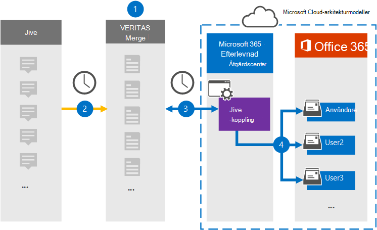

# Konfigurera en koppling för att arkivera Jive-dataSet up a connector to archive Jive data

Använd en Veritas-koppling i Microsoft 365 efterlevnadscenter om du vill importera och arkivera data från samarbetsplattformen till användarpostlådor i Microsoft 365 organisation.Use a Veritas connector in the Microsoft 365 compliance center to import and archive data from the collaboration platform to user mailboxes in your Microsoft 365 organization. Veritas tillhandahåller en [Jive-koppling](https://globanet.com/jive/) som har konfigurerats för att hämta objekt från tredje parts datakälla (regelbundet) och sedan importera de objekten till Microsoft 365.Veritas provides a [Jive](https://globanet.com/jive/) connector that is configured to capture items from the third-party data source (on a regular basis) and then import those items to Microsoft 365. Kopplingen omvandlar innehåll som e-postmeddelanden, chattar och bifogade filer från en användares Jive-konto till ett e-postmeddelandeformat och importerar sedan objekten till användarens postlåda i Microsoft 365.The connector converts content such as email messages, chats, and attachments from a user's Jive account to an email message format and then imports those items to the user's mailbox in Microsoft 365.

När Jive-data har lagrats i användarnas postlådor kan du använda efterlevnadsfunktioner i Microsoft 365, till exempel Bevarande av juridiska skäl, eDiscovery, bevarandeprinciper och bevarandeetiketter samt kommunikationsefterlevnad.After Jive data is stored in user mailboxes, you can apply Microsoft 365 compliance features such as Litigation Hold, eDiscovery, retention policies and retention labels, and communication compliance. Om du använder en Jive-anslutning för att importera och arkivera data i Microsoft 365 kan detta hjälpa din organisation att följa myndighets- och regleringsprinciperna.Using a Jive connector to import and archive data in Microsoft 365 can help your organization stay compliant with government and regulatory policies.

## Översikt över arkivering av Jive-dataOverview of archiving Jive data

I följande översikt beskrivs hur du använder en koppling för att arkivera Jive-data i Microsoft 365.The following overview explains the process of using a connector to archive the Jive data in Microsoft 365.

1. Din organisation arbetar med Jive för att konfigurera en Jive-webbplats.Your organization works with Jive to set up and configure a Jive site.

2. En gång per dygn kopieras objekt från Jive till webbplatsen Veritas Merge1.Once every 24 hours, items from Jive are copied to the Veritas Merge1 site. Kopplingen konverterar även innehållet i Jive-objekt till ett e-postmeddelandeformat.The connector also converts the content of Jive items to an email message format.

3. Den Jive-koppling som du skapar i kompatibilitetscentret för Microsoft 365 ansluter till Veritas Merge1-webbplatsen varje dag och överför innehållet till en säker Azure Storage plats i Microsoft-molnet.The Jive connector that you create in the Microsoft 365 compliance center connects to the Veritas Merge1 site every day and transfers the content to a secure Azure Storage location in the Microsoft cloud.

4. Kopplingen importerar de konverterade objekten till postlådorna för  specifika användare med hjälp av värdet för egenskapen E-post för den automatiska användarmappningen enligt beskrivningen [i steg 3.](#step-3-map-users-and-complete-the-connector-setup)The connector imports the converted items to the mailboxes of specific users by using the value of the *Email* property of the automatic user mapping as described in [Step 3](#step-3-map-users-and-complete-the-connector-setup). En ny undermapp i mappen Inkorgen med namnet **Jive** skapas i användarnas postlådor och objekten importeras till den mappen.A new subfolder in the Inbox folder named **Jive** is created in the user mailboxes, and the items are imported to that folder. Kopplingen gör detta med hjälp av värdet för egenskapen *E-post.*The connector does this by using the value of the *Email* property. Alla Jive-objekt innehåller den här egenskapen, som fylls i med e-postadressen för alla deltagare i objektet.Every Jive item contains this property, which is populated with the email address of every participant of the item.

## Innan du börjarBefore you begin

- Skapa ett Veritas Merge1-konto för Microsoft-kopplingar.Create a Veritas Merge1 account for Microsoft connectors. Om du vill skapa det här kontot [kontaktar du Veritas kundsupport.](https://www.veritas.com/content/support/)To create this account, contact [Veritas Customer Support](https://www.veritas.com/content/support/). Du loggar in på det här kontot när du skapar kopplingen i steg 1.You will sign into this account when you create the connector in Step 1.

- Den användare som skapar Jive-kopplingen i steg 1 (och slutför den i steg 3) måste tilldelas rollen Importera och exportera postlåda i Exchange Online.The user who creates the Jive connector in Step 1 (and completes it in Step 3) must be assigned to the Mailbox Import Export role in Exchange Online. Den här rollen krävs för att lägga till kopplingar **på sidan Datakopplingar** i Microsoft 365 kompatibilitetscenter.This role is required to add connectors on the **Data connectors** page in the Microsoft 365 compliance center. Som standard är den här rollen inte tilldelad en rollgrupp i Exchange Online.By default, this role is not assigned to a role group in Exchange Online. Du kan lägga till rollen Importera och exportera postlåda i rollgruppen Organisationshantering i Exchange Online.You can add the Mailbox Import Export role to the Organization Management role group in Exchange Online. Du kan också skapa en rollgrupp, tilldela rollen Importera och exportera postlåda och sedan lägga till lämpliga användare som medlemmar.Or you can create a role group, assign the Mailbox Import Export role, and then add the appropriate users as members. Mer information finns i avsnitten [Skapa rollgrupper](/Exchange/permissions-exo/role-groups#create-role-groups) och [Ändra rollgrupper](/Exchange/permissions-exo/role-groups#modify-role-groups) i artikeln "Hantera rollgrupper i Exchange Online".For more information, see the [Create role groups](/Exchange/permissions-exo/role-groups#create-role-groups) or [Modify role groups](/Exchange/permissions-exo/role-groups#modify-role-groups) sections in the article "Manage role groups in Exchange Online".

## Steg 1: Konfigurera Jive-kopplingenStep 1: Set up the Jive connector

Det första steget är att komma åt sidan Datakopplingar i Microsoft 365 **kompatibilitetscenter** och skapa en koppling för Jive-data.The first step is to access to the **Data Connectors** page in the Microsoft 365 compliance center and create a connector for Jive data.

1. Gå till [https://compliance.microsoft.com](https://compliance.microsoft.com/) och klicka sedan på **Datakopplingar**  >  **Jive.**Go to [https://compliance.microsoft.com](https://compliance.microsoft.com/) and then click **Data connectors** > **Jive**.

2. På sidan **Jive** produktbeskrivning klickar du på **Lägg till koppling**.On the **Jive** product description page, click **Add connector**.

3. Klicka på **Acceptera på** sidan **Användningsvillkor.**On the **Terms of service** page, click **Accept**.

4. Ange ett unikt namn som identifierar kopplingen och klicka sedan på **Nästa.**Enter a unique name that identifies the connector, and then click **Next**.

5. Logga in på ditt Merge1-konto för att konfigurera kopplingen.Sign in to your Merge1 account to configure the connector.

## Steg 2: Konfigurera Jive-kopplingenStep 2: Configure the Jive connector

Det andra steget är att konfigurera Jive-kopplingen på webbplatsen Merge1.The second step is to configure the Jive connector on the Merge1 site. Mer information om hur du konfigurerar Jive-kopplingen finns i [Användarhandbok för slå samman1 kopplingar från tredje part.](https://docs.ms.merge1.globanetportal.com/Merge1%20Third-Party%20Connectors%20Jive%20User%20Guide.pdf)For information about how to configure the Jive connector, see [Merge1 Third-Party Connectors User Guide](https://docs.ms.merge1.globanetportal.com/Merge1%20Third-Party%20Connectors%20Jive%20User%20Guide.pdf).

När du har **klickat &**  på Spara eller & visas sidan Användarmappning i kopplingsguiden i Microsoft 365 kompatibilitetscenter.After you click **Save & Finish**, the **User mapping** page in the connector wizard in the Microsoft 365 compliance center is displayed.

## Steg 3: Mappa användare och slutför kopplingskonfigurationenStep 3: Map users and complete the connector setup

Om du vill mappa användare och slutföra anslutningskonfigurationen i Microsoft 365 efterlevnadscenter följer du stegen nedan:To map users and complete the connector setup in the Microsoft 365 compliance center, follow the steps below:

1. På sidan **Koppla Jive användare till Microsoft 365 aktiverar** du automatisk användarmappning.On the **Map Jive users to Microsoft 365 users** page, enable automatic user mapping. Jive-objekten innehåller egenskapen *E-post,* som innehåller e-postadresser för användare i organisationen.The Jive items include a property called *Email*, which contains email addresses for users in your organization. Om kopplingen kan associera den här adressen Microsoft 365 en användare importeras objekten till den användarens postlåda.If the connector can associate this address with a Microsoft 365 user, the items are imported to that user's mailbox.

2. Klicka **på** Nästa , granska dina inställningar och gå till sidan **Datakopplingar** för att se förloppet för importen för den nya anslutningen.Click **Next**, review your settings, and go to the **Data connectors** page to see the progress of the import process for the new connector.

## Steg 4: Övervaka Jive-kopplingenStep 4: Monitor the Jive connector

När du har skapat Jive-kopplingen kan du visa kopplingsstatusen Microsoft 365 kompatibilitetscentret.After you create the Jive connector, you can view the connector status in the Microsoft 365 compliance center.

1. Gå till [https://compliance.microsoft.com](https://compliance.microsoft.com) och klicka på **Datakopplingar** i det vänstra navigeringsfältet.Go to [https://compliance.microsoft.com](https://compliance.microsoft.com) and click **Data connectors** in the left nav.

2. Klicka på **fliken Kopplingar** och välj sedan **Jive-kopplingen** för att visa den utfällbara sidan.Click the **Connectors** tab and then select the **Jive** connector to display the flyout page. Den här sidan innehåller egenskaper och information om kopplingen.This page contains the properties and information about the connector.

3. Under **Anslutningsstatus med källa** klickar du på länken Ladda ned **logg** för att öppna (eller spara) statusloggen för kopplingen.Under **Connector status with source**, click the **Download log** link to open (or save) the status log for the connector. Den här loggen innehåller information om de data som har importerats till Microsoft-molnet.This log contains information about the data that has been imported to the Microsoft cloud.

## Kända problemKnown issues

- För stunden går det inte att importera bifogade filer eller objekt som är större än 10 MB.At this time, we don't support importing attachments or items that are larger than 10 MB. Stöd för större objekt blir tillgängligt vid ett senare tillfälle.Support for larger items will be available at a later date.