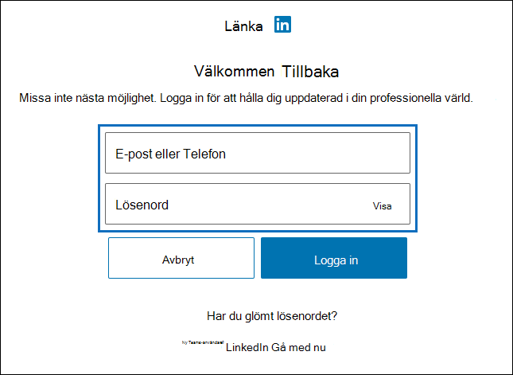

# Konfigurera en koppling för att arkivera LinkedIn-data

Använd en koppling i Microsoft 365 för att importera och arkivera data från LinkedIn-företagssidor. När du har konfigurerat och konfigurerat en anslutare ansluts den till kontot för den specifika LinkedIn-sidan en gång per dygn. Kopplingen konverterar de meddelanden som publicerats på sidan Företag till ett e-postmeddelande och importerar sedan dessa objekt till en postlåda i Microsoft 365.

När sidan LinkedIn Company har lagrats i en postlåda kan du tillämpa efterlevnadsfunktioner i Microsoft 365, till exempel Bevarande av juridiska skäl, Innehållssökning, In-Place Arkivering, Granskning och Microsoft 365-bevarandeprinciper på LinkedIn-data. Du kan till exempel söka efter de här objekten med hjälp av Innehållssökning eller associera lagringspostlådan med en medarbetare i ett Advanced eDiscovery fall. Genom att skapa en anslutare för att importera och arkivera LinkedIn-data i Microsoft 365 kan hjälpa din organisation att följa myndighets- och regleringsprinciper.

## Innan du skapa en koppling

- Den användare som skapar en anslutning för LinkedIn-företagssidan måste tilldelas rollen Importera och exportera postlåda i Exchange Online. Detta krävs för att lägga till kopplingar på **sidan Datakopplingar** i Microsoft 365 kompatibilitetscenter. Som standard är den här rollen inte tilldelad någon rollgrupp i Exchange Online. Du kan lägga till rollen Importera och exportera postlåda i rollgruppen Organisationshantering i Exchange Online. Du kan också skapa en rollgrupp, tilldela rollen Importera och exportera postlåda och sedan lägga till lämpliga användare som medlemmar. Mer information finns i avsnitten [Skapa rollgrupper](/Exchange/permissions-exo/role-groups#create-role-groups) och [Ändra rollgrupper](/Exchange/permissions-exo/role-groups#modify-role-groups) i artikeln "Hantera rollgrupper i Exchange Online".

- Du måste ha inloggningsuppgifter (e-postadress eller telefonnummer och lösenord) för ett LinkedIn-användarkonto som är administratör för LinkedIn-företagssidan som du vill arkivera. Du använder de här autentiseringsuppgifterna för att logga in på LinkedIn när du inställningar för anslutningen.

- Med LinkedIn-kopplingen kan totalt 200 000 objekt importeras på en och samma dag. Om det finns fler än 200 000 LinkedIn-objekt på ett dygn importeras inga av dessa objekt till Microsoft 365.

## Skapa en LinkedIn-koppling

1. Gå till <https://compliance.microsoft.com> och klicka på **Datakopplingar**  >  **LinkedIn-företagssidor.**

2. På **produktsidan LinkedIn-företagssidor** klickar du på **Lägg till koppling.**

3. Välj **Acceptera på sidan** **Användningsvillkor.**

4. På sidan **Logga in med LinkedIn** klickar du på **Logga in med LinkedIn.**

   Inloggningssidan för LinkedIn visas.

   

5. På inloggningssidan för LinkedIn anger du e-postadressen (eller telefonnumret) och lösenordet för det LinkedIn-konto som är kopplat till företagssidan som du vill arkivera och klickar sedan på **Logga in.**

   En guidesida visas med en lista över alla LinkedIn-företagssidor som är kopplade till det konto som du loggade in på. En koppling kan bara konfigureras för en företagssida. Om din organisation har flera LinkedIn-företagssidor måste du skapa en koppling för var och en av dem.

   

6. Välj den företagssida som du vill arkivera objekt från och klicka sedan på **Nästa.**

7. På sidan **Välj lagringsplats** klickar du i rutan, markerar e-postadressen till en Microsoft 365 postlåda som LinkedIn-objekten ska importeras till och klickar sedan på **Nästa.** Objekt importeras till mappen Inkorg i den här postlådan.

8. Klicka **på Nästa** för att granska kopplingsinställningarna och klicka sedan på **Slutför** för att slutföra kopplingens konfiguration.

När du har skapat kopplingen kan du gå tillbaka till sidan **Datakopplingar** och se  importprocessen för den nya anslutningen (välj Uppdatera om det behövs för att uppdatera listan med kopplingar). Värdet i kolumnen **Status** är Väntar **på att starta.** Det tar upp till 24 timmar innan den första importen startas. Efter första gången kopplingen körs och importerar LinkedIn-objekten körs kopplingen en gång per dygn och nya objekt som skapas på LinkedIn-företagssidan importeras de senaste 24 timmarna.

Om du vill visa mer information väljer du kopplingen i listan på sidan **Datakopplingar** för att visa den utfällade sidan. Under **Status** visar det datumintervall som visas åldersfiltret som valdes när kopplingen skapades.

## Mer information

LinkedIn-objekt importeras till LinkedIn-undermappen i inkorgen i lagringspostlådan i Microsoft 365. De visas som e-postmeddelanden.