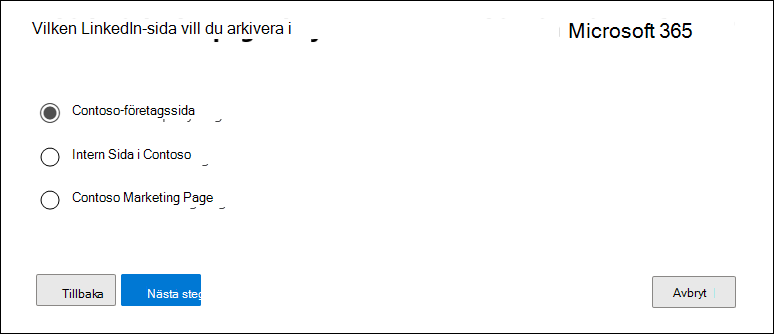

# Konfigurera en koppling för att arkivera LinkedIn-dataSet up a connector to archive LinkedIn data

Använd en koppling i Microsoft 365 för att importera och arkivera data från LinkedIn-företagssidor.Use a connector in the Microsoft 365 compliance center to import and archive data from LinkedIn Company pages. När du har konfigurerat och konfigurerat en anslutare ansluts den till kontot för den specifika LinkedIn-sidan en gång per dygn.After you set up and configure a connector, it connects to the account for the specific LinkedIn Company page once every 24 hours. Kopplingen konverterar de meddelanden som publicerats på sidan Företag till ett e-postmeddelande och importerar sedan dessa objekt till en postlåda i Microsoft 365.The connector converts the messages posted to the Company page to an email message, and then imports those items to a mailbox in Microsoft 365.

När sidan LinkedIn Company har lagrats i en postlåda kan du tillämpa efterlevnadsfunktioner i Microsoft 365, till exempel Bevarande av juridiska skäl, Innehållssökning, In-Place Arkivering, Granskning och Microsoft 365-bevarandeprinciper på LinkedIn-data.After the LinkedIn Company page data is stored in a mailbox, you can apply Microsoft 365 compliance features such as Litigation Hold, Content Search, In-Place Archiving, Auditing, and Microsoft 365 retention policies to LinkedIn data. Du kan till exempel söka efter de här objekten med hjälp av Innehållssökning eller associera lagringspostlådan med en medarbetare i ett Advanced eDiscovery fall.For example, you can search for these items using Content Search or associate the storage mailbox with a custodian in an Advanced eDiscovery case. Genom att skapa en anslutare för att importera och arkivera LinkedIn-data i Microsoft 365 kan hjälpa din organisation att följa myndighets- och regleringsprinciper.Creating a connector to import and archive LinkedIn data in Microsoft 365 can help your organization stay compliant with government and regulatory policies.

## Innan du skapa en kopplingBefore you set up a connector

- Den användare som skapar en anslutning för LinkedIn-företagssidan måste tilldelas rollen Importera och exportera postlåda i Exchange Online.The user who creates a LinkedIn Company Page connector must be assigned the Mailbox Import Export role in Exchange Online. Detta krävs för att lägga till kopplingar på **sidan Datakopplingar** i Microsoft 365 kompatibilitetscenter.This is required to add connectors in the **Data connectors** page in the Microsoft 365 compliance center. Som standard är den här rollen inte tilldelad någon rollgrupp i Exchange Online.By default, this role isn't assigned to any role group in Exchange Online. Du kan lägga till rollen Importera och exportera postlåda i rollgruppen Organisationshantering i Exchange Online.You can add the Mailbox Import Export role to the Organization Management role group in Exchange Online. Du kan också skapa en rollgrupp, tilldela rollen Importera och exportera postlåda och sedan lägga till lämpliga användare som medlemmar.Or you can create a role group, assign the Mailbox Import Export role, and then add the appropriate users as members. Mer information finns i avsnitten [Skapa rollgrupper](/Exchange/permissions-exo/role-groups#create-role-groups) och [Ändra rollgrupper](/Exchange/permissions-exo/role-groups#modify-role-groups) i artikeln "Hantera rollgrupper i Exchange Online".For more information, see the [Create role groups](/Exchange/permissions-exo/role-groups#create-role-groups) or [Modify role groups](/Exchange/permissions-exo/role-groups#modify-role-groups) sections in the article "Manage role groups in Exchange Online".

- Du måste ha inloggningsuppgifter (e-postadress eller telefonnummer och lösenord) för ett LinkedIn-användarkonto som är administratör för LinkedIn-företagssidan som du vill arkivera.You must have the sign-in credentials (email address or phone number and password) of a LinkedIn user account that is an admin for the LinkedIn Company Page that you want to archive. Du använder de här autentiseringsuppgifterna för att logga in på LinkedIn när du inställningar för anslutningen.You use these credentials to sign into LinkedIn when setting up the connector.

- Med LinkedIn-kopplingen kan totalt 200 000 objekt importeras på en och samma dag.The LinkedIn connector can import a total of 200,000 items in a single day. Om det finns fler än 200 000 LinkedIn-objekt på ett dygn importeras inga av dessa objekt till Microsoft 365.If there are more than 200,000 LinkedIn items in a day, none of those items will be imported to Microsoft 365.

## Skapa en LinkedIn-kopplingCreate a LinkedIn connector

1. Gå till <https://compliance.microsoft.com> och klicka på **Datakopplingar**  >  **LinkedIn-företagssidor.**Go to <https://compliance.microsoft.com> and then click **Data connectors** > **LinkedIn Company pages**.

2. På **produktsidan LinkedIn-företagssidor** klickar du på **Lägg till koppling.**On the **LinkedIn company pages** product page, click **Add connector**.

3. Välj **Acceptera på sidan** **Användningsvillkor.**On the **Terms of service** page, select **Accept**.

4. På sidan **Logga in med LinkedIn** klickar du på **Logga in med LinkedIn.**On the **Sign in with LinkedIn** page, click **Sign in with LinkedIn**.

   Inloggningssidan för LinkedIn visas.The LinkedIn sign-in page is displayed.

   

5. På inloggningssidan för LinkedIn anger du e-postadressen (eller telefonnumret) och lösenordet för det LinkedIn-konto som är kopplat till företagssidan som du vill arkivera och klickar sedan på **Logga in.**On the LinkedIn sign in page, enter the email address (or phone number) and password for the LinkedIn account associated with the company page that you want to archive, and then click **Sign in**.

   En guidesida visas med en lista över alla LinkedIn-företagssidor som är kopplade till det konto som du loggade in på.A wizard page is displayed with a list of all LinkedIn Company Pages associated with the account that you signed in to. En koppling kan bara konfigureras för en företagssida.A connector can only be configured for one company page. Om din organisation har flera LinkedIn-företagssidor måste du skapa en koppling för var och en av dem.If your organization has multiple LinkedIn Company Pages, you have to create a connector for each one.

   

6. Välj den företagssida som du vill arkivera objekt från och klicka sedan på **Nästa.**Select the company page that you want to archive items from, and then click **Next**.

7. På sidan **Välj lagringsplats** klickar du i rutan, markerar e-postadressen till en Microsoft 365 postlåda som LinkedIn-objekten ska importeras till och klickar sedan på **Nästa.**On the **Choose storage location** page, click in the box, select the email address of a Microsoft 365 mailbox that the LinkedIn items will be imported to, and then click **Next**. Objekt importeras till mappen Inkorg i den här postlådan.Items are imported to the inbox folder in this mailbox.

8. Klicka **på Nästa** för att granska kopplingsinställningarna och klicka sedan på **Slutför** för att slutföra kopplingens konfiguration.Click **Next** to review the connector settings and then click **Finish** to complete the connector setup.

När du har skapat kopplingen kan du gå tillbaka till sidan **Datakopplingar** och se  importprocessen för den nya anslutningen (välj Uppdatera om det behövs för att uppdatera listan med kopplingar).After you create the connector, you can go back to the **Data connectors** page to see the progress of the import process for the new connector (select **Refresh** if necessary to update the list of connectors). Värdet i kolumnen **Status** är Väntar **på att starta.**The value in the **Status** column is **Waiting to start**. Det tar upp till 24 timmar innan den första importen startas.It takes up to 24 hours for the initial import process to be started. Efter första gången kopplingen körs och importerar LinkedIn-objekten körs kopplingen en gång per dygn och nya objekt som skapas på LinkedIn-företagssidan importeras de senaste 24 timmarna.After the first time the connector runs and imports the LinkedIn items, the connector will run once every 24 hours and import any new items that are created on the LinkedIn Company Page in the previous 24 hours.

Om du vill visa mer information väljer du kopplingen i listan på sidan **Datakopplingar** för att visa den utfällade sidan.To view more details, select the connector in the list on the **Data connectors** page to display the flyout page. Under **Status** visar det datumintervall som visas åldersfiltret som valdes när kopplingen skapades.Under **Status**, the date range that's displayed indicates the age filter that was selected when the connector was created.

## Mer informationMore information

LinkedIn-objekt importeras till LinkedIn-undermappen i inkorgen i lagringspostlådan i Microsoft 365.LinkedIn items are imported to the LinkedIn subfolder in the inbox of the storage mailbox in Microsoft 365. De visas som e-postmeddelanden.They appear as email messages.