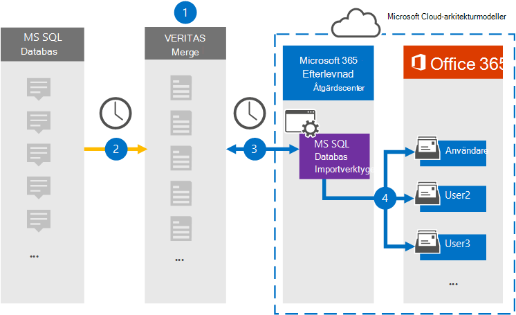

# Konfigurera en koppling för att arkivera data från MS SQL Database

Använd en Veritas-koppling i Microsoft 365 efterlevnadscenter om du vill importera och arkivera data från MS SQL Database till användarpostlådor i Microsoft 365 organisation. Veritas ger dig en MS SQL Database importeringskoppling som är konfigurerad för att hämta objekt från en databas med hjälp av en XML-konfigurationsfil och importera de objekten till Microsoft 365. Kopplingen konverterar innehåll från MS SQL Database till ett e-postmeddelandeformat och importerar sedan dessa objekt till användarnas postlådor i Microsoft 365.

När innehåll från MS SQL Database som lagrats i användarpostlådor kan du använda efterlevnadsfunktioner i Microsoft 365, till exempel Bevarande av juridiska skäl, eDiscovery, bevarandeprinciper och bevarandeetiketter. Om du använder en MS SQL Database-koppling för att importera och arkivera data i Microsoft 365 kan det hjälpa organisationen att följa myndighets- och regelpolicyer.

## Översikt över arkivering av MS SQL data

I följande översikt beskrivs hur du använder en koppling för att arkivera MS SQL data i Microsoft 365.

1. Din organisation arbetar med en MS SQL Database-leverantör för att konfigurera och konfigurera en MS SQL Database-webbplats.

2. En gång per dygn kopieras MS SQL Database-objekt till webbplatsen Veritas Merge1. Kopplingen konverterar också innehållet till ett e-postmeddelandeformat.

3. MS SQL Database importverktyget som du skapar i kompatibilitetscentret för Microsoft 365 ansluter till Veritas Merge1-webbplatsen varje dag och överför meddelandena till en säker Azure Storage plats i Microsoft-molnet.

4. Anslutaren importerar det konverterade MS SQL Database-objekten till postlådorna  för specifika användare med värdet för egenskapen E-post för den automatiska användarmappningen enligt beskrivningen [i steg 3.](#step-3-map-users-and-complete-the-connector-setup) En undermapp i mappen Inkorgen med **namnet MS SQL Database importverktyget** skapas i användarnas postlådor och objekten importeras till den mappen. Kopplingen avgör vilken postlåda som objekt ska importeras till med hjälp av värdet för egenskapen *E-post.* Alla objekt från MS SQL Database innehåller den här egenskapen, som fylls i med e-postadresserna för varje deltagare i objektet.

## Innan du börjar

- Skapa ett Veritas Merge1-konto för Microsoft-kopplingar. Om du vill skapa ett konto kontaktar [du Veritas kundsupport.](https://www.veritas.com/content/support/) Du måste logga in på det här kontot när du skapar kopplingen i steg 1.

- Den användare som skapar ms SQL Database importverktyget i steg 1 (och slutför det i steg 3) måste tilldelas rollen Importera och exportera postlåda i Exchange Online. Den här rollen krävs för att lägga till kopplingar på sidan Datakopplingar i Microsoft 365 kompatibilitetscenter. Som standard är den här rollen inte tilldelad någon rollgrupp i Exchange Online. Du kan lägga till rollen Importera och exportera postlåda i rollgruppen Organisationshantering i Exchange Online. Du kan också skapa en rollgrupp, tilldela rollen Importera och exportera postlåda och sedan lägga till lämpliga användare som medlemmar. Mer information finns i avsnitten [Skapa rollgrupper](/Exchange/permissions-exo/role-groups#create-role-groups) och [Ändra rollgrupper](/Exchange/permissions-exo/role-groups#modify-role-groups) i artikeln "Hantera rollgrupper i Exchange Online".

## Steg 1: Konfigurera MS SQL Database importeringskoppling

Det första steget är att få åtkomst till sidan Datakopplingar i **Efterlevnadscenter** för Microsoft365 och skapa en koppling för MS SQL Database.

1. Gå till [https://compliance.microsoft.com](https://compliance.microsoft.com) och klicka på **Datakopplingar**  >  **MS SQL Database Importverktyget**.

2. På sidan **MS SQL Database produktbeskrivning** klickar du på Lägg **till ny koppling**.

3. Klicka på **Acceptera på** sidan **Användningsvillkor.**

4. Ange ett unikt namn som identifierar kopplingen och klicka sedan på **Nästa.**

5. Logga in på ditt Merge1-konto för att konfigurera kopplingen.

## Steg 2: Konfigurera MS SQL Database importeringskopplingen på Veritas Merge1-webbplatsen

Det andra steget är att konfigurera MS SQL Database importeringskopplingen på webbplatsen Merge1. Mer information om hur du konfigurerar MS SQL Database importverktyget finns i [Användarhandbok för Slå samman1 tredjepartskopplingar.](https://docs.ms.merge1.globanetportal.com/Merge1%20Third-Party%20Connectors%20MS%20SQL%20Database%20Importer%20User%20Guide%20.pdf)

När du har **klickat &**  på Spara eller & visas sidan Användarmappning i kopplingsguiden i Microsoft 365 kompatibilitetscenter.

## Steg 3: Mappa användare och slutför kopplingskonfigurationen

Om du vill mappa användare och slutföra anslutningskonfigurationen gör du så här:

1. På sidan **Mappa MS SQL Database Importera användare till Microsoft 365 aktiverar** du automatisk användarmappning. MS SQL Database innehåller egenskapen *E-post,* som innehåller e-postadresser för användare i organisationen. Om kopplingen kan associera den här adressen Microsoft 365 en användare importeras objekten till den användarens postlåda.

2. Klicka **på** Nästa , granska dina inställningar och gå till sidan **Datakopplingar** för att se förloppet för importen för den nya anslutningen.

## Steg 4: Övervaka anslutningen MS SQL Database importer

När du har skapat MS SQL Database importeringskopplingen kan du visa anslutningsstatusen i Microsoft 365 kompatibilitetscenter.

1. Gå till <https://compliance.microsoft.com/> och klicka på **Datakopplingar** i det vänstra navigeringsfältet.

2. Klicka på **fliken Kopplingar** och välj sedan **importverktyget**  i MS SQL Database för att visa den utfällade sidan, som innehåller egenskaper och information om kopplingen.

3. Under **Anslutningsstatus med källa** klickar du på länken Ladda ned **logg** för att öppna (eller spara) statusloggen för kopplingen. Den här loggen innehåller data som har importerats till Microsoft-molnet.

## Kända problem

- För stunden går det inte att importera bifogade filer eller objekt som är större än 10 MB. Stöd för större objekt blir tillgängligt vid ett senare tillfälle.