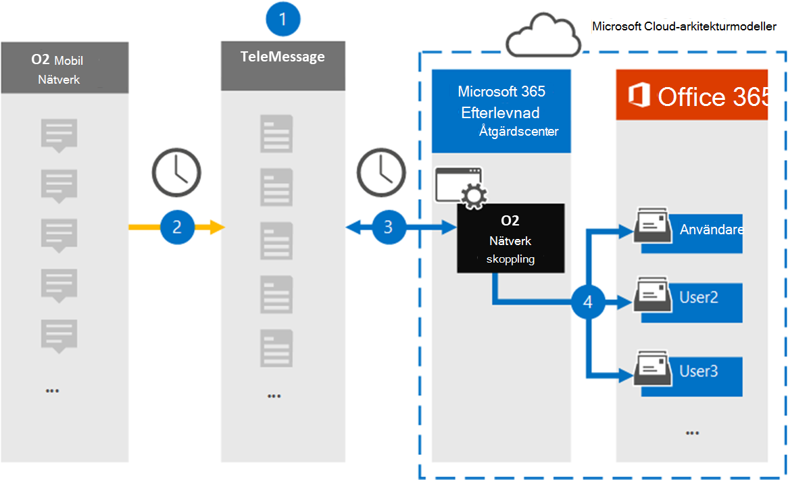

# Konfigurera en koppling för att arkivera data i O2-nätverketSet up a connector to archive O2 Network data

Använd en TeleMessage-koppling i Microsoft 365 kompatibilitetscenter för att importera och arkivera korta meddelandetjänster (SMS) meddelanden och röstsamtal från O2-mobilnätverket.Use a TeleMessage connector in the Microsoft 365 compliance center to import and archive Short Messaging Service (SMS) messages and voice calls from the O2 mobile network. När du har konfigurerat och konfigurerat en anslutning ansluts den till organisationens O2-nätverk en gång om dagen och importerar SMS och röstsamtal till postlådor i Microsoft 365.After you set up and configure a connector, it connects to your organization's O2 Network once every day, and imports SMS and voice calls to mailboxes in Microsoft 365.

När SMS meddelanden och röstsamtal lagras i användarpostlådor kan du använda efterlevnadsfunktioner i Microsoft 365, till exempel Bevarande av juridiska skäl, Innehållssökning och Bevarandeprinciper för Microsoft 365-nätverk för data i O2-nätverk.After SMS messages and voice calls are stored in user mailboxes, you can apply Microsoft 365 compliance features such as Litigation Hold, Content Search, and Microsoft 365 retention policies to O2 Network data. Du kan till exempel söka i O2 Network SMS-meddelanden och röstsamtal med hjälp av Innehållssökning eller associera postlådan som innehåller O2-nätverksdata med en medarbetare i ett Advanced eDiscovery fall.For example, you can search O2 Network SMS messages and voice calls using Content Search or associate the mailbox that contains O2 Network data with a custodian in an Advanced eDiscovery case. Om du använder en O2-nätverkskoppling för att importera och arkivera data i Microsoft 365 kan detta hjälpa din organisation att följa myndighets- och regleringsprinciperna.Using an O2 Network connector to import and archive data in Microsoft 365 can help your organization stay compliant with government and regulatory policies.

## Översikt över arkivering av data i O2-nätverketOverview of archiving O2 Network data

Följande översikt förklarar processen med att använda en koppling för att arkivera data i O2-nätverk i Microsoft 365.The following overview explains the process of using a connector to archive O2 Network data in Microsoft 365.

1. Din organisation arbetar med TeleMessage och O2 för att konfigurera en O2-nätverkskoppling.Your organization works with TeleMessage and O2 to set up an O2 Network connector. Mer information finns i [O2 Network Archiver](https://www.telemessage.com/office365-activation-for-o2-network-archiver).For more information, see [O2 Network Archiver](https://www.telemessage.com/office365-activation-for-o2-network-archiver).

2. En gång per dygn SMS meddelanden och röstsamtal från organisationens O2-nätverk till TeleMessage-webbplatsen.Once every 24 hours, SMS messages and voice calls from your organization’s O2 Network are copied to the TeleMessage site.

3. O2 Network-anslutningen som du skapar i efterlevnadscentret för Microsoft 365 ansluter till TeleMessage-webbplatsen varje dag och överför SMS-meddelandena och röstsamtalen från de föregående 24 timmarna till en säker Azure Storage plats i Microsoft-molnet.The O2 Network connector that you create in the Microsoft 365 compliance center connects to the TeleMessage site every day and transfers the SMS messages and voice calls from the previous 24 hours to a secure Azure Storage location in the Microsoft cloud. Med anslutaren omvandlas även innehållet i SMS och röstsamtal till ett e-postmeddelandeformat.The connector also converts the content of SMS messages and voice calls to an email message format.

4. Kopplingen importerar mobila kommunikationsobjekt till specifika användares postlådor.The connector imports the mobile communication items to the mailbox of specific users. En ny mapp med **namnet O2 SMS och Voice Network Archiver** skapas i en viss användares postlåda och objekten importeras till den.A new folder named **O2 SMS and Voice Network Archiver** is created in a specific user's mailbox and the items are imported to it. Kopplingen gör den här mappningen med hjälp av värdet för *användarens e-postadressegenskap.*The connector does this mapping by using the value of the *User’s Email address* property. Alla SMS och röstsamtal innehåller den här egenskapen, som fylls i med e-postadresserna för varje meddelandedeltagare.Every SMS message and voice call contains this property, which is populated with the email address of every participant of the message.

   Förutom automatisk användarmappning med värdet  för användarens e-postadressegenskap kan du också definiera en anpassad mappning genom att ladda upp en CSV-mappningsfil.In addition to automatic user mapping using the value of the *User’s Email address* property, you can also define a custom mapping by uploading a CSV mapping file. Den här mappningsfilen innehåller mobiltelefonnumret och den Microsoft 365 e-postadressen för användare i organisationen.This mapping file contains the mobile phone number and corresponding Microsoft 365 email address for users in your organization. Om du aktiverar både automatisk användarmappning och anpassad mappning tittar kopplingen först på anpassad mappningsfil för varje O2-objekt.If you enable both automatic user mapping and custom mapping, for every O2 item the connector first looks at custom mapping file. Om kontakten inte hittar en giltig Microsoft 365-användare som motsvarar en användares mobiltelefonnummer används värdena i e-postadressegenskapen för objektet som ska importeras.If it doesn't find a valid Microsoft 365 user that corresponds to a user's mobile phone number, the connector will use the values in the email address property of the item it's trying to import. Om anslutaren inte hittar en giltig Microsoft 365 i antingen den anpassade mappningsfilen eller i E-postadressegenskapen för O2-objektet importeras inte objektet.If the connector doesn't find a valid Microsoft 365 user in either the custom mapping file or in the email address property of the O2 item, the item won't be imported.

## Innan du skapa en kopplingBefore you set up a connector

Några av de implementeringssteg som krävs för att arkivera data i O2-nätverket är externa Microsoft 365 måste slutföras innan du kan skapa en anslutning i efterlevnadscentret.Some of the implementation steps required to archive O2 Network data are external to Microsoft 365 and must be completed before you can create a connector in the compliance center.

- Beställ [O2 Network Archiver-tjänsten från TeleMessage](https://www.telemessage.com/mobile-archiver/order-mobile-archiver-for-o365/) och få ett giltigt administrationskonto för din organisation.Order the [O2 Network Archiver service from TeleMessage](https://www.telemessage.com/mobile-archiver/order-mobile-archiver-for-o365/) and get a valid administration account for your organization. Du måste logga in på det här kontot när du skapar anslutningen i efterlevnadscentret.You'll need to sign into this account when you create the connector in the compliance center.

- Få information om ditt O2-nätverk och dina faktureringskontaktuppgifter så att du kan fylla i TeleMessage-introduktionsformulären och beställa arkiveringstjänsten för meddelanden från O2.Obtain your O2 Network account and billing contact details so you can fill-out the TeleMessage onboarding forms and order the message archiving service from O2.

- Registrera alla användare som kräver att O2 SMS och Voice Network arkiveras i TeleMessage-kontot.Register all users that require O2 SMS and Voice Network archiving in the TeleMessage account. Se till att använda samma e-postadress som används för användarens konto när du registrerar Microsoft 365 användare.When registering users, be sure to use the same email address that's used for their Microsoft 365 account.

- De anställda måste ha mobiltelefoner som ägs av företaget och företagsansvarig på O2-mobilnätverket.Your employees must have corporate-owned and corporate-liable mobile phones on the O2 mobile network. Arkivering av meddelanden i Microsoft 365 inte tillgängligt för enheter som ägs av anställda eller "Bring Your Own Devices (BYOD).Archiving messages in Microsoft 365 isn't available for employee-owned or "Bring Your Own Devices (BYOD) devices.

- Den användare som skapar en O2-nätverkskoppling måste tilldelas rollen Importera och exportera postlåda i Exchange Online.The user who creates an O2 Network connector must be assigned the Mailbox Import Export role in Exchange Online. Detta krävs för att lägga till kopplingar på **sidan Datakopplingar** i Microsoft 365 kompatibilitetscenter.This is required to add connectors in the **Data connectors** page in the Microsoft 365 compliance center. Som standard är den här rollen inte tilldelad någon rollgrupp i Exchange Online.By default, this role isn't assigned to any role group in Exchange Online. Du kan lägga till rollen Importera och exportera postlåda i rollgruppen Organisationshantering i Exchange Online.You can add the Mailbox Import Export role to the Organization Management role group in Exchange Online. Du kan också skapa en rollgrupp, tilldela rollen Importera och exportera postlåda och sedan lägga till lämpliga användare som medlemmar.Or you can create a role group, assign the Mailbox Import Export role, and then add the appropriate users as members. Mer information finns i avsnitten [Skapa rollgrupper](/Exchange/permissions-exo/role-groups#create-role-groups) och [Ändra rollgrupper](/Exchange/permissions-exo/role-groups#modify-role-groups) i artikeln "Hantera rollgrupper i Exchange Online".For more information, see the [Create role groups](/Exchange/permissions-exo/role-groups#create-role-groups) or [Modify role groups](/Exchange/permissions-exo/role-groups#modify-role-groups) sections in the article "Manage role groups in Exchange Online".

- Den här datakopplingen är tillgänglig GCC miljöer i Microsoft 365 för myndigheter i USA.This data connector is available in GCC environments in the Microsoft 365 US Government cloud. Program och tjänster från tredje part kan innebära att lagra, överföra och bearbeta din organisations kunddata i tredje parts system som ligger utanför Microsoft 365-infrastrukturen och därför inte omfattas av Microsoft 365-åtaganden gällande efterlevnad och dataskydd.Third-party applications and services might involve storing, transmitting, and processing your organization's customer data on third-party systems that are outside of the Microsoft 365 infrastructure and therefore are not covered by the Microsoft 365 compliance and data protection commitments. Microsoft anger inte att användningen av den här produkten för att ansluta till program från tredje part innebär att sådana program från tredje part är FEDRAMP-kompatibla.Microsoft makes no representation that use of this product to connect to third-party applications implies that those third-party applications are FEDRAMP compliant.

## Skapa en O2-nätverkskopplingCreate an O2 Network connector

När du har slutfört kraven som beskrivs i föregående avsnitt kan du skapa en O2-nätverkskoppling i Microsoft 365 efterlevnadscenter.After you've completed the prerequisites described in the previous section, you can create an O2 Network connector in the Microsoft 365 compliance center. Kopplingen använder den information du uppger för att ansluta till TeleMessage-webbplatsen och överföra SMS och röstsamtal till motsvarande postlåderutor i Microsoft 365.The connector uses the information you provide to connect to the TeleMessage site and transfer SMS messages and voice calls to the corresponding user mailbox boxes in Microsoft 365.

1. Gå till [https://compliance.microsoft.com](https://compliance.microsoft.com/) och klicka på **Datakopplingar** \> **O2-nätverk.**Go to [https://compliance.microsoft.com](https://compliance.microsoft.com/) and then click **Data connectors** \> **O2 Network**.

2. På **produktbeskrivningssidan för O2-nätverk** klickar du på **Lägg till koppling**On the **O2 Network** product description page, click **Add connector**

3. Klicka på **Acceptera på** sidan **Användningsvillkor.**On the **Terms of service** page, click **Accept**.

4. På sidan **Logga in på TeleMessage,** under Steg 3, anger du den information som krävs i följande rutor och klickar sedan på **Nästa.**On the **Login to TeleMessage** page, under Step 3, enter the required information in the following boxes and then click **Next**.

   - **Användarnamn:** Ditt TeleMessage-användarnamn.**Username:** Your TeleMessage username.

   - **Lösenord:** Ditt TeleMessage-lösenord.**Password:** Your TeleMessage password.

5. När kopplingen har skapats kan du stänga popup-fönstret och gå till nästa sida.After the connector is created, you can close the pop-up window and go to the next page.

6. På sidan **Användarmappning** aktiverar du automatisk användarmappning och klickar på **Nästa.**On the **User mapping** page, enable automatic user mapping and click **Next**. Om du behöver anpassad mappning laddar du upp en CSV-fil och klickar på **Nästa**.In case you need custom mapping upload a CSV file, and click **Next**.

7. Granska inställningarna och klicka sedan på **Slutför för** att skapa kopplingen.Review your settings, and then click **Finish** to create the connector.

8. Gå till fliken Kopplingar på sidan **Datakopplingar** för att se importprocessen för den nya kopplingen.Go to the Connectors tab in **Data connectors** page to see the progress of the import process for the new connector.

## Kända problemKnown issues

- För stunden går det inte att importera bifogade filer eller objekt som är större än 10 MB.At this time, we don't support importing attachments or items that are larger than 10 MB. Stöd för större objekt blir tillgängligt vid ett senare tillfälle.Support for larger items will be available at a later date.