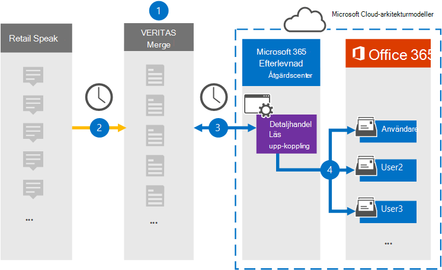

# Konfigurera en koppling för arkivering av läs upp-data med röd detaljSet up a connector to archive Redtail Speak data

Använd en Veritas-koppling i Microsoft 365 efterlevnadscenter om du vill importera och arkivera data från dialogrutan Detaljer till användarpostlådor i Microsoft 365 organisation.Use a Veritas connector in the Microsoft 365 compliance center to import and archive data from the Redtail Speak to user mailboxes in your Microsoft 365 organization. Veritas ger dig en [redtail speak-koppling](https://globanet.com/redtail/) som har konfigurerats för att hämta objekt från organisationens SFTP-server där objekten tas emot från Redtail.Veritas provides you with a [Redtail Speak](https://globanet.com/redtail/) connector that's configured to capture items from your organization’s SFTP server where the items are received from Redtail. Kopplingen konverterar innehållet från Läs upp om till ett e-postmeddelandeformat och importerar sedan dessa objekt till användarens postlåda i Microsoft 365.The connector converts the content from Redtail Speak to an email message format and then imports those items to the user's mailbox in Microsoft 365.

När data med funktionen Läs upp rödslåde har lagrats i användarnas postlådor kan du använda efterlevnadsfunktioner i Microsoft 365, till exempel Bevarande av juridiska skäl, eDiscovery, bevarandeprinciper och bevarandeetiketter.After Redtail Speak data is stored in user mailboxes, you can apply Microsoft 365 compliance features such as Litigation Hold, eDiscovery, retention policies, and retention labels. Om du importerar och arkiverar data i Microsoft 365 med hjälp av en koppling för tal i redtail kan det hjälpa organisationen att uppfylla myndighets- och regelprinciperna.Using a Redtail Speak connector to import and archive data in Microsoft 365 can help your organization stay compliant with government and regulatory policies.

## Översikt över arkivering av data för beskrivning av omdetaljerOverview of archiving the Redtail Speak data

I följande översikt beskrivs hur du använder en koppling för att arkivera data i Microsoft 365.The following overview explains the process of using a connector to archive the Redtail Speak data in Microsoft 365.

1. Organisationen arbetar med Redtail Speak för att konfigurera och konfigurera en SMTP-gateway där meddelanden vidarebefordras från Redtail Speak till organisationens SFTP-server dagligen.Your organization works with Redtail Speak to set up and configure an SMTP gateway where messages are forwarded from Redtail Speak to your organization's SFTP server on a daily basis.

2. En gång per dygn kopieras objekten Läs upp igen till webbplatsen Veritas Merge1.Once every 24 hours, the Redtail Speak items are copied to the Veritas Merge1 site. Kopplingen konverterar också avse en redtail Speak-objekt till ett e-postmeddelandeformat.The connector also converts the Redtail Speak items to an email message format.

3. Kopplingen Redtail Speak som du skapar i kompatibilitetscentret för Microsoft 365 ansluter till Veritas Merge1-webbplatsen varje dag och överför meddelandena till en säker Azure Storage plats i Microsoft-molnet.The Redtail Speak connector that you create in the Microsoft 365 compliance center connects to the Veritas Merge1 site every day and transfers the messages to a secure Azure Storage location in the Microsoft cloud.

4. Kopplingen importerar de konverterade objekten Med funktionen Beskrivning av omdetaljer till postlådorna för specifika användare med värdet för e-postegenskapen för den automatiska användarmappningen enligt beskrivningen [i steg 3.](#step-3-map-users-and-complete-the-connector-setup) The connector imports the converted Redtail Speak items to the mailboxes of specific users using the value of the *Email* property of the automatic user mapping as described in [Step 3](#step-3-map-users-and-complete-the-connector-setup). En undermapp i mappen Inkorgen med namnet **Taldetaljer** skapas i användarpostlådorna och objekten importeras till den mappen.A subfolder in the Inbox folder named **Redtail Speak** is created in the user mailboxes, and the items are imported to that folder. Kopplingen avgör vilken postlåda som objekt ska importeras till med hjälp av värdet för egenskapen *E-post.*The connector determines which mailbox to import items to by using the value of the *Email* property. Varje tal i redtail innehåller den här egenskapen, som fylls i med e-postadressen för varje deltagare i objektet.Every Redtail Speak item contains this property, which is populated with the email address of every participant of the item.

## Innan du börjarBefore you begin

- Skapa ett Veritas Merge1-konto för Microsoft-kopplingar.Create a Veritas Merge1 account for Microsoft connectors. Om du vill skapa ett konto kontaktar [du Veritas kundsupport.](https://www.veritas.com/content/support/)To create an account, contact [Veritas Customer Support](https://www.veritas.com/content/support/). Du måste logga in på det här kontot när du skapar kopplingen i steg 1.You need to sign into this account when you create the connector in Step 1.

- I steg 2 måste du ange organisationens SFTP-server.In Step 2, you need to specify your organization's SFTP server. Det här steget är nödvändigt så att Veritas Merge1 kan kontakta det och samla in data från Redtail Speak via SFTP.This step is necessary so that Veritas Merge1 can contact it to collect Redtail Speak data via SFTP.

- Den användare som skapar importverktyget för återdetaljer i steg 1 (och slutför den i steg 3) måste tilldelas rollen Importera och exportera postlåda i Exchange Online.The user who creates the Redtail Speak Importer connector in Step 1 (and completes it in Step 3) must be assigned to the Mailbox Import Export role in Exchange Online. Den här rollen krävs för att lägga till kopplingar på sidan Datakopplingar i Microsoft 365 kompatibilitetscenter.This role is required to add connectors on the Data connectors page in the Microsoft 365 compliance center. Den här rollen tilldelas inte till någon rollgrupp i Exchange Online som standard.This role is not assigned to any role group in Exchange Online by default. Du kan lägga till rollen Importera och exportera postlåda i rollgruppen Organisationshantering i Exchange Online.You can add the Mailbox Import Export role to the Organization Management role group in Exchange Online. Du kan också skapa en rollgrupp, tilldela rollen Importera och exportera postlåda och sedan lägga till lämpliga användare som medlemmar.Or you can create a role group, assign the Mailbox Import Export role, and then add the appropriate users as members. Mer information finns i avsnitten [Skapa rollgrupper](/Exchange/permissions-exo/role-groups#create-role-groups) och [Ändra rollgrupper](/Exchange/permissions-exo/role-groups#modify-role-groups) i artikeln "Hantera rollgrupper i Exchange Online".For more information, see the [Create role groups](/Exchange/permissions-exo/role-groups#create-role-groups) or [Modify role groups](/Exchange/permissions-exo/role-groups#modify-role-groups) sections in the article "Manage role groups in Exchange Online".

## Steg 1: Konfigurera kopplingen För detaljerStep 1: Set up the Redtail Speak connector

Det första steget är att komma åt sidan Datakopplingar i **kompatibilitetscentret** Microsoft 365 och skapa en koppling för data av informationsdetaljer.The first step is to access to the **Data Connectors** page in the Microsoft 365 compliance center and create a connector for the Redtail Speak data.

1. Gå till [https://compliance.microsoft.com](https://compliance.microsoft.com/) och välj **Datakopplingar** &gt; **Visa detaljer.**Go to [https://compliance.microsoft.com](https://compliance.microsoft.com/) and select **Data connectors** &gt; **Redtail Speak**.

2. På sidan **Beskrivning av detaljer väljer** du Lägg till ny **koppling**.On the **Redtail Speak** product description page, select **Add new connector**.

3. Välj **Acceptera på sidan** **Användningsvillkor.**On the **Terms of service** page, select **Accept**.

4. Ange ett unikt namn som identifierar kopplingen och välj sedan **Nästa**.Enter a unique name that identifies the connector, and then select **Next**.

5. Logga in på ditt Merge1-konto för att konfigurera kopplingen.Sign in to your Merge1 account to configure the connector.

## Steg 2: Konfigurera kopplingen För detaljer på webbplatsen Veritas Merge1Step 2: Configure the Redtail Speak connector on the Veritas Merge1 site

Det andra steget är att konfigurera kopplingen För detaljer på webbplatsen Merge1.The second step is to configure the Redtail Speak connector on the Merge1 site. Mer information om hur du konfigurerar anslutningen Visa detaljer finns i [Användarhandbok för](https://docs.ms.merge1.globanetportal.com/Merge1%20Third-Party%20Connectors%20Redtail%20Speak%20User%20Guide%20.pdf)koppling av koppling från tredje part .For information about how to configure the Redtail Speak connector, see [Merge1 Third-Party Connectors User Guide](https://docs.ms.merge1.globanetportal.com/Merge1%20Third-Party%20Connectors%20Redtail%20Speak%20User%20Guide%20.pdf).

När du **har & på Slutför** **visas** sidan Användarmappning i kopplingsguiden Microsoft 365 kompatibilitetscentret.After you select **Save & Finish**, the **User mapping** page in the connector wizard in the Microsoft 365 compliance center is displayed.

## Steg 3: Mappa användare och slutför kopplingskonfigurationenStep 3: Map users and complete the connector setup

Om du vill mappa användare och slutföra anslutningskonfigurationen gör du så här:To map users and complete the connector setup, follow these steps:

1. Aktivera automatisk **användarmappning på sidan Visa Microsoft 365 för** användare på sidan Visa information om mappning.On the **Map Redtail Speak users to Microsoft 365 users** page, enable automatic user mapping. Objekten Med taldetaljer har egenskapen *E-post,* som innehåller e-postadresser för användare i organisationen.The Redtail Speak items include a property called *Email*, which contains email addresses for users in your organization. Om kopplingen kan associera den här adressen Microsoft 365 en användare importeras objekten till den användarens postlåda.If the connector can associate this address with a Microsoft 365 user, the items are imported to that user’s mailbox.

2. Välj **Nästa**, granska dina inställningar och gå till sidan **Datakopplingar** för att se förloppet för importen för den nya anslutningen.Select **Next**, review your settings, and go to the **Data connectors** page to see the progress of the import process for the new connector.

## Steg 4: Övervaka kopplingen För detaljerStep 4: Monitor the Redtail Speak connector

När du har skapat kopplingen Visa detaljer kan du visa kopplingsstatusen i Microsoft 365 för efterlevnadscenter.After you create the Redtail Speak connector, you can view the connector status in the Microsoft 365 compliance center.

1. Gå till [https://compliance.microsoft.com](https://compliance.microsoft.com/) och välj **Datakopplingar i** det vänstra navigeringsfältet.Go to [https://compliance.microsoft.com](https://compliance.microsoft.com/) and select **Data connectors** in the left nav.

2. Välj fliken **Kopplingar och** välj sedan kopplingen Visa **detaljer** för att visa den utfällade sidan.Select the **Connectors** tab and then select the **Redtail Speak** connector to display the flyout page. På den här sidan visas egenskaper och information om kopplingen.This page displays properties and information about the connector.

3. Under **Anslutningsstatus med källa** väljer du länken Ladda ned **logg** för att öppna (eller spara) statusloggen för kopplingen.Under **Connector status with source**, select the **Download log** link to open (or save) the status log for the connector. Den här loggen innehåller data som har importerats till Microsoft-molnet.This log contains data that has been imported to the Microsoft cloud.

## Kända problemKnown issues

- För stunden går det inte att importera bifogade filer eller objekt som är större än 10 MB.At this time, we don't support importing attachments or items that are larger than 10 MB. Stöd för större objekt blir tillgängligt vid ett senare tillfälle.Support for larger items will be available at a later date.