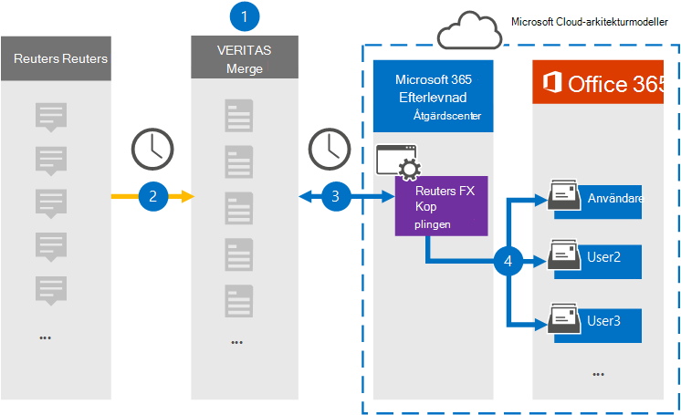

# Konfigurera en koppling för att arkivera Reuters Eikon-data

Använd en Veritas-koppling i Microsoft 365 efterlevnadscenter om du vill importera och arkivera data från Reuters Eikon-plattformen till användarpostlådor i Microsoft 365 organisation. Veritas tillhandahåller en [Reuters Eikon-koppling](https://globanet.com/eikon/) som är konfigurerad att hämta objekt från tredje parts datakälla (regelbundet) och importera dessa objekt till Microsoft 365. Kopplingen konverterar innehåll, till exempel meddelanden mellan två personer, gruppchattar, bifogade filer och ansvarsfriskrivningar från en användares Reuters Eikon-konto till ett e-postmeddelandeformat, och importerar sedan objekten till användarens postlåda i Microsoft 365.

När Reuters Eikon-data lagrats i användarnas postlådor kan du använda efterlevnadsfunktioner i Microsoft 365, till exempel Bevarande av juridiska skäl, eDiscovery, bevarandeprinciper och bevarandeetiketter samt kommunikationsefterlevnad. Om du använder ett Reuters Eikon-anslutningsschema för att importera och arkivera data i Microsoft 365 kan det hjälpa din organisation att följa myndighets- och regelpolicyer.

## Översikt över arkivering av Reuters Eikon-data

Följande översikt förklarar processen med att använda en koppling för att arkivera Reuters Eikon-data i Microsoft 365.

1. Din organisation arbetar med Reuters Eikon för att konfigurera och konfigurera en Reuters Eikon-webbplats.

2. En gång per dygn kopieras Reuters Eikon-objekt till webbplatsen Veritas Merge1. Kopplingen konverterar också Reuters Eikon-objekt till ett e-postmeddelandeformat.

3. The Reuters Eikon connector that you create in the Microsoft 365 compliance center connects to the Veritas Merge1 site every day and transfers the content to a secure Azure Storage location in the Microsoft cloud.

4. Kopplingen importerar objekt till specifika användares postlådor med  värdet för egenskapen E-post för den automatiska användarmappningen enligt beskrivningen [i steg 3.](#step-3-map-users-and-complete-the-connector-setup) En undermapp i mappen Inkorgen med namnet **Reuters Eikon** skapas i användarnas postlådor och objekten importeras till den mappen. Kopplingen avgör vilken postlåda som objekt ska importeras till med hjälp av värdet för egenskapen *E-post.* Alla Reuters Eikon-objekt innehåller den här egenskapen, som fylls i med e-postadressen till alla deltagare i objektet.

## Innan du börjar

- Skapa ett Veritas Merge1-konto för Microsoft-kopplingar. Om du vill skapa ett konto kontaktar [du Veritas kundsupport.](https://globanet.com/ms-connectors-contact) Du loggar in på det här kontot när du skapar kopplingen i steg 1.

- Den användare som skapar kopplingen Reuters Eikon i steg 1 (och slutför den i steg 3) måste tilldelas rollen Importera och exportera postlåda i Exchange Online. Den här rollen krävs för att lägga till kopplingar **på sidan Datakopplingar** i Microsoft 365 kompatibilitetscenter. Som standard är den här rollen inte tilldelad en rollgrupp i Exchange Online. Du kan lägga till rollen Importera och exportera postlåda i rollgruppen Organisationshantering i Exchange Online. Du kan också skapa en rollgrupp, tilldela rollen Importera och exportera postlåda och sedan lägga till lämpliga användare som medlemmar. Mer information finns i avsnitten [Skapa rollgrupper](/Exchange/permissions-exo/role-groups#create-role-groups) och [Ändra rollgrupper](/Exchange/permissions-exo/role-groups#modify-role-groups) i artikeln "Hantera rollgrupper i Exchange Online".

## Steg 1: Konfigurera Reuters Eikon-kopplingen

Det första steget är att få åtkomst till sidan Datakopplingar i **kompatibilitetscentret** för Microsoft 365 och skapa en koppling för Reuters Eikon-data.

1. Gå till [https://compliance.microsoft.com](https://compliance.microsoft.com/) och klicka sedan på **Datakopplingar**  >  **Reuters Eikon**.

2. På sidan **Reuters Eikon produktbeskrivning** klickar du på Lägg **till koppling**.

3. Klicka på **Acceptera på** sidan **Användningsvillkor.**

4. Ange ett unikt namn som identifierar kopplingen och klicka sedan på **Nästa.**

5. Logga in på ditt Merge1-konto för att konfigurera kopplingen.

## Steg 2: Konfigurera Reuters Eikon-kopplingen på webbplatsen Veritas Merge1

Det andra steget är att konfigurera kontakten Reuters Eikon på webbplatsen Merge1. Mer information om hur du konfigurerar kontakten Reuters Eikon på webbplatsen Veritas Merge1 finns i Användarhandbok för Slå [samman1 tredjepartskopplingar.](https://docs.ms.merge1.globanetportal.com/Merge1%20Third-Party%20Connectors%20Reuters%20Eikon%20User%20Guide%20.pdf)

När du har **klickat &**  på Spara eller & visas sidan Användarmappning i kopplingsguiden i Microsoft 365 kompatibilitetscenter.

## Steg 3: Mappa användare och slutför kopplingskonfigurationen

Om du vill mappa användare och slutföra anslutningskonfigurationen i Microsoft 365 efterlevnadscenter gör du så här:

1. På sidan **Mappa externa användare till Microsoft 365 aktiverar** du automatisk användarmappning. Objekten Reuters Eikon innehåller en egenskap med namnet *E-post,* som innehåller e-postadresser för användare i organisationen. Om kopplingen kan associera den här adressen Microsoft 365 en användare importeras objekten till den användarens postlåda.

2. Klicka **på** Nästa, granska dina inställningar och gå sedan till sidan **Datakopplingar** för att se förloppet för importen för den nya anslutningen.

## Steg 4: Övervaka Reuters Eikon-kopplingen

När du har skapat Reuters Eikon-kopplingen kan du visa anslutningsstatusen Microsoft 365 efterlevnadscenter.

1. Gå till [https://compliance.microsoft.com](https://compliance.microsoft.com) och klicka på **Datakopplingar** i det vänstra navigeringsfältet.

2. Klicka på **fliken Kopplingar och** välj sedan kontakten Reuters **Eikon för** att visa den utfällade sidan. Den här sidan innehåller egenskaper och information om kopplingen.

3. Under **Anslutningsstatus med källa** klickar du på länken Ladda ned **logg** för att öppna (eller spara) statusloggen för kopplingen. Den här loggen innehåller information om de data som har importerats till Microsoft-molnet.

## Kända problem

- För stunden går det inte att importera bifogade filer eller objekt som är större än 10 MB. Stöd för större objekt blir tillgängligt vid ett senare tillfälle.