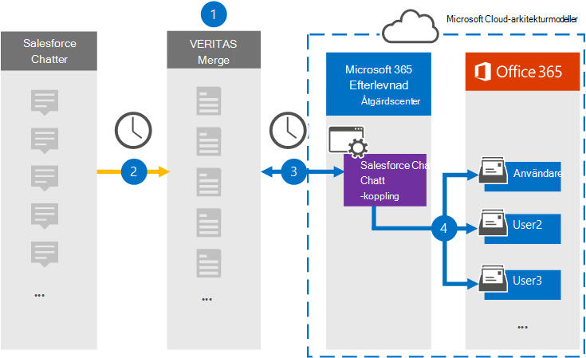

# Konfigurera en koppling för att arkivera Salesforce Chatter-dataSet up a connector to archive Salesforce Chatter data

Använd en Veritas-koppling i Microsoft 365 efterlevnadscenter om du vill importera och arkivera data från Salesforce Chatter-plattformen till användarpostlådor i Microsoft 365 organisation.Use a Veritas connector in the Microsoft 365 compliance center to import and archive data from the Salesforce Chatter platform to user mailboxes in your Microsoft 365 organization. Veritas tillhandahåller en [Salesforce Chatter-koppling](http://globanet.com/chatter/) som fångar objekt från tredje parts datakälla och importerar dessa objekt till Microsoft 365.Veritas provides a [Salesforce Chatter](http://globanet.com/chatter/) connector that captures items from the third-party data source and imports those items to Microsoft 365. Kopplingen konverterar innehåll som chattar, bifogade filer och inlägg från Salesforce Chatter till ett e-postmeddelandeformat och importerar sedan dessa objekt till användarens postlåda i Microsoft 365.The connector converts the content such as chats, attachments, and posts from Salesforce Chatter to an email message format and then imports those items to the user’s mailbox in Microsoft 365.

När Salesforce Chatter-data har lagrats i användarpostlådor kan du använda efterlevnadsfunktioner i Microsoft 365, till exempel Bevarande av juridiska skäl, eDiscovery, bevarandeprinciper och bevarandeetiketter.After Salesforce Chatter data is stored in user mailboxes, you can apply Microsoft 365 compliance features such as Litigation Hold, eDiscovery, retention policies and retention labels. Om du använder en Salesforce Chatter-koppling för att importera och arkivera data i Microsoft 365 kan din organisation följa myndighets- och regelpolicyer.Using a Salesforce Chatter connector to import and archive data in Microsoft 365 can help your organization stay compliant with government and regulatory policies.

## Översikt över arkivering av Salesforce Chatter-dataOverview of archiving Salesforce Chatter data

Följande översikt förklarar processen med att använda en koppling för att arkivera Salesforce Chatter-data i Microsoft 365.The following overview explains the process of using a connector to archive the Salesforce Chatter data in Microsoft 365.

1. Din organisation arbetar med Salesforce Chatter för att konfigurera och konfigurera en Salesforce Chatter-webbplats.Your organization works with Salesforce Chatter to set up and configure a Salesforce Chatter site.

2. En gång per dygn kopieras Salesforce Chatter-objekt till webbplatsen Veritas Merge1.Once every 24 hours, Salesforce Chatter items are copied to the Veritas Merge1 site. Kopplingen även Salesforce Chatt-objekt i ett e-postmeddelandeformat.The connector also Salesforce Chatter items to an email message format.

3. Den Salesforce Chatter-koppling som du skapar i kompatibilitetscentret för Microsoft 365, ansluter till Veritas Merge1-webbplatsen varje dag och överför chattinnehållet till en säker Azure Storage plats i Microsoft-molnet.The Salesforce Chatter connector that you create in the Microsoft 365 compliance center, connects to the Veritas Merge1 site every day and transfers the Chatter content to a secure Azure Storage location in the Microsoft cloud.

4. Kopplingen importerar de konverterade objekten till postlådorna  för specifika användare med värdet för egenskapen E-post för den automatiska användarmappningen enligt beskrivningen [i steg 3.](#step-3-map-users-and-complete-the-connector-setup)The connector imports the converted items to the mailboxes of specific users using the value of the *Email* property of the automatic user mapping as described in [Step 3](#step-3-map-users-and-complete-the-connector-setup). En undermapp i mappen Inkorg med namnet **Salesforce Chatter** skapas i användarnas postlådor och objekt importeras till den mappen.A subfolder in the Inbox folder named **Salesforce Chatter** is created in the user mailboxes, and items are imported to that folder. Kopplingen avgör vilken postlåda som objekt ska importeras till med hjälp av värdet för egenskapen *E-post.*The connector determines which mailbox to import items to by using the value of the *Email* property. Alla chattobjekt innehåller den här egenskapen, som fylls i med e-postadressen för alla deltagare i objektet.Every Chatter item contains this property, which is populated with the email address of every participant of the item.

## Innan du börjarBefore you begin

- Skapa ett Merge1-konto för Microsoft-kopplingar.Create a Merge1 account for Microsoft connectors. Om du vill skapa ett konto kontaktar [du Veritas kundsupport.](https://www.veritas.com/content/support/)To create an account, contact [Veritas Customer Support](https://www.veritas.com/content/support/). Du måste logga in på det här kontot när du skapar kopplingen i steg 1.You need to sign into this account when you create the connector in Step 1.

- Skapa ett Salesforce-program och skaffa en token hos [https://salesforce.com](https://salesforce.com) .Create a Salesforce application and acquire a token at [https://salesforce.com](https://salesforce.com). Du måste logga in på Salesforce-kontot som administratör och få en personlig token för användare för att importera data.You'll need to log into the Salesforce account as an admin and get a user personal token to import data. Dessutom måste utlösare publiceras på chattwebbplatsen för att samla in uppdateringar, borttagningar och redigeringar.Also, triggers need to be published on the Chatter site to capture updates, deletes, and edits. Dessa utlösare skapar ett inlägg på en kanal och Merge1 samlar in informationen från kanalen.These triggers will create a post on a channel, and Merge1 will capture the information from the channel. Stegvisa instruktioner om hur du skapar programmet och hämtar token finns i Användarhandbok för Slå [samman1 tredjepartskopplingar.](https://docs.ms.merge1.globanetportal.com/Merge1%20Third-Party%20Connectors%20SalesForce%20Chatter%20User%20Guide%20.pdf)For step-by-step instructions about how to create the application and acquire the token, see [Merge1 Third-Party Connectors User Guide](https://docs.ms.merge1.globanetportal.com/Merge1%20Third-Party%20Connectors%20SalesForce%20Chatter%20User%20Guide%20.pdf).

- Den användare som skapar Salesforce Chatter-kopplingen i steg 1 (och slutför den i steg 3) måste tilldelas rollen Importera och exportera postlåda i Exchange Online.The user who creates the Salesforce Chatter connector in Step 1 (and completes it in Step 3) must be assigned to the Mailbox Import Export role in Exchange Online. Den här rollen krävs för att lägga till kopplingar **på sidan Datakopplingar** i Microsoft 365 kompatibilitetscenter.This role is required to add connectors on the **Data connectors** page in the Microsoft 365 compliance center. Som standard är den här rollen inte tilldelad någon rollgrupp i Exchange Online.By default, this role isn’t assigned to any role group in Exchange Online. Du kan lägga till rollen Importera och exportera postlåda i rollgruppen Organisationshantering i Exchange Online.You can add the Mailbox Import Export role to the Organization Management role group in Exchange Online. Du kan också skapa en rollgrupp, tilldela rollen Importera och exportera postlåda och sedan lägga till lämpliga användare som medlemmar.Or you can create a role group, assign the Mailbox Import Export role, and then add the appropriate users as members. Mer information finns i avsnitten [Skapa rollgrupper](/Exchange/permissions-exo/role-groups#create-role-groups) och [Ändra rollgrupper](/Exchange/permissions-exo/role-groups#modify-role-groups) i artikeln "Hantera rollgrupper i Exchange Online".For more information, see the [Create role groups](/Exchange/permissions-exo/role-groups#create-role-groups) or [Modify role groups](/Exchange/permissions-exo/role-groups#modify-role-groups) sections in the article "Manage role groups in Exchange Online".

## Steg 1: Konfigurera Salesforce Chatter-kopplingenStep 1: Set up the Salesforce Chatter connector

Det första steget är att komma åt **sidan Datakopplingar** i Microsoft 365 och skapa en anslutning för chattdata.The first step is to access to the **Data Connectors** page in the Microsoft 365 compliance center and create a connector for Chatter data.

1. Gå till [https://compliance.microsoft.com](https://compliance.microsoft.com/) och klicka sedan på **Datakopplingar**  >  **Salesforce Chatter**.Go to [https://compliance.microsoft.com](https://compliance.microsoft.com/) and then click **Data connectors** > **Salesforce Chatter**.

2. På **produktbeskrivningssidan för Salesforce Chatter** klickar du på **Lägg till koppling**.On the **Salesforce Chatter** product description page, click **Add connector**.

3. Klicka på **Acceptera på** sidan **Användningsvillkor.**On the **Terms of service** page, click **Accept**.

4. Ange ett unikt namn som identifierar kopplingen och klicka sedan på **Nästa.**Enter a unique name that identifies the connector, and then click **Next**.

5. Logga in på ditt Merge1-konto för att konfigurera kopplingen.Sign in to your Merge1 account to configure the connector.

## Steg 2: Konfigurera Salesforce Chatter på webbplatsen Veritas Merge1Step 2: Configure the Salesforce Chatter on the Veritas Merge1 site

Det andra steget är att konfigurera Salesforce Chatter-kopplingen på Veritas Merge1-webbplatsen.The second step is to configure the Salesforce Chatter connector on the Veritas Merge1 site. Mer information om hur du konfigurerar Salesforce Chatter-koppling finns i [Användarhandbok för slå samman1 kopplingar från tredje part.](https://docs.ms.merge1.globanetportal.com/Merge1%20Third-Party%20Connectors%20SalesForce%20Chatter%20User%20Guide%20.pdf)For information about how to configure the Salesforce Chatter connector, see [Merge1 Third-Party Connectors User Guide](https://docs.ms.merge1.globanetportal.com/Merge1%20Third-Party%20Connectors%20SalesForce%20Chatter%20User%20Guide%20.pdf).

När du klickar **& på** Spara  och slutför visas sidan Användarmappning i kopplingsguiden Microsoft 365 kompatibilitetscentret.After you click **Save & Finish,** the **User mapping** page in the connector wizard in the Microsoft 365 compliance center is displayed.

## Steg 3: Mappa användare och slutför kopplingskonfigurationenStep 3: Map users and complete the connector setup

Om du vill mappa användare och slutföra anslutningskonfigurationen i Microsoft 365 efterlevnadscenter gör du så här:To map users and complete the connector setup in the Microsoft 365 compliance center, follow these steps:

1. Aktivera automatisk **användarmappning på sidan Mappa Salesforce Chatter Microsoft 365 användarna.**On the **Map Salesforce Chatter users to Microsoft 365 users** page, enable automatic user mapping. Salesforce Chatter-objekten innehåller egenskapen *E-post,* som innehåller e-postadresser för användare i organisationen.The Salesforce Chatter items include a property called *Email*, which contains email addresses for users in your organization. Om kopplingen kan associera den här adressen Microsoft 365 en användare importeras objekten till den användarens postlåda.If the connector can associate this address with a Microsoft 365 user, the items are imported to that user’s mailbox.

2. Klicka **på** Nästa, granska dina inställningar och gå sedan till sidan **Datakopplingar** för att se förloppet för importen för den nya anslutningen.click **Next**, review your settings, and then go to the **Data connectors** page to see the progress of the import process for the new connector.

## Steg 4: Övervaka Salesforce Chatter-kopplingenStep 4: Monitor the Salesforce Chatter connector

När du har skapat Salesforce Chatter-kopplingen kan du visa anslutningsstatus i Microsoft 365 efterlevnadscenter.After you create the Salesforce Chatter connector, you can view the connector status in the Microsoft 365 compliance center.

1. Gå till [https://compliance.microsoft.com](https://compliance.microsoft.com/) och klicka på **Datakopplingar** i det vänstra navigeringsfältet.Go to [https://compliance.microsoft.com](https://compliance.microsoft.com/) and click **Data connectors** in the left nav.

2. Klicka på **fliken Kopplingar** och klicka sedan på **Salesforce Chatter-kopplingen** för att visa den utfällade sidan, som innehåller egenskaper och information om kopplingen.click the **Connectors** tab and then click the **Salesforce Chatter** connector to display the flyout page, which contains the properties and information about the connector.

3. Under **Anslutningsstatus med källa** klickar du på länken Ladda ned **logg** för att öppna (eller spara) statusloggen för kopplingen.Under **Connector status with source**, click the **Download log** link to open (or save) the status log for the connector. Den här loggen innehåller data som har importerats till Microsoft-molnet.This log contains data that's been imported to the Microsoft cloud.

## Kända problemKnown issues

- För stunden går det inte att importera bifogade filer eller objekt som är större än 10 MB.At this time, we don't support importing attachments or items that are larger than 10 MB. Stöd för större objekt blir tillgängligt vid ett senare tillfälle.Support for larger items will be available at a later date.