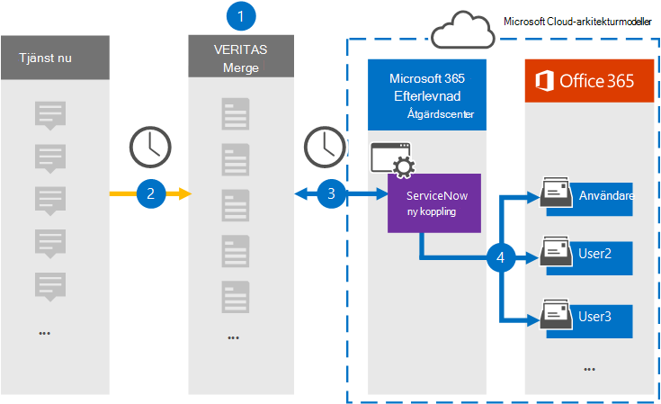

# Konfigurera en anslutare för att arkivera ServiceNow-dataSet up a connector to archive ServiceNow data

Använd en Veritas-koppling i Microsoft 365 compliance center för att importera och arkivera data från ServiceNow-plattformen till användarpostlådor i Microsoft 365 organisation.Use a Veritas connector in the Microsoft 365 compliance center to import and archive data from the ServiceNow platform to user mailboxes in your Microsoft 365 organization. Veritas tillhandahåller en [ServiceNow-anslutning](https://globanet.com/servicenow/) som samlar objekt från datakällan från tredje part och importerar dessa objekt till Microsoft 365.Veritas provides a [ServiceNow](https://globanet.com/servicenow/) connector that captures items from the third-party data source and import those items to Microsoft 365. Anslutningen konverterar innehåll som livemeddelanden, bifogade filer och inlägg från ServiceNow till ett e-postmeddelandeformat och importerar sedan dessa objekt till användarnas postlådor i Microsoft 365.The connector converts the content such as live messages, attachments, and posts from ServiceNow to an email message format and then imports those items to user mailboxes in Microsoft 365.

När ServiceNow-data har lagrats i användarnas postlådor kan du använda efterlevnadsfunktioner för Microsoft 365, till exempel Bevarande av juridiska skäl, eDiscovery, bevarandeprinciper och bevarandeetiketter.After ServiceNow data is stored in user mailboxes, you can apply Microsoft 365 compliance features such as Litigation Hold, eDiscovery, retention policies, and retention labels. Genom att använda en ServiceNow-anslutning för att importera och arkivera data i Microsoft 365 kan hjälpa din organisation att följa myndighets- och regleringsprinciper.Using a ServiceNow connector to import and archive data in Microsoft 365 can help your organization stay compliant with government and regulatory policies.

## Översikt över arkivering av ServiceNow-dataOverview of archiving ServiceNow data

Följande översikt förklarar hur du använder en anslutare för att arkivera ServiceNow-data i Microsoft 365.The following overview explains the process of using a connector to archive the ServiceNow data in Microsoft 365.

1. Din organisation arbetar med ServiceNow för att konfigurera och konfigurera en ServiceNow-webbplats.Your organization works with ServiceNow to set up and configure a ServiceNow site.

2. En gång per dygn kopieras ServiceNow-objekt till webbplatsen Veritas Merge1.Once every 24 hours, ServiceNow items are copied to the Veritas Merge1 site. Anslutningen konverterar även ServiceNow-objekt till ett e-postmeddelandeformat.The connector also converts ServiceNow items to an email message format.

3. ServiceNow-anslutningen som du skapar i kompatibilitetscentret för Microsoft 365 ansluter till Veritas Merge1-webbplatsen varje dag och överför ServiceNow-innehållet till en säker Azure Storage plats i Microsoft-molnet.The ServiceNow connector that you create in the Microsoft 365 compliance center connects to the Veritas Merge1 site every day and transfers the ServiceNow content to a secure Azure Storage location in the Microsoft cloud.

4. Kopplingen importerar de konverterade objekten till postlådorna  för specifika användare med värdet för egenskapen E-post för den automatiska användarmappningen enligt beskrivningen [i steg 3.](#step-3-map-users-and-complete-the-connector-setup)The connector imports the converted items to the mailboxes of specific users using the value of the *Email* property of the automatic user mapping as described in [Step 3](#step-3-map-users-and-complete-the-connector-setup). En undermapp till mappen Inkorg med namnet **ServiceNow** skapas i användarnas postlådor och objekt importeras till den mappen.A subfolder in the Inbox folder named **ServiceNow** is created in the user mailboxes, and items are imported to that folder. Kopplingen avgör vilken postlåda som objekt ska importeras till med hjälp av värdet för egenskapen *E-post.*The connector determines which mailbox to import items to by using the value of the *Email* property. All ServiceNow-artikel innehåller den här egenskapen, som fylls i med e-postadresserna för alla deltagare i objektet.Every ServiceNow item contains this property, which is populated with the email address of every participant of the item.

## Innan du börjarBefore you begin

- Skapa ett Merge1-konto för Microsoft-kopplingar.Create a Merge1 account for Microsoft connectors. Om du vill skapa ett konto kontaktar [du Veritas kundsupport.](https://www.veritas.com/content/support/)To create an account, contact [Veritas Customer Support](https://www.veritas.com/content/support/). Du måste logga in på det här kontot när du skapar kopplingen i steg 1.You need to sign into this account when you create the connector in Step 1.

- Skapa ett ServiceNow-program för att hämta data från ditt ServiceNow-konto.Create a ServiceNow application to fetch data from your ServiceNow account. Stegvisa instruktioner för hur du skapar programmet finns i [Användarhandbok för slå samman1 kopplingar från tredje part.](https://docs.ms.merge1.globanetportal.com/Merge1%20Third-Party%20Connectors%20ServiceNow%20User%20Guide%20.pdf)For step-by step instructions about creating the application, see [Merge1 Third-Party Connectors User Guide](https://docs.ms.merge1.globanetportal.com/Merge1%20Third-Party%20Connectors%20ServiceNow%20User%20Guide%20.pdf).

- Den användare som skapar ServiceNow-kopplingen i steg 1 (och slutför det i steg 3) måste tilldelas rollen Importera och exportera postlåda i Exchange Online.The user who creates the ServiceNow connector in Step 1 (and completes it in Step 3) must be assigned to the Mailbox Import Export role in Exchange Online. Den här rollen krävs för att lägga till kopplingar **på sidan Datakopplingar** i Microsoft 365 kompatibilitetscenter.This role is required to add connectors on the **Data connectors** page in the Microsoft 365 compliance center. Som standard är den här rollen inte tilldelad någon rollgrupp i Exchange Online.By default, this role isn't assigned to any role group in Exchange Online. Du kan lägga till rollen Importera och exportera postlåda i rollgruppen Organisationshantering i Exchange Online.You can add the Mailbox Import Export role to the Organization Management role group in Exchange Online. Du kan också skapa en rollgrupp, tilldela rollen Importera och exportera postlåda och sedan lägga till lämpliga användare som medlemmar.Or you can create a role group, assign the Mailbox Import Export role, and then add the appropriate users as members. Mer information finns i avsnitten [Skapa rollgrupper](/Exchange/permissions-exo/role-groups#create-role-groups) och [Ändra rollgrupper](/Exchange/permissions-exo/role-groups#modify-role-groups) i artikeln "Hantera rollgrupper i Exchange Online".For more information, see the [Create role groups](/Exchange/permissions-exo/role-groups#create-role-groups) or [Modify role groups](/Exchange/permissions-exo/role-groups#modify-role-groups) sections in the article "Manage role groups in Exchange Online".

## Steg 1: Konfigurera ServiceNow-kopplingenStep 1: Set up the ServiceNow connector

Det första steget är att komma åt **sidan Data connectors** i Microsoft 365 compliance center och skapa en anslutning för ServiceNow-data.The first step is to access to the **Data Connectors** page in the Microsoft 365 compliance center and create a connector for ServiceNow data.

1. Gå till [https://compliance.microsoft.com](https://compliance.microsoft.com/) och klicka sedan på Data **connectors**  >  **ServiceNow.**Go to [https://compliance.microsoft.com](https://compliance.microsoft.com/) and then click **Data connectors** > **ServiceNow**.

2. Klicka på Lägg till koppling på sidan för produktbeskrivning **av** **ServiceNow.**On the **ServiceNow** product description page, click **Add connector**.

3. Klicka på **Acceptera på** sidan **Användningsvillkor.**On the **Terms of service** page, click **Accept**.

4. Ange ett unikt namn som identifierar kopplingen och klicka sedan på **Nästa.**Enter a unique name that identifies the connector, and then click **Next**.

5. Logga in på ditt Merge1-konto för att konfigurera kopplingen.Sign in to your Merge1 account to configure the connector.

## Steg 2: Konfigurera ServiceNow på webbplatsen Veritas Merge1Step 2: Configure the ServiceNow on the Veritas Merge1 site

Det andra steget är att konfigurera ServiceNow-kopplingen på Veritas Merge1-webbplatsen.The second step is to configure the ServiceNow connector on the Veritas Merge1 site. Mer information om hur du konfigurerar ServiceNow-anslutningen finns i [Användarhandbok för Merge1 Tredjepartsanslutningar.](https://docs.ms.merge1.globanetportal.com/Merge1%20Third-Party%20Connectors%20ServiceNow%20User%20Guide%20.pdf)For information about how to configure the ServiceNow connector, see [Merge1 Third-Party Connectors User Guide](https://docs.ms.merge1.globanetportal.com/Merge1%20Third-Party%20Connectors%20ServiceNow%20User%20Guide%20.pdf).

När du klickar **& på** Spara  och slutför visas sidan Användarmappning i kopplingsguiden Microsoft 365 kompatibilitetscentret.After you click **Save & Finish,** the **User mapping** page in the connector wizard in the Microsoft 365 compliance center is displayed.

## Steg 3: Mappa användare och slutför kopplingskonfigurationenStep 3: Map users and complete the connector setup

Om du vill mappa användare och slutföra anslutningskonfigurationen i Microsoft 365 efterlevnadscenter gör du så här:To map users and complete the connector setup in the Microsoft 365 compliance center, follow these steps:

1. På sidan **Map ServiceNow-användare Microsoft 365 användarna** aktiverar du den automatiska användarmappningen.On the **Map ServiceNow users to Microsoft 365 users** page, enable automatic user mapping. ServiceNow-objekten innehåller egenskapen *Email,* som innehåller e-postadresser för användare i organisationen.The ServiceNow items include a property called *Email*, which contains email addresses for users in your organization. Om kopplingen kan associera den här adressen Microsoft 365 en användare importeras objekten till den användarens postlåda.If the connector can associate this address with a Microsoft 365 user, the items are imported to that user's mailbox.

2. Klicka **på** Nästa, granska dina inställningar och gå sedan till sidan **Datakopplingar** för att se förloppet för importen för den nya anslutningen.Click **Next**, review your settings, and then go to the **Data connectors** page to see the progress of the import process for the new connector.

## Steg 4: Övervaka ServiceNow-kopplingenStep 4: Monitor the ServiceNow connector

När du har skapat ServiceNow-anslutningen kan du visa anslutningsstatusen i Microsoft 365 kompatibilitetscenter.After you create the ServiceNow connector, you can view the connector status in the Microsoft 365 compliance center.

1. Gå till [https://compliance.microsoft.com](https://compliance.microsoft.com/) och klicka på **Datakopplingar** i det vänstra navigeringsfältet.Go to [https://compliance.microsoft.com](https://compliance.microsoft.com/) and click **Data connectors** in the left nav.

2. Klicka på **fliken Kopplingar** och välj sedan **ServiceNow-kopplingen** för att visa den utfällade sidan, som innehåller egenskaper och information om kopplingen.Click the **Connectors** tab and then select the **ServiceNow** connector to display the flyout page, which contains the properties and information about the connector.

3. Under **Anslutningsstatus med källa** klickar du på länken Ladda ned **logg** för att öppna (eller spara) statusloggen för kopplingen.Under **Connector status with source**, click the **Download log** link to open (or save) the status log for the connector. Den här loggen innehåller data som har importerats till Microsoft-molnet.This log contains data that has been imported to the Microsoft cloud.

## Kända problemKnown issues

- För stunden går det inte att importera bifogade filer eller objekt som är större än 10 MB.At this time, we don't support importing attachments or items that are larger than 10 MB. Stöd för större objekt blir tillgängligt vid ett senare tillfälle.Support for larger items will be available at a later date.