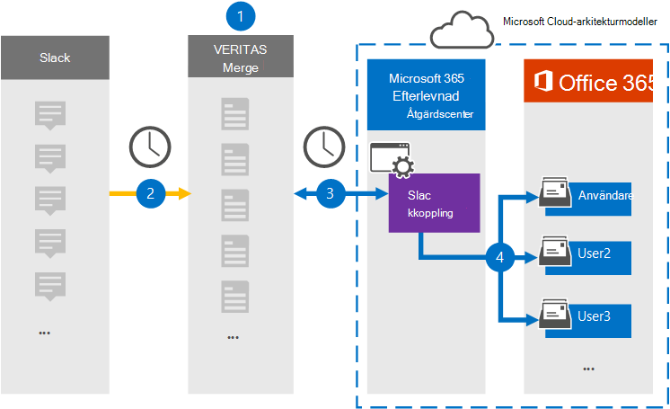

# Konfigurera en koppling för att arkivera slack-eDiscovery-dataSet up a connector to archive Slack eDiscovery data

Använd en Veritas-koppling i efterlevnadscentret för Microsoft 365 om du vill importera och arkivera data från tredje part från sociala medier, snabbmeddelanden och plattformar för dokumentsamarbete till postlådor i Microsoft 365 organisation.Use a Veritas connector in the Microsoft 365 compliance center to import and archive third-party data from social media, instant messaging, and document collaboration platforms to mailboxes in your Microsoft 365 organization. Veritas tillhandahåller en [slackkoppling](https://globanet.com/slack/) som har konfigurerats för att hämta objekt från tredje parts datakälla (regelbundet) och sedan importera de objekten till Microsoft 365.Veritas provides a [Slack](https://globanet.com/slack/) connector that's configured to capture items from the third-party data source (on a regular basis) and then import those items to Microsoft 365. Slack hämtar meddelanden och filer från Slack API och konverterar dem till ett e-postmeddelandeformat och importerar sedan objektet till användarnas postlådor.Slack pulls messages and files from the Slack API and converts them to an email message format and then imports the item to user mailboxes.

När slack eDiscovery-data har lagrats i användarpostlådor kan du använda efterlevnadsfunktioner i Microsoft 365, till exempel bevarande av juridiska skäl, eDiscovery, bevarandeprinciper och bevarandeetiketter samt kommunikationsefterlevnad.After Slack eDiscovery data is stored in user mailboxes, you can apply Microsoft 365 compliance features such as Litigation Hold, eDiscovery, retention policies and retention labels, and communication compliance. Genom att använda en slackkoppling för att importera och arkivera data i Microsoft 365 kan det hjälpa din organisation att följa myndighets- och regleringsprinciper.Using a Slack connector to import and archive data in Microsoft 365 can help your organization stay compliant with government and regulatory policies.

## Översikt över arkivering av slack-eDiscovery-dataOverview of archiving Slack eDiscovery data

I följande översikt beskrivs hur du använder en koppling för att arkivera slackinformationen i Microsoft 365.The following overview explains the process of using a connector to archive the Slack information in Microsoft 365.

1. Organisationen arbetar med slack när du konfigurerar och konfigurerar en slackwebbplats.Your organization works with Slack to set up and configure a Slack site.

2. En gång per dygn kopieras chattmeddelanden från Slack eDiscovery till webbplatsen Veritas Merge1.Once every 24 hours, chat messages from Slack eDiscovery are copied to the Veritas Merge1 site. Kopplingen omvandlar också innehållet i ett chattmeddelande till ett e-postmeddelandeformat.The connector also converts the content of a chat message to an email message format.

3. Den Slack eDiscovery-koppling som du skapar i kompatibilitetscentret för Microsoft 365, ansluter till Veritas Merge1-webbplatsen varje dag och överför chattmeddelandena till en säker Azure Storage plats i Microsoft-molnet.The Slack eDiscovery connector that you create in the Microsoft 365 compliance center, connects to the Veritas Merge1 site every day and transfers the chat messages to a secure Azure Storage location in the Microsoft cloud.

4. Kopplingen importerar de konverterade chattmeddelandeobjekten till postlådorna  för specifika användare med värdet för egenskapen E-post och automatisk användarmappning, enligt beskrivningen i steg 3.The connector imports the converted chat message items to the mailboxes of specific users using the value of the *Email* property and automatic user mapping, as described in Step 3. En ny undermapp i mappen Inkorgen med namnet **Slack eDiscovery** skapas i användarnas postlådor och chattmeddelandeobjekten importeras till den mappen.A new subfolder in the Inbox folder named **Slack eDiscovery** is created in the user mailboxes, and the chat message items are imported to that folder. Kopplingen avgör vilken postlåda som objekt ska importeras till med hjälp av värdet för egenskapen *E-post.*The connector determines which mailbox to import items to by using the value of the *Email* property. Alla chattmeddelanden innehåller den här egenskapen, som fylls i med e-postadressen för alla deltagare i chattmeddelandet.Every chat message contains this property, which is populated with the email address of every participant of the chat message.

## Innan du börjarBefore you begin

- Skapa ett Veritas Merge1-konto för Microsoft-kopplingar.Create a Veritas Merge1 account for Microsoft connectors. Om du vill skapa ett konto kontaktar [du Veritas kundsupport.](https://globanet.com/ms-connectors-contact)To create an account, contact [Veritas Customer Support](https://globanet.com/ms-connectors-contact). Du loggar in på det här kontot när du skapar kopplingen i steg 1.You will sign into this account when you create the connector in Step 1.

- Hämta användarnamnet och lösenordet för organisationens Slack-företagskonto.Obtain the username and password for your organization's Slack enterprise account. Du måste logga in på det här kontot i steg 2 när du konfigurerar slack.You'll need to sign into this account in Step 2 when you configure Slack.

- Den användare som skapar slack-eDiscovery-kopplingen i steg 1 (och slutför den i steg 3) måste tilldelas rollen Importera och exportera postlåda i Exchange Online.The user who creates the Slack eDiscovery connector in Step 1 (and completes it in Step 3) must be assigned to the Mailbox Import Export role in Exchange Online. Den här rollen krävs för att lägga till kopplingar **på sidan Datakopplingar** i Microsoft 365 kompatibilitetscenter.This role is required to add connectors on the **Data connectors** page in the Microsoft 365 compliance center. Som standard är den här rollen inte tilldelad en rollgrupp i Exchange Online.By default, this role is not assigned to a role group in Exchange Online. Du kan lägga till rollen Importera och exportera postlåda i rollgruppen Organisationshantering i Exchange Online.You can add the Mailbox Import Export role to the Organization Management role group in Exchange Online. Du kan också skapa en rollgrupp, tilldela rollen Importera och exportera postlåda och sedan lägga till lämpliga användare som medlemmar.Or you can create a role group, assign the Mailbox Import Export role, and then add the appropriate users as members. Mer information finns i avsnitten [Skapa rollgrupper](/Exchange/permissions-exo/role-groups#create-role-groups) och [Ändra rollgrupper](/Exchange/permissions-exo/role-groups#modify-role-groups) i artikeln "Hantera rollgrupper i Exchange Online".For more information, see the [Create role groups](/Exchange/permissions-exo/role-groups#create-role-groups) or [Modify role groups](/Exchange/permissions-exo/role-groups#modify-role-groups) sections in the article "Manage role groups in Exchange Online".

## Steg 1: Konfigurera slack-eDiscovery-kopplingenStep 1: Set up the Slack eDiscovery connector

Det första steget är att komma åt sidan Datakopplingar i Microsoft 365 **kompatibilitetscenter** och skapa en koppling för slackdata.The first step is to access to the **Data Connectors** page in the Microsoft 365 compliance center and create a connector for Slack data.

1. Gå till [https://compliance.microsoft.com](https://compliance.microsoft.com/) och klicka på **Datakopplingar**  >  **Slack eDiscovery**.Go to [https://compliance.microsoft.com](https://compliance.microsoft.com/) and then click **Data connectors** > **Slack eDiscovery**.

2. Klicka på Lägg till koppling på sidan Slack för **eDiscovery-produktbeskrivning.** On the **Slack eDiscovery** product description page, click **Add connector**.

3. Klicka på **Acceptera på** sidan **Användningsvillkor.**On the **Terms of service** page, click **Accept**.

4. Ange ett unikt namn som identifierar kopplingen och klicka sedan på **Nästa.**Enter a unique name that identifies the connector, and then click **Next**.

5. Logga in på ditt Merge1-konto för att konfigurera kopplingen.Sign in to your Merge1 account to configure the connector.

## Steg 2: Konfigurera slack för eDiscoveryStep 2: Configure Slack eDiscovery

Det andra steget är att konfigurera den slacka eDiscovery-kopplingen på webbplatsen Merge1.The second step is to configure the Slack eDiscovery connector on the Merge1 site. Mer information om hur du konfigurerar slacket för eDiscovery-koppling på Webbplatsen Veritas Merge1 finns i Användarhandbok för Slå [samman1 tredjepartskopplingar.](https://docs.ms.merge1.globanetportal.com/Merge1%20Third-Party%20Connectors%20Slack%20eDiscovery%20User%20Guide.pdf)For more information about how to configure the Slack eDiscovery connector on the Veritas Merge1 site, see [Merge1 Third-Party Connectors User Guide](https://docs.ms.merge1.globanetportal.com/Merge1%20Third-Party%20Connectors%20Slack%20eDiscovery%20User%20Guide.pdf).

När du har **klickat &**  på Spara eller & visas sidan Användarmappning i kopplingsguiden i Microsoft 365 kompatibilitetscenter.After you click **Save & Finish**, the **User mapping** page in the connector wizard in the Microsoft 365 compliance center is displayed.

## Steg 3: Mappa användare och slutför kopplingskonfigurationenStep 3: Map users and complete the connector setup

1. På sidan **Mappa externa användare till Microsoft 365 aktiverar** du automatisk användarmappning.On the **Map external users to Microsoft 365 users** page, enable automatic user mapping.

   Slack eDiscovery-objekt omfattar en egenskap *med namnet E-post,* som innehåller e-postadresser för användare i organisationen.Slack eDiscovery items include a property called *Email*, which contains email addresses for users in your organization. Om kopplingen kan associera den här adressen Microsoft 365 en användare importeras objekten till den användarens postlåda.If the connector can associate this address with a Microsoft 365 user, the items are imported to that user's mailbox.

2. Klicka **på** Nästa , granska dina inställningar och gå till sidan **Datakopplingar** för att se förloppet för importen för den nya anslutningen.Click **Next**, review your settings, and go to the **Data connectors** page to see the progress of the import process for the new connector.

## Steg 4: Övervaka den slacka eDiscovery-kopplingenStep 4: Monitor the Slack eDiscovery connector

När du har skapat slack-eDiscovery-kopplingen kan du visa kopplingsstatusen Microsoft 365 efterlevnadscenter.After you create the Slack eDiscovery connector, you can view the connector status in the Microsoft 365 compliance center.

1. Gå till [https://compliance.microsoft.com](https://compliance.microsoft.com) och klicka på **Datakopplingar** i det vänstra navigeringsfältet.Go to [https://compliance.microsoft.com](https://compliance.microsoft.com) and click **Data connectors** in the left nav.

2. Klicka på **fliken Kopplingar och** välj sedan den slacka **eDiscovery-kopplingen** för att visa den utfällade sidan.Click the **Connectors** tab and then select the **Slack eDiscovery** connector to display the flyout page. Den här sidan innehåller egenskaper och information om kopplingen.This page contains the properties and information about the connector.

3. Under **Anslutningsstatus med källa** klickar du på länken Ladda ned **logg** för att öppna (eller spara) statusloggen för kopplingen.Under **Connector status with source**, click the **Download log** link to open (or save) the status log for the connector. Den här loggen innehåller information om de data som har importerats till Microsoft-molnet.This log contains information about the data that has been imported to the Microsoft cloud.

## Kända problemKnown issues

- För stunden går det inte att importera bifogade filer eller objekt som är större än 10 MB.At this time, we don't support importing attachments or items that are larger than 10 MB. Stöd för större objekt blir tillgängligt vid ett senare tillfälle.Support for larger items will be available at a later date.