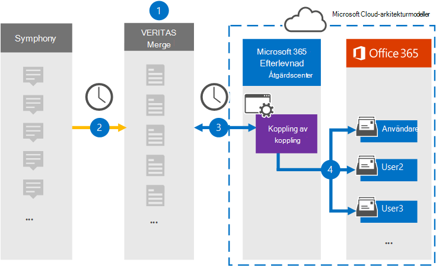

# Konfigurera en koppling för arkivering av dataSet up a connector to archive Symphony data

Använd en Veritas-koppling i Microsoft 365 kompatibilitetscenter om du vill importera och arkivera Data Från för användares postlådor i Microsoft 365 organisation.Use a Veritas connector in the Microsoft 365 compliance center to import and archive Symphony data to user mailboxes in your Microsoft 365 organization. In är en meddelande- och samarbetsplattform som används inom finansiella tjänster.Symphony is a messaging and collaboration platform used in the financial services industry. Veritas tillhandahåller  en Sånledes-datakoppling i Microsoft 365 efterlevnadscenter som du kan konfigurera för att hämta objekt från tredje parts datakälla (regelbundet) och sedan importera objekten till användarnas postlådor.Veritas provides a [Symphony](https://globanet.com/symphony) data connector in the Microsoft 365 compliance center that you can configure to capture items from the third-party data source (on a regular basis) and then import those items to user mailboxes. Kopplingen konverterar innehållet i ett objekt från Det första kontot till ett e-postmeddelandeformat och importerar sedan objektet till en postlåda i Microsoft 365.The connector converts the content of an item from the Symphony account to an email message format and then imports the item to a mailbox in Microsoft 365.

När Communications Communications har lagrats i användarnas postlådor kan du använda Microsoft 365 efterlevnadsfunktioner, till exempel bevarande av juridiska skäl, eDiscovery, bevarandeprinciper och bevarandeetiketter samt kommunikationsefterlevnad.After Symphony communications are stored in user mailboxes, you can apply Microsoft 365 compliance features such as Litigation Hold, eDiscovery, retention policies and retention labels, and communication compliance. Genom att använda en Connector-koppling för att importera och arkivera data i Microsoft 365 kan det hjälpa din organisation att följa myndighets- och regleringsprinciperna.Using a Symphony connector to import and archive data in Microsoft 365 can help your organization stay compliant with government and regulatory policies.

## Översikt över arkivering av data i DatabladOverview of archiving Symphony data

I följande översikt beskrivs hur du använder en dataanslutning för att arkivera Kommunikationsarkiv i Microsoft 365.The following overview explains the process of using a data connector to archive Symphony communications in Microsoft 365.

1. Organisationen arbetar med Görn för att konfigurera och konfigurera en webbplats för en webbplats.Your organization works with Symphony to set up and configure a Symphony site.

2. En gång per dygn kopieras chattmeddelanden frånLjud till webbplatsen Veritas Merge1.Once every 24 hours, chat messages from Symphony are copied to the Veritas Merge1 site. Kopplingen omvandlar också innehållet i ett chattmeddelande till ett e-postmeddelandeformat.The connector also converts the content of a chat message to an email message format.

3. Kopplingen Som du skapar i efterlevnadscentret i Microsoft 365, ansluter till Veritas Merge1-webbplatsen varje dag och överför meddelandena till en säker Azure Storage plats i Microsoft-molnet.The Symphony connector that you create in the Microsoft 365 compliance center, connects to the Veritas Merge1 site every day and transfers the messages to a secure Azure Storage location in the Microsoft cloud.

4. Kopplingen importerar de konverterade meddelandeobjekten till postlådorna  för specifika användare med värdet för e-postegenskapen för den automatiska användarmappningen enligt beskrivningen i steg 3.The connector imports the converted message items to the mailboxes of specific users using the value of the *Email* property of the automatic user mapping as described in Step 3. En ny undermapp i mappen Inkorgen med namnet **Överse** skapas i användarnas postlådor och meddelandeobjekten importeras till den mappen.A new subfolder in the Inbox folder named **Symphony** is created in the user mailboxes, and the message items are imported to that folder. Kopplingen avgör vilken postlåda som objekt ska importeras till med hjälp av värdet för egenskapen *E-post.*The connector determines which mailbox to import items to by using the value of the *Email* property. Alla chattmeddelanden innehåller den här egenskapen, som fylls i med e-postadresserna för alla deltagare.Every chat message contains this property, which is populated with the email address for every participant.

## Innan du börjarBefore you begin

- Skapa ett Veritas Merge1-konto för Microsoft-kopplingar.Create a Veritas Merge1 account for Microsoft connectors. Om du vill skapa ett konto kontaktar [du Veritas kundsupport.](https://globanet.com/ms-connectors-contact)To create an account, contact [Veritas Customer Support](https://globanet.com/ms-connectors-contact). Du loggar in på det här kontot när du skapar kopplingen i steg 1.You will sign into this account when you create the connector in Step 1.

- Den användare som skapar Koppling för postlådor i steg 1 (och slutför den i steg 3) måste tilldelas rollen Importera och exportera postlåda i Exchange Online.The user who creates the Symphony connector in Step 1 (and completes it in Step 3) must be assigned to the Mailbox Import Export role in Exchange Online. Den här rollen krävs för att lägga till kopplingar **på sidan Datakopplingar** i Microsoft 365 kompatibilitetscenter.This role is required to add connectors on the **Data connectors** page in the Microsoft 365 compliance center. Som standard är den här rollen inte tilldelad en rollgrupp i Exchange Online.By default, this role is not assigned to a role group in Exchange Online. Du kan lägga till rollen Importera och exportera postlåda i rollgruppen Organisationshantering i Exchange Online.You can add the Mailbox Import Export role to the Organization Management role group in Exchange Online. Du kan också skapa en rollgrupp, tilldela rollen Importera och exportera postlåda och sedan lägga till lämpliga användare som medlemmar.Or you can create a role group, assign the Mailbox Import Export role, and then add the appropriate users as members. Mer information finns i avsnitten [Skapa rollgrupper](/Exchange/permissions-exo/role-groups#create-role-groups) och [Ändra rollgrupper](/Exchange/permissions-exo/role-groups#modify-role-groups) i artikeln "Hantera rollgrupper i Exchange Online".For more information, see the [Create role groups](/Exchange/permissions-exo/role-groups#create-role-groups) or [Modify role groups](/Exchange/permissions-exo/role-groups#modify-role-groups) sections in the article "Manage role groups in Exchange Online".

## Steg 1: Konfigurera KopplingenStep 1: Set up the Symphony connector

Det första steget är att få åtkomst till sidan Datakopplingar i Microsoft 365 för **efterlevnadscenter** och skapa en koppling för Datakällor.The first step is to access to the **Data Connectors** page in the Microsoft 365 compliance center and create a connector for Symphony data.

1. Gå till [https://compliance.microsoft.com](https://compliance.microsoft.com/) och klicka sedan på **Datakopplingar**  >  **Försett**.Go to [https://compliance.microsoft.com](https://compliance.microsoft.com/) and then click **Data connectors** > **Symphony**.

2. På sidan **För produktbeskrivning** klickar du på **Lägg till koppling.**On the **Symphony** product description page, click **Add connector**.

3. Klicka på **Acceptera på** sidan **Användningsvillkor.**On the **Terms of service** page, click **Accept**.

4. Ange ett unikt namn som identifierar kopplingen och klicka sedan på **Nästa.**Enter a unique name that identifies the connector, and then click **Next**.

5. Logga in på ditt Merge1-konto för att konfigurera kopplingen.Sign in to your Merge1 account to configure the connector.

## Konfigurera kopplingskopplingen på Webbplatsen Veritas Merge1Configure the Symphony connector on the Veritas Merge1 site

Det andra steget är att konfigurera Kopplingar på webbplatsen Merge1.The second step is to configure the Symphony connector on the Merge1 site. Mer information om hur du konfigurerar kopplingskopplingen på Webbplatsen Veritas Merge1 finns i Användarhandbok för Slå [samman1 tredjepartskopplingar.](https://docs.ms.merge1.globanetportal.com/Merge1%20Third-Party%20Connectors%20Symphony%20User%20Guide%20.pdf)For information about configuring  the Symphony connector on the Veritas Merge1 site, see [Merge1 Third-Party Connectors User Guide](https://docs.ms.merge1.globanetportal.com/Merge1%20Third-Party%20Connectors%20Symphony%20User%20Guide%20.pdf).

När du har **klickat &**  på Spara eller & visas sidan Användarmappning i kopplingsguiden i Microsoft 365 kompatibilitetscenter.After you click **Save & Finish**, the **User mapping** page in the connector wizard in the Microsoft 365 compliance center is displayed.

## Steg 3: Mappa användare och slutför kopplingskonfigurationenStep 3: Map users and complete the connector setup

Om du vill mappa användare och slutföra anslutningskonfigurationen i Microsoft 365 efterlevnadscenter gör du så här:To map users and complete the connector setup in the Microsoft 365 compliance center, follow these steps:

1. På sidan **Mappa externa användare till Microsoft 365 aktiverar** du automatisk användarmappning.On the **Map external users to Microsoft 365 users** page, enable automatic user mapping. Objekten till exempel egenskapen *E-post,* som innehåller e-postadresser för användare i organisationen.The Symphony items include a property called *Email*, which contains email addresses for users in your organization. Om kopplingen kan associera den här adressen Microsoft 365 en användare importeras objekten till den användarens postlåda.If the connector can associate this address with a Microsoft 365 user, the items are imported to that user’s mailbox.

2. Klicka **på** Nästa, granska dina inställningar och gå sedan till sidan **Datakopplingar** för att se förloppet för importen för den nya anslutningen.Click **Next**, review your settings, and then go to the **Data connectors** page to see the progress of the import process for the new connector.

## Steg 4: Övervaka kopplingskopplingenStep 4: Monitor the Symphony connector

När du har skapat Kopplingen kan du visa kopplingsstatusen i Microsoft 365 efterlevnadscenter.After you create the Symphony connector, you can view the connector status in the Microsoft 365 compliance center.

1. Gå till [https://compliance.microsoft.com](https://compliance.microsoft.com) och klicka på **Datakopplingar** i det vänstra navigeringsfältet.Go to [https://compliance.microsoft.com](https://compliance.microsoft.com) and click **Data connectors** in the left nav.

2. Klicka på **fliken Kopplingar och** välj sedan Koppling för **att** visa den utfällade sidan.Click the **Connectors** tab and then select the **Symphony** connector to display the flyout page. Den här sidan innehåller egenskaper och information om kopplingen.This page contains the properties and information about the connector.

3. Under **Anslutningsstatus med källa** klickar du på länken Ladda ned **logg** för att öppna (eller spara) statusloggen för kopplingen.Under **Connector status with source**, click the **Download log** link to open (or save) the status log for the connector. Den här loggen innehåller information om de data som har importerats till Microsoft-molnet.This log contains information about the data that has been imported to the Microsoft cloud.

## Kända problemKnown issues

- För stunden går det inte att importera bifogade filer eller objekt som är större än 10 MB.At this time, we don't support importing attachments or items that are larger than 10 MB. Stöd för större objekt blir tillgängligt vid ett senare tillfälle.Support for larger items will be available at a later date.