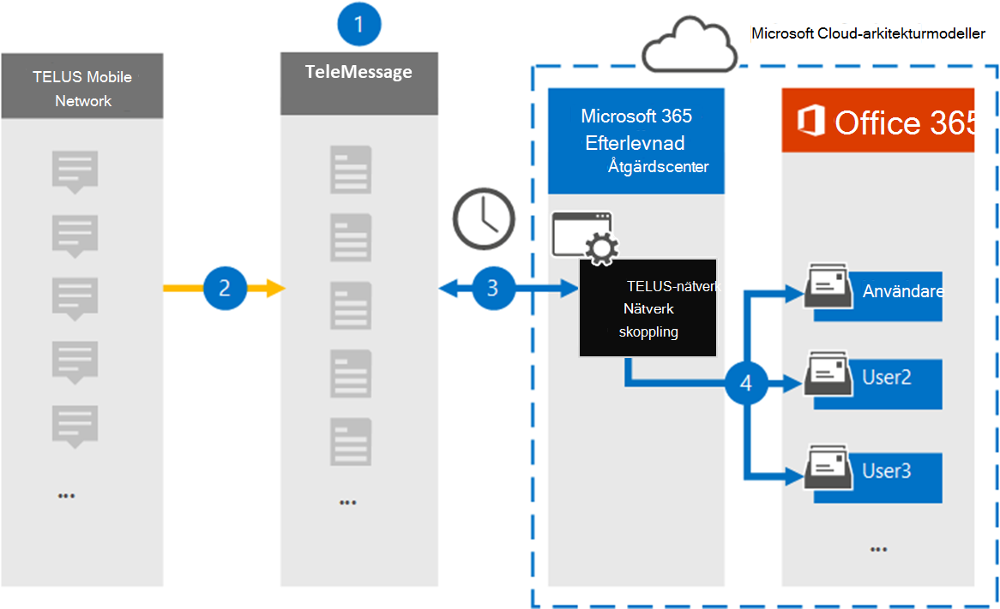

# Konfigurera en koppling för att arkivera data i TELUS-nätverket

Använd TeleMessage-kopplingen i kompatibilitetscentret för Microsoft 365 för att importera och arkivera SMS data från organisationens TELUS-nätverk. När du har konfigurerat och konfigurerat en koppling ansluts den till organisationens TELUS-nätverk en gång om dagen och importerar SMS data till postlådor i Microsoft 365.

När SMS meddelanden lagras i användarnas postlådor kan du tillämpa efterlevnadsfunktioner i Microsoft 365, till exempel Bevarande av juridiska skäl, Innehållssökning och Microsoft 365 bevarandeprinciper på TELUS-data. Du kan till exempel söka i TELUS SMS meddelanden med hjälp av Innehållssökning eller associera postlådan som innehåller TELUS-data med en medarbetare i ett Advanced eDiscovery ärende. Om du använder en TELUS-nätverkskoppling för att importera och arkivera data i Microsoft 365 kan hjälpa din organisation att följa myndighets- och regelpolicyer.

## Översikt över arkivering av DATA i TELUS-nätverket

Följande översikt förklarar processen med att använda en koppling för att arkivera TELUS-nätverksdata i Microsoft 365.

1. Din organisation arbetar med TeleMessage och TELUS för att konfigurera en TELUS Network-koppling. Mer information finns i [TELUS Network Archiver](https://www.telemessage.com/office365-activation-for-telus-network-archiver/).

2. I realtid SMS meddelanden från organisationens TELUS-nätverk till TeleMessage-webbplatsen.

3. DEN TELUS Network-anslutning som du skapar i efterlevnadscentret för Microsoft 365 ansluter till TeleMessage-webbplatsen varje dag och överför SMS-meddelandena från de föregående 24 timmarna till en säker Azure Storage plats i Microsoft-molnet. Kopplingen konverterar också innehållet i e SMS till ett e-postmeddelandeformat.

4. Kopplingen importerar mobila kommunikationsobjekt till en viss användares postlåda. En ny mapp med **namnet TELUS SMS Network Archiver** skapas i den specifika användarens postlåda och objekten importeras till den. Kopplingen mappar med hjälp av värdet för *användarens e-postadressegenskap.* Alla SMS innehåller den här egenskapen, som fylls i med e-postadresserna för alla deltagare i SMS postmeddelandet.

   Förutom automatisk användarmappning med värdet  för användarens e-postadressegenskap kan du även implementera anpassad mappning genom att ladda upp en CSV-mappningsfil. Den här mappningsfilen innehåller mobiltelefonnumret och den Microsoft 365 e-postadressen för användare i organisationen. Om du aktiverar både automatisk användarmappning och anpassad mappning tittar kopplingen först på anpassad mappningsfil för varje TELUS-objekt. Om kontakten inte hittar en giltig Microsoft 365-användare som motsvarar en användares mobiltelefonnummer används värdena i e-postadressegenskapen för objektet som ska importeras. Om kopplingen inte hittar en giltig Microsoft 365 användare i antingen den anpassade mappningsfilen eller i e-postadressegenskapen för TELUS-objektet, importeras inte objektet.

## Innan du börjar

Några av de implementeringssteg som krävs för att arkivera data i TELUS-nätverket är externa för Microsoft 365 och måste slutföras innan du kan skapa en anslutning i efterlevnadscentret.

- Beställ [TELUS Network Archiver-tjänsten från TeleMessage](https://www.telemessage.com/mobile-archiver/order-mobile-archiver-for-o365) och få ett giltigt administrationskonto för din organisation. Du måste logga in på det här kontot när du skapar anslutningen i efterlevnadscentret.

- Få information om ditt TELUS Network-konto och dina faktureringskontaktuppgifter så att du kan fylla i TeleMessage-introduktionsformulären och ordna meddelandearkiveringstjänsten från TELUS.

- Registrera alla användare som kräver TELUS SMS nätverksarkivering i TeleMessage-kontot. Se till att använda samma e-postadress som används för användarens konto när du registrerar Microsoft 365 användare.

- De anställda måste ha mobiltelefoner som ägs av företaget och som ansvarar för företaget på mobila nätverk avTELUS. Arkivering av meddelanden i Microsoft 365 är inte tillgängligt för enheter som ägs av anställda eller ta med egna enheter (BYOD).

- Den användare som skapar en TELUS-nätverkskoppling måste tilldelas rollen Importera och exportera postlåda i Exchange Online. Detta krävs för att lägga till kopplingar på **sidan Datakopplingar** i Microsoft 365 kompatibilitetscenter. Som standard är den här rollen inte tilldelad någon rollgrupp i Exchange Online. Du kan lägga till rollen Importera och exportera postlåda i rollgruppen Organisationshantering i Exchange Online. Du kan också skapa en rollgrupp, tilldela rollen Importera och exportera postlåda och sedan lägga till lämpliga användare som medlemmar. Mer information finns i avsnitten [Skapa rollgrupper](/Exchange/permissions-exo/role-groups#create-role-groups) och [Ändra rollgrupper](/Exchange/permissions-exo/role-groups#modify-role-groups) i artikeln "Hantera rollgrupper i Exchange Online".

## Skapa en TELUS-nätverkskoppling

När du har slutfört de krav som beskrivs i föregående avsnitt kan du skapa TELUS-nätverkskoppling i Microsoft 365 kompatibilitetscenter. Kopplingen använder den information du uppger för att ansluta till TeleMessage-webbplatsen och överföra SMS till motsvarande postlåderutor för användare i Microsoft 365.

1. Gå till [https://compliance.microsoft.com](https://compliance.microsoft.com/) och klicka sedan på **Datakopplingar**  >  **TELUS-nätverk.**

2. På **produktbeskrivningssidan för TELUS Network** klickar du på **Lägg till koppling**

3. Klicka på **Acceptera på** sidan **Användningsvillkor.**

4. På sidan **Logga in på TeleMessage,** under Steg 3, anger du den information som krävs i följande rutor och klickar sedan på **Nästa.**

   - **Användarnamn:** Ditt TeleMessage-användarnamn.

   - **Lösenord:** Ditt TeleMessage-lösenord.

5. När kopplingen har skapats kan du stänga popup-fönstret och gå till nästa sida.

6. På sidan **Användarmappning** aktiverar du automatisk användarmappning och klickar på **Nästa.** Om du behöver anpassad mappning laddar du upp en CSV-fil och klickar på **Nästa**.

7. Granska inställningarna och klicka sedan på **Slutför för** att skapa kopplingen.

8. Gå till fliken Kopplingar på sidan **Datakopplingar** för att se importprocessen för den nya kopplingen.

## Kända problem

- För stunden går det inte att importera bifogade filer eller objekt som är större än 10 MB. Stöd för större objekt blir tillgängligt vid ett senare tillfälle.
