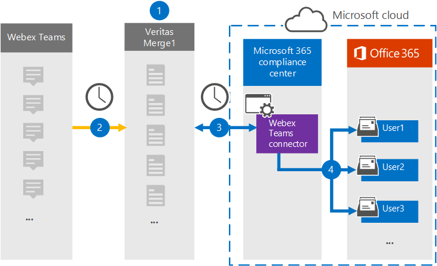

# Konfigurera en koppling för att arkivera Webex-Teams dataSet up a connector to archive Webex Teams data

Använd en Veritas-koppling i kompatibilitetscentret för Microsoft 365 om du vill importera och arkivera data från Webex Teams till användarpostlådor i Microsoft 365 organisation.Use a Veritas connector in the Microsoft 365 compliance center to import and archive data from Webex Teams to user mailboxes in your Microsoft 365 organization. Veritas innehåller en [Webex Teams-anslutning](https://globanet.com/webex-teams/) som är konfigurerad för att spara Webex-Teams-kommunikationsobjekt och importera dem till Microsoft 365.Veritas provides a [Webex Teams](https://globanet.com/webex-teams/) connector that is configured to capture Webex Teams communication items and import them to Microsoft 365. Kopplingen omvandlar innehåll från Webex Teams, till exempel privata chattar, gruppkonversationer, kanalkonversationer och bifogade filer från organisationens Webex Teams-konto, till ett e-postmeddelandeformat och importerar sedan dessa objekt till användarens postlåda i Microsoft 365.The connector converts content from Webex Teams, such as 1:1 chats, group conversations, channel conversations, and attachments from your organization's Webex Teams account, to an email message format and then imports those items to the user's mailbox in Microsoft 365.

När Webex Teams data lagras i användarpostlådor kan du använda efterlevnadsfunktioner i Microsoft 365, till exempel bevarande av juridiska skäl, eDiscovery, bevarandeprinciper och bevarandeetiketter samt kommunikationsefterlevnad.After Webex Teams data is stored in user mailboxes, you can apply Microsoft 365 compliance features such as Litigation Hold, eDiscovery, retention policies and retention labels, and communication compliance. Genom att använda en Webex Teams anslutning för att importera och arkivera data i Microsoft 365 kan organisationen följa myndighets- och regelpolicyer.Using a Webex Teams connector to import and archive data in Microsoft 365 can help your organization stay compliant with government and regulatory policies.

## Översikt över arkivering av Webex Teams dataOverview of archiving Webex Teams data

I följande översikt beskrivs hur du använder en koppling för att arkivera Webex-Teams data i Microsoft 365.The following overview explains the process of using a connector to archive Webex Teams data in Microsoft 365.

1. Din organisation arbetar med Webex Teams att konfigurera och konfigurera en Webex-Teams webbplats.Your organization works with Webex Teams to set up and configure a Webex Teams site.

2. En gång per dygn Teams Webex-objekt till webbplatsen Veritas Merge1.Once every 24 hours, Webex Teams items are copied to the Veritas Merge1 site. Kopplingen konverterar även Webex-Teams till ett e-postmeddelandeformat.The connector also converts the Webex Teams items to an email message format.

3. Den Webex Teams-koppling som du skapar i Microsoft 365 efterlevnadscenter, ansluter till Veritas Merge1 varje dag och överför Webex Teams-objekt till en säker Azure Storage-plats i Microsoft-molnet.The Webex Teams connector that you create in the Microsoft 365 compliance center, connects to the Veritas Merge1 every day, and transfers the Webex Teams items to a secure Azure Storage location in the Microsoft cloud.

4. Kopplingen importerar objekt till specifika användares postlådor med  värdet för egenskapen E-post för den automatiska användarmappningen enligt beskrivningen [i steg 3.](#step-3-map-users-and-complete-the-connector-setup)The connector imports items to the mailboxes of specific users by using the value of the *Email* property of the automatic user mapping as described in [Step 3](#step-3-map-users-and-complete-the-connector-setup). En undermapp i mappen Inkorgen med namnet **Webex Teams** skapas i användarnas postlådor och objekten importeras till den mappen.A subfolder in the Inbox folder named **Webex Teams** is created in the user mailboxes, and the items are imported to that folder. Kopplingen gör detta med hjälp av värdet för egenskapen *E-post.*The connector does this by using the value of the *Email* property. Alla Webex Teams postobjekt innehåller den här egenskapen, som fylls i med e-postadresserna för varje deltagare i objektet.Every Webex Teams item contains this property, which is populated with the email address of every participant of the item.

## Innan du börjarBefore you begin

- Skapa ett Veritas Merge1-konto för Microsoft-kopplingar.Create a Veritas Merge1 account for Microsoft connectors. Om du vill skapa det här kontot [kontaktar du Veritas kundsupport.](https://globanet.com/ms-connectors-contact)To create this account, contact [Veritas Customer Support](https://globanet.com/ms-connectors-contact). Du loggar in på det här kontot när du skapar kopplingen i steg 1.You will sign into this account when you create the connector in Step 1.

- Skapa ett program för [https://developer.webex.com/](https://developer.webex.com) att hämta data från webex-Teams konto.Create an application at [https://developer.webex.com/](https://developer.webex.com) to fetch data from your Webex Teams account. Stegvisa instruktioner för hur du skapar programmet finns i [Användarhandbok för slå samman1 tredjepartskopplingar](https://docs.ms.merge1.globanetportal.com/Merge1%20Third-Party%20Connectors%20Webex%20Teams%20User%20Guide%20.pdf)For step-by step instructions about creating the application, see [Merge1 Third-Party Connectors User Guide](https://docs.ms.merge1.globanetportal.com/Merge1%20Third-Party%20Connectors%20Webex%20Teams%20User%20Guide%20.pdf)

   När du skapar det här programmet genererar Webex-plattformen en uppsättning unika autentiseringsuppgifter.When you create this application, the Webex platform generates a set of unique credentials. Dessa autentiseringsuppgifter används i steg 2 när du konfigurerar Webex Teams anslutningen på Global Merge1-webbplatsen.These credentials are used in Step 2 when you configure the Webex Teams connector on the Global Merge1 site.

- Den användare som skapar Webex Teams-kopplingen i steg 1 (och slutför den i steg 3) måste tilldelas rollen Importera och exportera postlåda i Exchange Online.The user who creates the Webex Teams connector in Step 1 (and completes it in Step 3) must be assigned to the Mailbox Import Export role in Exchange Online. Den här rollen krävs för att lägga till kopplingar **på sidan Datakopplingar** i Microsoft 365 kompatibilitetscenter.This role is required to add connectors on the **Data connectors** page in the Microsoft 365 compliance center. Som standard är den här rollen inte tilldelad en rollgrupp i Exchange Online.By default, this role is not assigned to a role group in Exchange Online. Du kan lägga till rollen Importera och exportera postlåda i rollgruppen Organisationshantering i Exchange Online.You can add the Mailbox Import Export role to the Organization Management role group in Exchange Online. Du kan också skapa en rollgrupp, tilldela rollen Importera och exportera postlåda och sedan lägga till lämpliga användare som medlemmar.Or you can create a role group, assign the Mailbox Import Export role, and then add the appropriate users as members. Mer information finns i avsnitten [Skapa rollgrupper](/Exchange/permissions-exo/role-groups#create-role-groups) och [Ändra rollgrupper](/Exchange/permissions-exo/role-groups#modify-role-groups) i artikeln "Hantera rollgrupper i Exchange Online".For more information, see the [Create role groups](/Exchange/permissions-exo/role-groups#create-role-groups) or [Modify role groups](/Exchange/permissions-exo/role-groups#modify-role-groups) sections in the article "Manage role groups in Exchange Online".

## Steg 1: Konfigurera Webex-Teams-Step 1: Set up the Webex Teams connector

Det första steget är att få tillgång till **Datakopplingar** och konfigurera [Webex-Teams.](https://globanet.com/webex-teams/)The first step is to gain access to the **Data Connectors** and set up the [Webex Teams](https://globanet.com/webex-teams/) connector.

1. Gå till [https://compliance.microsoft.com](https://compliance.microsoft.com/) och klicka på **Datakopplingar**  >  **Webex Teams**.Go to [https://compliance.microsoft.com](https://compliance.microsoft.com/) and then click **Data connectors** > **Webex Teams**.

2. På sidan **Webex Teams** produktbeskrivning klickar du på Lägg **till koppling**.On the **Webex Teams** product description page, click **Add connector**.

3. Klicka på **Acceptera på** sidan **Användningsvillkor.**On the **Terms of service** page, click **Accept**.

4. Ange ett unikt namn som identifierar kopplingen och klicka sedan på **Nästa.**Enter a unique name that identifies the connector, and then click **Next**.

5. Logga in på ditt Merge1-konto för att konfigurera kopplingen.Sign in to your Merge1 account to configure the connector.

## Steg 2: Konfigurera Webex Teams-kopplingen på Veritas Merge1-webbplatsenStep 2: Configure the Webex Teams connector on the Veritas Merge1 site

Det andra steget är att konfigurera Webex Teams-kopplingen på Merge1-webbplatsen.The second step is to configure the Webex Teams connector on the Merge1 site. Mer information om hur du konfigurerar Webex Teams-koppling finns i [Användarhandbok för Slå samman1 tredjepartskopplingar.](https://docs.ms.merge1.globanetportal.com/Merge1%20Third-Party%20Connectors%20Webex%20Teams%20User%20Guide%20.pdf)For information about how to configure the Webex Teams connector, see [Merge1 Third-Party Connectors User Guide](https://docs.ms.merge1.globanetportal.com/Merge1%20Third-Party%20Connectors%20Webex%20Teams%20User%20Guide%20.pdf).

När du har **klickat &**  på Spara eller & visas sidan Användarmappning i kopplingsguiden i Microsoft 365 kompatibilitetscenter.After you click **Save & Finish**, the **User mapping** page in the connector wizard in the Microsoft 365 compliance center is displayed.

## Steg 3: Mappa användare och slutför kopplingskonfigurationenStep 3: Map users and complete the connector setup

Om du vill mappa användare och slutföra anslutningskonfigurationen i Microsoft 365 efterlevnadscenter gör du så här:To map users and complete the connector setup in the Microsoft 365 compliance center, follow these steps:

1. På sidan **Karta Webex Teams till användare Microsoft 365 aktiverar** du automatisk användarmappning.On the **Map Webex Teams users to Microsoft 365 users** page, enable automatic user mapping. Webex-Teams innehåller en egenskap med namnet *E-post,* som innehåller e-postadresser för användare i organisationen.The Webex Teams items include a property called *Email*, which contains email addresses for users in your organization. Om kopplingen kan associera den här adressen Microsoft 365 en användare importeras objekten till den användarens postlåda.If the connector can associate this address with a Microsoft 365 user, the items are imported to that user’s mailbox.

2. Klicka **på** Nästa, granska dina inställningar och gå sedan till sidan **Datakopplingar** för att se förloppet för importen för den nya anslutningen.Click **Next**, review your settings, and then go to the **Data connectors** page to see the progress of the import process for the new connector.

## Steg 4: Övervaka Webex-Teams kopplingenStep 4: Monitor the Webex Teams connector

När du har skapat Webex Teams-anslutningen kan du visa anslutningsstatusen i Microsoft 365 kompatibilitetscenter.After you create the Webex Teams connector, you can view the connector status in the Microsoft 365 compliance center.

1. Gå till [https://compliance.microsoft.com](https://compliance.microsoft.com) och klicka på **Datakopplingar** i det vänstra navigeringsfältet.Go to [https://compliance.microsoft.com](https://compliance.microsoft.com) and click **Data connectors** in the left nav.

2. Klicka på **fliken Kopplingar** och välj sedan **webbex-Teams** att visa den utfällliga sidan.Click the **Connectors** tab and then select the **Webex Teams** connector to display the flyout page. Den här sidan innehåller egenskaper och information om kopplingen.This page contains the properties and information about the connector.

3. Under **Anslutningsstatus med källa** klickar du på länken Ladda ned **logg** för att öppna (eller spara) statusloggen för kopplingen.Under **Connector status with source**, click the **Download log** link to open (or save) the status log for the connector. Den här loggen innehåller information om de data som har importerats till Microsoft-molnet.This log contains information about the data that has been imported to the Microsoft cloud.

## Kända problemKnown issues

- För stunden går det inte att importera bifogade filer eller objekt som är större än 10 MB.At this time, we don't support importing attachments or items that are larger than 10 MB. Stöd för större objekt blir tillgängligt vid ett senare tillfälle.Support for larger items will be available at a later date.