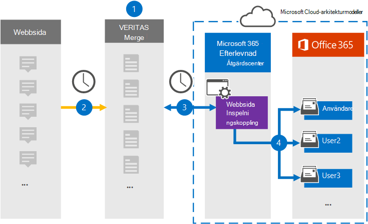

# Konfigurera en koppling för att arkivera webbsidedata

Använd en Veritas-koppling i Microsoft 365 efterlevnadscenter om du vill importera och arkivera data från webbsidor till användarpostlådor i Microsoft 365 organisation. Veritas innehåller en [webbsidesinspelningskoppling](https://globanet.com/webpage-capture) som fångar specifika webbsidor (och eventuella länkar på de sidorna) på en viss webbplats eller i en hel domän. Kopplingen konverterar webbsideinnehållet till ett PDF-, PNG- eller anpassat filformat och bifogar sedan de konverterade filerna till ett e-postmeddelande och importerar sedan dessa e-postobjekt till användarnas postlådor i Microsoft 365.

När webbsideinnehållet lagrats i användarnas postlådor kan du tillämpa efterlevnadsfunktioner i Microsoft 365, till exempel Bevarande av juridiska skäl, eDiscovery, och bevarandeprinciper och bevarandeetiketter. Om du använder en webbsidesinspelningskoppling för att importera och arkivera data i Microsoft 365 kan det hjälpa din organisation att följa myndighets- och regelpolicyer.

## Översikt över arkivering av webbsidedata

Följande översikt förklarar processen med att använda en koppling för att arkivera webbsideinnehåll i Microsoft 365.

1. Din organisation arbetar med webbsideskällan för att konfigurera och konfigurera en webbplats för webbsidesinspelning.

2. En gång per dygn kopieras objekt från webbsidekällorna till webbplatsen Veritas Merge1. Kopplingen konverterar och bifogar även innehållet på en webbsida i ett e-postmeddelande.

3. Kopplingen För webbsidesinspelning som du skapar i kompatibilitetscentret för Microsoft 365, ansluter till Veritas Merge1-webbplatsen varje dag och överför webbsideobjekten till en säker Azure Storage plats i Microsoft-molnet.

4. Kopplingen importerar de konverterade webbsideobjekten till postlådorna  för specifika användare med hjälp av värdet för egenskapen E-post för den automatiska användarmappningen enligt beskrivningen [i steg 3.](#step-3-map-users-and-complete-the-connector-setup) En undermapp i mappen Inkorgen med namnet **Spara webbsida** skapas i användarpostlådorna och webbsidesobjekten importeras till den mappen. Kopplingen gör detta med hjälp av värdet för egenskapen *E-post.* Varje webbsideobjekt innehåller den här egenskapen, som fylls i med de e-postadresser som anges när du konfigurerar kopplingen för webbsidesinspelning [i steg 2.](#step-2-configure-the-webpage-capture-connector-on-the-veritas-merge1-site)

## Innan du börjar

- Skapa ett Veritas Merge1-konto för Microsoft-kopplingar. Om du vill skapa det här kontot [kontaktar du Veritas kundsupport.](https://www.veritas.com/content/support/) Du loggar in på det här kontot när du skapar kopplingen i steg 1.

- Du måste arbeta med Veritas-stöd för att konfigurera ett anpassat filformat för att konvertera webbsideobjekten till. Mer information finns i [Användarhandbok för koppling](https://docs.ms.merge1.globanetportal.com/Merge1%20Third-Party%20Connectors%20Web%20Page%20Capture%20User%20Guide%20.pdf)av kopplingar från tredje part .

- Den användare som skapar webbsidesinspelningskopplingen i steg 1 (och slutför den i steg 3) måste tilldelas rollen Importera och exportera postlåda i Exchange Online. Den här rollen krävs för att lägga till kopplingar **på sidan Datakopplingar** i Microsoft 365 kompatibilitetscenter. Som standard är den här rollen inte tilldelad en rollgrupp i Exchange Online. Du kan lägga till rollen Importera och exportera postlåda i rollgruppen Organisationshantering i Exchange Online. Du kan också skapa en rollgrupp, tilldela rollen Importera och exportera postlåda och sedan lägga till lämpliga användare som medlemmar. Mer information finns i avsnitten [Skapa rollgrupper](/Exchange/permissions-exo/role-groups#create-role-groups) och [Ändra rollgrupper](/Exchange/permissions-exo/role-groups#modify-role-groups) i artikeln "Hantera rollgrupper i Exchange Online".

## Steg 1: Konfigurera webbsidesinspelningskopplingen

Det första steget är att få åtkomst till **datakopplingar** och skapa en koppling för källdata för webbsida.

1. Gå till [https://compliance.microsoft.com](https://compliance.microsoft.com/) och klicka sedan på **Datakopplingar**  >  **Webbsidesinspelning**.

2. På sidan **Beskrivning av webbsidan** klickar du på Lägg till **koppling**.

3. Klicka på **Acceptera på** sidan **Användningsvillkor.**

4. Ange ett unikt namn som identifierar kopplingen och klicka sedan på **Nästa.**

5. Logga in på ditt Merge1-konto för att konfigurera kopplingen.

## Steg 2: Konfigurera kopplingen För webbsidesinspelning på Webbplatsen Veritas Merge1

Det andra steget är att konfigurera kopplingen Webbsideinspelning på Veritas Merge1-webbplatsen. Mer information om hur du konfigurerar webbsidesinspelningskopplingen finns i [Användarhandbok för sammanfogningar från tredje part.](https://docs.ms.merge1.globanetportal.com/Merge1%20Third-Party%20Connectors%20Web%20Page%20Capture%20User%20Guide%20.pdf)

När du har **klickat &**  på Spara eller & visas sidan Användarmappning i kopplingsguiden i Microsoft 365 kompatibilitetscenter.

## Steg 3: Mappa användare och slutför kopplingskonfigurationen

Om du vill mappa användare och slutföra anslutningskonfigurationen i Microsoft 365 efterlevnadscenter följer du stegen nedan:

1. Aktivera automatisk **användarmappning på webbsidan Karta Microsoft 365 användarnas** sidor. Objekten i webbsidesinspelningen *innehåller en* egenskap som kallas E-post, som innehåller e-postadresser för användare i organisationen. Om kopplingen kan associera den här adressen Microsoft 365 en användare importeras objekten till den användarens postlåda.

2. Klicka **på** Nästa , granska dina inställningar och gå till sidan **Datakopplingar** för att se förloppet för importen för den nya anslutningen.

## Steg 4: Övervaka webbsidesinspelningskopplingen

När du har skapat webbsidesinspelningskopplingen kan du visa anslutningsstatusen Microsoft 365 kompatibilitetscentret.

1. Gå till [https://compliance.microsoft.com](https://compliance.microsoft.com) och klicka på **Datakopplingar** i det vänstra navigeringsfältet.

2. Klicka på **fliken Kopplingar och** välj sedan webbsidesinspelningskopplingen för att visa den utfällade sidan.  Den här sidan innehåller egenskaper och information om kopplingen.

3. Under **Anslutningsstatus med källa** klickar du på länken Ladda ned **logg** för att öppna (eller spara) statusloggen för kopplingen. Den här loggen innehåller data som har importerats till Microsoft-molnet.

## Kända problem

- För stunden går det inte att importera bifogade filer eller objekt som är större än 10 MB. Stöd för större objekt blir tillgängligt vid ett senare tillfälle.