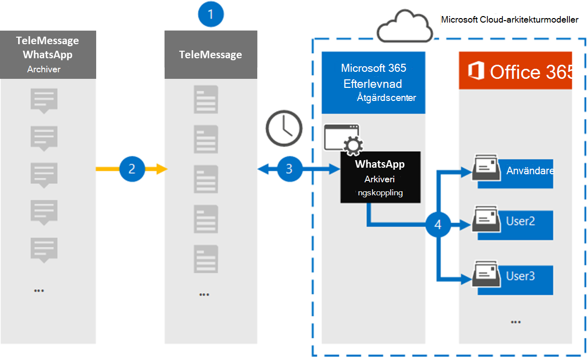

# Konfigurera en koppling för att arkivera WhatsApp-dataSet up a connector to archive WhatsApp data

Använd TeleMessage-kopplingen i Microsoft 365 Efterlevnadscenter importera och arkivera WhatsApp-samtal, chattar, bifogade filer och borttagna meddelanden.Use the TeleMessage connector in the Microsoft 365 compliance center to import and archive WhatsApp calls, chats, attachments, files, and deleted messages. När du har konfigurerat och konfigurerat en anslutning ansluts den till din organisations TeleMessage-konto en gång om dagen och importerar mobilkommunikationen för anställda med hjälp av TeleMessage WhatsApp Telefon Archiver eller TeleMessage WhatsApp Cloud Archiver till postlådor i Microsoft 365.After you set up and configure a connector, it connects to your organization's TeleMessage account once every day, and imports the mobile communication of employees using the TeleMessage WhatsApp Phone Archiver or TeleMessage WhatsApp Cloud Archiver to mailboxes in Microsoft 365.

När WhatsApp-data lagras i användarnas postlådor kan du använda efterlevnadsfunktioner i Microsoft 365, till exempel Bevarande av juridiska skäl, Innehållssökning och Microsoft 365 bevarandeprinciper för WhatsApp-data.After WhatsApp data is stored in user mailboxes, you can apply Microsoft 365 compliance features such as Litigation Hold, Content search, and Microsoft 365 retention policies to WhatsApp data. Du kan till exempel söka i WhatsApp-meddelanden med hjälp av innehållssökning eller associera postlådan som innehåller WhatsApp meddelanden med en vårdnadshavare i ett Advanced eDiscovery ärende.For example, you can search WhatsApp messages using Content search or associate the mailbox that contains WhatsApp messages with a custodian in an Advanced eDiscovery case. Om du använder en WhatsApp-koppling för att importera och arkivera data i Microsoft 365 kan hjälpa din organisation att följa myndighets- och regelpolicyer.Using a WhatsApp connector to import and archive data in Microsoft 365 can help your organization stay compliant with government and regulatory policies.

## Översikt över arkivering av whatsapp-dataOverview of archiving WhatsApp data

I följande översikt beskrivs hur du använder en koppling för att arkivera WhatsApp-data i Microsoft 365.The following overview explains the process of using a connector to archive WhatsApp data in Microsoft 365.

1. Din organisation arbetar med TeleMessage för att konfigurera en WhatsApp Archiver-koppling.Your organization works with TeleMessage to set up a WhatsApp Archiver connector. Mer information finns i [WhatsApp Archiver](https://www.telemessage.com/office365-activation-for-whatsapp-archiver).For more information, see [WhatsApp Archiver](https://www.telemessage.com/office365-activation-for-whatsapp-archiver).

2. I realtid kopieras organisationens WhatsApp-data till TeleMessage-webbplatsen.In real time, your organization's WhatsApp data is copied to the TeleMessage site.

3. Kopplingen WhatsApp som du skapar i Microsoft 365 Efterlevnadscenter ansluter till TeleMessage-webbplatsen varje dag och överför WhatsApp-data från de senaste 24 timmarna till en säker Azure Storage plats i Microsoft-molnet.The WhatsApp connector that you create in the Microsoft 365 compliance center connects to the TeleMessage site every day and transfers WhatsApp data from the previous 24 hours to a secure Azure Storage location in the Microsoft cloud. Kopplingen konverterar även innehållet WhatsApp-data till ett e-postmeddelandeformat.The connector also converts the content WhatsApp data to an email message format.

4. Kopplingen importerar WhatsApp-data till en viss användares postlåda.The connector imports WhatsApp data to the mailbox of a specific user. En ny mapp med **namnet WhatsApp Archiver** skapas i den specifika användarens postlåda och objekten importeras till den.A new folder named **WhatsApp Archiver** is created in the specific user's mailbox and the items are imported to it. Kopplingen gör den här mappningen med hjälp av värdet för *användarens e-postadressegenskap.*The connector does this mapping by using the value of the *User’s Email address* property. Alla WhatsApp-meddelanden innehåller den här egenskapen, som fylls i med e-postadressen för alla deltagare i meddelandet.Every WhatsApp message contains this property, which is populated with the email address of every participant of the message.

   Förutom automatisk användarmappning med värdet  för användarens e-postadressegenskap kan du även implementera anpassad mappning genom att ladda upp en CSV-mappningsfil.In addition to automatic user mapping using the value of the *User’s Email address* property, you can also implement custom mapping by uploading a CSV mapping file. Den här mappningsfilen innehåller mobiltelefonnumret och den Microsoft 365 e-postadressen för användare i organisationen.This mapping file contains the mobile phone number and corresponding Microsoft 365 email address for users in your organization. Om du aktiverar både automatisk användarmappning och anpassad mappning tittar kopplingen först på anpassad mappningsfil för varje WhatsApp-objekt.If you enable both automatic user mapping and custom mapping, for every WhatsApp item the connector first looks at custom mapping file. Om kontakten inte hittar en giltig Microsoft 365-användare som motsvarar en användares mobiltelefonnummer används värdena i e-postadressegenskapen för objektet som ska importeras.If it doesn't find a valid Microsoft 365 user that corresponds to a user's mobile phone number, the connector will use the values in the email address property of the item it's trying to import. Om kopplingen inte hittar en giltig Microsoft 365 i den anpassade mappningsfilen eller i e-postadressegenskapen för WhatsApp-objektet importeras inte objektet.If the connector doesn't find a valid Microsoft 365 user in either the custom mapping file or in the email address property of the WhatsApp item, the item won't be imported.

## Innan du skapa en kopplingBefore you set up a connector

Några av de implementeringssteg som krävs för att arkivera WhatsApp-kommunikationsdata är externa för Microsoft 365 och måste slutföras innan du kan skapa anslutningen i efterlevnadscentret.Some of the implementation steps required to archive WhatsApp communication data are external to Microsoft 365 and must be completed before you can create the connector in the compliance center.

- Beställ [WhatsApp Archiver-tjänsten från TeleMessage](https://www.telemessage.com/mobile-archiver/order-mobile-archiver-for-o365) och få ett giltigt administrationskonto för din organisation.Order the [WhatsApp Archiver service from TeleMessage](https://www.telemessage.com/mobile-archiver/order-mobile-archiver-for-o365) and get a valid administration account for your organization. Du måste logga in på det här kontot när du skapar anslutningen i efterlevnadscentret.You'll need to sign into this account when you create the connector in the compliance center.

- Registrera alla användare som kräver WhatsApp-arkivering i TeleMessage-kontot.Register all users that require WhatsApp archiving in the TeleMessage account. Se till att använda samma e-postadress som används för användarens konto när du registrerar Microsoft 365 användare.When registering users, be sure to use the same email address that's used for their Microsoft 365 account.

- Installera appen TeleMessage [WhatsApp Telefon Archiver](https://www.telemessage.com/mobile-archiver/whatsapp-phone-archiver-2/) på dina anställdas mobiltelefoner och aktivera den.Install the TeleMessage [WhatsApp Phone Archiver app](https://www.telemessage.com/mobile-archiver/whatsapp-phone-archiver-2/) on the mobile phones of your employees and activate it. Du kan också installera de vanliga WhatsApp- eller WhatsApp Business-apparna på de anställdas mobiltelefoner och aktivera WhatsApp Cloud Archiver-tjänsten genom att skanna en QR-kod på TeleMessage-webbplatsen.Alternatively, you can install the regular WhatsApp or WhatsApp Business apps on the mobile phones of your employees and activate the WhatsApp Cloud Archiver service by scanning a QR code on the TeleMessage website. Mer information finns i [WhatsApp Cloud Archiver](https://www.telemessage.com/mobile-archiver/whatsapp-archiver/whatsapp-cloud-archiver/).For more information, see [WhatsApp Cloud Archiver](https://www.telemessage.com/mobile-archiver/whatsapp-archiver/whatsapp-cloud-archiver/).

- Den användare som skapar en Verizon Network-koppling måste tilldelas rollen Importera och exportera postlåda i Exchange Online.The user who creates a Verizon Network connector must be assigned the Mailbox Import Export role in Exchange Online. Detta krävs för att lägga till kopplingar på **sidan Datakopplingar** i Microsoft 365 Efterlevnadscenter.This is required to add connectors in the **Data connectors** page in the Microsoft 365 compliance center. Som standard är den här rollen inte tilldelad någon rollgrupp i Exchange Online.By default, this role isn't assigned to any role group in Exchange Online. Du kan lägga till rollen Importera och exportera postlåda i rollgruppen Organisationshantering i Exchange Online.You can add the Mailbox Import Export role to the Organization Management role group in Exchange Online. Du kan också skapa en rollgrupp, tilldela rollen Importera och exportera postlåda och sedan lägga till lämpliga användare som medlemmar.Or you can create a role group, assign the Mailbox Import Export role, and then add the appropriate users as members. Mer information finns i avsnitten [Skapa rollgrupper](/Exchange/permissions-exo/role-groups#create-role-groups) och [Ändra rollgrupper](/Exchange/permissions-exo/role-groups#modify-role-groups) i artikeln "Hantera rollgrupper i Exchange Online".For more information, see the [Create role groups](/Exchange/permissions-exo/role-groups#create-role-groups) or [Modify role groups](/Exchange/permissions-exo/role-groups#modify-role-groups) sections in the article "Manage role groups in Exchange Online".

- Den här datakopplingen är tillgänglig GCC miljöer i Microsoft 365 för myndigheter i USA.This data connector is available in GCC environments in the Microsoft 365 US Government cloud. Program och tjänster från tredje part kan innebära att lagra, överföra och bearbeta din organisations kunddata i tredje parts system som ligger utanför Microsoft 365-infrastrukturen och därför inte omfattas av Microsoft 365-åtaganden gällande efterlevnad och dataskydd.Third-party applications and services might involve storing, transmitting, and processing your organization's customer data on third-party systems that are outside of the Microsoft 365 infrastructure and therefore are not covered by the Microsoft 365 compliance and data protection commitments. Microsoft anger inte att användningen av den här produkten för att ansluta till program från tredje part innebär att sådana program från tredje part är FEDRAMP-kompatibla.Microsoft makes no representation that use of this product to connect to third-party applications implies that those third-party applications are FEDRAMP compliant.

## Skapa en WhatsApp-arkiveringskopplingCreate a WhatsApp Archiver connector

När du har slutfört de krav som beskrivs i föregående avsnitt kan du skapa WhatsApp-kopplingen i Microsoft 365 Efterlevnadscenter.After you've completed the prerequisites described in the previous section, you can create the WhatsApp connector in the Microsoft 365 compliance center. Kopplingen använder den information du anger för att ansluta till TeleMessage-webbplatsen och överföra WhatsApp-data till motsvarande rutor för användarpostlådor i Microsoft 365.The connector uses the information you provide to connect to the TeleMessage site and transfer the WhatsApp data to the corresponding user mailbox boxes in Microsoft 365.

1. Gå till [https://compliance.microsoft.com](https://compliance.microsoft.com/) och klicka sedan på **Datakopplingar**  >  **WhatsApp Archiver**.Go to [https://compliance.microsoft.com](https://compliance.microsoft.com/) and then click **Data connectors** > **WhatsApp Archiver**.

2. På **produktbeskrivningssidan för WhatsApp Archiver** klickar du på **Lägg till koppling**On the **WhatsApp Archiver** product description page, click **Add connector**

3. Klicka på **Acceptera på** sidan **Användningsvillkor.**On the **Terms of service** page, click **Accept**.

4. På sidan **Logga in på TeleMessage,** under Steg 3, anger du den information som krävs i följande rutor och klickar sedan på **Nästa.**On the **Login to TeleMessage** page, under Step 3, enter the required information in the following boxes and then click **Next**.

   - **Användarnamn:** Ditt TeleMessage-användarnamn.**Username:** Your TeleMessage username.

   - **Lösenord:** Ditt TeleMessage-lösenord.**Password:** Your TeleMessage password.

5. När kopplingen har skapats kan du stänga popup-fönstret och gå till nästa sida.After the connector is created, you can close the pop-up window and go to the next page.

6. På sidan **Användarmappning** aktiverar du automatisk användarmappning och klickar på **Nästa.**On the **User mapping** page, enable automatic user mapping and click **Next**. Om du behöver anpassad mappning laddar du upp en CSV-fil och klickar på **Nästa**.In case you need custom mapping upload a CSV file, and click **Next**.

7. Granska inställningarna och klicka sedan på **Slutför för** att skapa kopplingen.Review your settings, and then click **Finish** to create the connector.

8. Gå till fliken Kopplingar på sidan **Datakopplingar** för att se importprocessen för den nya kopplingen.Go to the Connectors tab in **Data connectors** page to see the progress of the import process for the new connector.

## Kända problemKnown issues

- För stunden går det inte att importera bifogade filer eller objekt som är större än 10 MB.At this time, we don't support importing attachments or items that are larger than 10 MB. Stöd för större objekt blir tillgängligt vid ett senare tillfälle.Support for larger items will be available at a later date.
