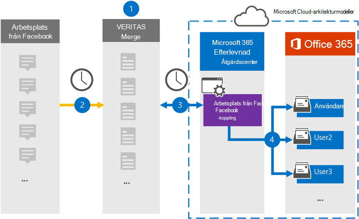

# Konfigurera en koppling för att arkivera Workplace från Facebook-data

Använd en Veritas-koppling i Microsoft 365 efterlevnadscenter om du vill importera och arkivera data från Workplace från Facebook till användarpostlådor i Microsoft 365 organisation. Veritas tillhandahåller en arbetsplats från [Facebook-anslutning](https://globanet.com/workplace/) som är konfigurerad att samla objekt från tredje parts datakälla (regelbundet) och importera de objekten till Microsoft 365. Kopplingen omvandlar innehåll som chattar, bifogade filer, inlägg och videor från Workplace till ett e-postmeddelandeformat och importerar sedan dessa objekt till användarnas postlådor i Microsoft 365.

När workplace-data har lagrats i användarnas postlådor kan du använda Microsoft 365 efterlevnadsfunktioner, till exempel bevarande av juridiska skäl, eDiscovery, bevarandeprinciper och bevarandeetiketter samt kommunikationsefterlevnad. Att använda Workplace från Facebook Connector för att importera och arkivera data i Microsoft 365 kan hjälpa din organisation att följa myndighets- och regelpolicyn.

## Översikt över arkivering av arbetsplats från Facebook-data

Följande översikt förklarar processen med att använda en koppling för att arkivera workplace-data i Microsoft 365.

1. Din organisation arbetar med Workplace från Facebook för att konfigurera en webbplats för arbetsplatsen.

2. En gång per dygn kopieras objekt från Workplace till webbplatsen Veritas Merge1. Kopplingen konverterar också innehållet i de här objekten till ett e-postmeddelandeformat.

3. Den Arbetsplats från Facebook-anslutning som du skapar i efterlevnadscentret för Microsoft 365, ansluter till Veritas Merge1 varje dag och överför Workplace-objekten till en säker Azure Storage plats i Microsoft-molnet.

4. Kopplingen importerar de konverterade objekten till postlådorna  för specifika användare med värdet för egenskapen E-post för den automatiska användarmappningen enligt beskrivningen i steg 3. En undermapp till mappen Inkorgen med namnet **Arbetsplats från Facebook** skapas och workplace-objekten importeras till den mappen. Kopplingen gör detta med hjälp av värdet för egenskapen *E-post.* Alla workplace-objekt innehåller den här egenskapen, som fylls i med e-postadressen för varje chatt- eller postdeltagare.

## Innan du börjar

- Skapa ett Veritas Merge1-konto för Microsoft-kopplingar. Om du vill skapa det här kontot [kontaktar du Veritas kundsupport.](https://globanet.com/ms-connectors-contact) Du loggar in på det här kontot när du skapar kopplingen i steg 1.

- Skapa en anpassad integration för https://my.workplace.com/work/admin/apps/ att hämta data från workplace via API:er för efterlevnads- och eDiscovery-syften.

   När du skapar integreringen genererar Workplace-plattformen en uppsättning unika autentiseringsuppgifter som används för att generera token som används för autentisering. Dessa token används i konfigurationsguiden Arbetsplats från Facebook-anslutning i steg 2. Stegvisa instruktioner om hur du skapar programmen finns i [Användarhandbok för slå samman1 kopplingar från tredje part.](https://docs.ms.merge1.globanetportal.com/Merge1%20Third-Party%20Connectors%20Workplace%20from%20Facebook%20User%20Guide%20.pdf)

- Den användare som skapar workplacen från Facebook-kopplingen i steg 1 (och slutför den i steg 3) måste tilldelas rollen Importera och exportera postlåda i Exchange Online. Den här rollen krävs för att lägga till kopplingar **på sidan Datakopplingar** i Microsoft 365 kompatibilitetscenter. Som standard är den här rollen inte tilldelad en rollgrupp i Exchange Online. Du kan lägga till rollen Importera och exportera postlåda i rollgruppen Organisationshantering i Exchange Online. Du kan också skapa en rollgrupp, tilldela rollen Importera och exportera postlåda och sedan lägga till lämpliga användare som medlemmar. Mer information finns i avsnitten [Skapa rollgrupper](/Exchange/permissions-exo/role-groups#create-role-groups) och [Ändra rollgrupper](/Exchange/permissions-exo/role-groups#modify-role-groups) i artikeln "Hantera rollgrupper i Exchange Online".

## Steg 1: Konfigurera arbetsplatsen från Facebook-anslutning

Det första steget är att få åtkomst till sidan Datakopplingar i Microsoft 365 **kompatibilitetscenter** och skapa en koppling för workplace-data.

1. Gå till [https://compliance.microsoft.com](https://compliance.microsoft.com/) och klicka sedan på **Datakopplingar**  >  **Arbetsplats från Facebook.**

2. På sidan **Arbetsplats från Facebook produktbeskrivning** klickar du på **Lägg till koppling**.

3. Klicka på **Acceptera på** sidan **Användningsvillkor.**

4. Ange ett unikt namn som identifierar kopplingen och klicka sedan på **Nästa.**

5. Logga in på ditt Merge1-konto för att konfigurera kopplingen.

## Steg 2: Konfigurera arbetsplatsen från Facebook-anslutningen på Veritas Merge1-webbplatsen

Det andra steget är att konfigurera workplace från Facebook-anslutning på webbplatsen Merge1. Mer information om hur du konfigurerar arbetsplatsen från Facebook-anslutning finns i [Användarhandbok för sammanfogningar från tredje part.](https://docs.ms.merge1.globanetportal.com/Merge1%20Third-Party%20Connectors%20Workplace%20from%20Facebook%20User%20Guide%20.pdf)

När du har **klickat &**  på Spara eller & visas sidan Användarmappning i kopplingsguiden i Microsoft 365 kompatibilitetscenter.

## Steg 3: Mappa användare och slutför kopplingskonfigurationen

Om du vill mappa användare och slutföra anslutningskonfigurationen i Microsoft 365 efterlevnadscenter gör du så här:

1. På sidan **Mappa externa användare till Microsoft 365 aktiverar** du automatisk användarmappning. Workplace-objekten innehåller egenskapen *E-post* som innehåller e-postadresser för användare i organisationen. Om kopplingen kan associera den här adressen Microsoft 365 en användare importeras objekten till den användarens postlåda.

2. Klicka **på** Nästa, granska dina inställningar och gå sedan till sidan **Datakopplingar** för att se förloppet för importen för den nya anslutningen.

## Steg 4: Övervaka arbetsplatsen från Facebook-anslutning

När du har skapat workplacen från Facebook-anslutningen kan du visa anslutningsstatusen Microsoft 365 efterlevnadscenter.

1. Gå till [https://compliance.microsoft.com](https://compliance.microsoft.com) och klicka på **Datakopplingar** i det vänstra navigeringsfältet.

2. Klicka på **fliken Kopplingar och** välj sedan arbetsplats från **Facebook-anslutning för** att visa den utfällade sidan. Den här sidan innehåller egenskaper och information om kopplingen.

3. Under **Anslutningsstatus med källa** klickar du på länken Ladda ned **logg** för att öppna (eller spara) statusloggen för kopplingen. Den här loggen innehåller information om de data som har importerats till Microsoft-molnet.

## Kända problem

- För stunden går det inte att importera bifogade filer eller objekt som är större än 10 MB. Stöd för större objekt blir tillgängligt vid ett senare tillfälle.