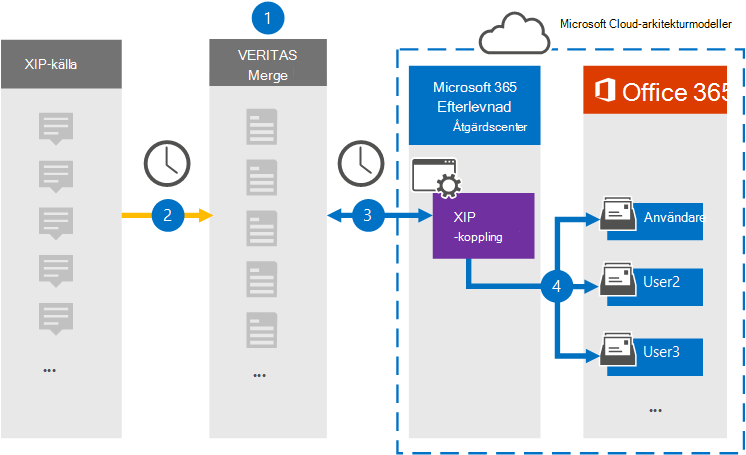

# Konfigurera en koppling för att arkivera XIP-källdata

Använd en Veritas-koppling i Microsoft 365 Efterlevnadscenter om du vill importera och arkivera data från XIP-källplattformen till användarpostlådor i Microsoft 365 organisation. Veritas tillhandahåller en [XIP-koppling](https://globanet.com/xip/) som gör att du kan använda en XIP-fil för att importera objekt till Microsoft 365. En XIP-fil liknar en ZIP-fil, men gör att en digital signatur kan användas. Den digitala signaturen verifieras av Veritas Merge 1 innan XIP-källfilen extraheras. Kopplingen konverterar innehållet från XIP-källfilen till ett e-postmeddelandeformat och importerar sedan objekten till användarpostlådorna i Microsoft 365.

När XIP-källdata har lagrats i användarpostlådor kan du använda efterlevnadsfunktioner i Microsoft 365, till exempel Bevarande av juridiska skäl, eDiscovery, bevarandeprinciper och bevarandeetiketter samt kommunikationsefterlevnad. Om du använder en XIP-anslutning för att importera och arkivera data i Microsoft 365 kan detta hjälpa din organisation att uppfylla regelverken och myndighetsprinciperna.

## Översikt över arkivering av XIP-källdata

I följande översikt beskrivs hur du använder en koppling för att arkivera XIP-källdata i Microsoft 365.

1. Organisationen arbetar med XIP-källan för att konfigurera och konfigurera en XIP-webbplats.

2. En gång per dygn kopieras XIP-källobjekt till Veritas Merge1-webbplatsen. Kopplingen konverterar också innehållet till ett e-postmeddelandeformat.

3. Den XIP-koppling som du skapar i Microsoft 365 Efterlevnadscenter ansluter till Veritas Merge1-webbplatsen varje dag och överför meddelandena till en säker Azure Storage plats i Microsoft-molnet.

4. Anslutaren importerar de konverterade meddelandeobjekten till postlådorna  för specifika användare med värdet för egenskapen E-post för den automatiska användarmappningen enligt beskrivningen [i steg 3.](#step-3-map-users-and-complete-the-connector-setup) En undermapp i mappen Inkorgen med namnet **XIP** skapas i användarnas postlådor och objekten importeras till den mappen. Kopplingen avgör vilken postlåda som objekt ska importeras till med hjälp av värdet för egenskapen *E-post.* Alla källobjekt innehåller den här egenskapen, som fylls i med e-postadresserna för alla deltagare.

## Innan du börjar

- Skapa ett Veritas Merge1-konto för Microsoft-kopplingar. Om du vill skapa ett konto kontaktar [du Veritas kundsupport.](https://www.veritas.com/content/support/) Du måste logga in på det här kontot när du skapar kopplingen i steg 1.

- Den användare som skapar XIP-kopplingen i steg 1 (och slutför den i steg 3) måste tilldelas rollen Importera och exportera postlåda i Exchange Online. Den här rollen krävs för att lägga till kopplingar på sidan Datakopplingar i Microsoft 365 Efterlevnadscenter. Som standard är den här rollen inte tilldelad någon rollgrupp i Exchange Online. Du kan lägga till rollen Importera och exportera postlåda i rollgruppen Organisationshantering i Exchange Online. Du kan också skapa en rollgrupp, tilldela rollen Importera och exportera postlåda och sedan lägga till lämpliga användare som medlemmar. Mer information finns i avsnitten [Skapa rollgrupper](/Exchange/permissions-exo/role-groups#create-role-groups) och [Ändra rollgrupper](/Exchange/permissions-exo/role-groups#modify-role-groups) i artikeln "Hantera rollgrupper i Exchange Online".

## Steg 1: Konfigurera XIP-kopplingen

Det första steget är att få åtkomst till sidan Dataanslutningar i **efterlevnadscentret** för Microsoft365 och skapa en koppling för XIP-källdata.

1. Gå till [https://compliance.microsoft.com](https://compliance.microsoft.com/) och klicka sedan på **Datakopplingar** \> **XIP.**

2. På **produktbeskrivningssidan för XIP** klickar du på **Lägg till ny koppling.**

3. Klicka på **Acceptera på** sidan **Användningsvillkor.**

4. Ange ett unikt namn som identifierar kopplingen och klicka sedan på **Nästa.**

5. Logga in på ditt Merge1-konto för att konfigurera kopplingen.

## Steg 2: Konfigurera XIP-kopplingen på Veritas Merge1-webbplatsen

Det andra steget är att konfigurera XIP-kopplingen på webbplatsen Merge1. Mer information om hur du konfigurerar XIP-anslutningen finns i [Användarhandbok för slå samman1 kopplingar från tredje part.](https://docs.ms.merge1.globanetportal.com/Merge1%20Third-Party%20Connectors%20XIP%20User%20Guide%20.pdf)

När du **klickar & på** Spara  eller slutför visas sidan Användarmappning i kopplingsguiden Microsoft 365 Efterlevnadscenter objekt.

## Steg 3: Mappa användare och slutför kopplingskonfigurationen

Om du vill mappa användare och slutföra anslutningskonfigurationen gör du så här:

1. Aktivera automatisk **användarmappning på sidan Mappa XIP Microsoft 365 användare** till användare. Källobjekten i XIP innehåller en egenskap *som kallas E-post,* som innehåller e-postadresser för användare i organisationen. Om kopplingen kan associera den här adressen Microsoft 365 en användare importeras objekten till den användarens postlåda.

2. Klicka **på** Nästa , granska dina inställningar och gå till sidan **Datakopplingar** för att se förloppet för importen för den nya anslutningen.

## Steg 4: Övervaka XIP-kopplingen

När du har skapat XIP-kopplingen kan du visa status för anslutningen i Microsoft 365 Efterlevnadscenter.

1. Gå till [https://compliance.microsoft.com](https://compliance.microsoft.com/) och klicka på **Datakopplingar** i det vänstra navigeringsfältet.

2. Klicka på **fliken Kopplingar** och välj sedan **XIP-kopplingen** för att visa den utfällade sidan, som innehåller egenskaper och information om kopplingen.

3. Under **Anslutningsstatus med källa** klickar du på länken Ladda ned **logg** för att öppna (eller spara) statusloggen för kopplingen. Den här loggen innehåller data som har importerats till Microsoft-molnet.

## Kända problem

- För stunden går det inte att importera bifogade filer eller objekt som är större än 10 MB. Stöd för större objekt blir tillgängligt vid ett senare tillfälle.