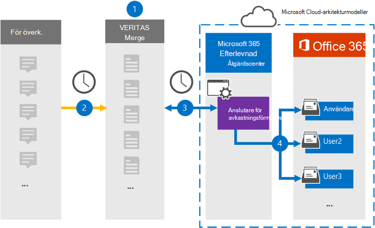

# Konfigurera en koppling för att arkivera yieldbrokerdataSet up a connector to archive Yieldbroker data

Använd en Veritas-koppling i Microsoft 365 efterlevnadscenter om du vill importera och arkivera data från Yieldbroker till användarpostlådor i Microsoft 365 organisation.Use a Veritas connector in the Microsoft 365 compliance center to import and archive data from the Yieldbroker to user mailboxes in your Microsoft 365 organization. Veritas ger dig en [Yieldbroker-koppling](https://globanet.com/yieldbroker/) som är konfigurerad för att hämta objekt från datakällan från tredje part och importera de objekten till Microsoft 365.Veritas provides you with a [Yieldbroker](https://globanet.com/yieldbroker/) connector that's configured to capture items from the third-party data source and import those items to Microsoft 365. Kopplingen konverterar innehållet från Yieldbroker till ett e-postmeddelandeformat och importerar sedan dessa objekt till användarens postlåda i Microsoft 365.The connector converts the content from Yieldbroker to an email message format and then imports those items to the user’s mailbox in Microsoft 365.

När Yieldbroker har lagrats i användarpostlådor kan du använda efterlevnadsfunktioner för Microsoft 365, till exempel Bevarande av juridiska skäl, eDiscovery, bevarandeprinciper och bevarandeetiketter.After Yieldbroker is stored in user mailboxes, you can apply Microsoft 365 compliance features such as Litigation Hold, eDiscovery, retention policies, and retention labels. Om du använder en Yieldbroker-koppling för att importera och arkivera data i Microsoft 365 kan det hjälpa din organisation att följa myndighets- och regelpolicyer.Using a Yieldbroker connector to import and archive data in Microsoft 365 can help your organization stay compliant with government and regulatory policies.

## Översikt över arkivering av yieldbrokerdataOverview of archiving Yieldbroker data

Följande översikt förklarar processen med att använda en koppling för att arkivera yieldbrokerdata i Microsoft 365.The following overview explains the process of using a connector to archive the Yieldbroker data in Microsoft 365.

1. Din organisation arbetar med Yieldbroker för att konfigurera en Yieldbroker-webbplats.Your organization works with the Yieldbroker to set up and configure a Yieldbroker site.

2. En gång per dygn kopieras Yieldbroker-objekt till webbplatsen Veritas Merge1.Once every 24 hours, Yieldbroker items are copied to the Veritas Merge1 site. Kopplingen konverterar också innehållet till ett e-postmeddelandeformat.The connector also converts the content to an email message format.

3. Den Yieldbroker-koppling som du skapar i kompatibilitetscentret för Microsoft 365, ansluter till Veritas Merge1-webbplatsen varje dag och överför meddelandena till en säker Azure Storage plats i Microsoft-molnet.The Yieldbroker connector that you create in the Microsoft 365 compliance center, connects to the Veritas Merge1 site every day and transfers the messages to a secure Azure Storage location in the Microsoft cloud.

4. Kopplingen importerar de konverterade yieldbrokerobjekten till postlådorna  för specifika användare med värdet för e-postegenskapen för den automatiska användarmappningen enligt beskrivningen [i steg 3.](#step-3-map-users-and-complete-the-connector-setup)The connector imports the converted Yieldbroker items to the mailboxes of specific users using the value of the *Email* property of the automatic user mapping as described in [Step 3](#step-3-map-users-and-complete-the-connector-setup). En undermapp i mappen Inkorgen med namnet **Yieldbroker** skapas i användarpostlådorna och objekten importeras till den mappen.A subfolder in the Inbox folder named **Yieldbroker** is created in the user mailboxes, and the items are imported to that folder. Kopplingen avgör vilken postlåda som objekt ska importeras till med hjälp av värdet för egenskapen *E-post.*The connector determines which mailbox to import items to by using the value of the *Email* property. Varje yieldbroker innehåller den här egenskapen, som fylls i med e-postadressen för alla deltagare i objektet.Every Yieldbroker contains this property, which is populated with the email address of every participant of the item.

## Innan du börjarBefore you begin

- Skapa ett Veritas Merge1-konto för Microsoft-kopplingar.Create a Veritas Merge1 account for Microsoft connectors. Om du vill skapa ett konto kontaktar [du Veritas kundsupport.](https://www.veritas.com/content/support/)To create an account, contact [Veritas Customer Support](https://www.veritas.com/content/support/). Du måste logga in på det här kontot när du skapar kopplingen i steg 1.You need to sign into this account when you create the connector in Step 1.

- Den användare som skapar yieldbroker-kopplingen i steg 1 (och slutför den i steg 3) måste tilldelas rollen Importera och exportera postlåda i Exchange Online.The user who creates the Yieldbroker connector in Step 1 (and completes it in Step 3) must be assigned to the Mailbox Import Export role in Exchange Online. Den här rollen krävs för att lägga till kopplingar på sidan Datakopplingar i Microsoft 365 kompatibilitetscenter.This role is required to add connectors on the Data connectors page in the Microsoft 365 compliance center. Som standard är den här rollen inte tilldelad någon rollgrupp i Exchange Online.By default, this role is not assigned to any role group in Exchange Online. Du kan lägga till rollen Importera och exportera postlåda i rollgruppen Organisationshantering i Exchange Online.You can add the Mailbox Import Export role to the Organization Management role group in Exchange Online. Du kan också skapa en rollgrupp, tilldela rollen Importera och exportera postlåda och sedan lägga till lämpliga användare som medlemmar.Or you can create a role group, assign the Mailbox Import Export role, and then add the appropriate users as members. Mer information finns i avsnitten [Skapa rollgrupper](/Exchange/permissions-exo/role-groups#create-role-groups) och [Ändra rollgrupper](/Exchange/permissions-exo/role-groups#modify-role-groups) i artikeln "Hantera rollgrupper i Exchange Online".For more information, see the [Create role groups](/Exchange/permissions-exo/role-groups#create-role-groups) or [Modify role groups](/Exchange/permissions-exo/role-groups#modify-role-groups) sections in the article "Manage role groups in Exchange Online".

## Steg 1: Konfigurera Yieldbroker-kopplingenStep 1: Set up the Yieldbroker connector

Det första steget är att komma åt sidan Datakopplingar i Microsoft 365 **kompatibilitetscenter** och skapa en koppling för Yieldbroker.The first step is to access to the **Data Connectors** page in the Microsoft 365 compliance center and create a connector for the Yieldbroker.

1. Gå till [https://compliance.microsoft.com](https://compliance.microsoft.com/) och klicka sedan på **Datakopplingar** &gt; **Yieldbroker**.Go to [https://compliance.microsoft.com](https://compliance.microsoft.com/) and then click **Data connectors** &gt; **Yieldbroker**.

2. På sidan **för produktbeskrivning av Yieldbroker** klickar du på **Lägg till ny koppling**.On the **Yieldbroker** product description page, click **Add new connector**.

3. Klicka på **Acceptera på** sidan **Användningsvillkor.**On the **Terms of service** page, click **Accept**.

4. Ange ett unikt namn som identifierar kopplingen och klicka sedan på **Nästa.**Enter a unique name that identifies the connector, and then click **Next**.

5. Logga in på ditt Merge1-konto för att konfigurera kopplingen.Sign in to your Merge1 account to configure the connector.

## Steg 2: Konfigurera kopplingen Yieldbroker på Webbplatsen Veritas Merge1Step 2: Configure the Yieldbroker connector on the Veritas Merge1 site

Det andra steget är att konfigurera Yieldbroker-kopplingen på webbplatsen Merge1.The second step is to configure the Yieldbroker connector on the Merge1 site. Mer information om hur du konfigurerar yieldbrokern finns i [Användarhandboken Slå samman1 tredjepartskopplingar.](https://docs.ms.merge1.globanetportal.com/Merge1%20Third-Party%20Connectors%20Yieldbroker%20User%20Guide%20.pdf)For information about how to configure the Yieldbroker, see [Merge1 Third-Party Connectors User Guide](https://docs.ms.merge1.globanetportal.com/Merge1%20Third-Party%20Connectors%20Yieldbroker%20User%20Guide%20.pdf).

När du har **klickat &**  på Spara eller & visas sidan Användarmappning i kopplingsguiden i Microsoft 365 kompatibilitetscenter.After you click **Save & Finish**, the **User mapping** page in the connector wizard in the Microsoft 365 compliance center is displayed.

## Steg 3: Mappa användare och slutför kopplingskonfigurationenStep 3: Map users and complete the connector setup

Om du vill mappa användare och slutföra anslutningskonfigurationen gör du så här:To map users and complete the connector setup, follow these steps:

1. Aktivera automatisk **användarmappning Microsoft 365 mappning** på sidan Map Yieldbroker-användare till .On the **Map Yieldbroker users to Microsoft 365 users** page, enable automatic user mapping. Yieldbroker-objekten innehåller en egenskap *som kallas E-post,* som innehåller e-postadresser för användare i organisationen.The Yieldbroker items include a property called *Email*, which contains email addresses for users in your organization. Om kopplingen kan associera den här adressen Microsoft 365 en användare importeras objekten till den användarens postlåda.If the connector can associate this address with a Microsoft 365 user, the items are imported to that user’s mailbox.

2. Klicka **på** Nästa , granska dina inställningar och gå till sidan **Datakopplingar** för att se förloppet för importen för den nya anslutningen.Click **Next**, review your settings, and go to the **Data connectors** page to see the progress of the import process for the new connector.

## Steg 4: Övervaka Yieldbroker-kopplingenStep 4: Monitor the Yieldbroker connector

När du har skapat en Yieldbroker-koppling kan du visa kopplingsstatusen Microsoft 365 kompatibilitetscentret.After you create the Yieldbroker connector, you can view the connector status in the Microsoft 365 compliance center.

1. Gå till [https://compliance.microsoft.com](https://compliance.microsoft.com/) och klicka på **Datakopplingar** i det vänstra navigeringsfältet.Go to [https://compliance.microsoft.com](https://compliance.microsoft.com/) and click **Data connectors** in the left nav.

2. Klicka på **fliken Kopplingar** och välj sedan **yieldbrokerkopplingen** för att visa den utfällade sidan, som innehåller egenskaper och information om kopplingen.Click the **Connectors** tab and then select the **Yieldbroker** connector to display the flyout page, which contains the properties and information about the connector.

3. Under **Anslutningsstatus med källa** klickar du på länken Ladda ned **logg** för att öppna (eller spara) statusloggen för kopplingen.Under **Connector status with source**, click the **Download log** link to open (or save) the status log for the connector. Den här loggen innehåller data som har importerats till Microsoft-molnet.This log contains data that has been imported to the Microsoft cloud.

## Kända problemKnown issues

- För stunden går det inte att importera bifogade filer eller objekt som är större än 10 MB.At this time, we don't support importing attachments or items that are larger than 10 MB. Stöd för större objekt blir tillgängligt vid ett senare tillfälle.Support for larger items will be available at a later date.