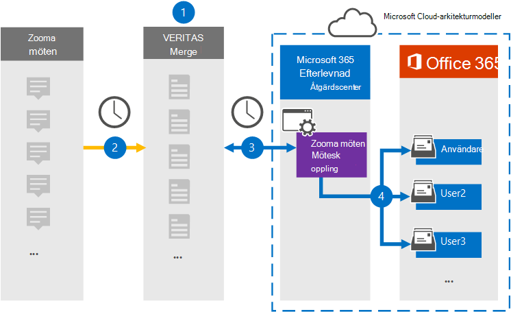

# Konfigurera en koppling för att arkivera data för zoommötenSet up a connector to archive Zoom Meetings data

Använd en Veritas-koppling i Microsoft 365 kompatibilitetscenter om du vill importera och arkivera data från Zoommöten till användarpostlådor i Microsoft 365 organisation.Use a Veritas connector in the Microsoft 365 compliance center to import and archive data from Zoom Meetings to user mailboxes in your Microsoft 365 organization. Veritas har en [zoomningsmöteskoppling](https://globanet.com/zoom/) som är konfigurerad att hämta objekt från tredje parts datakälla (regelbundet) och importera objekten till Microsoft 365.Veritas provides a [Zoom Meetings](https://globanet.com/zoom/) connector that is configured to capture items from the third-party data source (on a regular basis) and import those items to Microsoft 365. Kopplingen omvandlar innehållet i möten (inklusive chattar, inspelade filer och metadata) från zoomningsmöten till ett e-postmeddelandeformat och importerar sedan objekten till användarnas postlådor i Microsoft 365.The connector converts the content of the meetings (including chats, recorded files, and metadata) from the Zoom Meetings account to an email message format and then imports those items to user mailboxes in Microsoft 365.

När du har lagrat zoommöten i användarpostlådor kan du använda efterlevnadsfunktioner i Microsoft 365, till exempel Bevarande av juridiska skäl, eDiscovery, bevarandeprinciper och bevarandeetiketter samt kommunikationsefterlevnad.After Zoom Meetings data is stored in user mailboxes, you can apply Microsoft 365 compliance features such as Litigation Hold, eDiscovery, retention policies and retention labels, and communication compliance. Om du använder en anslutning för zoommöten för att importera och arkivera data i Microsoft 365 kan hjälpa din organisation att följa myndighets- och regelpolicyer.Using a Zoom Meetings connector to import and archive data in Microsoft 365 can help your organization stay compliant with government and regulatory policies.

## Översikt över arkivering av zoommötenOverview of archiving Zoom Meetings data

I följande översikt beskrivs hur du använder en koppling för att arkivera data för zoommöten i Microsoft 365.The following overview explains the process of using a connector to archive Zoom Meetings data in Microsoft 365.

1. Din organisation arbetar med zoommöten för att konfigurera och konfigurera en webbplats för zoommöten.Your organization works with Zoom Meetings to set up and configure a Zoom Meetings site.

2. En gång per dygn kopieras mötesobjekt från zoommöten till Webbplatsen Veritas Merge1.Once every 24 hours, meeting items from Zoom Meetings are copied to the Veritas Merge1 site. Kopplingen omvandlar även innehållet i möten till ett e-postmeddelandeformat.The connector also converts the content of the meetings to an email message format.

3. Kopplingen Zooma möten som du skapar i kompatibilitetscentret för Microsoft 365, ansluter till Veritas Merge1 varje dag och överför mötesmeddelanden till en säker Azure Storage plats i Microsoft-molnet.The Zoom Meetings connector that you create in the Microsoft 365 compliance center, connects to the Veritas Merge1 every day, and transfers the meeting messages to a secure Azure Storage location in the Microsoft cloud.

4. Anslutaren importerar de konverterade mötesobjekten till postlådorna  för specifika användare med värdet för e-postegenskapen och automatisk användarmappning, enligt beskrivningen i steg 3.The connector imports the converted meeting items to the mailboxes of specific users using the value of the *Email* property and automatic user mapping, as described in Step 3. En ny undermapp i mappen Inkorgen med namnet **Zoommöten** skapas i användarpostlådor och mötesobjekten importeras till den mappen.A new subfolder in the Inbox folder named **Zoom Meetings** is created in user mailboxes, and the meeting items are imported to that folder. Kopplingen gör detta med hjälp av värdet för egenskapen *E-post.*The connector does this by using the value of the *Email* property. Alla mötesobjekt innehåller den här egenskapen, som fylls i med e-postadressen för alla mötesdeltagare.Every meeting item contains this property, which is populated with the email address of every participant of the meeting.

## Innan du börjarBefore you begin

- Skapa ett Veritas Merge1-konto för Microsoft-kopplingar.Create a Veritas Merge1 account for Microsoft connectors. Om du vill skapa det här kontot [kontaktar du Veritas kundsupport.](https://globanet.com/ms-connectors-contact)To create this account, contact [Veritas Customer Support](https://globanet.com/ms-connectors-contact). Du loggar in på det här kontot när du skapar kopplingen i steg 1.You will sign into this account when you create the connector in Step 1.

- Få användarnamn och lösenord för organisationens Zoom Business- eller Zoom Enterprise-konto.Obtain the username and password for your organization's Zoom Business or Zoom Enterprise account. Du måste logga in på det här kontot i steg 2 när du konfigurerar zoommöten.You'll need to sign into this account in Step 2 when you configure the Zoom Meetings connector.

- Skapa följande program på [Zoom Marketplace:](https://marketplace.zoom.us)Create the following applications in the [Zoom Marketplace](https://marketplace.zoom.us):

  - OAuth-programmetOAuth application

  - JWT-programJWT application

  När du har skapat dessa program genererar Zoom-plattformen en uppsättning unika autentiseringsuppgifter som används för att generera token.After you create these applications, the Zoom platform generates a set of unique credentials used to generate the tokens. Dessa token används för att autentisera kopplingen när den ansluter till ditt Zoom-konto och kopierar objekt till Merge1-webbplatsen.These tokens are used to authenticate the connector when it connects to your Zoom account and copies items to the Merge1 site. Du använder dessa token när du konfigurerar zoomkopplingen i steg 2.You will use these tokens when you configure the Zoom connector in Step 2.

  Stegvisa instruktioner för hur du skapar OAuth- och JWT-programmen finns i Användarhandbok för Slå [samman1 tredjepartskopplingar.](https://docs.ms.merge1.globanetportal.com/Merge1%20Third-Party%20Connectors%20Zoom%20Meetings%20User%20Guide%20.pdf)For step-by step instructions on how to create the OAuth and JWT applications, see [Merge1 Third-Party Connectors User Guide](https://docs.ms.merge1.globanetportal.com/Merge1%20Third-Party%20Connectors%20Zoom%20Meetings%20User%20Guide%20.pdf).

- Den användare som skapar zoomningsmöten-kopplingen i steg 1 (och slutför den i steg 3) måste tilldelas rollen Importera och exportera postlåda i Exchange Online.The user who creates the Zoom Meetings connector in Step 1 (and completes it in Step 3) must be assigned to the Mailbox Import Export role in Exchange Online. Den här rollen krävs för att lägga till kopplingar **på sidan Datakopplingar** i Microsoft 365 kompatibilitetscenter.This role is required to add connectors on the **Data connectors** page in the Microsoft 365 compliance center. Som standard är den här rollen inte tilldelad en rollgrupp i Exchange Online.By default, this role is not assigned to a role group in Exchange Online. Du kan lägga till rollen Importera och exportera postlåda i rollgruppen Organisationshantering i Exchange Online.You can add the Mailbox Import Export role to the Organization Management role group in Exchange Online. Du kan också skapa en rollgrupp, tilldela rollen Importera och exportera postlåda och sedan lägga till lämpliga användare som medlemmar.Or you can create a role group, assign the Mailbox Import Export role, and then add the appropriate users as members. Mer information finns i avsnitten [Skapa rollgrupper](/Exchange/permissions-exo/role-groups#create-role-groups) och [Ändra rollgrupper](/Exchange/permissions-exo/role-groups#modify-role-groups) i artikeln "Hantera rollgrupper i Exchange Online".For more information, see the [Create role groups](/Exchange/permissions-exo/role-groups#create-role-groups) or [Modify role groups](/Exchange/permissions-exo/role-groups#modify-role-groups) sections in the article "Manage role groups in Exchange Online".

## Steg 1: Konfigurera zoomningskontaktenStep 1: Set up the Zoom Meetings connector

Det första steget är att få tillgång **till datakopplingarna** i Microsoft 365 och skapa en zoomningsmöteskoppling.The first step is to access the **Data Connectors** in the Microsoft 365 compliance center and create a Zoom Meetings connector.

1. Gå till [https://compliance.microsoft.com](https://compliance.microsoft.com/) och klicka sedan på **Datakopplingar**  >  **Zooma möten.**Go to [https://compliance.microsoft.com](https://compliance.microsoft.com/) and then click **Data connectors** > **Zoom Meetings**.

2. På **produktbeskrivningssidan Zooma möten** klickar du på **Lägg till koppling**.On the **Zoom Meetings** product description page, click **Add connector**.

3. Klicka på **Acceptera på** sidan **Användningsvillkor.**On the **Terms of service** page, click **Accept**.

4. Ange ett unikt namn som identifierar kopplingen och klicka sedan på **Nästa.**Enter a unique name that identifies the connector, and then click **Next**.

5. Logga in på ditt Merge1-konto för att konfigurera kopplingen.Sign in to your Merge1 account to configure the connector.

## Steg 2: Konfigurera zoommöten-kopplingenStep 2: Configure the Zoom Meetings connector

Det andra steget är att konfigurera kopplingen Zoommöten på webbplatsen Merge1.The second step is to configure the Zoom Meetings connector on the Merge1 site. Mer information om hur du konfigurerar zoomningskontakten på Veritas Merge1-webbplatsen finns i Användarhandbok för Slå [samman1 tredjepartskopplingar.](https://docs.ms.merge1.globanetportal.com/Merge1%20Third-Party%20Connectors%20Zoom%20Meetings%20User%20Guide%20.pdf)For more information about how to configure the Zoom Meetings connector on the Veritas Merge1 site, see [Merge1 Third-Party Connectors User Guide](https://docs.ms.merge1.globanetportal.com/Merge1%20Third-Party%20Connectors%20Zoom%20Meetings%20User%20Guide%20.pdf).

När du har **klickat &**  på Spara eller & visas sidan Användarmappning i kopplingsguiden i Microsoft 365 kompatibilitetscenter.After you click **Save & Finish**, the **User mapping** page in the connector wizard in the Microsoft 365 compliance center is displayed.

## Steg 3: Mappa användare och slutför kopplingskonfigurationenStep 3: Map users and complete the connector setup

1. På sidan **Mappa externa användare till Microsoft 365 aktiverar** du automatisk användarmappning.On the **Map external users to Microsoft 365 users** page, enable automatic user mapping.

   Zoommöten innehåller en egenskap som kallas *E-post* och som innehåller e-postadresser för användare i organisationen.Zoom Meetings items include a property called *Email* that contains email addresses for users in your organization. Om kopplingen kan associera den här adressen Microsoft 365 en användare importeras objekten till den användarens postlådaIf the connector can associate this address with a Microsoft 365 user, the items are imported to that user's mailbox

2. Klicka **på** Nästa , granska dina inställningar och gå till sidan **Datakopplingar** för att se förloppet för importen för den nya anslutningen.Click **Next**, review your settings, and go to the **Data connectors** page to see the progress of the import process for the new connector.

## Steg 4: Övervaka kopplingen för zoommötenStep 4: Monitor the Zoom Meetings connector

När du har skapat zoommöten kan du visa anslutningsstatusen i Microsoft 365 kompatibilitetscenter.After you create the Zoom Meetings connector, you can view the connector status in the Microsoft 365 compliance center.

1. Gå till [https://compliance.microsoft.com](https://compliance.microsoft.com) och klicka på **Datakopplingar** i det vänstra navigeringsfältet.Go to [https://compliance.microsoft.com](https://compliance.microsoft.com) and click **Data connectors** in the left nav.

2. Klicka på **fliken Kopplingar och** välj sedan kopplingen Zooma möten **för** att visa den utfällningssida som visas.Click the **Connectors** tab and then select the **Zoom Meetings** connector to display the flyout page. Den här sidan innehåller egenskaper och information om kopplingen.This page contains the properties and information about the connector.

3. Under **Anslutningsstatus med källa** klickar du på länken Ladda ned **logg** för att öppna (eller spara) statusloggen för kopplingen.Under **Connector status with source**, click the **Download log** link to open (or save) the status log for the connector. Den här loggen innehåller information om de data som har importerats till Microsoft-molnet.This log contains information about the data that has been imported to the Microsoft cloud.

## Kända problemKnown issues

- För stunden går det inte att importera bifogade filer eller objekt som är större än 10 MB.At this time, we don't support importing attachments or items that are larger than 10 MB. Stöd för större objekt blir tillgängligt vid ett senare tillfälle.Support for larger items will be available at a later date.

- För att zoommöten ska fungera måste du aktivera inspelningar när du inställningar zoommöten.For the Zoom Meetings connector to work, you must enable recordings when setting up Zoom Meetings.