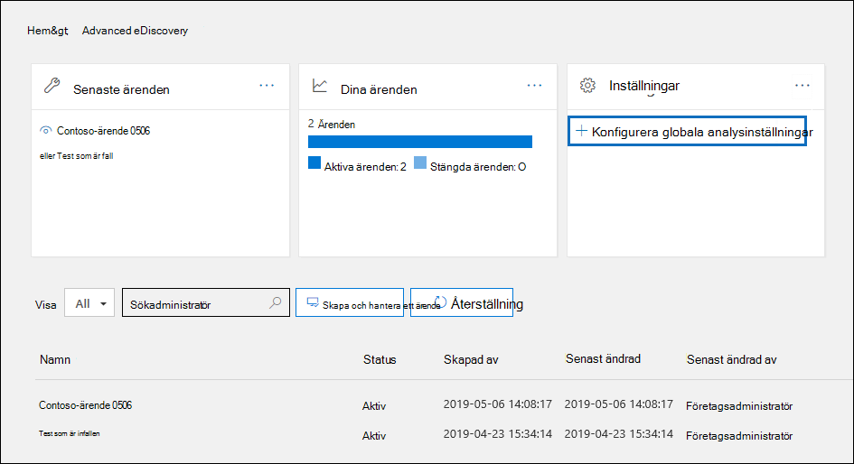
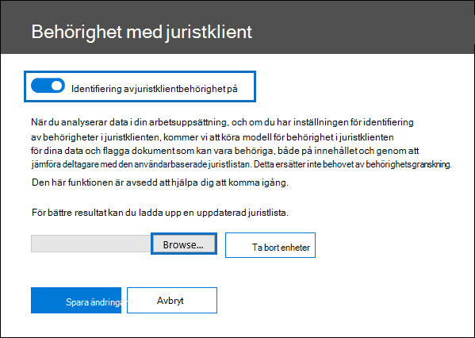
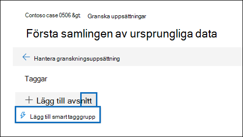
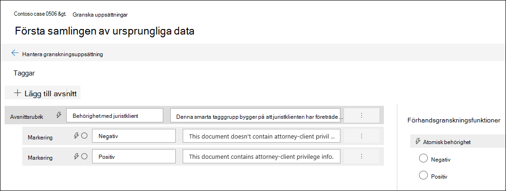
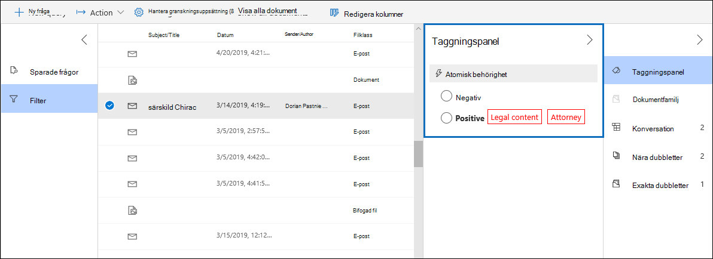
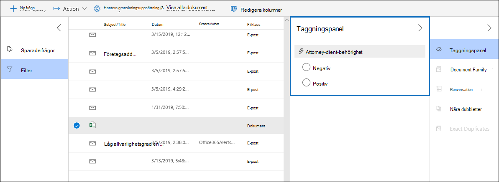

# Konfigurera identifiering av behörigheter för juristklienter i Advanced eDiscovery

En viktig och kostsam del av granskningsfasen av en eDiscovery-process är att granska dokument för privilegierat innehåll. Advanced eDiscovery innehåller maskininlärningsbaserad identifiering av privilegierat innehåll för att effektivisera processen. Den här funktionen kallas identifiering *av klientbehörighet för jurister.*

## Hur fungerar det?

När identifiering av juristklienter är aktiverat bearbetas alla dokument i en granskningsuppsättning av modellen för identifiering av behörigheter i juristklienten när du analyserar [data](analyzing-data-in-review-set.md) i uppsättningen med granskare. Modellen söker efter två saker:

- Privilegierat innehåll – I modellen används maskininlärning för att avgöra hur troligt det är att dokumentet innehåller innehåll som är lagligt.

- Deltagare – Som en del av inställningarna för identifiering av juristklienter måste du skicka en lista med jurister för organisationen. Modellen jämför sedan deltagarna i dokumentet med juristlistan för att avgöra om ett dokument har minst en juristdeltagare.

Modellen ger följande tre egenskaper för varje dokument:

- **AttorneyClientPrivilegeScore:** Sannolikheten att dokumentet är lagligt. värdena för poäng är mellan **0** och **1.**

- **HasAttorney:** Den här egenskapen är **satt till sant** om en av dokumentdeltagarna finns med i juristlistan. annars är värdet **falskt.** Värdet är också inställt på **falskt** om organisationen inte har laddat upp en juristlista.

- **IsPrivilege:** Den här egenskapen  är inställd på sant om värdet för **AttorneyClientPrivilegeScore** är över tröskelvärdet eller om dokumentet har en juristdeltagare.  annars är värdet **falskt.**

Dessa egenskaper (och deras motsvarande värden) läggs till i dokumentets metadata i en granskningsuppsättning, enligt skärmbilden nedan:

De här tre egenskaperna är också sökbara i en granskningsuppsättning. Mer information finns i [Skapa en fråga för data i en granskningsuppsättning](review-set-search.md).

## Konfigurera modellen för identifiering av behörigheter i juristklienten

För att aktivera modellen för identifiering av behörigheter för juristklienten måste organisationen aktivera den och sedan ladda upp en juristlista.

### Steg 1: Aktivera identifiering av behörighet för juristklienten

En person som är eDiscovery-administratör i organisationen (medlem i undergruppen för eDiscovery-administratör i rollgruppen för eDiscovery-hanteraren) måste göra modellen tillgänglig i Advanced eDiscovery fall.

1. I Säkerhets- & efterlevnadscenter går du till **eDiscovery > Advanced eDiscovery**.

2. Klicka **Advanced eDiscovery** på Konfigurera globala **analysinställningar Inställningar** panelen på **startsidan för global analys.**

   

3. På fliken **Inställningar för analys** väljer du Hantera inställningen för **klientbehörighet för jurister.**

4. På den **utfällande sidan** med juristklienter använder du växlingsknappen för att aktivera funktionen och väljer sedan **Spara**.

### Steg 2: Upload en lista över jurister (valfritt)

För att till fullo utnyttja modellen för identifiering av  juristklienter  och använda resultaten från har juristen eller potentiellt privilegierad identifiering som beskrevs tidigare rekommenderar vi att du laddar upp en lista med e-postadresser för den medarbetare och juridisk personal som arbetar i organisationen. 

Så här laddar du upp en juristlista som ska användas med modellen för identifiering av behörigheter för juristklienten:

1. Skapa en .csv (utan rubrikrad) och lägg till e-postadressen för varje person på en separat rad. Spara filen på din lokala dator.

2. På **Advanced eDiscovery,** i panelen **Inställningar,** väljer du Konfigurera experimentella funktioner **och** sedan Hantera inställning för **klientbehörighet för jurister.**

   Sidan **Med behörigheten Juristklient** visas och växlingsknappen för identifiering av **klientbehörighet** för jurist är aktiverad.

   

3. Välj **Bläddra** och leta reda på och .csv filen som du skapade i steg 1.

4. Välj **Spara** för att ladda upp juristlistan.

## Använda modellen för identifiering av behörigheter med juristklienter

Följ stegen i det här avsnittet för att använda identifiering av behörigheter för juristklienter för dokument i en granskningsuppsättning.

### Steg 1: Skapa en smart etikettgrupp med modell för identifiering av behörigheter för juristklienter

Ett av de huvudsakliga sätten att visa resultatet av identifiering av behörigheter för juristklienter i granskningsprocessen är att använda en grupp med smarta etiketter. En smart etikettgrupp visar resultatet av identifiering av behörigheter för juristklienten och visar resultatet på rad bredvid taggarna i en grupp med smarta etiketter. På så sätt kan du snabbt identifiera dokument som kan vara behöriga under dokumentgranskning. Du kan också använda taggarna i gruppen för smarta etiketter om du vill tagga dokument som behöriga eller icke-behöriga. Mer information om smarta etiketter finns i [Konfigurera smarta etiketter i Advanced eDiscovery](smart-tags.md).

1. I granskningsuppsättningen som innehåller de dokument du analyserade i steg 1 väljer du **Hantera granskningsuppsättning** och sedan **Hantera taggar.**
 
2. Under **Taggar** väljer du 300-listan bredvid **Lägg till grupp** och väljer sedan Lägg till grupp för smarta **etiketter.**

   

3. På sidan **Välj en modell för din smarta etikett** väljer du Välj **bredvid** Behörighet **för juristklient.**

   En tagggrupp med **namnet Juristbehörighet** visas. Den innehåller två underordnade taggar med **namnet Positivt** **och** Negativt, som motsvarar möjliga resultat som skapas av modellen.

   

3. Byt namn på tagggruppen och taggarna efter behov för din granskning. Du kan till exempel byta namn på **Positivt till** **Privilegierad och** Negativt **till** **Inte behörig.**

### Steg 2: Analysera en granskningsuppsättning

När du analyserar dokumenten i en granskningsuppsättning körs även modellen för identifiering av juristklienter och motsvarande egenskaper (beskrivs i Hur fungerar [det?](#how-does-it-work) läggs till i alla dokument i granskningsuppsättningen. Mer information om hur du analyserar data i en granskningsuppsättning finns i [Analysera data i en granskningsuppsättning Advanced eDiscovery](analyzing-data-in-review-set.md).

### Steg 3: Använda gruppen för smarta etiketter för granskning av privilegierat innehåll

När du har analyserat granskningsuppsättningen och ställt in smarta etiketter är nästa steg att granska dokumenten. Om modellen har fastställt att dokumentet är potentiellt privilegierat visar motsvarande smarta etikett i panelen Märkning följande resultat som produceras av identifiering av behörigheter för juristklienten: 

- Om dokumentet har innehåll som kan vara  lagligt visas etiketten Juridiskt innehåll bredvid motsvarande smart etikett (vilket i det här fallet är standardinställningen **För** positiv etikett).

- Om dokumentet innehåller en deltagare som finns med i organisationens juristlista visas etiketten Jurist bredvid motsvarande smart etikett (vilket i det här fallet också är standardinställningen positiv **etikett).** 

- Om dokumentet har innehåll som kan vara lagligt och det finns  en deltagare  i juristlistan visas både innehållet i juridiska frågor och etiketterna för jurister.  

Om modellen avgör att ett dokument inte innehåller något juridiskt innehåll eller som inte innehåller en deltagare från juristlistan visas inget av etiketterna i märkningspanelen.

Följande skärmbilder visar till exempel två dokument. Den första innehåller innehåll som är lagligt och innehåller en deltagare som finns med i listan över jurister. Det andra innehåller varken etiketter eller etiketter.

När du har granskat ett dokument för att se om det innehåller behörighetsinnehåll kan du tagga dokumentet med rätt tagg.
