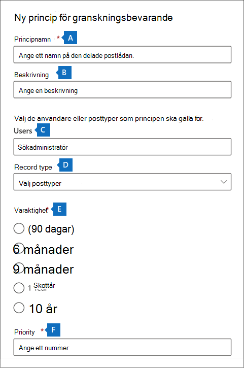

# <a name="manage-audit-log-retention-policies"></a>Hantera kvarhållningsprinciper för granskningsloggar

Du kan skapa och hantera kvarhållningsprinciper för granskningsloggar i Säkerhets- och efterlevnadscenter. Kvarhållningsprinciper för granskningsloggar är en del av de nya funktionerna för avancerad granskning i Microsoft 365. Med en kvarhållningsprincip för granskningsloggar kan du ange hur lång tid granskningsloggar ska behållas i organisationen. Du kan behålla granskningsloggar i upp till 10 år. Du kan skapa principer baserat på följande villkor:

- Alla aktiviteter i en eller flera Microsoft 365-tjänster

- Specifika aktiviteter (i en Microsoft 365-tjänst) som utförs av alla användare eller av specifika användare

- En prioritetsnivå som anger vilken princip som har företräde om det finns flera principer i organisationen

## <a name="default-audit-log-retention-policy"></a>Standardkvarhållningsprincip för granskningsloggar

Avancerad granskning i Microsoft 365 tillhandahåller en standardkvarhållningsprincip för granskningsloggar för alla organisationer. Den här principen behåller alla granskningsposter för Exchange Online, SharePoint Online, OneDrive för företag och Azure Active Directory i ett år. Den här standardprincipen behåller granskningsposter som innehåller värdet för **Exchange**, **SharePoint**, **OneDrive**, **AzureActiveDirectory** för egenskapen **Arbetsbelastning** (tjänsten där aktiviteten inträffade). Standardprincipen kan inte ändras. I avsnittet [Mer information](#more-information) i den här artikeln finns en lista över posttyper för varje arbetsbelastning som ingår i standardprincipen.

> [!NOTE]
> Standardkvarhållningsprincipen för granskningsloggar gäller endast granskningsposter för aktiviteter som utförs av användare som har tilldelats en Office 365- eller Microsoft 365 E5-licens eller har en tilläggslicens för Microsoft 365 E5 Compliance eller E5 eDiscovery och granskning. Om det finns användare som inte använder E5 eller gästanvändare i organisationen behålls deras motsvarande granskningsposter i 90 dagar.

## <a name="before-you-create-an-audit-log-retention-policy"></a>Innan du skapar en kvarhållningsprincip för granskningsloggar

- Du måste ha tilldelats rollen Organisationskonfiguration i Säkerhets- och efterlevnadscenter för att kunna skapa eller ändra en kvarhållningsprincip för granskning.

- Du kan ha högst 50 kvarhållningsprinciper för granskningsloggar i organisationen.

- För att behålla en granskningslogg mer än 90 dagar (och upp till 1 år) måste användaren som skapar granskningsloggen (genom att utföra en granskad aktivitet) ha tilldelats en Office 365 E5- eller Microsoft 365 E5-licens eller ha en tilläggslicens för Microsoft 365 E5 Compliance eller E5 eDiscovery och granskning. För att behålla granskningsloggar i 10 år måste användaren som skapar granskningsloggen också ha tilldelats en 10-årig tilläggslicens för kvarhållning av granskningsloggar utöver en E5-licens.

- Alla anpassade kvarhållningsprinciper för granskningsloggar (som skapats av organisationen) har företräde framför standardkvarhållningsprincipen. Om du till exempel skapar en kvarhållningsprincip för granskningsloggar för Exchange-postlådeaktivitet som har en kvarhållningsperiod som är kortare än ett år behålls granskningsposter för Exchange-postlådeaktiviteter under den kortare varaktighet som anges av den anpassade principen.

## <a name="create-an-audit-log-retention-policy"></a>Skapa en kvarhållningsprincip för granskningsloggar

1. Gå till [https://compliance.microsoft.com](https://compliance.microsoft.com) och logga in med ett användarkonto som har tilldelats rollen Organisationskonfiguration på sidan Behörigheter i Säkerhets- och efterlevnadscenter.

2. I det vänstra fönstret i Microsoft 365 Efterlevnadscenter klickar du på **Visa alla** och sedan på **Granskning**.

3. Klicka på fliken **Kvarhållningsprinciper för granskning**.

4. Klicka på **Skapa kvarhållningsprincip för granskning** och fyll sedan i följande fält på den utfällbara sidan:

    

   1. **Principnamn:** Namnet på kvarhållningsprincipen för granskningsloggar. Det här namnet måste vara unikt i din organisation och kan inte ändras när principen har skapats.

   2. **Beskrivning:** Valfritt, men användbart för att ge information om principen, till exempel posttyp eller arbetsbelastning, användare som har angetts i principen och varaktighet.

   3. **Användare:** Välj en eller flera användare som principen ska gälla för. Om du lämnar rutan tom gäller principen för alla användare. Om du lämnar **Posttyp** tom måste du välja en användare.

   4. **Posttyp:** Den granskningsposttyp som principen gäller för. Om du lämnar egenskapen tom måste du välja en användare i rutan **Användare**. Du kan välja en enskild posttyp eller flera posttyper:

   - Om du väljer en enskild posttyp visas fältet **Aktiviteter** dynamiskt. Du kan använda listrutan för att välja aktiviteter från den valda posttypen som principen ska gälla för. Om du inte väljer specifika aktiviteter gäller principen för alla aktiviteter för den valda posttypen.

   - Om du väljer flera posttyper kan du inte välja aktiviteter. Principen gäller för alla aktiviteter för de valda posttyperna.

   5. **Varaktighet:** Hur lång tid granskningsloggar som uppfyller principens villkor ska behållas.

   6. **Prioritet:** Det här värdet bestämmer i vilken ordning kvarhållningsprinciper för granskningsloggar i organisationen bearbetas. Ett lägre värde anger en högre prioritet. Giltiga prioriteter är numeriska värden mellan **1** och **10000**. Värdet **1** har högsta prioritet, och det lägsta värdet **1 0000** har den lägsta prioriteten. En princip som har ett värde på **5** har företräde framför en princip med värdet **10**. Som tidigare beskrivits har alla anpassade kvarhållningsprinciper för granskningsloggar företräde framför organisationens standardprincip.

5. Klicka på **Spara** för att skapa den nya kvarhållningsprincipen för granskningsloggar.

   Den nya principen visas i listan på fliken **Kvarhållningsprinciper för granskning**.

## <a name="manage-audit-log-retention-policies"></a>Hantera kvarhållningsprinciper för granskningsloggar

Kvarhållningsprinciper för granskningsloggar visas på fliken **Kvarhållningsprinciper för granskning** (kallas även *instrumentpanelen*). Du kan använda instrumentpanelen för att visa, redigera och ta bort kvarhållningsprinciper för granskning.

### <a name="view-policies-in-the-dashboard"></a>Visa principer på instrumentpanelen

Kvarhållningsprinciper för granskningsloggar visas på instrumentpanelen. En fördel med att visa principer på instrumentpanelen är att du kan klicka på kolumnen **Prioritet** för att visa principerna i den prioritet som de tillämpas. Som beskrivits tidigare anger ett högre värde en högre prioritet.


Du kan också välja en princip för att visa dess inställningar på den utfällbara sidan.

> [!NOTE]
> Organisationens standardkvarhållningsprincip för granskningsloggar visas inte på instrumentpanelen.

### <a name="edit-policies-in-the-dashboard"></a>Redigera principer på instrumentpanelen

Om du vill redigera en princip markerar du den för att visa den utfällbara sidan. Du kan ändra en eller flera inställningar och sedan spara ändringarna.


> [!IMPORTANT]
> Om du använder cmdleten **New-UnifiedAuditLogRetentionPolicy** kan du skapa en kvarhållningsprincip för granskningsloggar för posttyper eller aktiviteter som inte är tillgängliga i verktyget **Skapa kvarhållningsprincip för granskning** på instrumentpanelen. I det här fallet kan du inte redigera principen (till exempel ändra kvarhållningens varaktighet eller lägga till och ta bort aktiviteter) på instrumentpanelen **Kvarhållningsprinciper för granskning**. Du kan bara visa och ta bort principen i efterlevnadscentret. För att redigera principen måste du använda cmdleten [Set-UnifiedAuditLogRetentionPolicy](/powershell/module/exchange/set-unifiedauditlogretentionpolicy) i Säkerhets- och efterlevnadscenter PowerShell.<br/><br/>**Tips:** Ett meddelande visas längst upp på den utfällbara sidan för principer som måste redigeras med PowerShell.

### <a name="delete-policies-in-the-dashboard"></a>Ta bort principer på instrumentpanelen

Om du vill ta bort en princip klickar du på ikonen **Ta bort**  och bekräftar sedan att du vill ta bort principen. Principen tas bort från instrumentpanelen men det kan ta upp till 30 minuter innan principen tas bort från organisationen.

## <a name="create-and-manage-audit-log-retention-policies-in-powershell"></a>Skapa och hantera kvarhållningsprinciper för granskningsloggar i PowerShell

Du kan också använda Säkerhets- och efterlevnadscenter PowerShell för att skapa och hantera kvarhållningsprinciper för granskningsloggar. En anledning att använda PowerShell är att skapa en princip för en posttyp eller aktivitet som inte är tillgänglig i användargränssnittet.

### <a name="create-an-audit-log-retention-policy-in-powershell"></a>Skapa en kvarhållningsprincip för granskningsloggar i PowerShell

Följ de här anvisningarna för att skapa en kvarhållningsprincip för granskningsloggar i PowerShell:

1. [Anslut till Säkerhets- och efterlevnadscenter PowerShell](/powershell/exchange/connect-to-scc-powershell).

2. Kör följande kommando för att skapa en kvarhållningsprincip för granskningsloggar.

   ```powershell
   New-UnifiedAuditLogRetentionPolicy -Name "Microsoft Teams Audit Policy" -Description "One year retention policy for all Microsoft Teams activities" -RecordTypes MicrosoftTeams -RetentionDuration TenYears -Priority 100
   ```

    I det här exemplet skapas en kvarhållningsprincip för granskningsloggar med namnet "Microsoft Teams Audit Policy" med dessa inställningar:

   - En beskrivning av principen.

   - Behåller alla Microsoft Teams-aktiviteter (så som definieras av parametern *RecordType*).

   - Behåller Microsoft Teams-granskningsloggar i 10 år.

   - Prioriteten 100.

Här är ett annat exempel på hur du skapar en kvarhållningsprincip för granskningsloggar. Den här principen behåller granskningsloggar för aktiviteten "Användare loggade in" i sex månader för användaren admin@contoso.onmicrosoft.com.

```powershell
New-UnifiedAuditLogRetentionPolicy -Name "SixMonth retention for admin logons" -RecordTypes AzureActiveDirectoryStsLogon -Operations UserLoggedIn -UserIds admin@contoso.onmicrosoft.com -RetentionDuration SixMonths -Priority 25
```

Mer information finns i [New-UnifiedAuditLogRetentionPolicy](/powershell/module/exchange/new-unifiedauditlogretentionpolicy).

### <a name="view-policies-in-powershell"></a>Visa principer i PowerShell

Använd cmdleten [Get-UnifiedAuditLogRetentionPolicy](/powershell/module/exchange/get-unifiedauditlogretentionpolicy) i Säkerhets- och efterlevnadscenter PowerShell för att visa kvarhållningsprinciper för granskningsloggar.

Här är ett exempelkommando som visar inställningarna för alla kvarhållningsprinciper för granskningsloggar i organisationen. Det här kommandot sorterar principerna från högsta till lägsta prioritet.

```powershell
Get-UnifiedAuditLogRetentionPolicy | Sort-Object -Property Priority -Descending | FL Priority,Name,Description,RecordTypes,Operations,UserIds,RetentionDuration
```

> [!NOTE]
> Cmdleten **Get-UnifiedAuditLogRetentionPolicy** returnerar inte standardkvarhållningsprincipen för granskningsloggar för organisationen.

### <a name="edit-policies-in-powershell"></a>Redigera principer i PowerShell

Använd cmdleten [Set-UnifiedAuditLogRetentionPolicy](/powershell/module/exchange/set-unifiedauditlogretentionpolicy) i Säkerhets- och efterlevnadscenter PowerShell för att redigera en befintlig kvarhållningsprincip för granskningsloggar.

### <a name="delete-policies-in-powershell"></a>Ta bort principer i PowerShell

Använd cmdleten [Remove-UnifiedAuditLogRetentionPolicy](/powershell/module/exchange/remove-unifiedauditlogretentionpolicy) i Säkerhets- och efterlevnadscenter PowerShell för att ta bort en kvarhållningsprincip för granskningsloggar. Det kan ta upp till 30 minuter innan principen tas bort från organisationen.

## <a name="more-information"></a>Mer information

Som tidigare beskrivits behålls granskningsposter för åtgärder i Azure Active Directory, Exchange Online, SharePoint Online och OneDrive för företag i ett år som standard. I följande tabell visas alla posttyper (för var och en av de här tjänsterna) som ingår i standardkvarhållningsprincipen för granskningsloggar. Det innebär att granskningsloggar för en åtgärd med den här posttypen behålls i ett år såvida inte en anpassad kvarhållningsprincip för granskningsloggar har företräde för en viss posttyp, åtgärd eller användare. Uppräkningsvärdet (som visas som värdet för egenskapen RecordType i en granskningspost) för varje posttyp visas inom parentes.

|AzureActiveDirectory |Exchange  |SharePoint eller OneDrive|
|:---------|:---------|:---------|
|AzureActiveDirectory (8)|ExchangeAdmin (1)|ComplianceDLPSharePoint (11)|
|AzureActiveDirectoryAccountLogon (9)|ExchangeItem (2)|ComplianceDLPSharePointClassification (33)|
|AzureActiveDirectoryStsLogon (15)|Kampanj (62)|Projekt (35)|
||ComplianceDLPExchange (13)|SharePoint (4)|
||ComplianceSupervisionExchange (68)|SharePointCommentOperation (37)|
||CustomerKeyServiceEncryption (69)|SharePointContentTypeOperation (55)|
||ExchangeAggregatedOperation (19)|SharePointFieldOperation (56)|
||ExchangeItemAggregated (50)|SharePointFileOperation (6)|
||ExchangeItemGroup (3)|SharePointListOperation (36)|
||InformationBarrierPolicyApplication (53)|SharePointSharingOperation (14)|
||||
